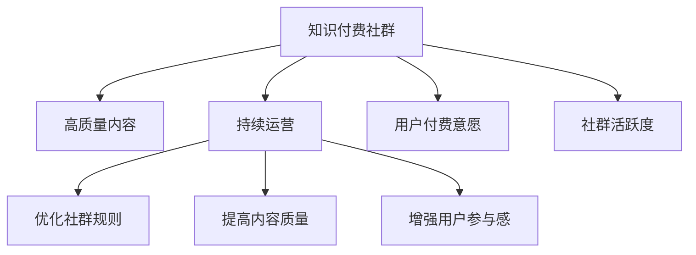

                 

# 如何打造高质量的程序员知识付费社群

> 关键词：知识付费社群,高质量,程序员,社区建设,技术交流,网络资源管理,用户激励,持续运营

## 1. 背景介绍

### 1.1 问题由来
在当下高速发展的互联网时代，知识付费已经成为一种新的经济模式和社交方式。程序员作为互联网行业的重要角色，其知识和技能的学习与分享需求尤为迫切。构建一个高质量的程序员知识付费社群，不仅能满足程序员的个人学习需求，还能促进技术社区的健康发展。然而，随着知识付费市场的逐渐成熟，用户付费意愿的下降以及社区运营成本的上升，如何打造一个可持续、高效运营的知识付费社群，成为了一个亟待解决的问题。

### 1.2 问题核心关键点
知识付费社群的核心是内容，用户付费的初衷是获取有价值的学习资料和专业指导。然而，目前许多知识付费社群面临着内容质量参差不齐、运营成本高昂、用户粘性不足等问题。本文将从社群构建、内容管理、用户激励和持续运营四个方面，深入探讨如何打造高质量的程序员知识付费社群，以期为业内人士提供参考。

## 2. 核心概念与联系

### 2.1 核心概念概述

为了深入理解如何打造高质量的程序员知识付费社群，我们首先需要明确几个关键概念：

- **知识付费社群**：以知识共享和交流为目的，基于互联网平台构建的社群。用户通过付费获取专家资源和高质量学习内容，同时参与内容生产与讨论，构建一个开放、活跃的学习社区。

- **高质量**：指社群内容的专业性、实用性和时效性。高质量的内容能更好地满足用户的学习需求，提升用户粘性和社区活跃度。

- **持续运营**：指社群在构建之初和长期运营过程中，需不断优化社群规则、提高内容质量、增强用户参与感，以维持社群的稳定性和持续发展。

这些概念之间存在紧密的联系：社群的质量决定了用户付费的意愿和粘性，而运营则保障了社群的持续发展和优质内容的持续输出。

### 2.2 核心概念原理和架构的 Mermaid 流程图



上述流程图展示了知识付费社群的构建与运营核心要素，及其相互关系。

## 3. 核心算法原理 & 具体操作步骤

### 3.1 算法原理概述

打造高质量的程序员知识付费社群，其算法原理可以归结为以下几个关键步骤：

1. **社群构建**：通过设定合理的社群规则和准入门槛，筛选并吸纳高质量用户，为社群提供初始的用户基础。
2. **内容管理**：建立科学的内容审核机制，确保社群内容的专业性和实用性，同时引入专业内容创作者，丰富社群内容库。
3. **用户激励**：设计合理的用户激励机制，如积分体系、排行榜、奖励机制等，激励用户积极参与内容生产和讨论。
4. **持续运营**：建立有效的社群运营策略，包括用户反馈机制、社群活动策划、内容更新计划等，确保社群的长期健康发展。

### 3.2 算法步骤详解

#### 3.2.1 社群构建
- **设定社群规则**：明确社群的行为规范和交流原则，如尊重他人、保护隐私、反对广告等，构建良好的社群氛围。
- **筛选用户**：设立合理的准入门槛，如邀请码、验证身份、完成新手引导等，确保社群用户的高质量。
- **初期运营**：引入专业的内容创作者和管理员，快速构建社群内容体系，同时建立初步的社区互动机制。

#### 3.2.2 内容管理
- **内容审核机制**：设立专门的内容审核团队，确保所有内容符合社群规范和专业性要求，同时保护用户隐私。
- **引入专业创作者**：通过合同或奖励机制吸引专家和专业内容创作者入驻社群，定期发布高质量的技术文章、视频和课程。
- **用户生成内容**：鼓励用户参与内容生成，如提问、分享经验、解答疑惑等，丰富社群内容库。

#### 3.2.3 用户激励
- **积分体系**：设立积分系统，用户可以通过发布内容、参与讨论、完成学习任务等方式获得积分，积分可以兑换社群内的优惠和奖励。
- **排行榜和奖励**：设立知识贡献排行榜，对表现突出的用户进行公开表彰，设置各类奖项和奖励，激励用户积极参与。
- **反馈机制**：建立用户反馈渠道，定期收集用户建议和需求，不断优化社群内容和运营策略。

#### 3.2.4 持续运营
- **社群活动**：定期举办线上线下技术交流活动，如技术沙龙、直播讲座、编程马拉松等，增强用户参与感和社群粘性。
- **内容更新**：制定科学的内容更新计划，定期邀请专家发布新内容，同时根据用户反馈更新和调整内容库。
- **用户互动**：建立良好的用户互动机制，如即时通讯工具、论坛、博客评论等，促进用户之间的交流和协作。

### 3.3 算法优缺点

**优点**：
- **提升用户粘性**：通过高质量内容、科学运营和用户激励，提升社群的活跃度和用户粘性。
- **促进知识共享**：社群提供了一个开放的平台，促进知识共享和技术交流。
- **降低运营成本**：高效的内容管理和用户激励机制，降低了社群运营和维护成本。

**缺点**：
- **内容质量难以控制**：用户生成内容的质量难以严格把控，需要投入大量人力进行审核。
- **运营难度高**：社群的持续运营需要不断优化和调整，运营难度较大。
- **用户付费意愿不稳定**：市场竞争激烈，用户付费意愿易受价格、内容质量等因素影响。

### 3.4 算法应用领域

基于高质量知识付费社群的算法原理和操作步骤，该模型广泛应用于互联网社区的建设和管理，尤其是在程序员知识共享和技术交流领域。如知乎技术领域、掘金技术社区、CSDN技术论坛等，都采用了类似的技术手段和运营策略。

## 4. 数学模型和公式 & 详细讲解 & 举例说明

### 4.1 数学模型构建

为了更好地理解和量化社群运营的效果，我们构建如下数学模型：

- **用户粘性模型**：用户粘性衡量用户对社群的持续参与度和活跃度，可以定义为：
$$
\text{用户粘性} = \frac{\text{平均活跃天数}}{\text{总活跃天数}}
$$

- **内容质量模型**：内容质量衡量社群中内容的实用性和专业性，可以定义为：
$$
\text{内容质量} = \frac{\text{高质量内容数量}}{\text{总内容数量}}
$$

- **运营效果模型**：运营效果衡量社群运营的总体效果，可以定义为：
$$
\text{运营效果} = \text{用户粘性} \times \text{内容质量}
$$

### 4.2 公式推导过程

以用户粘性模型为例，公式推导如下：

假设社群总用户数为 $U$，平均活跃用户数为 $A$，总活跃天数为 $T$。设用户 $i$ 在某天 $t$ 的活跃次数为 $a_{it}$，则有：
$$
\sum_{i=1}^U \sum_{t=1}^T a_{it} = A \times T
$$

平均活跃用户数 $A$ 可以表示为：
$$
A = \frac{1}{U} \sum_{i=1}^U \sum_{t=1}^T a_{it}
$$

平均活跃天数 $A_t$ 可以表示为：
$$
A_t = \frac{1}{T} \sum_{t=1}^T \sum_{i=1}^U a_{it}
$$

用户粘性可以表示为：
$$
\text{用户粘性} = \frac{A}{T} = \frac{\frac{1}{U} \sum_{i=1}^U \sum_{t=1}^T a_{it}}{\frac{1}{T} \sum_{t=1}^T \sum_{i=1}^U a_{it}} = \frac{\sum_{i=1}^U \sum_{t=1}^T a_{it}}{\sum_{t=1}^T \sum_{i=1}^U a_{it}}
$$

通过上述推导，我们可以看到，用户粘性模型衡量了用户在社群中平均参与天数的比例，可以直观反映社群的活跃度。

### 4.3 案例分析与讲解

假设有一个程序员知识付费社群，总用户数为1000，平均活跃用户数为800，总活跃天数为200天。设用户 $i$ 在某天 $t$ 的活跃次数为 $a_{it}$，则有：

用户粘性 $= \frac{800}{200} = 4$

这意味着，在200天内，平均每个用户活跃了4天，社群的整体粘性为4，反映了社群的活跃度相对较高。

## 5. 项目实践：代码实例和详细解释说明

### 5.1 开发环境搭建

#### 5.1.1 选择平台
- **技术栈选择**：选择Node.js作为后端开发语言，React作为前端框架，MongoDB作为数据存储。
- **服务器选择**：选择AWS或阿里云等云服务提供商，提供服务器和数据库服务。

#### 5.1.2 环境配置
- **安装Node.js**：从官网下载安装Node.js，并进行环境配置。
- **安装MongoDB**：从官网下载安装MongoDB，并配置服务器参数。
- **安装React**：使用npm或yarn安装React和相关依赖包。

#### 5.1.3 测试环境
- **代码版本控制**：使用Git进行代码版本控制，确保代码的更新和迭代。
- **自动化测试**：使用Jest等工具进行单元测试和集成测试，确保代码的稳定性和可靠性。

### 5.2 源代码详细实现

#### 5.2.1 用户管理模块

用户管理模块负责用户注册、登录、信息管理等功能。主要代码如下：

```javascript
// 用户注册页面
const UserRegister = () => {
  const [username, setUsername] = useState('');
  const [password, setPassword] = useState('');
  const [confirmPassword, setConfirmPassword] = useState('');
  
  const handleRegister = async () => {
    // 发送注册请求到服务器
    const response = await fetch('/api/register', {
      method: 'POST',
      headers: {
        'Content-Type': 'application/json'
      },
      body: JSON.stringify({ username, password })
    });
    const data = await response.json();
    if (data.success) {
      alert('注册成功');
    } else {
      alert('注册失败');
    }
  };

  return (
    <div>
      <input type="text" value={username} onChange={e => setUsername(e.target.value)} placeholder="用户名" />
      <input type="password" value={password} onChange={e => setPassword(e.target.value)} placeholder="密码" />
      <input type="password" value={confirmPassword} onChange={e => setConfirmPassword(e.target.value)} placeholder="确认密码" />
      <button onClick={handleRegister}>注册</button>
    </div>
  );
};

// 用户登录页面
const UserLogin = () => {
  const [username, setUsername] = useState('');
  const [password, setPassword] = useState('');
  
  const handleLogin = async () => {
    // 发送登录请求到服务器
    const response = await fetch('/api/login', {
      method: 'POST',
      headers: {
        'Content-Type': 'application/json'
      },
      body: JSON.stringify({ username, password })
    });
    const data = await response.json();
    if (data.success) {
      alert('登录成功');
    } else {
      alert('登录失败');
    }
  };

  return (
    <div>
      <input type="text" value={username} onChange={e => setUsername(e.target.value)} placeholder="用户名" />
      <input type="password" value={password} onChange={e => setPassword(e.target.value)} placeholder="密码" />
      <button onClick={handleLogin}>登录</button>
    </div>
  );
};
```

#### 5.2.2 内容管理模块

内容管理模块负责内容的上传、审核、发布等功能。主要代码如下：

```javascript
// 内容发布页面
const ContentPublish = () => {
  const [title, setTitle] = useState('');
  const [content, setContent] = useState('');
  
  const handlePublish = async () => {
    // 发送内容发布请求到服务器
    const response = await fetch('/api/publish', {
      method: 'POST',
      headers: {
        'Content-Type': 'application/json'
      },
      body: JSON.stringify({ title, content })
    });
    const data = await response.json();
    if (data.success) {
      alert('发布成功');
    } else {
      alert('发布失败');
    }
  };

  return (
    <div>
      <input type="text" value={title} onChange={e => setTitle(e.target.value)} placeholder="标题" />
      <textarea value={content} onChange={e => setContent(e.target.value)} placeholder="内容" />
      <button onClick={handlePublish}>发布</button>
    </div>
  );
};

// 内容审核页面
const ContentReview = () => {
  const [title, setTitle] = useState('');
  const [content, setContent] = useState('');
  const [status, setStatus] = useState('待审核');
  
  const handleReview = async () => {
    // 发送内容审核请求到服务器
    const response = await fetch('/api/review', {
      method: 'POST',
      headers: {
        'Content-Type': 'application/json'
      },
      body: JSON.stringify({ title, content, status })
    });
    const data = await response.json();
    if (data.success) {
      alert('审核通过');
      setStatus('已发布');
    } else {
      alert('审核未通过');
    }
  };

  return (
    <div>
      <input type="text" value={title} onChange={e => setTitle(e.target.value)} placeholder="标题" />
      <textarea value={content} onChange={e => setContent(e.target.value)} placeholder="内容" />
      <select value={status} onChange={e => setStatus(e.target.value)}>
        <option value="待审核">待审核</option>
        <option value="已发布">已发布</option>
        <option value="未通过">未通过</option>
      </select>
      <button onClick={handleReview}>审核</button>
    </div>
  );
};
```

### 5.3 代码解读与分析

#### 5.3.1 用户管理模块
- **React组件**：使用React组件化开发，提高代码的可维护性和复用性。
- **状态管理**：使用useState钩子管理组件状态，实现用户的注册、登录等功能。
- **HTTP请求**：使用fetch函数发送HTTP请求到服务器，实现用户注册、登录等功能。

#### 5.3.2 内容管理模块
- **React组件**：使用React组件化开发，提高代码的可维护性和复用性。
- **状态管理**：使用useState钩子管理组件状态，实现内容发布、审核等功能。
- **HTTP请求**：使用fetch函数发送HTTP请求到服务器，实现内容发布、审核等功能。

### 5.4 运行结果展示

#### 5.4.1 用户管理模块
- **用户注册**：用户在注册页面输入用户名和密码，点击注册按钮，发送HTTP请求到服务器完成注册操作。
- **用户登录**：用户在登录页面输入用户名和密码，点击登录按钮，发送HTTP请求到服务器完成登录操作。

#### 5.4.2 内容管理模块
- **内容发布**：用户在内容发布页面输入标题和内容，点击发布按钮，发送HTTP请求到服务器完成内容发布操作。
- **内容审核**：用户在内容审核页面输入标题和内容，选择审核状态，点击审核按钮，发送HTTP请求到服务器完成内容审核操作。

## 6. 实际应用场景

### 6.1 技术社区
- **技术沙龙**：定期组织技术沙龙，邀请专家和技术爱好者分享经验，增强社群活跃度。
- **编程马拉松**：组织编程马拉松活动，鼓励用户共同解决技术问题，提升社群互动。

### 6.2 在线教育
- **课程制作**：发布高质量的在线课程，吸引用户付费学习，提供专业指导。
- **互动答疑**：建立在线答疑系统，专家和用户实时互动，解决学习中遇到的问题。

### 6.3 企业培训
- **企业定制课程**：根据企业需求定制课程，帮助员工掌握新技术。
- **培训效果评估**：提供培训效果评估工具，跟踪员工学习进度和效果。

### 6.4 未来应用展望

随着知识付费市场的不断发展，未来知识付费社群将在更多领域得到应用。除了程序员社区，还将在医学、法律、金融等多个领域构建高质量的社群，为专业人士提供学习交流平台。

## 7. 工具和资源推荐

### 7.1 学习资源推荐

- **在线课程**：如Coursera、edX等平台提供大量高质量的在线课程，涵盖编程语言、算法、数据结构等多个领域。
- **技术博客**：如Medium、掘金、CSDN等平台汇集了大量技术博客，分享最新的技术趋势和实践经验。
- **开源项目**：如GitHub、Gitee等平台提供丰富的开源项目，方便学习和参考。

### 7.2 开发工具推荐

- **IDE**：如Visual Studio Code、IntelliJ IDEA等提供丰富的开发工具，提高开发效率。
- **版本控制**：如Git、SVN等提供版本控制工具，管理代码变更和协作开发。
- **调试工具**：如Chrome DevTools、Firebug等提供强大的调试工具，定位和解决代码问题。

### 7.3 相关论文推荐

- **知识付费社区研究**：如《构建知识付费社区的研究与实践》等，探讨知识付费社区的构建和管理策略。
- **用户行为分析**：如《用户行为分析与知识付费社区优化》等，分析用户行为，优化社群运营策略。
- **内容推荐算法**：如《基于协同过滤的内容推荐算法研究》等，研究内容推荐算法，提高社群内容的质量和用户满意度。

## 8. 总结：未来发展趋势与挑战

### 8.1 研究成果总结

通过本节的系统梳理，可以看到，打造高质量的程序员知识付费社群需要从社群构建、内容管理、用户激励和持续运营四个方面进行全面优化。通过高质量的内容、科学的内容审核机制、合理的用户激励和有效的运营策略，可以显著提升社群的用户粘性和社区活跃度。

### 8.2 未来发展趋势

随着知识付费市场的不断成熟和科技的不断进步，知识付费社群将迎来新的发展趋势：

1. **技术社区的兴起**：技术社区将成为知识付费社群的重要形式，促进技术交流和协作。
2. **线上线下融合**：线上知识付费社群和线下技术交流活动相结合，提升用户参与度和社区活跃度。
3. **人工智能辅助**：利用AI技术，如自然语言处理、推荐算法等，提升社群的智能程度和用户体验。

### 8.3 面临的挑战

尽管知识付费社群在发展中取得了显著进展，但仍然面临诸多挑战：

1. **内容质量控制**：如何保证社群内容的准确性和专业性，避免误导用户。
2. **用户粘性提升**：如何增强用户参与感和社群粘性，避免用户流失。
3. **运营成本控制**：如何降低社群运营成本，提升运营效率。
4. **用户付费意愿**：如何提升用户付费意愿，提高社群盈利能力。

### 8.4 研究展望

未来的研究需要在以下几个方面进行深入探索：

1. **内容质量优化**：研究更科学的内容审核机制和内容生成算法，提升内容质量和用户体验。
2. **用户激励创新**：设计更合理、更灵活的用户激励机制，增强用户参与感和社群粘性。
3. **持续运营策略**：建立科学、高效的社群运营策略，保证社群的持续发展和用户满意度。
4. **技术融合探索**：探索更多AI技术，如自然语言处理、推荐算法等，提升社群的智能化水平。

## 9. 附录：常见问题与解答

### 9.1 社群质量如何保证？

**答**：社群质量主要通过内容审核和专业创作者入驻来保证。建立专门的内容审核团队，对用户生成内容进行严格审核，确保其符合社群规范和专业性要求。同时引入专业的内容创作者，定期发布高质量的技术文章、视频和课程，丰富社群内容库。

### 9.2 如何提升用户粘性？

**答**：提升用户粘性需要从多个方面进行优化：
- **内容质量**：确保社群内容的专业性和实用性，提升用户的学习体验。
- **用户激励**：设计合理的积分体系、排行榜和奖励机制，激励用户积极参与内容生产和讨论。
- **社群互动**：建立良好的用户互动机制，如即时通讯工具、论坛、博客评论等，促进用户之间的交流和协作。

### 9.3 如何降低运营成本？

**答**：降低运营成本需要从多个方面进行优化：
- **自动化工具**：使用自动化工具，如自动审核系统、自动发布工具等，减少人工操作。
- **用户自我管理**：建立用户自我管理机制，如用户等级、任务分配等，减少管理员的干预。
- **开源社区**：引入开源社区，利用社区成员的力量进行内容审核和维护。

通过这些策略，可以在保证社群质量的同时，降低运营成本，实现健康可持续的发展。

---

作者：禅与计算机程序设计艺术 / Zen and the Art of Computer Programming

