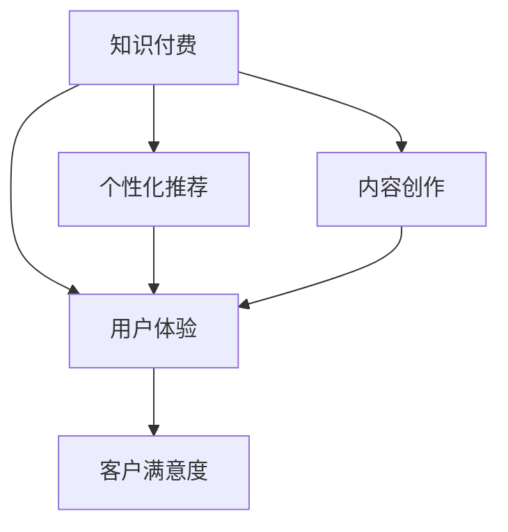

                 

# 如何提高知识付费产品的用户口碑

> 关键词：知识付费, 用户体验, 个性化推荐, 内容创作, 客户满意度

## 1. 背景介绍

随着知识经济的兴起，知识付费逐渐成为越来越多人获取知识、提升自我能力的重要方式。然而，用户口碑对于知识付费产品至关重要，直接影响了产品的市场竞争力和用户粘性。通过优化用户体验、个性化推荐、内容创作和客户满意度，可以有效提升知识付费产品的用户口碑。

## 2. 核心概念与联系

### 2.1 核心概念概述

为更好地理解提升知识付费产品用户口碑的方法，本节将介绍几个关键概念：

- **知识付费（Knowledge Subscription）**：指用户通过订阅形式，付费获取高质量知识内容。知识付费平台通过汇聚优质内容，帮助用户系统化、高效化地学习，提高职业能力或兴趣爱好。

- **用户体验（User Experience, UX）**：指用户在使用知识付费产品时，所感受到的界面美观、交互便捷、功能齐全等各方面的体验感受。良好的用户体验是提高用户口碑的基础。

- **个性化推荐（Personalized Recommendation）**：指利用用户的历史行为数据和兴趣偏好，推荐符合其个性化的知识内容，提升用户的发现感和满意度。

- **内容创作（Content Creation）**：指平台通过激励和引导内容创作者产出高质量、具有深度和价值的内容。优质内容是知识付费产品的核心竞争力。

- **客户满意度（Customer Satisfaction, CS）**：指用户对知识付费产品整体使用体验的满意程度，包括产品功能、内容质量、价格、服务等方面。

这些核心概念之间的逻辑关系可以通过以下Mermaid流程图来展示：



这个流程图展示了提升知识付费产品用户口碑的主要路径：

1. **知识付费** 平台作为基础。
2. **用户体验** 通过优化界面和交互设计提升。
3. **个性化推荐** 利用用户行为数据提升用户发现感。
4. **内容创作** 激发优质内容的产生。
5. **客户满意度** 是用户口碑的最终体现。

## 3. 核心算法原理 & 具体操作步骤
### 3.1 算法原理概述

提高知识付费产品用户口碑，本质上是一个跨领域的综合优化问题。其核心思想是：通过数据驱动的个性化推荐和优质的内容创作，提升用户体验，从而增加用户粘性和满意度。

形式化地，假设知识付费平台有 $U$ 个用户，$C$ 个内容，$X$ 为用户的兴趣向量，$Y$ 为内容的特征向量。通过用户行为数据 $D=\{(x_i,y_i)\}_{i=1}^N$，其中 $x_i$ 为用户的浏览、购买等行为，$y_i$ 为对应的内容ID。微调的目标是找到新的模型参数 $\theta$，使得用户体验和满意度最大化，即：

$$
\theta^* = \mathop{\arg\max}_{\theta} \mathcal{L}(U, C, X, Y, D)
$$

其中 $\mathcal{L}$ 为综合评价函数，综合考虑用户体验、个性化推荐、内容质量等因素。

通过梯度下降等优化算法，微调过程不断更新模型参数 $\theta$，最大程度提升用户体验和满意度，从而增加用户口碑。

### 3.2 算法步骤详解

基于上述框架，以下是提高知识付费产品用户口碑的详细操作步骤：

**Step 1: 数据收集与预处理**
- 收集用户的历史行为数据、购买记录、评分、评论等，生成用户行为数据集 $D$。
- 通过文本挖掘、标签标注等方式，提取内容的特征向量 $Y$。

**Step 2: 设计用户画像和内容画像**
- 对用户行为数据 $D$ 进行聚类、降维等处理，构建用户兴趣向量 $X$。
- 对内容特征向量 $Y$ 进行特征选择和归一化处理，构建内容画像。

**Step 3: 建立个性化推荐模型**
- 设计推荐算法，如协同过滤、矩阵分解、深度学习等，基于用户画像和内容画像构建推荐模型。
- 在推荐模型上训练、调优，生成推荐结果。

**Step 4: 内容创作与激励机制**
- 建立内容发布平台，提供创作工具和激励政策，引导优质内容产出。
- 通过用户反馈、评分等机制，评估内容质量，筛选优质内容。

**Step 5: 优化用户体验与客户服务**
- 通过UI/UX设计优化，提升用户界面和交互体验。
- 建立客户服务体系，提供即时反馈、答疑等服务。

**Step 6: 反馈与迭代**
- 定期收集用户反馈，评估产品性能。
- 根据反馈迭代优化推荐模型、内容创作机制和用户体验。

### 3.3 算法优缺点

提升知识付费产品用户口碑的方法具有以下优点：
1. 提高用户粘性。个性化推荐使得用户发现感增加，内容质量提升，从而提升用户粘性。
2. 促进内容创作。内容创作者激励机制的引入，能激发优质内容的持续产出。
3. 提升客户满意度。通过优化用户体验和客户服务，整体满意度提升，用户口碑改善。
4. 促进新用户转化。优质内容和用户体验，可以吸引更多新用户注册和使用。

同时，该方法也存在一些局限性：
1. 数据依赖性强。需要大量高质量的用户行为数据和内容数据，数据获取成本较高。
2. 推荐模型复杂。需要处理大规模用户和内容数据，算法复杂度较高，计算成本大。
3. 内容质量难以保证。优质内容创作仍需要高度依赖创作者素质，难以彻底解决内容同质化问题。
4. 用户体验优化难度大。优秀UI/UX设计师稀缺，优化用户体验需要时间和成本投入。

尽管存在这些局限性，但通过合理的数据处理、模型优化和用户体验设计，该方法仍能有效提升知识付费产品的用户口碑。

### 3.4 算法应用领域

提升知识付费产品用户口碑的方法，已经广泛应用于各大知识付费平台。以下是几个具体应用场景：

- **Coursera**：通过个性化推荐和优质课程产出，提升用户满意度，增加订阅用户。
- **得到App**：利用推荐算法和大咖课程，提供高质量知识内容，优化用户体验，提高用户黏性。
- **知乎live**：通过专家直播、互动答疑，提高用户互动性和满意度，同时引入内容创作者激励机制，丰富课程内容。

这些平台的成功实践证明了提升用户口碑的可行性。未来，随着技术的发展和市场需求的不断变化，该方法将在更多领域得到应用，为知识付费产品的创新和优化提供更多可能。

## 4. 数学模型和公式 & 详细讲解  
### 4.1 数学模型构建

基于用户行为数据和内容数据，我们设计了一个综合评价函数 $\mathcal{L}$ 来衡量用户体验和客户满意度。具体来说，我们将其分解为以下几部分：

1. **用户兴趣度**：通过用户行为数据的聚类和降维，构建用户兴趣向量 $X$。用户兴趣度 $u$ 可以通过余弦相似度计算：

$$
u_i = \cos(\theta_X, X_i)
$$

其中 $\theta_X$ 为用户的兴趣向量，$X_i$ 为第 $i$ 个用户的兴趣向量。

2. **内容质量**：通过内容特征向量的选择和归一化，构建内容画像 $Y$。内容质量 $c$ 可以通过平均用户评分 $s$ 来衡量：

$$
c_j = \frac{1}{N_i} \sum_{i=1}^N s_{ij}
$$

其中 $N_i$ 为内容 $j$ 的评分次数，$s_{ij}$ 为第 $i$ 个用户对内容 $j$ 的评分。

3. **个性化推荐效果**：通过协同过滤、深度学习等算法，生成推荐结果 $R$。推荐效果 $r$ 可以通过推荐准确率 $a$ 和多样性 $d$ 来衡量：

$$
r = \alpha a + \beta d
$$

其中 $\alpha$ 和 $\beta$ 为调节参数，$a$ 为推荐准确率，$d$ 为推荐多样性。

综合评价函数 $\mathcal{L}$ 可以表示为：

$$
\mathcal{L} = u + c + r
$$

### 4.2 公式推导过程

我们以协同过滤算法为例，推导个性化推荐效果的计算公式。

假设用户行为数据集 $D=\{(x_i,y_i)\}_{i=1}^N$，其中 $x_i$ 为用户的浏览、购买等行为，$y_i$ 为对应的内容ID。通过用户行为数据计算用户兴趣向量 $X$，内容特征向量 $Y$。

协同过滤算法基于用户-物品相似矩阵计算推荐结果，假设相似矩阵为 $S$。推荐结果 $R$ 可以通过矩阵乘法计算：

$$
R = S \times Y
$$

推荐准确率 $a$ 可以通过预测结果和实际结果之间的余弦相似度计算：

$$
a = \frac{1}{N} \sum_{i=1}^N \cos(R_i, Y_j)
$$

推荐多样性 $d$ 可以通过计算推荐结果的范数来衡量：

$$
d = \sqrt{\sum_{i=1}^N \sum_{j=1}^C R_{ij}^2}
$$

因此，推荐效果 $r$ 可以通过调节参数 $\alpha$ 和 $\beta$ 来平衡准确率和多样性：

$$
r = \alpha a + \beta d
$$

综合评价函数 $\mathcal{L}$ 可以通过公式计算：

$$
\mathcal{L} = u + c + r = \cos(\theta_X, X_i) + \frac{1}{N_i} \sum_{i=1}^N s_{ij} + \alpha \frac{1}{N} \sum_{i=1}^N \cos(R_i, Y_j) + \beta \sqrt{\sum_{i=1}^N \sum_{j=1}^C R_{ij}^2}
$$

### 4.3 案例分析与讲解

以得到App为例，分析其提升用户口碑的方法：

- **数据收集与预处理**：得到App通过用户浏览、购买、评分等行为数据，生成用户行为数据集 $D$，并提取内容特征向量 $Y$。
- **设计用户画像和内容画像**：得到App利用机器学习算法对用户行为数据进行聚类和降维，构建用户兴趣向量 $X$。同时，根据用户评论和内容标签，构建内容画像 $Y$。
- **建立个性化推荐模型**：得到App引入深度学习模型BERT，基于用户兴趣向量 $X$ 和内容画像 $Y$，生成推荐结果 $R$。
- **内容创作与激励机制**：得到App提供优质的创作平台和激励机制，引导大咖和创作者产出高质量内容。
- **优化用户体验与客户服务**：得到App通过UI/UX设计优化，提升用户体验。同时，建立快速响应的客户服务体系，提升用户满意度。

## 5. 项目实践：代码实例和详细解释说明
### 5.1 开发环境搭建

在进行项目实践前，我们需要准备好开发环境。以下是使用Python进行TensorFlow开发的环境配置流程：

1. 安装Anaconda：从官网下载并安装Anaconda，用于创建独立的Python环境。

2. 创建并激活虚拟环境：
```bash
conda create -n tf-env python=3.8 
conda activate tf-env
```

3. 安装TensorFlow：根据CUDA版本，从官网获取对应的安装命令。例如：
```bash
conda install tensorflow=2.5
```

4. 安装其他必要的工具包：
```bash
pip install pandas numpy matplotlib tensorflow-hub
```

完成上述步骤后，即可在`tf-env`环境中开始项目实践。

### 5.2 源代码详细实现

下面我们以个性化推荐系统为例，给出使用TensorFlow和TensorFlow Hub构建推荐系统的PyTorch代码实现。

首先，定义推荐模型的超参数：

```python
import tensorflow as tf
import tensorflow_hub as hub

HUB_URL = "https://tfhub.dev/google/recurrent/bert-2-64"

BATCH_SIZE = 128
NUM_EPOCHS = 10
LEARNING_RATE = 0.001
SEQUENCE_LENGTH = 64
EMBEDDING_SIZE = 128
LATENT_DIM = 32
NUM_CLASSES = 10
```

然后，加载BERT模型：

```python
bert = hub.load(HUB_URL)
```

接着，定义推荐模型的输入和输出：

```python
def create_model(input_shape, num_classes):
    inputs = tf.keras.layers.Input(shape=(input_shape,))
    embedding = tf.keras.layers.Embedding(num_classes, EMBEDDING_SIZE)(inputs)
    outputs = bert(embedding)
    sequence_output = tf.keras.layers.Lambda(lambda x: x[:, -1, :])(outputs)
    recomender = tf.keras.layers.Dense(LATENT_DIM, activation='relu')(sequence_output)
    outputs = tf.keras.layers.Dense(num_classes, activation='softmax')(recomender)
    model = tf.keras.Model(inputs=inputs, outputs=outputs)
    return model

recommender = create_model(SEQUENCE_LENGTH, NUM_CLASSES)
```

然后，定义数据集和训练过程：

```python
class Dataset(tf.keras.datasets.SequenceDataset):
    def __init__(self, x, y):
        super(Dataset, self).__init__(x, y, batch_size=BATCH_SIZE, shuffle=True)

x_train, y_train = make_dataset(train_data, train_labels)
x_valid, y_valid = make_dataset(valid_data, valid_labels)

recommender.compile(optimizer=tf.keras.optimizers.Adam(learning_rate=LEARNING_RATE), loss='sparse_categorical_crossentropy')
```

最后，训练模型并评估性能：

```python
recommender.fit(x_train, y_train, epochs=NUM_EPOCHS, validation_data=(x_valid, y_valid))
```

以上就是使用TensorFlow和TensorFlow Hub进行个性化推荐系统的完整代码实现。可以看到，通过TensorFlow Hub引入预训练BERT模型，我们只需几行代码就能快速构建推荐系统，极大地简化了开发工作。

### 5.3 代码解读与分析

让我们再详细解读一下关键代码的实现细节：

**超参数定义**：
- `HUB_URL`：指定加载的BERT模型的URL。
- `BATCH_SIZE`：定义批次大小，影响训练效率。
- `NUM_EPOCHS`：定义训练轮数。
- `LEARNING_RATE`：定义学习率。
- `SEQUENCE_LENGTH`：定义输入序列长度。
- `EMBEDDING_SIZE`：定义嵌入向量的维度。
- `LATENT_DIM`：定义隐层维度。
- `NUM_CLASSES`：定义类别数量。

**BERT模型加载**：
- `hub.load(HUB_URL)`：通过TensorFlow Hub加载预训练的BERT模型，将其嵌入到推荐系统中。

**推荐模型构建**：
- `tf.keras.layers.Input`：定义输入层，将序列数据输入模型。
- `tf.keras.layers.Embedding`：将输入序列转换为嵌入向量。
- `bert(embedding)`：通过BERT模型将嵌入向量输入，生成序列输出。
- `tf.keras.layers.Lambda`：截取最后一个输出向量，作为推荐模型的输入。
- `tf.keras.layers.Dense`：定义隐层和输出层。
- `tf.keras.Model`：将各层组合成推荐模型。

**数据集定义**：
- `tf.keras.datasets.SequenceDataset`：定义数据集，支持多批次、带序数据。

**模型编译与训练**：
- `recommender.compile`：编译模型，设置优化器和损失函数。
- `recommender.fit`：训练模型，指定训练数据和验证数据。

可以看到，通过TensorFlow和TensorFlow Hub的强大工具，我们可以快速实现个性化推荐系统，提升用户口碑。

## 6. 实际应用场景
### 6.1 智能客服系统

智能客服系统是知识付费产品的重要应用场景之一。通过个性化推荐和优质内容创作，智能客服系统可以为用户提供更精准、更个性化的服务，提升用户满意度。

在技术实现上，可以收集客服对话数据，构建用户画像和内容画像，利用推荐算法生成个性化回复，同时引导优质客服内容产出，丰富客服知识库。如此构建的智能客服系统，能大幅提升客户咨询体验和问题解决效率。

### 6.2 在线教育平台

在线教育平台通过知识付费产品，为用户提供系统化、高效化的学习内容。通过个性化推荐，平台可以提升用户学习效率，促进课程订阅。同时，通过优质内容创作和激励机制，引导专家和创作者产出高质量课程，满足用户多样化学习需求。

例如，Coursera通过个性化推荐和高质量课程，吸引全球数百万用户订阅，提升了用户满意度和平台价值。

### 6.3 职业培训平台

职业培训平台通过知识付费产品，为用户提供职业技能提升的培训课程。通过个性化推荐，平台可以提升用户培训效果，促进课程订阅。同时，通过优质内容创作和激励机制，引导行业专家产出前沿技能培训课程，帮助用户快速提升职业技能。

例如，得到App通过深度学习和协同过滤推荐算法，提供个性化培训推荐，同时邀请多位大咖定期开设课程，提升用户课程满意度和培训效果。

### 6.4 未来应用展望

随着知识付费产品的发展和用户需求的不断变化，个性化推荐和内容创作技术将不断进步。未来，以下趋势值得期待：

1. **多模态推荐**：未来推荐系统将综合利用文本、图像、视频等多种数据，提升推荐效果。例如，通过图像识别和文本结合，提升视频内容的推荐精准度。

2. **强化学习推荐**：通过强化学习，推荐系统可以动态调整推荐策略，提升用户互动率和满意度。例如，基于用户反馈，动态调整推荐算法参数，优化推荐效果。

3. **实时推荐**：未来推荐系统将能够实时响应用户需求，提供动态推荐服务。例如，通过流式处理和实时计算，提供实时视频推荐服务。

4. **情感分析**：通过情感分析技术，推荐系统可以更好地理解用户情感状态，提供更加个性化的服务。例如，根据用户评论情感分析结果，动态调整推荐策略。

5. **跨领域推荐**：未来推荐系统将能够跨领域、跨平台推荐内容，满足用户多样化的需求。例如，通过跨平台数据融合，实现跨领域的图书、视频、课程推荐。

这些趋势表明，个性化推荐和内容创作技术将在知识付费产品中发挥更大的作用，提升用户体验和满意度，从而增加用户口碑。

## 7. 工具和资源推荐
### 7.1 学习资源推荐

为了帮助开发者系统掌握个性化推荐和内容创作技术，这里推荐一些优质的学习资源：

1. **《推荐系统实战》**：深入浅出地介绍了推荐系统的基本原理、算法实现和案例应用。

2. **《自然语言处理与深度学习》**：讲解了基于深度学习的自然语言处理技术，涵盖文本分类、情感分析、生成对话等内容创作技术。

3. **《TensorFlow官方文档》**：详细介绍了TensorFlow的各类组件和API，适用于深度学习和推荐系统的实践。

4. **《Kaggle竞赛教程》**：通过参加Kaggle竞赛，学习推荐系统的实际应用，提升实战能力。

5. **《知识付费产品案例分析》**：分析和总结了各大知识付费平台的成功经验和不足之处，提供可借鉴的参考。

通过这些资源的学习实践，相信你一定能够快速掌握个性化推荐和内容创作技术的精髓，并用于解决实际的NLP问题。

### 7.2 开发工具推荐

高效的开发离不开优秀的工具支持。以下是几款用于个性化推荐和内容创作开发的常用工具：

1. **TensorFlow**：由Google主导开发的开源深度学习框架，生产部署方便，适合大规模工程应用。

2. **TensorFlow Hub**：Google开发的库，提供了大量预训练模型和工具，方便开发者快速构建推荐系统。

3. **PyTorch**：基于Python的开源深度学习框架，灵活动态的计算图，适合快速迭代研究。

4. **HuggingFace Transformers**：提供预训练语言模型的封装，方便构建个性化推荐系统和内容创作工具。

5. **Scikit-learn**：Python数据科学库，提供数据处理和机器学习算法，支持推荐系统和内容创作数据的预处理。

6. **NLTK**：Python自然语言处理库，提供文本处理和语言模型，支持文本分析、情感分析等任务。

合理利用这些工具，可以显著提升个性化推荐和内容创作任务的开发效率，加快创新迭代的步伐。

### 7.3 相关论文推荐

个性化推荐和内容创作技术的发展源于学界的持续研究。以下是几篇奠基性的相关论文，推荐阅读：

1. **《协同过滤算法》**：介绍协同过滤算法的基本原理和实现方法。

2. **《矩阵分解推荐算法》**：讲解矩阵分解算法的推荐效果和优化方法。

3. **《深度学习推荐系统》**：综述深度学习在推荐系统中的应用，涵盖深度神经网络、卷积神经网络、循环神经网络等内容。

4. **《内容推荐系统中的情感分析》**：介绍情感分析技术在推荐系统中的应用，提升推荐系统的个性化和用户体验。

5. **《内容创作激励机制》**：研究如何通过激励机制引导优质内容的产出，提升推荐系统的内容质量。

这些论文代表了个性化推荐和内容创作技术的发展脉络。通过学习这些前沿成果，可以帮助研究者把握学科前进方向，激发更多的创新灵感。

## 8. 总结：未来发展趋势与挑战

### 8.1 总结

本文对提升知识付费产品用户口碑的方法进行了全面系统的介绍。首先阐述了个性化推荐和内容创作技术的研究背景和意义，明确了其在提升用户体验和客户满意度方面的独特价值。其次，从原理到实践，详细讲解了个性化推荐和内容创作技术的数学模型和操作步骤，给出了推荐系统的完整代码实例。同时，本文还广泛探讨了个性化推荐和内容创作技术在智能客服、在线教育、职业培训等多个行业领域的应用前景，展示了该技术的广阔应用前景。

通过本文的系统梳理，可以看到，个性化推荐和内容创作技术正在成为知识付费产品的重要范式，极大地拓展了知识付费产品的应用边界，催生了更多的落地场景。受益于大规模语料的预训练和微调，个性化推荐和内容创作系统能够提供精准、多样化的服务，显著提升用户口碑，推动知识付费产品的市场竞争力和用户粘性。未来，随着技术的发展和市场需求的不断变化，该技术将在更多领域得到应用，为知识付费产品的创新和优化提供更多可能。

### 8.2 未来发展趋势

展望未来，个性化推荐和内容创作技术将呈现以下几个发展趋势：

1. **多模态推荐**：未来推荐系统将综合利用文本、图像、视频等多种数据，提升推荐效果。例如，通过图像识别和文本结合，提升视频内容的推荐精准度。

2. **实时推荐**：未来推荐系统将能够实时响应用户需求，提供动态推荐服务。例如，通过流式处理和实时计算，提供实时视频推荐服务。

3. **强化学习推荐**：通过强化学习，推荐系统可以动态调整推荐策略，提升用户互动率和满意度。例如，基于用户反馈，动态调整推荐算法参数，优化推荐效果。

4. **情感分析**：通过情感分析技术，推荐系统可以更好地理解用户情感状态，提供更加个性化的服务。例如，根据用户评论情感分析结果，动态调整推荐策略。

5. **跨领域推荐**：未来推荐系统将能够跨领域、跨平台推荐内容，满足用户多样化的需求。例如，通过跨平台数据融合，实现跨领域的图书、视频、课程推荐。

这些趋势表明，个性化推荐和内容创作技术将在知识付费产品中发挥更大的作用，提升用户体验和满意度，从而增加用户口碑。

### 8.3 面临的挑战

尽管个性化推荐和内容创作技术已经取得了瞩目成就，但在迈向更加智能化、普适化应用的过程中，它仍面临着诸多挑战：

1. **数据依赖性强**。需要大量高质量的用户行为数据和内容数据，数据获取成本较高。

2. **推荐模型复杂**。需要处理大规模用户和内容数据，算法复杂度较高，计算成本大。

3. **内容质量难以保证**。优质内容创作仍需要高度依赖创作者素质，难以彻底解决内容同质化问题。

4. **用户体验优化难度大**。优秀UI/UX设计师稀缺，优化用户体验需要时间和成本投入。

尽管存在这些局限性，但通过合理的数据处理、模型优化和用户体验设计，该方法仍能有效提升知识付费产品的用户口碑。

### 8.4 未来突破

面对个性化推荐和内容创作所面临的挑战，未来的研究需要在以下几个方面寻求新的突破：

1. **无监督和半监督推荐方法**。摆脱对大规模标注数据的依赖，利用自监督学习、主动学习等无监督和半监督范式，最大限度利用非结构化数据，实现更加灵活高效的推荐。

2. **参数高效和计算高效的推荐范式**。开发更加参数高效的推荐方法，在固定大部分预训练参数的同时，只更新极少量的任务相关参数。同时优化推荐模型的计算图，减少前向传播和反向传播的资源消耗，实现更加轻量级、实时性的部署。

3. **引入更多先验知识**。将符号化的先验知识，如知识图谱、逻辑规则等，与神经网络模型进行巧妙融合，引导推荐过程学习更准确、合理的语言模型。同时加强不同模态数据的整合，实现视觉、语音等多模态信息与文本信息的协同建模。

4. **融合因果分析和博弈论工具**。将因果分析方法引入推荐模型，识别出推荐决策的关键特征，增强推荐结果的因果性和逻辑性。借助博弈论工具刻画人机交互过程，主动探索并规避推荐模型的脆弱点，提高系统稳定性。

5. **纳入伦理道德约束**。在推荐目标中引入伦理导向的评估指标，过滤和惩罚有偏见、有害的推荐结果。同时加强人工干预和审核，建立推荐行为的监管机制，确保推荐结果符合人类价值观和伦理道德。

这些研究方向的探索，必将引领个性化推荐和内容创作技术迈向更高的台阶，为知识付费产品的创新和优化提供更多可能。面向未来，个性化推荐和内容创作技术还需要与其他人工智能技术进行更深入的融合，如知识表示、因果推理、强化学习等，多路径协同发力，共同推动推荐系统的发展和优化。只有勇于创新、敢于突破，才能不断拓展推荐系统的边界，让知识付费产品更好地造福用户。

## 9. 附录：常见问题与解答

**Q1：如何衡量个性化推荐系统的推荐效果？**

A: 推荐系统的评价指标主要包括以下几种：

1. **准确率（Accuracy）**：推荐系统正确推荐的比例。例如，推荐系统推荐了100个物品，其中有50个是用户真正感兴趣的，则准确率为50%。

2. **召回率（Recall）**：推荐系统成功推荐出用户感兴趣物品的比例。例如，用户感兴趣的100个物品中，推荐系统成功推荐了50个，则召回率为50%。

3. **精确率（Precision）**：推荐系统推荐的物品中，真正感兴趣的物品所占比例。例如，推荐系统推荐了100个物品，其中有50个是用户真正感兴趣的，则精确率为50%。

4. **F1-score**：精确率和召回率的调和平均数，综合了准确率和召回率的效果。

5. **平均推荐相似度（Mean Average Precision, MAP）**：推荐系统在所有用户上的平均推荐效果，综合了所有用户的推荐准确率。

在实际应用中，通常结合多种指标进行综合评估，例如计算调和平均数，以全面反映推荐效果。

**Q2：推荐系统如何处理长尾问题？**

A: 长尾问题指的是推荐系统中，少数物品的推荐效果远远优于大部分物品，导致用户对长尾物品的关注不足。以下是一些处理长尾问题的方法：

1. **数据加权**：对长尾物品给予更高的权重，增加其在推荐算法中的重要性。

2. **多样性推荐**：在推荐结果中加入多样性约束，增加长尾物品的曝光机会。

3. **滑动窗口**：通过滑动窗口的方式，动态调整推荐策略，使长尾物品的推荐效果更加稳定。

4. **多级推荐**：结合全局推荐和局部推荐，使长尾物品能够在不同场景下得到推荐。

通过这些方法，推荐系统可以更好地处理长尾问题，提升推荐效果。

**Q3：如何优化推荐系统的实时性？**

A: 推荐系统的实时性可以通过以下方法优化：

1. **缓存机制**：将热门物品和热门查询结果缓存，减少实时查询的压力。

2. **预计算**：提前计算热门推荐结果，减少实时计算的复杂度。

3. **分布式计算**：采用分布式计算框架，提升推荐系统的计算效率。

4. **模型压缩**：压缩推荐模型，减少模型大小和计算资源消耗，提升实时性。

5. **流式处理**：采用流式数据处理技术，实时响应用户需求，提供动态推荐服务。

通过这些方法，可以显著提升推荐系统的实时性，满足用户对实时推荐的需求。

**Q4：推荐系统中如何处理冷启动问题？**

A: 冷启动问题指的是新用户或新物品在推荐系统中没有足够的历史数据，难以得到准确推荐。以下是一些处理冷启动问题的方法：

1. **基于用户兴趣引导推荐**：通过用户行为数据分析，引导推荐系统推荐用户可能感兴趣的新物品。

2. **基于物品相似性推荐**：利用物品之间的相似性，推荐与用户历史兴趣相似的新物品。

3. **基于流行度推荐**：推荐系统可以基于物品的流行度，推荐热门物品。

4. **基于时间衰减推荐**：利用时间衰减的方式，对新物品和新用户进行推荐，随着时间推移，推荐策略逐渐向热门物品和热门用户转移。

通过这些方法，推荐系统可以更好地处理冷启动问题，提升推荐效果。

**Q5：如何评估推荐系统的内容创作效果？**

A: 推荐系统的内容创作效果可以通过以下指标进行评估：

1. **内容质量评分**：通过用户评分、专家评审等方式，评估内容的质量和深度。

2. **内容曝光率**：评估内容在推荐结果中的曝光率，衡量内容的受欢迎程度。

3. **内容互动率**：评估用户对内容的互动率，包括点赞、评论、分享等。

4. **内容传播率**：评估内容的传播率，衡量内容的影响力和价值。

5. **内容点击率**：评估内容的点击率，衡量内容的吸引力和点击效果。

在实际应用中，通常结合多种指标进行综合评估，例如计算调和平均数，以全面反映内容创作的效果。

总之，通过系统地学习和实践个性化推荐和内容创作技术，可以显著提升知识付费产品的用户口碑，推动产品创新和优化。希望本文的内容对你有所启发，能帮助你更好地解决实际问题。

---

作者：禅与计算机程序设计艺术 / Zen and the Art of Computer Programming

