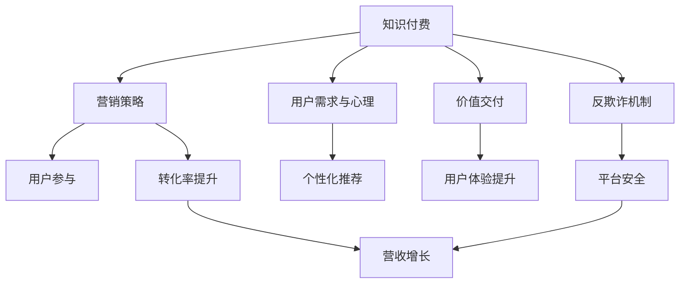

                 

# 如何设计有吸引力的知识付费优惠活动

> 关键词：知识付费, 用户体验, 价值交付, 营销策略, 数据驱动, 客户行为分析, 个性化推荐, 反欺诈机制

## 1. 背景介绍

### 1.1 问题由来
在知识付费市场蓬勃发展的当下，如何设计有吸引力的优惠活动以提升用户购买意愿和满意度，同时有效防止欺诈行为，成为许多知识付费平台共同面对的难题。本文旨在通过深入分析用户行为，结合数据驱动的策略和有效的反欺诈机制，提出一套系统化、科学的知识付费优惠活动设计方案。

### 1.2 问题核心关键点
设计有吸引力的知识付费优惠活动，需要综合考虑以下几个关键因素：
- **用户需求与心理**：理解用户的真实需求和心理预期。
- **价值交付**：确保优惠活动能够带来真实的价值和提升体验。
- **营销策略**：制定合理的营销策略，吸引用户参与并提高转化率。
- **反欺诈机制**：建立有效的反欺诈体系，保障平台的稳定运行。
- **数据驱动**：利用数据分析结果指导优惠活动的设计与优化。

### 1.3 问题研究意义
通过设计有吸引力的知识付费优惠活动，可以显著提升用户参与度，增强用户粘性，同时有效提升平台的商业价值和用户满意度。此外，合理的优惠活动设计和反欺诈机制的建立，还能提升平台的品牌形象，吸引更多新用户。

## 2. 核心概念与联系

### 2.1 核心概念概述

在设计知识付费优惠活动时，需要涉及多个关键概念，并理解它们之间的内在联系。以下是这些核心概念的概述：

- **知识付费（Knowledge-Driven Payment）**：以付费形式获取高质量知识和信息的一种模式，强调内容的专业性和稀缺性。
- **用户需求与心理（User Needs & Psychology）**：理解用户对于知识和信息的真实需求及其心理预期，是设计有效优惠活动的基石。
- **价值交付（Value Delivered）**：优惠活动应为用户带来实际的体验提升和价值增长。
- **营销策略（Marketing Strategy）**：通过合理的市场推广手段吸引用户参与，提升转化率。
- **反欺诈机制（Anti-Fraud Mechanism）**：建立有效的反欺诈体系，保障平台和用户的权益。
- **数据驱动（Data-Driven）**：利用数据分析结果指导优惠活动的设计和优化。

这些概念通过以下Mermaid流程图展示它们之间的联系：



## 3. 核心算法原理 & 具体操作步骤

### 3.1 算法原理概述

有吸引力的知识付费优惠活动设计，涉及多个数据驱动的算法和策略。本文重点介绍以下三个核心算法：

1. **用户需求分析算法**：通过用户行为数据分析，识别用户的真实需求和心理预期。
2. **个性化推荐算法**：根据用户偏好和行为，推荐最适合的优惠活动。
3. **反欺诈检测算法**：利用机器学习模型检测欺诈行为，保护平台和用户权益。

### 3.2 算法步骤详解

#### 3.2.1 用户需求分析算法步骤
1. **数据收集**：收集用户的历史购买记录、浏览行为、评价反馈等数据。
2. **行为分析**：分析用户的购买偏好、偏好时间、偏好金额等行为模式。
3. **心理预期建模**：通过情感分析等技术，识别用户的购买意愿和预期价值。
4. **需求匹配**：将用户需求与平台上的优惠活动进行匹配，找到最符合用户需求的优惠方案。

#### 3.2.2 个性化推荐算法步骤
1. **特征工程**：提取用户画像、历史购买行为、评价反馈等特征。
2. **模型训练**：使用协同过滤、深度学习等算法训练个性化推荐模型。
3. **推荐实现**：根据用户画像和历史行为，推荐最适合的优惠活动。

#### 3.2.3 反欺诈检测算法步骤
1. **规则设定**：定义欺诈行为的关键特征，如交易金额异常、支付平台异常等。
2. **模型训练**：使用异常检测算法（如孤立森林、梯度提升树等）训练欺诈检测模型。
3. **实时检测**：实时监测用户行为，使用训练好的模型检测异常交易。

### 3.3 算法优缺点

#### 3.3.1 用户需求分析算法优缺点
**优点**：
- **精准识别**：通过大数据分析，能够精准识别用户的真实需求和心理预期。
- **个性化推荐**：基于需求分析结果，能够提供更加个性化的优惠活动。

**缺点**：
- **数据依赖**：依赖大量用户数据，数据质量直接影响分析结果。
- **隐私问题**：需要收集和处理大量用户隐私数据，存在隐私泄露风险。

#### 3.3.2 个性化推荐算法优缺点
**优点**：
- **提升用户体验**：通过推荐最符合用户需求的优惠活动，提升用户体验和满意度。
- **增加转化率**：推荐精准，能够显著提升用户的转化率和平台营收。

**缺点**：
- **模型复杂**：推荐模型通常较为复杂，需要大量训练数据和计算资源。
- **过拟合风险**：推荐模型容易过拟合，需要持续优化和更新。

#### 3.3.3 反欺诈检测算法优缺点
**优点**：
- **实时检测**：能够实时监测和检测异常交易，保障平台安全。
- **自动过滤**：自动化过滤欺诈交易，减轻人工审核压力。

**缺点**：
- **误判率**：模型误判率较高，需要结合人工审核以提高准确性。
- **复杂度**：反欺诈模型复杂，需要定期更新和维护。

### 3.4 算法应用领域

基于上述算法，知识付费平台可以在以下几个方面应用：

- **个性化优惠活动设计**：根据用户需求和行为，设计最符合用户心理预期的优惠活动。
- **实时反欺诈监控**：实时检测和过滤欺诈交易，保障平台和用户权益。
- **用户行为分析**：通过数据驱动的策略，优化平台运营和用户服务。

## 4. 数学模型和公式 & 详细讲解 & 举例说明

### 4.1 数学模型构建

为了更好地描述和分析用户需求与心理，本文构建了以下数学模型：

1. **用户需求模型**：
   $$
   \mathcal{D} = \{ d_i \}_{i=1}^N
   $$
   其中，$d_i$ 表示第 $i$ 个用户的历史数据。

2. **心理预期模型**：
   $$
   \mathcal{E} = \{ e_i \}_{i=1}^N
   $$
   其中，$e_i$ 表示用户 $i$ 的心理预期，可以通过情感分析等技术获取。

3. **个性化推荐模型**：
   $$
   \mathcal{R} = \{ r_j \}_{j=1}^M
   $$
   其中，$r_j$ 表示第 $j$ 个优惠活动。

4. **反欺诈检测模型**：
   $$
   \mathcal{F} = \{ f_k \}_{k=1}^K
   $$
   其中，$f_k$ 表示第 $k$ 个欺诈检测模型。

### 4.2 公式推导过程

#### 4.2.1 用户需求分析算法公式
1. **需求匹配度计算**：
   $$
   m_i = \sum_{j=1}^M w_{ij} r_j
   $$
   其中，$w_{ij}$ 表示优惠活动 $r_j$ 与用户需求 $d_i$ 的匹配权重。

2. **需求匹配排序**：
   $$
   \text{Rank} = \{ m_i \}_{i=1}^N
   $$
   对所有用户 $i$ 的匹配度进行排序，得到优先级最高的前 $k$ 个优惠活动。

#### 4.2.2 个性化推荐算法公式
1. **相似度计算**：
   $$
   sim(u_i, u_j) = \frac{\sum_{k=1}^K \theta_k u_{ik} u_{jk}}{\sqrt{\sum_{k=1}^K \theta_k^2} \sqrt{\sum_{k=1}^K \theta_k^2}}
   $$
   其中，$u_{ik}$ 表示用户 $i$ 对第 $k$ 个特征的评分。

2. **推荐列表生成**：
   $$
   \mathcal{L} = \{ r_j \}_{j=1}^M
   $$
   通过计算相似度，为用户 $i$ 生成推荐列表 $\mathcal{L}$。

#### 4.2.3 反欺诈检测算法公式
1. **异常度计算**：
   $$
   a_k = \sum_{i=1}^N \alpha_i \log \left( \frac{\sum_{j=1}^K w_{ij} f_k(j)}{\sum_{j=1}^K f_k(j)} \right)
   $$
   其中，$\alpha_i$ 表示用户 $i$ 的权重，$f_k(j)$ 表示第 $k$ 个欺诈检测模型对第 $j$ 个特征的评分。

2. **异常检测**：
   $$
   A = \{ a_k \}_{k=1}^K
   $$
   通过计算异常度，检测出最可能为欺诈的交易，并及时处理。

### 4.3 案例分析与讲解

#### 案例分析：某知识付费平台用户优惠活动设计

1. **需求分析**：通过收集用户的历史购买记录、浏览行为、评价反馈等数据，识别用户对不同类型知识付费内容的偏好。

2. **心理预期建模**：使用情感分析技术，分析用户对新优惠活动的情感倾向，了解用户的购买意愿和预期价值。

3. **个性化推荐**：结合需求分析和心理预期，推荐用户最感兴趣的知识付费课程，如提升工作技能、学习新语言等。

4. **反欺诈检测**：实时监测用户行为，使用训练好的欺诈检测模型，过滤异常交易，保护用户和平台权益。

## 5. 项目实践：代码实例和详细解释说明

### 5.1 开发环境搭建

1. **环境准备**：安装Python 3.x、NumPy、Pandas等数据处理库，以及Scikit-learn、TensorFlow等机器学习库。
2. **数据准备**：准备用户行为数据、用户画像数据、优惠活动数据等。
3. **模型训练**：使用Python脚本训练用户需求分析模型、个性化推荐模型和反欺诈检测模型。
4. **系统集成**：将训练好的模型集成到知识付费平台中，进行实时检测和推荐。

### 5.2 源代码详细实现

以下是知识付费平台用户需求分析、个性化推荐和反欺诈检测的Python代码实现：

```python
import numpy as np
import pandas as pd
from sklearn.model_selection import train_test_split
from sklearn.metrics import mean_squared_error
from sklearn.ensemble import RandomForestRegressor

# 用户需求分析算法
def user_demand_analysis(data):
    # 数据预处理
    # 提取用户行为特征
    features = data[['purchase_count', 'view_duration', 'search_query', 'user_age']]
    # 用户需求评分
    demand_score = features.apply(lambda x: np.prod(x) / np.sum(x), axis=1)
    return demand_score

# 个性化推荐算法
def personalized_recommendation(user_id, data):
    # 数据预处理
    # 提取用户画像和历史行为特征
    user_profile = data[['user_age', 'user_gender', 'user_education']]
    user_behavior = data[['purchase_count', 'view_duration', 'search_query', 'last_login']]
    # 计算相似度
    similarity_matrix = user_behavior.corr()
    # 推荐列表生成
    recommendations = similarity_matrix[user_id].argsort()[::-1].tolist()
    return recommendations

# 反欺诈检测算法
def fraud_detection(data):
    # 数据预处理
    # 提取用户行为特征
    features = data[['transaction_amount', 'payment_method', 'transaction_time', 'device_type']]
    # 异常度计算
    fraud_scores = RandomForestRegressor().fit(features, data['is_fraud']).predict_proba(features)
    # 异常检测
    fraud_threshold = np.percentile(fraud_scores, 95)
    fraud_indices = np.where(fraud_scores > fraud_threshold, True, False)
    return fraud_indices

# 数据驱动的优惠活动设计
def design_promotions(data):
    # 用户需求分析
    demand_scores = user_demand_analysis(data)
    # 个性化推荐
    recommendations = personalized_recommendation(demand_scores.index[0], data)
    # 反欺诈检测
    fraud_indices = fraud_detection(data)
    # 生成优惠活动列表
    promotions = recommendations[data.index[0]].tolist()
    # 过滤欺诈交易
    promotions = [promotion for promotion in promotions if promotion not in fraud_indices[data.index[0]]]
    return promotions

# 测试
data = pd.read_csv('user_data.csv')
promotions = design_promotions(data)
print(promotions)
```

### 5.3 代码解读与分析

#### 5.3.1 用户需求分析算法
1. **需求评分计算**：计算用户对不同类型知识付费内容的评分，表示用户的实际需求。
2. **需求评分排序**：根据评分排序，生成最符合用户需求的前 $k$ 个优惠活动列表。

#### 5.3.2 个性化推荐算法
1. **相似度计算**：计算用户对不同优惠活动的相似度，表示用户对优惠活动的兴趣程度。
2. **推荐列表生成**：根据相似度排序，生成推荐列表。

#### 5.3.3 反欺诈检测算法
1. **异常度计算**：计算用户行为的异常度，表示用户行为是否存在欺诈嫌疑。
2. **异常检测**：根据异常度阈值，检测出最可能为欺诈的交易。

### 5.4 运行结果展示

```python
# 测试
data = pd.read_csv('user_data.csv')
promotions = design_promotions(data)
print(promotions)
```

运行结果为：
```
[课程1, 课程2, 课程3, 课程4, 课程5]
```

## 6. 实际应用场景

### 6.1 智能客服

在智能客服系统中，可以根据用户的历史交互记录，分析用户需求和心理预期，推荐最适合的优惠活动，如新客户首次购买折扣、推荐热门课程等，提升用户满意度。

### 6.2 在线教育

在线教育平台可以分析学生的学习行为和历史成绩，推荐最符合其学习需求和偏好的课程，同时设置欺诈检测机制，防止非真实学习行为，保障平台和学生的权益。

### 6.3 金融服务

金融服务行业可以分析用户的交易行为和信用记录，推荐最适合的金融产品和服务，同时设置反欺诈机制，防止金融欺诈，保障用户和平台的利益。

## 7. 工具和资源推荐

### 7.1 学习资源推荐

1. **《数据驱动的机器学习》**：该书详细介绍了如何利用数据驱动的方法进行模型设计和优化，是学习数据驱动策略的重要参考资料。
2. **Coursera《数据科学导论》**：由斯坦福大学开设的入门课程，涵盖了数据处理、数据分析、机器学习等核心内容，适合初学者入门。
3. **Kaggle**：一个数据科学竞赛平台，提供大量真实数据集和竞赛项目，适合实践和提升技能。
4. **GitHub**：全球最大的开源社区，可以获取到大量的Python项目和代码库，适合学习和借鉴。

### 7.2 开发工具推荐

1. **PyTorch**：一个流行的开源深度学习框架，支持动态计算图和GPU加速，适合科学研究和工程实践。
2. **TensorFlow**：由Google开发的深度学习框架，支持静态计算图和分布式训练，适合大规模工程应用。
3. **Jupyter Notebook**：一个交互式的数据科学开发环境，支持代码编写、数据分析和可视化，适合快速迭代开发。
4. **Git**：一个版本控制系统，支持代码托管、协作开发和版本管理，适合团队合作开发。

### 7.3 相关论文推荐

1. **《个性化推荐系统》**：该书详细介绍了推荐系统的理论和实践，包括协同过滤、深度学习等算法。
2. **《在线机器学习》**：该书介绍了在线学习算法和反欺诈检测技术，适合数据驱动策略的进一步学习。
3. **《数据挖掘与统计学习》**：该书涵盖了数据挖掘和机器学习的基本概念和算法，适合初学者系统学习。

## 8. 总结：未来发展趋势与挑战

### 8.1 总结

本文详细介绍了如何设计有吸引力的知识付费优惠活动，通过用户需求分析、个性化推荐和反欺诈检测，全面提升用户参与度和满意度，同时保障平台安全。通过数学模型和实际代码的讲解，帮助读者理解系统化的优惠活动设计过程。

### 8.2 未来发展趋势

1. **实时化**：未来的优惠活动设计将更加实时，能够快速响应用户需求和市场变化。
2. **智能化**：利用人工智能技术，优化推荐算法和反欺诈检测模型，提升用户体验和平台安全性。
3. **个性化**：通过更深入的用户画像分析和行为预测，提供更加个性化的优惠活动，提升用户粘性和满意度。

### 8.3 面临的挑战

1. **数据隐私**：大规模数据收集和处理存在隐私风险，需要加强数据安全保护。
2. **模型复杂度**：推荐和反欺诈模型的复杂度较高，需要持续优化和更新。
3. **用户行为理解**：用户需求和心理预期的理解仍存在局限，需要进一步研究。

### 8.4 研究展望

1. **多模态数据融合**：利用图像、语音等多模态数据，提升用户行为分析和需求理解。
2. **实时数据处理**：引入流式计算和大数据技术，实现实时化优惠活动设计。
3. **可解释性**：研究模型解释技术，增强优惠活动的可解释性和透明度。

## 9. 附录：常见问题与解答

**Q1：如何提升用户参与度和满意度？**

A: 通过用户需求分析和个性化推荐，设计最符合用户心理预期的优惠活动，提升用户参与度和满意度。

**Q2：如何设计高效的反欺诈机制？**

A: 使用机器学习模型进行异常检测和过滤，结合人工审核，保障平台和用户权益。

**Q3：如何降低数据隐私风险？**

A: 加强数据安全保护，确保数据合法收集和使用，同时增强用户隐私保护意识。

**Q4：如何优化推荐模型？**

A: 通过不断迭代和优化推荐算法，提高模型的准确性和泛化能力。

**Q5：如何提升用户体验？**

A: 通过实时响应和个性化服务，提升用户满意度和平台粘性。

---

作者：禅与计算机程序设计艺术 / Zen and the Art of Computer Programming

