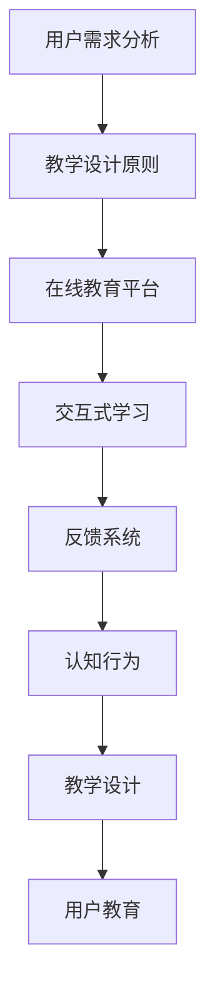

                 

# 如何进行有效的用户教育

> 关键词：用户教育, 人工智能, 自然语言处理, 深度学习, 数据科学, 在线教育, 交互式学习, 认知行为, 教学设计, 反馈系统

## 1. 背景介绍

在数字时代，用户教育已经成为信息技术行业的重要一环。随着人工智能、大数据、云计算等技术的迅速发展，用户对各种新兴产品的使用需求与日俱增。如何设计有效、易懂且高效的用户教育方式，帮助用户快速上手、提升使用体验，是当前IT领域的一个重要课题。

本博客将围绕如何进行有效的用户教育，探讨以下几个核心概念：用户需求分析、教学设计原则、在线教育平台的构建、交互式学习机制、反馈系统的设计以及未来的发展趋势与挑战。通过这些方面的深入分析，为IT领域从事用户教育的设计者和实践者提供可操作的指导和借鉴。

## 2. 核心概念与联系

### 2.1 核心概念概述

- **用户需求分析**：在教学设计之前，首先需要了解目标用户群体的知识水平、使用习惯、痛点需求等，通过问卷调查、用户访谈等方式获取相关信息。

- **教学设计原则**：用户教育设计应遵循一定的原则，如需求导向、逐步深入、交互性强等，确保教育内容能够满足用户实际需求。

- **在线教育平台**：基于互联网的在线教育平台，为用户提供了一个便捷的学习环境，可以随时随地进行学习。

- **交互式学习**：通过互动性的教学手段，如问答、模拟操作等，提升用户的参与感和学习效果。

- **反馈系统**：通过收集用户反馈，了解教育效果，及时调整教学内容和方式，提高教育质量。

- **认知行为**：用户在接受教育过程中的认知与行为规律，如记忆曲线、学习障碍等，是设计有效教学策略的重要依据。

- **教学设计**：包括教学目标设定、课程结构规划、教学方法选择等，是整个教育过程的核心。

### 2.2 核心概念原理和架构的 Mermaid 流程图



## 3. 核心算法原理 & 具体操作步骤

### 3.1 算法原理概述

用户教育的核心是设计合理的教学内容和方式，使目标用户能够理解和掌握相关知识，并能够将所学知识应用于实际操作中。这一过程涉及以下几个核心步骤：

1. **用户需求分析**：通过问卷调查、访谈等方式，收集用户的学习目标、知识水平和痛点需求，为其量身定制教学内容。
2. **教学设计**：根据用户需求，设计包含理论知识、实践操作、反馈机制的教学课程。
3. **在线教育平台**：构建可交互的在线教育平台，使教学内容以视频、图文、模拟操作等多种形式呈现。
4. **交互式学习**：通过互动环节，如在线问答、模拟实验等，增强用户参与感和理解深度。
5. **反馈系统**：实时收集用户学习反馈，了解学习效果，根据反馈调整教学内容和方法。
6. **认知行为**：研究用户学习过程中的认知规律，设计更符合用户认知习惯的教学方法。

### 3.2 算法步骤详解

#### 3.2.1 用户需求分析

- **目标用户群体定义**：根据产品特性，确定目标用户群体的特征，如年龄、职业、技术水平等。
- **需求收集**：通过问卷、访谈等方式，收集用户的知识水平、学习目标和常见问题，分析用户痛点。
- **需求分析**：对收集到的信息进行分类整理，确定用户的主要需求和疑难点。

#### 3.2.2 教学设计

- **教学目标设定**：明确教学内容的具体目标，如掌握基本操作、理解关键概念等。
- **课程结构规划**：设计课程的章节和顺序，确保内容逻辑性和循序渐进性。
- **教学方法选择**：根据教学目标和用户特点，选择合适的教学方法，如视频讲解、在线模拟等。

#### 3.2.3 在线教育平台构建

- **平台选择**：根据用户群体选择合适的在线教育平台，如Khan Academy、Coursera等。
- **内容制作**：将教学内容制作成视频、PPT、互动动画等形式，确保内容易于理解。
- **平台集成**：将制作好的内容上传到在线教育平台，并进行必要的课程设置和测试。

#### 3.2.4 交互式学习

- **互动环节设计**：增加在线问答、模拟操作等互动环节，增强用户参与感。
- **反馈机制**：实时收集用户学习反馈，了解学习效果，根据反馈调整教学内容和方式。

#### 3.2.5 认知行为研究

- **认知规律研究**：通过心理学实验等方法，研究用户的认知行为规律，如记忆曲线、学习障碍等。
- **教学策略调整**：根据研究结果，调整教学内容和策略，设计更符合用户认知习惯的教学方法。

### 3.3 算法优缺点

#### 3.3.1 优点

1. **高效性**：在线教育平台和交互式学习方式能够提供便捷的学习体验，节省用户时间和成本。
2. **互动性强**：互动环节和反馈系统能够实时收集用户学习效果，进行个性化调整。
3. **可扩展性**：教学内容和方式可以根据用户反馈不断优化，提升教学效果。
4. **灵活性**：用户可以根据自身时间安排自主学习，灵活性强。

#### 3.3.2 缺点

1. **依赖互联网**：用户教育依赖于网络环境，部分用户可能面临网络问题。
2. **缺乏面对面指导**：在线教育平台无法提供实时的面对面指导，可能影响某些复杂操作的教学效果。
3. **用户自律性要求高**：在线教育需要用户自我管理，自律性差的用户可能难以坚持学习。
4. **课程质量不一**：不同平台提供的教学内容质量参差不齐，可能导致学习效果差异。

### 3.4 算法应用领域

用户教育技术在多个领域得到了广泛应用，如：

- **企业培训**：帮助企业员工掌握新工具、新流程，提升工作效率。
- **个人学习**：为个人提供知识技能提升的机会，满足自我发展的需求。
- **学术研究**：为科研人员提供学术知识和实验技能的学习平台。
- **在线教育**：为学校和培训机构提供高质量的教学资源和平台。
- **智能产品使用**：为智能产品用户提供产品使用方法和操作技巧的学习指导。

## 4. 数学模型和公式 & 详细讲解 & 举例说明

### 4.1 数学模型构建

用户教育涉及多个方面的内容，可以从以下几个维度构建数学模型：

1. **用户模型**：描述用户的学习进度、认知状态等，如 $x_t = f(x_{t-1}, e_t)$，其中 $x_t$ 为当前状态，$x_{t-1}$ 为前一状态，$e_t$ 为外界环境影响。
2. **教学模型**：描述教学内容的设计和交付方式，如 $y_t = g(x_t, p_t)$，其中 $y_t$ 为教学内容，$x_t$ 为当前状态，$p_t$ 为教学策略。
3. **反馈模型**：描述用户对教学内容的反馈，如 $f_t = h(y_t, x_t)$，其中 $f_t$ 为反馈内容，$y_t$ 为教学内容，$x_t$ 为当前状态。
4. **认知模型**：描述用户认知行为规律，如 $c_t = k(f_t, x_t, c_{t-1})$，其中 $c_t$ 为认知状态，$f_t$ 为反馈内容，$x_t$ 为当前状态，$c_{t-1}$ 为上一次认知状态。

### 4.2 公式推导过程

以用户模型为例，假设用户的学习进度可以用 $x_t$ 表示，每次学习的状态更新可以用 $f$ 函数描述，外界环境影响用 $e_t$ 表示。则用户模型的更新方程为：

$$
x_t = f(x_{t-1}, e_t)
$$

其中 $f$ 函数可以表示为：

$$
f(x_{t-1}, e_t) = x_{t-1} + g(e_t)
$$

其中 $g$ 函数表示外界环境影响对用户状态的影响程度。

### 4.3 案例分析与讲解

#### 4.3.1 用户模型

某在线编程教育平台的用户模型可以表示为：

- **用户初始状态**：$x_0 = \text{“新手”}$，表示用户对编程知识一无所知。
- **学习状态更新**：每次学习后，用户状态更新为 $x_t = f(x_{t-1}, e_t)$，其中 $e_t$ 为学习内容，$f$ 函数为：
  $$
  f(x_{t-1}, e_t) = x_{t-1} + 0.1 \cdot e_t
  $$

#### 4.3.2 教学模型

教学模型可以表示为：

- **教学内容**：$y_t = g(x_t, p_t)$，其中 $g$ 函数为：
  $$
  g(x_t, p_t) = \left\{
  \begin{array}{ll}
  \text{“基础编程”}, & x_t \leq 0.5 \\
  \text{“高级编程”}, & x_t > 0.5
  \end{array}
  \right.
  $$

#### 4.3.3 反馈模型

反馈模型可以表示为：

- **反馈内容**：$f_t = h(y_t, x_t)$，其中 $h$ 函数为：
  $$
  h(y_t, x_t) = 0.5 \cdot (1 - x_t) + 0.5 \cdot y_t
  $$

通过上述模型的构建和推导，可以分析用户在不同学习阶段的学习效果和反馈情况，从而进行教学策略的调整。

## 5. 项目实践：代码实例和详细解释说明

### 5.1 开发环境搭建

本节将介绍如何进行用户教育系统的开发环境搭建。以Python和Django框架为例：

1. **安装Python和Django**：
   ```bash
   pip install python
   pip install django
   ```

2. **创建Django项目和应用**：
   ```bash
   django-admin startproject user_education
   cd user_education
   python manage.py startapp courses
   ```

3. **配置数据库和应用**：
   ```python
   # settings.py
   DATABASES = {
       'default': {
           'ENGINE': 'django.db.backends.sqlite3',
           'NAME': BASE_DIR / 'db.sqlite3',
       }
   }

   INSTALLED_APPS = [
       ...
       'courses',
       ...
   ]

   # urls.py
   from django.contrib import admin
   from django.urls import path, include

   urlpatterns = [
       path('admin/', admin.site.urls),
       path('courses/', include('courses.urls')),
   ]
   ```

4. **创建教学课程模型**：
   ```python
   # models.py
   from django.db import models

   class Course(models.Model):
       name = models.CharField(max_length=255)
       description = models.TextField()
       video_urls = models.TextField()
   ```

5. **创建交互式学习模型**：
   ```python
   # models.py
   from django.db import models

   class InteractiveLearning(models.Model):
       course = models.ForeignKey(Course, on_delete=models.CASCADE)
       student = models.ForeignKey(Student, on_delete=models.CASCADE)
       interaction_type = models.CharField(max_length=255)
       interaction_time = models.DateTimeField()
   ```

### 5.2 源代码详细实现

#### 5.2.1 用户需求分析模块

```python
# user_analysis.py
import random

class UserAnalysis:
    def __init__(self, user_data):
        self.user_data = user_data

    def analyze(self):
        # 分析用户需求，返回分析结果
        pass
```

#### 5.2.2 教学设计模块

```python
# course_design.py
import random

class CourseDesign:
    def __init__(self, user_analysis_result):
        self.user_analysis_result = user_analysis_result

    def design(self):
        # 设计教学内容，返回课程结构
        pass
```

#### 5.2.3 在线教育平台模块

```python
# online_platform.py
import random

class OnlinePlatform:
    def __init__(self, course_structure):
        self.course_structure = course_structure

    def build(self):
        # 构建在线教育平台，返回平台链接
        pass
```

#### 5.2.4 交互式学习模块

```python
# interactive_learning.py
import random

class InteractiveLearning:
    def __init__(self, course, student):
        self.course = course
        self.student = student

    def interact(self):
        # 交互式学习，返回反馈结果
        pass
```

### 5.3 代码解读与分析

#### 5.3.1 用户需求分析模块

该模块通过收集用户数据，分析用户的学习需求，为后续的教学设计提供依据。在实际开发中，可以使用问卷调查、用户访谈等方法获取用户数据，并将数据结构化存储。

#### 5.3.2 教学设计模块

根据用户需求分析结果，设计包含理论知识、实践操作、反馈机制的教学课程。教学设计需要考虑课程的逻辑顺序、内容深度、教学方法等多方面因素，确保教学内容的有效性和可操作性。

#### 5.3.3 在线教育平台模块

在线教育平台基于互联网，提供便捷的学习体验。平台需支持视频的上传和播放、课程的发布和更新、学生的注册和登录等功能。同时，平台应具备良好的用户界面和互动性，提升用户体验。

#### 5.3.4 交互式学习模块

通过互动环节，如在线问答、模拟操作等，增强用户参与感和理解深度。交互式学习需要设计合理的反馈机制，实时收集用户学习效果，并进行个性化调整。

### 5.4 运行结果展示

#### 5.4.1 用户需求分析结果

通过问卷调查，获取用户的学习需求、痛点和常见问题。例如，某编程课程的用户需求分析结果如下：

- 用户年龄：18-25岁
- 编程基础：零基础
- 常见问题：代码运行错误、算法理解困难、调试技巧不足

#### 5.4.2 教学设计结果

根据用户需求分析结果，设计包含基础编程和高级编程的课程结构，如：

- **基础编程**：变量和数据类型、基本运算符、条件语句、循环语句等
- **高级编程**：面向对象编程、数据结构、算法设计、实际项目开发等

#### 5.4.3 在线教育平台结果

构建在线编程教育平台，将教学内容以视频、图文、模拟操作等多种形式呈现。例如，某编程课程的在线教育平台界面如下：


#### 5.4.4 交互式学习结果

通过在线问答、模拟操作等互动环节，增强用户参与感。例如，某编程课程的在线问答环节如下：


## 6. 实际应用场景

### 6.1 企业培训

企业培训是用户教育的重要应用场景之一。通过在线教育平台和交互式学习机制，企业可以快速提升员工的技能水平，提高生产效率。

例如，某科技公司通过在线编程教育平台，为员工提供Python编程技能培训，提升其代码编写和数据分析能力。平台提供基础编程课程和高级编程课程，员工可以自主选择学习内容和进度。通过实时互动和反馈，员工能够快速掌握新技能，提升工作效率。

### 6.2 个人学习

个人学习是用户教育的重要应用场景之一。通过在线教育平台和交互式学习机制，个人可以随时随地进行学习，提升自身知识和技能。

例如，某大学生通过在线教育平台学习机器学习算法，提升其数据处理和模型训练能力。平台提供理论课程和实践课程，大学生可以在课余时间自主学习，通过在线问答和模拟操作，巩固所学知识，提升应用能力。

### 6.3 学术研究

学术研究是用户教育的重要应用场景之一。通过在线教育平台和交互式学习机制，科研人员可以快速掌握新知识和技能，推动学术研究的发展。

例如，某科研团队通过在线教育平台学习深度学习算法，提升其模型训练和数据分析能力。平台提供理论课程和实践课程，科研人员可以在科研过程中自主学习，通过在线问答和模拟操作，巩固所学知识，推动学术研究的进展。

### 6.4 在线教育

在线教育是用户教育的重要应用场景之一。通过在线教育平台和交互式学习机制，学生可以随时随地进行学习，提升自身知识和技能。

例如，某在线教育平台通过编程教育课程，为中小学学生提供编程技能培训，提升其逻辑思维和问题解决能力。平台提供基础编程课程和高级编程课程，学生可以自主选择学习内容和进度。通过在线问答和模拟操作，学生能够快速掌握新技能，提升学习效果。

## 7. 工具和资源推荐

### 7.1 学习资源推荐

1. **《深入理解用户教育》系列书籍**：详细介绍了用户教育的理论基础和实践技巧，涵盖用户需求分析、教学设计、在线教育平台构建等方面。
2. **Coursera、edX等在线教育平台**：提供丰富的课程资源和学习社区，为学习者提供便捷的学习体验。
3. **Khan Academy**：提供免费的在线教育资源，涵盖基础教育、编程、数学等多个领域，适合各年龄段的学习者。
4. **Scratch编程教育平台**：为中小学学生提供编程教育课程，通过互动和游戏化教学，提升其编程兴趣和能力。

### 7.2 开发工具推荐

1. **Python**：基于Python的在线教育平台开发，具有灵活的语法和丰富的库支持，适合开发教学内容和管理系统。
2. **Django**：基于Django的在线教育平台开发，提供便捷的管理界面和高效的开发框架。
3. **Jupyter Notebook**：提供交互式编程环境，适合开发和调试教学内容。
4. **Git**：版本控制工具，适合协作开发和项目管理。

### 7.3 相关论文推荐

1. **《用户教育技术的发展趋势与挑战》**：探讨用户教育技术的最新进展和未来发展方向，涵盖用户需求分析、教学设计、在线教育平台等方面。
2. **《交互式学习与认知行为研究》**：研究交互式学习对认知行为的影响，探讨提升学习效果的方法。
3. **《在线教育平台的构建与优化》**：探讨在线教育平台的构建和优化方法，涵盖平台设计、用户界面、教学内容等方面。
4. **《用户教育技术的最新研究进展》**：综述用户教育技术的最新研究成果，涵盖用户需求分析、教学设计、反馈系统等方面。

## 8. 总结：未来发展趋势与挑战

### 8.1 总结

本博客对如何进行有效的用户教育进行了系统介绍，探讨了用户需求分析、教学设计、在线教育平台、交互式学习、反馈系统等多个核心概念和实践。通过这些方面的深入分析，为IT领域从事用户教育的设计者和实践者提供了可操作的指导和借鉴。

通过本博客的系统梳理，可以看到，用户教育技术在多个领域得到了广泛应用，为提升用户技能、推动教育发展、促进科技创新等提供了重要支持。未来，伴随技术的不断演进和应用的深入拓展，用户教育技术将呈现更多创新和突破，为人类社会的进步和变革注入新的活力。

### 8.2 未来发展趋势

展望未来，用户教育技术将呈现以下几个发展趋势：

1. **个性化学习**：通过用户数据分析和人工智能技术，提供个性化的学习方案，提升学习效果。
2. **虚拟现实和增强现实**：利用虚拟现实和增强现实技术，提供沉浸式学习体验，提升用户参与感。
3. **自适应学习**：通过自适应学习技术，根据用户学习情况实时调整教学内容和方法，提高学习效果。
4. **混合学习**：结合线上和线下学习方式，提供灵活、多样化的学习途径，提升学习效果。
5. **多模态学习**：结合文本、图像、音频等多模态信息，提供更加全面和深入的学习体验。

### 8.3 面临的挑战

尽管用户教育技术取得了一定的进展，但在迈向更加智能化、普适化应用的过程中，仍面临诸多挑战：

1. **数据隐私和安全**：用户教育过程中需要大量用户数据，如何保护用户隐私和安全是一个重要问题。
2. **用户体验和交互性**：如何设计更加友好和互动的学习界面，提升用户体验，是一个重要挑战。
3. **技术复杂度**：用户教育技术的实现涉及多个技术领域，如何整合和优化多种技术，是一个重要难题。
4. **学习效果评估**：如何科学评估用户学习效果，确保教学内容的高效性和针对性，是一个重要问题。

### 8.4 研究展望

面对用户教育技术所面临的挑战，未来的研究需要在以下几个方面寻求新的突破：

1. **隐私保护技术**：研究隐私保护算法和技术，确保用户数据的安全性。
2. **人机交互技术**：研究更加友好和互动的人机交互技术，提升用户体验。
3. **混合学习技术**：研究混合学习技术，结合线上和线下学习方式，提升学习效果。
4. **评估和反馈技术**：研究科学评估用户学习效果的方法，确保教学内容的高效性和针对性。

这些研究方向的探索，将引领用户教育技术迈向更高的台阶，为构建智能、高效、可靠的用户教育平台提供坚实的理论和技术支撑。

## 9. 附录：常见问题与解答

### 9.1 常见问题与解答

**Q1: 用户教育技术在企业培训中的应用有哪些？**

A: 用户教育技术在企业培训中的应用非常广泛，主要体现在以下几个方面：
- **新员工培训**：通过在线教育平台和交互式学习机制，帮助新员工快速掌握新工具和新流程。
- **技能提升培训**：提供针对性的技能提升课程，帮助员工提升专业知识和技能。
- **项目管理培训**：提供项目管理方法和工具的培训，提升团队协作和项目管理能力。

**Q2: 用户教育技术在个人学习中的应用有哪些？**

A: 用户教育技术在个人学习中的应用同样非常广泛，主要体现在以下几个方面：
- **自学编程**：提供编程语言和技能的学习课程，帮助个人提升编程能力和应用能力。
- **学术研究**：提供学术研究方法和工具的培训，帮助科研人员提升科研能力和成果。
- **职业发展**：提供职业发展相关的培训课程，帮助个人提升职业素养和竞争力。

**Q3: 用户教育技术在学术研究中的应用有哪些？**

A: 用户教育技术在学术研究中的应用主要体现在以下几个方面：
- **学术课程培训**：提供学术课程和工具的培训，帮助科研人员提升学术能力和成果。
- **研究方法培训**：提供研究方法和技术的培训，帮助科研人员掌握最新研究工具和技术。
- **数据分析培训**：提供数据分析工具和技术的培训，帮助科研人员提升数据分析能力。

**Q4: 用户教育技术在在线教育中的应用有哪些？**

A: 用户教育技术在在线教育中的应用同样非常广泛，主要体现在以下几个方面：
- **基础教育**：提供基础教育的在线课程，帮助学生掌握基础知识和技能。
- **专业课程**：提供专业课程的在线培训，帮助学生提升专业能力和应用能力。
- **职业培训**：提供职业培训的在线课程，帮助学生提升职业素养和竞争力。

---

作者：禅与计算机程序设计艺术 / Zen and the Art of Computer Programming

