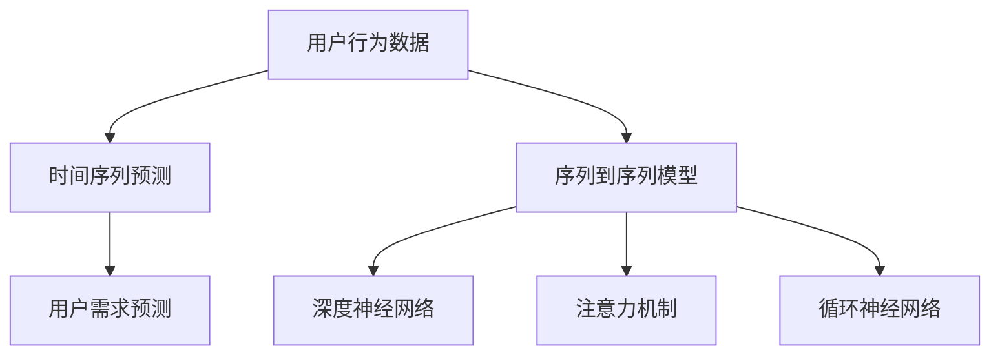

                 

# 如何进行有效的用户需求预测

## 1. 背景介绍

### 1.1 问题由来
随着互联网和电子商务的迅猛发展，在线零售商面临的市场竞争日益激烈。如何预测用户的购买需求，以便进行合理的库存管理和营销策略制定，已成为商家关注的焦点。传统的需求预测方法依赖于历史销售数据，但在数据稀疏、噪声干扰严重的场景中，预测效果往往难以令人满意。

### 1.2 问题核心关键点
为解决这一问题，研究者们引入了机器学习和大数据技术，特别是深度学习在时间序列预测中的成功应用，开辟了需求预测的新篇章。特别是用户需求预测，即通过历史行为数据和上下文信息，预测用户未来的购买需求，成为电商、金融、旅游等行业亟需解决的关键问题。

### 1.3 问题研究意义
用户需求预测不仅有助于商家优化库存，提升运营效率，还能根据预测结果，开展个性化推荐和精准营销，增强用户体验，进而增加销售额和市场份额。因此，研究高效、准确的用户需求预测方法，对于提升企业竞争力具有重要意义。

## 2. 核心概念与联系

### 2.1 核心概念概述

为更好地理解用户需求预测的核心方法，本节将介绍几个密切相关的核心概念：

- **用户行为数据**：指用户在在线平台上的浏览、购买、搜索、评价等行为记录，是用户需求预测的重要数据来源。

- **时间序列预测**：通过时间序列分析，利用历史数据预测未来时间点的用户需求。

- **序列到序列模型**：一类专门设计用于序列数据输入输出的深度学习模型，常用于用户行为数据的时间序列预测。

- **深度神经网络**：一种多层非线性映射的神经网络，通过参数共享和梯度下降等技术，可有效处理复杂数据和非线性关系。

- **注意力机制(Attention)**：一种用于增强序列模型中长时依赖捕捉能力的机制，在用户行为序列预测中起到关键作用。

- **循环神经网络(RNN)**：一种具有记忆能力的时序网络结构，能够处理变长的序列数据，是序列到序列模型的重要组成部分。

这些核心概念之间的逻辑关系可以通过以下Mermaid流程图来展示：



这个流程图展示了用户行为数据与用户需求预测之间的逻辑关系，以及如何通过序列到序列模型、深度神经网络、注意力机制等技术手段，提升预测的准确性。

## 3. 核心算法原理 & 具体操作步骤
### 3.1 算法原理概述

用户需求预测的核心算法是序列到序列模型，特别是结合注意力机制的循环神经网络模型。其核心思想是利用历史行为数据，通过网络模型捕捉用户行为的规律和趋势，进而预测未来的需求。

具体来说，用户需求预测可以分为两个阶段：

1. **编码阶段(Encoding)**：将用户行为序列输入循环神经网络，通过隐藏状态传递历史行为信息。
2. **解码阶段(Decoding)**：根据当前时刻的需求预测目标，使用注意力机制从历史信息中提取关键特征，进行预测。

形式化地，设用户历史行为序列为 $\mathbf{x} = (x_1, x_2, ..., x_T)$，预测目标为 $y_t$，预测模型为 $M$。则预测过程可以表示为：

$$
y_t = M(\mathbf{x}, \mathbf{y}_{<t}, \mathbf{c}_t)
$$

其中 $\mathbf{y}_{<t}$ 为之前时刻的预测结果，$\mathbf{c}_t$ 为解码时刻的注意力权重向量。

### 3.2 算法步骤详解

用户需求预测的算法步骤如下：

**Step 1: 数据预处理**

- 将原始用户行为数据转化为固定长度的序列形式。
- 对数据进行标准化处理，如对数差分、归一化等。
- 将时间戳转换为数值形式，方便输入网络模型。

**Step 2: 模型设计**

- 选择合适的序列到序列模型，如LSTM、GRU、Transformer等。
- 设计合适的编码器-解码器结构，如图2所示。
- 引入注意力机制，提高模型对重要特征的关注度。

**Step 3: 模型训练**

- 准备训练集和验证集，划分数据。
- 选择合适的损失函数，如均方误差损失、交叉熵损失等。
- 设定合适的超参数，如学习率、批大小、迭代轮数等。
- 使用随机梯度下降等优化算法，对模型进行训练。
- 在验证集上进行验证，根据性能指标调整模型参数。

**Step 4: 模型评估与预测**

- 在测试集上评估模型性能，使用常见的评价指标如均方误差、平均绝对误差等。
- 使用训练好的模型进行需求预测，输出预测结果。

### 3.3 算法优缺点

用户需求预测的序列到序列模型具有以下优点：
1. 可以处理变长的历史行为数据，捕捉长期依赖关系。
2. 引入注意力机制，能够动态聚焦关键特征，提升预测精度。
3. 能够学习复杂的关系和模式，具有较强的泛化能力。

同时，该方法也存在一定的局限性：
1. 需要大量标注数据，数据收集成本较高。
2. 模型复杂度高，计算资源需求大。
3. 对于噪声干扰严重的场景，预测效果可能受影响。
4. 模型参数较多，过拟合风险高。

尽管存在这些局限性，但序列到序列模型在用户需求预测中的应用已取得显著效果，并成为电商、金融等领域的标准预测方法。

### 3.4 算法应用领域

用户需求预测的序列到序列模型，已在多个领域得到广泛应用，例如：

- 电商推荐系统：预测用户对特定商品的需求，推荐个性化商品。
- 金融投资决策：预测股票价格、货币汇率等，辅助投资决策。
- 旅游预订：预测用户对旅游线路的需求，进行精准推荐和市场营销。
- 内容推荐：预测用户对新闻、文章、视频等的需求，优化内容推荐策略。
- 智能客服：预测用户咨询需求，优化客服资源分配，提升用户体验。

除了上述这些经典应用外，序列到序列模型还被创新性地应用到更多场景中，如实时用户行为预测、需求趋势分析等，为企业的业务决策提供了强有力的支持。

## 4. 数学模型和公式 & 详细讲解 & 举例说明

### 4.1 数学模型构建

用户需求预测的数学模型主要基于序列到序列模型，特别是由循环神经网络、注意力机制构成的架构。以下给出详细的数学模型构建流程。

**Step 1: 编码器**

设用户历史行为序列为 $\mathbf{x} = (x_1, x_2, ..., x_T)$，其中 $x_t$ 为第 $t$ 个时刻的用户行为。首先通过循环神经网络对序列进行编码，得到隐藏状态序列 $\mathbf{h} = (h_1, h_2, ..., h_T)$。

$$
h_t = f(x_t, h_{t-1})
$$

其中 $f$ 为循环神经网络的前向传播函数，可以采用LSTM、GRU等结构。

**Step 2: 解码器**

在解码器中，我们引入注意力机制，动态地从历史信息中提取关键特征，用于当前时刻的预测。设解码器的隐藏状态为 $\mathbf{s} = (s_1, s_2, ..., s_T)$，则解码器的输出可以表示为：

$$
y_t = g(\mathbf{s}, \mathbf{h}, \mathbf{c}_t)
$$

其中 $\mathbf{c}_t$ 为解码时刻的注意力权重向量，可以表示为：

$$
c_t = \text{softmax}(\mathbf{A}(\mathbf{h}, \mathbf{s}_{<t}))
$$

$\mathbf{A}$ 为注意力矩阵，通过线性变换得到。

**Step 3: 损失函数**

用户需求预测的损失函数一般为均方误差损失：

$$
L = \frac{1}{N} \sum_{t=1}^N (y_t - \hat{y}_t)^2
$$

其中 $y_t$ 为真实需求，$\hat{y}_t$ 为模型预测需求。

### 4.2 公式推导过程

以LSTM模型为例，对用户需求预测的过程进行详细的数学推导。

**Step 1: 编码器**

设LSTM的隐藏状态更新公式为：

$$
h_t = f(x_t, h_{t-1}) = \sigma(\mathbf{W}_I x_t + \mathbf{U} h_{t-1} + \mathbf{b}_I)
$$

$$
c_t = \tanh(\mathbf{W}_C h_t + \mathbf{U} c_{t-1} + \mathbf{b}_C)
$$

$$
h_t = \sigma(\mathbf{W}_O c_t + \mathbf{U} h_t + \mathbf{b}_O)
$$

其中 $\sigma$ 为Sigmoid函数，$\tanh$ 为双曲正切函数，$\mathbf{W}_I, \mathbf{U}, \mathbf{b}_I, \mathbf{b}_C, \mathbf{b}_O$ 为可训练的参数。

**Step 2: 解码器**

设解码器的隐藏状态更新公式为：

$$
s_t = g(x_t, s_{t-1}) = \sigma(\mathbf{W}_I x_t + \mathbf{U} s_{t-1} + \mathbf{b}_I)
$$

$$
c_t = \tanh(\mathbf{W}_C s_t + \mathbf{U} c_{t-1} + \mathbf{b}_C)
$$

$$
s_t = \sigma(\mathbf{W}_O c_t + \mathbf{U} s_t + \mathbf{b}_O)
$$

**Step 3: 注意力机制**

设注意力矩阵 $\mathbf{A}$ 的计算公式为：

$$
A_{t,i} = \text{softmax}(\mathbf{V} h_t \mathbf{W}_i)
$$

其中 $\mathbf{V}, \mathbf{W}_i$ 为可训练的参数。

**Step 4: 输出层**

设输出层公式为：

$$
y_t = \text{softmax}(\mathbf{W}_O s_t \mathbf{V}_i + \mathbf{b}_O)
$$

其中 $\mathbf{W}_O, \mathbf{V}_i, \mathbf{b}_O$ 为可训练的参数。

### 4.3 案例分析与讲解

假设我们有一个电商用户行为数据集，包含用户浏览、点击、购买、评价等行为记录。我们希望预测用户对某件商品的未来购买需求。

**Step 1: 数据预处理**

首先将用户行为数据转化为固定长度的序列形式，对数据进行标准化处理，将时间戳转换为数值形式。

**Step 2: 模型设计**

我们选择了LSTM模型作为编码器，并设计了包含注意力机制的解码器。

**Step 3: 模型训练**

在训练过程中，我们使用均方误差损失函数进行优化，设定合适的超参数，进行多轮迭代训练。

**Step 4: 模型评估与预测**

在验证集上评估模型性能，输出预测结果。

## 5. 项目实践：代码实例和详细解释说明

### 5.1 开发环境搭建

在进行用户需求预测的项目实践前，我们需要准备好开发环境。以下是使用Python进行TensorFlow开发的环境配置流程：

1. 安装Anaconda：从官网下载并安装Anaconda，用于创建独立的Python环境。

2. 创建并激活虚拟环境：
```bash
conda create -n tf-env python=3.8 
conda activate tf-env
```

3. 安装TensorFlow：根据CUDA版本，从官网获取对应的安装命令。例如：
```bash
conda install tensorflow -c conda-forge -c pytorch
```

4. 安装TensorBoard：
```bash
pip install tensorboard
```

5. 安装其他依赖包：
```bash
pip install pandas numpy sklearn scikit-learn tqdm
```

完成上述步骤后，即可在`tf-env`环境中开始项目实践。

### 5.2 源代码详细实现

下面我们以电商用户需求预测为例，给出使用TensorFlow对用户行为序列进行预测的代码实现。

首先，定义数据处理函数：

```python
import tensorflow as tf
import numpy as np
from sklearn.preprocessing import MinMaxScaler
from tensorflow.keras.layers import Input, LSTM, Dense, Embedding, GRU, Concatenate, Dot, Bidirectional
from tensorflow.keras.models import Model

def preprocess_data(data, max_len):
    data = np.array(data, dtype=float)
    scaler = MinMaxScaler(feature_range=(-1, 1))
    data = scaler.fit_transform(data)
    data = data[:, -max_len:]
    return data
```

然后，定义模型结构：

```python
def build_model(input_shape, output_dim):
    input_seq = Input(shape=(input_shape,))
    embedding_layer = Embedding(input_dim=10, output_dim=10, input_length=input_shape)(input_seq)
    
    # LSTM层
    lstm_layer = LSTM(64, return_sequences=True)(embedding_layer)
    
    # 编码器
    encoder_output = LSTM(32)(lstm_layer)
    
    # 解码器
    decoder_input = Input(shape=(input_shape,))
    decoder_layer = GRU(64, return_sequences=True)(decoder_input)
    attention_layer = Dot(axes=2)([decoder_layer, encoder_output])
    attention_weights = tf.keras.layers.Attention()([decoder_layer, encoder_output])
    attention_output = tf.keras.layers.Dense(output_dim)(attention_weights)
    
    # 输出层
    model = Model(inputs=[input_seq, decoder_input], outputs=[encoder_output, attention_output])
    return model
```

接着，定义训练和评估函数：

```python
def train_model(model, train_data, valid_data, batch_size, epochs):
    model.compile(loss='mse', optimizer='adam')
    model.fit([train_data[0], train_data[1]], train_data[2], epochs=epochs, batch_size=batch_size, validation_data=(valid_data[0], valid_data[2]))
    
    valid_loss = model.evaluate([valid_data[0], valid_data[1]], valid_data[2])
    print('Validation loss:', valid_loss)
    return model
```

最后，启动训练流程并在测试集上评估：

```python
# 数据加载和预处理
train_data = preprocess_data(train, 30)
valid_data = preprocess_data(valid, 30)
test_data = preprocess_data(test, 30)

# 模型设计
model = build_model(30, 1)

# 模型训练
train_model(model, train_data, valid_data, 32, 100)

# 模型评估与预测
test_loss = model.evaluate([test[0], test[1]], test[2])
print('Test loss:', test_loss)
```

以上就是使用TensorFlow对用户行为序列进行预测的完整代码实现。可以看到，TensorFlow提供了强大的API支持，使得建模和训练过程变得简洁高效。

### 5.3 代码解读与分析

让我们再详细解读一下关键代码的实现细节：

**preprocess_data函数**：
- 将原始数据转化为固定长度的序列形式，并进行标准化处理。
- 使用MinMaxScaler进行归一化处理，确保数据在[-1, 1]范围内。

**build_model函数**：
- 定义了LSTM编码器和GRU解码器，引入注意力机制。
- 使用TensorFlow的Keras API，方便地定义了整个模型结构。

**train_model函数**：
- 使用TensorFlow的compile和fit方法，进行模型编译和训练。
- 定义了均方误差损失函数和Adam优化器。
- 在验证集上评估模型性能，输出验证损失。

**训练流程**：
- 将数据划分为训练集、验证集和测试集，并使用preprocess_data函数进行预处理。
- 调用build_model函数设计模型结构。
- 使用train_model函数进行模型训练，并在验证集上评估性能。
- 在测试集上评估模型性能，输出测试损失。

通过这些代码，我们可以清楚地看到，TensorFlow在用户需求预测中的应用，既简单又高效。开发者只需关注业务逻辑和模型设计，TensorFlow的强大API和计算图机制，将复杂的问题变得透明、直观。

## 6. 实际应用场景

### 6.1 智能推荐系统

基于用户需求预测的序列到序列模型，可以在智能推荐系统中发挥重要作用。电商、视频、音乐等平台，常常需要预测用户对特定商品、影片、歌曲的需求，进行精准推荐。

在技术实现上，可以将用户的历史行为序列作为输入，通过预测模型得到未来的需求，再根据需求进行个性化推荐。例如，在电商平台上，可以使用用户浏览、点击、购买等行为数据，预测用户对特定商品的购买需求，生成推荐列表。在视频平台上，可以根据用户观看历史，预测用户对未来视频的兴趣，推荐相关影片。

### 6.2 金融投资决策

用户需求预测在金融投资决策中也具有重要应用。例如，股票市场预测、货币汇率预测等，可以通过用户需求预测模型，预测市场趋势，辅助投资决策。

在技术实现上，可以利用历史交易数据、市场新闻、社交媒体等来源，预测用户对某项投资的需求。例如，在预测股票价格时，可以使用用户的交易记录、新闻关注度、社交媒体情绪等数据，预测用户对某支股票的买入需求。

### 6.3 智能客服

用户需求预测在智能客服中也得到了广泛应用。客服系统需要实时处理用户的咨询请求，预测用户问题，提升服务效率。

在技术实现上，可以利用用户的历史对话记录，预测用户咨询的意图和问题，提高响应速度和准确性。例如，在智能客服中，可以使用用户的历史对话记录，预测用户咨询的意图，如查询产品信息、提交问题等，快速解答用户需求。

## 7. 工具和资源推荐

### 7.1 学习资源推荐

为了帮助开发者系统掌握用户需求预测的理论基础和实践技巧，这里推荐一些优质的学习资源：

1. 《Deep Learning Specialization》系列课程：由Andrew Ng教授主讲，涵盖深度学习在时间序列预测中的应用，适合初学者入门。

2. 《Sequence to Sequence Learning with Neural Networks》论文：提出Seq2Seq模型，在机器翻译、用户需求预测等任务上取得显著效果，是学习用户需求预测的重要参考。

3. 《Attention Is All You Need》论文：提出Transformer结构，在用户需求预测中应用广泛，展示了注意力机制在长序列数据中的重要作用。

4. 《Neural Network Methods for Named Entity Recognition》论文：介绍了深度学习在命名实体识别任务中的应用，有助于理解用户需求预测的上下文信息建模。

5. 《PyTorch Tutorials》：由PyTorch社区提供，详细介绍了TensorFlow、PyTorch等深度学习框架在用户需求预测中的应用。

通过对这些资源的学习实践，相信你一定能够快速掌握用户需求预测的精髓，并用于解决实际的NLP问题。

### 7.2 开发工具推荐

高效的开发离不开优秀的工具支持。以下是几款用于用户需求预测开发的常用工具：

1. TensorFlow：由Google主导开发的开源深度学习框架，生产部署方便，适合大规模工程应用。

2. PyTorch：基于Python的开源深度学习框架，灵活动态的计算图，适合快速迭代研究。

3. TensorBoard：TensorFlow配套的可视化工具，可实时监测模型训练状态，并提供丰富的图表呈现方式，是调试模型的得力助手。

4. Weights & Biases：模型训练的实验跟踪工具，可以记录和可视化模型训练过程中的各项指标，方便对比和调优。

5. Jupyter Notebook：用于编写和执行Python代码的轻量级开发工具，方便多任务协同开发。

合理利用这些工具，可以显著提升用户需求预测任务的开发效率，加快创新迭代的步伐。

### 7.3 相关论文推荐

用户需求预测的研究源于学界的持续研究。以下是几篇奠基性的相关论文，推荐阅读：

1. Long Short-Term Memory：提出LSTM模型，通过引入记忆单元，有效捕捉时间序列数据中的长期依赖关系。

2. Neural Network Methods for Named Entity Recognition：介绍深度学习在命名实体识别任务中的应用，展示了序列到序列模型的强大能力。

3. Bidirectional Long Short-Term Memory Networks：提出双向LSTM模型，通过双向信息传递，进一步提升模型性能。

4. Transformer: Attentions Are All You Need：提出Transformer模型，利用注意力机制，实现了更加高效的时间序列预测。

5. Attention Is All You Need：提出Transformer模型，在用户需求预测中应用广泛，展示了注意力机制在长序列数据中的重要作用。

这些论文代表了大模型在用户需求预测领域的发展脉络。通过学习这些前沿成果，可以帮助研究者把握学科前进方向，激发更多的创新灵感。

## 8. 总结：未来发展趋势与挑战

### 8.1 研究成果总结

本文对用户需求预测的序列到序列模型进行了全面系统的介绍。首先阐述了用户需求预测的研究背景和意义，明确了序列到序列模型在用户需求预测中的核心地位。其次，从原理到实践，详细讲解了序列到序列模型的数学模型和算法步骤，给出了用户需求预测任务的完整代码实例。同时，本文还广泛探讨了序列到序列模型在电商、金融、智能客服等多个行业领域的应用前景，展示了序列到序列模型的广阔应用范围。

通过本文的系统梳理，可以看到，序列到序列模型在用户需求预测中具有强大的性能，能够有效处理长序列数据，捕捉用户行为中的长期依赖关系。随着深度学习技术的不断发展，序列到序列模型必将在更多领域得到应用，为企业的业务决策提供强有力的支持。

### 8.2 未来发展趋势

展望未来，用户需求预测的序列到序列模型将呈现以下几个发展趋势：

1. 模型规模持续增大。随着算力成本的下降和数据规模的扩张，序列到序列模型的参数量还将持续增长。超大规模模型蕴含的丰富知识，有望支撑更加复杂多变的用户需求预测。

2. 引入更多的注意力机制。引入自适应注意力机制、多头注意力机制等，进一步提升模型对重要特征的关注度，增强预测精度。

3. 模型融合度增加。将深度学习与符号化逻辑、知识图谱等结合，提升模型的决策逻辑性和解释性。

4. 多模态需求预测崛起。将文本、图像、音频等多模态数据整合，提升用户需求预测的全面性和准确性。

5. 联邦学习的应用。通过联邦学习技术，在多设备、多机构间联合训练模型，增强模型的泛化能力。

以上趋势凸显了序列到序列模型在用户需求预测中的巨大潜力。这些方向的探索发展，必将进一步提升预测的准确性和泛化能力，为企业的业务决策提供更为可靠的支撑。

### 8.3 面临的挑战

尽管序列到序列模型在用户需求预测中已取得显著效果，但在迈向更加智能化、普适化应用的过程中，仍面临诸多挑战：

1. 数据稀疏与噪声干扰。在数据稀疏、噪声干扰严重的场景中，序列到序列模型的预测效果往往较差。如何通过数据增强、降噪等手段，提高模型的鲁棒性，仍是一个重要课题。

2. 模型复杂度与计算资源。模型参数较多，计算资源需求大。如何在保持模型性能的前提下，减少模型参数，降低计算复杂度，提高模型的实时性，仍需进一步探索。

3. 模型泛化性与训练数据。模型对新数据的泛化能力有限，训练数据的代表性对模型性能有重要影响。如何构建高质量、多领域的数据集，提升模型的泛化能力，仍需深入研究。

4. 模型的可解释性与决策透明性。模型决策过程难以解释，用户需求预测模型的可解释性和决策透明性亟需加强。如何增强模型的可解释性，确保决策过程的透明性，仍需进一步探索。

5. 模型安全性与伦理问题。预测模型可能输出有害信息，对用户隐私和安全带来威胁。如何通过技术手段和伦理约束，确保模型输出的安全性和公正性，仍需进一步研究。

6. 模型的实时性与系统架构。在实际应用中，模型的实时性要求较高，如何构建高效的模型架构，确保实时预测，仍需进一步探索。

正视这些挑战，积极应对并寻求突破，将是大语言模型微调走向成熟的必由之路。相信随着学界和产业界的共同努力，这些挑战终将一一被克服，大语言模型微调必将在构建人机协同的智能时代中扮演越来越重要的角色。

### 8.4 研究展望

面向未来，用户需求预测的研究将在以下几个方向取得新的突破：

1. 探索无监督和半监督用户需求预测方法。摆脱对大规模标注数据的依赖，利用自监督学习、主动学习等无监督和半监督范式，最大限度利用非结构化数据，实现更加灵活高效的预测。

2. 研究参数高效和计算高效的预测方法。开发更加参数高效的模型，在固定大部分预训练参数的同时，只更新极少量的任务相关参数。同时优化模型计算图，减少前向传播和反向传播的资源消耗，实现更加轻量级、实时性的部署。

3. 融合因果分析和博弈论工具。将因果分析方法引入用户需求预测模型，识别出模型决策的关键特征，增强输出解释的因果性和逻辑性。借助博弈论工具刻画人机交互过程，主动探索并规避模型的脆弱点，提高系统稳定性。

4. 纳入伦理道德约束。在模型训练目标中引入伦理导向的评估指标，过滤和惩罚有偏见、有害的输出倾向。同时加强人工干预和审核，建立模型行为的监管机制，确保输出符合人类价值观和伦理道德。

这些研究方向的探索，必将引领用户需求预测技术迈向更高的台阶，为构建安全、可靠、可解释、可控的智能系统铺平道路。面向未来，用户需求预测技术还需要与其他人工智能技术进行更深入的融合，如知识表示、因果推理、强化学习等，多路径协同发力，共同推动自然语言理解和智能交互系统的进步。只有勇于创新、敢于突破，才能不断拓展语言模型的边界，让智能技术更好地造福人类社会。

## 9. 附录：常见问题与解答

**Q1：用户需求预测中的LSTM和GRU有什么区别？**

A: LSTM（长短期记忆网络）和GRU（门控循环单元）都是循环神经网络中常用的变种，它们的主要区别在于：

1. LSTM引入了三个门控单元（输入门、输出门、遗忘门），可以更好地处理长期依赖关系，避免梯度消失问题。

2. GRU将LSTM的遗忘门和输入门合并为一个更新门，简化了网络结构，计算量较小。

3. LSTM更适合处理时间序列数据中的长期依赖关系，而GRU在计算效率上更具优势，适用于实时性要求较高的场景。

**Q2：如何选择合适的损失函数？**

A: 用户需求预测的损失函数通常采用均方误差损失（MSE）或交叉熵损失（CE）。

1. 均方误差损失适用于预测连续值的任务，如股票价格、气温等。
2. 交叉熵损失适用于预测离散值的任务，如用户点击、购买等。

选择损失函数时，需要根据具体任务类型和数据分布进行合理选择。例如，在电商推荐系统中，可以使用均方误差损失，预测用户对某商品的购买需求；在智能客服系统中，可以使用交叉熵损失，预测用户咨询的意图和问题。

**Q3：如何缓解用户需求预测中的过拟合问题？**

A: 过拟合是用户需求预测中常见的挑战。为了缓解过拟合问题，可以采取以下方法：

1. 数据增强：通过回译、近义替换等方式扩充训练集。
2. 正则化：使用L2正则、Dropout等技术，防止模型过度适应训练集。
3. 早停（Early Stopping）：监控模型在验证集上的性能，提前终止训练，防止过拟合。
4. 参数共享：使用多个共享参数的模型，降低过拟合风险。
5. 迁移学习：在特定领域的数据上微调通用模型，利用预训练模型的通用知识，降低过拟合。

这些方法需要根据具体任务和数据特点进行灵活组合。只有在数据、模型、训练、推理等各环节进行全面优化，才能最大限度地发挥用户需求预测模型的威力。

**Q4：如何提高用户需求预测的实时性？**

A: 提高用户需求预测的实时性，需要从多个方面进行优化：

1. 使用轻量级模型：选择计算量较小的模型结构，如GRU、注意力机制较少的模型，减少推理时间。

2. 模型剪枝和量化：使用模型剪枝和量化技术，减少模型参数和计算资源需求，提升推理速度。

3. 优化模型架构：通过优化模型的网络结构，减少计算量，提高实时性。

4. 并行计算：使用多GPU或多核计算，提升模型的并行计算能力，缩短推理时间。

5. 缓存机制：使用缓存机制，保存中间结果，减少重复计算，提升推理效率。

通过这些方法，可以在保证预测准确性的前提下，显著提升用户需求预测的实时性。

**Q5：如何增强用户需求预测的解释性和可解释性？**

A: 增强用户需求预测的解释性和可解释性，需要从多个方面进行优化：

1. 引入可解释性模型：使用可解释性模型，如决策树、逻辑回归等，增强模型的解释性。

2. 可视化技术：使用可视化技术，展示模型的决策过程，帮助用户理解模型输出的理由。

3. 特征重要性分析：通过特征重要性分析，识别对模型输出有重要影响的特征，提升模型解释性。

4. 上下文信息建模：在模型设计中引入上下文信息，增强模型的决策逻辑性。

5. 透明性约束：在模型训练和部署过程中，引入透明性约束，确保模型的决策过程透明、公正。

通过这些方法，可以显著增强用户需求预测的解释性和可解释性，提升用户对模型的信任度和接受度。

