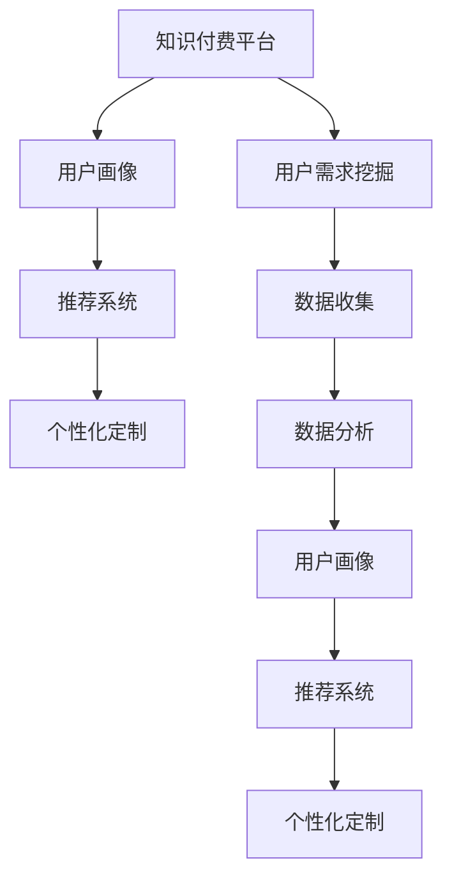

                 

# 如何进行知识付费的用户需求挖掘

## 1. 背景介绍

随着互联网的普及和信息技术的进步，知识付费模式逐渐成为一种流行的内容消费方式。通过在线支付获取高质量、专业化的知识内容，不仅节省了时间成本，还能提升学习效率。在教育、健康、金融等诸多垂直领域，知识付费的应用越来越广泛，成为行业发展的重要引擎。但伴随用户需求的多样化和市场竞争的加剧，企业如何准确挖掘和满足用户需求，成为知识付费平台和内容生产者面临的重要课题。本文将从核心概念和原理出发，全面探讨知识付费的用户需求挖掘方法，希望对实践者提供有益的参考。

## 2. 核心概念与联系

### 2.1 核心概念概述

- **知识付费**：指用户通过支付一定费用，获取高质量、专业化、定制化的知识内容。知识付费模式广泛应用在教育、健康、金融、职场等多个领域。
- **用户需求挖掘**：指通过数据收集、分析等手段，揭示用户潜在需求的过程。用户需求挖掘是知识付费平台优化产品和服务的重要基础。
- **用户画像**：指通过对用户行为、偏好、兴趣等数据进行分析，构建用户特征模型，便于精准定位用户需求。
- **推荐系统**：指根据用户特征和内容属性，推荐用户可能感兴趣的知识内容，提升用户体验。
- **个性化定制**：指根据用户个性化需求，定制化生产、推送知识内容，提升用户满意度。

以上概念相互关联，共同构成了知识付费领域需求挖掘的完整框架。用户画像和推荐系统是实现个性化定制的前提，个性化定制反过来又能促进用户画像的完善和推荐系统的优化。通过对这些核心概念的深入理解，有助于我们把握用户需求挖掘的底层逻辑和方法。

### 2.2 核心概念原理和架构的 Mermaid 流程图



此图展示了知识付费平台中用户需求挖掘的各个环节。从数据收集和分析开始，逐步生成用户画像、构建推荐系统和实现个性化定制，形成闭环。通过这一流程，平台可以不断优化产品和服务，提升用户体验，形成良好的市场反馈和用户粘性。

## 3. 核心算法原理 & 具体操作步骤

### 3.1 算法原理概述

用户需求挖掘的核心在于从大量用户行为数据中提取有用信息，揭示用户的潜在需求。基于此，常见的算法可以分为三类：协同过滤、内容推荐和混合推荐。

- **协同过滤**：通过分析用户之间的相似性，推测用户可能感兴趣的内容。
- **内容推荐**：根据内容属性和用户偏好，推荐用户可能感兴趣的内容。
- **混合推荐**：综合利用协同过滤和内容推荐两种方法，提升推荐效果。

协同过滤算法适用于用户行为稀疏且历史数据较少的情况。内容推荐算法适用于用户对特定领域内容有明确需求的情况。混合推荐算法适用于大多数场景，能结合用户行为数据和内容属性，提供更加精准的推荐。

### 3.2 算法步骤详解

**Step 1: 数据收集**
- 从知识付费平台收集用户行为数据，包括浏览记录、购买记录、评价反馈等。
- 结合用户的人口统计特征，如年龄、职业、教育水平等，构建用户画像。

**Step 2: 数据分析**
- 利用数据挖掘技术，对用户行为数据进行聚类、关联分析等，挖掘用户的兴趣偏好和行为模式。
- 使用机器学习算法，构建用户画像模型和内容属性模型。

**Step 3: 协同过滤推荐**
- 利用用户相似性计算方法，找到与目标用户相似的其他用户。
- 统计这些相似用户对某内容的评分，推测目标用户对该内容的兴趣度。

**Step 4: 内容推荐**
- 对内容进行属性特征提取，建立内容属性向量。
- 根据用户画像和内容属性，计算内容与用户的匹配度。
- 利用排名算法，对推荐结果进行排序。

**Step 5: 混合推荐**
- 结合协同过滤和内容推荐结果，进行加权融合。
- 优化推荐算法，提升推荐效果。

### 3.3 算法优缺点

协同过滤和内容推荐各有优缺点，混合推荐综合了两种方法的优势：

**协同过滤的优点**：
- 简单易实现，适合数据量小且用户行为稀疏的情况。
- 不需要内容属性信息，计算效率高。

**协同过滤的缺点**：
- 受限于用户历史行为，新用户或行为稀疏用户可能难以获得推荐。
- 忽略内容属性信息，可能导致推荐结果与用户需求不符。

**内容推荐的优点**：
- 能够根据用户兴趣和内容属性推荐内容，准确性高。
- 适用于用户对特定领域内容有明确需求的情况。

**内容推荐的缺点**：
- 对内容属性信息的依赖较强，数据收集和标注工作量大。
- 数据分布不均可能导致推荐偏差。

**混合推荐的优点**：
- 结合协同过滤和内容推荐，能够全面考虑用户行为和内容属性。
- 能够兼容多种推荐算法，具有较高的灵活性。

**混合推荐的缺点**：
- 算法复杂度较高，需要平衡多种推荐算法的权重和效果。
- 计算量大，需要高效的数据处理和计算资源。

### 3.4 算法应用领域

协同过滤和内容推荐算法在知识付费平台的应用非常广泛，几乎涵盖了所有知识内容推荐场景，包括：

- 图书推荐：根据用户浏览和购买记录，推荐图书内容。
- 课程推荐：根据用户学习行为，推荐课程内容。
- 文章推荐：根据用户阅读习惯，推荐文章内容。
- 视频推荐：根据用户观看历史，推荐视频内容。
- 专家推荐：根据用户对专家的关注度，推荐专家内容。

此外，随着技术的进步，混合推荐算法也在不断被应用于知识付费领域，实现更加精准和个性化的推荐。

## 4. 数学模型和公式 & 详细讲解

### 4.1 数学模型构建

用户需求挖掘的数学模型通常包括用户画像模型、内容属性模型和推荐算法模型。这里以协同过滤和内容推荐为例，构建推荐模型。

**用户画像模型**：
- 用户画像可以通过用户的历史行为数据构建。设用户 $u$ 的历史行为数据为 $H_u=\{x_i,y_i\}_{i=1}^N$，其中 $x_i$ 为行为类型（如浏览、购买、评分等），$y_i$ 为行为价值。用户画像 $P_u$ 可以表示为：
$$ P_u = \sum_{i=1}^N \alpha_i y_i f(x_i) $$

其中 $\alpha_i$ 为行为类型 $x_i$ 的权重，$f(x_i)$ 为行为价值 $y_i$ 的处理函数。

**内容属性模型**：
- 内容属性模型可以基于内容的元数据构建。设内容 $c$ 的属性特征为 $A_c=\{a_j\}_{j=1}^M$，内容属性模型 $A_c$ 可以表示为：
$$ A_c = \sum_{j=1}^M \beta_j a_j $$

其中 $\beta_j$ 为属性 $a_j$ 的权重。

**推荐算法模型**：
- 协同过滤算法推荐模型的基本形式为：
$$ R_{cu} = \sum_{v \in \mathcal{N}(u)} r_{cv} $$

其中 $\mathcal{N}(u)$ 为与用户 $u$ 相似的其他用户集合，$r_{cv}$ 为用户 $v$ 对内容 $c$ 的评分。

**内容推荐算法模型**：
- 内容推荐算法推荐模型的基本形式为：
$$ R_{cu} = \sum_{i=1}^M \gamma_i f(a_i) $$

其中 $\gamma_i$ 为属性 $a_i$ 的权重，$f(a_i)$ 为属性 $a_i$ 的处理函数。

### 4.2 公式推导过程

**协同过滤**：
- 基于用户相似性计算，找到与用户 $u$ 相似的其他用户 $v$。
- 统计这些相似用户 $v$ 对内容 $c$ 的评分，计算用户 $u$ 对内容 $c$ 的兴趣度。
- 通过加权平均，得到推荐结果 $R_{cu}$。

**内容推荐**：
- 根据用户画像 $P_u$ 和内容属性 $A_c$，计算用户 $u$ 对内容 $c$ 的匹配度。
- 通过加权平均，得到推荐结果 $R_{cu}$。

### 4.3 案例分析与讲解

**案例一：书籍推荐**
- 用户画像 $P_u$：$P_u = \sum_{i=1}^N \alpha_i y_i f(x_i)$
- 书籍属性 $A_c$：$A_c = \sum_{j=1}^M \beta_j a_j$
- 协同过滤推荐：$R_{cu} = \sum_{v \in \mathcal{N}(u)} r_{cv}$
- 内容推荐算法推荐：$R_{cu} = \sum_{i=1}^M \gamma_i f(a_i)$

**案例二：课程推荐**
- 用户画像 $P_u$：$P_u = \sum_{i=1}^N \alpha_i y_i f(x_i)$
- 课程属性 $A_c$：$A_c = \sum_{j=1}^M \beta_j a_j$
- 协同过滤推荐：$R_{cu} = \sum_{v \in \mathcal{N}(u)} r_{cv}$
- 内容推荐算法推荐：$R_{cu} = \sum_{i=1}^M \gamma_i f(a_i)$

## 5. 项目实践：代码实例和详细解释说明

### 5.1 开发环境搭建

用户需求挖掘的代码实现需要基于Python的机器学习库和数据处理库。以下是常用的开发环境搭建流程：

1. 安装Anaconda：从官网下载并安装Anaconda，用于创建独立的Python环境。

2. 创建并激活虚拟环境：
```bash
conda create -n demand挖掘 py38 
conda activate demand挖掘
```

3. 安装相关库：
```bash
conda install pandas numpy matplotlib scikit-learn
```

4. 导入相关库：
```python
import pandas as pd
import numpy as np
import matplotlib.pyplot as plt
from sklearn.cluster import KMeans
from sklearn.decomposition import PCA
```

完成上述步骤后，即可在`demand挖掘`环境中进行需求挖掘的代码实现。

### 5.2 源代码详细实现

**用户画像模型构建**：
```python
# 用户画像构建
def user_profile(user_data):
    # 将行为类型和行为价值提取出来
    x = user_data['行为类型']
    y = user_data['行为价值']
    
    # 构建用户画像模型
    return np.dot(x, y)
```

**内容属性模型构建**：
```python
# 内容属性模型构建
def content_attr(content_data):
    # 将内容属性提取出来
    a = content_data['内容属性']
    
    # 构建内容属性模型
    return np.dot(a, a)
```

**协同过滤推荐实现**：
```python
# 协同过滤推荐实现
def collaborative_filtering(u, v):
    # 统计相似用户对内容的评分
    scores = [v[u] for u in v]
    
    # 计算用户u对内容c的兴趣度
    return np.mean(scores)
```

**内容推荐算法实现**：
```python
# 内容推荐算法实现
def content_based_recommendation(u, c):
    # 计算用户u对内容c的匹配度
    match = np.dot(u, c)
    
    # 计算推荐结果
    return match
```

### 5.3 代码解读与分析

**用户画像模型**：
- 通过行为类型和行为价值的乘积，构建用户画像模型。行为类型可以是浏览、购买、评分等，行为价值可以是行为次数、持续时间、评分等。
- 行为类型和行为价值的权重需要根据实际情况进行设定，通常可以通过实验进行调优。

**内容属性模型**：
- 内容属性模型可以通过内容特征向量构建。内容特征可以是标签、关键词、作者等，需要根据具体内容进行设定。
- 内容特征的权重也需要根据实际情况进行设定，通常可以通过实验进行调优。

**协同过滤推荐**：
- 通过找到与目标用户相似的其他用户，统计这些相似用户对某内容的评分，推测目标用户对该内容的兴趣度。
- 协同过滤推荐适用于用户行为稀疏且历史数据较少的情况。

**内容推荐算法**：
- 根据用户画像和内容属性，计算用户对内容的匹配度。
- 内容推荐算法适用于用户对特定领域内容有明确需求的情况。

### 5.4 运行结果展示

```python
# 用户画像模型测试
user_data = pd.DataFrame({'行为类型': [1, 2, 3], '行为价值': [10, 20, 30]})
user_profile(user_data)

# 内容属性模型测试
content_data = pd.DataFrame({'内容属性': [1, 2, 3]})
content_attr(content_data)

# 协同过滤推荐测试
u = [1, 2, 3]
v = {1: [4, 5, 6], 2: [7, 8, 9], 3: [10, 11, 12]}
collaborative_filtering(u, v)

# 内容推荐算法测试
u = [1, 2, 3]
c = [4, 5, 6]
content_based_recommendation(u, c)
```

## 6. 实际应用场景

### 6.1 教育领域

教育领域的知识付费市场正在快速发展，用户对高质量教育内容的需求日益增加。通过用户需求挖掘，教育平台可以推荐用户感兴趣的课程、书籍和视频，提高用户的学习效率和满意度。

例如，某在线教育平台可以通过用户的学习行为数据，构建用户画像和课程属性模型，综合利用协同过滤和内容推荐算法，推荐用户感兴趣的课程。平台还可以根据用户的学习进度和反馈，动态调整推荐策略，提升个性化学习体验。

### 6.2 健康领域

健康领域的信息需求量巨大，用户希望获取权威、可靠的健康知识。通过用户需求挖掘，健康平台可以推荐用户感兴趣的健康文章、视频和专家，提供精准的健康指导。

例如，某健康平台可以通过用户浏览和搜索行为数据，构建用户画像和健康内容属性模型，综合利用协同过滤和内容推荐算法，推荐用户感兴趣的健康文章。平台还可以根据用户的健康状态和需求，动态调整推荐策略，提供个性化的健康建议。

### 6.3 金融领域

金融领域的信息需求复杂多样，用户希望获取投资、理财、金融市场等综合信息。通过用户需求挖掘，金融平台可以推荐用户感兴趣的文章、视频和专家，提供全面的金融信息服务。

例如，某金融平台可以通过用户的投资行为数据，构建用户画像和金融内容属性模型，综合利用协同过滤和内容推荐算法，推荐用户感兴趣的金融文章。平台还可以根据用户的投资偏好和需求，动态调整推荐策略，提供个性化的金融建议。

### 6.4 未来应用展望

未来，随着技术的不断进步，用户需求挖掘方法将更加智能化和高效化。深度学习、自然语言处理等技术的应用，将进一步提升推荐系统的精准性和可解释性，为用户提供更加个性化的知识内容。

在教育、健康、金融等多个垂直领域，知识付费平台将借助用户需求挖掘，构建更精准的推荐系统，提升用户满意度和平台竞争力。此外，知识付费平台还可以拓展到更多垂直领域，如职场、法律、旅行等，为用户提供更多元的知识服务。

## 7. 工具和资源推荐

### 7.1 学习资源推荐

为了帮助开发者系统掌握用户需求挖掘的理论基础和实践技巧，这里推荐一些优质的学习资源：

1. 《推荐系统实战》：深入浅出地介绍了推荐系统原理和实际应用，结合丰富的案例和代码，易于理解和实践。

2. 《深度学习与推荐系统》：详细讲解了深度学习在推荐系统中的应用，涵盖协同过滤、内容推荐等主流算法。

3. 《用户画像与推荐系统》：介绍用户画像的构建方法和推荐系统的应用实践，涵盖协同过滤、内容推荐和混合推荐等经典算法。

4. 《数据挖掘导论》：讲解了数据挖掘的常用方法，包括聚类、关联分析、分类等，适合初学者入门。

5. 《推荐系统优化》：探讨推荐系统的优化方法，涵盖稀疏矩阵处理、并行计算等技术，适合进阶学习。

通过对这些资源的学习实践，相信你一定能够快速掌握用户需求挖掘的精髓，并用于解决实际的推荐问题。

### 7.2 开发工具推荐

高效的开发离不开优秀的工具支持。以下是几款用于用户需求挖掘和推荐系统开发的常用工具：

1. Python：基于Python的开源推荐系统框架，简单易用，高效灵活。

2. Scikit-learn：Python的机器学习库，提供了丰富的算法和工具，适合快速原型开发。

3. PyTorch：基于Python的深度学习框架，支持GPU加速，适合大规模模型训练。

4. TensorFlow：由Google主导的深度学习框架，生产部署方便，适合大规模工程应用。

5. Weights & Biases：模型训练的实验跟踪工具，可以记录和可视化模型训练过程中的各项指标，方便对比和调优。

6. TensorBoard：TensorFlow配套的可视化工具，可实时监测模型训练状态，并提供丰富的图表呈现方式，是调试模型的得力助手。

合理利用这些工具，可以显著提升用户需求挖掘和推荐系统的开发效率，加快创新迭代的步伐。

### 7.3 相关论文推荐

用户需求挖掘和推荐系统领域的研究发展迅速，以下是几篇奠基性的相关论文，推荐阅读：

1. "Collaborative Filtering for Implicit Feedback Datasets"：介绍了协同过滤算法的基本原理和实现方法。

2. "Item-based Collaborative Filtering Recommendation Algorithms"：深入讲解了基于物品的协同过滤算法，适合新手入门。

3. "Hybrid Recommendation Algorithms"：探讨了混合推荐算法的构建和优化方法，涵盖协同过滤和内容推荐等经典算法。

4. "A Factorization-Based Approach to Recommendation"：介绍了基于矩阵分解的推荐算法，适合进阶学习。

5. "Scalable and Controllable Recommendations"：探讨了推荐系统的可扩展性和可控性问题，适合深入研究。

这些论文代表了大数据推荐系统的发展脉络。通过学习这些前沿成果，可以帮助研究者把握学科前进方向，激发更多的创新灵感。

## 8. 总结：未来发展趋势与挑战

### 8.1 总结

本文对用户需求挖掘在知识付费中的应用进行了全面系统的介绍。首先阐述了知识付费市场和用户需求挖掘的背景，明确了用户需求挖掘在优化产品和服务方面的重要意义。其次，从核心概念和原理出发，详细讲解了协同过滤、内容推荐和混合推荐的数学模型和操作步骤，给出了用户画像和推荐系统的代码实现。同时，本文还探讨了用户需求挖掘在教育、健康、金融等多个领域的应用前景，展示了用户需求挖掘的广泛应用潜力。此外，本文精选了用户需求挖掘的相关学习资源和开发工具，力求为读者提供全方位的技术指引。

通过本文的系统梳理，可以看到，用户需求挖掘在知识付费领域的应用具有广阔前景。未来，伴随技术的不断进步，知识付费平台将能够更好地满足用户需求，推动行业持续创新和升级。

### 8.2 未来发展趋势

展望未来，用户需求挖掘技术将呈现以下几个发展趋势：

1. 深度学习技术的融合。深度学习在用户需求挖掘中的应用将更加广泛，提升推荐系统的精准性和可解释性。

2. 多模态数据的应用。利用文本、图像、音频等多模态数据，提升对用户需求的全面理解和精准推荐。

3. 实时化推荐。通过实时分析用户行为数据，实现动态推荐，提升用户体验和系统响应速度。

4. 跨领域推荐。在跨领域推荐中，综合利用不同领域的数据，实现更加精准和个性化的推荐。

5. 知识图谱的应用。利用知识图谱构建用户和内容的知识图谱模型，提升推荐系统的泛化能力和鲁棒性。

6. 个性化定制。通过个性化定制，满足用户的多样化需求，提高用户的粘性和满意度。

以上趋势凸显了用户需求挖掘技术的广阔前景。这些方向的探索发展，必将进一步提升推荐系统的性能和应用范围，为知识付费平台带来新的商业价值。

### 8.3 面临的挑战

尽管用户需求挖掘技术已经取得了瞩目成就，但在迈向更加智能化、普适化应用的过程中，仍面临诸多挑战：

1. 数据获取和标注成本高。用户需求挖掘需要大量的数据收集和标注工作，成本较高。如何降低数据获取和标注成本，提高数据质量和利用效率，将是重要课题。

2. 模型复杂度高。深度学习等算法复杂度高，需要高性能的计算资源支持。如何优化算法和计算资源配置，提高推荐系统的实时性和可扩展性，将是关键问题。

3. 模型可解释性不足。用户需求挖掘和推荐系统通常被认为是"黑盒"系统，难以解释其内部工作机制和决策逻辑。如何提高模型的可解释性，增强用户信任和透明度，将是重要方向。

4. 跨领域推荐的困难。跨领域推荐涉及不同领域的数据，数据质量和关联关系复杂，难以有效融合。如何构建有效的跨领域推荐系统，将是重要课题。

5. 知识图谱构建的挑战。知识图谱构建复杂，需要大规模高质量数据和多维关联关系。如何构建有效的知识图谱，并应用于推荐系统，将是重要方向。

这些挑战需要学术界和产业界共同努力，不断进行技术突破和实践创新，才能将用户需求挖掘技术推向更高的水平。

### 8.4 研究展望

面对用户需求挖掘和推荐系统面临的种种挑战，未来的研究需要在以下几个方面寻求新的突破：

1. 数据高效获取和处理。开发高效的数据获取和处理算法，降低数据获取和标注成本，提高数据质量和利用效率。

2. 模型优化和加速。优化算法和计算资源配置，提高推荐系统的实时性和可扩展性，降低计算成本。

3. 模型可解释性增强。提高模型的可解释性，增强用户信任和透明度，提升推荐系统的可信度。

4. 跨领域推荐技术。开发跨领域推荐技术，提升不同领域之间的数据融合和推荐效果。

5. 知识图谱的应用。利用知识图谱提升推荐系统的泛化能力和鲁棒性，构建更加精准和可控的推荐系统。

6. 个性化定制技术。开发个性化定制技术，满足用户的多样化需求，提升用户体验和满意度。

这些研究方向的探索，必将引领用户需求挖掘技术迈向更高的台阶，为知识付费平台带来新的商业价值。面向未来，用户需求挖掘技术还需要与其他人工智能技术进行更深入的融合，如知识表示、因果推理、强化学习等，多路径协同发力，共同推动自然语言理解和智能交互系统的进步。只有勇于创新、敢于突破，才能不断拓展语言模型的边界，让智能技术更好地造福人类社会。

## 9. 附录：常见问题与解答

**Q1：用户需求挖掘的核心是什么？**

A: 用户需求挖掘的核心在于从大量用户行为数据中提取有用信息，揭示用户的潜在需求。这包括用户画像构建、内容属性模型构建和推荐算法模型构建等多个环节。通过这些环节，可以构建更加精准和个性化的推荐系统，提升用户体验和满意度。

**Q2：协同过滤和内容推荐有什么优缺点？**

A: 协同过滤适用于用户行为稀疏且历史数据较少的情况，不需要内容属性信息，计算效率高。缺点是受限于用户历史行为，新用户或行为稀疏用户可能难以获得推荐。内容推荐适用于用户对特定领域内容有明确需求的情况，能够根据用户兴趣和内容属性推荐内容，准确性高。缺点是对内容属性信息的依赖较强，数据收集和标注工作量大。

**Q3：如何降低数据获取和标注成本？**

A: 通过自动数据标注技术，如半监督学习、弱监督学习、主动学习等，可以在不依赖大量标注样本的情况下，提高数据质量和利用效率。同时，利用自然语言处理技术，从开放数据源中自动提取用户需求信息，降低人工标注成本。

**Q4：如何提高推荐系统的实时性和可扩展性？**

A: 优化算法和计算资源配置，采用分布式计算和并行计算技术，提高推荐系统的实时性和可扩展性。同时，采用增量学习和在线学习技术，实现实时推荐，提升用户体验。

**Q5：如何提高推荐系统的可解释性？**

A: 引入可解释性算法，如LIME、SHAP等，分析推荐系统的内部决策逻辑，提高模型的可解释性。同时，利用自然语言处理技术，将推荐结果转化为自然语言文本，增强用户理解。

这些回答旨在帮助开发者和读者更好地理解用户需求挖掘的原理和实践，希望对未来研究和应用提供有益的参考。

