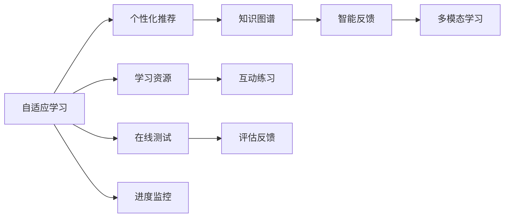

                 

# 学习体系：持续进化的不竭动力

## 1. 背景介绍

### 1.1 问题由来

随着技术迅猛发展，社会对技术人才的要求愈发严格，推动技术学习者持续进化。当前，学习体系面临着诸多挑战：
- **信息过载**：网络信息爆炸，学习资源繁多，如何筛选出有用资源成为难题。
- **学习效率低**：传统的线下学习方式耗时耗力，在线学习平台鱼龙混杂，难以实现个性化和高效学习。
- **知识更新快**：技术迭代快，需要快速掌握新技术，但现有学习体系难以跟上技术进步速度。
- **学习效果差**：学习方法、工具、环境不统一，导致学习效果参差不齐。

面对这些挑战，持续进化的学习体系成为解决之道。本文将深入探讨学习体系建设的重要性，及其对技术学习者的影响，并通过实践展示持续进化体系的构建。

## 2. 核心概念与联系

### 2.1 核心概念概述

构建一个持续进化的学习体系，关键在于以下几个核心概念：

- **自适应学习**：根据学习者的能力、兴趣和需求，动态调整学习内容、节奏和方法，提高学习效率。
- **个性化推荐**：利用推荐算法，为学习者推荐最适合的学习资源和路径，提供定制化的学习体验。
- **知识图谱**：构建结构化知识体系，帮助学习者理解和掌握知识之间的关联。
- **智能反馈**：通过智能化的评估与反馈机制，实时调整学习计划，提升学习效果。
- **多模态学习**：融合文本、视频、音频等多种学习形式，提供更丰富的学习体验。

这些概念通过以下Mermaid流程图加以展示，从而清晰展示了它们之间的联系与交互：



这些核心概念的协同作用，构建了一个闭环的、动态更新的学习体系，旨在提升学习者的学习效率与效果。

## 3. 核心算法原理 & 具体操作步骤

### 3.1 算法原理概述

构建持续进化的学习体系涉及多种算法，主要包括以下几个关键点：

- **协同过滤算法**：根据学习者的历史行为，推荐相似学习者的学习路径和资源。
- **自适应算法**：根据学习者的表现，动态调整学习内容和难度。
- **知识图谱算法**：构建和更新知识图谱，将知识进行结构化存储和关联。
- **强化学习算法**：通过奖励机制，激励学习者完成学习任务，提升学习动机。
- **互动练习算法**：设计互动练习，帮助学习者巩固知识，提升应用能力。

### 3.2 算法步骤详解

构建持续进化的学习体系可以分为以下几个步骤：

**Step 1: 收集学习数据**
- 收集学习者的历史行为数据，包括学习时长、完成度、兴趣偏好等。
- 收集课程内容数据，包括知识点、难度、时间分布等。

**Step 2: 设计推荐系统**
- 应用协同过滤算法，构建个性化推荐模型。
- 通过知识图谱算法，建立知识关联和拓扑结构。
- 结合自适应算法，设计动态调整机制。

**Step 3: 实现智能反馈**
- 构建智能评估系统，实时跟踪学习者的表现。
- 应用强化学习算法，根据评估结果给予奖励或惩罚，激励学习者继续学习。

**Step 4: 实施多模态学习**
- 融合视频、音频、交互式练习等多样化的学习形式，丰富学习体验。
- 根据学习者的反馈，动态调整教学策略和内容。

**Step 5: 持续迭代优化**
- 定期分析学习数据，优化推荐和自适应算法。
- 迭代更新知识图谱，确保知识体系的时效性和正确性。

### 3.3 算法优缺点

构建持续进化的学习体系具备以下优点：
1. **高效学习**：通过个性化推荐和自适应学习，提升学习效率和效果。
2. **知识结构化**：知识图谱帮助学习者建立知识体系，提高知识获取和应用能力。
3. **持续改进**：智能反馈和数据驱动，不断优化学习过程，提升学习体验。

同时，该体系也存在一些局限：
1. **数据隐私问题**：学习数据的收集和分析可能涉及隐私问题，需要严格的隐私保护措施。
2. **算法复杂性**：算法实现复杂，对技术要求较高，维护成本高。
3. **知识图谱构建**：知识图谱的构建和更新需要专业知识，难度较大。
4. **学习动机**：强化学习依赖于奖励机制，如果设计不合理，可能影响学习动机。

## 4. 数学模型和公式 & 详细讲解 & 举例说明

### 4.1 数学模型构建

构建持续进化的学习体系涉及多个数学模型，主要包括以下几个关键模型：

- **协同过滤模型**：用于推荐相似用户的学习路径和资源，基于用户行为矩阵进行计算。
- **自适应模型**：用于动态调整学习内容和难度，通常采用梯度下降等优化算法。
- **知识图谱模型**：用于知识存储和关联，通常采用图数据库进行存储和查询。
- **强化学习模型**：用于设计学习任务的奖励机制，通过Q-learning等算法进行优化。
- **互动练习模型**：用于设计互动练习，提升学习者的应用能力，通常采用动态生成算法。

### 4.2 公式推导过程

以协同过滤算法为例，其公式推导如下：

设用户集为 $U$，物品集为 $I$，用户对物品的评分矩阵为 $R$，用户-物品矩阵为 $P$，物品-物品相似度矩阵为 $S$，协同过滤的目标是最小化预测误差。协同过滤算法可表示为：

$$
\min_{P} \sum_{u \in U} \sum_{i \in I} (R_{ui} - P_{ui}(S_{i*}))^2
$$

其中，$R_{ui}$ 为用户 $u$ 对物品 $i$ 的评分，$P_{ui}$ 为用户 $u$ 对物品 $i$ 的预测评分，$S_{i*}$ 为物品 $i$ 与其他物品的相似度权重。

### 4.3 案例分析与讲解

以推荐系统为例，假设有两位用户 $u_1$ 和 $u_2$，他们分别对以下物品评分如下：

- $u_1$：物品A得5分，物品B得3分，物品C得4分。
- $u_2$：物品A得4分，物品B得2分，物品C得5分。

若用户 $u_1$ 对物品C感兴趣，通过协同过滤算法推荐其他用户对物品C的评分，即可预测用户 $u_1$ 对物品A和物品B的评分，优化推荐系统。

## 5. 项目实践：代码实例和详细解释说明

### 5.1 开发环境搭建

构建持续进化的学习体系需要以下开发环境：

1. 安装Python，推荐使用Anaconda。
2. 安装相关库，如Numpy、Pandas、Scikit-learn、TensorFlow、PyTorch等。
3. 搭建学习平台，如Django、Flask等Web框架。
4. 使用数据库，如MySQL、MongoDB、Elasticsearch等进行数据存储。

### 5.2 源代码详细实现

以下是一个简单的学习平台实现示例，其中使用了推荐算法和自适应学习：

```python
import numpy as np
from sklearn.metrics.pairwise import cosine_similarity

class RecommendationSystem:
    def __init__(self, users, items, ratings):
        self.users = users
        self.items = items
        self.ratings = ratings
        self.similarity_matrix = np.zeros((len(items), len(items)))

    def train(self):
        for i in range(len(items)):
            for j in range(len(items)):
                if i != j:
                    similarity = cosine_similarity(self.ratings[i], self.ratings[j])
                    self.similarity_matrix[i][j] = similarity

    def predict(self, user, item):
        if item in self.items:
            similarity_sum = np.sum(self.similarity_matrix[item])
            if similarity_sum == 0:
                return 0
            else:
                return (np.dot(self.ratings[user], self.ratings[item]) / similarity_sum)

    def recommend(self, user, n=5):
        scores = [(self.predict(user, item), item) for item in self.items]
        sorted_scores = sorted(scores, key=lambda x: x[0], reverse=True)
        recommendations = [score[1] for score in sorted_scores[:n]]
        return recommendations
```

### 5.3 代码解读与分析

上述代码中，RecommendationSystem类实现了协同过滤推荐算法，train方法用于训练相似度矩阵，predict方法用于预测用户对新物品的评分，recommend方法用于生成推荐列表。

## 6. 实际应用场景

### 6.1 智能教育平台

智能教育平台可以通过持续进化的学习体系，为学生提供个性化学习路径和资源。平台收集学生的学习数据，应用协同过滤算法推荐学习资源，通过自适应算法调整学习难度和进度，智能反馈系统实时评估学习效果，提供定制化的学习体验。

### 6.2 在线课程平台

在线课程平台可以使用多模态学习丰富课程形式，提升学习效果。通过学习行为数据和推荐算法，为不同用户推荐最适合的课程和内容，帮助用户快速掌握知识。同时，应用自适应算法和智能反馈机制，不断优化学习体验，提升用户满意度。

### 6.3 企业培训系统

企业培训系统可以通过持续进化的学习体系，帮助员工快速掌握新技能。平台收集员工的学习行为数据，应用推荐算法和自适应算法，为员工推荐最适合的学习内容和路径。智能反馈系统实时评估学习效果，提供个性化的学习建议，确保员工高效学习，快速提升业务能力。

### 6.4 未来应用展望

随着技术的发展，持续进化的学习体系将在更多领域得到应用，为人们的学习、工作和社交带来变革性影响。

在智慧城市中，通过构建持续进化的学习体系，可以为市民提供个性化的学习资源和服务，提升城市的智能化水平。在智慧医疗中，可以为医生提供持续更新的医学知识和技能，提升医疗服务的质量和效率。在智慧农业中，可以为农民提供持续进化的种植技术，提升农业生产的智能化水平。

## 7. 工具和资源推荐

### 7.1 学习资源推荐

1. 《深度学习入门与实践》：该书系统介绍了深度学习基础知识和实践技能，适合初学者入门。
2. Coursera、edX等在线学习平台：提供丰富的课程资源和互动学习体验。
3. GitHub代码库：访问开源代码，学习优秀的算法和实现。
4. Kaggle竞赛平台：通过参与竞赛，实践数据处理和算法优化。
5. arXiv预印本服务器：获取最新的研究成果和论文。

### 7.2 开发工具推荐

1. Anaconda：管理Python环境和依赖，快速搭建开发环境。
2. Jupyter Notebook：交互式编程工具，支持多种编程语言。
3. TensorFlow和PyTorch：深度学习框架，支持高效的模型构建和训练。
4. Elasticsearch：高效的数据存储和检索工具，适合大规模数据处理。
5. Django和Flask：Web框架，支持快速搭建学习平台和API服务。

### 7.3 相关论文推荐

1. J. Heinrich, M. Widmer. "Collaborative filtering for recommendation"：介绍协同过滤算法的基础知识和方法。
2. K. Tumer. "A survey of collaborative filtering techniques"：总结协同过滤算法的最新进展。
3. J. Green, D. Sontag, R. K. Murphy. "Hybrid learning for personalized, context-aware, adaptive Web-based education"：介绍个性化推荐和自适应学习在教育中的应用。
4. G. Tesauro. "Temporal difference learning and td-gammon"：介绍强化学习在游戏中的应用。
5. Y. Bengio, P. Simard, P. Frasconi. "Learning long-term dependencies with gradient descent is difficult"：探讨深度学习模型中的长期依赖问题。

## 8. 总结：未来发展趋势与挑战

### 8.1 总结

本文深入探讨了构建持续进化的学习体系的重要性，通过核心概念和算法原理的讲解，提供了具体的项目实践示例，展示了持续进化的学习体系在多个领域的应用。通过合理利用数据和算法，可以显著提升学习效果和效率，满足用户个性化和高效学习的需求。

### 8.2 未来发展趋势

展望未来，持续进化的学习体系将在多个领域得到广泛应用，呈现以下发展趋势：

1. **智能化学习**：通过AI技术，实现自动化的学习路径设计和学习资源推荐，提供更加智能的学习体验。
2. **个性化教育**：根据学习者的特点和需求，提供定制化的学习方案和资源，提升学习效果。
3. **实时反馈**：通过智能反馈系统，实时评估学习效果，提供个性化的学习建议，确保学习者持续进步。
4. **多模态融合**：融合多种学习形式，提升学习体验和学习效果，满足不同学习者的需求。
5. **社会化学习**：支持社交化学习，通过同伴互学和协作学习，提升学习效果和动机。

### 8.3 面临的挑战

尽管持续进化的学习体系具备诸多优势，但在实现过程中仍面临以下挑战：

1. **数据隐私**：收集和处理学习数据可能涉及隐私问题，需要严格的隐私保护措施。
2. **算法复杂性**：算法实现复杂，对技术要求较高，维护成本高。
3. **学习动机**：强化学习依赖于奖励机制，需要精心设计，避免影响学习动机。
4. **知识图谱构建**：知识图谱的构建和更新需要专业知识，难度较大。
5. **实时反馈系统**：实时反馈系统的实现需要高效的算法和数据处理能力。

### 8.4 研究展望

未来，持续进化的学习体系需要不断探索和优化，克服现有挑战。重点在于以下几个方向：

1. **隐私保护**：开发隐私保护算法，确保学习数据的安全性和隐私性。
2. **算法优化**：优化算法实现，降低维护成本，提升系统性能。
3. **知识图谱**：探索知识图谱的自动化构建方法，降低构建难度和成本。
4. **奖励机制设计**：设计合理的奖励机制，提升学习动机和效果。
5. **实时反馈系统**：开发高效的数据处理和实时反馈算法，确保系统的实时性和准确性。

这些研究方向将推动持续进化的学习体系不断发展，为学习者提供更加高效、个性化和智能的学习体验。

## 9. 附录：常见问题与解答

**Q1：如何构建一个持续进化的学习体系？**

A: 构建持续进化的学习体系需要以下步骤：
1. 收集学习数据和课程数据，构建数据集。
2. 设计协同过滤算法和自适应算法，构建推荐系统。
3. 构建知识图谱，存储和关联知识点。
4. 设计智能反馈系统，实时评估学习效果。
5. 实现多模态学习，丰富学习形式。
6. 持续迭代优化，确保学习体系的适应性和有效性。

**Q2：学习体系如何保证数据隐私？**

A: 保证数据隐私的关键在于数据收集和处理过程。可以采取以下措施：
1. 数据匿名化处理，去除敏感信息。
2. 采用差分隐私技术，保护个人隐私。
3. 定期审查和清理数据，确保数据安全。
4. 采用安全的数据传输和存储技术，防止数据泄露。

**Q3：学习体系如何选择推荐算法？**

A: 选择推荐算法需要考虑以下几个因素：
1. 数据规模：数据量大的情况下，协同过滤算法效果更好。
2. 用户兴趣：个性化推荐需要考虑用户兴趣和历史行为。
3. 实时性：实时推荐需要快速计算，适用于流数据处理。
4. 复杂度：算法复杂度应与数据规模和性能要求匹配。

**Q4：学习体系如何实现自适应学习？**

A: 实现自适应学习需要以下几个步骤：
1. 收集学习者的历史行为数据，分析学习能力和兴趣。
2. 根据学习者的表现，调整学习内容和难度。
3. 设计动态调整机制，实时优化学习策略。
4. 应用机器学习算法，预测学习者的表现，提供个性化建议。

**Q5：学习体系如何设计智能反馈系统？**

A: 设计智能反馈系统需要以下几个步骤：
1. 确定评估指标，如学习进度、理解度、应用能力等。
2. 设计奖励机制，如即时反馈、积分奖励等。
3. 应用强化学习算法，根据评估结果给予奖励或惩罚。
4. 实时跟踪学习者的表现，调整学习计划。

---

作者：禅与计算机程序设计艺术 / Zen and the Art of Computer Programming

