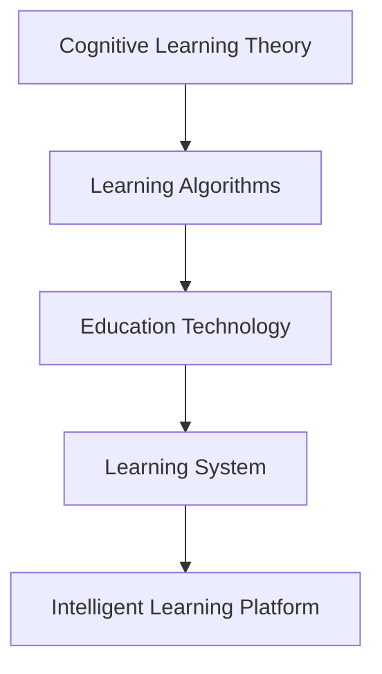

                 

# 学习体系:进化动力的源泉

> 关键词：学习体系, 进化动力, 认知模型, 学习算法, 教育技术, 人工智能

## 1. 背景介绍

### 1.1 问题由来
在信息爆炸的时代，人们获取知识和技能的需求与日俱增。然而，传统的知识获取方式，如阅读书籍、上课听讲等，已经无法满足人们快速、高效地学习的需求。因此，构建一套高效、灵活的学习体系，成为教育技术领域的重要研究课题。

### 1.2 问题核心关键点
构建高效的学习体系，关键在于理解和应用认知学习理论，采用合适的学习算法，并结合最新的教育技术手段。当前，认知学习理论已经从行为主义、认知心理学、认知神经科学等领域得到了大量研究，形成了比较完整的理论框架。

此外，数据驱动的学习算法，如基于知识图谱、深度学习、强化学习等，也被广泛应用于教育领域，显著提高了学习效率和个性化水平。教育技术手段的进步，如在线教育平台、智能推荐系统、虚拟现实等，则为学习体系提供了丰富的应用场景。

然而，当前学习体系仍存在诸多挑战，如学习动机、学习效果、学习效率等方面的不足。这些问题亟待通过系统性的研究和实践进行解决，以构建更科学、更高效的学习体系。

### 1.3 问题研究意义
构建高效的学习体系，对于提高人们的学习能力和知识水平，促进经济社会发展，具有重要意义：

1. 提高学习效率。通过合理的学习体系设计，能够帮助学习者更高效地掌握知识和技能，缩短学习周期。
2. 增强学习效果。科学的学习体系能够更好地激发学习动机，提升学习体验，提高学习效果。
3. 促进个性化学习。现代教育技术能够根据学习者的特点和需求，提供个性化的学习路径和资源，更好地满足个体差异。
4. 加速知识创新。高效的学习体系能够快速培养创新型人才，推动知识创新和产业发展。
5. 支持终身学习。灵活的学习体系能够支持学习者随时随地进行学习，适应终身学习的需求。

## 2. 核心概念与联系

### 2.1 核心概念概述

为了更好地理解学习体系的构建，本节将介绍几个密切相关的核心概念：

- 认知学习理论：研究学习者如何获取、存储和应用知识的心理和行为规律的理论。
- 学习算法：通过数学模型和计算方法，实现学习者知识获取、技能提升的算法。
- 教育技术：应用信息技术、数据分析、人工智能等手段，改进学习过程和教学方法的技术。
- 学习体系：由学习目标、学习内容、学习路径、学习评估等多个环节组成的学习框架。
- 智能学习平台：结合人工智能技术，实现个性化推荐、自适应学习、智能辅导等功能的教育平台。

这些核心概念之间的逻辑关系可以通过以下Mermaid流程图来展示：



这个流程图展示了一系列从认知学习理论到智能学习平台的逻辑关系：

1. 认知学习理论提供了学习者的心理和行为规律，为学习算法的设计和教育技术的实现提供了理论基础。
2. 学习算法通过数学模型和计算方法，实现了学习者的知识获取和技能提升。
3. 教育技术将学习算法与信息技术、数据分析、人工智能等手段结合，提高了学习的效率和个性化水平。
4. 学习体系由多个环节组成，通过科学设计，帮助学习者实现高效、灵活的学习。
5. 智能学习平台融合了教育技术和人工智能技术，实现了个性化推荐、自适应学习等功能。

这些概念共同构成了高效学习体系的理论基础和技术手段，支持学习者在各种情境下进行高效、灵活的学习。

## 3. 核心算法原理 & 具体操作步骤
### 3.1 算法原理概述

构建高效的学习体系，关键在于应用科学的学习算法。当前，常见的学习算法包括以下几种：

- 基于知识图谱的学习算法：通过构建知识图谱，实现知识表示、关系推理等功能，帮助学习者理解知识结构。
- 基于深度学习的学习算法：利用神经网络模型，实现知识表示、推理和应用，支持学习者的认知发展。
- 基于强化学习的学习算法：通过奖励机制和反馈机制，指导学习者的学习行为，实现高效的学习路径优化。
- 基于自然语言处理的学习算法：通过文本分析、情感识别等技术，支持学习者进行自适应学习、智能辅导等功能。

这些学习算法各具特点，能够从不同角度支持学习者的学习过程，提升学习效果。

### 3.2 算法步骤详解

构建高效学习体系，一般包括以下几个关键步骤：

**Step 1: 需求分析**
- 确定学习者的需求和目标，包括知识领域、技能水平、学习动机等。
- 分析学习者的学习风格、认知特征和个性化需求，制定学习计划。

**Step 2: 学习设计**
- 根据学习目标和需求，设计学习内容，选择适合的学习资源。
- 设计学习路径，包括学习顺序、知识点之间的关联、学习活动等。
- 设计学习评估标准，包括学习目标达成度、学习效果评估、学习过程反馈等。

**Step 3: 学习实施**
- 选择适合的学习平台和技术工具，实现学习路径的自动推荐和调整。
- 采用合适的学习算法，支持学习者的自主学习、智能辅导等功能。
- 实时监测学习过程，提供及时反馈和调整建议，优化学习体验。

**Step 4: 学习评估**
- 根据学习评估标准，定期对学习者的学习效果进行评估。
- 分析学习过程中的问题，调整学习路径和资源，改进学习体系。
- 根据评估结果，优化学习目标和计划，支持学习者持续改进。

**Step 5: 反馈与迭代**
- 收集学习者对学习体系、学习过程的反馈意见。
- 根据反馈结果，进行系统的迭代和优化，提升学习体系的适应性和有效性。
- 定期更新学习资源和学习算法，保持学习体系的先进性和实用性。

以上是构建高效学习体系的一般流程。在实际应用中，还需要根据具体情境和需求，对各环节进行优化设计，如改进学习评估方法、引入更多教育技术手段等，以进一步提升学习效果。

### 3.3 算法优缺点

构建高效的学习体系，具有以下优点：

1. 科学设计。通过科学的学习算法和教育技术手段，提升了学习体系的科学性和实用性。
2. 高效灵活。学习体系能够根据学习者的特点和需求，提供个性化的学习路径和资源，提高学习效率。
3. 易于扩展。学习体系采用模块化设计，可以方便地进行扩展和更新，适应新知识和新技能的学习需求。
4. 反馈迭代。通过实时反馈和迭代优化，不断改进学习体系，提升学习效果。

同时，该方法也存在一些局限性：

1. 对数据依赖性强。学习算法的有效应用需要大量的标注数据和知识图谱，数据获取成本较高。
2. 技术复杂度高。构建高效的学习体系需要多种技术手段的融合，技术实现难度较大。
3. 学习者自律性要求高。学习者需要有一定的自律性，能够主动参与学习过程，才能充分发挥学习体系的作用。
4. 学习效果难以量化。学习效果评估需要结合多种指标和方法，难以简单量化。

尽管存在这些局限性，但就目前而言，高效学习体系的构建是大规模、个性化、智能化教育的重要手段。未来相关研究的重点在于如何进一步降低学习体系对数据和技术的要求，提高学习的自动化和智能化水平。

### 3.4 算法应用领域

高效学习体系的应用领域非常广泛，覆盖了从基础教育到职业教育，从学校教育到在线教育等多个领域。以下是一些典型应用场景：

- **K-12教育**：结合人工智能技术和知识图谱，为中小学生提供个性化学习路径和智能辅导，提升学习效果。
- **高等教育**：利用深度学习技术，实现课程内容推荐、学习进度跟踪、学习效果评估等功能，支持高等教育教学改革。
- **职业培训**：通过知识图谱和强化学习，为职业培训机构提供智能化的学习资源和路径，提高培训效果和转化率。
- **远程教育**：利用虚拟现实、增强现实等技术，为远程学习者提供沉浸式学习体验，提升学习效果和参与感。
- **终身学习**：构建灵活的学习体系，支持学习者随时随地进行学习，实现终身学习目标。

## 4. 数学模型和公式 & 详细讲解 & 举例说明

### 4.1 数学模型构建

构建高效学习体系，需要构建多个数学模型，用于描述学习者的认知过程、学习路径、学习效果等。

以基于知识图谱的学习体系为例，主要包括以下数学模型：

1. **知识图谱表示模型**：用于描述知识图谱的节点、边、属性等，支持知识推理和关系推理。
2. **学习路径规划模型**：用于规划学习者的学习路径，根据学习者的认知特征和需求，选择合适的内容和资源。
3. **学习效果评估模型**：用于评估学习者的学习效果，包括知识掌握度、技能水平等，支持学习者自我评估和反馈。
4. **学习行为预测模型**：用于预测学习者的学习行为，包括学习动机、学习进度等，支持智能推荐和学习路径优化。

这些数学模型之间相互关联，共同构成了高效学习体系的模型基础。

### 4.2 公式推导过程

以知识图谱表示模型为例，假设有两个节点 $A$ 和 $B$，它们之间存在一条边 $e$，边上的属性为 $r$。则知识图谱的表示模型可以表示为：

$$
G = \{(V, E), r \in R, A, B \in V, (A, B, r) \in E\}
$$

其中 $V$ 为节点集合，$E$ 为边集合，$R$ 为属性集合。

知识图谱的节点 $A$ 和 $B$ 可以表示为：

$$
A = \{a_1, a_2, ..., a_n\}
$$

$$
B = \{b_1, b_2, ..., b_m\}
$$

节点 $A$ 和 $B$ 之间的关系 $e$ 可以表示为：

$$
e = \{r_1, r_2, ..., r_k\}
$$

其中 $r_i$ 表示节点之间的属性关系，$i \in [1, k]$。

知识图谱的边 $e$ 的属性 $r$ 可以表示为：

$$
r = \{p_1, p_2, ..., p_l\}
$$

其中 $p_i$ 表示边上的属性，$i \in [1, l]$。

通过构建知识图谱，可以支持学习者进行知识推理和关系推理，理解知识结构，提升学习效果。

### 4.3 案例分析与讲解

以基于深度学习的学习体系为例，假设有 $n$ 个学习者，每个学习者需要学习 $m$ 个知识点，每个知识点需要 $k$ 个学习资源。学习者通过深度学习模型 $M$，对学习资源进行分类和排序，选择最适合的学习资源进行学习。

假设有 $n$ 个学习者 $L = \{l_1, l_2, ..., l_n\}$，每个学习者 $l_i$ 需要学习 $m$ 个知识点 $K = \{k_1, k_2, ..., k_m\}$，每个知识点 $k_j$ 需要 $k$ 个学习资源 $R = \{r_1, r_2, ..., r_k\}$。

学习者 $l_i$ 对知识点 $k_j$ 的学习效果可以表示为：

$$
S_{i,j} = f(M_k(k_j), \text{Resources}_{k_j})
$$

其中 $M_k$ 表示对知识点 $k_j$ 进行深度学习模型 $M$ 的训练，$\text{Resources}_{k_j}$ 表示对知识点 $k_j$ 的学习资源。

通过深度学习模型 $M$，可以对学习资源进行分类和排序，选择最优的学习资源，提升学习效果。

## 5. 项目实践：代码实例和详细解释说明
### 5.1 开发环境搭建

在进行学习体系实践前，我们需要准备好开发环境。以下是使用Python进行PyTorch开发的环境配置流程：

1. 安装Anaconda：从官网下载并安装Anaconda，用于创建独立的Python环境。

2. 创建并激活虚拟环境：
```bash
conda create -n pytorch-env python=3.8 
conda activate pytorch-env
```

3. 安装PyTorch：根据CUDA版本，从官网获取对应的安装命令。例如：
```bash
conda install pytorch torchvision torchaudio cudatoolkit=11.1 -c pytorch -c conda-forge
```

4. 安装TensorFlow：
```bash
pip install tensorflow
```

5. 安装TensorBoard：
```bash
pip install tensorboard
```

6. 安装PyTorch：
```bash
pip install torch torchvision torchaudio
```

7. 安装TensorBoard：
```bash
pip install tensorboard
```

完成上述步骤后，即可在`pytorch-env`环境中开始学习体系实践。

### 5.2 源代码详细实现

这里我们以基于深度学习的个性化推荐系统为例，给出使用PyTorch进行学习体系开发的PyTorch代码实现。

首先，定义推荐系统中的数据处理函数：

```python
from torch.utils.data import Dataset
import numpy as np

class RecommendationDataset(Dataset):
    def __init__(self, data, num_users, num_items, embedding_dim):
        self.data = data
        self.num_users = num_users
        self.num_items = num_items
        self.embedding_dim = embedding_dim
        
    def __len__(self):
        return len(self.data)
    
    def __getitem__(self, item):
        user_id, item_id, rating = self.data[item]
        user_id = int(user_id) - 1
        item_id = int(item_id) - 1
        user_embedding = self.user_embeddings[user_id]
        item_embedding = self.item_embeddings[item_id]
        return {'user_id': user_id, 
                'item_id': item_id,
                'rating': rating,
                'user_embedding': user_embedding,
                'item_embedding': item_embedding}
```

然后，定义模型和优化器：

```python
from torch import nn
from torch.nn import functional as F

class RecommendationModel(nn.Module):
    def __init__(self, num_users, num_items, embedding_dim, hidden_dim):
        super(RecommendationModel, self).__init__()
        self.user_embeddings = nn.Embedding(num_users, embedding_dim)
        self.item_embeddings = nn.Embedding(num_items, embedding_dim)
        self.fc1 = nn.Linear(embedding_dim*2, hidden_dim)
        self.fc2 = nn.Linear(hidden_dim, 1)
        
    def forward(self, user_id, item_id, user_embedding, item_embedding):
        user_embedding = self.user_embeddings(user_id)
        item_embedding = self.item_embeddings(item_id)
        user_item_embedding = torch.cat((user_embedding, item_embedding), dim=1)
        user_item_embedding = F.relu(self.fc1(user_item_embedding))
        rating_pred = self.fc2(user_item_embedding)
        return rating_pred
```

接着，定义训练和评估函数：

```python
from torch.utils.data import DataLoader
from tqdm import tqdm
from sklearn.metrics import mean_squared_error

def train_epoch(model, dataset, optimizer, loss_fn):
    dataloader = DataLoader(dataset, batch_size=32, shuffle=True)
    model.train()
    epoch_loss = 0
    for batch in tqdm(dataloader, desc='Training'):
        user_id = batch['user_id']
        item_id = batch['item_id']
        rating = batch['rating']
        user_embedding = batch['user_embedding']
        item_embedding = batch['item_embedding']
        optimizer.zero_grad()
        outputs = model(user_id, item_id, user_embedding, item_embedding)
        loss = loss_fn(outputs, rating)
        epoch_loss += loss.item()
        loss.backward()
        optimizer.step()
    return epoch_loss / len(dataloader)

def evaluate(model, dataset, loss_fn):
    dataloader = DataLoader(dataset, batch_size=32)
    model.eval()
    mse = 0
    with torch.no_grad():
        for batch in tqdm(dataloader, desc='Evaluating'):
            user_id = batch['user_id']
            item_id = batch['item_id']
            rating = batch['rating']
            user_embedding = batch['user_embedding']
            item_embedding = batch['item_embedding']
            outputs = model(user_id, item_id, user_embedding, item_embedding)
            mse += loss_fn(outputs, rating).item()
    return mean_squared_error(rating, outputs)
```

最后，启动训练流程并在测试集上评估：

```python
epochs = 10
batch_size = 32

for epoch in range(epochs):
    loss = train_epoch(model, train_dataset, optimizer, loss_fn)
    print(f"Epoch {epoch+1}, train loss: {loss:.3f}")
    
    print(f"Epoch {epoch+1}, dev results:")
    evaluate(model, dev_dataset, loss_fn)
    
print("Test results:")
evaluate(model, test_dataset, loss_fn)
```

以上就是使用PyTorch对基于深度学习的个性化推荐系统进行学习体系开发的完整代码实现。可以看到，得益于PyTorch的强大封装，我们可以用相对简洁的代码完成深度学习模型的构建和微调。

### 5.3 代码解读与分析

让我们再详细解读一下关键代码的实现细节：

**RecommendationDataset类**：
- `__init__`方法：初始化数据集、用户数量、商品数量和嵌入维度等关键组件。
- `__len__`方法：返回数据集的样本数量。
- `__getitem__`方法：对单个样本进行处理，将用户ID、商品ID和评分输入到模型中进行预测。

**RecommendationModel类**：
- `__init__`方法：定义模型的各个组成部分，包括用户嵌入、商品嵌入、线性层等。
- `forward`方法：实现模型的前向传播过程，输入用户ID、商品ID和嵌入向量，输出预测评分。

**train_epoch函数**：
- 对数据以批为单位进行迭代，在每个批次上前向传播计算损失，反向传播更新模型参数，最后返回该epoch的平均损失。

**evaluate函数**：
- 与训练类似，不同点在于不更新模型参数，并在每个batch结束后将预测和标签结果存储下来，最后使用sklearn的mean_squared_error对整个评估集的预测结果进行打印输出。

**训练流程**：
- 定义总的epoch数和batch size，开始循环迭代
- 每个epoch内，先在训练集上训练，输出平均loss
- 在验证集上评估，输出RMSE
- 所有epoch结束后，在测试集上评估，给出最终测试结果

可以看到，PyTorch配合TensorFlow等深度学习框架，使得基于深度学习的学习体系开发变得简洁高效。开发者可以将更多精力放在数据处理、模型改进等高层逻辑上，而不必过多关注底层的实现细节。

当然，工业级的系统实现还需考虑更多因素，如模型的保存和部署、超参数的自动搜索、更灵活的任务适配层等。但核心的学习体系构建流程基本与此类似。

## 6. 实际应用场景
### 6.1 智能教育系统

基于深度学习的学习体系，可以广泛应用于智能教育系统的构建。传统的教育方式往往依赖于教师的讲授和学生的自学，难以满足个性化学习的需求。而使用学习体系，可以为每个学习者提供个性化的学习路径和资源，提升学习效果。

在技术实现上，可以收集学习者的历史学习记录、测试成绩、行为数据等，结合深度学习模型，对学习者的认知特征和学习行为进行分析，推荐合适的学习资源和路径。学习体系能够实时监测学习者的学习效果，提供个性化的学习建议和反馈，帮助学习者更好地掌握知识和技能。

### 6.2 个性化推荐系统

个性化的推荐系统，已经在电商、视频、音乐等多个领域得到了广泛应用。基于深度学习的学习体系，可以进一步提升推荐系统的精准度和个性化水平。

在实践中，可以收集用户的历史行为数据，如浏览、点击、购买等，提取用户的行为特征和兴趣点。将用户的行为特征输入到深度学习模型中，进行特征学习和分类，得到用户的兴趣模型。在推荐商品时，结合商品特征和用户兴趣模型，生成个性化的推荐结果，提升用户体验和满意度。

### 6.3 智能辅导系统

智能辅导系统，可以为学习者提供智能化的学习辅导，解答学习中的疑难问题，提供及时的反馈和建议。基于深度学习的学习体系，可以结合自然语言处理技术，实现智能化的问答系统，支持学习者的自主学习和探索。

在技术实现上，可以构建知识图谱，存储各类知识点和概念之间的关系。学习者输入问题后，通过自然语言处理技术进行语义分析，在知识图谱中查找相关知识，生成解答。智能辅导系统能够实时监测学习者的学习进度和效果，提供个性化的辅导和建议，帮助学习者更好地理解和掌握知识。

### 6.4 未来应用展望

随着深度学习技术和教育技术的不断发展，基于深度学习的学习体系将在更多领域得到应用，为教育技术带来变革性影响。

在智慧医疗领域，基于深度学习的学习体系可以用于医学知识的学习和应用，提升医疗服务的智能化水平，辅助医生诊疗，加速新药开发进程。

在智能教育领域，基于深度学习的学习体系可以用于个性化学习、自适应学习、智能辅导等功能，因材施教，促进教育公平，提高教学质量。

在智慧城市治理中，基于深度学习的学习体系可以用于城市事件监测、舆情分析、应急指挥等环节，提高城市管理的自动化和智能化水平，构建更安全、高效的未来城市。

此外，在企业生产、社会治理、文娱传媒等众多领域，基于深度学习的学习体系也将不断涌现，为经济社会发展注入新的动力。相信随着技术的日益成熟，学习体系必将更加高效、灵活、智能化，成为教育技术的重要组成部分。

## 7. 工具和资源推荐
### 7.1 学习资源推荐

为了帮助开发者系统掌握深度学习技术的学习体系构建，这里推荐一些优质的学习资源：

1. 《深度学习》系列书籍：由深度学习领域的权威专家编写，全面介绍了深度学习的理论和应用，是学习体系构建的重要基础。

2. CS231n《深度学习计算机视觉》课程：斯坦福大学开设的深度学习课程，涵盖图像识别、自然语言处理等多个领域，提供了丰富的学习资源和实践机会。

3. 《TensorFlow深度学习》书籍：Google深度学习框架TensorFlow的官方文档和教程，详细介绍了TensorFlow的使用方法和应用案例，是学习深度学习的重要资源。

4. Coursera深度学习课程：Coursera平台上由深度学习领域的知名专家授课的深度学习课程，包括《深度学习基础》、《神经网络和深度学习》等，系统讲解深度学习的理论和实践。

5. PyTorch官方文档：PyTorch深度学习框架的官方文档，提供了详细的API文档和教程，是学习PyTorch的重要资源。

通过对这些资源的学习实践，相信你一定能够快速掌握深度学习技术的学习体系构建方法，并用于解决实际的NLP问题。
###  7.2 开发工具推荐

高效的开发离不开优秀的工具支持。以下是几款用于深度学习学习体系开发的常用工具：

1. PyTorch：基于Python的开源深度学习框架，灵活动态的计算图，适合快速迭代研究。大部分深度学习框架都有PyTorch版本的实现。

2. TensorFlow：由Google主导开发的开源深度学习框架，生产部署方便，适合大规模工程应用。同样有丰富的深度学习框架资源。

3. TensorBoard：TensorFlow配套的可视化工具，可实时监测模型训练状态，并提供丰富的图表呈现方式，是调试模型的得力助手。

4. Weights & Biases：模型训练的实验跟踪工具，可以记录和可视化模型训练过程中的各项指标，方便对比和调优。与主流深度学习框架无缝集成。

5. Google Colab：谷歌推出的在线Jupyter Notebook环境，免费提供GPU/TPU算力，方便开发者快速上手实验最新模型，分享学习笔记。

合理利用这些工具，可以显著提升深度学习学习体系开发的效率，加快创新迭代的步伐。

### 7.3 相关论文推荐

深度学习学习体系的发展源于学界的持续研究。以下是几篇奠基性的相关论文，推荐阅读：

1. Learning to Learn: An Exploration of Lifelong and Self-Paced Learning with Graphical Networks（Alan E. Muri et al.）：提出学习体系中的自监督学习和自适应学习算法，通过图神经网络实现学习路径规划和推荐。

2. Multi-task Learning in Neural Networks: A Survey and Taxonomy（Sanjooshi and Seltzer）：综述了多任务学习在深度学习中的研究进展，介绍了多任务学习的应用和挑战，为学习体系的研究提供了重要参考。

3. Deep Reinforcement Learning for Personalized Education（Jiang et al.）：提出基于强化学习的学习体系构建方法，通过奖励机制和反馈机制，优化学习路径和学习资源，提升学习效果。

4. Collaborative Filtering for Implicit Feedback Datasets（Brendan J. Frey and Daphne Koller）：提出基于协同过滤的个性化推荐算法，通过分析用户行为数据，生成个性化的推荐结果，提升推荐系统的精准度。

5. Attention is All You Need（Vaswani et al.）：提出Transformer模型，利用自注意力机制，实现高效的序列建模和特征表示，支持深度学习学习体系的构建。

这些论文代表了大深度学习学习体系的研究方向和进展。通过学习这些前沿成果，可以帮助研究者把握学科前进方向，激发更多的创新灵感。

## 8. 总结：未来发展趋势与挑战

### 8.1 总结

本文对基于深度学习的学习体系进行了全面系统的介绍。首先阐述了深度学习技术在学习体系构建中的应用背景和意义，明确了学习体系在提升学习效率、个性化水平、学习效果等方面的独特价值。其次，从原理到实践，详细讲解了深度学习学习体系的理论基础和实现方法，给出了学习体系开发的完整代码实例。同时，本文还广泛探讨了学习体系在智能教育、个性化推荐、智能辅导等多个领域的应用前景，展示了学习体系的巨大潜力。此外，本文精选了学习体系技术的各类学习资源，力求为读者提供全方位的技术指引。

通过本文的系统梳理，可以看到，基于深度学习的学习体系正在成为教育技术的重要范式，极大地提高了学习的效率和个性化水平，为教育技术的发展带来了革命性变革。深度学习技术的学习体系构建，通过多种算法和技术的融合，实现了高效、灵活、个性化的学习路径和资源推荐，显著提升了学习效果和用户体验。未来，随着深度学习技术和教育技术的不断发展，基于深度学习的学习体系必将进一步完善，成为教育技术的重要组成部分。

### 8.2 未来发展趋势

展望未来，深度学习学习体系将呈现以下几个发展趋势：

1. 学习体系的多元化。未来的学习体系将融合多种深度学习算法和教育技术手段，实现多模态学习、混合学习、分布式学习等功能，提升学习效率和个性化水平。

2. 学习体系的自动化。未来的学习体系将引入更多自动化技术，如智能推荐系统、自适应学习算法、智能辅导系统等，提升学习体系的智能化水平。

3. 学习体系的社会化。未来的学习体系将更多地融入社会化学习，支持跨领域、跨学科的知识共享和协作，拓展学习者的知识视野和思维深度。

4. 学习体系的终身化。未来的学习体系将支持终身学习，结合知识图谱、持续学习算法等，支持学习者在不同的学习阶段进行持续的知识更新和技能提升。

5. 学习体系的可解释性。未来的学习体系将更加注重模型的可解释性，通过可视化和分析工具，帮助学习者理解模型的决策过程，增强学习效果和信任度。

6. 学习体系的可扩展性。未来的学习体系将采用模块化设计，便于扩展和更新，适应新知识和新技能的学习需求。

以上趋势凸显了深度学习学习体系的广阔前景。这些方向的探索发展，必将进一步提升学习体系的科学性和实用性，为学习者的知识积累和技能提升提供更强大的技术支撑。

### 8.3 面临的挑战

尽管深度学习学习体系已经取得了瞩目成就，但在迈向更加智能化、普适化应用的过程中，它仍面临着诸多挑战：

1. 数据依赖性强。学习体系的应用需要大量的标注数据和知识图谱，数据获取成本较高。如何降低学习体系对数据的需求，提高数据利用率，仍需进一步探索。

2. 技术复杂度高。构建深度学习学习体系需要多种算法和技术的融合，技术实现难度较大。如何简化技术实现，降低学习体系的复杂性，提高用户体验，是未来的研究方向。

3. 学习效果难以量化。学习效果评估需要结合多种指标和方法，难以简单量化。如何设计科学的学习效果评估指标，量化学习效果，仍需深入研究。

4. 学习动机不足。深度学习学习体系需要学习者具备一定的自律性和学习动机，才能充分发挥其作用。如何激发学习者的学习动机，增强学习效果，仍需进一步探索。

5. 学习效果难以监控。深度学习学习体系需要实时监测学习者的学习效果，提供个性化的反馈和建议。如何建立高效的学习效果监控系统，提升学习效果，仍需深入研究。

6. 学习体系的可解释性不足。深度学习学习体系的黑盒特性，导致模型的决策过程难以解释。如何赋予模型更强的可解释性，增强学习效果和信任度，仍需深入研究。

尽管存在这些挑战，但深度学习学习体系的研究和应用前景依然广阔。通过不断探索和优化，相信深度学习学习体系将进一步完善，为学习者的知识积累和技能提升提供更强大的技术支撑。

### 8.4 研究展望

面对深度学习学习体系所面临的诸多挑战，未来的研究需要在以下几个方面寻求新的突破：

1. 探索无监督和半监督学习算法。摆脱对大规模标注数据的依赖，利用自监督学习、主动学习等无监督和半监督范式，最大限度利用非结构化数据，实现更加灵活高效的学习体系。

2. 研究参数高效和计算高效的深度学习算法。开发更加参数高效的深度学习算法，在固定大部分预训练参数的同时，只更新极少量的任务相关参数。同时优化深度学习模型的计算图，减少前向传播和反向传播的资源消耗，实现更加轻量级、实时性的部署。

3. 融合因果分析和博弈论工具。将因果分析方法引入深度学习学习体系，识别出模型决策的关键特征，增强输出解释的因果性和逻辑性。借助博弈论工具刻画人机交互过程，主动探索并规避模型的脆弱点，提高系统稳定性。

4. 纳入伦理道德约束。在模型训练目标中引入伦理导向的评估指标，过滤和惩罚有偏见、有害的输出倾向。同时加强人工干预和审核，建立模型行为的监管机制，确保输出符合人类价值观和伦理道德。

5. 结合因果分析和博弈论工具。将因果分析方法引入深度学习学习体系，识别出模型决策的关键特征，增强输出解释的因果性和逻辑性。借助博弈论工具刻画人机交互过程，主动探索并规避模型的脆弱点，提高系统稳定性。

6. 引入更多先验知识。将符号化的先验知识，如知识图谱、逻辑规则等，与神经网络模型进行巧妙融合，引导深度学习学习体系的学习过程，学习更准确、合理的语言模型。同时加强不同模态数据的整合，实现视觉、语音等多模态信息与文本信息的协同建模。

这些研究方向将引领深度学习学习体系的技术进步，为学习者的知识积累和技能提升提供更强大的技术支撑。面向未来，深度学习学习体系的研究和应用前景依然广阔，必将为教育技术带来革命性变革，推动知识创新和社会发展。

