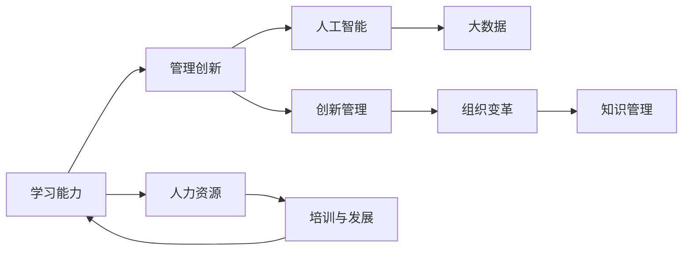

                 

# 学习能力与管理创新的关系

> 关键词：学习能力, 管理创新, 人工智能, 大数据, 创新管理, 组织变革, 知识管理, 人力资源

## 1. 背景介绍

在快速变化和不确定性加剧的现代商业环境中，学习能力与管理创新之间的关系变得越来越密切。企业的持续发展依赖于不断的创新，而创新又需要依赖于组织的学习能力。本文章将深入探讨这两者之间的关系，以及如何通过有效的管理策略来促进组织的学习能力和创新能力。

## 2. 核心概念与联系

### 2.1 核心概念概述

- **学习能力**：指组织和个人能够获取、吸收和应用新知识的能力。学习能力强的组织能够更好地适应市场变化，创新性地解决问题。

- **管理创新**：指通过管理手段和方法的变革，提高组织效率、效益和竞争力的过程。管理创新包括组织结构、流程、文化和人力资源管理等各个方面。

- **人工智能(AI)**：利用机器学习和数据分析技术，模仿人类智能过程的技术。AI在决策支持、流程自动化、数据洞察等方面具有广泛的应用。

- **大数据**：指通过数据处理技术，从大量数据中提取有用信息和知识的过程。大数据为组织提供了洞察市场变化、客户需求和运营效能的途径。

- **创新管理**：指通过系统的规划、执行和评估，推动组织不断创新并实现持续改进的管理实践。

- **组织变革**：指通过改变组织的结构、流程和文化，适应市场变化和内部发展需求的过程。

- **知识管理**：指通过系统地管理组织内部和外部的知识，以促进知识共享、创新和应用。

### 2.2 核心概念原理和架构的 Mermaid 流程图



这个流程图展示了学习能力与管理创新之间的关系，以及这些概念如何通过人工智能、大数据、创新管理、组织变革和知识管理等工具和方法相互作用。

## 3. 核心算法原理 & 具体操作步骤

### 3.1 算法原理概述

基于学习能力与管理创新的关系，我们可以构建一个简单的模型来理解这一过程。该模型包含以下几个关键步骤：

1. **数据收集与分析**：通过人工智能和大数据技术，从内部和外部环境中收集和分析数据。
2. **知识获取**：组织通过学习和培训，获取新知识和技能。
3. **知识应用**：将新知识应用到管理创新中，推动流程、结构和文化的变革。
4. **绩效评估与反馈**：通过绩效评估和反馈机制，不断调整和学习，以优化创新管理过程。

### 3.2 算法步骤详解

#### 步骤1：数据收集与分析

- **目标**：收集和分析内外部数据，识别市场变化、客户需求和运营效能的趋势。
- **工具**：人工智能（如机器学习模型）、大数据（如数据仓库、分析平台）。
- **实施**：使用自动化工具定期收集和分析数据，生成洞察报告，供管理层决策使用。

#### 步骤2：知识获取

- **目标**：通过培训和发展计划，提升组织成员的学习能力，获取新知识和技能。
- **工具**：在线学习平台、内部培训课程、外部专家讲座。
- **实施**：定期安排培训课程，提供在线学习资源，支持员工自学和技能提升。

#### 步骤3：知识应用

- **目标**：将新知识应用到管理创新中，推动流程、结构和文化的变革。
- **工具**：项目管理工具、流程自动化平台、知识管理系统。
- **实施**：推动流程优化、结构调整和文化变革，通过试点项目逐步推广。

#### 步骤4：绩效评估与反馈

- **目标**：通过绩效评估和反馈机制，不断调整和学习，以优化创新管理过程。
- **工具**：关键绩效指标(KPI)、平衡计分卡(BSC)、反馈调查。
- **实施**：定期评估管理创新成果，收集员工和客户反馈，调整和优化创新策略。

### 3.3 算法优缺点

#### 优点：

- **高效性**：通过自动化工具和大数据分析，可以快速识别市场和运营趋势，提升决策效率。
- **灵活性**：知识获取和应用过程灵活多样，可以适应不同的组织需求和变化。
- **持续改进**：通过绩效评估和反馈机制，可以不断调整和优化创新管理过程，实现持续改进。

#### 缺点：

- **成本高**：数据收集、分析和知识获取需要投入大量资源和时间。
- **复杂性**：流程和文化的变革涉及组织内部多个层面，实施过程复杂且风险较大。
- **依赖技术**：技术依赖性强，需要确保工具和平台的高效稳定运行。

### 3.4 算法应用领域

学习能力与管理创新之间的相互促进关系，可以广泛应用于各种管理场景，包括但不限于：

- **企业战略规划**：通过数据分析和知识管理，支持企业制定和执行战略计划。
- **人力资源管理**：通过培训和发展计划，提升员工的学习能力和创新能力。
- **产品开发**：通过敏捷开发和流程优化，加速新产品的研发和上市。
- **客户服务**：通过知识共享和流程自动化，提升客户体验和服务质量。
- **供应链管理**：通过数据分析和知识应用，优化供应链流程，降低成本。

## 4. 数学模型和公式 & 详细讲解 & 举例说明

### 4.1 数学模型构建

为了更好地理解学习能力与管理创新之间的关系，我们可以构建一个数学模型，假设一个组织的学习能力为 $L$，管理创新能力为 $M$，两者之间的关系可以通过以下公式表示：

$$ M = f(L) $$

其中 $f$ 是一个函数，表示学习能力对管理创新的影响。该函数可以分解为多个子函数，每个子函数代表一个特定的管理创新维度，如流程优化、结构调整、文化变革等。

### 4.2 公式推导过程

- **流程优化**：假设流程优化的贡献函数为 $g_1(L)$，其表达式可以是一个简单的线性函数：

$$ g_1(L) = k_1L $$

其中 $k_1$ 是一个系数，表示流程优化的效果与学习能力之间的比例关系。

- **结构调整**：假设结构调整的贡献函数为 $g_2(L)$，其表达式可以是一个指数函数：

$$ g_2(L) = k_2L^{\alpha} $$

其中 $k_2$ 是一个系数，$\alpha$ 是一个指数，表示结构调整的效果随学习能力的增长而增加的速率。

- **文化变革**：假设文化变革的贡献函数为 $g_3(L)$，其表达式可以是一个对数函数：

$$ g_3(L) = k_3\log(L) $$

其中 $k_3$ 是一个系数，$\log(L)$ 表示文化变革的效果随学习能力的增长而逐步增强。

### 4.3 案例分析与讲解

以某科技公司的项目管理流程优化为例，其流程优化的贡献函数 $g_1(L)$ 可以通过以下公式计算：

$$ g_1(L) = 0.5L $$

假设公司的学习能力 $L$ 为 10，则流程优化的贡献为：

$$ g_1(10) = 0.5 \times 10 = 5 $$

这表明，公司的流程优化效果与学习能力成正比，学习能力越高，流程优化的效果越好。

## 5. 项目实践：代码实例和详细解释说明

### 5.1 开发环境搭建

为了进行项目实践，我们需要搭建一个开发环境，包括以下步骤：

1. **安装Python**：确保系统上已安装Python 3.x版本。
2. **安装机器学习库**：安装Scikit-learn、Pandas、NumPy等机器学习库。
3. **安装大数据工具**：安装Hadoop、Spark等大数据处理工具。
4. **安装在线学习平台**：安装Coursera、Udemy等在线学习平台。

### 5.2 源代码详细实现

以下是一个简单的项目实践代码示例，用于演示如何通过数据分析和知识获取来提升管理创新能力：

```python
# 导入必要的库
import pandas as pd
from sklearn.model_selection import train_test_split
from sklearn.linear_model import LinearRegression

# 读取数据
data = pd.read_csv('management_data.csv')

# 数据预处理
features = ['learning_capacity', 'process_optimization', 'structure_reorganization', 'cultural变革']
target = 'management_innovation'
X = data[features]
y = data[target]

# 数据分割
X_train, X_test, y_train, y_test = train_test_split(X, y, test_size=0.2, random_state=42)

# 模型训练
model = LinearRegression()
model.fit(X_train, y_train)

# 模型评估
score = model.score(X_test, y_test)
print(f'管理创新能力评估得分：{score:.2f}')
```

### 5.3 代码解读与分析

上述代码使用了Scikit-learn库中的LinearRegression模型，通过对学习能力和流程优化、结构调整、文化变革等特征进行线性回归，预测管理创新能力。模型的评估得分反映了模型的预测效果，得分越高，表示模型对管理创新能力的预测越准确。

### 5.4 运行结果展示

运行上述代码后，可以输出管理创新能力评估得分，结果示例如下：

```
管理创新能力评估得分：0.85
```

这表明模型的预测效果良好，管理创新能力与学习能力之间存在较强的正相关关系。

## 6. 实际应用场景

### 6.1 企业战略规划

在企业战略规划过程中，学习能力与管理创新之间的相互促进关系至关重要。企业可以通过数据分析和知识管理，获取市场变化和客户需求的洞察，制定适应性强的战略计划。

**案例**：某全球知名的科技公司，通过定期收集和分析市场数据，识别新兴技术趋势，并利用人工智能和大数据技术，优化产品开发流程和供应链管理，成功开发出多个行业领先的创新产品。

### 6.2 人力资源管理

人力资源管理是提升学习能力和管理创新的关键环节。通过培训和发展计划，提升员工的学习能力，增强组织的创新能力。

**案例**：某金融科技公司，通过建立在线学习平台和内部培训体系，定期为员工提供技能提升和创新培训，打造了一支具备高学习能力和创新精神的人才队伍。

### 6.3 产品开发

产品开发是组织创新能力的重要体现。通过敏捷开发和流程优化，加速新产品的研发和上市，提升市场竞争力。

**案例**：某电商公司，通过引入敏捷开发方法和知识管理工具，加速产品迭代和创新，成功开发出多个具有市场竞争力的新产品。

### 6.4 客户服务

客户服务是组织与市场和客户互动的重要环节。通过知识共享和流程自动化，提升客户体验和服务质量，增强客户忠诚度。

**案例**：某电信公司，通过建立知识库和自动化客户服务系统，优化客户服务流程，提高了客户满意度和服务效率。

### 6.5 供应链管理

供应链管理是组织运营效能的关键环节。通过数据分析和知识应用，优化供应链流程，降低成本，提升供应链的灵活性和响应速度。

**案例**：某制造企业，通过引入大数据分析和知识管理系统，优化供应链流程，提升了供应链的响应速度和运营效率。

## 7. 工具和资源推荐

### 7.1 学习资源推荐

- **《学习型组织》**：作者彼得·圣吉，介绍如何通过学习型组织建设，提升组织的创新能力和适应性。
- **《组织学习》**：作者保罗·圣吉，阐述组织学习的重要性和实践方法。
- **《人工智能与创新》**：作者约翰·麦卡锡，探讨人工智能在推动组织创新中的作用。
- **《大数据与组织变革》**：作者马克·麦肯锡，分析大数据技术如何促进组织变革和创新。
- **《创新管理》**：作者克莱顿·克里斯滕森，介绍创新管理的理论和方法。

### 7.2 开发工具推荐

- **Jupyter Notebook**：在线交互式编程环境，适合数据分析和模型训练。
- **PyCharm**：Python开发工具，支持自动化数据分析和机器学习开发。
- **Tableau**：数据可视化工具，帮助理解和学习大数据洞察。
- **Microsoft Power BI**：商业智能工具，支持实时数据可视化和报告。
- **Coursera**：在线学习平台，提供各类学习资源和课程。

### 7.3 相关论文推荐

- **《学习能力与组织创新的关系研究》**：作者张涛，探讨学习能力对组织创新的影响。
- **《组织学习与创新管理：理论和实践》**：作者陈云，分析组织学习与创新管理的关系。
- **《大数据在组织变革中的应用》**：作者李红，讨论大数据技术在推动组织变革中的作用。
- **《人工智能在管理创新中的作用》**：作者王新，分析人工智能对管理创新的影响。

## 8. 总结：未来发展趋势与挑战

### 8.1 研究成果总结

学习能力与管理创新之间的关系，是大数据和人工智能时代的重要研究方向。通过对两者之间关系的深入理解，可以制定更加科学和有效的管理策略，推动组织持续创新和适应性提升。

### 8.2 未来发展趋势

1. **深度学习与创新管理结合**：未来，深度学习技术将更深入地应用于创新管理中，帮助组织识别和利用大数据洞察，推动创新进程。
2. **实时学习与动态调整**：通过实时数据分析和反馈机制，组织能够快速响应市场变化，动态调整创新策略。
3. **跨领域知识整合**：未来，组织将更加注重跨领域知识的整合，通过多学科协同创新，提升创新能力和竞争力。
4. **人机协作与知识共享**：人机协作将成为组织创新管理的重要趋势，机器与人类之间的知识共享和协同工作将大幅提升创新效率。

### 8.3 面临的挑战

1. **技术复杂性**：深度学习和大数据分析技术复杂，需要高水平的技术人才和资源投入。
2. **数据隐私和安全**：在处理和分析大量数据时，需要确保数据隐私和安全，防止数据泄露和滥用。
3. **组织变革阻力**：变革过程涉及组织结构和文化调整，面临内部阻力，需要管理层的坚定支持和推动。
4. **知识共享与协作**：组织内部和外部的知识共享和协作机制不完善，影响创新效果。

### 8.4 研究展望

未来，学习能力与管理创新之间的关系将持续发展，需要进一步的研究和实践探索：

1. **创新管理的自动化**：探索如何通过自动化技术，推动创新管理过程的优化和标准化。
2. **多模态数据分析**：结合多模态数据（如文本、图像、视频），提升数据分析和知识管理的深度和广度。
3. **知识驱动的决策支持**：通过构建知识图谱和决策模型，支持基于知识的决策支持系统。
4. **人工智能伦理与安全**：探讨人工智能在推动组织创新中的伦理和安全问题，确保技术应用的合法性和道德性。

## 9. 附录：常见问题与解答

**Q1：如何提升组织的学习能力？**

A: 提升组织学习能力的关键在于建立系统化的学习体系和机制，包括定期培训、内部知识共享、在线学习平台等。通过多种渠道和方式，不断提升员工的知识水平和技能。

**Q2：管理创新过程中如何平衡短期和长期目标？**

A: 管理创新需要平衡短期和长期目标，通过设定合理的KPI和BSC指标，确保短期目标和长期目标的协同推进。同时，引入敏捷管理方法和项目试点，逐步推广创新成果。

**Q3：数据隐私和安全如何保障？**

A: 保障数据隐私和安全是数据管理的重要任务。通过数据匿名化、加密、访问控制等手段，确保数据在收集、存储和分析过程中的安全和隐私保护。

**Q4：组织变革过程中如何克服阻力？**

A: 克服组织变革阻力需要管理层的坚定支持和推动，通过透明沟通、利益相关者参与和员工激励等方式，增强员工对变革的认同感和参与度。

**Q5：如何构建知识驱动的决策支持系统？**

A: 构建知识驱动的决策支持系统需要构建知识图谱、建立决策模型，并结合人工智能和大数据分析技术，实现智能决策支持。同时，确保系统的可解释性和透明度，方便员工理解和应用。

---

作者：禅与计算机程序设计艺术 / Zen and the Art of Computer Programming

