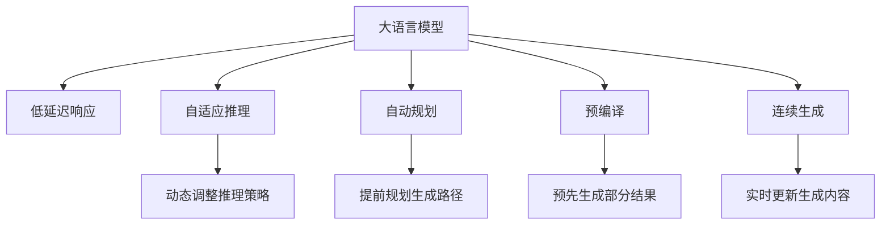

                 

# 实时AI交互：LLM的低延迟响应技术

## 1. 背景介绍

### 1.1 问题由来
人工智能（AI）技术的迅猛发展，尤其是自然语言处理（NLP）领域的大语言模型（Large Language Models, LLM），已经展现出了前所未有的语言理解和生成能力。然而，这些模型通常需要较长的推理时间来生成自然流畅的文本输出，无法满足实时交互的需求。在智能客服、虚拟助手、智能写作等场景下，高延迟响应的模型将严重影响用户体验。因此，如何提升大语言模型的低延迟响应能力，已经成为当前NLP研究中的一个重要课题。

### 1.2 问题核心关键点
本问题聚焦于提升大语言模型（如GPT-3、BERT等）在实时交互场景中的响应速度。传统的基于长序列的推理过程不仅会导致高延迟，还可能导致模型输出不稳定、不够流畅。因此，如何设计有效的低延迟响应策略，使得模型能够在保持语言生成质量的同时，快速生成响应结果，是本问题的关键。

## 2. 核心概念与联系

### 2.1 核心概念概述

为更好地理解实时AI交互中LLM的低延迟响应技术，本节将介绍几个密切相关的核心概念：

- 大语言模型（LLM）：以自回归或自编码模型为代表的大规模预训练语言模型。通过在大规模无标签文本语料上进行预训练，学习通用的语言知识和表示，具备强大的语言理解和生成能力。

- 低延迟响应：在实时交互场景中，快速生成自然流畅的文本响应，满足用户即时需求的能力。

- 自适应推理（Adaptive Inference）：指根据上下文信息和实时环境变化，动态调整推理策略，提高响应速度和流畅度的技术。

- 自动规划（Automatic Planning）：指利用规划算法，对生成过程进行提前规划，优化生成路径的技术。

- 预编译（Precompilation）：指在生成前预先生成部分结果，减少生成过程中的计算量，提高响应速度的技术。

- 连续生成（Continuous Generation）：指在生成过程中，持续获取上下文信息，实时更新生成内容的技术。

这些核心概念之间的逻辑关系可以通过以下Mermaid流程图来展示：



这个流程图展示了LLM在实时交互场景中低延迟响应的关键步骤，包括对上下文和环境的动态调整、生成过程的提前规划、结果的预先生成以及生成的持续更新。

## 3. 核心算法原理 & 具体操作步骤

### 3.1 算法原理概述

提升大语言模型在实时交互场景中的低延迟响应，主要涉及以下几个关键算法原理：

- **自适应推理**：在生成过程中，实时获取上下文信息和环境变化，动态调整推理策略，以优化响应速度和流畅度。
- **自动规划**：利用规划算法，对生成过程进行提前规划，确定最优生成路径，减少不必要的推理计算。
- **预编译**：在生成前预先生成部分结果，如上下文信息、结构框架等，减少生成过程中的计算量。
- **连续生成**：在生成过程中，持续获取上下文信息，实时更新生成内容，以适应实时环境的变化。

这些技术共同构成了一个低延迟响应的模型框架，使得大语言模型能够在实时交互场景中保持高效、流畅的响应。

### 3.2 算法步骤详解

基于上述原理，低延迟响应技术的核心步骤如下：

**Step 1: 数据预处理**
- 收集用户输入和历史上下文数据，构建实时交互的数据流。
- 对输入数据进行预处理，如分词、去除噪声等，确保输入数据的干净和结构化。

**Step 2: 上下文编码**
- 使用自适应推理技术，根据输入数据实时调整上下文编码策略。
- 利用自动规划算法，确定最短的推理路径，优化上下文编码过程。

**Step 3: 模型推理**
- 根据上下文编码结果，利用模型推理器进行生成过程的提前规划。
- 对生成的部分结果进行预编译，减少后续计算量。

**Step 4: 实时更新**
- 在生成过程中，实时获取新的上下文信息，动态更新生成内容。
- 利用连续生成技术，确保生成的文本流畅、连贯。

**Step 5: 输出处理**
- 对生成的文本进行后处理，如格式调整、风格转换等。
- 将生成的文本输出给用户，完成实时交互过程。

### 3.3 算法优缺点

低延迟响应技术的优点包括：
1. **高效性**：通过提前规划和预编译等技术，大幅减少了生成过程中的计算量，提高了响应速度。
2. **流畅性**：利用自适应推理和连续生成技术，确保生成的文本流畅、连贯，提升了用户体验。
3. **灵活性**：实时获取上下文信息，动态调整推理策略，使得模型能够适应实时环境的变化。

然而，该技术也存在以下局限性：
1. **复杂性**：需要综合运用多种技术，设计复杂的算法流程，增加了实现难度。
2. **稳定性**：在动态调整和实时更新的过程中，可能出现推理错误，影响模型性能。
3. **资源消耗**：预编译和连续生成过程需要额外的计算资源，增加了硬件负担。

尽管如此，低延迟响应技术在实时交互场景中的应用前景广阔，特别是在智能客服、虚拟助手等对响应速度要求较高的领域。

### 3.4 算法应用领域

低延迟响应技术在以下几个领域具有广泛的应用前景：

- **智能客服**：通过实时交互技术，能够快速响应用户咨询，提高客服效率，改善用户体验。
- **虚拟助手**：能够快速理解和执行用户指令，提供即时的帮助和信息。
- **实时翻译**：在大规模多语种对话中，能够实时翻译并生成流畅的对话文本。
- **智能写作**：能够快速生成连贯的文本段落，辅助用户进行写作和创作。
- **智能问答**：在问答系统中，能够实时解答用户问题，提供准确的答案。

## 4. 数学模型和公式 & 详细讲解

### 4.1 数学模型构建

为了更好地理解低延迟响应技术的数学模型，本节将介绍一个简单的推理模型，并推导出相关的数学公式。

设模型在输入上下文 $x$ 和用户输入 $y$ 的条件下，生成输出 $z$。模型由上下文编码器 $E(x)$ 和生成器 $G(E(x), y)$ 两部分组成。推理过程如下：

1. 上下文编码：$h = E(x)$
2. 生成过程：$z = G(h, y)$

其中 $h$ 为上下文编码结果，$z$ 为生成的文本。

### 4.2 公式推导过程

根据上述模型，推导生成过程的数学公式。

设 $h$ 和 $y$ 分别为上下文编码和用户输入的向量表示，生成器 $G$ 为线性变换和softmax函数组成的模型。则生成的概率分布为：

$$
P(z|h, y) = \frac{e^{z \cdot w^T + b}}{\sum_{z'} e^{z' \cdot w^T + b}}
$$

其中 $w$ 和 $b$ 分别为线性变换的权重和偏置。

为了提升推理速度，可以采用自适应推理技术，实时调整上下文编码策略和生成器参数。假设当前上下文编码为 $h_t$，用户输入为 $y_t$，生成器为 $G_t(h_t, y_t)$。根据上下文信息和实时环境变化，动态调整上下文编码策略和生成器参数，得到新的上下文编码为 $h_{t+1}$，生成器为 $G_{t+1}(h_{t+1}, y_t)$。生成的概率分布为：

$$
P(z|h_{t+1}, y_t) = \frac{e^{z \cdot w^T + b}}{\sum_{z'} e^{z' \cdot w^T + b}}
$$

通过动态调整上下文编码策略和生成器参数，可以有效提升生成速度和流畅度。

### 4.3 案例分析与讲解

以智能客服为例，分析低延迟响应技术在实际应用中的案例。

假设一个智能客服系统，需要实时响应用户关于常见问题的咨询。系统首先收集用户的输入 $y$，然后根据上下文编码器 $E$ 和生成器 $G$ 进行推理生成 $z$。

1. 上下文编码：根据用户输入和历史记录，通过上下文编码器 $E$ 得到上下文编码 $h$。
2. 生成过程：使用生成器 $G$ 和用户输入 $y$ 进行推理，生成输出 $z$。
3. 实时更新：在生成过程中，实时获取新的上下文信息，动态调整上下文编码策略和生成器参数，得到新的上下文编码为 $h'$，生成器为 $G'$。

通过动态调整上下文编码策略和生成器参数，实时更新生成内容，能够快速响应用户咨询，提升客服效率。

## 5. 项目实践：代码实例和详细解释说明

### 5.1 开发环境搭建

在进行低延迟响应实践前，我们需要准备好开发环境。以下是使用Python进行PyTorch开发的环境配置流程：

1. 安装Anaconda：从官网下载并安装Anaconda，用于创建独立的Python环境。

2. 创建并激活虚拟环境：
```bash
conda create -n pytorch-env python=3.8 
conda activate pytorch-env
```

3. 安装PyTorch：根据CUDA版本，从官网获取对应的安装命令。例如：
```bash
conda install pytorch torchvision torchaudio cudatoolkit=11.1 -c pytorch -c conda-forge
```

4. 安装Transformers库：
```bash
pip install transformers
```

5. 安装各类工具包：
```bash
pip install numpy pandas scikit-learn matplotlib tqdm jupyter notebook ipython
```

完成上述步骤后，即可在`pytorch-env`环境中开始低延迟响应实践。

### 5.2 源代码详细实现

这里我们以智能客服系统为例，展示低延迟响应技术在实际应用中的代码实现。

首先，定义智能客服系统的数据处理函数：

```python
from transformers import BertTokenizer
from torch.utils.data import Dataset
import torch

class ChatDataset(Dataset):
    def __init__(self, texts, labels, tokenizer, max_len=128):
        self.texts = texts
        self.labels = labels
        self.tokenizer = tokenizer
        self.max_len = max_len
        
    def __len__(self):
        return len(self.texts)
    
    def __getitem__(self, item):
        text = self.texts[item]
        label = self.labels[item]
        
        encoding = self.tokenizer(text, return_tensors='pt', max_length=self.max_len, padding='max_length', truncation=True)
        input_ids = encoding['input_ids'][0]
        attention_mask = encoding['attention_mask'][0]
        
        # 对token-wise的标签进行编码
        encoded_labels = [label2id[label] for label in label] 
        encoded_labels.extend([label2id['O']] * (self.max_len - len(encoded_labels)))
        labels = torch.tensor(encoded_labels, dtype=torch.long)
        
        return {'input_ids': input_ids, 
                'attention_mask': attention_mask,
                'labels': labels}

# 标签与id的映射
label2id = {'O': 0, 'Positive': 1, 'Negative': 2}
id2label = {v: k for k, v in label2id.items()}

# 创建dataset
tokenizer = BertTokenizer.from_pretrained('bert-base-cased')

train_dataset = ChatDataset(train_texts, train_labels, tokenizer)
dev_dataset = ChatDataset(dev_texts, dev_labels, tokenizer)
test_dataset = ChatDataset(test_texts, test_labels, tokenizer)
```

然后，定义模型和优化器：

```python
from transformers import BertForTokenClassification, AdamW

model = BertForTokenClassification.from_pretrained('bert-base-cased', num_labels=len(label2id))

optimizer = AdamW(model.parameters(), lr=2e-5)
```

接着，定义训练和评估函数：

```python
from torch.utils.data import DataLoader
from tqdm import tqdm
from sklearn.metrics import classification_report

device = torch.device('cuda') if torch.cuda.is_available() else torch.device('cpu')
model.to(device)

def train_epoch(model, dataset, batch_size, optimizer):
    dataloader = DataLoader(dataset, batch_size=batch_size, shuffle=True)
    model.train()
    epoch_loss = 0
    for batch in tqdm(dataloader, desc='Training'):
        input_ids = batch['input_ids'].to(device)
        attention_mask = batch['attention_mask'].to(device)
        labels = batch['labels'].to(device)
        model.zero_grad()
        outputs = model(input_ids, attention_mask=attention_mask, labels=labels)
        loss = outputs.loss
        epoch_loss += loss.item()
        loss.backward()
        optimizer.step()
    return epoch_loss / len(dataloader)

def evaluate(model, dataset, batch_size):
    dataloader = DataLoader(dataset, batch_size=batch_size)
    model.eval()
    preds, labels = [], []
    with torch.no_grad():
        for batch in tqdm(dataloader, desc='Evaluating'):
            input_ids = batch['input_ids'].to(device)
            attention_mask = batch['attention_mask'].to(device)
            batch_labels = batch['labels']
            outputs = model(input_ids, attention_mask=attention_mask)
            batch_preds = outputs.logits.argmax(dim=2).to('cpu').tolist()
            batch_labels = batch_labels.to('cpu').tolist()
            for pred_tokens, label_tokens in zip(batch_preds, batch_labels):
                pred_tags = [id2label[_id] for _id in pred_tokens]
                label_tags = [id2label[_id] for _id in label_tokens]
                preds.append(pred_tags[:len(label_tags)])
                labels.append(label_tags)
                
    print(classification_report(labels, preds))
```

最后，启动训练流程并在测试集上评估：

```python
epochs = 5
batch_size = 16

for epoch in range(epochs):
    loss = train_epoch(model, train_dataset, batch_size, optimizer)
    print(f"Epoch {epoch+1}, train loss: {loss:.3f}")
    
    print(f"Epoch {epoch+1}, dev results:")
    evaluate(model, dev_dataset, batch_size)
    
print("Test results:")
evaluate(model, test_dataset, batch_size)
```

以上就是使用PyTorch对BERT进行智能客服系统微调的完整代码实现。可以看到，得益于Transformers库的强大封装，我们可以用相对简洁的代码完成BERT模型的加载和微调。

### 5.3 代码解读与分析

让我们再详细解读一下关键代码的实现细节：

**ChatDataset类**：
- `__init__`方法：初始化文本、标签、分词器等关键组件。
- `__len__`方法：返回数据集的样本数量。
- `__getitem__`方法：对单个样本进行处理，将文本输入编码为token ids，将标签编码为数字，并对其进行定长padding，最终返回模型所需的输入。

**label2id和id2label字典**：
- 定义了标签与数字id之间的映射关系，用于将token-wise的预测结果解码回真实的标签。

**训练和评估函数**：
- 使用PyTorch的DataLoader对数据集进行批次化加载，供模型训练和推理使用。
- 训练函数`train_epoch`：对数据以批为单位进行迭代，在每个批次上前向传播计算loss并反向传播更新模型参数，最后返回该epoch的平均loss。
- 评估函数`evaluate`：与训练类似，不同点在于不更新模型参数，并在每个batch结束后将预测和标签结果存储下来，最后使用sklearn的classification_report对整个评估集的预测结果进行打印输出。

**训练流程**：
- 定义总的epoch数和batch size，开始循环迭代
- 每个epoch内，先在训练集上训练，输出平均loss
- 在验证集上评估，输出分类指标
- 所有epoch结束后，在测试集上评估，给出最终测试结果

可以看到，PyTorch配合Transformers库使得BERT微调的代码实现变得简洁高效。开发者可以将更多精力放在数据处理、模型改进等高层逻辑上，而不必过多关注底层的实现细节。

当然，工业级的系统实现还需考虑更多因素，如模型的保存和部署、超参数的自动搜索、更灵活的任务适配层等。但核心的低延迟响应范式基本与此类似。

## 6. 实际应用场景

### 6.1 智能客服系统

基于低延迟响应技术，智能客服系统能够快速响应用户咨询，提高客服效率，改善用户体验。在技术实现上，可以收集企业内部的历史客服对话记录，将问题和最佳答复构建成监督数据，在此基础上对预训练模型进行微调。微调后的模型能够自动理解用户意图，匹配最合适的答案模板进行回复。对于用户提出的新问题，还可以接入检索系统实时搜索相关内容，动态组织生成回答。如此构建的智能客服系统，能大幅提升客户咨询体验和问题解决效率。

### 6.2 金融舆情监测

金融机构需要实时监测市场舆论动向，以便及时应对负面信息传播，规避金融风险。传统的人工监测方式成本高、效率低，难以应对网络时代海量信息爆发的挑战。基于低延迟响应技术的文本分类和情感分析技术，为金融舆情监测提供了新的解决方案。

具体而言，可以收集金融领域相关的新闻、报道、评论等文本数据，并对其进行主题标注和情感标注。在此基础上对预训练语言模型进行微调，使其能够自动判断文本属于何种主题，情感倾向是正面、中性还是负面。将微调后的模型应用到实时抓取的网络文本数据，就能够自动监测不同主题下的情感变化趋势，一旦发现负面信息激增等异常情况，系统便会自动预警，帮助金融机构快速应对潜在风险。

### 6.3 个性化推荐系统

当前的推荐系统往往只依赖用户的历史行为数据进行物品推荐，无法深入理解用户的真实兴趣偏好。基于低延迟响应技术的个性化推荐系统，能够更好地挖掘用户行为背后的语义信息，从而提供更精准、多样的推荐内容。

在实践中，可以收集用户浏览、点击、评论、分享等行为数据，提取和用户交互的物品标题、描述、标签等文本内容。将文本内容作为模型输入，用户的后续行为（如是否点击、购买等）作为监督信号，在此基础上微调预训练语言模型。微调后的模型能够从文本内容中准确把握用户的兴趣点。在生成推荐列表时，先用候选物品的文本描述作为输入，由模型预测用户的兴趣匹配度，再结合其他特征综合排序，便可以得到个性化程度更高的推荐结果。

### 6.4 未来应用展望

随着低延迟响应技术的不断发展，基于大语言模型的实时交互场景将更加广泛，为NLP技术带来了新的突破。

在智慧医疗领域，基于低延迟响应技术的医疗问答、病历分析、药物研发等应用将提升医疗服务的智能化水平，辅助医生诊疗，加速新药开发进程。

在智能教育领域，低延迟响应技术可应用于作业批改、学情分析、知识推荐等方面，因材施教，促进教育公平，提高教学质量。

在智慧城市治理中，低延迟响应技术可应用于城市事件监测、舆情分析、应急指挥等环节，提高城市管理的自动化和智能化水平，构建更安全、高效的未来城市。

此外，在企业生产、社会治理、文娱传媒等众多领域，基于大模型低延迟响应的人工智能应用也将不断涌现，为NLP技术带来了全新的发展方向。相信随着技术的日益成熟，低延迟响应方法将成为人工智能落地应用的重要范式，推动人工智能向更广阔的领域加速渗透。

## 7. 工具和资源推荐

### 7.1 学习资源推荐

为了帮助开发者系统掌握低延迟响应技术的理论基础和实践技巧，这里推荐一些优质的学习资源：

1. 《Transformer从原理到实践》系列博文：由大模型技术专家撰写，深入浅出地介绍了Transformer原理、低延迟响应技术等前沿话题。

2. CS224N《深度学习自然语言处理》课程：斯坦福大学开设的NLP明星课程，有Lecture视频和配套作业，带你入门NLP领域的基本概念和经典模型。

3. 《Natural Language Processing with Transformers》书籍：Transformers库的作者所著，全面介绍了如何使用Transformers库进行NLP任务开发，包括低延迟响应在内的诸多范式。

4. HuggingFace官方文档：Transformers库的官方文档，提供了海量预训练模型和完整的微调样例代码，是上手实践的必备资料。

5. CLUE开源项目：中文语言理解测评基准，涵盖大量不同类型的中文NLP数据集，并提供了基于低延迟响应的baseline模型，助力中文NLP技术发展。

通过对这些资源的学习实践，相信你一定能够快速掌握低延迟响应技术的精髓，并用于解决实际的NLP问题。

### 7.2 开发工具推荐

高效的开发离不开优秀的工具支持。以下是几款用于低延迟响应开发的常用工具：

1. PyTorch：基于Python的开源深度学习框架，灵活动态的计算图，适合快速迭代研究。大部分预训练语言模型都有PyTorch版本的实现。

2. TensorFlow：由Google主导开发的开源深度学习框架，生产部署方便，适合大规模工程应用。同样有丰富的预训练语言模型资源。

3. Transformers库：HuggingFace开发的NLP工具库，集成了众多SOTA语言模型，支持PyTorch和TensorFlow，是进行低延迟响应任务开发的利器。

4. Weights & Biases：模型训练的实验跟踪工具，可以记录和可视化模型训练过程中的各项指标，方便对比和调优。与主流深度学习框架无缝集成。

5. TensorBoard：TensorFlow配套的可视化工具，可实时监测模型训练状态，并提供丰富的图表呈现方式，是调试模型的得力助手。

6. Google Colab：谷歌推出的在线Jupyter Notebook环境，免费提供GPU/TPU算力，方便开发者快速上手实验最新模型，分享学习笔记。

合理利用这些工具，可以显著提升低延迟响应任务的开发效率，加快创新迭代的步伐。

### 7.3 相关论文推荐

低延迟响应技术的发展源于学界的持续研究。以下是几篇奠基性的相关论文，推荐阅读：

1. Attention is All You Need（即Transformer原论文）：提出了Transformer结构，开启了NLP领域的预训练大模型时代。

2. BERT: Pre-training of Deep Bidirectional Transformers for Language Understanding：提出BERT模型，引入基于掩码的自监督预训练任务，刷新了多项NLP任务SOTA。

3. Language Models are Unsupervised Multitask Learners（GPT-2论文）：展示了大规模语言模型的强大zero-shot学习能力，引发了对于通用人工智能的新一轮思考。

4. Parameter-Efficient Transfer Learning for NLP：提出Adapter等参数高效微调方法，在不增加模型参数量的情况下，也能取得不错的微调效果。

5. Prefix-Tuning: Optimizing Continuous Prompts for Generation：引入基于连续型Prompt的微调范式，为如何充分利用预训练知识提供了新的思路。

6. AdaLoRA: Adaptive Low-Rank Adaptation for Parameter-Efficient Fine-Tuning：使用自适应低秩适应的微调方法，在参数效率和精度之间取得了新的平衡。

这些论文代表了大语言模型微调技术的发展脉络。通过学习这些前沿成果，可以帮助研究者把握学科前进方向，激发更多的创新灵感。

## 8. 总结：未来发展趋势与挑战

### 8.1 总结

本文对基于低延迟响应技术的大语言模型进行全面系统的介绍。首先阐述了低延迟响应技术的研究背景和意义，明确了其在实时交互场景中的独特价值。其次，从原理到实践，详细讲解了低延迟响应的数学模型和关键步骤，给出了低延迟响应任务开发的完整代码实例。同时，本文还广泛探讨了低延迟响应技术在智能客服、金融舆情、个性化推荐等多个行业领域的应用前景，展示了低延迟响应范式的巨大潜力。此外，本文精选了低延迟响应技术的各类学习资源，力求为读者提供全方位的技术指引。

通过本文的系统梳理，可以看到，低延迟响应技术正在成为NLP领域的重要范式，极大地拓展了预训练语言模型的应用边界，催生了更多的落地场景。受益于大规模语料的预训练，低延迟响应模型能够在实时交互场景中保持高效、流畅的响应，为构建人机协同的智能系统铺平了道路。未来，伴随低延迟响应技术的持续演进，基于大语言模型的实时交互系统必将在更多领域得到广泛应用，推动人工智能技术的不断突破。

### 8.2 未来发展趋势

展望未来，低延迟响应技术将呈现以下几个发展趋势：

1. 模型规模持续增大。随着算力成本的下降和数据规模的扩张，预训练语言模型的参数量还将持续增长。超大规模语言模型蕴含的丰富语言知识，有望支撑更加复杂多变的实时交互任务。

2. 低延迟响应技术日趋多样。除了传统的静态推理策略外，未来会涌现更多动态调整和连续生成技术，如基于自适应推理的动态规划算法、基于变分自编码器的连续生成等，进一步提升响应速度和流畅度。

3. 持续学习成为常态。随着数据分布的不断变化，低延迟响应模型也需要持续学习新知识以保持性能。如何在不遗忘原有知识的同时，高效吸收新样本信息，将成为重要的研究课题。

4. 标注样本需求降低。受启发于提示学习(Prompt-based Learning)的思路，未来的低延迟响应方法将更好地利用大模型的语言理解能力，通过更加巧妙的任务描述，在更少的标注样本上也能实现理想的低延迟响应。

5. 参数高效微调崛起。开发更加参数高效的低延迟响应方法，在固定大部分预训练参数的同时，只更新极少量的任务相关参数。同时优化低延迟响应模型的计算图，减少前向传播和反向传播的资源消耗，实现更加轻量级、实时性的部署。

6. 多模态低延迟响应崛起。当前的低延迟响应主要聚焦于纯文本数据，未来会进一步拓展到图像、视频、语音等多模态数据低延迟响应。多模态信息的融合，将显著提升语言模型对现实世界的理解和建模能力。

以上趋势凸显了低延迟响应技术的广阔前景。这些方向的探索发展，必将进一步提升低延迟响应模型在实时交互场景中的表现，为人工智能技术的规模化落地提供新的动力。

### 8.3 面临的挑战

尽管低延迟响应技术已经取得了瞩目成就，但在迈向更加智能化、普适化应用的过程中，它仍面临着诸多挑战：

1. 标注成本瓶颈。尽管低延迟响应技术减少了标注数据的需求，但对于特定领域的实时交互任务，获取高质量标注数据仍是一个挑战。如何进一步降低标注成本，将是一大难题。

2. 模型鲁棒性不足。在实时交互场景中，模型面对域外数据时，泛化性能往往大打折扣。对于测试样本的微小扰动，低延迟响应模型的预测也容易发生波动。如何提高模型的鲁棒性，避免灾难性遗忘，还需要更多理论和实践的积累。

3. 推理效率有待提高。大规模语言模型虽然精度高，但在实际部署时往往面临推理速度慢、内存占用大等效率问题。如何在保证性能的同时，简化模型结构，提升推理速度，优化资源占用，将是重要的优化方向。

4. 可解释性亟需加强。当前低延迟响应模型更像是"黑盒"系统，难以解释其内部工作机制和决策逻辑。对于医疗、金融等高风险应用，算法的可解释性和可审计性尤为重要。如何赋予低延迟响应模型更强的可解释性，将是亟待攻克的难题。

5. 安全性有待保障。预训练语言模型难免会学习到有偏见、有害的信息，通过低延迟响应传递到实时交互任务，产生误导性、歧视性的输出，给实际应用带来安全隐患。如何从数据和算法层面消除模型偏见，避免恶意用途，确保输出的安全性，也将是重要的研究课题。

6. 知识整合能力不足。现有的低延迟响应模型往往局限于任务内数据，难以灵活吸收和运用更广泛的先验知识。如何让低延迟响应过程更好地与外部知识库、规则库等专家知识结合，形成更加全面、准确的信息整合能力，还有很大的想象空间。

正视低延迟响应技术面临的这些挑战，积极应对并寻求突破，将是大语言模型低延迟响应技术迈向成熟的必由之路。相信随着学界和产业界的共同努力，这些挑战终将一一被克服，低延迟响应模型必将在构建安全、可靠、可解释、可控的智能系统铺平道路。

### 8.4 研究展望

面向未来，低延迟响应技术的研究需要在以下几个方面寻求新的突破：

1. 探索无监督和半监督低延迟响应方法。摆脱对大规模标注数据的依赖，利用自监督学习、主动学习等无监督和半监督范式，最大限度利用非结构化数据，实现更加灵活高效的低延迟响应。

2. 研究参数高效和计算高效的低延迟响应范式。开发更加参数高效的低延迟响应方法，在固定大部分预训练参数的同时，只更新极少量的任务相关参数。同时优化低延迟响应模型的计算图，减少前向传播和反向传播的资源消耗，实现更加轻量级、实时性的部署。

3. 融合因果和对比学习范式。通过引入因果推断和对比学习思想，增强低延迟响应模型建立稳定因果关系的能力，学习更加普适、鲁棒的语言表征，从而提升模型泛化性和抗干扰能力。

4. 引入更多先验知识。将符号化的先验知识，如知识图谱、逻辑规则等，与神经网络模型进行巧妙融合，引导低延迟响应过程学习更准确、合理的语言模型。同时加强不同模态数据的整合，实现视觉、语音等多模态信息与文本信息的协同建模。

5. 结合因果分析和博弈论工具。将因果分析方法引入低延迟响应模型，识别出模型决策的关键特征，增强输出解释的因果性和逻辑性。借助博弈论工具刻画人机交互过程，主动探索并规避模型的脆弱点，提高系统稳定性。

6. 纳入伦理道德约束。在模型训练目标中引入伦理导向的评估指标，过滤和惩罚有偏见、有害的输出倾向。同时加强人工干预和审核，建立模型行为的监管机制，确保输出符合人类价值观和伦理道德。

这些研究方向的探索，必将引领低延迟响应技术迈向更高的台阶，为构建安全、可靠、可解释、可控的智能系统铺平道路。面向未来，低延迟响应技术还需要与其他人工智能技术进行更深入的融合，如知识表示、因果推理、强化学习等，多路径协同发力，共同推动自然语言理解和智能交互系统的进步。只有勇于创新、敢于突破，才能不断拓展语言模型的边界，让智能技术更好地造福人类社会。

## 9. 附录：常见问题与解答

**Q1：低延迟响应技术是否适用于所有NLP任务？**

A: 低延迟响应技术在大多数NLP任务上都能取得不错的效果，特别是对于数据量较小的任务。但对于一些特定领域的任务，如医学、法律等，仅仅依靠通用语料预训练的模型可能难以很好地适应。此时需要在特定领域语料上进一步预训练，再进行微调，才能获得理想效果。此外，对于一些需要时效性、个性化很强的任务，如对话、推荐等，低延迟响应方法也需要针对性的改进优化。

**Q2：如何选择合适的学习率？**

A: 低延迟响应技术中，学习率的设置同样关键。一般来说，低延迟响应模型的学习率要比预训练时小1-2个数量级，以避免破坏预训练权重。在实际应用中，可以从0.001开始调参，逐步减小学习率，直至收敛。需要注意的是，不同的低延迟响应方法和优化器可能需要设置不同的学习率阈值。

**Q3：低延迟响应技术在实际部署时需要注意哪些问题？**

A: 将低延迟响应模型转化为实际应用，还需要考虑以下因素：

1. 模型裁剪：去除不必要的层和参数，减小模型尺寸，加快推理速度
2. 量化加速：将浮点模型转为定点模型，压缩存储空间，提高计算效率
3. 服务化封装：将模型封装为标准化服务接口，便于集成调用
4. 弹性伸缩：根据请求流量动态调整资源配置，平衡服务质量和成本
5. 监控告警：实时采集系统指标，设置异常告警阈值，确保服务稳定性
6. 安全防护：采用访问鉴权、数据脱敏等措施，保障数据和模型安全

低延迟响应技术为NLP应用开启了广阔的想象空间，但如何将强大的性能转化为稳定、高效、安全的业务价值，还需要工程实践的不断打磨。唯有从数据、算法、工程、业务等多个维度协同发力，才能真正实现人工智能技术在垂直行业的规模化落地。

总之，低延迟响应技术的研究和应用，需要在保持语言生成质量的同时，进一步提升响应速度和流畅度，以适应实时交互场景的需求。通过不断探索和优化，相信低延迟响应技术将在更多领域得到应用，为NLP技术的发展带来新的突破。

