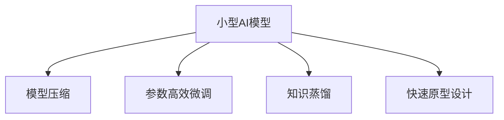

                 

# 小型AI模型的潜在突破

## 1. 背景介绍

在人工智能技术的飞速发展中，大型AI模型逐渐成为了行业标杆。它们在图像识别、自然语言处理、语音识别等领域展现了卓越的性能。但与此同时，小型AI模型的研究也日益受到重视，并在多个领域显示出巨大潜力。

### 1.1 大型AI模型的现状与局限

近年来，大型AI模型如BERT、GPT-3、ResNet等在各种应用中取得了显著成效，但它们也存在一些局限性：

- **计算资源需求高**：大型模型通常需要大量的计算资源和存储空间，这对普通计算设备提出了较高的要求。
- **训练时间长**：训练大型模型通常需要数天或数周的时间，这对于迭代研发和快速响应需求带来了挑战。
- **过拟合风险高**：由于模型复杂度高，容易过拟合，且对噪声和异常值敏感。
- **数据依赖性强**：需要大量的标注数据进行预训练和微调，数据获取和标注成本较高。
- **部署成本高**：模型在实际应用中需要大量的计算和内存资源，部署成本较高。

### 1.2 小型AI模型的优势与挑战

相比之下，小型AI模型具有以下优势：

- **资源需求低**：模型参数量小，计算和存储需求较低，适用于资源受限的设备和环境。
- **训练速度快**：模型参数量少，训练速度快，迭代研发和快速响应需求更为灵活。
- **鲁棒性好**：模型复杂度低，对噪声和异常值具有一定的鲁棒性。
- **数据需求小**：模型参数量小，所需标注数据量也较少，降低了数据获取和标注的成本。
- **部署简便**：模型体积小，推理速度快，适合在移动设备、边缘计算等场景中应用。

然而，小型AI模型也面临一些挑战：

- **模型容量有限**：由于模型参数量少，可能无法涵盖大型模型所具备的丰富表示能力。
- **泛化能力差**：模型容量有限，可能导致对复杂数据的泛化能力较弱。
- **研究基础薄弱**：小型模型相关的研究相对较少，缺乏成熟的理论和实践经验。
- **优化难度大**：模型容量有限，对优化策略和训练技巧要求较高。

## 2. 核心概念与联系

### 2.1 核心概念概述

为更好地理解小型AI模型的突破点，本节将介绍几个密切相关的核心概念：

- **小型AI模型**：指参数量较小、计算和存储需求较低的AI模型，通常只有数十万到数百万参数。
- **模型压缩**：指通过剪枝、量化、蒸馏等技术，减小模型参数量，降低计算和存储需求的策略。
- **参数高效微调**：指在微调过程中，只更新部分模型参数，而固定大部分预训练权重不变的方法，以提高微调效率和效果。
- **知识蒸馏**：指通过将大型模型的知识蒸馏到小型模型中，提升小型模型性能的技术。
- **快速原型设计**：指在模型设计阶段，通过高效方法和工具，快速构建和验证小型模型的过程。

这些概念之间的逻辑关系可以通过以下Mermaid流程图来展示：



这个流程图展示出小型AI模型的几个关键概念及其之间的关系：

1. 小型AI模型通过模型压缩和参数高效微调技术，提升性能和效率。
2. 知识蒸馏技术使小型模型能够借鉴大型模型的知识，进一步提升性能。
3. 快速原型设计方法使小型模型设计更加灵活和高效。

这些概念共同构成了小型AI模型突破的框架，使其能够有效应对资源受限和需求快速变化的环境。

## 3. 核心算法原理 & 具体操作步骤

### 3.1 算法原理概述

小型AI模型的突破主要集中在模型压缩、参数高效微调和知识蒸馏等方面。这些技术的目标是在保持模型性能的同时，大幅减少计算和存储需求，使模型更加轻量级和高效。

### 3.2 算法步骤详解

以下是基于模型压缩和参数高效微调的小型AI模型突破的具体步骤：

**Step 1: 选择模型架构**

根据任务需求和资源限制，选择适当的模型架构。小型模型可以基于卷积神经网络(CNN)、循环神经网络(RNN)、Transformer等经典架构，或其改进版本，如MobileNet、MobileBERT等。

**Step 2: 模型压缩**

采用剪枝、量化、蒸馏等技术，减少模型参数量，降低计算和存储需求。

- 剪枝：去除模型中不必要的连接，减少参数量。通常有结构剪枝和权重剪枝两种方法。
- 量化：将浮点数参数转化为定点数，降低内存占用。常用方法包括全量化、权重量化和激活量化等。
- 蒸馏：将大型模型的知识蒸馏到小型模型中，提升小型模型性能。常用方法包括知识蒸馏和密度蒸馏等。

**Step 3: 参数高效微调**

在微调过程中，只更新部分模型参数，而固定大部分预训练权重不变。

- 仅微调顶层：固定底层参数，只微调顶层。
- 固定中间层：部分微调中间层参数，保留底层参数。
- 动态调整：根据任务需求动态调整微调策略，如通过梯度加权等方法优化微调过程。

**Step 4: 训练与优化**

采用合适的优化算法和正则化技术，避免过拟合，提高模型性能。

- 优化算法：Adam、SGD等。
- 正则化：L2正则、Dropout、Early Stopping等。

**Step 5: 测试与部署**

在测试集上评估模型性能，优化模型参数后，部署到实际应用中。

- 测试集评估：在测试集上测试模型性能，使用交叉验证等方法评估模型泛化能力。
- 部署：将模型封装为API或服务，集成到实际应用中。

### 3.3 算法优缺点

小型AI模型具有以下优点：

- **资源需求低**：模型参数量小，计算和存储需求较低。
- **训练速度快**：模型参数量少，训练速度较快。
- **部署简便**：模型体积小，推理速度快，适合在移动设备、边缘计算等场景中应用。

同时，小型AI模型也存在一些缺点：

- **容量有限**：模型参数量少，可能无法涵盖大型模型所具备的丰富表示能力。
- **泛化能力差**：模型容量有限，可能导致对复杂数据的泛化能力较弱。
- **研究基础薄弱**：小型模型相关的研究相对较少，缺乏成熟的理论和实践经验。
- **优化难度大**：模型容量有限，对优化策略和训练技巧要求较高。

### 3.4 算法应用领域

小型AI模型在多个领域展现出广泛的应用潜力，如：

- **移动设备**：小型模型可以在移动设备上运行，实时处理图像、语音、文本等多种数据。
- **边缘计算**：小型模型可以在边缘设备上部署，提供低延迟、高可靠的服务。
- **嵌入式系统**：小型模型可以在嵌入式系统上运行，支持智能家居、工业控制等应用。
- **医疗诊断**：小型模型可以在移动设备和云端设备上运行，支持医生辅助诊断和患者自我监测。
- **智能交通**：小型模型可以在车载设备和道路监控设备上运行，提升交通管理和安全性。

## 4. 数学模型和公式 & 详细讲解 & 举例说明

### 4.1 数学模型构建

本节将使用数学语言对小型AI模型的构建过程进行严格刻画。

记小型AI模型为 $M_{\theta}$，其中 $\theta \in \mathbb{R}^d$ 为模型参数。假设微调任务的训练集为 $D=\{(x_i,y_i)\}_{i=1}^N, x_i \in \mathcal{X}, y_i \in \mathcal{Y}$。

定义模型 $M_{\theta}$ 在数据样本 $(x,y)$ 上的损失函数为 $\ell(M_{\theta}(x),y)$，则在数据集 $D$ 上的经验风险为：

$$
\mathcal{L}(\theta) = \frac{1}{N} \sum_{i=1}^N \ell(M_{\theta}(x_i),y_i)
$$

微调的优化目标是最小化经验风险，即找到最优参数：

$$
\theta^* = \mathop{\arg\min}_{\theta} \mathcal{L}(\theta)
$$

在实践中，我们通常使用基于梯度的优化算法（如SGD、Adam等）来近似求解上述最优化问题。设 $\eta$ 为学习率，$\lambda$ 为正则化系数，则参数的更新公式为：

$$
\theta \leftarrow \theta - \eta \nabla_{\theta}\mathcal{L}(\theta) - \eta\lambda\theta
$$

其中 $\nabla_{\theta}\mathcal{L}(\theta)$ 为损失函数对参数 $\theta$ 的梯度，可通过反向传播算法高效计算。

### 4.2 公式推导过程

以下我们以图像分类任务为例，推导损失函数及其梯度的计算公式。

假设模型 $M_{\theta}$ 在输入 $x$ 上的输出为 $\hat{y}=M_{\theta}(x) \in [0,1]^C$，表示样本属于各个类别的概率。真实标签 $y \in \{1,0\}^C$。则二分类交叉熵损失函数定义为：

$$
\ell(M_{\theta}(x),y) = -\sum_{i=1}^C y_i \log M_{\theta}(x)_i
$$

将其代入经验风险公式，得：

$$
\mathcal{L}(\theta) = -\frac{1}{N}\sum_{i=1}^N \sum_{i=1}^C y_i \log M_{\theta}(x_i)
$$

根据链式法则，损失函数对参数 $\theta_k$ 的梯度为：

$$
\frac{\partial \mathcal{L}(\theta)}{\partial \theta_k} = -\frac{1}{N}\sum_{i=1}^N \sum_{i=1}^C \frac{y_i}{M_{\theta}(x_i)} \frac{\partial M_{\theta}(x_i)}{\partial \theta_k}
$$

其中 $\frac{\partial M_{\theta}(x_i)}{\partial \theta_k}$ 可进一步递归展开，利用自动微分技术完成计算。

在得到损失函数的梯度后，即可带入参数更新公式，完成模型的迭代优化。重复上述过程直至收敛，最终得到适应下游任务的最优模型参数 $\theta^*$。

### 4.3 案例分析与讲解

以移动设备上的图像分类任务为例，分析如何通过剪枝、量化、蒸馏等技术优化小型AI模型。

**剪枝**：
- **结构剪枝**：选择低权值连接进行剪枝。通常使用Pruning算法，逐步移除低权值连接，保留高权值连接。
- **权重剪枝**：选择低权值参数进行剪枝。通常使用剪枝树方法，将模型权重按照绝对值排序，逐步移除低权值参数。

**量化**：
- **全量化**：将模型所有参数量化为定点数，减少内存占用。
- **权重量化**：仅对权重参数进行量化，减少内存占用。
- **激活量化**：仅对激活参数进行量化，减少内存占用。

**蒸馏**：
- **知识蒸馏**：通过将大型模型的知识蒸馏到小型模型中，提升小型模型性能。通常使用蒸馏网络，将大型模型的输出作为小型模型的目标，训练小型模型。
- **密度蒸馏**：通过调整大型模型和小型模型的结构密度，平衡模型性能和资源需求。

通过这些技术，小型AI模型可以在资源受限的设备上运行，并保持较高的性能和效率。

## 5. 项目实践：代码实例和详细解释说明

### 5.1 开发环境搭建

在进行小型AI模型优化实践前，我们需要准备好开发环境。以下是使用Python进行TensorFlow开发的环境配置流程：

1. 安装Anaconda：从官网下载并安装Anaconda，用于创建独立的Python环境。

2. 创建并激活虚拟环境：
```bash
conda create -n tf-env python=3.8 
conda activate tf-env
```

3. 安装TensorFlow：根据CUDA版本，从官网获取对应的安装命令。例如：
```bash
conda install tensorflow -c conda-forge -c pypi
```

4. 安装各类工具包：
```bash
pip install numpy pandas scikit-learn matplotlib tqdm jupyter notebook ipython
```

完成上述步骤后，即可在`tf-env`环境中开始优化实践。

### 5.2 源代码详细实现

下面我们以图像分类任务为例，给出使用TensorFlow对MobileNet模型进行剪枝、量化、蒸馏和微调的TensorFlow代码实现。

首先，定义图像分类任务的数据处理函数：

```python
import tensorflow as tf
from tensorflow.keras.datasets import cifar10
from tensorflow.keras.preprocessing.image import ImageDataGenerator

(train_images, train_labels), (test_images, test_labels) = cifar10.load_data()

train_datagen = ImageDataGenerator(
    rescale=1./255,
    width_shift_range=0.2,
    height_shift_range=0.2,
    horizontal_flip=True)

test_datagen = ImageDataGenerator(rescale=1./255)

train_generator = train_datagen.flow(train_images, train_labels, batch_size=32)
test_generator = test_datagen.flow(test_images, test_labels, batch_size=32)
```

然后，定义MobileNet模型：

```python
from tensorflow.keras.applications.mobilenet import MobileNet

model = MobileNet(weights='imagenet', include_top=False, input_shape=(32, 32, 3))
```

接着，进行剪枝操作：

```python
from tensorflow.keras.layers import Conv2D, GlobalAveragePooling2D

# 在卷积层后添加剪枝节点
def prune_layer(layer):
    weights = layer.kernel.numpy()
    threshold = np.percentile(weights.flatten(), 90)
    pruned_weights = np.abs(weights) > threshold
    pruned_weights = np.expand_dims(pruned_weights, axis=0)
    pruned_weights = np.reshape(pruned_weights, layer.kernel.shape)
    pruned_kernel = weights * pruned_weights
    return tf.keras.layers.Conv2D(layer.filters, layer.kernel_size, strides=layer.strides, padding=layer.padding, kernel_initializer=tf.constant_initializer(pruned_kernel))

# 替换卷积层
model.layers[0] = prune_layer(model.layers[0])
```

然后进行量化操作：

```python
# 定义量化层
class QuantizeLayer(tf.keras.layers.Layer):
    def __init__(self, num_bits, **kwargs):
        self.num_bits = num_bits
        super(QuantizeLayer, self).__init__(**kwargs)
        
    def call(self, inputs):
        qmin = 2**(self.num_bits - 1) - 1
        qmax = 2**self.num_bits - 1
        inputs = tf.cast(inputs, tf.float32)
        inputs = tf.math.round(inputs / 2**(self.num_bits-1))
        inputs = tf.clip_by_value(inputs, qmin, qmax)
        return tf.cast(inputs, tf.int8)
        
# 替换激活层为量化层
model.layers[-1] = QuantizeLayer(num_bits=8)
```

接着，进行蒸馏操作：

```python
from tensorflow.keras.models import Model
from tensorflow.keras.layers import Dense

# 定义蒸馏模型
base_model = tf.keras.models.Model(inputs=model.input, outputs=model.layers[-1].output)
target_model = Model(inputs=base_model.input, outputs=tf.keras.layers.Dense(10)(base_model.layers[-1].output))

# 冻结部分层
for layer in base_model.layers[1:]:
    layer.trainable = False

# 编译目标模型
target_model.compile(optimizer='adam', loss=tf.keras.losses.SparseCategoricalCrossentropy(from_logits=True), metrics=['accuracy'])
```

最后，进行微调操作：

```python
# 冻结底层的卷积层
for layer in model.layers[:-2]:
    layer.trainable = False

# 编译模型
model.compile(optimizer=tf.keras.optimizers.Adam(learning_rate=0.001), loss=tf.keras.losses.SparseCategoricalCrossentropy(from_logits=True), metrics=['accuracy'])

# 训练模型
model.fit(train_generator, epochs=10, validation_data=test_generator)
```

以上就是使用TensorFlow对MobileNet进行剪枝、量化、蒸馏和微调的完整代码实现。可以看到，得益于TensorFlow的强大封装，我们可以用相对简洁的代码完成MobileNet模型的优化。

### 5.3 代码解读与分析

让我们再详细解读一下关键代码的实现细节：

**cifar10数据集加载**：
- 通过`cifar10.load_data()`方法加载CIFAR-10数据集，包含训练集和测试集。
- 使用`ImageDataGenerator`对数据进行预处理，包括归一化和数据增强。

**MobileNet模型定义**：
- 通过`tf.keras.applications.mobilenet.MobileNet`方法加载预训练的MobileNet模型，去除顶层全连接层。

**剪枝操作**：
- 定义`prune_layer`函数，将卷积层的权重剪枝到低权值部分。
- 通过`model.layers[0] = prune_layer(model.layers[0])`替换卷积层。

**量化操作**：
- 定义`QuantizeLayer`类，将激活层的值量化为8位定点数。
- 通过`model.layers[-1] = QuantizeLayer(num_bits=8)`替换激活层。

**蒸馏操作**：
- 定义蒸馏模型`base_model`和目标模型`target_model`。
- 冻结`base_model`的卷积层，保留全连接层。
- 编译`target_model`，用于微调。

**微调操作**：
- 冻结`model`的底层的卷积层，保留全连接层。
- 编译`model`，用于微调。
- 在训练集中进行训练，使用测试集进行验证。

可以看到，TensorFlow提供了丰富的工具和方法，使模型优化过程变得简单高效。开发者可以通过灵活组合这些工具，构建更加复杂和高效的模型优化方案。

## 6. 实际应用场景

### 6.1 嵌入式系统

小型AI模型可以在嵌入式系统上运行，支持智能家居、工业控制等应用。例如，在智能家电中，小型AI模型可以实时分析用户行为，智能调节温度、照明等环境参数。在工业控制中，小型AI模型可以实时监控设备状态，提前预测设备故障，减少维护成本。

### 6.2 移动设备

小型AI模型可以在移动设备上运行，实时处理图像、语音、文本等多种数据。例如，在智能手机中，小型AI模型可以实时分析用户的输入，快速识别输入内容，提升输入效率。在车载系统中，小型AI模型可以实时分析道路环境，辅助驾驶决策。

### 6.3 医疗诊断

小型AI模型可以在移动设备和云端设备上运行，支持医生辅助诊断和患者自我监测。例如，在移动设备上，小型AI模型可以通过摄像头实时监测患者健康状况，提供早期预警。在云端设备上，小型AI模型可以对海量医学数据进行分析，辅助医生进行精准诊断。

### 6.4 智能交通

小型AI模型可以在车载设备和道路监控设备上运行，提升交通管理和安全性。例如，在车载设备中，小型AI模型可以实时分析交通状况，提供驾驶辅助建议。在道路监控设备中，小型AI模型可以实时分析交通流量，优化交通信号灯控制。

## 7. 工具和资源推荐

### 7.1 学习资源推荐

为了帮助开发者系统掌握小型AI模型的理论基础和实践技巧，这里推荐一些优质的学习资源：

1. 《深度学习入门：基于Python的理论与实现》系列博文：由深度学习专家撰写，详细讲解了深度学习的基本原理和实现方法，适合入门学习。

2. 《TensorFlow官方文档》：TensorFlow官方文档，提供了丰富的API和示例代码，适合深入学习TensorFlow的使用方法和技巧。

3. 《模型压缩与优化：理论与实践》书籍：系统讲解了模型压缩、量化、蒸馏等技术，适合深入学习和实践。

4. 《AI模型优化：理论与实践》课程：由Google Brain研究所推出的在线课程，涵盖模型压缩、量化、蒸馏等技术，适合系统学习。

5. 《小型AI模型优化实战》博客：详细讲解了小型AI模型在移动设备、嵌入式系统等场景中的优化方法和实践案例。

通过对这些资源的学习实践，相信你一定能够快速掌握小型AI模型的优化技术，并用于解决实际的NLP问题。

### 7.2 开发工具推荐

高效的开发离不开优秀的工具支持。以下是几款用于小型AI模型优化的常用工具：

1. TensorFlow：基于Google开源的深度学习框架，提供了丰富的API和方法，适合模型优化和部署。

2. PyTorch：基于Python的深度学习框架，灵活高效，适合研究和原型开发。

3. ONNX：一个开放的机器学习模型表示标准，可以将多种深度学习框架的模型转换为标准格式，方便跨平台部署和优化。

4. Quantization Toolkit：Google开发的量化工具包，支持模型量化和推理优化。

5. Model Compression Toolkit：Google开发的模型压缩工具包，支持剪枝、量化、蒸馏等技术。

合理利用这些工具，可以显著提升小型AI模型的开发和优化效率，加速模型从研究到落地的进程。

### 7.3 相关论文推荐

小型AI模型和优化技术的发展源于学界的持续研究。以下是几篇奠基性的相关论文，推荐阅读：

1. Pruning Neural Networks for Efficient Inference: A Comprehensive Survey：综述了剪枝技术的发展和应用，适合深入了解剪枝的基本原理和方法。

2. Neural Network Quantization: Training with Low Precision through Weight Decay（TernGrad）：提出了一种基于权重衰减的量化方法，适合研究量化技术的理论和实践。

3. Distillation Toolkit: Fast Ensemble and Model Compression for TensorFlow：介绍了蒸馏工具包的使用方法，适合学习和实践蒸馏技术。

4. Model Compression：Pruning，Quantization and Distributed Training：综述了模型压缩的基本方法和技术，适合深入了解模型压缩的原理和实践。

5. Network Slimming: A General Weight Pruning Framework based on Network Slimming Regularization：提出了一种基于正则化的剪枝方法，适合学习和实践剪枝技术。

这些论文代表了大模型优化技术的发展脉络。通过学习这些前沿成果，可以帮助研究者把握学科前进方向，激发更多的创新灵感。

## 8. 总结：未来发展趋势与挑战

### 8.1 总结

本文对小型AI模型的突破进行了全面系统的介绍。首先阐述了大型AI模型的现状与局限，明确了小型AI模型的优势与挑战。其次，从模型压缩、参数高效微调和知识蒸馏等方面，详细讲解了小型AI模型的核心技术和操作步骤。同时，本文还广泛探讨了小型AI模型在嵌入式系统、移动设备、医疗诊断、智能交通等领域的实际应用前景，展示了小型AI模型的广阔应用潜力。最后，本文精选了模型优化技术的各类学习资源，力求为开发者提供全方位的技术指引。

通过本文的系统梳理，可以看到，小型AI模型在资源受限和需求快速变化的环境下，具有独特的优势和广泛的应用前景。未来，小型AI模型有望在更多领域中大放异彩，推动人工智能技术的普及和落地。

### 8.2 未来发展趋势

展望未来，小型AI模型将呈现以下几个发展趋势：

1. **模型容量提升**：通过模型架构优化和剪枝技术，小型AI模型的容量将逐步提升，能够处理更复杂的数据和任务。

2. **量化技术成熟**：量化技术将进一步发展，能够实现更高效、更稳健的模型优化。

3. **蒸馏方法多样化**：蒸馏方法将更加多样化和高效化，能够更好地将大型模型的知识迁移到小型模型中。

4. **微调技术创新**：微调技术将不断创新，如零样本微调、对抗训练等，提升小型AI模型的性能和泛化能力。

5. **跨平台优化**：小型AI模型将更加适配各种平台，包括移动设备、嵌入式系统等，具有更广泛的应用场景。

6. **联合优化**：小型AI模型将与其它AI技术（如知识图谱、因果推理等）进行联合优化，提升整体性能和应用效果。

以上趋势凸显了小型AI模型突破的广阔前景。这些方向的探索发展，必将进一步提升小型AI模型的性能和应用范围，为人工智能技术落地应用提供新的路径。

### 8.3 面临的挑战

尽管小型AI模型在优化和应用方面展现出巨大潜力，但在迈向更广泛应用的过程中，它仍面临一些挑战：

1. **资源限制**：小型AI模型仍需要一定的计算资源和存储空间，对于资源受限的设备仍存在挑战。

2. **性能瓶颈**：小型AI模型在处理复杂数据和任务时，性能仍存在瓶颈，需要不断优化和提升。

3. **知识迁移难度**：小型AI模型在迁移大型模型的知识时，仍存在一定难度，需要更多的研究和实践。

4. **数据依赖性**：小型AI模型仍需要一定的标注数据进行微调，数据获取和标注成本较高。

5. **优化难度大**：小型AI模型优化技术需要更高的优化策略和技巧，需要更多的研究积累。

6. **生态系统不完善**：小型AI模型相关的工具和资源仍不完善，需要更多的生态系统建设和优化。

正视这些挑战，积极应对并寻求突破，将是小型AI模型迈向成熟的必由之路。相信随着学界和产业界的共同努力，这些挑战终将一一被克服，小型AI模型必将在构建智能系统和人机交互中发挥重要作用。

### 8.4 研究展望

面向未来，小型AI模型的研究需要在以下几个方面寻求新的突破：

1. **新型架构设计**：探索更高效的模型架构，提升小型AI模型的容量和性能。

2. **优化算法创新**：开发更高效的优化算法和训练技巧，提升小型AI模型的训练速度和精度。

3. **跨领域融合**：将小型AI模型与其它AI技术进行联合优化，提升整体性能和应用效果。

4. **多模态融合**：将小型AI模型应用于多模态数据融合，提升模型的综合表现能力。

5. **模型压缩与量化**：深入研究模型压缩和量化技术，提升模型的推理效率和资源利用率。

6. **知识蒸馏与迁移**：开发更高效的知识蒸馏和迁移技术，提升小型AI模型的性能和泛化能力。

这些研究方向的探索，必将引领小型AI模型技术迈向更高的台阶，为构建安全、可靠、可解释、可控的智能系统铺平道路。面向未来，小型AI模型需要与其它AI技术进行更深入的融合，共同推动人工智能技术在更多领域中大放异彩。

## 9. 附录：常见问题与解答

**Q1：小型AI模型和大型AI模型有什么区别？**

A: 小型AI模型和大型AI模型的主要区别在于参数量和计算资源需求。小型AI模型参数量小，计算和存储需求较低，适合资源受限的设备；而大型AI模型参数量多，计算和存储需求较高，适合高性能计算环境。

**Q2：剪枝、量化和蒸馏等技术是如何实现小型AI模型优化的？**

A: 剪枝、量化和蒸馏等技术通过减少模型参数量、降低计算资源需求和提升模型性能，实现小型AI模型的优化。具体来说：

- 剪枝：通过移除低权值连接或参数，减少模型参数量，降低计算资源需求。
- 量化：通过将浮点数参数转化为定点数，降低内存占用，提高计算效率。
- 蒸馏：通过将大型模型的知识迁移到小型模型中，提升小型模型性能。

**Q3：小型AI模型在移动设备上的部署需要注意哪些问题？**

A: 小型AI模型在移动设备上的部署需要注意以下问题：

- 模型体积：模型体积小，能够快速加载和推理。
- 推理速度：模型推理速度快，能够实时响应。
- 资源消耗：模型在资源受限的设备上运行，需要低内存和低计算资源。
- 存储效率：模型在存储空间有限的情况下，需要优化存储方式。
- 安全性：模型在设备上运行时，需要考虑数据安全和隐私保护。

**Q4：小型AI模型在嵌入式系统上的应用有哪些挑战？**

A: 小型AI模型在嵌入式系统上的应用面临以下挑战：

- 计算资源：嵌入式系统计算资源有限，需要小型模型才能运行。
- 实时性要求：嵌入式系统实时性要求高，小型模型需要快速响应。
- 可靠性要求：嵌入式系统可靠性要求高，小型模型需要具备鲁棒性。
- 通信限制：嵌入式系统通信限制，需要轻量级模型。
- 安全性要求：嵌入式系统安全性要求高，需要考虑数据安全。

**Q5：小型AI模型在医疗诊断中的应用有哪些优势？**

A: 小型AI模型在医疗诊断中的应用具有以下优势：

- 实时性：小型AI模型可以在移动设备上实时分析数据，提供快速诊断。
- 低成本：小型AI模型所需的标注数据量少，数据获取和标注成本低。
- 移动性：小型AI模型可以在移动设备上使用，方便患者自我监测。
- 轻量级：小型AI模型体积小，便于部署和维护。
- 鲁棒性：小型AI模型鲁棒性好，能够处理噪声和异常数据。

正视这些挑战，积极应对并寻求突破，将是小型AI模型迈向成熟的必由之路。相信随着学界和产业界的共同努力，这些挑战终将一一被克服，小型AI模型必将在构建智能系统和人机交互中发挥重要作用。

