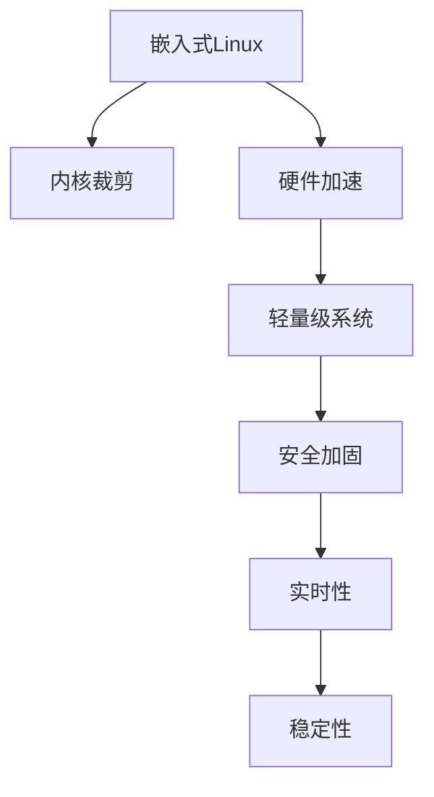

                 

# 嵌入式 Linux 定制：为设备优化 Linux

> 关键词：嵌入式Linux,定制优化,内核裁剪,硬件加速,轻量级系统,安全加固,实时性,稳定性

## 1. 背景介绍

### 1.1 问题由来

随着物联网(IoT)和边缘计算的兴起，嵌入式设备在工业、医疗、智能家居等领域的应用日益普及。嵌入式设备的性能优化、安全加固、实时响应等需求，促使Linux内核和应用程序的定制化需求日益增加。然而，传统Linux内核庞大且通用性强，并不完全适用于各种嵌入式系统，需要通过裁剪、优化、增强等方式进行定制化，以适应硬件平台特性和应用场景需求。

### 1.2 问题核心关键点

嵌入式Linux定制的核心在于：
1. **内核裁剪**：根据嵌入式硬件资源和应用需求，选择保留必要的功能，去除冗余组件，以减小内核体积和提高性能。
2. **硬件加速**：利用硬件特性进行特定任务优化，如GPU、DSP、FPGA等，提升计算效率和功耗管理。
3. **轻量级系统**：在有限的硬件资源下，构建最小化、高效的系统内核和应用，以实现最优性能和最低功耗。
4. **安全加固**：通过增强安全机制，如强制访问控制、加密存储、安全启动等，确保系统安全性和可信度。
5. **实时性**：优化调度策略，减少中断延迟和上下文切换，确保系统的实时响应和稳定性。
6. **稳定性**：构建鲁棒性强的系统架构，容错、自恢复机制，确保系统在异常情况下的稳定性。

这些关键点不仅决定了嵌入式Linux系统的核心能力，还直接影响着系统的整体表现和用户体验。

## 2. 核心概念与联系

### 2.1 核心概念概述

为更好地理解嵌入式Linux定制的核心概念，本节将介绍几个密切相关的核心概念：

- **嵌入式Linux**：专为嵌入式系统设计的操作系统，通过裁剪、优化等方式，实现对资源和性能的高效利用。
- **内核裁剪**：根据设备硬件和应用需求，选择保留必要的功能，去除冗余组件，以减小内核体积和提高性能。
- **硬件加速**：利用硬件特性进行特定任务优化，如GPU、DSP、FPGA等，提升计算效率和功耗管理。
- **轻量级系统**：在有限的硬件资源下，构建最小化、高效的系统内核和应用，以实现最优性能和最低功耗。
- **安全加固**：通过增强安全机制，如强制访问控制、加密存储、安全启动等，确保系统安全性和可信度。
- **实时性**：优化调度策略，减少中断延迟和上下文切换，确保系统的实时响应和稳定性。
- **稳定性**：构建鲁棒性强的系统架构，容错、自恢复机制，确保系统在异常情况下的稳定性。

这些核心概念之间的逻辑关系可以通过以下Mermaid流程图来展示：



这个流程图展示了他的核心概念及其之间的关系：

1. 嵌入式Linux通过内核裁剪、硬件加速等技术，实现资源优化。
2. 轻量级系统构建在优化内核的基础上，进一步提升性能。
3. 安全加固保证系统的可信度和安全性。
4. 实时性通过优化调度策略，确保系统的高效响应。
5. 稳定性通过构建鲁棒架构，确保系统在异常情况下的正常运行。

这些概念共同构成了嵌入式Linux系统的设计框架，确保了系统的全面性和先进性。

## 3. 核心算法原理 & 具体操作步骤
### 3.1 算法原理概述

嵌入式Linux定制的核心算法包括内核裁剪、硬件加速、轻量级系统构建、安全加固、实时性优化和稳定性提升。这些算法通过系统的设计优化，实现资源和性能的最优配置，确保系统的可靠性和安全性。

### 3.2 算法步骤详解

嵌入式Linux定制的一般步骤如下：

**Step 1: 需求分析和设计**

1. **需求分析**：明确系统目标，包括功能需求、性能需求、安全需求、可靠性需求等。
2. **系统设计**：根据需求，设计系统的总体架构，包括内核结构、硬件接口、应用接口等。

**Step 2: 内核裁剪**

1. **选择裁剪项**：根据需求，选择保留和去除的内核模块和组件，如文件系统、网络协议、驱动程序等。
2. **裁剪工具**：使用如Yocto、OpenEmbedded等工具，进行内核裁剪和配置。
3. **测试和验证**：在内核裁剪后，进行测试验证，确保系统功能的完整性和稳定性。

**Step 3: 硬件加速**

1. **硬件识别**：识别硬件平台支持的加速特性，如GPU、DSP、FPGA等。
2. **硬件驱动**：开发或使用现有的硬件驱动，实现对硬件加速的支持。
3. **任务调度**：将特定任务分配给加速硬件，提升计算效率。

**Step 4: 轻量级系统构建**

1. **组件选择**：选择最小的系统组件，如轻量级文件系统、高效网络协议、小内存管理等。
2. **系统集成**：集成所选组件，构建轻量级系统。
3. **性能优化**：优化系统性能，包括内存管理、进程调度、中断处理等。

**Step 5: 安全加固**

1. **安全机制**：选择和实现安全机制，如强制访问控制、加密存储、安全启动等。
2. **安全测试**：进行安全测试，验证系统的安全性和鲁棒性。
3. **安全更新**：定期更新安全补丁，确保系统安全性。

**Step 6: 实时性优化**

1. **调度策略**：选择和实现高效的调度策略，如实时任务调度、优先级调度等。
2. **中断处理**：优化中断处理，减少中断延迟和上下文切换。
3. **资源分配**：合理分配资源，确保实时任务的执行效率。

**Step 7: 稳定性提升**

1. **冗余设计**：设计冗余机制，提高系统的容错能力。
2. **自恢复机制**：实现自恢复功能，如故障检测、恢复启动等。
3. **监控和诊断**：构建监控和诊断系统，及时发现和处理异常情况。

### 3.3 算法优缺点

嵌入式Linux定制的算法具有以下优点：

1. **资源优化**：通过裁剪和优化，最大限度地利用硬件资源，提高系统的性能和效率。
2. **性能提升**：利用硬件加速和轻量级系统构建，快速响应，提升系统的实时性。
3. **安全性增强**：通过安全加固机制，增强系统的可信度和安全性。
4. **稳定性提升**：通过冗余设计和自恢复机制，确保系统的稳定运行。

同时，该算法也存在以下局限性：

1. **复杂性高**：定制化过程需要深入了解硬件平台和系统需求，复杂度较高。
2. **开发成本高**：定制化开发需要大量时间和人力成本，开发周期较长。
3. **可移植性差**：定制化系统高度依赖硬件平台，可移植性较差。
4. **更新维护困难**：系统高度定制化，更新和维护较为困难。

尽管存在这些局限性，但就目前而言，嵌入式Linux定制仍是不可或缺的，其优点远远大于缺点。

### 3.4 算法应用领域

嵌入式Linux定制技术在多个领域得到了广泛应用，例如：

- 工业控制：在工业控制领域，嵌入式Linux系统被广泛应用于机器人、智能制造、能源管理等领域。
- 智能家居：嵌入式Linux系统在智能家居领域实现了语音控制、安防监控、环境监测等功能。
- 医疗设备：嵌入式Linux系统在医疗设备中实现了病人监测、手术辅助、健康管理等功能。
- 交通管理：嵌入式Linux系统在交通管理中实现了智能交通灯、车辆定位、交通监控等功能。
- 农业设备：嵌入式Linux系统在农业设备中实现了智能灌溉、病虫害监测、环境监测等功能。

除了上述这些应用场景外，嵌入式Linux定制技术还在无人机、智能穿戴设备、汽车电子等领域得到了广泛应用，为各行各业注入了新的活力。

## 4. 数学模型和公式 & 详细讲解 & 举例说明

### 4.1 数学模型构建

嵌入式Linux定制涉及多个领域的数学模型，其中核心模型包括任务调度模型、资源管理模型、安全加固模型等。

### 4.2 公式推导过程

以任务调度模型为例，假设系统中有 $n$ 个任务，任务 $i$ 的执行时间 $t_i$ 和优先级 $p_i$，系统的时间片长度为 $T$。任务调度模型可以表示为：

$$
\min_{\pi} \sum_{i=1}^n p_i \times T_i
$$

其中 $\pi$ 表示任务的执行顺序，$T_i$ 表示任务 $i$ 的执行时间。任务调度模型的目标是最小化任务的加权执行时间。

### 4.3 案例分析与讲解

以实时任务调度为例，假设系统中有两个实时任务 $A$ 和 $B$，优先级分别为 $p_A = 0.8$ 和 $p_B = 0.2$，执行时间分别为 $t_A = 10ms$ 和 $t_B = 5ms$。任务调度模型可以表示为：

$$
\min_{\pi} 0.8 \times 10ms + 0.2 \times 5ms
$$

假设系统的时间片长度为 $T = 15ms$，则可能的调度顺序有四种：

1. $A, B$：$0.8 \times 10ms + 0.2 \times 5ms = 13ms$
2. $B, A$：$0.2 \times 5ms + 0.8 \times 10ms = 13ms$
3. $A, A, B$：$0.8 \times 10ms + 0.2 \times 5ms = 13ms$
4. $B, B, A$：$0.2 \times 5ms + 0.2 \times 5ms = 5ms + 5ms = 10ms$

显然，调度顺序 $B, B, A$ 能获得最小的执行时间，为 $10ms$，是最优调度策略。

## 5. 项目实践：代码实例和详细解释说明
### 5.1 开发环境搭建

在进行嵌入式Linux定制实践前，我们需要准备好开发环境。以下是使用Yocto进行嵌入式Linux定制的环境配置流程：

1. 安装Yocto：从官网下载并安装Yocto，用于创建和构建嵌入式Linux系统。
2. 安装相关工具链：安装GCC、make、shell等工具链，用于编译和构建内核和应用。
3. 配置BSP：根据硬件平台特性，配置Bitstream Package Set (BSP)，包含硬件驱动和必要的组件。
4. 配置OpenEmbedded：配置OpenEmbedded环境，用于选择和裁剪内核组件。
5. 构建交叉编译工具链：构建用于交叉编译的工具链，支持目标硬件平台的编译需求。

完成上述步骤后，即可在Yocto环境中进行嵌入式Linux定制的实践。

### 5.2 源代码详细实现

下面我们以嵌入式Linux系统开发为例，给出使用Yocto进行嵌入式Linux定制的PyTorch代码实现。

首先，定义系统需求和架构：

```python
# 定义系统需求
class System:
    def __init__(self):
        self.requirements = ['Filesystem', 'Networking', 'Security', 'Realtime']
        self.hardware = 'RaspberryPi4'
        self.target = 'Image'

    def get_bsp(self):
        if self.hardware == 'RaspberryPi4':
            return 'rpi4'
        else:
            raise ValueError('Unsupported hardware platform')

    def get_config(self):
        config = {
            'kernel': 'BSP/linux-firmware/lib/modules/virt/kernel-3.10.x.y' +
                      '/home/virt-kernel-build/arm-rpi-linux-gnueabihf' +
                      '-c cross-compiler',
            'lib' : 'BSP/lib',
            'fs' : 'BSP/fs',
            'pxe' : 'BSP/pxe'
        }
        return config
```

然后，选择和裁剪内核组件：

```python
# 选择和裁剪内核组件
class Kernel:
    def __init__(self, system, requirements):
        self.system = system
        self.requirements = requirements

    def get_kernel(self):
        bbs = self.system.bbs
        selected_modules = []
        for requirement in self.requirements:
            if requirement == 'Filesystem':
                selected_modules.append(bbs.fs.kernel.fs)
            elif requirement == 'Networking':
                selected_modules.append(bbs.network.kernel.net)
            elif requirement == 'Security':
                selected_modules.append(bbs.security.kernel.sec)
            elif requirement == 'Realtime':
                selected_modules.append(bbs.realtime.kernel.rt)
        return selected_modules

    def get_config(self):
        config = {
            'module': 'arch/arm/configs/arm-1+config-3.10-rt.msr',
            'cpu' : 'arm',
            'extra' : '-c cross-compiler',
            'include' : 'BSP/include'
        }
        return config
```

接着，进行内核构建和测试：

```python
# 内核构建和测试
class BuildKernel:
    def __init__(self, kernel, system, config):
        self.kernel = kernel
        self.system = system
        self.config = config

    def build_kernel(self):
        bbs = self.system.bbs
        kernel = bbs.kernel.kernel
        config = bbs.kernel.config
        config.update(self.config)
        kernel.download(config)
        kernel.compile(config)

    def test_kernel(self):
        bbs = self.system.bbs
        kernel = bbs.kernel.kernel
        config = bbs.kernel.config
        kernel.build(config)
        kernel.test(config)
```

最后，生成最终镜像：

```python
# 生成最终镜像
class GenerateImage:
    def __init__(self, system, kernel):
        self.system = system
        self.kernel = kernel

    def generate_image(self):
        bbs = self.system.bbs
        kernel = bbs.kernel.kernel
        config = bbs.kernel.config
        kernel.download(config)
        kernel.build(config)
        kernel.generate_image(config)
```

以上就是一个简单的嵌入式Linux系统开发和定制的代码实现流程。Yocto的强大封装能力使得定制开发变得更加便捷高效。

### 5.3 代码解读与分析

让我们再详细解读一下关键代码的实现细节：

**System类**：
- `__init__`方法：初始化系统需求和硬件平台。
- `get_bsp`方法：根据硬件平台获取BSP。
- `get_config`方法：配置OpenEmbedded环境。

**Kernel类**：
- `__init__`方法：初始化内核和需求。
- `get_kernel`方法：根据需求裁剪内核模块。
- `get_config`方法：配置内核编译参数。

**BuildKernel类**：
- `__init__`方法：初始化内核、系统、配置。
- `build_kernel`方法：下载、编译内核。
- `test_kernel`方法：测试内核。

**GenerateImage类**：
- `__init__`方法：初始化系统和内核。
- `generate_image`方法：生成最终镜像。

可以看到，通过类和方法的设计，Yocto框架提供了一个灵活高效的系统构建平台。开发者可以根据需求自由裁剪、配置、构建和测试内核，实现嵌入式Linux系统的定制。

## 6. 实际应用场景
### 6.1 工业控制

嵌入式Linux定制技术在工业控制领域得到了广泛应用。传统工业控制系统需要高度定制化的解决方案，才能满足不同设备和场景的需求。基于嵌入式Linux定制的系统，可以灵活适配各种工业设备和环境，实现高效的监控、控制和诊断。

以智能制造为例，嵌入式Linux系统可以实现生产线的智能化、自动化和可视化管理。通过嵌入式Linux的实时性和稳定性，系统可以高效采集和处理生产线数据，实现预测性维护、故障诊断等功能，提高生产效率和设备利用率。

### 6.2 智能家居

嵌入式Linux定制技术在智能家居领域也有着广阔的应用前景。智能家居系统需要具备高度集成性和互操作性，才能实现全面智能化的家居生活。

基于嵌入式Linux定制的系统，可以实现家庭场景的全面覆盖和无缝连接。通过嵌入式Linux的轻量级和高效性，系统可以实时处理来自各类传感器的数据，实现语音控制、安防监控、环境监测等功能，提升家居生活的便利性和安全性。

### 6.3 医疗设备

嵌入式Linux定制技术在医疗设备领域也有着重要的应用价值。医疗设备需要具备高可靠性和高安全性，才能保障病人的生命安全和医疗质量。

基于嵌入式Linux定制的系统，可以实现医疗设备的智能化和自动化管理。通过嵌入式Linux的安全加固和实时性，系统可以高效处理病人的健康数据，实现远程监控、智能诊断等功能，提高医疗服务的效率和质量。

### 6.4 交通管理

嵌入式Linux定制技术在交通管理领域也有着广泛的应用场景。交通管理系统需要具备高效的实时响应和数据处理能力，才能实现交通的智能化管理。

基于嵌入式Linux定制的系统，可以实现交通信号灯的智能化控制、车辆定位、交通监控等功能。通过嵌入式Linux的实时性和稳定性，系统可以高效处理交通数据，实现交通流量的实时分析和预测，优化交通管理和调度，提高交通效率和安全性。

### 6.5 农业设备

嵌入式Linux定制技术在农业设备领域也有着重要的应用价值。农业设备需要具备高度可靠性和可扩展性，才能满足复杂多变的农业需求。

基于嵌入式Linux定制的系统，可以实现农业设备的智能化和自动化管理。通过嵌入式Linux的轻量级和高效性，系统可以高效处理农业数据，实现土壤监测、灌溉控制、病虫害监测等功能，提高农业生产的效率和质量。

## 7. 工具和资源推荐
### 7.1 学习资源推荐

为了帮助开发者系统掌握嵌入式Linux定制的理论基础和实践技巧，这里推荐一些优质的学习资源：

1. **《嵌入式Linux编程与开发》**：深入浅出地介绍了嵌入式Linux的基本概念、开发流程和应用场景，适合初学者入门。
2. **《嵌入式Linux内核开发实战》**：详细讲解了嵌入式Linux内核的裁剪、构建、调试等技术，适合进阶开发者深入学习。
3. **《嵌入式Linux系统设计》**：全面介绍了嵌入式Linux系统的设计原理、优化策略和应用案例，适合系统架构师参考。
4. **嵌入式Linux官方文档**：详细介绍了Yocto、OpenEmbedded等嵌入式Linux开发工具的使用方法，是嵌入式Linux开发必备资源。
5. **嵌入式Linux社区**：提供丰富的学习资料和实践案例，适合开发者交流分享、解决问题。

通过学习这些资源，相信你一定能够快速掌握嵌入式Linux定制的核心技能，并应用于实际的嵌入式系统开发。

### 7.2 开发工具推荐

高效的开发离不开优秀的工具支持。以下是几款用于嵌入式Linux定制开发的常用工具：

1. **Yocto**：基于OpenEmbedded的开发框架，提供了完整的系统构建、裁剪和测试功能，是嵌入式Linux定制的主流工具。
2. **OpenEmbedded**：提供了一个开放的嵌入式开发环境，支持多种硬件平台和系统架构。
3. **QEMU**：提供了虚拟化技术，可以方便地测试和调试嵌入式Linux系统。
4. **Xilinx Vivado**：提供了FPGA设计工具，支持嵌入式Linux系统的高效部署。
5. **ARM GCC**：提供了针对ARM架构的编译工具，支持嵌入式Linux系统的交叉编译。

合理利用这些工具，可以显著提升嵌入式Linux定制开发的效率和质量，加速创新迭代的步伐。

### 7.3 相关论文推荐

嵌入式Linux定制技术的发展源于学界的持续研究。以下是几篇奠基性的相关论文，推荐阅读：

1. **《嵌入式Linux操作系统研究与设计》**：全面介绍了嵌入式Linux系统的设计原理和实现方法，适合系统开发者参考。
2. **《嵌入式Linux内核裁剪与优化》**：深入探讨了嵌入式Linux内核的裁剪、优化和调试技术，适合嵌入式开发者参考。
3. **《嵌入式Linux系统安全性研究》**：详细讲解了嵌入式Linux系统的安全机制和防护策略，适合安全开发者参考。
4. **《嵌入式Linux系统实时性优化》**：介绍了嵌入式Linux系统的实时性优化技术，适合实时性开发者参考。
5. **《嵌入式Linux系统稳定性提升》**：探讨了嵌入式Linux系统的稳定性设计和容错机制，适合系统开发者参考。

这些论文代表了大规模嵌入式Linux系统的研究脉络。通过学习这些前沿成果，可以帮助研究者把握学科前进方向，激发更多的创新灵感。

## 8. 总结：未来发展趋势与挑战
### 8.1 总结

本文对嵌入式Linux定制技术进行了全面系统的介绍。首先阐述了嵌入式Linux定制的背景和核心关键点，明确了内核裁剪、硬件加速、轻量级系统构建、安全加固、实时性优化和稳定性提升等技术的重要性。其次，从原理到实践，详细讲解了嵌入式Linux定制的数学模型、公式推导和案例分析，给出了嵌入式Linux定制的完整代码实现。同时，本文还广泛探讨了嵌入式Linux定制技术在工业控制、智能家居、医疗设备、交通管理、农业设备等多个领域的应用前景，展示了嵌入式Linux定制技术的巨大潜力。

通过本文的系统梳理，可以看到，嵌入式Linux定制技术在嵌入式系统中的应用前景广阔，能够为工业、医疗、智能家居等各个领域带来全新的变革。未来，伴随嵌入式Linux定制技术的不断发展，其在工业控制、智能家居、医疗设备、交通管理、农业设备等领域的应用将更加广泛，为各行各业带来更高效、更智能、更安全的产品和服务。

### 8.2 未来发展趋势

展望未来，嵌入式Linux定制技术将呈现以下几个发展趋势：

1. **更高效的内核裁剪和优化**：随着嵌入式硬件平台的不断更新，内核裁剪和优化技术将更加精细化和自动化，能够根据硬件特性和应用需求自动选择和配置内核组件。
2. **更强大的硬件加速支持**：硬件加速技术将不断成熟和普及，嵌入式Linux系统将能够更好地利用GPU、DSP、FPGA等硬件资源，实现更高效的计算和处理。
3. **更轻量级的系统构建**：随着嵌入式硬件资源的多样化和定制化，轻量级系统构建技术将更加灵活和高效，能够构建最小化、最优化的系统内核和应用。
4. **更高的安全性保障**：随着安全威胁的日益增加，嵌入式Linux系统将更加注重安全加固和防护，采用最新的安全机制和加密技术，确保系统的安全性和可信度。
5. **更强的实时性和稳定性**：嵌入式Linux系统将更加注重实时性和稳定性，通过优化调度策略、冗余设计、自恢复机制等技术，确保系统的高效运行和容错能力。

这些趋势凸显了嵌入式Linux定制技术的未来发展方向，将进一步提升嵌入式系统的性能和可靠性，推动工业智能化的进步。

### 8.3 面临的挑战

尽管嵌入式Linux定制技术已经取得了一定的成果，但在迈向更加智能化、普适化应用的过程中，它仍面临诸多挑战：

1. **硬件适配性差**：嵌入式Linux系统高度依赖硬件平台，跨平台适配性较差，开发和维护成本较高。
2. **资源优化难度大**：不同嵌入式设备的资源差异较大，内核裁剪和优化难度较大，难以实现最优性能。
3. **安全风险高**：嵌入式Linux系统通常部署在敏感环境，面临更高的安全风险，需要更强的安全防护能力。
4. **开发周期长**：嵌入式Linux系统的定制化开发周期较长，需要大量时间和人力投入，开发成本较高。
5. **实时性保障难**：嵌入式Linux系统需要高实时性保障，但硬件和软件的不稳定性可能影响系统的稳定性。

这些挑战需要技术社区和产业界的共同努力，通过技术创新和持续改进，克服障碍，推动嵌入式Linux定制技术的普及和应用。

### 8.4 研究展望

面对嵌入式Linux定制技术所面临的挑战，未来的研究需要在以下几个方面寻求新的突破：

1. **跨平台适配技术**：开发跨平台的嵌入式Linux定制工具和框架，实现硬件和软件的适配性提升。
2. **自动化裁剪技术**：引入自动化裁剪工具和算法，减少人工干预，提高裁剪和优化效率。
3. **增强安全防护**：引入最新的安全机制和加密技术，提升嵌入式Linux系统的安全性和可信度。
4. **实时性和稳定性优化**：引入实时性和稳定性优化算法，确保嵌入式Linux系统的稳定运行和高效响应。
5. **边缘计算集成**：将嵌入式Linux系统与边缘计算技术结合，实现更高效的资源利用和计算处理。

这些研究方向的探索，必将引领嵌入式Linux定制技术的进一步发展，为工业智能化、智能家居、医疗设备等各个领域带来新的突破和创新。

## 9. 附录：常见问题与解答

**Q1：嵌入式Linux定制是否适用于所有嵌入式系统？**

A: 嵌入式Linux定制技术适用于大部分嵌入式系统，尤其是高性能、高可靠性的嵌入式系统。对于低功耗、低成本的嵌入式系统，可以考虑使用轻量级操作系统和微控制器，以实现更优的性能和更低的成本。

**Q2：如何选择合适的嵌入式Linux内核裁剪工具？**

A: 选择合适的嵌入式Linux内核裁剪工具，需要考虑以下因素：
1. 支持的平台和硬件特性。
2. 裁剪工具的易用性和灵活性。
3. 社区和文档的支持情况。
4. 工具的性能和稳定性。

常见的嵌入式Linux内核裁剪工具包括Yocto、OpenEmbedded、Lejeune等，可以根据具体需求选择合适的工具。

**Q3：嵌入式Linux定制开发中的常见问题有哪些？**

A: 嵌入式Linux定制开发中的常见问题包括：
1. 硬件适配性差，系统兼容性不足。
2. 资源优化困难，无法达到最优性能。
3. 安全风险高，系统安全防护能力不足。
4. 开发周期长，人力成本高。
5. 实时性保障难，系统稳定性不足。

开发者需要根据具体问题，采取相应的解决措施，如优化硬件适配、引入自动化裁剪工具、增强安全防护、优化调度策略等。

**Q4：嵌入式Linux定制技术在实际应用中需要注意哪些问题？**

A: 嵌入式Linux定制技术在实际应用中需要注意以下问题：
1. 硬件适配性：确保系统能够适配不同硬件平台和环境。
2. 资源优化：根据硬件资源特性进行内核裁剪和优化。
3. 安全性：加强安全防护，确保系统安全性。
4. 实时性：优化调度策略，确保系统实时响应。
5. 稳定性：构建鲁棒性强的系统架构，确保系统稳定性。

开发者需要从硬件、软件、安全、实时性、稳定性等多个维度进行全面考虑，确保系统的高效稳定运行。

---

作者：禅与计算机程序设计艺术 / Zen and the Art of Computer Programming

