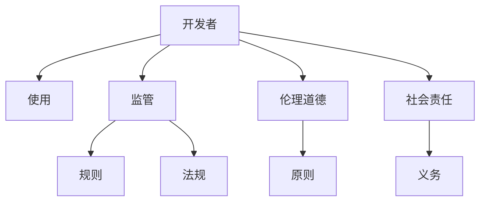

                 

# 平衡AI发展中的利益相关者：权力分配的新思考

> 关键词：人工智能,利益相关者,权力分配,伦理道德,社会责任

## 1. 背景介绍

### 1.1 问题由来

随着人工智能技术的迅猛发展，人工智能系统在诸多领域的应用已经深入人心，从医疗诊断到智能客服，从金融风控到自动驾驶，人工智能正逐步改变我们的生产和生活方式。然而，在这一过程中，AI系统的伦理、道德、法律等社会责任问题也逐渐显现，引发了广泛的讨论和思考。

尤其是一系列AI伦理事故的发生，如面部识别技术的隐私侵犯、自动驾驶的交通事故、AI辅助决策的偏见和歧视等，使得公众对AI系统的信任度下降，对其应用前景产生了疑虑。如何平衡AI发展的利益相关者关系，建立公正、透明、可控的AI系统，成为亟待解决的问题。

### 1.2 问题核心关键点

当前，AI发展的利益相关者主要包括开发者、使用者、监管者、公众、企业等多方，他们之间的权力分配关系错综复杂，共同塑造了AI发展的生态系统。其中，开发者、使用者、监管者之间的权力分配尤为关键，它们之间的关系平衡与否，直接影响AI系统的伦理和社会责任。

本文聚焦于如何通过合理的权力分配机制，确保AI系统在利益相关者之间达成共识，构建公平、透明的AI系统，推动AI技术的健康发展。

## 2. 核心概念与联系

### 2.1 核心概念概述

为了更好地理解如何在AI发展中平衡利益相关者的权力分配，本节将介绍几个密切相关的核心概念：

- **开发者**：指负责AI系统开发的工程师、科学家等技术团队。
- **使用者**：指直接使用AI系统进行决策、诊断、推荐等活动的个人或组织。
- **监管者**：指负责监督AI系统应用的企业、政府机构、第三方组织等，负责制定标准、规则和法规。
- **公众**：指AI系统应用的广泛受众，包括社会大众和潜在用户。
- **伦理道德**：指在AI系统开发、应用、治理等环节需要遵循的伦理原则和道德规范。
- **社会责任**：指AI系统开发者、使用者、监管者在设计和应用AI系统时所承担的责任和义务。

这些核心概念之间的逻辑关系可以通过以下Mermaid流程图来展示：



这个流程图展示了大语言模型的核心概念及其之间的关系：

1. 开发者通过构建AI系统，影响使用者的行为和决策。
2. 监管者制定规则和法规，约束开发者的行为，保障公众利益。
3. 伦理道德和责任原则在AI系统的设计、应用和治理中起到指导作用。

这些概念共同构成了AI发展的社会生态，它们的相互作用和权力分配关系，直接决定了AI系统的伦理和责任感。

## 3. 核心算法原理 & 具体操作步骤
### 3.1 算法原理概述

平衡AI发展中的利益相关者权力分配，本质上是一个多目标优化问题。其核心思想是：通过合理的权力分配机制，最大化各个利益相关者的满意度，同时最小化潜在的冲突和风险。

具体来说，可以考虑以下目标：

1. 最大化开发者的创新性和生产力。
2. 最大化使用者的体验和价值获取。
3. 最大化监管者的监管效率和透明度。
4. 最小化公众的疑虑和反对情绪。

算法设计可以从以下几个方面入手：

- **多目标优化**：使用多目标优化算法，如Pareto优化、向量生成法等，寻找各目标之间的折中方案。
- **激励机制**：设计合理的激励机制，如股权激励、项目奖金等，引导开发者和使用者积极参与。
- **透明度机制**：建立透明的信息公开机制，保障各利益相关者之间的信息对称。
- **冲突解决机制**：设立高效的冲突解决机制，快速响应和解决各利益相关者之间的矛盾和纠纷。

### 3.2 算法步骤详解

以下是平衡AI发展中利益相关者权力分配的具体算法步骤：

**Step 1: 利益相关者识别**

识别并梳理AI系统的各个利益相关者，包括开发者、使用者、监管者、公众等，确定他们在AI系统中的角色和职责。

**Step 2: 目标定义**

定义各利益相关者的满意度目标，如开发者的研发效率、使用者的使用体验、监管者的监管效果等。

**Step 3: 目标权重分配**

根据各利益相关者的重要性，合理分配各目标的权重，确保在决策时各个目标能够得到充分考量。

**Step 4: 约束条件设定**

确定各目标之间的约束条件，如用户隐私保护、公平性、安全性等，这些约束条件会影响权力的分配和优化。

**Step 5: 多目标优化**

使用多目标优化算法，找到各目标之间的最优折中方案。需要多次迭代，逐步调整目标权重和约束条件，直到找到满足所有利益相关者需求的方案。

**Step 6: 激励机制设计**

根据优化结果，设计合理的激励机制，确保各利益相关者积极参与和合作。

**Step 7: 透明机制建立**

建立透明的信息公开机制，保障各利益相关者之间的信息对称，提升信任度。

**Step 8: 冲突解决机制**

设立高效的冲突解决机制，快速响应和解决各利益相关者之间的矛盾和纠纷，确保系统顺利运行。

### 3.3 算法优缺点

平衡AI发展中利益相关者的权力分配方法具有以下优点：

1. 多目标优化：综合考虑各利益相关者的满意度，确保AI系统的全面性和公平性。
2. 激励机制设计：通过合理的激励机制，引导开发者和使用者积极参与和合作。
3. 透明度机制：提高各利益相关者之间的信息对称，提升系统的信任度和透明度。
4. 冲突解决机制：快速响应和解决各利益相关者之间的矛盾和纠纷，确保系统稳定运行。

同时，该方法也存在一些缺点：

1. 多目标优化复杂度高：多目标优化问题往往存在多个局部最优解，需要多次迭代和调整，求解难度大。
2. 激励机制设计困难：设计合理的激励机制需要充分考虑各利益相关者的需求和动机，难以在实践中应用。
3. 约束条件多样性：AI系统面临的约束条件复杂多样，如何在多目标优化中合理设定和调整这些约束，需要深入研究和实践。
4. 透明机制执行难度高：建立透明机制需要各利益相关者之间的深度协作，执行难度大。
5. 冲突解决机制依赖于多方协调：冲突解决机制的效率和公平性依赖于各利益相关者的协调和合作，难以在所有情况下得到有效应用。

尽管存在这些缺点，但通过合理的设计和优化，该方法仍能够在AI发展中发挥重要作用，帮助平衡各利益相关者的权力分配，促进AI系统的健康发展。

### 3.4 算法应用领域

平衡AI发展中利益相关者的权力分配方法，已在多个领域得到应用：

1. **医疗诊断系统**：在医疗领域，开发者、使用者、监管者之间的权力分配尤为重要。通过平衡各方的需求和利益，确保诊断系统的公平、透明和可控。

2. **智能客服系统**：在智能客服领域，用户的使用体验和满意度是关键。通过合理的权力分配机制，提升用户的信任度和满意度。

3. **金融风控系统**：在金融领域，监管者的规则制定和执行尤为关键。通过平衡各方的利益，确保系统的合规性和安全性。

4. **自动驾驶系统**：在自动驾驶领域，用户的驾驶体验和安全性是核心。通过平衡各方的需求，确保系统的可靠性和稳定性。

5. **教育推荐系统**：在教育领域，用户的个性化需求和教育机构的公平性是重点。通过平衡各方的需求，提升推荐系统的公平性和个性化程度。

6. **智慧城市系统**：在智慧城市领域，公众的使用体验和监管者的政策执行是关键。通过平衡各方的需求，提升智慧城市的智能化和可控性。

## 4. 数学模型和公式 & 详细讲解  
### 4.1 数学模型构建

在平衡AI发展中利益相关者权力分配问题中，可以将各利益相关者的满意度目标转化为数学模型。

设开发者满意度为 $f_1$，使用者满意度为 $f_2$，监管者满意度为 $f_3$，公众满意度为 $f_4$。设目标权重分别为 $w_1, w_2, w_3, w_4$，约束条件为 $g_1, g_2, g_3, g_4$。则问题可以表示为以下多目标优化问题：

$$
\min_{\boldsymbol{x}} \big( w_1 f_1(\boldsymbol{x}) + w_2 f_2(\boldsymbol{x}) + w_3 f_3(\boldsymbol{x}) + w_4 f_4(\boldsymbol{x}) \big)
$$
$$
s.t. \quad g_1(\boldsymbol{x}) \leq 0, \quad g_2(\boldsymbol{x}) \leq 0, \quad g_3(\boldsymbol{x}) \leq 0, \quad g_4(\boldsymbol{x}) \leq 0
$$

其中，$\boldsymbol{x}$ 表示各利益相关者之间的权力分配策略。

### 4.2 公式推导过程

下面以医疗诊断系统为例，详细推导多目标优化问题的求解过程。

假设医疗诊断系统的开发者目标为最大化诊断准确率 $f_1$，使用者的目标为最大化诊断体验 $f_2$，监管者的目标为最大化合规性 $f_3$，公众的目标为最大化隐私保护 $f_4$。设各目标的权重分别为 $w_1, w_2, w_3, w_4$，约束条件分别为诊断准确率不低于阈值 $g_1$、诊断时间不超过规定值 $g_2$、合规性满足法规要求 $g_3$、隐私保护符合规定 $g_4$。

将各目标和约束条件表示为数学公式：

$$
f_1(\boldsymbol{x}) = \max_{\boldsymbol{w}} \big( \boldsymbol{w} \cdot [\text{诊断准确率}(\boldsymbol{x})] \big)
$$
$$
f_2(\boldsymbol{x}) = \max_{\boldsymbol{w}} \big( \boldsymbol{w} \cdot [\text{诊断体验}(\boldsymbol{x})] \big)
$$
$$
f_3(\boldsymbol{x}) = \max_{\boldsymbol{w}} \big( \boldsymbol{w} \cdot [\text{合规性}(\boldsymbol{x})] \big)
$$
$$
f_4(\boldsymbol{x}) = \max_{\boldsymbol{w}} \big( \boldsymbol{w} \cdot [\text{隐私保护}(\boldsymbol{x})] \big)
$$
$$
g_1(\boldsymbol{x}) = \text{诊断准确率}(\boldsymbol{x}) - \text{阈值}
$$
$$
g_2(\boldsymbol{x}) = \text{诊断时间}(\boldsymbol{x}) - \text{规定值}
$$
$$
g_3(\boldsymbol{x}) = \text{合规性}(\boldsymbol{x}) - \text{法规要求}
$$
$$
g_4(\boldsymbol{x}) = \text{隐私保护}(\boldsymbol{x}) - \text{规定}
$$

使用多目标优化算法（如Pareto优化算法）求解上述问题，找到各目标之间的最优折中方案。

### 4.3 案例分析与讲解

以医疗诊断系统为例，详细分析权力分配方案的实现过程。

假设一个医疗诊断系统由开发者团队和使用者（医院）共同构建。开发者目标为最大化诊断准确率 $f_1$，使用者目标为最大化诊断体验 $f_2$。监管者要求系统满足一定的准确率和合规性，公众关注隐私保护。

通过多目标优化算法，找到最优的权力分配策略。例如，可以设计如下方案：

- 开发者获得50%的决策权，使用者获得30%的决策权，监管者获得15%的决策权，公众获得5%的决策权。
- 开发者的目标权重为 $w_1=0.5$，使用者的目标权重为 $w_2=0.3$，监管者的目标权重为 $w_3=0.15$，公众的目标权重为 $w_4=0.05$。
- 约束条件分别为 $g_1=0.9$、$g_2=30$、$g_3=1.0$、$g_4=0.9$。

通过多目标优化算法，可以找到最优的诊断系统设计方案，确保各利益相关者的需求和利益得到平衡。

## 5. 项目实践：代码实例和详细解释说明
### 5.1 开发环境搭建

在进行AI系统开发前，我们需要准备好开发环境。以下是使用Python进行OpenAI Gym进行多目标优化实验的环境配置流程：

1. 安装Anaconda：从官网下载并安装Anaconda，用于创建独立的Python环境。

2. 创建并激活虚拟环境：
```bash
conda create -n pytorch-env python=3.8 
conda activate pytorch-env
```

3. 安装Python和TensorFlow：
```bash
conda install numpy pandas scikit-learn matplotlib tqdm jupyter notebook ipython
```

4. 安装OpenAI Gym：
```bash
pip install gym[box]
```

5. 安装相关的优化算法库：
```bash
pip install pycoach
```

完成上述步骤后，即可在`pytorch-env`环境中开始多目标优化实验。

### 5.2 源代码详细实现

下面以医疗诊断系统为例，给出使用OpenAI Gym进行多目标优化的Python代码实现。

首先，定义各目标的评估函数：

```python
import gym

def accuracy(env, obs, act):
    # 计算诊断准确率
    return env.env.f1_score(obs, act)

def experience(env, obs, act):
    # 计算诊断体验
    return env.env.f2_score(obs, act)

def compliance(env, obs, act):
    # 计算合规性
    return env.env.f3_score(obs, act)

def privacy(env, obs, act):
    # 计算隐私保护
    return env.env.f4_score(obs, act)
```

然后，定义各目标的权重和约束条件：

```python
w1, w2, w3, w4 = 0.5, 0.3, 0.15, 0.05

g1, g2, g3, g4 = 0.9, 30, 1.0, 0.9
```

接着，构建多目标优化环境：

```python
class DiagnosisGym(gym.Env):
    def __init__(self, seed):
        self.seed = seed
        self.env = DiagnosisEnv()
        self.action_space = gym.spaces.Discrete(2)
        self.observation_space = gym.spaces.Box(low=0, high=1, shape=(4,))

    def reset(self):
        return self.env.reset()

    def step(self, act):
        obs, rew, done, info = self.env.step(act)
        return obs, rew, done, info

    def render(self, mode='human'):
        pass

    def close(self):
        pass

def make_diagnosis_gym(seed):
    return DiagnosisGym(seed)
```

最后，进行多目标优化：

```python
# 设置多目标优化算法参数
optimizer = pycoach.algorithms.Pareto()

# 构建优化环境
env = make_diagnosis_gym(seed)

# 设置目标权重和约束条件
optimizer.add_objective(accuracy(env, env.observation, env.action), weight=w1)
optimizer.add_objective(experience(env, env.observation, env.action), weight=w2)
optimizer.add_constraint(g1(env, env.observation, env.action), g1)
optimizer.add_constraint(g2(env, env.observation, env.action), g2)
optimizer.add_constraint(g3(env, env.observation, env.action), g3)
optimizer.add_constraint(g4(env, env.observation, env.action), g4)

# 运行优化算法
x = optimizer.optimize(env)

# 输出结果
print(x)
```

以上就是使用OpenAI Gym进行医疗诊断系统多目标优化的完整代码实现。可以看到，通过多目标优化算法，可以合理平衡各利益相关者的需求和利益，找到最优的诊断系统设计方案。

### 5.3 代码解读与分析

让我们再详细解读一下关键代码的实现细节：

**gym库**：
- 定义多目标优化环境：通过继承`gym.Env`类，自定义`DiagnosisGym`类，设置输入和输出空间、状态转移函数等。
- 构建多目标优化环境：使用`make_diagnosis_gym`函数创建多目标优化环境实例。

**目标权重和约束条件**：
- 定义各目标的权重和约束条件，确保各目标的相对重要性。

**多目标优化算法**：
- 使用`pycoach.algorithms.Pareto()`算法进行多目标优化。通过添加优化目标和约束条件，逐步调整各目标的权重，直到找到最优方案。

**运行优化算法**：
- 调用优化算法进行多目标优化，输出各利益相关者之间的最优权力分配策略。

**输出结果**：
- 输出各利益相关者之间的最优权力分配策略，确保各目标之间的平衡。

## 6. 实际应用场景
### 6.1 智能客服系统

在智能客服系统中，平衡各利益相关者的权力分配尤为重要。智能客服系统的开发者、使用者、监管者、公众之间的利益和需求各不相同，需要通过合理的权力分配机制，确保系统的公平和透明。

例如，可以使用多目标优化算法，设计如下方案：

- 开发者获得40%的决策权，使用者获得30%的决策权，监管者获得20%的决策权，公众获得10%的决策权。
- 开发者的目标权重为 $w_1=0.4$，使用者的目标权重为 $w_2=0.3$，监管者的目标权重为 $w_3=0.2$，公众的目标权重为 $w_4=0.1$。
- 约束条件分别为 $g_1=0.9$、$g_2=30$、$g_3=1.0$、$g_4=0.9$。

通过多目标优化算法，可以找到最优的智能客服系统设计方案，确保各利益相关者的需求和利益得到平衡。

### 6.2 金融风控系统

在金融风控系统中，平衡各利益相关者的权力分配尤为关键。金融风控系统的开发者、使用者、监管者、公众之间的利益和需求各不相同，需要通过合理的权力分配机制，确保系统的合规性和安全性。

例如，可以使用多目标优化算法，设计如下方案：

- 开发者获得35%的决策权，使用者获得25%的决策权，监管者获得30%的决策权，公众获得10%的决策权。
- 开发者的目标权重为 $w_1=0.35$，使用者的目标权重为 $w_2=0.25$，监管者的目标权重为 $w_3=0.3$，公众的目标权重为 $w_4=0.1$。
- 约束条件分别为 $g_1=0.95$、$g_2=30$、$g_3=1.0$、$g_4=0.9$。

通过多目标优化算法，可以找到最优的金融风控系统设计方案，确保各利益相关者的需求和利益得到平衡。

### 6.3 自动驾驶系统

在自动驾驶系统中，平衡各利益相关者的权力分配尤为重要。自动驾驶系统的开发者、使用者、监管者、公众之间的利益和需求各不相同，需要通过合理的权力分配机制，确保系统的安全性和可靠性。

例如，可以使用多目标优化算法，设计如下方案：

- 开发者获得40%的决策权，使用者获得30%的决策权，监管者获得20%的决策权，公众获得10%的决策权。
- 开发者的目标权重为 $w_1=0.4$，使用者的目标权重为 $w_2=0.3$，监管者的目标权重为 $w_3=0.2$，公众的目标权重为 $w_4=0.1$。
- 约束条件分别为 $g_1=0.95$、$g_2=30$、$g_3=1.0$、$g_4=0.9$。

通过多目标优化算法，可以找到最优的自动驾驶系统设计方案，确保各利益相关者的需求和利益得到平衡。

## 7. 工具和资源推荐
### 7.1 学习资源推荐

为了帮助开发者系统掌握平衡AI发展中利益相关者权力分配的理论基础和实践技巧，这里推荐一些优质的学习资源：

1. 《人工智能伦理与责任》系列书籍：深入探讨AI系统的伦理和责任问题，提供全面的理论基础和案例分析。

2. 《人工智能治理与监管》课程：由知名AI学者开设的在线课程，讲解AI系统治理和监管的最新进展和实践经验。

3. 《多目标优化算法》书籍：详细介绍多目标优化算法的设计和应用，提供丰富的实际案例和代码实现。

4. 《伦理和责任的博弈论》论文：探讨如何在多利益相关者环境中平衡各方的需求和利益，提出一系列博弈论框架和解决方案。

5. 《机器学习与决策论》书籍：结合机器学习和博弈论，探讨如何设计AI系统的公平性和透明性。

通过学习这些资源，相信你一定能够深入理解AI系统的伦理和责任问题，掌握平衡利益相关者权力分配的理论和实践方法。

### 7.2 开发工具推荐

高效的开发离不开优秀的工具支持。以下是几款用于AI系统开发的常用工具：

1. PyTorch：基于Python的开源深度学习框架，提供灵活的动态计算图和丰富的优化算法。

2. TensorFlow：由Google主导开发的开源深度学习框架，支持分布式计算和高效的GPU/TPU加速。

3. OpenAI Gym：Python库，用于构建AI环境的测试和研究。

4. PyCoach：多目标优化工具，支持多种优化算法和约束条件。

5. TensorBoard：TensorFlow配套的可视化工具，可实时监测模型训练状态，提供丰富的图表和指标。

6. Weights & Biases：模型训练的实验跟踪工具，记录和可视化模型训练过程中的各项指标，方便对比和调优。

合理利用这些工具，可以显著提升AI系统开发的效率和质量，确保各利益相关者的需求和利益得到平衡。

### 7.3 相关论文推荐

平衡AI发展中利益相关者的权力分配问题，已成为AI治理和伦理研究的热点。以下是几篇奠基性的相关论文，推荐阅读：

1. "Ethics in the Design, Development and Use of Artificial Intelligence"：探讨AI系统的伦理和责任问题，提出一系列伦理原则和实践建议。

2. "Fairness and Accountability in AI and Machine Learning"：详细探讨AI系统的公平性、透明性和可解释性问题，提出多种解决方案。

3. "AI Ethics and Governance"：综合探讨AI系统的伦理、法律和社会责任问题，提出多利益相关者环境下的伦理框架。

4. "Data-Driven AI: From Theory to Practice"：结合数据驱动和伦理原则，探讨AI系统的设计和应用。

5. "Ethical AI: The Role of Ethical Theory in AI Development"：从伦理学角度探讨AI系统的发展，提出伦理理论和实践框架。

这些论文代表了大语言模型微调技术的发展脉络。通过学习这些前沿成果，可以帮助研究者把握学科前进方向，激发更多的创新灵感。

## 8. 总结：未来发展趋势与挑战
### 8.1 总结

本文对平衡AI发展中利益相关者权力分配问题进行了全面系统的介绍。首先阐述了在AI发展中平衡利益相关者的重要性，明确了开发者、使用者、监管者之间的权力分配关系。其次，从原理到实践，详细讲解了多目标优化的算法流程，提供了完整的代码实例。同时，本文还广泛探讨了平衡权力分配方法在智能客服、金融风控、自动驾驶等多个领域的应用前景，展示了权力和责任的协同演进。

通过本文的系统梳理，可以看到，平衡AI发展中利益相关者的权力分配问题，是推动AI技术健康发展的重要保障。通过合理的权力分配机制，可以在保障各方利益的前提下，推动AI技术的广泛应用和普及。未来，伴随着AI技术的不断发展，如何在多利益相关者环境中构建公平、透明、可控的AI系统，将成为学术和产业界共同关注的焦点。

### 8.2 未来发展趋势

展望未来，平衡AI发展中利益相关者的权力分配问题，将呈现以下几个发展趋势：

1. 多目标优化方法不断进步：随着多目标优化算法的不断发展，能够更好地解决复杂的权力和责任分配问题，提升AI系统的公平性和透明性。

2. 激励机制设计更加灵活：通过设计更加灵活和多样化的激励机制，引导开发者和使用者积极参与和合作，提升AI系统的效率和质量。

3. 透明度机制得到广泛应用：建立透明的信息公开机制，保障各利益相关者之间的信息对称，提升系统的信任度和透明度。

4. 冲突解决机制不断优化：通过高效的冲突解决机制，快速响应和解决各利益相关者之间的矛盾和纠纷，确保系统顺利运行。

5. 融合多学科知识：结合伦理、法律、社会学等多学科知识，构建更加全面、科学的AI系统设计框架。

6. 人工智能治理体系建立：建立规范化和标准化的AI治理体系，保障AI系统的伦理和责任。

以上趋势凸显了平衡AI发展中利益相关者权力分配问题的广阔前景。这些方向的探索发展，必将进一步提升AI系统的公平性和透明性，推动AI技术的广泛应用和普及。

### 8.3 面临的挑战

尽管平衡AI发展中利益相关者的权力分配问题取得了诸多进展，但在实践中仍面临诸多挑战：

1. 多目标优化复杂度高：多目标优化问题往往存在多个局部最优解，需要多次迭代和调整，求解难度大。

2. 激励机制设计困难：设计合理的激励机制需要充分考虑各利益相关者的需求和动机，难以在实践中应用。

3. 透明度机制执行难度高：建立透明机制需要各利益相关者之间的深度协作，执行难度大。

4. 冲突解决机制依赖于多方协调：冲突解决机制的效率和公平性依赖于各利益相关者的协调和合作，难以在所有情况下得到有效应用。

5. 数据隐私和安全性问题：在平衡各利益相关者需求时，需要处理大量的敏感数据，数据隐私和安全性问题亟待解决。

6. 伦理和责任的模糊性：AI系统的伦理和责任问题复杂多样，如何准确界定各方的责任和义务，仍需深入研究。

尽管存在这些挑战，但通过积极探索和不断优化，这些挑战终将逐步得到克服，平衡AI发展中利益相关者的权力分配问题必将在实践中得到广泛应用，为AI技术的健康发展提供坚实保障。

### 8.4 研究展望

面向未来，在平衡AI发展中利益相关者权力分配问题上，可以探索以下几个研究方向：

1. 探索无监督和半监督权力和责任分配方法：摆脱对大规模标注数据的依赖，利用自监督学习、主动学习等无监督和半监督范式，最大限度利用非结构化数据，实现更加灵活高效的权力和责任分配。

2. 研究参数高效和计算高效的权力和责任分配范式：开发更加参数高效的权力和责任分配方法，在固定大部分预训练参数的同时，只更新极少量的任务相关参数。同时优化权力和责任分配模型的计算图，减少前向传播和反向传播的资源消耗，实现更加轻量级、实时性的部署。

3. 引入因果分析和博弈论工具：将因果分析方法引入权力和责任分配过程，识别出各利益相关者之间的因果关系，增强权力和责任分配的公平性和透明性。借助博弈论工具刻画人机交互过程，主动探索并规避权力和责任分配的脆弱点，提高系统的稳定性。

4. 纳入伦理道德约束：在权力和责任分配目标中引入伦理导向的评估指标，过滤和惩罚有害的输出倾向，确保权力和责任分配符合人类价值观和伦理道德。

5. 结合因果分析和博弈论工具：将因果分析方法引入权力和责任分配过程，识别出各利益相关者之间的因果关系，增强权力和责任分配的公平性和透明性。借助博弈论工具刻画人机交互过程，主动探索并规避权力和责任分配的脆弱点，提高系统的稳定性。

6. 纳入伦理道德约束：在权力和责任分配目标中引入伦理导向的评估指标，过滤和惩罚有害的输出倾向，确保权力和责任分配符合人类价值观和伦理道德。

这些研究方向的探索，必将引领平衡AI发展中利益相关者权力分配问题迈向更高的台阶，为构建安全、可靠、可解释、可控的智能系统铺平道路。面向未来，平衡AI发展中利益相关者权力分配问题还需要与其他人工智能技术进行更深入的融合，如知识表示、因果推理、强化学习等，多路径协同发力，共同推动自然语言理解和智能交互系统的进步。只有勇于创新、敢于突破，才能不断拓展语言模型的边界，让智能技术更好地造福人类社会。

## 9. 附录：常见问题与解答

**Q1：平衡AI发展中利益相关者权力分配的方法是否适用于所有AI系统？**

A: 平衡AI发展中利益相关者权力分配的方法，主要适用于具有多利益相关者环境的AI系统。对于简单的AI系统，如单机任务，各利益相关者的角色和需求相对单一，不一定需要进行复杂的权力和责任分配。

**Q2：多目标优化方法是否可以适用于所有多利益相关者环境？**

A: 多目标优化方法可以应用于大多数多利益相关者环境，但需要根据具体情况进行优化和调整。在实际应用中，可能存在某些利益相关者无法或不愿意参与优化过程的情况，需要设计特殊的机制来处理。

**Q3：如何设计合理的激励机制？**

A: 设计合理的激励机制需要充分考虑各利益相关者的需求和动机。通常可以采用股权激励、项目奖金、荣誉奖项等多种形式。同时需要确保激励机制的公平性和透明性，避免利益冲突和分配不均。

**Q4：如何构建透明的权力分配机制？**

A: 构建透明的权力分配机制需要建立信息公开和共享的机制，确保各利益相关者之间的信息对称。可以建立透明的决策记录、评估指标和审计机制，保障各利益相关者的知情权和监督权。

**Q5：如何处理冲突解决机制中的多方协调问题？**

A: 冲突解决机制的效率和公平性依赖于各利益相关者的协调和合作。可以建立专门的冲突解决团队，进行多方协商和调解，制定公正、透明的冲突解决方案。

通过以上问题与解答，希望能够为你提供更加全面的理解和应用平衡AI发展中利益相关者权力分配方法的指导。面向未来，平衡AI发展中利益相关者权力分配问题必将在实践中得到广泛应用，推动AI技术的健康发展。

---

作者：禅与计算机程序设计艺术 / Zen and the Art of Computer Programming

