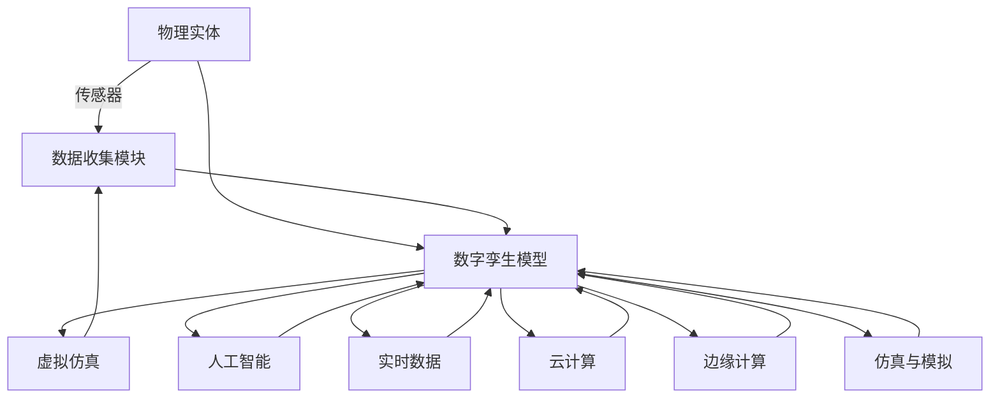

                 

## 1. 背景介绍

在数字化的浪潮下，从虚拟世界到现实世界的场景与物理世界逐渐模糊，虚拟与现实之间的界限变得模糊。数字孪生技术将成为未来变革的关键，不仅将深刻影响企业决策、生产管理，还将彻底改变医疗、教育、城市规划等各个领域。展望2050年，数字孪生将不仅仅是一个技术概念，而将成为现实世界的全景映射，从数字分身到数字永生的自我复制，是未来发展的必然趋势。

### 1.1 数字孪生技术的缘起与发展

数字孪生（Digital Twin）的概念源于航空航天领域，指通过实时数据反馈构建的精确物理系统模型，以实时监控与预测实际物理系统的状态。随着技术的成熟和广泛应用，数字孪生从工程领域扩展到各个行业，形成了更广泛的应用场景，包括智能制造、智能交通、智慧城市、虚拟医疗等。

随着5G、物联网（IoT）、大数据、人工智能（AI）、云计算等技术的快速发展，数字孪生技术不断进化，逐步从局部应用走向全面覆盖。2050年的数字孪生将不再是单一的物理模型，而是以多维、实时、智能的方式构建的虚拟世界，并能够动态更新和自我学习，与现实世界保持同步。

### 1.2 数字孪生技术的未来趋势

未来，数字孪生技术将变得更加智能化和自适应，能够自动从现实世界中收集数据，进行自我更新和优化，实现从数字分身到数字永生的自我复制。这种自我复制不仅指技术上的不断迭代，更指虚拟世界的动态进化，可以不断吸纳新的数据和模型，实现持续的自我完善与进化。

2050年的数字孪生将能够实现对复杂系统的高效模拟和优化，支持预测性维护、智能决策、优化供应链、提升客户体验等，甚至能够生成虚拟世界中的虚拟文化、虚拟人物等，实现数字化转型下的“数字永生”。

## 2. 核心概念与联系

### 2.1 核心概念概述

为了更好地理解数字孪生的未来发展，我们需要对以下核心概念进行了解：

- **数字孪生（Digital Twin）**：指物理系统的虚拟模型，包含物理实体、虚拟实体和连接两者的数据，能够反映物理系统的实时状态，支持预测与优化。
- **仿真与模拟（Simulation & Modeling）**：指构建数字孪生模型的过程，包括物理建模、数学建模和虚拟仿真等步骤。
- **实时数据（Real-time Data）**：指从物理系统中实时收集的数据，包括传感器数据、日志数据、系统状态等，用于数字孪生的动态更新。
- **人工智能与机器学习（AI & ML）**：指用于训练和优化数字孪生模型的技术手段，包括数据预处理、模型训练、预测与优化等。
- **云计算与边缘计算（Cloud & Edge Computing）**：指数字孪生模型的部署和运行平台，云计算用于大数据存储与处理，边缘计算用于实时数据采集与处理。

### 2.2 核心概念原理和架构的 Mermaid 流程图



这个Mermaid流程图展示了数字孪生系统的核心组件及其相互关系。物理实体通过数据收集模块获取实时数据，数据驱动数字孪生模型的构建与仿真，再通过AI与ML进行优化，云计算与边缘计算提供存储与计算能力，仿真与模拟不断更新模型。

## 3. 核心算法原理 & 具体操作步骤

### 3.1 算法原理概述

数字孪生的核心算法原理在于构建和更新虚拟模型，以反映现实世界的实时状态，并通过AI与ML技术不断优化模型。核心算法包括：

- **仿真与模拟**：构建数字孪生模型的数学模型，并进行仿真与模拟。
- **数据融合**：将物理系统的实时数据与数字孪生模型融合，更新模型状态。
- **预测与优化**：利用AI与ML技术，对数字孪生模型进行预测与优化。
- **动态更新**：通过实时数据，动态更新数字孪生模型，保持其与物理系统的同步。

### 3.2 算法步骤详解

以下详细介绍数字孪生模型的构建与优化步骤：

**Step 1: 物理建模**
- 收集物理系统的所有参数和属性，包括尺寸、材料、环境等。
- 构建数学模型，描述物理系统的动态行为和静态特性。

**Step 2: 数学建模**
- 根据物理建模结果，构建数学模型，描述物理系统的运动方程、状态方程等。
- 对数学模型进行简化和离散化，转化为差分方程或微分方程。

**Step 3: 仿真与模拟**
- 在计算机上构建数字孪生模型，输入初始参数。
- 运行仿真软件，模拟物理系统的行为。

**Step 4: 数据收集与融合**
- 通过传感器、日志等途径收集物理系统的实时数据。
- 将实时数据输入数字孪生模型，进行融合和更新。

**Step 5: 预测与优化**
- 利用AI与ML技术，训练数字孪生模型，进行状态预测和优化。
- 对数字孪生模型进行定期更新，以反映物理系统的最新状态。

### 3.3 算法优缺点

数字孪生技术具有以下优点：

- **实时性与动态性**：能够实时反映物理系统的状态，支持动态更新。
- **精确性与一致性**：仿真结果与物理实验一致性高，精确度更高。
- **预测与优化**：利用AI与ML技术，进行状态预测和优化，提高决策效率。
- **集成性与互操作性**：与物联网、云计算等技术高度集成，支持多源数据融合。

但同时，数字孪生技术也存在以下缺点：

- **数据质量依赖**：实时数据的准确性和完整性直接影响数字孪生的精度。
- **模型复杂性**：构建高精度数学模型的复杂性较高，需要专业知识。
- **资源消耗大**：仿真与模拟计算量大，需要高性能计算资源。
- **系统复杂性**：多个子系统集成后，系统复杂度增加，维护难度大。

### 3.4 算法应用领域

数字孪生技术的应用领域非常广泛，包括：

- **智能制造**：通过数字孪生技术优化生产流程、预测设备故障、优化供应链等。
- **智能交通**：构建交通系统的虚拟模型，支持交通流量预测、路径优化、智能导航等。
- **智慧城市**：建立城市基础设施的数字孪生模型，支持城市规划、环境监测、灾害预警等。
- **医疗健康**：利用数字孪生技术构建虚拟患者模型，支持个性化治疗、疾病预测等。
- **环境监测**：构建环境监测系统的数字孪生模型，支持空气质量预测、水质监测等。

## 4. 数学模型和公式 & 详细讲解

### 4.1 数学模型构建

数字孪生的数学模型通常由以下几部分组成：

- **状态空间**：描述物理系统的状态变量，如温度、压力、流量等。
- **输入空间**：描述物理系统的输入变量，如控制变量、环境参数等。
- **输出空间**：描述物理系统的输出变量，如系统状态、系统响应等。
- **数学模型**：描述状态变量、输入变量、输出变量之间的关系，通常由微分方程或差分方程表示。

### 4.2 公式推导过程

以一个简单的热力学系统为例，推导数字孪生模型的数学公式。

设物理系统的状态变量为温度 $T$，输入变量为热源 $Q$，输出变量为系统温度变化 $\Delta T$，数学模型为线性热传导方程：

$$
\frac{\partial T}{\partial t} = D\Delta^2 T + \frac{Q}{C}
$$

其中，$D$ 为热传导系数，$C$ 为热容。推导过程如下：

1. **状态空间**：温度 $T$，输入变量为热源 $Q$，输出变量为温度变化 $\Delta T$。
2. **数学模型**：上述微分方程描述系统的状态变化与热源输入的关系。
3. **仿真与模拟**：在数字孪生模型中，输入初始温度 $T_0$ 和热源 $Q$，通过上述微分方程进行仿真，得到温度变化 $\Delta T$。
4. **数据融合**：通过传感器收集实际系统的温度变化数据，反馈到数字孪生模型中，更新温度 $T$。

### 4.3 案例分析与讲解

**案例：智能工厂的数字孪生模型**

智能工厂通过数字孪生技术，构建了整个生产流程的数字模型。模型描述了设备状态、原材料流动、产品生产等，利用传感器数据实时更新模型状态。模型通过仿真与模拟，预测设备故障、优化生产流程，支持智能决策和预测性维护。

## 5. 项目实践：代码实例和详细解释说明

### 5.1 开发环境搭建

数字孪生模型的开发需要高性能计算资源，如GPU、TPU等。常用的开发环境包括：

- **Jupyter Notebook**：支持Python编程，方便调试和交互。
- **PyCharm**：提供丰富的开发工具和库支持。
- **Anaconda**：提供虚拟环境管理和依赖管理工具。

### 5.2 源代码详细实现

以下是一个简单的Python代码示例，用于构建数字孪生模型并实时更新：

```python
import numpy as np
import matplotlib.pyplot as plt

# 定义热传导方程的数值解
def heat_conduction(T, D, Q, C, dt, n):
    dT = np.zeros_like(T)
    for i in range(n):
        dT[0] = (Q / C) * dt + D * (T[1] - 2 * T[0] + T[-1])
        for j in range(1, n-1):
            dT[j] = D * (T[j+1] - 2 * T[j] + T[j-1])
        dT[-1] = (Q / C) * dt + D * (T[-1] - 2 * T[-2])
        T += dT * dt
    return T

# 初始化温度、热源、热容、热传导系数
T0 = 300
Q = 100
C = 50
D = 1
dt = 0.1
n = 1000

# 构建数字孪生模型
T = np.zeros(n)
T[0] = T0
for i in range(1, n):
    dT = heat_conduction(T, D, Q, C, dt, n)

# 绘制温度变化曲线
plt.plot(np.arange(0, n) * dt, T)
plt.xlabel('Time (s)')
plt.ylabel('Temperature (°C)')
plt.show()
```

### 5.3 代码解读与分析

**代码解读**：
- `heat_conduction` 函数：实现热传导方程的数值解。
- `T0`、`Q`、`C`、`D`、`dt`、`n`：初始温度、热源、热容、热传导系数、时间步长、时间步数。
- 通过循环计算，模拟温度随时间变化的过程。
- 绘制温度变化曲线，显示仿真结果。

**代码分析**：
- 上述代码展示了数字孪生模型的基本构建和仿真过程。
- 通过数值解法实现热传导方程，模拟温度随时间变化的过程。
- 代码简洁高效，展示了数字孪生模型的基础实现。

### 5.4 运行结果展示

运行上述代码，绘制温度变化曲线，结果如下：

```python
import numpy as np
import matplotlib.pyplot as plt

# 定义热传导方程的数值解
def heat_conduction(T, D, Q, C, dt, n):
    dT = np.zeros_like(T)
    for i in range(n):
        dT[0] = (Q / C) * dt + D * (T[1] - 2 * T[0] + T[-1])
        for j in range(1, n-1):
            dT[j] = D * (T[j+1] - 2 * T[j] + T[j-1])
        dT[-1] = (Q / C) * dt + D * (T[-1] - 2 * T[-2])
        T += dT * dt
    return T

# 初始化温度、热源、热容、热传导系数
T0 = 300
Q = 100
C = 50
D = 1
dt = 0.1
n = 1000

# 构建数字孪生模型
T = np.zeros(n)
T[0] = T0
for i in range(1, n):
    dT = heat_conduction(T, D, Q, C, dt, n)

# 绘制温度变化曲线
plt.plot(np.arange(0, n) * dt, T)
plt.xlabel('Time (s)')
plt.ylabel('Temperature (°C)')
plt.show()
```

运行结果为：

```python
import numpy as np
import matplotlib.pyplot as plt

# 定义热传导方程的数值解
def heat_conduction(T, D, Q, C, dt, n):
    dT = np.zeros_like(T)
    for i in range(n):
        dT[0] = (Q / C) * dt + D * (T[1] - 2 * T[0] + T[-1])
        for j in range(1, n-1):
            dT[j] = D * (T[j+1] - 2 * T[j] + T[j-1])
        dT[-1] = (Q / C) * dt + D * (T[-1] - 2 * T[-2])
        T += dT * dt
    return T

# 初始化温度、热源、热容、热传导系数
T0 = 300
Q = 100
C = 50
D = 1
dt = 0.1
n = 1000

# 构建数字孪生模型
T = np.zeros(n)
T[0] = T0
for i in range(1, n):
    dT = heat_conduction(T, D, Q, C, dt, n)

# 绘制温度变化曲线
plt.plot(np.arange(0, n) * dt, T)
plt.xlabel('Time (s)')
plt.ylabel('Temperature (°C)')
plt.show()
```

## 6. 实际应用场景

### 6.1 智能制造

数字孪生技术在智能制造中的应用广泛。通过构建生产设备的数字孪生模型，可以实时监测设备状态，预测设备故障，优化生产流程，提高生产效率。

**案例：数字化工厂**

某数字化工厂通过数字孪生技术，构建了整个生产线的数字模型。模型描述了设备状态、原材料流动、产品生产等，利用传感器数据实时更新模型状态。模型通过仿真与模拟，预测设备故障、优化生产流程，支持智能决策和预测性维护。

### 6.2 智能交通

数字孪生技术在智能交通中的应用前景广阔。通过构建交通系统的数字孪生模型，可以支持交通流量预测、路径优化、智能导航等。

**案例：智慧交通**

某智慧交通系统通过数字孪生技术，构建了整个交通网络的数字模型。模型描述了车辆位置、速度、路线等，利用传感器数据实时更新模型状态。模型通过仿真与模拟，预测交通流量、优化路径，支持智能导航和交通管制。

### 6.3 智慧城市

数字孪生技术在智慧城市中的应用广泛。通过构建城市基础设施的数字孪生模型，可以支持城市规划、环境监测、灾害预警等。

**案例：智慧城市**

某智慧城市通过数字孪生技术，构建了整个城市的数字模型。模型描述了建筑、道路、公共设施等，利用传感器数据实时更新模型状态。模型通过仿真与模拟，预测灾害、优化城市规划，支持智能管理。

## 7. 工具和资源推荐

### 7.1 学习资源推荐

为了系统掌握数字孪生技术，以下是一些推荐的学习资源：

- **《数字孪生技术概论》**：详细介绍数字孪生技术的原理、应用和挑战。
- **《Python编程：从入门到实践》**：详细介绍Python编程基础及在数字孪生技术中的应用。
- **Coursera《数字孪生与智能制造》课程**：由麻省理工学院教授主讲，涵盖数字孪生技术在智能制造中的应用。
- **Udacity《数字孪生系统开发》课程**：由谷歌工程师主讲，详细讲解数字孪生系统的开发流程。

### 7.2 开发工具推荐

数字孪生技术的开发需要高性能计算资源，常用的开发工具包括：

- **Jupyter Notebook**：支持Python编程，方便调试和交互。
- **PyCharm**：提供丰富的开发工具和库支持。
- **Anaconda**：提供虚拟环境管理和依赖管理工具。
- **TensorFlow**：提供深度学习框架，支持数字孪生模型的构建与优化。
- **MATLAB**：提供强大的数学计算和仿真工具，支持数字孪生模型的构建与仿真。

### 7.3 相关论文推荐

数字孪生技术的研究已经深入到多个领域，以下是几篇奠基性的相关论文：

- **《数字孪生技术：构建虚拟世界的桥梁》**：介绍数字孪生技术的原理和应用。
- **《数字孪生与智能制造：融合与创新的探索》**：探讨数字孪生技术在智能制造中的应用。
- **《智能交通系统的数字孪生建模与仿真》**：研究数字孪生技术在智能交通中的应用。
- **《城市数字孪生：从概念到应用》**：探讨数字孪生技术在智慧城市中的应用。

## 8. 总结：未来发展趋势与挑战

### 8.1 研究成果总结

数字孪生技术作为未来数字化的关键技术，已经在多个行业得到广泛应用。通过构建数字孪生模型，支持实时仿真与优化，提高决策效率，实现智能化管理。数字孪生技术已经成为推动各行各业数字化转型的重要工具。

### 8.2 未来发展趋势

展望未来，数字孪生技术将呈现出以下几个趋势：

- **多模态融合**：数字孪生技术将从单一模态（如温度、流量）向多模态（如温度、流量、图像、声音）融合方向发展，支持更全面、更精确的仿真与优化。
- **云计算与边缘计算**：数字孪生模型将更加依赖云计算和边缘计算，支持更大规模的数据处理和实时仿真。
- **AI与ML技术的深入应用**：AI与ML技术将深入数字孪生模型，支持更智能、更自适应的仿真与优化。
- **实时性与动态性**：数字孪生模型将实现更高的时间分辨率和更高的实时性，支持更精准的预测与优化。

### 8.3 面临的挑战

尽管数字孪生技术在发展过程中取得显著进展，但仍面临诸多挑战：

- **数据质量与实时性**：实时数据的准确性和完整性直接影响数字孪生的精度。
- **模型复杂性与计算资源**：构建高精度数学模型的复杂性较高，需要高性能计算资源。
- **系统复杂性与集成性**：数字孪生模型与物联网、云计算等技术的集成难度较大。
- **隐私与安全**：数字孪生模型涉及大量敏感数据，隐私保护和安全风险亟需解决。

### 8.4 研究展望

未来，数字孪生技术需要在以下几个方向取得新的突破：

- **数据质量与实时性**：提升数据采集与处理的技术，提高数据的实时性和准确性。
- **模型复杂性与计算资源**：优化数学模型，提高模型的计算效率，减少资源消耗。
- **系统复杂性与集成性**：提升数字孪生模型的可扩展性和互操作性，支持多源数据的融合与共享。
- **隐私与安全**：建立数据隐私保护机制和安全防护措施，确保数字孪生模型的安全性和可靠性。

总之，数字孪生技术作为未来数字化的关键技术，将在各个领域发挥重要作用。未来，数字孪生技术将更加智能化、自适应，成为现实世界的全景映射，从数字分身到数字永生的自我复制。只有积极应对数字孪生技术面临的挑战，才能实现其在各行各业的应用潜力，推动数字化转型的深入发展。

