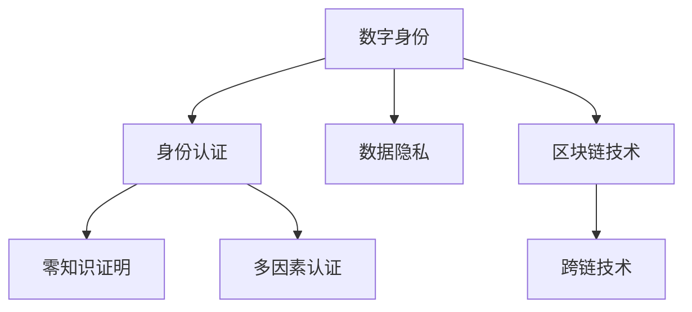

                 

# 2050年的数字身份：从数字公民到虚拟公民的身份认同

在2050年，随着技术的不断进步和社会的持续演变，人类社会将迎来一场身份认同的革命。数字身份，从简单的数字标识，进化为虚拟公民的身份标识，将彻底重塑我们的社会结构、经济活动和人际关系。本文将深入探讨这一转变，分析其背后的技术原理和应用场景，展望未来发展趋势和面临的挑战。

## 1. 背景介绍

### 1.1 问题的由来

近年来，随着区块链、分布式账本、加密技术和人工智能等前沿技术的迅猛发展，数字身份的概念逐渐从单纯的身份认证转变为一种全方位的数字化存在。这一转变深刻影响着人们的日常生活、商业活动和治理模式。数字身份不仅是身份认证的工具，更是每个人在虚拟世界中的虚拟公民身份的象征。

### 1.2 问题核心关键点

数字身份的核心关键点包括：

- **身份认证**：验证用户身份的真实性，防止伪造和冒充。
- **数据隐私**：保护用户隐私，防止数据泄露和滥用。
- **可互操作性**：支持不同平台和系统之间的身份互认。
- **去中心化**：减少中心化机构对身份数据的控制，提升用户自主权。
- **灵活性**：适应不同场景和需求，支持个性化和多样化的身份展示。

这些关键点共同构成了数字身份技术的核心目标，旨在为用户提供一个安全、可靠、便捷的身份管理平台。

## 2. 核心概念与联系

### 2.1 核心概念概述

为了更好地理解数字身份技术，本节将介绍几个关键概念及其联系：

- **数字身份**：通过数字技术手段生成的身份标识，包括用户的数字证书、公钥、加密算法等，用于验证用户身份的真实性。
- **区块链技术**：一种去中心化的分布式账本技术，通过加密哈希和共识算法，保障数据的安全性和不可篡改性。
- **零知识证明**：一种密码学技术，允许在不泄露真实信息的前提下，验证某个声明的真实性。
- **跨链技术**：实现不同区块链之间的互联互通，支持跨链的身份认证和数据交换。
- **多因素认证**：结合多种身份验证手段，提高身份认证的安全性和可靠性。

这些概念之间的联系通过以下Mermaid流程图展示：



数字身份通过区块链技术保障了身份认证的安全性和数据的隐私性，利用零知识证明增强了身份认证的可靠性，跨链技术实现了不同平台之间的身份互认，多因素认证提升了整体安全性。

## 3. 核心算法原理 & 具体操作步骤

### 3.1 算法原理概述

数字身份的生成和验证基于多种密码学和区块链技术，其核心原理包括：

- **公钥加密**：利用公钥和私钥进行数据加密和解密，保障数据传输的安全性。
- **哈希函数**：通过哈希函数生成唯一的数字指纹，用于数据完整性和防篡改的验证。
- **分布式共识算法**：通过共识算法，确保区块链网络中的所有节点达成一致，保障数据的不可篡改性。
- **零知识证明**：在不泄露真实信息的前提下，验证某个声明的真实性，保护用户隐私。
- **跨链技术**：实现不同区块链之间的数据交换和身份互认，提升身份系统的灵活性和可互操作性。

### 3.2 算法步骤详解

数字身份的生成和验证过程如下：

1. **公钥生成**：用户通过随机数生成算法，生成一对公钥和私钥。
2. **数字证书生成**：使用用户的公钥生成数字证书，包含用户的身份信息、公钥和证书颁发机构（CA）的签名。
3. **区块链上存证**：将数字证书上传到区块链，通过分布式共识算法确保其不可篡改。
4. **身份验证**：当需要进行身份验证时，用户提供数字证书，通过验证证书的合法性和公钥的有效性，确认用户身份。
5. **零知识证明**：用户可以选择性地披露部分信息，在不泄露敏感信息的情况下，证明其身份的真实性。
6. **跨链验证**：通过跨链技术，实现不同区块链之间的身份互认和数据交换。

### 3.3 算法优缺点

数字身份技术具有以下优点：

- **安全性高**：通过公钥加密、哈希函数和分布式共识算法，保障了身份认证的安全性。
- **隐私保护**：零知识证明技术确保用户隐私，防止数据泄露。
- **可互操作性**：跨链技术支持不同区块链之间的身份互认和数据交换，提升了系统的灵活性。

同时，数字身份技术也存在一些局限性：

- **技术复杂**：涉及复杂的密码学和区块链技术，实施难度较大。
- **性能瓶颈**：区块链的共识算法可能导致延迟较高，影响系统的实时性。
- **标准化不足**：不同平台和系统之间的互操作性不足，需要进一步标准化。

### 3.4 算法应用领域

数字身份技术广泛应用于以下几个领域：

- **金融科技**：用于身份认证、反欺诈、信用评分等，提升金融服务的安全和效率。
- **电子商务**：支持用户身份认证、支付授权、跨境交易等，保障交易安全和用户权益。
- **医疗健康**：用于患者身份认证、病历共享、远程医疗等，提升医疗服务的质量和可及性。
- **政府治理**：支持身份认证、电子政务、公共服务等领域，提升政府服务的效率和透明度。
- **社交网络**：用于用户身份认证、数据隐私保护、去中心化内容分发等，保障社交网络的安全性和用户自由。

## 4. 数学模型和公式 & 详细讲解 & 举例说明

### 4.1 数学模型构建

数字身份的数学模型主要基于公钥加密和哈希函数，其数学模型如下：

设用户的私钥为 $k$，公钥为 $K=k+g$，其中 $g$ 是基底。数字证书包含用户的身份信息 $I$、公钥 $K$ 和证书颁发机构（CA）的签名 $S$。

数字证书的生成和验证过程如下：

1. 用户使用私钥 $k$ 生成数字证书：$C=(I,K,S)$。
2. CA 验证用户身份，生成证书签名 $S$。
3. 用户将数字证书上传到区块链，通过分布式共识算法确保其不可篡改。
4. 验证时，用户提供数字证书 $C$，通过验证证书的合法性和公钥的有效性，确认用户身份。

### 4.2 公式推导过程

数字证书的生成和验证过程如下：

1. 用户生成数字证书：$C=(I,K,S)$
2. CA 生成证书签名：$S=SHA(K,CA_{私钥},I)$
3. 用户上传数字证书到区块链：$B=C||S$
4. 验证时，验证节点通过以下公式验证证书的有效性：

$$
check(C) = verify(CA_{公钥},S,SHA(K,CA_{私钥},I))
$$

其中 $verify$ 表示验证函数，$SHA$ 表示哈希函数。

### 4.3 案例分析与讲解

以金融科技领域为例，分析数字身份技术的应用：

- **身份认证**：银行通过数字证书验证客户的身份，防止冒充和欺诈。
- **信用评分**：通过区块链上的身份记录，银行可以更准确地评估客户的信用风险。
- **跨境交易**：通过跨链技术，实现不同国家之间的身份互认和数据交换，提升跨境交易的便利性和安全性。

## 5. 项目实践：代码实例和详细解释说明

### 5.1 开发环境搭建

在进行数字身份项目实践前，我们需要准备好开发环境。以下是使用Python进行WebAssembly开发的环境配置流程：

1. 安装Node.js：从官网下载并安装Node.js，用于运行WebAssembly代码。
2. 安装Wasmer：从官网下载并安装Wasmer，用于运行WebAssembly字节码。
3. 安装Python的WebAssembly库：使用pip安装Python的WebAssembly库，如webassembly-cpp、webassembly-py。

### 5.2 源代码详细实现

这里我们以一个简单的数字证书生成和验证系统为例，给出使用WebAssembly进行开发的Python代码实现。

首先，定义数字证书的类：

```python
class DigitalCertificate:
    def __init__(self, identity, public_key, signature):
        self.identity = identity
        self.public_key = public_key
        self.signature = signature

    def verify(self, ca_public_key, signature, hash_function):
        return hash_function(self.public_key, ca_public_key, self.identity) == self.signature
```

然后，定义数字证书生成和验证的函数：

```python
from cryptography.hazmat.backends import default_backend
from cryptography.hazmat.primitives import hashes, serialization, asymmetric, padding

def generate_certificate(identity, private_key):
    public_key = private_key.public_key()
    signature = private_key.sign(identity.encode(), hashes.SHA256(), padding.PSS(mgf=padding.MGF1(hashes.SHA256()), salt_length=padding.PSS.MAX_LENGTH), default_backend())
    return DigitalCertificate(identity, public_key, signature)

def validate_certificate(certificate, ca_public_key, hash_function):
    return certificate.verify(ca_public_key, certificate.signature, hash_function)
```

最后，启动数字证书的生成和验证流程：

```python
import wasm_bindgen
from cryptography.hazmat.primitives import serialization

def main():
    identity = "Alice"
    private_key = asymmetric.generate_private_key(asymmetric.EC, serialization.Encoding.PEM)

    certificate = generate_certificate(identity, private_key)
    wasmbindgen.setup_logging()

    # 将数字证书转换成WebAssembly格式
    certificate_bytes = wasmbindgen.WasmBytes(certificate.to_dict())
    wasm_bindgen.create_wasm_module_from_bytes(certificate_bytes)

    # 验证数字证书
    ca_public_key = asymmetric.load_pem_public_key(ca_public_key.encode(), serialization.Encoding.PEM)
    hash_function = hashes.SHA256()
    print(validate_certificate(certificate, ca_public_key, hash_function))

if __name__ == "__main__":
    main()
```

以上就是使用WebAssembly进行数字证书生成和验证的完整代码实现。可以看到，WebAssembly结合Python的强大功能，使得数字身份的实现变得简洁高效。

### 5.3 代码解读与分析

让我们再详细解读一下关键代码的实现细节：

**DigitalCertificate类**：
- `__init__`方法：初始化数字证书的各个字段。
- `verify`方法：验证数字证书的有效性。

**generate_certificate函数**：
- 使用私钥生成数字证书，包含身份信息、公钥和签名。

**validate_certificate函数**：
- 验证数字证书的有效性，通过哈希函数和证书签名进行验证。

### 5.4 运行结果展示

在代码执行完毕后，输出验证结果。如果数字证书有效，将输出`True`，否则输出`False`。

## 6. 实际应用场景

### 6.1 金融科技

数字身份技术在金融科技领域有着广泛的应用，主要包括以下几个方面：

- **身份认证**：银行和金融机构利用数字证书验证客户的身份，防止欺诈和冒充。
- **反洗钱**：通过区块链上的身份记录，金融机构可以更准确地识别和追踪可疑交易，防止洗钱和非法活动。
- **信用评分**：通过区块链上的身份记录，银行可以更准确地评估客户的信用风险，提供个性化的金融服务。
- **跨境交易**：通过跨链技术，实现不同国家之间的身份互认和数据交换，提升跨境交易的便利性和安全性。

### 6.2 电子商务

在电子商务领域，数字身份技术同样发挥着重要作用：

- **用户身份认证**：电商平台通过数字证书验证用户的身份，防止恶意注册和账号盗用。
- **支付授权**：用户利用数字证书进行支付授权，保障支付安全。
- **隐私保护**：通过零知识证明技术，用户在保证隐私的前提下，证明其身份的真实性。

### 6.3 医疗健康

数字身份技术在医疗健康领域的应用包括：

- **患者身份认证**：医疗机构通过数字证书验证患者身份，防止错误识别和数据泄露。
- **病历共享**：通过区块链上的身份记录，医疗机构可以实现病历的共享和交换，提升医疗服务的效率和质量。
- **远程医疗**：患者利用数字证书进行远程医疗咨询，保障医疗服务的安全性和可靠性。

### 6.4 未来应用展望

展望未来，数字身份技术将有以下发展趋势：

- **跨平台互通**：数字身份技术将实现跨平台、跨系统的互通，支持不同平台之间的身份互认和数据交换。
- **多维度身份认证**：结合生物特征识别、行为分析等技术，实现多维度身份认证，提升身份认证的可靠性和安全性。
- **去中心化身份管理**：用户可以自主管理自己的数字身份，无需依赖中心化机构，提升用户自主权。
- **隐私保护**：通过零知识证明、差分隐私等技术，保护用户隐私，防止数据泄露和滥用。
- **智能合约**：结合智能合约技术，实现身份认证和数据交换的自动化和智能化，提升系统的灵活性和可操作性。

## 7. 工具和资源推荐

### 7.1 学习资源推荐

为了帮助开发者系统掌握数字身份技术，这里推荐一些优质的学习资源：

1. **《数字身份技术基础》**：一本系统介绍数字身份技术的书籍，涵盖公钥加密、哈希函数、区块链等核心概念。
2. **《零知识证明原理与实践》**：一本详细讲解零知识证明技术的书籍，适合深入学习密码学和安全技术的开发者。
3. **《跨链技术入门》**：一本介绍跨链技术的书籍，涵盖跨链协议、共识算法等核心内容。
4. **WebAssembly官方文档**：WebAssembly的官方文档，详细介绍WebAssembly的技术细节和开发实践。
5. **数字身份标准化组织**：如IETF、W3C等，提供数字身份技术的标准和规范。

通过对这些资源的学习实践，相信你一定能够全面掌握数字身份技术的核心原理和实现方法。

### 7.2 开发工具推荐

数字身份技术的开发离不开优秀的工具支持。以下是几款常用的开发工具：

1. **Python**：Python是数字身份技术开发的主流语言，支持强大的WebAssembly和区块链库。
2. **Node.js**：Node.js是WebAssembly和区块链技术的重要运行环境，支持异步编程和Web开发。
3. **Wasmer**：Wasmer是WebAssembly的运行时，支持多种平台和操作系统。
4. **WebAssembly IDE**：如Visual Studio Code等，支持WebAssembly的开发和调试。
5. **区块链开发工具**：如Hyperledger Fabric、EOS等，提供区块链开发的SDK和工具。

合理利用这些工具，可以显著提升数字身份技术的开发效率，加快创新迭代的步伐。

### 7.3 相关论文推荐

数字身份技术的发展源于学界的持续研究。以下是几篇奠基性的相关论文，推荐阅读：

1. **《数字身份技术的原理与实现》**：介绍数字身份技术的基本原理和实现方法。
2. **《公钥加密算法综述》**：总结公钥加密算法的经典算法和应用。
3. **《区块链技术的原理与应用》**：介绍区块链技术的核心原理和应用场景。
4. **《零知识证明的原理与实现》**：总结零知识证明技术的经典算法和应用。
5. **《跨链技术的原理与实现》**：介绍跨链技术的核心原理和实现方法。

这些论文代表了大规模语言模型微调技术的发展脉络。通过学习这些前沿成果，可以帮助研究者把握学科前进方向，激发更多的创新灵感。

## 8. 总结：未来发展趋势与挑战

### 8.1 总结

本文对数字身份技术进行了全面系统的介绍，详细探讨了其核心原理和应用场景，展望了未来发展趋势和面临的挑战。

数字身份技术不仅是身份认证的工具，更是每个人在虚拟世界中的虚拟公民身份的象征。随着技术的不断进步和社会的持续演变，数字身份技术将成为构建虚拟社会的基础设施，深刻影响人们的日常生活、商业活动和治理模式。

### 8.2 未来发展趋势

展望未来，数字身份技术将呈现以下几个发展趋势：

1. **去中心化身份管理**：用户可以自主管理自己的数字身份，无需依赖中心化机构，提升用户自主权。
2. **跨平台互通**：数字身份技术将实现跨平台、跨系统的互通，支持不同平台之间的身份互认和数据交换。
3. **多维度身份认证**：结合生物特征识别、行为分析等技术，实现多维度身份认证，提升身份认证的可靠性和安全性。
4. **隐私保护**：通过零知识证明、差分隐私等技术，保护用户隐私，防止数据泄露和滥用。
5. **智能合约**：结合智能合约技术，实现身份认证和数据交换的自动化和智能化，提升系统的灵活性和可操作性。

### 8.3 面临的挑战

尽管数字身份技术已经取得了显著进展，但在迈向更加智能化、普适化应用的过程中，仍面临诸多挑战：

1. **标准化不足**：数字身份技术缺乏统一的标准和规范，不同平台之间的互操作性不足。
2. **技术复杂**：涉及复杂的密码学和区块链技术，实施难度较大。
3. **性能瓶颈**：区块链的共识算法可能导致延迟较高，影响系统的实时性。
4. **隐私保护**：如何在保护隐私的前提下，确保身份认证的安全性，是一个重要的研究课题。

### 8.4 研究展望

面向未来，数字身份技术的进一步研究需要关注以下几个方面：

1. **标准化**：制定数字身份技术的统一标准和规范，实现跨平台互通。
2. **简化实现**：研究更加简单的数字身份实现方法，降低实施难度。
3. **提高性能**：优化区块链的共识算法，提升系统的实时性和吞吐量。
4. **增强隐私保护**：结合零知识证明、差分隐私等技术，保护用户隐私，防止数据泄露和滥用。
5. **结合人工智能**：结合人工智能技术，实现更加智能化的身份认证和数据交换。

这些研究方向将推动数字身份技术的进一步发展，为构建安全、可靠、便捷的数字身份系统奠定基础。

## 9. 附录：常见问题与解答

**Q1: 数字身份技术是否适用于所有应用场景？**

A: 数字身份技术适用于大多数需要身份认证和隐私保护的场景，包括金融科技、电子商务、医疗健康等领域。但对于一些特定领域，如法律、军事等，由于其特殊性，数字身份技术的适用性需要进一步研究和探讨。

**Q2: 如何保障数字身份的安全性？**

A: 数字身份的安全性保障主要通过公钥加密、哈希函数、区块链共识算法等技术实现。公钥加密确保数据传输的安全性，哈希函数保障数据的完整性和防篡改，区块链共识算法确保数据的不可篡改性。此外，结合零知识证明等技术，可以在不泄露真实信息的前提下，验证某个声明的真实性，进一步提升身份认证的安全性。

**Q3: 数字身份技术在实施过程中面临哪些挑战？**

A: 数字身份技术的实施面临标准化不足、技术复杂、性能瓶颈、隐私保护等挑战。标准化不足导致不同平台之间的互操作性不足，技术复杂使得实施难度较大，性能瓶颈导致系统延迟较高，隐私保护则需要在保护隐私的前提下，确保身份认证的安全性。

**Q4: 如何增强数字身份的隐私保护？**

A: 增强数字身份的隐私保护主要通过零知识证明、差分隐私等技术实现。零知识证明在不泄露真实信息的前提下，验证某个声明的真实性，差分隐私通过对数据进行扰动，保护用户的隐私。

**Q5: 数字身份技术未来有哪些发展方向？**

A: 数字身份技术的未来发展方向包括去中心化身份管理、跨平台互通、多维度身份认证、隐私保护和智能合约等。这些方向将推动数字身份技术迈向更加智能化、普适化的应用，为构建安全、可靠、便捷的数字身份系统提供新的可能性。

---

作者：禅与计算机程序设计艺术 / Zen and the Art of Computer Programming

