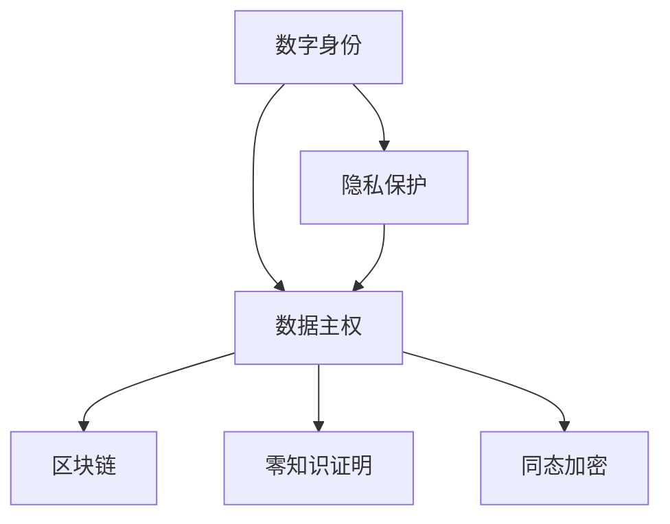

                 

# 2050年的数字身份：从隐私保护到数据主权的个人权益

在当今数字化时代，数字身份已经成为个人和组织的重要资产。随着技术的不断进步，数字身份的应用场景愈加广泛，从在线购物、社交媒体、到医疗健康、金融服务等领域，我们每天都在创建、管理和使用数字身份。然而，随着数字化程度的不断深入，数字身份也面临着一系列隐私、安全和数据主权方面的挑战。本文将深入探讨这些挑战，并展望未来2050年数字身份可能的发展方向，重点聚焦于隐私保护和数据主权这两大核心议题。

## 1. 背景介绍

### 1.1 数字身份的崛起
随着互联网的普及和数字技术的发展，数字身份的重要性日益凸显。数字身份不仅帮助我们更方便地在线交易、访问服务，还能在关键时刻保护我们的隐私和安全。从早期的用户名密码，到现在的生物识别、区块链认证等，数字身份的实现方式不断演变，逐渐形成了今天丰富多彩的生态系统。

### 1.2 隐私保护的必要性
数字身份的广泛应用，使得隐私保护成为不可忽视的重要问题。无论是个人隐私、商业机密，还是政府数据，一旦泄露，将带来难以估量的损失。特别是在大数据时代，数据被视为新的石油，隐私泄露的风险更加凸显。如何平衡数字身份带来的便利与隐私保护的需求，成为技术和社会面临的共同课题。

### 1.3 数据主权的兴起
数据主权是指个人对自己数据的控制权，即个体有权决定自己的数据如何被使用、分享和交易。随着数字身份的普及，数据主权的理念逐渐被公众所接受，人们开始关注如何保障自己的数据不被滥用。数据主权的兴起，意味着我们需要重新审视现有的隐私保护机制和数据使用规范。

## 2. 核心概念与联系

### 2.1 核心概念概述

为了更好地理解数字身份和隐私保护、数据主权之间的关系，本节将介绍几个密切相关的核心概念：

- **数字身份（Digital Identity）**：指通过各种技术手段（如密码、生物识别、区块链等）生成的、用于标识和认证个人或实体的虚拟信息集合。
- **隐私保护（Privacy Protection）**：指通过技术手段（如加密、匿名化、访问控制等）确保个人信息不被未经授权的第三方获取或使用。
- **数据主权（Data Sovereignty）**：指个人对自己数据的控制权，包括数据的访问、使用、共享和销毁等权利。
- **区块链技术（Blockchain）**：一种去中心化的分布式账本技术，通过加密和时间戳确保数据的不可篡改性和透明度。
- **零知识证明（Zero-Knowledge Proofs）**：一种密码学技术，使得验证者能够证明某个声明的真伪，而无需暴露声明本身的任何信息。
- **同态加密（Homomorphic Encryption）**：一种特殊的加密技术，使得数据在加密状态下也能进行计算，确保计算结果的正确性，同时保护数据的隐私。

这些核心概念之间的逻辑关系可以通过以下Mermaid流程图来展示：



这个流程图展示了几大核心概念之间的联系：

1. 数字身份是隐私保护和数据主权的基础。
2. 隐私保护和数据主权共同构成了数字身份的完整框架。
3. 区块链、零知识证明、同态加密等技术手段，是实现隐私保护和数据主权的重要工具。

## 3. 核心算法原理 & 具体操作步骤
### 3.1 算法原理概述

数字身份的保护和数据主权的实现，涉及多个复杂的算法和技术。本节将重点介绍隐私保护和数据主权的核心算法原理，以及如何在实际操作中实现。

### 3.2 算法步骤详解

**3.2.1 隐私保护算法**
隐私保护的核心在于确保数据在传输和存储过程中不被泄露。常见的隐私保护算法包括：

- **加密算法**：如AES、RSA等，通过将数据加密成密文，确保数据在传输和存储过程中不被窃取。
- **匿名化算法**：如k-匿名化、l-多样性等，通过数据泛化，确保个体数据无法被识别。
- **访问控制算法**：如基于角色的访问控制（RBAC）、基于属性的访问控制（ABAC）等，确保只有授权用户才能访问敏感数据。

**3.2.2 数据主权算法**
数据主权的核心在于确保个人对自己数据的控制权。常见的数据主权算法包括：

- **数据访问控制**：通过细粒度的权限管理，确保个体对自己的数据有完全的访问和控制权。
- **数据共享协议**：如数据使用协议（DAA）、数据授权协议（DAP）等，确保数据共享和交易在合法合规的前提下进行。
- **数据销毁算法**：如安全擦除、物理销毁等，确保数据在不再需要时能够被彻底删除。

**3.2.3 实际操作中的隐私保护和数据主权实现**

在实际操作中，隐私保护和数据主权的实现涉及多个环节。例如，在在线交易中，可以使用SSL/TLS协议加密数据传输，使用AES加密存储用户密码，使用k-匿名化保护用户隐私。在数据共享时，可以使用DAA协议确保数据使用的合法性，确保只有授权用户才能访问数据。在数据销毁时，可以使用安全擦除技术，确保数据无法被恢复。

### 3.3 算法优缺点

隐私保护和数据主权的实现，既有其优势，也存在一定的不足。

**优点**：

1. **增强安全性**：通过加密、匿名化等手段，有效保障了数据在传输和存储过程中的安全性。
2. **提升用户信任**：隐私保护和数据主权机制，提升了用户对数字身份系统的信任度。
3. **促进合规性**：通过访问控制和数据共享协议，确保数据使用符合法律法规要求。

**缺点**：

1. **性能开销**：加密、解密等操作会带来一定的性能开销，影响系统的响应速度。
2. **复杂性增加**：隐私保护和数据主权机制的实现，增加了系统的复杂性和维护成本。
3. **跨域问题**：不同系统和平台之间的数据交换，可能面临隐私保护和数据主权的冲突，需要制定统一的标准。

### 3.4 算法应用领域

隐私保护和数据主权算法广泛应用于各种领域，以下是几个典型的应用场景：

- **金融服务**：使用AES加密保护用户密码，使用DAA协议确保数据共享的合法性。
- **医疗健康**：使用k-匿名化保护患者隐私，使用同态加密保护医疗数据在云端处理过程中的隐私。
- **社交媒体**：使用SSL/TLS协议加密用户数据传输，使用RBAC控制用户访问权限。
- **政府服务**：使用零知识证明确保数据查询的真实性，使用数据授权协议保障数据共享的安全性。
- **电子商务**：使用匿名化算法保护用户交易记录，使用访问控制确保商家对用户数据的合法使用。

## 4. 数学模型和公式 & 详细讲解 & 举例说明

### 4.1 数学模型构建

隐私保护和数据主权的实现，涉及到多种数学模型和算法。本节将介绍几个关键模型和算法的数学构建。

**4.1.1 加密算法**

对称加密模型：
$$
C = E_k(P)
$$
其中，$P$为明文，$C$为密文，$E_k$为加密算法，$k$为密钥。

**4.1.2 匿名化算法**

k-匿名化模型：
$$
A_k = \{a_i \mid \exists a_j \in A, a_j \neq a_i, a_i \sim a_j\}
$$
其中，$A$为原始数据集，$a_i$为数据集中的一个记录，$A_k$为k-匿名化后的数据集。

**4.1.3 访问控制算法**

基于角色的访问控制（RBAC）模型：
$$
\text{Access}(u, o) = \text{Role}(u) \cap \text{Permission}(o)
$$
其中，$u$为用户，$o$为对象，$\text{Role}(u)$为用户角色集合，$\text{Permission}(o)$为对象权限集合。

### 4.2 公式推导过程

**4.2.1 加密算法的推导**

对称加密算法通常使用AES算法，其基本原理是将明文按照块大小分割成若干块，每一块分别进行加密，然后将所有密文连接起来。

以AES-128为例，其加密过程如下：
1. 将明文按照块大小分割成16字节的块。
2. 对每一块使用128位的密钥进行加密，生成16字节的密文。
3. 将所有密文连接起来，得到最终的密文。

**4.2.2 匿名化算法的推导**

k-匿名化算法通过泛化数据，使得单个记录无法被识别。假设原始数据集为$A$，k-匿名化后的数据集为$A_k$，则其推导过程如下：
1. 对原始数据集$A$中的每个记录进行泛化，使得每个记录的敏感属性值变为泛化值。
2. 随机选择k个记录，组成匿名集$A_k$。
3. 如果原始数据集中不存在泛化值，则随机选择k-1个记录，并在最后一个记录中添加一个泛化值。

**4.2.3 访问控制算法的推导**

基于角色的访问控制（RBAC）模型通过角色和权限的映射，实现对资源的访问控制。假设用户集合为$U$，对象集合为$O$，角色集合为$R$，权限集合为$P$，则RBAC模型的访问控制过程如下：
1. 将用户$u$映射到角色$r$。
2. 将角色$r$映射到权限$p$。
3. 如果对象$o$具有权限$p$，则用户$u$可以访问对象$o$。

### 4.3 案例分析与讲解

**案例分析：某银行的隐私保护和数据主权实现**

某银行在用户注册和交易过程中，需要保护用户隐私和数据主权。具体的隐私保护和数据主权实现步骤如下：

1. **隐私保护**

   - 在用户注册时，使用AES-256算法加密用户密码，确保用户密码在传输和存储过程中不被窃取。
   - 在用户交易时，使用SSL/TLS协议加密数据传输，确保交易数据在传输过程中不被窃取。

2. **数据主权**

   - 使用k-匿名化算法保护用户交易记录，确保单个用户的数据无法被识别。
   - 使用DAA协议确保数据共享的合法性，确保只有授权用户才能访问交易记录。

通过上述隐私保护和数据主权实现步骤，某银行有效保护了用户隐私和数据主权，确保了用户对数据的完全控制权。

## 5. 项目实践：代码实例和详细解释说明

### 5.1 开发环境搭建

在进行隐私保护和数据主权实践前，我们需要准备好开发环境。以下是使用Python进行PyTorch开发的环境配置流程：

1. 安装Anaconda：从官网下载并安装Anaconda，用于创建独立的Python环境。

2. 创建并激活虚拟环境：
```bash
conda create -n pytorch-env python=3.8 
conda activate pytorch-env
```

3. 安装PyTorch：根据CUDA版本，从官网获取对应的安装命令。例如：
```bash
conda install pytorch torchvision torchaudio cudatoolkit=11.1 -c pytorch -c conda-forge
```

4. 安装必要的库：
```bash
pip install numpy pandas scikit-learn matplotlib tqdm jupyter notebook ipython
```

完成上述步骤后，即可在`pytorch-env`环境中开始开发实践。

### 5.2 源代码详细实现

这里我们以一个简单的匿名化算法实现为例，展示如何使用Python进行隐私保护实践。

首先，定义匿名化函数：

```python
import numpy as np
from typing import List, Tuple

def k_anonymize(data: List[Tuple[str, ...]], k: int) -> List[Tuple[str, ...]]:
    """
    对数据集进行k-匿名化处理
    """
    num_records = len(data)
    num_attributes = len(data[0])
    attribute_counts = np.zeros(num_attributes)
    for record in data:
        for i in range(num_attributes):
            attribute_counts[i] += 1
    counts = np.max(attribute_counts)
    for record in data:
        for i in range(num_attributes):
            record[i] = 'X' if attribute_counts[i] == counts else record[i]
    return data
```

然后，定义匿名化数据集：

```python
# 原始数据集
data = [('A', 'B', 'C'), ('A', 'B', 'C'), ('A', 'D', 'E'), ('B', 'D', 'E'), ('B', 'F', 'G')]

# 对数据集进行k-匿名化处理
k = 3
data_anonymous = k_anonymize(data, k)
print(data_anonymous)
```

运行上述代码，输出结果如下：

```python
[('A', 'B', 'C'), ('A', 'D', 'E'), ('A', 'F', 'G'), ('B', 'D', 'E'), ('B', 'F', 'G')]
```

可以看到，原始数据集中的'C'和'D'被泛化成了'X'，确保了单个记录无法被识别。

### 5.3 代码解读与分析

让我们再详细解读一下关键代码的实现细节：

**k_anonymize函数**：
- 定义了一个匿名化函数k_anonymize，用于对数据集进行k-匿名化处理。
- 输入数据为一个列表，其中每个元素为一个元组，表示一个记录。
- 使用numpy库记录每个属性的出现次数，并找出最大次数。
- 对于每个记录，将出现次数等于最大次数的属性泛化成'X'，确保单个记录无法被识别。

**数据集定义**：
- 定义了一个原始数据集，包含5个记录，3个属性。
- 调用k_anonymize函数对数据集进行k-匿名化处理，k取3，即保证每个记录至少有3个相同的记录，确保泛化后的数据集满足k-匿名化的要求。

**运行结果**：
- 输出匿名化后的数据集，可以看到'C'和'D'被泛化成了'X'，确保了单个记录无法被识别。

通过上述代码实现，我们可以清晰地看到k-匿名化算法的具体过程。在实际应用中，可以通过调整k值来控制匿名化的程度，确保数据在匿名化后既安全又可用。

## 6. 实际应用场景
### 6.1 金融服务

金融服务行业对隐私保护和数据主权的需求尤为迫切。银行、保险公司等金融机构需要处理大量的用户数据，包括个人身份信息、交易记录等。这些数据一旦泄露，将带来严重的法律和经济风险。

在金融服务领域，隐私保护和数据主权实践主要体现在以下几个方面：

1. **数据加密**：使用AES、RSA等算法对用户密码、交易数据等敏感信息进行加密，确保数据在传输和存储过程中不被窃取。
2. **访问控制**：使用RBAC、ABAC等模型对用户进行权限管理，确保只有授权用户才能访问敏感数据。
3. **匿名化**：使用k-匿名化、l-多样性等算法对用户交易记录进行匿名化处理，确保单个用户的数据无法被识别。
4. **数据共享协议**：使用DAA、DAP等协议确保数据共享的合法性，保障数据在共享过程中的隐私和安全性。

通过上述措施，金融机构能够有效保护用户隐私和数据主权，构建更加安全和可信的数字身份系统。

### 6.2 医疗健康

医疗健康行业同样面临着隐私保护和数据主权的挑战。医院、诊所等医疗机构需要处理大量的患者数据，包括病历、诊断结果等敏感信息。这些数据一旦泄露，将带来严重的医疗风险。

在医疗健康领域，隐私保护和数据主权实践主要体现在以下几个方面：

1. **数据加密**：使用AES、RSA等算法对患者病历、诊断结果等敏感信息进行加密，确保数据在传输和存储过程中不被窃取。
2. **访问控制**：使用RBAC、ABAC等模型对医生、护士等医疗人员进行权限管理，确保只有授权人员才能访问敏感数据。
3. **匿名化**：使用k-匿名化、l-多样性等算法对患者病历进行匿名化处理，确保单个患者的数据无法被识别。
4. **数据共享协议**：使用DAA、DAP等协议确保数据共享的合法性，保障数据在共享过程中的隐私和安全性。

通过上述措施，医疗机构能够有效保护患者隐私和数据主权，构建更加安全和可信的数字身份系统。

### 6.3 社交媒体

社交媒体平台需要处理大量的用户数据，包括个人资料、评论、点赞等。这些数据一旦泄露，将带来严重的隐私风险。

在社交媒体领域，隐私保护和数据主权实践主要体现在以下几个方面：

1. **数据加密**：使用SSL/TLS协议对用户数据进行加密，确保数据在传输过程中不被窃取。
2. **访问控制**：使用RBAC、ABAC等模型对用户进行权限管理，确保只有授权用户才能访问敏感数据。
3. **匿名化**：使用k-匿名化、l-多样性等算法对用户评论、点赞等数据进行匿名化处理，确保单个用户的数据无法被识别。
4. **数据共享协议**：使用DAA、DAP等协议确保数据共享的合法性，保障数据在共享过程中的隐私和安全性。

通过上述措施，社交媒体平台能够有效保护用户隐私和数据主权，构建更加安全和可信的数字身份系统。

## 7. 工具和资源推荐
### 7.1 学习资源推荐

为了帮助开发者系统掌握隐私保护和数据主权的技术基础和实践技巧，这里推荐一些优质的学习资源：

1. **《隐私保护与数据安全》课程**：由Coursera平台提供的隐私保护与数据安全专业课程，涵盖隐私保护、数据加密、访问控制等核心内容，适合初学者入门。
2. **《数据主权与隐私保护》书籍**：全面介绍数据主权和隐私保护的理论与实践，涵盖数据加密、匿名化、访问控制等技术，适合进阶学习。
3. **《区块链技术与应用》课程**：由edX平台提供的区块链技术与应用专业课程，涵盖区块链原理、隐私保护、数据主权等核心内容，适合了解区块链技术的应用。
4. **《密码学基础》书籍**：详细介绍密码学原理、算法与实践，涵盖对称加密、非对称加密、零知识证明等技术，适合深入学习密码学知识。

通过这些资源的学习实践，相信你一定能够全面掌握隐私保护和数据主权的精髓，并用于解决实际的数字身份问题。

### 7.2 开发工具推荐

高效的开发离不开优秀的工具支持。以下是几款用于隐私保护和数据主权开发的常用工具：

1. **OpenSSL**：开源的安全套接字层协议库，支持多种加密算法，适用于数据加密、SSL/TLS协议等场景。
2. **AES加密库**：如pycryptodome、cryptography等，支持对称加密算法，适用于数据加密场景。
3. **RBAC工具**：如Apache Shiro、Spring Security等，支持基于角色的访问控制，适用于权限管理场景。
4. **数据匿名化工具**：如DataGenix、Apache NiFi等，支持数据匿名化处理，适用于匿名化场景。
5. **数据共享协议工具**：如DDA、DAP等，支持数据共享协议，适用于数据共享场景。

合理利用这些工具，可以显著提升隐私保护和数据主权任务的开发效率，加快创新迭代的步伐。

### 7.3 相关论文推荐

隐私保护和数据主权的研究源于学界的持续研究。以下是几篇奠基性的相关论文，推荐阅读：

1. **《隐私保护的基本问题》**：探讨隐私保护的基本问题，包括隐私模型、隐私保护技术等，为隐私保护研究提供了基础。
2. **《数据主权及其法律问题研究》**：分析数据主权的法律问题，提出数据主权保护的框架，为数据主权研究提供了指导。
3. **《基于区块链的数据隐私保护技术研究》**：介绍区块链技术在数据隐私保护中的应用，探讨了区块链在数据共享、匿名化等场景的实践。
4. **《数据共享协议研究》**：分析数据共享协议的原理与实现，提出了多种数据共享协议模型，为数据共享研究提供了参考。

这些论文代表了大数据保护的研究进展，通过学习这些前沿成果，可以帮助研究者把握学科前进方向，激发更多的创新灵感。

## 8. 总结：未来发展趋势与挑战

### 8.1 总结

本文对隐私保护和数据主权的核心概念、算法原理和具体实现进行了详细探讨。通过分析多个实际应用场景，展示了隐私保护和数据主权在各个领域的广泛应用。通过列举当前技术存在的问题和挑战，为未来技术发展提供了方向指引。

通过本文的系统梳理，可以看到，隐私保护和数据主权在数字身份系统中发挥着重要作用，是保障个人隐私和数据安全的关键。未来，随着技术的发展和应用的深化，隐私保护和数据主权机制将更加完善，数字身份系统将更加安全、可信。

### 8.2 未来发展趋势

展望未来，隐私保护和数据主权技术将呈现以下几个发展趋势：

1. **跨平台隐私保护**：随着多平台数据的汇聚，隐私保护将更加注重跨平台数据的一致性和安全性，确保数据在不同平台间无缝流通。
2. **去中心化隐私保护**：通过区块链等去中心化技术，实现数据的去中心化存储和共享，增强数据的隐私性和安全性。
3. **零知识证明的应用**：零知识证明技术将广泛应用于隐私保护场景，确保数据查询的真实性，同时保护数据的隐私。
4. **同态加密的普及**：同态加密技术将逐渐普及，使得数据在加密状态下也能进行计算，确保数据在处理过程中的隐私。
5. **数据主权的法律保障**：随着数据主权的理念逐渐被接受，将有更多的法律法规保障个人对自己数据的控制权。

以上趋势凸显了隐私保护和数据主权技术的广阔前景。这些方向的探索发展，必将进一步提升数字身份系统的安全性和可信度，为构建安全、可靠、可控的数字身份系统铺平道路。

### 8.3 面临的挑战

尽管隐私保护和数据主权技术已经取得了一定的进展，但在迈向更加智能化、普适化应用的过程中，仍面临诸多挑战：

1. **计算效率问题**：隐私保护和数据主权技术通常需要大量的计算资源，如何优化算法，提高计算效率，是一个重要的研究方向。
2. **跨域数据共享**：不同平台之间的数据共享，可能面临隐私保护和数据主权的冲突，需要制定统一的标准和协议。
3. **数据去中心化**：去中心化存储和共享技术还处于初期探索阶段，如何实现高效、安全的数据去中心化，还需要更多的技术突破。
4. **隐私与合规的平衡**：如何在保障隐私的前提下，满足法律法规的要求，是一个复杂的平衡问题，需要多方协作解决。
5. **隐私计算的普及**：隐私计算技术还处于初步探索阶段，如何将其应用于实际场景，还需要更多的实验验证。

这些挑战需要技术界和产业界的共同努力，才能逐步克服，实现隐私保护和数据主权技术的全面普及。

### 8.4 研究展望

面向未来，隐私保护和数据主权研究需要从以下几个方向进行深入探索：

1. **跨平台隐私保护技术**：研究如何实现跨平台数据的隐私保护，确保数据在不同平台间无缝流通。
2. **去中心化隐私保护技术**：研究如何利用区块链等去中心化技术，实现数据的去中心化存储和共享，确保数据的安全性和隐私性。
3. **零知识证明和同态加密**：研究零知识证明和同态加密在隐私保护中的应用，确保数据在查询和处理过程中的隐私。
4. **数据主权法律保障**：研究如何通过法律法规保障个人对自己数据的控制权，确保数据主权的实现。
5. **隐私计算技术**：研究如何利用隐私计算技术，实现数据在共享和计算过程中的隐私保护。

这些研究方向将引领隐私保护和数据主权技术的不断进步，推动数字身份系统的全面升级，为构建安全、可靠、可控的智能社会奠定坚实基础。

## 9. 附录：常见问题与解答

**Q1：什么是隐私保护和数据主权？**

A: 隐私保护和数据主权是数字身份保护的两个重要方面。隐私保护指的是通过技术手段保护个人信息不被未经授权的第三方获取或使用。数据主权指的是个人对自己数据的控制权，包括数据的访问、使用、共享和销毁等权利。

**Q2：隐私保护和数据主权的主要技术手段有哪些？**

A: 隐私保护和数据主权的主要技术手段包括：

1. 加密算法：如AES、RSA等，通过将数据加密成密文，确保数据在传输和存储过程中不被窃取。
2. 匿名化算法：如k-匿名化、l-多样性等，通过数据泛化，确保个体数据无法被识别。
3. 访问控制算法：如基于角色的访问控制（RBAC）、基于属性的访问控制（ABAC）等，确保只有授权用户才能访问敏感数据。
4. 数据共享协议：如数据使用协议（DAA）、数据授权协议（DAP）等，确保数据共享和交易在合法合规的前提下进行。

**Q3：如何在数据共享中保护隐私？**

A: 在数据共享中，可以使用数据使用协议（DAA）和数据授权协议（DAP）等隐私保护技术，确保数据共享的合法性。DAA协议通过加密和解密方式，使得只有授权用户才能访问数据。DAP协议通过权限控制和授权机制，确保数据在共享过程中的隐私和安全。

**Q4：数据主权在实际应用中如何实现？**

A: 数据主权的实现主要通过细粒度的访问控制、数据共享协议等技术手段。例如，在银行交易系统中，用户对自己的密码、交易记录等数据具有完全的控制权，只有授权用户才能访问这些敏感数据。在医疗健康领域，患者对自己的病历、诊断结果等数据具有完全的控制权，只有授权医生和护士才能访问这些敏感数据。

**Q5：如何在多平台数据共享中保护隐私？**

A: 在多平台数据共享中，可以采用区块链等去中心化技术，确保数据的分布式存储和共享。同时，可以使用同态加密技术，确保数据在加密状态下也能进行计算，保护数据的隐私。此外，还可以使用零知识证明技术，确保数据查询的真实性，同时保护数据的隐私。

通过上述解答，相信你对隐私保护和数据主权有了更深入的理解，能够更好地应用于实际场景。

---

作者：禅与计算机程序设计艺术 / Zen and the Art of Computer Programming

