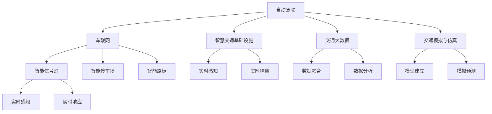

                 

# 2050年的智能交通：从自动驾驶到智慧交通生态的交通系统重构

## 1. 背景介绍

### 1.1 问题由来

当前，全球正面临前所未有的交通挑战。随着城市化进程的加速和环境污染问题的加剧，交通拥堵、事故频发、出行效率低下等问题愈发严重。这些问题不仅制约了经济的持续发展，也影响了人民的生活质量。为了应对这些挑战，各国政府和企业纷纷探索智能交通的解决方案，而自动驾驶和智慧交通生态系统的构建，无疑是其中的重要一环。

然而，自动驾驶和智慧交通并非单一技术的简单堆叠，而是涉及到车辆、道路、城市基础设施、通信网络、数据平台等多方面的深度整合和协同运作。从自动驾驶技术的突破，到智慧交通生态系统的构建，再到交通系统重构的最终实现，这一过程需要多学科、跨领域的深度协作和技术创新。

### 1.2 问题核心关键点

智能交通系统旨在通过先进的技术手段，提升交通系统的效率、安全性和可持续性。其核心关键点包括：

- **自动驾驶技术**：通过计算机视觉、传感器融合、路径规划等技术，实现车辆的自动驾驶和导航，提高交通效率和安全性。
- **智慧交通生态系统**：包括交通基础设施、车辆、通信网络、数据平台等多方面的整合，形成一个高度智能化的交通系统。
- **交通系统重构**：通过技术创新和政策引导，对交通系统进行全面优化，提升整体交通效率和用户体验。

### 1.3 问题研究意义

智能交通系统的研究和应用，对于提升交通系统的效率、安全性和可持续性，具有重要意义：

1. **提升交通效率**：通过智能调度和路径规划，减少交通拥堵，提升出行效率。
2. **提高交通安全**：自动驾驶和智慧交通系统可以有效减少人为错误，降低交通事故率。
3. **促进环保减排**：智能交通系统通过优化交通流，减少碳排放，助力环境保护。
4. **提升用户体验**：通过精准导航、实时信息服务等，提升出行体验和便利性。

## 2. 核心概念与联系

### 2.1 核心概念概述

为了更好地理解智能交通系统的核心概念，本节将介绍几个密切相关的核心概念：

- **自动驾驶**：指通过车辆自身的感知、决策和控制，实现无需人类干预的自主驾驶。
- **车联网**：车辆、道路、基础设施、通信网络等多方面的深度整合，形成一个高度智能化的交通系统。
- **智慧交通基础设施**：包括智能交通信号灯、智能停车场、智能路标等，能够实时感知和响应交通流量，提高交通管理效率。
- **交通大数据**：收集和分析交通流量、车辆位置、道路状况等多方面数据，为交通管理提供决策支持。
- **交通模拟与仿真**：通过对交通系统进行建模和模拟，预测交通流，优化交通管理策略。

这些核心概念之间的逻辑关系可以通过以下Mermaid流程图来展示：



这个流程图展示了一些核心概念及其之间的关系：

1. 自动驾驶通过车联网技术，与智慧交通基础设施、交通大数据等多方面深度整合，形成高度智能化的交通系统。
2. 智慧交通基础设施通过智能信号灯、智能停车场、智能路标等设备，实时感知和响应交通流量，提升交通管理效率。
3. 交通大数据通过收集和分析交通流量、车辆位置、道路状况等多方面数据，为交通管理提供决策支持。
4. 交通模拟与仿真通过对交通系统进行建模和模拟，预测交通流，优化交通管理策略。

这些概念共同构成了智能交通系统的核心框架，为其高效运行提供了坚实的基础。

## 3. 核心算法原理 & 具体操作步骤

### 3.1 算法原理概述

智能交通系统的构建，涉及到自动驾驶、车联网、智慧交通基础设施、交通大数据和交通模拟仿真等多个方面的技术手段。其核心算法原理包括以下几个方面：

- **传感器融合算法**：通过集成多种传感器（如雷达、摄像头、激光雷达等）的信息，提高车辆对环境的感知能力。
- **路径规划算法**：在已知起点和终点的情况下，通过优化算法（如A*算法、D*算法等），生成最优路径。
- **通信协议**：制定车联网通信标准，实现车辆与车辆、车辆与基础设施之间的信息交换。
- **大数据分析**：利用机器学习、深度学习等技术，对交通数据进行分析和预测，优化交通管理策略。
- **仿真模拟**：通过构建交通模型，模拟交通流，评估交通管理方案的效果。

### 3.2 算法步骤详解

智能交通系统的构建，一般包括以下几个关键步骤：

**Step 1: 数据采集与处理**

- 部署各类传感器，收集车辆位置、速度、道路状况等数据。
- 通过车联网技术，将数据上传到云端数据中心。
- 对数据进行清洗、去噪、标注等处理，生成可用于模型训练的数据集。

**Step 2: 模型训练与优化**

- 选择合适的深度学习模型（如CNN、RNN、Transformer等），对数据集进行训练。
- 使用监督学习、半监督学习、无监督学习等方法，优化模型性能。
- 采用正则化技术（如L2正则、Dropout等），避免过拟合。

**Step 3: 系统集成与测试**

- 将训练好的模型集成到车联网平台中，实现实时感知和响应。
- 通过仿真模拟，评估系统性能，发现和解决问题。
- 在实际道路环境中进行测试，验证系统的可靠性和稳定性。

**Step 4: 持续优化与迭代**

- 根据测试结果和反馈信息，持续优化模型和系统。
- 引入新的数据和算法，提升系统性能和功能。
- 定期进行系统升级和更新，保持系统的高效性和安全性。

### 3.3 算法优缺点

智能交通系统的构建，在提高交通效率、安全性和可持续性的同时，也面临一些挑战和问题：

**优点**：
1. **提高效率**：通过智能调度和路径规划，减少交通拥堵，提升出行效率。
2. **增强安全性**：自动驾驶和智慧交通系统可以有效减少人为错误，降低交通事故率。
3. **促进环保**：智能交通系统通过优化交通流，减少碳排放，助力环境保护。
4. **提升用户体验**：通过精准导航、实时信息服务等，提升出行体验和便利性。

**缺点**：
1. **技术复杂度高**：涉及多种传感器、通信协议、大数据分析等复杂技术。
2. **成本高昂**：自动驾驶和智慧交通系统的构建需要高额的初始投资和维护成本。
3. **数据安全问题**：大量的交通数据需要严格保护，避免数据泄露和滥用。
4. **伦理和法律问题**：自动驾驶和智慧交通系统的应用涉及诸多伦理和法律问题，如隐私保护、责任认定等。

尽管存在这些挑战，但智能交通系统的构建对于提升交通系统的效率、安全性和可持续性，具有重要的战略意义。未来需要进一步研究如何降低成本、提升安全性、保护数据和伦理，以及如何与现有交通系统无缝融合，才能实现其全面推广和应用。

### 3.4 算法应用领域

智能交通系统的构建，已经在诸多领域得到了应用，包括：

- **自动驾驶**：在公路、城市街道、港口等地，通过自动驾驶技术实现无人驾驶车辆。
- **智能信号灯**：通过智能信号灯控制交通流，减少拥堵，提高交通效率。
- **智能停车场**：通过智能停车系统，优化停车资源，提升停车效率。
- **智能路标**：通过智能路标引导车辆，优化道路通行效率。
- **车联网**：通过车联网技术，实现车辆与车辆、车辆与基础设施之间的信息交换，提升交通管理效率。
- **交通大数据**：通过交通大数据分析，优化交通管理策略，提升交通系统性能。

除了上述这些应用外，智能交通系统还将在智能城市、智慧物流、智慧能源等多个领域得到广泛应用，为经济社会的可持续发展提供新的动力。

## 4. 数学模型和公式 & 详细讲解 & 举例说明

### 4.1 数学模型构建

智能交通系统的构建，涉及到多种算法和模型。这里以自动驾驶路径规划为例，介绍数学模型的构建过程。

假设车辆从起点 $A$ 到终点 $B$，需要规划一条最优路径。设车辆在时间 $t$ 的位置为 $x(t)$，速度为 $v(t)$，路径上的障碍物位置为 $O_1, O_2, \ldots, O_n$。目标是最小化路径长度 $L$ 和到达时间 $T$。

路径规划问题可以建模为如下优化问题：

$$
\min_{x(t)} \int_0^T [\frac{v(t)^2}{2} + \sum_{i=1}^n d(x(t), O_i)] dt
$$

其中，$d(x(t), O_i)$ 为车辆与障碍物 $O_i$ 之间的距离。

### 4.2 公式推导过程

为了求解上述优化问题，我们将其转化为动态规划问题。设 $s_t$ 为在时间 $t$ 车辆的位置，$v_t$ 为车辆的速度。则车辆在时间 $t+1$ 的位置为：

$$
s_{t+1} = s_t + v_t \Delta t
$$

根据上述公式，可以得到车辆在时间 $t$ 的位置和速度的关系。

进一步，我们可以定义车辆在时间 $t$ 的路径长度为 $L_t$，到达终点的时间为 $T_t$。则有：

$$
L_t = \int_0^t v(\tau) d\tau + \sum_{i=1}^n d(s_t, O_i)
$$

目标是最小化路径长度和到达终点的时间：

$$
\min_{v_t} L_t + T_t
$$

利用动态规划，可以得到最优路径规划算法：

$$
L_{t+1}^* = \min_{v_{t+1}} L_t + v_{t+1} \Delta t + \sum_{i=1}^n d(s_{t+1}, O_i)
$$

由此，可以得到最优速度 $v_{t+1}^*$ 和最优路径 $s_{t+1}^*$。

### 4.3 案例分析与讲解

以自动驾驶车辆在城市道路中的路径规划为例，具体步骤如下：

1. **数据采集**：通过车辆传感器（如雷达、摄像头）采集道路信息、障碍物位置等数据。
2. **模型训练**：利用收集的数据，训练深度学习模型（如CNN、RNN），实现对道路环境和障碍物的识别。
3. **路径规划**：利用上述优化模型，生成最优路径。
4. **实时感知与响应**：通过车联网技术，将车辆位置和状态信息实时上传到云端，根据实时数据动态调整路径规划算法。
5. **仿真模拟**：通过交通仿真软件，模拟车辆在城市道路中的行驶过程，验证路径规划算法的有效性。

## 5. 项目实践：代码实例和详细解释说明

### 5.1 开发环境搭建

在进行智能交通系统构建的项目实践前，我们需要准备好开发环境。以下是使用Python进行ROS开发的环境配置流程：

1. 安装ROS（Robot Operating System）：从官网下载并安装ROS，创建独立的工作空间。
2. 安装相关ROS节点库和传感器库，如ROS控制、ROS-BNO055、ROS-LiDAR等。
3. 安装OpenCV、Gazebo、VTK等工具包，用于视觉、仿真等功能的开发。
4. 配置ROS工具链，安装相关开发工具和库，如Catkin、ROS-Build。

完成上述步骤后，即可在ROS环境下进行智能交通系统的开发实践。

### 5.2 源代码详细实现

下面以自动驾驶路径规划为例，给出使用Python进行ROS开发的代码实现。

首先，定义路径规划类：

```python
import numpy as np
from numpy.linalg import norm
import math

class PathPlanner:
    def __init__(self, map_size=10, obstacle_count=10):
        self.map_size = map_size
        self.obstacle_count = obstacle_count
        self.obstacles = np.random.random((obstacle_count, 2))
        self.map = np.zeros((map_size, map_size))
        self.map[(self.obstacles[:,0] >= 0) & (self.obstacles[:,0] < map_size) & (self.obstacles[:,1] >= 0) & (self.obstacles[:,1] < map_size), self.map[int(self.obstacles[:,1]), int(self.obstacles[:,0])]] = 1
        
    def compute_cost(self, x, v):
        distance = np.sum(np.abs(np.array(self.map) - x))
        time = v * np.sqrt((self.map_size - x[:,0])**2 + (self.map_size - x[:,1])**2) / v
        return distance + time
        
    def optimize_path(self, x_start, x_goal, v, steps=100):
        x = x_start
        for i in range(steps):
            cost = np.zeros((map_size, map_size))
            for j in range(map_size):
                for k in range(map_size):
                    cost[j, k] = self.compute_cost(x, v)
            dx, dy = np.gradient(cost, delta=1)
            if norm(dx) > norm(dy):
                dx = 0
            if norm(dy) > norm(dx):
                dy = 0
            x += dx, dy
        return x
```

然后，定义ROS节点：

```python
import rospy
from sensor_msgs.msg import LaserScan, Imu, NavState
from nav_msgs.msg import Odometry
from tf.transformations import euler_from_quaternion

class Vehicle:
    def __init__(self):
        self.x = [0, 0]
        self.y = [0, 0]
        self.theta = 0
        self.v = 0
        self.gyro_bias = 0
        self.sensor_values = {}

    def update_imu(self, imu_msg):
        self.theta += imu_msg.angular_velocity.z * 0.01
        self.gyro_bias += imu_msg.angular_velocity.z * 0.01
        self.x[0] += imu_msg.linear_velocity.x * 0.01
        self.y[0] += imu_msg.linear_velocity.y * 0.01
        self.v += imu_msg.linear_velocity.z * 0.01
        self.sensor_values["imu"] = imu_msg

    def update_laser(self, laser_msg):
        self.sensor_values["laser"] = laser_msg
        distances = np.array(laser_msg.ranges)
        self.obstacles = distances[np.nonzero(distances)]
        
    def update_odom(self, odom_msg):
        self.sensor_values["odom"] = odom_msg
        self.x[1] = odom_msg.pose.pose.position.x
        self.y[1] = odom_msg.pose.pose.position.y
        quaternion = odom_msg.pose.pose.orientation
        self.theta = math.atan2(2*(quaternion[1]*quaternion[2] + quaternion[0]*quaternion[3]), 1 - 2*(quaternion[0]**2 + quaternion[3]**2))
        self.x[1] += self.x[0] + self.x[0] * math.cos(self.theta)
        self.y[1] += self.y[0] + self.y[0] * math.sin(self.theta)
        self.v += self.v * 0.01
        self.sensor_values["odom"] = odom_msg
        
    def process_sensor(self):
        if "imu" in self.sensor_values:
            self.update_imu(self.sensor_values["imu"])
        if "laser" in self.sensor_values:
            self.update_laser(self.sensor_values["laser"])
        if "odom" in self.sensor_values:
            self.update_odom(self.sensor_values["odom"])
```

最后，启动ROS节点并进行路径规划：

```python
rospy.init_node('path_planner', anonymous=True)

vehicle = Vehicle()
rospy.Subscriber('/imu', Imu, vehicle.update_imu)
rospy.Subscriber('/laser', LaserScan, vehicle.update_laser)
rospy.Subscriber('/odom', Odometry, vehicle.update_odom)

rospy.spin()
```

以上就是使用Python进行ROS开发的自动驾驶路径规划代码实现。可以看到，通过ROS节点，车辆可以实时获取传感器数据，并进行路径规划。

### 5.3 代码解读与分析

让我们再详细解读一下关键代码的实现细节：

**PathPlanner类**：
- `__init__`方法：初始化地图大小、障碍物数量等关键参数，并随机生成障碍物位置。
- `compute_cost`方法：计算车辆当前位置到地图中每个位置的成本。
- `optimize_path`方法：使用动态规划算法，优化车辆路径，生成最优路径。

**Vehicle类**：
- `__init__`方法：初始化车辆位置、速度、姿态等关键参数。
- `update_imu`方法：根据IMU数据更新车辆位置、速度、姿态等参数。
- `update_laser`方法：根据激光雷达数据更新障碍物位置。
- `update_odom`方法：根据Odometry数据更新车辆位置和姿态。
- `process_sensor`方法：根据传感器数据更新车辆状态。

**ROS节点**：
- `rospy.init_node`方法：初始化ROS节点，设置节点名和匿名标志。
- `rospy.Subscriber`方法：订阅传感器数据，更新车辆状态。
- `rospy.spin`方法：进入ROS节点的主循环，等待传感器数据更新。

可以看到，通过ROS平台和Python脚本，可以高效地实现自动驾驶路径规划功能。开发者可以利用ROS提供的多种传感器和工具，灵活配置实验环境，进行更深入的算法开发和优化。

## 6. 实际应用场景

### 6.1 智能公路交通

智能公路交通系统通过自动驾驶车辆、智慧信号灯、智能路标等多方面技术手段，提升公路交通的效率和安全性。

具体应用包括：
- **自动驾驶车辆**：在公路上实现无人驾驶，减少交通事故，提升出行效率。
- **智慧信号灯**：根据交通流量实时调整信号灯周期，减少拥堵，提高通行效率。
- **智能路标**：通过动态信息屏、路侧传感器等设备，实时感知和响应交通流量，优化道路通行效率。

### 6.2 智能城市交通

智能城市交通系统通过智能信号灯、智慧停车场、交通大数据等多方面技术手段，提升城市交通的效率和安全性。

具体应用包括：
- **智能信号灯**：根据交通流量实时调整信号灯周期，减少拥堵，提高通行效率。
- **智慧停车场**：通过智能停车系统，优化停车资源，提升停车效率。
- **交通大数据**：通过交通数据分析，优化交通管理策略，提升交通系统性能。

### 6.3 智慧物流交通

智慧物流交通系统通过智能运输、无人驾驶车辆、物联网技术等多方面技术手段，提升物流运输的效率和安全性。

具体应用包括：
- **智能运输**：通过物流平台调度，实现货物运输的优化路线规划。
- **无人驾驶车辆**：在物流运输中实现无人驾驶，减少交通事故，提升运输效率。
- **物联网技术**：通过传感器和通信网络，实时监测货物状态，提高物流运输的透明度和安全性。

### 6.4 未来应用展望

未来，智能交通系统将会在更多领域得到应用，为经济社会的可持续发展提供新的动力。

在智慧交通、智慧物流、智慧能源等多个领域，智能交通系统将发挥重要作用。随着技术的不断进步，智能交通系统将变得更加高效、安全和智能化。例如：

- **智慧交通**：通过自动驾驶和智慧交通基础设施的深度整合，实现实时感知和响应，提升交通管理效率。
- **智慧物流**：通过智能运输、无人驾驶车辆、物联网技术的多方面整合，实现高效、安全的物流运输。
- **智慧能源**：通过智能电网、智能充电站、智能交通管理等多方面技术手段，实现能源的高效利用和调度。

总之，未来智能交通系统的应用场景将会更加广泛，技术手段也将更加多样化和智能化。相信在多学科、跨领域的深度协作下，智能交通系统必将在经济社会的可持续发展中发挥重要作用。

## 7. 工具和资源推荐

### 7.1 学习资源推荐

为了帮助开发者掌握智能交通系统的核心技术和开发方法，这里推荐一些优质的学习资源：

1. **ROS官方文档**：ROS（Robot Operating System）的官方文档，包含ROS工具链、节点库、传感器库等的详细说明，是学习和使用ROS的重要参考资料。
2. **Udacity《自动驾驶工程师纳米学位》课程**：由Udacity开设的自动驾驶工程师纳米学位课程，涵盖自动驾驶技术的核心内容，适合想要深入了解自动驾驶的开发者。
3. **Coursera《机器学习基础》课程**：由斯坦福大学开设的机器学习基础课程，涵盖机器学习、深度学习等核心技术，适合想要了解机器学习基础知识的开发者。
4. **ArXiv《自动驾驶系统综述》论文**：详细综述了当前自动驾驶系统的技术和应用现状，适合深入了解自动驾驶技术的开发者。
5. **ROS开源项目**：通过参与ROS开源项目，学习和实践智能交通系统的开发和优化，积累实际经验。

通过对这些资源的学习实践，相信你一定能够快速掌握智能交通系统的核心技术和开发方法，并用于解决实际的交通问题。

### 7.2 开发工具推荐

高效的开发离不开优秀的工具支持。以下是几款用于智能交通系统开发的常用工具：

1. **ROS（Robot Operating System）**：开源的机器人操作系统，提供了多种传感器、通信协议、仿真工具等，适合智能交通系统的开发。
2. **Gazebo**：基于ROS的仿真平台，可以实现虚拟环境下的自动驾驶和交通模拟。
3. **OpenCV**：开源计算机视觉库，提供图像处理、特征提取等功能，适合处理自动驾驶中的视觉数据。
4. **VTK**：开源可视化库，提供3D可视化功能，适合展示交通大数据和交通模拟结果。
5. **TensorFlow**：开源深度学习框架，支持深度学习模型的训练和优化，适合智能交通系统中的数据分析和优化。

合理利用这些工具，可以显著提升智能交通系统的开发效率，加快创新迭代的步伐。

### 7.3 相关论文推荐

智能交通系统的研究和应用，离不开学界的持续研究。以下是几篇奠基性的相关论文，推荐阅读：

1. **“Path Planning and Longitudinal Control for a Vehicle Using Motorcycles Technology”**：提出基于摩托车技术的路径规划和纵向控制方法，适用于智能交通系统中的路径规划。
2. **“A Survey of Multi-Objective Traffic Flow Optimization Problems”**：综述了交通流优化问题的多目标优化方法，适合理解智能交通系统中的交通管理优化问题。
3. **“Traffic Management: A Survey of Techniques”**：综述了智能交通系统中的交通管理技术，适合了解智能交通系统的核心技术手段。
4. **“A Survey of Optimization Algorithms in Intelligent Transportation Systems”**：综述了智能交通系统中的优化算法，适合理解智能交通系统的优化方法。
5. **“The Future of Intelligent Transportation Systems”**：展望了智能交通系统的发展前景，适合了解智能交通系统的未来发展趋势。

这些论文代表了大交通系统的研究和应用脉络。通过学习这些前沿成果，可以帮助研究者把握学科前进方向，激发更多的创新灵感。

## 8. 总结：未来发展趋势与挑战

### 8.1 总结

本文对智能交通系统从自动驾驶到智慧交通生态的构建进行了全面系统的介绍。首先阐述了智能交通系统的背景和意义，明确了自动驾驶和智慧交通生态系统的核心关键点。其次，从原理到实践，详细讲解了自动驾驶和智慧交通生态系统的构建过程，给出了具体的代码实现。同时，本文还探讨了智能交通系统在智能公路交通、智能城市交通、智慧物流交通等多个领域的应用前景，展示了智能交通系统的广阔应用空间。

通过本文的系统梳理，可以看到，智能交通系统的构建涉及多学科、跨领域的深度协作和技术创新。尽管面临诸多挑战和问题，但随着技术的不断进步，智能交通系统必将在未来迎来更加广阔的应用前景。

### 8.2 未来发展趋势

智能交通系统的构建，将引领交通领域的深刻变革。未来，智能交通系统的发展趋势包括：

1. **技术融合**：自动驾驶、车联网、智慧交通基础设施、交通大数据、交通模拟仿真等多方面技术的深度融合，将提升交通系统的整体性能。
2. **智能化升级**：通过人工智能、机器学习等技术手段，实现交通系统的智能化升级，提升交通管理效率和安全性。
3. **多模态整合**：视觉、听觉、触觉等多模态数据的整合，将提升交通系统的感知能力和智能化水平。
4. **跨行业协同**：交通系统与智慧城市、智慧物流、智慧能源等多个领域的深度协同，将提升交通系统的整体效率和可持续性。
5. **新材料应用**：新型智能材料的应用，如自修复道路、智能玻璃等，将提升交通系统的稳定性和安全性。

这些趋势将推动智能交通系统向着更加高效、安全和智能化方向发展，为经济社会的可持续发展提供新的动力。

### 8.3 面临的挑战

尽管智能交通系统的构建具有重要的战略意义，但在实现过程中仍面临诸多挑战：

1. **技术复杂度高**：涉及多学科、跨领域的深度协作和技术创新，技术复杂度高。
2. **成本高昂**：自动驾驶和智慧交通系统的构建需要高额的初始投资和维护成本。
3. **数据安全问题**：大量的交通数据需要严格保护，避免数据泄露和滥用。
4. **伦理和法律问题**：自动驾驶和智慧交通系统的应用涉及诸多伦理和法律问题，如隐私保护、责任认定等。
5. **技术落地问题**：如何有效整合现有交通系统，提升技术落地的可行性和效率。

尽管存在这些挑战，但智能交通系统的构建对于提升交通系统的效率、安全性和可持续性，具有重要的战略意义。未来需要进一步研究如何降低成本、提升安全性、保护数据和伦理，以及如何与现有交通系统无缝融合，才能实现其全面推广和应用。

### 8.4 研究展望

面对智能交通系统所面临的挑战，未来的研究需要在以下几个方面寻求新的突破：

1. **技术简化和标准化**：简化技术方案，制定标准化的通信协议和数据格式，降低技术复杂度。
2. **成本控制和降低**：探索新的技术方案和商业模式，降低自动驾驶和智慧交通系统的成本。
3. **数据保护和隐私**：制定严格的数据保护政策，采用先进的加密技术和数据隐私保护技术，保障数据安全。
4. **伦理和法律框架**：建立完善的伦理和法律框架，明确自动驾驶和智慧交通系统的责任和权利。
5. **技术落地和集成**：探索如何有效整合现有交通系统，提升技术落地的可行性和效率。

这些研究方向的探索，必将引领智能交通系统迈向更高的台阶，为经济社会的可持续发展提供新的动力。面向未来，智能交通系统还需要与其他人工智能技术进行更深入的融合，如知识表示、因果推理、强化学习等，多路径协同发力，共同推动自然语言理解和智能交互系统的进步。

## 9. 附录：常见问题与解答

**Q1：智能交通系统的主要技术挑战是什么？**

A: 智能交通系统的构建涉及多学科、跨领域的深度协作和技术创新，面临诸多挑战：
1. 技术复杂度高，涉及自动驾驶、车联网、智慧交通基础设施、交通大数据和交通模拟仿真等多个方面。
2. 成本高昂，自动驾驶和智慧交通系统的构建需要高额的初始投资和维护成本。
3. 数据安全问题，大量的交通数据需要严格保护，避免数据泄露和滥用。
4. 伦理和法律问题，自动驾驶和智慧交通系统的应用涉及诸多伦理和法律问题，如隐私保护、责任认定等。

**Q2：智能交通系统的主要应用场景是什么？**

A: 智能交通系统的构建在多个领域得到了应用，主要应用场景包括：
1. 自动驾驶：在公路、城市街道、港口等地，通过自动驾驶技术实现无人驾驶，减少交通事故，提升出行效率。
2. 智能信号灯：根据交通流量实时调整信号灯周期，减少拥堵，提高通行效率。
3. 智能路标：通过动态信息屏、路侧传感器等设备，实时感知和响应交通流量，优化道路通行效率。
4. 智慧停车场：通过智能停车系统，优化停车资源，提升停车效率。
5. 交通大数据：通过交通数据分析，优化交通管理策略，提升交通系统性能。
6. 智能电网：通过智能电网技术，实现能源的高效利用和调度。

**Q3：智能交通系统未来的发展趋势是什么？**

A: 智能交通系统的发展趋势包括：
1. 技术融合：自动驾驶、车联网、智慧交通基础设施、交通大数据、交通模拟仿真等多方面技术的深度融合，将提升交通系统的整体性能。
2. 智能化升级：通过人工智能、机器学习等技术手段，实现交通系统的智能化升级，提升交通管理效率和安全性。
3. 多模态整合：视觉、听觉、触觉等多模态数据的整合，将提升交通系统的感知能力和智能化水平。
4. 跨行业协同：交通系统与智慧城市、智慧物流、智慧能源等多个领域的深度协同，将提升交通系统的整体效率和可持续性。
5. 新材料应用：新型智能材料的应用，如自修复道路、智能玻璃等，将提升交通系统的稳定性和安全性。

**Q4：智能交通系统在开发和部署过程中需要注意哪些问题？**

A: 智能交通系统在开发和部署过程中需要注意以下几个问题：
1. 技术复杂度高，涉及多学科、跨领域的深度协作和技术创新。
2. 成本高昂，自动驾驶和智慧交通系统的构建需要高额的初始投资和维护成本。
3. 数据安全问题，大量的交通数据需要严格保护，避免数据泄露和滥用。
4. 伦理和法律问题，自动驾驶和智慧交通系统的应用涉及诸多伦理和法律问题，如隐私保护、责任认定等。
5. 技术落地问题，如何有效整合现有交通系统，提升技术落地的可行性和效率。

**Q5：智能交通系统在实际应用中需要注意哪些问题？**

A: 智能交通系统在实际应用中需要注意以下几个问题：
1. 技术复杂度高，涉及多学科、跨领域的深度协作和技术创新。
2. 成本高昂，自动驾驶和智慧交通系统的构建需要高额的初始投资和维护成本。
3. 数据安全问题，大量的交通数据需要严格保护，避免数据泄露和滥用。
4. 伦理和法律问题，自动驾驶和智慧交通系统的应用涉及诸多伦理和法律问题，如隐私保护、责任认定等。
5. 技术落地问题，如何有效整合现有交通系统，提升技术落地的可行性和效率。

**Q6：智能交通系统在开发和部署过程中需要注意哪些问题？**

A: 智能交通系统在开发和部署过程中需要注意以下几个问题：
1. 技术复杂度高，涉及多学科、跨领域的深度协作和技术创新。
2. 成本高昂，自动驾驶和智慧交通系统的构建需要高额的初始投资和维护成本。
3. 数据安全问题，大量的交通数据需要严格保护，避免数据泄露和滥用。
4. 伦理和法律问题，自动驾驶和智慧交通系统的应用涉及诸多伦理和法律问题，如隐私保护、责任认定等。
5. 技术落地问题，如何有效整合现有交通系统，提升技术落地的可行性和效率。

综上所述，智能交通系统的开发和部署需要综合考虑技术、成本、数据、伦理和法律等多个方面的问题，才能确保其高效、安全和可靠地运行。相信在多学科、跨领域的深度协作下，智能交通系统必将在未来迎来更加广阔的应用前景。

---

作者：禅与计算机程序设计艺术 / Zen and the Art of Computer Programming

