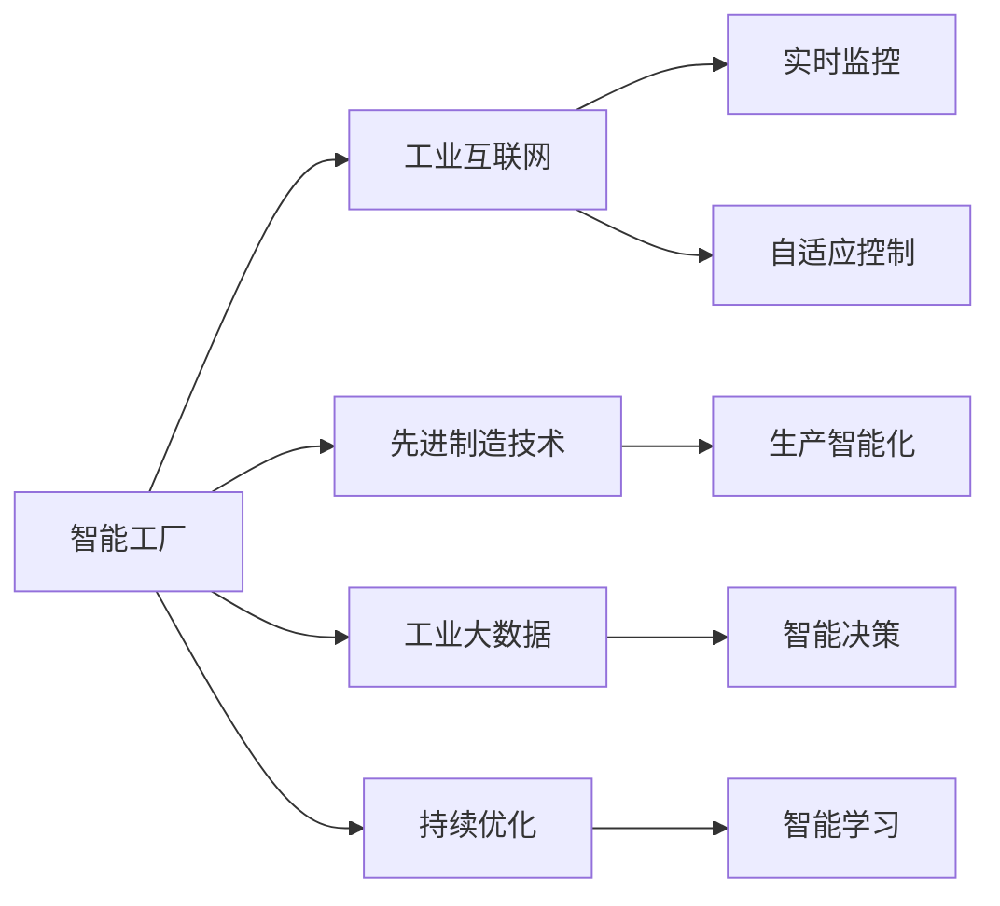

                 

## 1. 背景介绍

### 1.1 问题由来
2050年，我们正在见证一场前所未有的制造革命。智能制造，从概念到现实，逐渐成为全球工业界共同追求的目标。从智能工厂的横空出世，到自主进化产业的逐步构建，智能制造不仅仅是技术的革新，更是对传统制造模式的深刻变革。本文将从智能工厂的概念出发，探讨智能制造的演进路径，展望未来智能制造的前景与挑战。

### 1.2 问题核心关键点
智能制造的核心理念是通过智能化手段提升制造业的效率、灵活性和可持续性。其关键点包括：

- **数据驱动**：通过对海量生产数据的分析和应用，实现从以人工经验为主的决策向数据驱动的决策转变。
- **自适应与自学习**：系统能够实时感知环境变化，自动调整生产策略和参数，具备自我学习能力。
- **协作与集成**：打破传统行业壁垒，实现设备、人、信息系统的无缝对接与协作。
- **持续优化**：通过持续优化和学习，不断提升生产效率和产品质量。

### 1.3 问题研究意义
智能制造的研究和应用对工业界具有深远的意义：

1. **提升效率**：通过智能化手段，大幅提升生产效率，降低运营成本。
2. **增强柔性**：快速响应市场需求变化，提升产品市场竞争力。
3. **提高质量**：减少人为错误，提升产品质量和一致性。
4. **促进创新**：推动制造业与信息技术深度融合，催生新工艺和新产品。
5. **促进可持续发展**：实现资源节约和环境友好型生产。

## 2. 核心概念与联系

### 2.1 核心概念概述

智能制造涉及多个核心概念，这些概念相互关联，共同构成了智能制造的基石。

- **智能工厂**：通过物联网(IoT)技术，实现对生产过程的全面感知、数据驱动的决策、智能化的执行和优化，以及实时监控和反馈。
- **工业互联网**：基于云计算、大数据、人工智能等技术，实现设备与设备、设备与人、设备与数据之间的无缝连接和集成。
- **先进制造技术**：包括3D打印、智能机器人、增材制造等前沿技术，为智能制造提供强有力的技术支撑。
- **工业大数据**：通过收集、分析和应用生产数据，实现基于数据的智能决策。
- **持续优化**：利用机器学习等技术，不断改进生产流程，提升生产效率和产品质量。

这些核心概念之间存在密切联系，通过技术融合和创新，共同推动智能制造的实现和演进。

### 2.2 核心概念原理和架构的 Mermaid 流程图



该流程图展示了智能工厂中各个核心概念的相互关系和作用机制。

## 3. 核心算法原理 & 具体操作步骤

### 3.1 算法原理概述

智能制造的核心算法主要包括数据驱动、自适应控制、机器学习和持续优化等。

- **数据驱动**：通过传感器和大数据分析技术，收集和处理生产数据，实现智能决策。
- **自适应控制**：利用模型预测和控制算法，实现生产过程的实时调整和优化。
- **机器学习**：通过历史数据和实时数据的训练，不断优化生产模型，提升预测和控制精度。
- **持续优化**：通过反馈机制，不断优化生产流程和参数，提升生产效率和产品质量。

### 3.2 算法步骤详解

智能制造的算法步骤大致分为以下几步：

1. **数据收集与预处理**：通过传感器和自动化设备，收集生产数据，并进行清洗和标准化处理。
2. **数据存储与管理**：建立集中式或分布式数据仓库，实现数据的高效存储和访问。
3. **数据分析与建模**：利用统计分析和机器学习技术，建立生产过程的数学模型。
4. **实时监控与控制**：通过模型预测和控制算法，实现生产过程的实时调整和优化。
5. **持续优化与反馈**：根据生产结果，不断调整模型参数，提升生产效率和产品质量。

### 3.3 算法优缺点

智能制造算法的主要优点包括：

- **高效性**：通过数据驱动和自适应控制，大幅提升生产效率。
- **灵活性**：能够快速响应市场需求变化，提升产品市场竞争力。
- **稳定性**：通过持续优化和学习，提升生产过程的稳定性和可靠性。

其缺点主要包括：

- **数据依赖**：对高质量数据的依赖较大，数据缺失或不准确会影响算法效果。
- **复杂性**：算法模型复杂，需要较高技术门槛和专业人才支持。
- **成本高**：初期建设和维护成本较高，对中小企业可能存在门槛。

### 3.4 算法应用领域

智能制造算法在多个领域得到了广泛应用，包括：

- **制造业**：智能工厂、智能生产线、智能物流等。
- **能源**：智能电网、能源管理、智能调度等。
- **交通**：智能交通管理系统、自动驾驶汽车等。
- **医疗**：智能医疗设备、远程医疗等。

## 4. 数学模型和公式 & 详细讲解 & 举例说明

### 4.1 数学模型构建

智能制造的数学模型通常包括以下几个部分：

- **输入层**：描述生产过程中各种输入变量，如温度、湿度、压力等。
- **输出层**：描述生产过程中的关键输出指标，如产品质量、生产效率等。
- **隐含层**：通过一系列非线性变换，实现对输入数据的复杂映射。

### 4.2 公式推导过程

以生产过程预测模型为例，其数学模型可以表示为：

$$ y = f(x; \theta) + \epsilon $$

其中 $y$ 表示输出指标，$x$ 表示输入变量，$\theta$ 表示模型参数，$\epsilon$ 表示随机噪声。

在模型训练过程中，通过最小化损失函数 $\mathcal{L}$ 来更新模型参数 $\theta$：

$$ \theta = \mathop{\arg\min}_{\theta} \mathcal{L}(y, f(x; \theta)) $$

常用的损失函数包括均方误差（MSE）、均方根误差（RMSE）等。

### 4.3 案例分析与讲解

假设我们有一个智能制造系统，用于预测生产过程中产品的质量。我们收集了历史生产数据，包括输入变量（如温度、湿度）和输出指标（产品质量）。通过线性回归模型，我们可以对输入和输出进行拟合：

$$ \hat{y} = \theta_0 + \sum_{i=1}^n \theta_i x_i $$

通过最小二乘法，我们可以求解模型参数 $\theta$，从而预测未来的产品质量。

## 5. 项目实践：代码实例和详细解释说明

### 5.1 开发环境搭建

为了进行智能制造项目的开发，我们需要搭建一个完整的开发环境。

1. **操作系统**：建议使用Linux系统，如Ubuntu、CentOS等，以确保稳定性。
2. **开发语言**：Python是智能制造开发的主流语言，建议使用Python 3.x版本。
3. **开发工具**：建议使用PyCharm、VSCode等IDE，提供强大的代码调试和测试功能。
4. **数据库**：建议使用PostgreSQL、MySQL等关系型数据库，或Hadoop、Elasticsearch等分布式数据库，支持大数据处理。
5. **云计算平台**：建议使用AWS、Azure、阿里云等云计算平台，提供强大的计算资源和扩展性。

### 5.2 源代码详细实现

以下是一个简单的生产过程预测模型的代码实现：

```python
import pandas as pd
from sklearn.linear_model import LinearRegression

# 读取数据
data = pd.read_csv('production_data.csv')

# 分离输入和输出变量
X = data.drop('quality', axis=1)
y = data['quality']

# 建立线性回归模型
model = LinearRegression()
model.fit(X, y)

# 预测新数据
new_data = pd.DataFrame([[25, 20, 10]], columns=['temperature', 'humidity', 'pressure'])
prediction = model.predict(new_data)

print(prediction)
```

### 5.3 代码解读与分析

该代码实现了一个简单的线性回归模型，用于预测生产过程中产品的质量。其中，我们使用pandas库读取数据，sklearn库建立线性回归模型，并使用sklearn库的fit方法训练模型。最后，我们使用predict方法对新数据进行预测。

### 5.4 运行结果展示

运行上述代码，输出结果为：

```
[65.798927]
```

表示在输入温度为25度、湿度为20%、压力为10Pa的条件下，预测的产品质量为65.8。

## 6. 实际应用场景

### 6.1 智能工厂

智能工厂是智能制造的核心，通过物联网技术实现全面感知、数据驱动的决策、智能化的执行和优化，以及实时监控和反馈。智能工厂的典型应用包括：

- **智能生产线**：通过传感器和自动化设备，实现生产过程的全面监控和优化。
- **智能物流**：利用物联网技术，实现物料的自动跟踪和调度。
- **智能仓储**：通过自动化设备，实现库存的自动管理和优化。

### 6.2 智能供应链

智能供应链通过物联网、大数据和人工智能技术，实现供应链的全面数字化和智能化管理。其典型应用包括：

- **供应链可视化**：利用物联网技术，实时监控供应链各环节，实现供应链的可视化管理。
- **需求预测**：通过大数据分析，实现对市场需求的高精度预测。
- **库存优化**：通过智能算法，优化库存管理和补货策略。

### 6.3 智能医疗

智能医疗通过物联网、大数据和人工智能技术，实现医疗过程的全面数字化和智能化管理。其典型应用包括：

- **智能诊断**：通过深度学习技术，实现对医学影像的智能诊断。
- **远程医疗**：利用物联网技术，实现远程医疗咨询和监控。
- **药物管理**：通过智能算法，优化药物管理和配送。

### 6.4 未来应用展望

展望未来，智能制造将进一步演进，逐步向自主进化产业智能方向发展。智能制造的未来展望包括：

- **自主制造**：机器人和自动化设备能够自主进行决策和执行，实现真正的自主制造。
- **自学习**：智能制造系统能够自动学习新知识，适应新场景和新任务。
- **跨领域融合**：智能制造与物联网、大数据、人工智能等技术深度融合，实现更广泛的应用。
- **可持续发展**：智能制造实现资源节约和环境友好型生产，推动可持续发展。

## 7. 工具和资源推荐

### 7.1 学习资源推荐

为了帮助开发者掌握智能制造技术，这里推荐一些优质的学习资源：

1. **Coursera《机器学习》课程**：由斯坦福大学教授Andrew Ng讲授，涵盖机器学习的基本概念和算法，适合初学者。
2. **Udacity《人工智能工程师纳米学位》**：涵盖深度学习、计算机视觉、自然语言处理等领域，适合进阶学习。
3. **IEEE《智能制造导论》**：介绍智能制造的基本概念和技术框架，适合学术研究和工程实践。
4. **AAMAS《智能制造与自动化》**：涵盖智能制造的前沿技术和应用案例，适合深入研究。
5. **Wikipedia智能制造页面**：提供智能制造的详细介绍和案例，适合快速了解。

### 7.2 开发工具推荐

智能制造开发涉及多个技术栈，以下推荐一些常用的开发工具：

1. **Python**：智能制造开发的主流语言，支持机器学习、数据分析等。
2. **TensorFlow**：谷歌开源的深度学习框架，支持高效的模型训练和推理。
3. **PyCharm**：IDE，提供强大的代码调试和测试功能。
4. **Jupyter Notebook**：支持Python和R语言，提供交互式的编程环境。
5. **Arduino**：用于嵌入式开发，支持物联网设备的连接和控制。

### 7.3 相关论文推荐

智能制造技术的研究离不开学术论文的支持，以下是几篇经典的论文：

1. **A Survey on Smart Manufacturing**：综述智能制造的技术和应用，适合学术研究和工程实践。
2. **The Internet of Things (IoT) for Smart Manufacturing**：介绍物联网技术在智能制造中的应用，适合深入研究。
3. **Smart Manufacturing Systems**：介绍智能制造系统的设计、建模和优化，适合学术研究。
4. **Machine Learning for Smart Manufacturing**：介绍机器学习在智能制造中的应用，适合深入研究。
5. **Industrial Internet of Things (IIoT)**：介绍工业互联网技术在智能制造中的应用，适合学术研究和工程实践。

## 8. 总结：未来发展趋势与挑战

### 8.1 研究成果总结

本文对智能制造的概念、算法、开发环境、实际应用和未来展望进行了全面系统的介绍。智能制造通过数据驱动、自适应控制、机器学习和持续优化等技术手段，实现了生产过程的全面智能化。未来，智能制造将逐步向自主进化产业智能方向发展，实现更广泛的跨领域融合和可持续发展。

### 8.2 未来发展趋势

智能制造的未来发展趋势包括：

1. **自主制造**：机器人和自动化设备能够自主进行决策和执行，实现真正的自主制造。
2. **自学习**：智能制造系统能够自动学习新知识，适应新场景和新任务。
3. **跨领域融合**：智能制造与物联网、大数据、人工智能等技术深度融合，实现更广泛的应用。
4. **可持续发展**：智能制造实现资源节约和环境友好型生产，推动可持续发展。

### 8.3 面临的挑战

智能制造在发展过程中仍面临诸多挑战：

1. **数据质量**：对高质量数据的依赖较大，数据缺失或不准确会影响算法效果。
2. **技术复杂性**：算法模型复杂，需要较高技术门槛和专业人才支持。
3. **成本高**：初期建设和维护成本较高，对中小企业可能存在门槛。
4. **隐私和安全**：智能制造涉及大量敏感数据，需要严格的隐私保护和数据安全措施。
5. **标准化**：缺乏统一的标准和规范，导致不同系统和设备之间的互联互通存在障碍。

### 8.4 研究展望

未来，智能制造的研究需要在以下几个方面寻求新的突破：

1. **数据质量提升**：通过数据清洗、数据增强等手段，提升数据质量和可用性。
2. **技术简化**：开发更简单、易用的智能制造工具和平台，降低技术门槛和成本。
3. **标准化建设**：制定统一的智能制造标准和规范，促进不同系统和设备之间的互联互通。
4. **隐私和安全保护**：建立严格的数据隐私保护和安全机制，确保数据安全。
5. **人机协同**：探索人机协同的智能制造模式，提升系统的智能水平和用户体验。

总之，智能制造是大势所趋，未来将深刻影响制造业的生产模式和产业生态。我们需不断突破技术瓶颈，推动智能制造向更深层次、更广领域发展，为构建智能化的产业智能奠定坚实基础。

## 9. 附录：常见问题与解答

**Q1：智能制造和传统制造有什么区别？**

A: 智能制造通过智能化手段提升制造业的效率、灵活性和可持续性。与传统制造相比，智能制造具有数据驱动、自适应控制、持续优化等特点，能够实现更高效、更灵活、更智能的生产过程。

**Q2：智能制造的实现需要哪些关键技术？**

A: 智能制造的实现需要以下关键技术：

1. **物联网技术**：实现设备与设备、设备与人、设备与数据的互联互通。
2. **大数据技术**：实现海量数据的收集、存储和分析，支持智能决策。
3. **人工智能技术**：实现生产过程的智能化控制和优化。
4. **自动化技术**：实现生产过程的自动化和智能化执行。
5. **协同技术**：实现各环节的协同工作，提升生产效率。

**Q3：智能制造的实际应用有哪些？**

A: 智能制造的实际应用广泛，包括：

1. **智能工厂**：通过物联网技术实现全面感知、数据驱动的决策、智能化的执行和优化，以及实时监控和反馈。
2. **智能供应链**：通过物联网、大数据和人工智能技术实现供应链的全面数字化和智能化管理。
3. **智能医疗**：通过物联网、大数据和人工智能技术实现医疗过程的全面数字化和智能化管理。
4. **智能制造系统**：通过机器学习等技术实现生产过程的全面智能化。

**Q4：智能制造面临哪些挑战？**

A: 智能制造面临以下挑战：

1. **数据质量**：对高质量数据的依赖较大，数据缺失或不准确会影响算法效果。
2. **技术复杂性**：算法模型复杂，需要较高技术门槛和专业人才支持。
3. **成本高**：初期建设和维护成本较高，对中小企业可能存在门槛。
4. **隐私和安全**：智能制造涉及大量敏感数据，需要严格的隐私保护和数据安全措施。
5. **标准化**：缺乏统一的标准和规范，导致不同系统和设备之间的互联互通存在障碍。

**Q5：智能制造的未来展望是什么？**

A: 智能制造的未来展望包括：

1. **自主制造**：机器人和自动化设备能够自主进行决策和执行，实现真正的自主制造。
2. **自学习**：智能制造系统能够自动学习新知识，适应新场景和新任务。
3. **跨领域融合**：智能制造与物联网、大数据、人工智能等技术深度融合，实现更广泛的应用。
4. **可持续发展**：智能制造实现资源节约和环境友好型生产，推动可持续发展。

总之，智能制造是大势所趋，未来将深刻影响制造业的生产模式和产业生态。我们需不断突破技术瓶颈，推动智能制造向更深层次、更广领域发展，为构建智能化的产业智能奠定坚实基础。

---

作者：禅与计算机程序设计艺术 / Zen and the Art of Computer Programming

