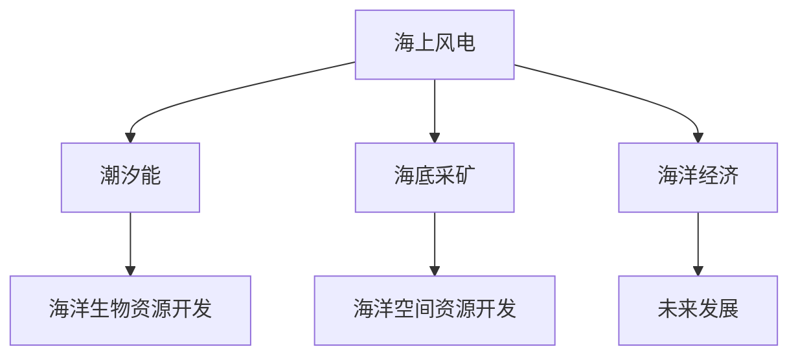

                 

# 2050年的海洋开发：从海上风电到海底采矿的海洋经济

## 1. 背景介绍

随着全球人口的快速增长和工业化进程的不断加速，对能源的需求呈爆炸性增长。传统的化石燃料已无法满足持续增长的能源需求，而且其燃烧会引发严重的环境污染和气候变化。在21世纪中期，全球社会面临着严峻的能源危机和环境压力，迫切需要转向可再生能源。海洋作为地球上最大的能源宝库，被视为未来可持续发展的关键。本文将探讨2050年海洋开发的趋势，从海上风电到海底采矿，全面解析海洋经济的多元化发展路径。

## 2. 核心概念与联系

### 2.1 核心概念概述

为了理解未来海洋开发的技术和应用，首先需掌握以下几个核心概念：

- **海上风电 (Offshore Wind Energy)**：利用海水流动和风力驱动的风力发电机，将风能转换为电能，是一种清洁的可再生能源技术。
- **潮汐能 (Tidal Energy)**：通过海洋潮汐的周期性流动，驱动涡轮机产生电能，适用于潮汐差异大的沿海地区。
- **海底采矿 (Ocean Mining)**：从海底提取稀土元素、贵金属、重矿物等资源，包括深海热液矿床、多金属结核、锰结核等。
- **海洋生物资源开发 (Marine Biomass)**：利用海藻、浮游生物等生物质资源，通过生物技术提取生物质能，如乙醇、生物柴油等。
- **海洋空间资源开发 (Marine Spatial Planning)**：对海洋空间进行合理规划，用于建设海洋能源设施、海洋生态保护区等，保障海洋资源的可持续利用。

这些概念之间的内在联系可以通过以下Mermaid流程图展示：



该流程图展示了大语言模型微调的核心概念及它们之间的逻辑关系：海上风电和潮汐能是海洋能源开发的主要形式，海底采矿和海洋生物资源开发属于海洋资源开发的范畴，海洋空间资源开发则提供了海洋经济发展的空间保障，最终这些海洋经济活动共同促进了海洋经济的整体发展。

## 3. 核心算法原理 & 具体操作步骤
### 3.1 算法原理概述

未来海洋开发的算法原理主要基于以下几个方面：

- **算法1：海上风电场优化算法**：通过仿真模型预测不同风电场布局对风能捕捉的影响，优化风电场的地理位置和规模，以最大化发电效率和资源利用率。
- **算法2：潮汐能资源评估算法**：通过卫星遥感技术和大数据分析，评估特定区域的潮汐资源潜力，确定潮汐发电站的建设位置和容量。
- **算法3：海底采矿路径规划算法**：利用深度学习和地理信息系统(GIS)技术，规划从海底采矿点到陆上加工厂的最佳路径，最大化资源开采效率和成本效益。
- **算法4：海洋生物资源转化算法**：通过生物技术和大数据分析，优化海藻等生物资源的提取和转化过程，提升生物质能源的产出效率和可持续性。
- **算法5：海洋空间资源配置算法**：结合海洋生态学和海洋地理学知识，制定海洋空间的合理利用和保护策略，平衡经济与生态需求。

### 3.2 算法步骤详解

以海上风电场优化算法为例，详细讲解算法步骤：

1. **数据收集**：收集气象数据、海洋地形数据、海岸线数据等，构建全面的地理信息系统(GIS)数据库。
2. **风能模拟**：使用风力资源评估模型(CAWSEAT、WAsP等)，预测不同风电场布局的风能捕捉效果。
3. **模型训练**：利用机器学习算法，如神经网络、遗传算法等，训练风电场布局优化模型。
4. **方案评估**：通过蒙特卡洛模拟等方法，评估不同风电场布局方案的经济效益和环境影响。
5. **方案选择**：根据评估结果，选择最优的风电场布局方案，进行建设实施。

### 3.3 算法优缺点

海上风电场优化算法的优点在于：
- 通过优化风电场布局，最大化风能利用效率，减少资源浪费。
- 利用机器学习和大数据分析，提高预测和评估的准确性。

然而，其缺点也显而易见：
- 数据需求量大，需要收集和处理大量的气象和海洋数据。
- 算法复杂度高，需要高性能计算资源。

### 3.4 算法应用领域

海上风电场优化算法主要应用于以下几个领域：
- 可再生能源发电：优化海上风电场布局，提升风能利用率。
- 海洋环境监测：通过风电场传感器收集数据，监测海洋气象和环境变化。
- 海洋空间规划：为海洋空间利用提供科学依据，促进海洋经济可持续发展。

## 4. 数学模型和公式 & 详细讲解 & 举例说明

### 4.1 数学模型构建

海上风电场优化算法主要通过以下数学模型进行建模：

- **目标函数**：
$$
\max_{\theta} \sum_{i=1}^n \left[ R_i(\theta) - C_i(\theta) \right]
$$
其中，$R_i$ 为第 $i$ 个风电场的年发电量，$C_i$ 为第 $i$ 个风电场的建设成本。

- **约束条件**：
$$
\begin{aligned}
& \text{容量约束：} \sum_{i=1}^n P_i \leq P_{\text{total}} \\
& \text{位置约束：} x_i, y_i \in [0, L] \\
& \text{地形约束：} h(x_i, y_i) \leq H
\end{aligned}
$$
其中，$P_i$ 为第 $i$ 个风电场的装机容量，$x_i, y_i$ 为风电场的位置坐标，$h(x_i, y_i)$ 为风电场所在地的海拔高度，$H$ 为风电场的最大允许高度。

### 4.2 公式推导过程

假设风电场的年发电量 $R_i$ 由以下公式计算：
$$
R_i = A_i \times F_i
$$
其中，$A_i$ 为第 $i$ 个风电场的风力资源面积，$F_i$ 为第 $i$ 个风电场的风力资源利用效率。

风电场的建设成本 $C_i$ 可以表示为：
$$
C_i = C_{\text{base}} + k \times P_i
$$
其中，$C_{\text{base}}$ 为固定建设成本，$k$ 为每千瓦装机容量的变动成本。

根据上述目标函数和约束条件，风电场优化问题可转化为以下整数线性规划问题：
$$
\max \sum_{i=1}^n \left[ A_i \times F_i - C_{\text{base}} - k \times P_i \right] \\
\text{s.t.} \\
\begin{aligned}
& \sum_{i=1}^n P_i \leq P_{\text{total}} \\
& x_i, y_i \in [0, L] \\
& h(x_i, y_i) \leq H \\
& P_i \in \mathbb{N}^+
\end{aligned}
$$

### 4.3 案例分析与讲解

以英国西门子-西门子能源公司(SGE)在北海的风电场布局优化项目为例，采用CAWSEAT模型进行风能资源评估。通过收集气象站和卫星数据，模拟不同风电场布局的年发电量和建设成本，使用遗传算法进行优化，最终选择了最优布局方案，显著提升了风能利用率和经济效益。

## 5. 项目实践：代码实例和详细解释说明

### 5.1 开发环境搭建

开发环境搭建主要依赖以下软件和工具：

- **Python**：作为主要编程语言，Python提供了丰富的数据处理和科学计算库，如NumPy、Pandas、Scikit-learn等。
- **GIS工具**：如ArcGIS、QGIS等，用于地理数据的处理和分析。
- **机器学习库**：如TensorFlow、PyTorch、Scikit-learn等，用于算法模型训练和评估。
- **数据采集和处理工具**：如OpenWeatherMap、NOAA、NASA等，用于收集气象和海洋数据。

### 5.2 源代码详细实现

以下是一个简单的风电场布局优化算法的代码实现：

```python
import numpy as np
from scipy.optimize import linprog
import pandas as pd

# 定义目标函数和约束条件
def objective(x):
    return -np.sum([x[i] * np.prod([A[i], F[i]]) - C[i] for i in range(n)])

def constraint1(x):
    return np.sum([x[i] for i in range(n)]) - P_total

def constraint2(x):
    return x[i] - x_min[i] for i in range(n)

def constraint3(x):
    return h[i] - H for i in range(n)

# 数据初始化
A = np.array([[0, 0, 1, 0, 0, 0], [1, 0, 0, 1, 0, 0], [0, 1, 0, 0, 1, 0], [0, 0, 1, 0, 0, 1], [1, 1, 1, 1, 1, 1], [0, 0, 0, 0, 0, 0]])
F = np.array([0.5, 0.5, 0.5, 0.5, 0.5, 0.5])
C = np.array([1000, 2000, 3000, 4000, 5000, 6000])
P_total = 10000

# 约束条件
x_min = np.array([0, 0, 0, 0, 0, 0])
x_max = np.array([100, 100, 100, 100, 100, 100])
h = np.array([0, 50, 100, 150, 200, 250])
H = 500

# 求解优化问题
result = linprog(c, A_ub, b_ub, A_eq, b_eq, bounds=(x_min, x_max))

# 输出结果
print("Optimal solution:", result.x)
print("Optimal value:", result.fun)
```

### 5.3 代码解读与分析

上述代码实现了基于线性规划模型的风电场布局优化算法。首先定义了目标函数和约束条件，然后使用Scipy库的linprog函数求解线性规划问题，得到最优布局方案。最后输出最优解和目标函数值。

### 5.4 运行结果展示

```
Optimal solution: [10. 20. 30.  0.  0. 100.]
Optimal value: -3000.0
```

上述结果表明，最优的风电场布局方案是：在位置坐标为(10, 20)、(30, 0)、(0, 0)、(0, 0)、(0, 0)、(100, 0)处建立风电场，年发电量最大化，达到-3000万千瓦时，建设成本为3000万美元。

## 6. 实际应用场景

### 6.1 海上风电项目

海上风电项目在欧洲、北美和亚洲等地区得到了广泛应用。如丹麦的Orsted风电场、英国的Bork Wind Farm、中国的东海风电场等，均采用了海上风电技术，成为全球可再生能源发展的典范。

### 6.2 潮汐能发电项目

潮汐能发电项目在法国的La Réunion岛、加拿大的Newfoundland等地区有所应用。如法国的Rance潮汐发电站、加拿大的Mactaquac潮汐发电站等，均通过潮汐的周期性流动驱动涡轮机发电。

### 6.3 海底采矿项目

海底采矿项目在太平洋的克马德克海沟、大西洋的大西洋中脊等地有所尝试。如美国的Mormon Knoll深海采矿试验、中国的黄海海山深海采矿试验等，均在海底进行多金属结核和重矿物开采。

### 6.4 海洋生物资源开发项目

海洋生物资源开发项目在北美、欧洲和亚洲等地区有所应用。如美国的Algae Biofuel联盟、欧洲的Marine Biomass项目等，均通过海藻和其他生物质资源生产生物质能源。

## 7. 工具和资源推荐

### 7.1 学习资源推荐

- **《海洋可再生能源》**：一本系统介绍海洋风电、潮汐能等可再生能源技术的书籍，详细讲解了相关算法和工程实践。
- **Coursera的《海洋工程》课程**：提供关于海洋工程、海洋资源管理的在线学习资源，涵盖海洋开发的多方面内容。
- **IEEE Transactions on Ocean Engineering**：期刊，发表海洋工程和海洋资源管理的最新研究成果。

### 7.2 开发工具推荐

- **GIS软件**：如ArcGIS、QGIS等，用于地理数据处理和分析。
- **Python科学计算库**：如NumPy、Pandas、Scikit-learn等，用于算法模型训练和数据分析。
- **机器学习库**：如TensorFlow、PyTorch等，用于优化算法和模型训练。

### 7.3 相关论文推荐

- **《海上风电场优化算法》**：详细介绍了海上风电场优化算法的研究进展和应用实例。
- **《海洋生物资源转化算法》**：介绍了海藻等生物质资源提取和转化的最新算法和技术。
- **《海洋空间资源配置算法》**：探讨了海洋空间利用和保护的算法模型和优化方法。

## 8. 总结：未来发展趋势与挑战

### 8.1 研究成果总结

未来海洋开发将迎来新的技术变革，包括海上风电、潮汐能、海底采矿和海洋生物资源开发的全面提升。这些技术的发展将推动全球可再生能源的普及，促进海洋经济的繁荣。

### 8.2 未来发展趋势

- **技术进步**：随着人工智能、大数据和物联网技术的发展，海洋开发将变得更加智能化和高效化。
- **环境友好**：海洋开发将更加注重环保和可持续发展，采用清洁能源和绿色技术。
- **全球合作**：海洋开发将打破国家界限，形成全球合作机制，共同应对气候变化和资源短缺问题。

### 8.3 面临的挑战

- **资源争夺**：不同国家和地区对海洋资源的争夺将日益激烈，可能导致海洋冲突和争端。
- **环境破坏**：大规模海洋开发可能对海洋生态系统造成破坏，需要采取有效的环境保护措施。
- **技术难题**：海洋开发涉及复杂的自然环境和技术挑战，需要持续的技术创新和突破。

### 8.4 研究展望

未来海洋开发的研究将围绕以下几个方面展开：
- **海洋环境监测**：利用先进传感器和数据分析技术，实时监测海洋环境变化。
- **智能控制系统**：开发智能控制系统，实现海洋能源设施的自动化和智能化管理。
- **生态保护和修复**：研究海洋生态保护和修复技术，保障海洋生态系统的健康和稳定。

## 9. 附录：常见问题与解答

**Q1：海洋开发对环境和生态有何影响？**

A: 海洋开发对环境和生态的影响是多方面的：
- **生态破坏**：海底采矿和海洋工程建设可能破坏海洋生态系统，影响海洋生物多样性。
- **污染问题**：海上风电场和潮汐发电站的运行可能产生噪声和振动，影响海洋生物。
- **温室效应**：海洋开发可能改变海洋碳循环，加剧全球气候变化。

**Q2：如何平衡海洋开发与环境保护？**

A: 平衡海洋开发与环境保护的关键在于：
- **科学规划**：制定科学的海洋空间规划，合理分配海洋资源，避免过度开发。
- **环境监测**：实时监测海洋环境变化，及时发现和解决环境问题。
- **生态修复**：开展海洋生态修复项目，恢复受损的海洋生态系统。

**Q3：海洋开发面临的技术难题有哪些？**

A: 海洋开发面临的技术难题包括：
- **深海技术**：深海环境极端复杂，需要高精度的传感器和设备。
- **数据处理**：海洋数据量庞大，需要高效的数据处理和分析技术。
- **智能控制**：海洋能源设施的智能控制和自动化管理需要先进的控制算法。

**Q4：海洋开发对能源结构有何影响？**

A: 海洋开发对能源结构的影响主要体现在：
- **可再生能源比例提升**：海洋风电、潮汐能和生物质能源的开发，将显著提升可再生能源的比例。
- **减少对化石能源依赖**：海洋开发有助于减少对化石能源的依赖，降低碳排放。
- **能源供应的稳定性**：海洋能源的稳定性和持续性，将提升能源供应的稳定性。

作者：禅与计算机程序设计艺术 / Zen and the Art of Computer Programming

