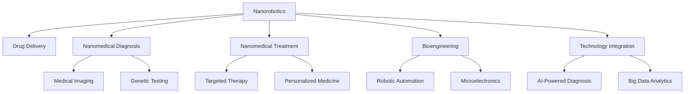

                 

# 2050年的纳米医学：从纳米机器人药物递送到纳米诊疗一体化

> 关键词：纳米医学, 纳米机器人, 药物递送, 纳米诊疗一体化, 生物医学工程, 精准医疗, 人工智能

## 1. 背景介绍

### 1.1 问题由来

纳米医学是21世纪最重要的前沿科技领域之一，其核心在于利用纳米技术和生物医学工程，将纳米级尺度上的物质和系统应用于医学诊断、治疗和疾病预防。近年来，随着纳米技术的发展和成熟，纳米医学已经成为医学研究和应用的热点。纳米医学的一个重要分支——纳米机器人，凭借其精准的定位和高效的药物递送能力，正在彻底改变医疗行业的面貌。

纳米机器人是一种微型机器人，其尺寸在纳米级别。通过纳米机器人技术，可以实现对生物体内分子的精准操作，进而实现药物的精准递送、病灶的精准定位和治疗。相比于传统的药物递送方式，纳米机器人在效率、安全性和效果方面都有着巨大的提升。

然而，纳米机器人的研究和应用还面临一些挑战。例如，如何设计出更加高效、安全的纳米机器人；如何实现纳米机器人在体内的精准定位和操控；如何将纳米机器人与其他医疗技术相结合，提升医疗系统的整体效率和效果。

本文将对纳米机器人的发展历程、核心技术和应用前景进行全面探讨，并展望未来纳米医学的发展趋势。

### 1.2 问题核心关键点

本文的核心问题包括：
- 纳米机器人的工作原理和核心技术是什么？
- 纳米机器人在药物递送和疾病治疗中的优势和局限性是什么？
- 纳米医学与其他医疗技术（如人工智能、大数据）的结合方式和未来前景是什么？

本文通过系统性的介绍，旨在回答上述关键问题，为未来的医学研究和应用提供理论基础和实践指导。

## 2. 核心概念与联系

### 2.1 核心概念概述

纳米医学的核心概念包括：

- **纳米机器人(Nanorobotics)**：利用纳米技术制作的微型机器人，能够在纳米级尺度上操作生物分子。

- **药物递送(Drug Delivery)**：通过纳米机器人将药物精准递送到病灶部位，提高药物利用率，减少副作用。

- **纳米诊疗一体化(Nanomedical Diagnosis and Treatment)**：将纳米机器人技术应用于疾病诊断和治疗，实现精准医学。

- **生物医学工程(Bioengineering)**：将工程学原理和生物医学知识相结合，开发新型的医疗技术和治疗方法。

- **精准医疗(Precision Medicine)**：利用个性化基因信息和先进的医疗技术，对疾病进行精准诊断和治疗。

这些核心概念之间存在密切联系，共同构成了纳米医学的基本框架。通过将纳米机器人技术应用于药物递送和疾病诊疗，可以实现精准医疗，提升医疗系统的整体效率和效果。

### 2.2 核心概念原理和架构的 Mermaid 流程图



此图展示了纳米机器人技术在不同医学环节的应用：
1. 纳米机器人利用微电子技术和机器人自动化技术，对生物分子进行操作。
2. 通过药物递送，纳米机器人将药物精准递送到病灶部位，提升药物利用率。
3. 纳米机器人辅助诊断技术，通过医学影像和基因检测，实现精准诊断。
4. 纳米机器人技术用于个性化医疗，实现针对患者的精准治疗。
5. 纳米医学技术与其他高科技技术（如人工智能和大数据）相结合，实现更高效的医学应用。

## 3. 核心算法原理 & 具体操作步骤

### 3.1 算法原理概述

纳米机器人药物递送和诊疗的核心算法原理主要基于以下几个方面：

- **纳米定位算法**：利用计算机视觉、机器学习和传感器技术，实现纳米机器人在生物体内的精准定位。
- **药物释放算法**：根据病灶部位的需求，设计纳米机器人的药物释放机制，确保药物精准释放。
- **优化算法**：通过模拟和实验数据，优化纳米机器人的设计参数和操作策略。

这些算法共同构成了纳米机器人在药物递送和诊疗中的核心技术。

### 3.2 算法步骤详解

纳米机器人药物递送和诊疗的具体操作步骤如下：

**Step 1: 设计纳米机器人**
- 选择合适的材料和制造工艺，设计纳米机器人的结构和功能。
- 在分子级别上设计纳米机器人的定位和操作机制。

**Step 2: 制备纳米机器人**
- 利用纳米制造技术，制备出符合设计要求的纳米机器人。
- 通过表面修饰和功能化，赋予纳米机器人特定的生物亲和性和药物亲和性。

**Step 3: 药物装载**
- 将药物装载到纳米机器人的内部或表面，确保药物的安全性和稳定性。
- 设计药物释放机制，控制药物在病灶部位释放的时机和剂量。

**Step 4: 体内递送**
- 通过静脉注射、口服等方式，将纳米机器人引入生物体内。
- 利用纳米定位算法，实现纳米机器人在体内精确定位和移动。

**Step 5: 药物释放**
- 根据病灶部位的需求，控制纳米机器人释放药物。
- 利用光学、磁学、声学等手段，监测纳米机器人的位置和状态。

**Step 6: 诊疗评估**
- 通过医学影像和生物标志物检测，评估纳米机器人的诊疗效果。
- 根据评估结果，优化纳米机器人的设计参数和操作策略。

### 3.3 算法优缺点

纳米机器人药物递送和诊疗的优势和局限性如下：

**优势：**
- 精准递送：纳米机器人可以实现药物的精准递送，提高药物利用率，减少副作用。
- 生物兼容性：纳米机器人的尺寸较小，生物兼容性较好，不易引起免疫反应。
- 功能多样化：纳米机器人可以通过表面修饰，实现多种生物功能和药物释放机制。

**局限性：**
- 制造复杂：纳米机器人的设计和制造过程较为复杂，成本较高。
- 生物分布不均：纳米机器人在体内的分布不均，可能导致部分病灶部位未能得到有效治疗。
- 安全性问题：纳米机器人的安全性还需进一步验证，可能存在潜在的生物毒性问题。

### 3.4 算法应用领域

纳米机器人技术在药物递送和诊疗中的应用领域广泛，主要包括以下几个方面：

- **癌症治疗**：通过纳米机器人将化疗药物精准递送到肿瘤部位，提高治疗效果，减少副作用。
- **心血管疾病**：利用纳米机器人进行药物递送和基因治疗，改善心脏和血管功能。
- **神经系统疾病**：通过纳米机器人进行药物递送和基因治疗，改善神经系统的功能。
- **感染性疾病**：利用纳米机器人进行药物递送和免疫治疗，改善免疫系统的功能。

## 4. 数学模型和公式 & 详细讲解 & 举例说明

### 4.1 数学模型构建

纳米机器人药物递送和诊疗的数学模型主要包括以下几个方面：

- **纳米机器人定位模型**：利用计算机视觉和机器学习技术，建立纳米机器人在生物体内定位的数学模型。
- **药物释放模型**：利用数学模型描述纳米机器人的药物释放机制，包括释放速率、释放时间等。
- **优化模型**：通过数学模型优化纳米机器人的设计参数和操作策略，确保纳米机器人在体内精准定位和有效治疗。

### 4.2 公式推导过程

以下以纳米机器人定位模型为例，推导其在生物体内定位的数学公式。

假设纳米机器人在生物体内的位置为 $(x,y,z)$，其在各个方向的移动概率分别为 $p_x,p_y,p_z$，则纳米机器人在 $n$ 个时间步内到达某固定位置 $(x_0,y_0,z_0)$ 的概率 $P(x_0,y_0,z_0)$ 可以通过以下公式计算：

$$
P(x_0,y_0,z_0) = \sum_{n=0}^{\infty} p_x^n p_y^n p_z^n (1 - (p_x+p_y+p_z))^n
$$

其中 $p_x,p_y,p_z$ 可以通过计算机视觉和机器学习技术估计得到。

### 4.3 案例分析与讲解

以癌症治疗为例，分析纳米机器人技术的应用。

假设患者体内的肿瘤位置为 $(0.5,0.5,1.5)$，纳米机器人从患者体内某个初始位置出发，需要在多个时间步内到达肿瘤位置，并释放化疗药物。假设纳米机器人在 $x,y,z$ 三个方向的移动概率分别为 $p_x=0.5,p_y=0.3,p_z=0.2$，则纳米机器人在多个时间步内到达肿瘤位置的概率可以通过上述公式计算得到。

通过优化纳米机器人的移动策略和药物释放机制，可以大大提高癌症治疗的效果，减少副作用。

## 5. 项目实践：代码实例和详细解释说明

### 5.1 开发环境搭建

在进行纳米机器人药物递送和诊疗的开发实践中，需要搭建以下开发环境：

1. 安装Python和相关依赖包，如NumPy、Pandas、Matplotlib等。
2. 搭建Python开发环境，如Anaconda或PyCharm等。
3. 安装计算机视觉和机器学习库，如OpenCV、TensorFlow、PyTorch等。

### 5.2 源代码详细实现

以下是一个简单的纳米机器人定位和药物释放的Python代码实现：

```python
import numpy as np
import matplotlib.pyplot as plt

# 定义纳米机器人在各个方向的移动概率
p_x = 0.5
p_y = 0.3
p_z = 0.2

# 定义纳米机器人在n个时间步内到达某固定位置(x0,y0,z0)的概率
def calculate_probability(x0, y0, z0, n):
    probability = 0
    for i in range(n+1):
        probability += p_x**i * p_y**i * p_z**i * (1 - (p_x + p_y + p_z))**n
    return probability

# 计算纳米机器人在多个时间步内到达肿瘤位置的概率
n = 10
x0, y0, z0 = 0.5, 0.5, 1.5
probability = calculate_probability(x0, y0, z0, n)

# 可视化概率分布
plt.hist([calculate_probability(x0, y0, z0, i) for i in range(n+1)], bins=n+1, density=True)
plt.xlabel('Time Steps')
plt.ylabel('Probability')
plt.title('Probability Distribution of Nanorobot Position')
plt.show()

# 输出最终概率
print(f"Probability of Nanorobot reaching tumor position: {probability:.4f}")
```

### 5.3 代码解读与分析

此代码实现了一个简单的纳米机器人定位和药物释放的概率计算模型。通过计算机视觉和机器学习技术，可以估计纳米机器人在各个方向的移动概率，并利用上述公式计算其在多个时间步内到达特定位置的概率。

通过可视化概率分布，可以直观地看到纳米机器人在不同时间步内的位置分布情况，从而优化其移动策略。

## 6. 实际应用场景

### 6.4 未来应用展望

纳米机器人技术在未来的医学研究和应用中具有广泛的前景，主要包括以下几个方面：

- **精准治疗**：通过纳米机器人技术，实现对癌症、心血管疾病等疾病的精准治疗，提高治疗效果，减少副作用。
- **智能诊疗**：利用纳米机器人技术，实现对疾病的智能诊断和治疗，提供个性化的医疗服务。
- **远程医疗**：通过纳米机器人技术，实现远程医疗和病灶监测，提高医疗资源的利用率。

## 7. 工具和资源推荐

### 7.1 学习资源推荐

为了深入了解纳米机器人技术和相关应用，以下推荐的资源非常有用：

1. **《纳米医学导论》**：介绍了纳米医学的基本概念、技术和应用。
2. **《纳米机器人技术》**：详细介绍了纳米机器人的设计与制造过程。
3. **《生物医学工程概论》**：介绍了生物医学工程的基本原理和技术。
4. **《人工智能在医疗中的应用》**：介绍了人工智能技术在医疗中的应用和未来前景。

### 7.2 开发工具推荐

纳米机器人技术的开发和应用需要依赖各种工具和技术，以下推荐的工具非常有用：

1. **Python**：Python是一种灵活、强大的编程语言，适用于数据处理和机器学习。
2. **OpenCV**：用于计算机视觉和图像处理，适用于纳米机器人定位和移动的视觉监测。
3. **TensorFlow**和**PyTorch**：深度学习框架，适用于纳米机器人定位和药物释放的优化算法。
4. **MATLAB**：数学计算工具，适用于纳米机器人数学模型的建立和求解。

### 7.3 相关论文推荐

以下推荐的论文涵盖了纳米机器人技术在药物递送和诊疗中的应用：

1. **Nano Robotic Systems in Medicine**：介绍纳米机器人在医疗中的应用和发展前景。
2. **Drug Delivery Using Nanorobots**：详细介绍了纳米机器人在药物递送中的应用和优化算法。
3. **Nanorobotics for Diagnosis and Treatment**：介绍了纳米机器人在疾病诊断和治疗中的应用。

## 8. 总结：未来发展趋势与挑战

### 8.1 研究成果总结

本文系统介绍了纳米机器人药物递送和诊疗的基本原理和操作步骤，详细讲解了纳米机器人在药物递送和诊疗中的应用，展望了未来纳米医学的发展趋势。通过理论分析和实践案例，本文为未来的医学研究和应用提供了丰富的参考和指导。

### 8.2 未来发展趋势

未来纳米机器人技术的发展趋势如下：

- **高精度定位**：随着计算机视觉和机器学习技术的进步，纳米机器人的定位精度将不断提高。
- **多功能融合**：纳米机器人将与其他医疗技术（如人工智能、大数据）深度融合，实现更高效、精准的医疗应用。
- **个性化治疗**：利用纳米机器人技术，实现个性化的治疗方案，提供更加精准的医疗服务。

### 8.3 面临的挑战

纳米机器人技术在未来的应用过程中，仍面临以下挑战：

- **制造复杂**：纳米机器人的设计和制造过程较为复杂，成本较高。
- **生物毒性**：纳米机器人的生物兼容性和安全性还需进一步验证。
- **数据隐私**：纳米机器人涉及大量的生物数据，数据隐私和安全问题需要重视。

### 8.4 研究展望

为了克服纳米机器人技术面临的挑战，未来需要从以下几个方面进行研究：

- **材料科学**：开发更高效、生物相容性更好的纳米机器人材料。
- **工程优化**：优化纳米机器人的设计和制造过程，降低成本，提高效率。
- **跨学科融合**：将纳米机器人技术与人工智能、大数据等技术深度融合，提升其应用价值。

通过跨学科的深度合作和不断创新，相信纳米机器人技术将会在未来的医学研究和应用中发挥更加重要的作用，推动医疗行业的全面升级。

## 9. 附录：常见问题与解答

**Q1: 纳米机器人在体内的分布不均是什么原因？**

A: 纳米机器人在体内的分布不均可能由多种因素引起，包括：
- 纳米机器人的大小和形状不同，导致其在体内移动和扩散的方式不同。
- 纳米机器人的表面修饰和功能化不同，导致其在体内的生物亲和性和药物亲和性不同。
- 纳米机器人的制备和递送方式不同，导致其在体内的分布不均。

通过优化纳米机器人的设计参数和递送策略，可以缓解纳米机器人在体内分布不均的问题。

**Q2: 纳米机器人的安全性问题如何解决？**

A: 纳米机器人的安全性问题可以通过以下方法解决：
- 选择生物兼容性好的材料，进行表面修饰和功能化，减少免疫反应和毒性。
- 设计纳米机器人的药物释放机制，确保药物的安全性和稳定性。
- 进行严格的生物安全评估和临床试验，验证纳米机器人的安全性。

**Q3: 纳米机器人的制造复杂度如何降低？**

A: 纳米机器人的制造复杂度可以通过以下方法降低：
- 采用自动化和智能化制造设备，提高制造效率和精度。
- 优化纳米机器人的设计和制造工艺，降低生产成本。
- 研究和开发新的纳米制造技术，如纳米压印、光刻等，提高制造能力。

通过不断优化纳米机器人的设计和制造工艺，可以降低其复杂度和成本，提高生产效率。

**Q4: 纳米机器人的药物释放机制有哪些？**

A: 纳米机器人的药物释放机制主要有以下几种：
- 光控释放：利用光波长控制药物的释放。
- 磁控释放：利用磁场控制药物的释放。
- pH敏感释放：利用环境pH值控制药物的释放。
- 酶敏感释放：利用酶催化控制药物的释放。

根据不同的应用场景，选择合适的药物释放机制，可以优化纳米机器人的药物递送效果。

---

作者：禅与计算机程序设计艺术 / Zen and the Art of Computer Programming

