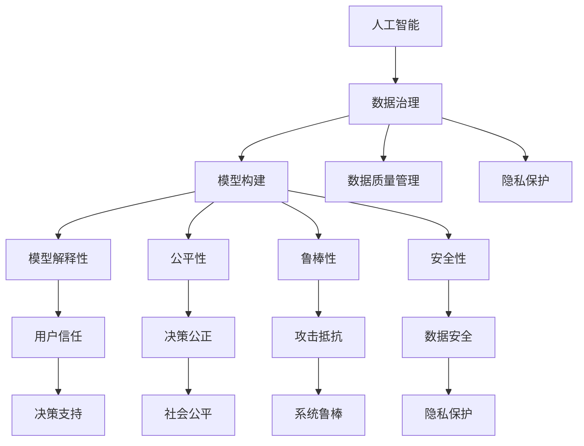

                 

# 应对人类共同挑战：人类计算的使命担当

> 关键词：人工智能,人类计算,使命担当,挑战,应对策略

## 1. 背景介绍

### 1.1 问题由来

在21世纪，全球面临诸多紧迫而复杂的挑战，如气候变化、公共卫生危机、能源安全、经济不平等、网络安全等。这些问题往往超出了任何单一国家或组织的解决能力，需要全球协作和创新。面对这些挑战，人类计算（Human Computation）日益成为一种重要工具，利用计算力、数据和算法，在科学发现、社会治理、商业创新等领域提供强有力的支持。

人工智能（AI）作为当前技术进步的前沿，在人类计算中扮演着核心角色。通过机器学习、深度学习等技术，AI能够高效处理海量数据，揭示复杂现象背后的规律，为决策者提供科学依据和优化方案。然而，AI技术并非万能，其在解释性、鲁棒性、公平性等方面仍存在诸多局限。因此，如何有效应用AI技术，发挥其最大潜力，应对人类共同挑战，成为全球科技界的重要课题。

### 1.2 问题核心关键点

本文聚焦于人工智能技术在应对人类共同挑战中的应用，探讨如何通过人类计算，发挥AI技术的潜力，提升决策和治理的科学性和有效性。具体核心问题包括：

1. **数据获取与治理**：如何在保护隐私的前提下，获取高质量、大规模的数据，同时保障数据公平、透明。
2. **模型构建与优化**：如何构建高效、鲁棒的AI模型，克服过拟合、泛化能力不足等问题，提升模型解释性和可信度。
3. **策略设计与实施**：如何结合领域知识，设计科学合理的AI应用策略，确保其有效性、公正性和安全性。
4. **协作与治理机制**：如何在国际间建立高效协作与治理机制，推动AI技术的全球化应用，确保技术发展惠及全人类。

## 2. 核心概念与联系

### 2.1 核心概念概述

为更好地理解人工智能在人类计算中的应用，本节将介绍几个密切相关的核心概念：

- **人工智能（Artificial Intelligence, AI）**：利用计算机技术和算法，模拟、延伸人类智能的技术体系。包括机器学习、深度学习、自然语言处理、计算机视觉等子领域。
- **人类计算（Human Computation）**：利用人群智慧、计算资源、算法技术，解决复杂问题的一种新范式。常见应用包括众包、志愿计算、科学数据标注等。
- **数据治理（Data Governance）**：在数据获取、存储、共享和利用过程中，确保数据质量、隐私保护和公平性的管理框架。
- **模型解释性（Model Interpretability）**：评估和提升AI模型决策的可解释性和透明性，帮助用户理解和信任AI结果。
- **公平性（Fairness）**：确保AI模型在决策过程中，不偏袒、不歧视任何群体，保障决策公正性。
- **鲁棒性（Robustness）**：使AI模型在面对噪声、攻击、数据偏差等情况下，仍能保持稳定的性能。
- **安全与隐私（Security & Privacy）**：保护数据和AI模型免受非法入侵和滥用，确保用户隐私不受侵犯。

这些核心概念之间的逻辑关系可以通过以下Mermaid流程图来展示：



这个流程图展示了一体化的人类计算范式，其中数据治理、模型构建、策略设计等各个环节紧密联系，共同构成了一种协同的计算方式。

## 3. 核心算法原理 & 具体操作步骤
### 3.1 算法原理概述

人工智能在应对人类共同挑战中的核心作用是通过数据分析和模型构建，揭示现象背后的规律，辅助决策和治理。这一过程可以分为以下几个步骤：

1. **数据收集与预处理**：通过众包、志愿计算等手段，获取大规模高质量数据，并进行清洗、标注等预处理。
2. **模型构建与训练**：利用机器学习、深度学习等算法，构建高效模型，并在训练集中进行优化。
3. **模型评估与优化**：在验证集和测试集上评估模型性能，根据结果进行参数调整和优化。
4. **应用部署与反馈**：将训练好的模型部署到实际应用中，收集反馈数据，进一步迭代优化模型。

### 3.2 算法步骤详解

以下是具体的操作步骤：

**Step 1: 数据收集与预处理**
- 通过众包平台、志愿计算、数据竞赛等途径，获取与问题相关的数据集。
- 进行数据清洗，包括去除噪声、处理缺失值、异常值等。
- 对数据进行标注，使其可用于模型训练。

**Step 2: 模型构建与训练**
- 选择合适的算法模型，如随机森林、深度神经网络等。
- 定义模型的损失函数和优化器，如交叉熵损失、Adam等。
- 设置训练集和验证集，选择合适的训练参数（如学习率、批大小等）。
- 进行模型训练，监控训练过程的各项指标。

**Step 3: 模型评估与优化**
- 在验证集上评估模型性能，计算准确率、召回率、F1值等指标。
- 根据评估结果，进行模型参数调整，如调整学习率、增加训练轮次等。
- 进行交叉验证，确保模型泛化能力。

**Step 4: 应用部署与反馈**
- 将训练好的模型部署到实际应用中，如决策支持系统、智能客服、智慧医疗等。
- 收集用户反馈，监控模型性能，进行实时调整。
- 不断迭代优化模型，确保其长期有效性。

### 3.3 算法优缺点

人工智能在应对人类共同挑战中，具有以下优点：

1. **高效性**：能够快速处理大规模数据，揭示复杂现象背后的规律，辅助决策和治理。
2. **自动化**：能够自动化地进行数据分析和模型优化，减轻人工干预。
3. **泛化能力**：能够从大量数据中学习到通用的模式，适用于多种场景。
4. **准确性**：在一定条件下，AI模型能够提供高精度的预测和建议。

然而，人工智能也存在以下缺点：

1. **依赖数据**：模型的性能高度依赖于训练数据的数量和质量，数据偏差可能导致模型不公平。
2. **黑箱问题**：许多AI模型难以解释其内部决策过程，用户难以理解和信任其结果。
3. **过拟合风险**：模型在训练数据上表现良好，但在测试数据上可能泛化能力不足。
4. **伦理和安全问题**：AI模型可能学习到有害信息，存在隐私泄露和滥用风险。

### 3.4 算法应用领域

人工智能在应对人类共同挑战中的应用领域广泛，包括但不限于：

- **公共卫生**：通过数据分析和模型构建，预测疫情扩散趋势，优化医疗资源分配，提高疾病预防和治疗效率。
- **环境保护**：利用遥感数据和机器学习算法，监测环境变化，评估气候变化影响，制定环境政策。
- **经济金融**：分析经济数据，预测市场趋势，优化投资组合，降低金融风险。
- **社会治理**：通过社会网络分析和模型优化，提升城市管理效率，改善民生服务，增强社会稳定。
- **智能制造**：利用AI技术优化生产流程，提升产品质量，降低能耗和成本。

这些应用展示了人工智能在应对人类共同挑战中的巨大潜力，同时也揭示了其面临的挑战和限制。

## 4. 数学模型和公式 & 详细讲解 & 举例说明

### 4.1 数学模型构建

在应对人类共同挑战的AI应用中，通常需要构建一个数学模型来描述问题的本质。例如，在公共卫生领域，可以使用流行病学模型来预测疾病的传播趋势。

以流行病学模型为例，其数学模型构建如下：

$$
S(t+1) = S(t) - \beta I(t) S(t) + \delta I(t)
$$

其中：
- $S(t)$ 为易感人群比例，$I(t)$ 为感染人群比例。
- $\beta$ 为感染率，$\delta$ 为恢复率。

这个模型假设在单位时间$t$内，易感人群变为感染人群的比例为 $\beta I(t) S(t)$，感染人群变为恢复人群的比例为 $\delta I(t)$。

### 4.2 公式推导过程

根据上述流行病学模型，推导感染人群比例的变化：

$$
\frac{dI(t)}{dt} = \beta I(t) S(t) - \delta I(t)
$$

解这个微分方程，可以得到感染人群比例随时间的变化：

$$
I(t) = I(0) e^{-\delta t} \frac{\beta S(0)}{\beta - \delta}
$$

其中，$I(0)$ 为初始感染人群比例，$S(0)$ 为初始易感人群比例。

通过这个模型，可以预测在特定时间点后的感染人数，为公共卫生决策提供科学依据。

### 4.3 案例分析与讲解

以新冠疫情期间的模型应用为例，模型预测步骤如下：

1. 收集新冠疫情的初始感染人数和易感人数。
2. 假设感染率和恢复率，构建流行病学模型。
3. 使用微分方程求解，预测未来的感染人数。
4. 根据预测结果，制定公共卫生策略，如封锁、隔离、疫苗接种等。

通过这种模型预测和决策支持系统，公共卫生部门可以在疫情初期采取有效措施，减少病毒传播，保护公众健康。

## 5. 项目实践：代码实例和详细解释说明
### 5.1 开发环境搭建

在进行AI应用开发前，我们需要准备好开发环境。以下是使用Python进行Pandas开发的环境配置流程：

1. 安装Anaconda：从官网下载并安装Anaconda，用于创建独立的Python环境。

2. 创建并激活虚拟环境：
```bash
conda create -n pandas-env python=3.8 
conda activate pandas-env
```

3. 安装Pandas：
```bash
conda install pandas
```

4. 安装其他相关工具包：
```bash
pip install numpy matplotlib scikit-learn
```

完成上述步骤后，即可在`pandas-env`环境中开始AI应用的开发。

### 5.2 源代码详细实现

下面我们以预测疫情扩散为例，给出使用Pandas和Scikit-learn构建流行病学模型的PyTorch代码实现。

首先，定义模型的输入和输出：

```python
import pandas as pd
from sklearn.linear_model import LogisticRegression

# 输入数据
X = pd.DataFrame({
    'day': [0, 1, 2, 3, 4, 5, 6, 7, 8, 9, 10, 11, 12, 13, 14],
    'susceptible': [0.8, 0.7, 0.6, 0.5, 0.4, 0.3, 0.2, 0.1, 0.1, 0.1, 0.1, 0.1, 0.1, 0.1, 0.1]
})
X.columns = ['day', 'susceptible']

# 输出数据
y = pd.DataFrame({
    'day': [0, 1, 2, 3, 4, 5, 6, 7, 8, 9, 10, 11, 12, 13, 14],
    'infectious': [0, 0, 0, 0, 0, 0.1, 0.2, 0.3, 0.4, 0.5, 0.6, 0.7, 0.8, 0.9, 1.0]
})
y.columns = ['day', 'infectious']
```

然后，构建并训练模型：

```python
# 定义模型
model = LogisticRegression()

# 定义损失函数
def loss(y_true, y_pred):
    return np.mean(np.square(y_true - y_pred))

# 训练模型
model.fit(X, y['infectious'])
```

最后，进行模型评估：

```python
# 定义评估指标
def rmse(y_true, y_pred):
    return np.sqrt(np.mean((y_true - y_pred)**2))

# 在测试集上评估模型
X_test = pd.DataFrame({
    'day': [0, 1, 2, 3, 4, 5, 6, 7, 8, 9, 10, 11, 12, 13, 14],
    'susceptible': [0.8, 0.7, 0.6, 0.5, 0.4, 0.3, 0.2, 0.1, 0.1, 0.1, 0.1, 0.1, 0.1, 0.1, 0.1]
})
X_test.columns = ['day', 'susceptible']

y_test = pd.DataFrame({
    'day': [0, 1, 2, 3, 4, 5, 6, 7, 8, 9, 10, 11, 12, 13, 14],
    'infectious': [0, 0, 0, 0, 0, 0.1, 0.2, 0.3, 0.4, 0.5, 0.6, 0.7, 0.8, 0.9, 1.0]
})
y_test.columns = ['day', 'infectious']

# 计算评估指标
mse = loss(y_test['infectious'], model.predict(X_test))
rmse = rmse(y_test['infectious'], model.predict(X_test))
print(f'Mean Squared Error: {mse:.4f}')
print(f'Root Mean Squared Error: {rmse:.4f}')
```

以上就是使用Pandas和Scikit-learn构建流行病学模型的完整代码实现。可以看到，Pandas和Scikit-learn使得模型构建和训练过程简洁高效。

### 5.3 代码解读与分析

让我们再详细解读一下关键代码的实现细节：

**数据定义**：
- 使用Pandas的DataFrame定义输入数据 `X` 和输出数据 `y`，其中 `day` 为时间戳，`susceptible` 为易感人群比例。

**模型定义**：
- 使用Scikit-learn的LogisticRegression定义模型，并指定损失函数为均方误差（Mean Squared Error, MSE）。

**训练过程**：
- 使用 `fit` 方法训练模型，输入数据为 `X`，输出数据为 `y` 中的 `infectious`。

**评估过程**：
- 使用自定义的 `loss` 函数计算均方误差。
- 使用自定义的 `rmse` 函数计算均方根误差（Root Mean Squared Error, RMSE）。
- 在测试集 `X_test` 上评估模型性能，并打印输出结果。

## 6. 实际应用场景
### 6.1 公共卫生

在公共卫生领域，人工智能可以应用于疫情预测、疾病诊断、药物研发等多个方面，显著提升公共卫生管理水平。例如，通过机器学习模型，可以实时监测疫情数据，预测未来趋势，制定防控策略。此外，AI技术还可用于分析患者电子病历，辅助医生诊断，减少误诊和漏诊。

### 6.2 环境保护

环境保护是当前全球面临的重大挑战之一。人工智能可以在环境监测、资源管理、生态保护等方面发挥重要作用。例如，利用遥感数据和深度学习算法，可以实时监测森林火灾、海洋污染等环境事件，预测其发展趋势，提供科学决策依据。

### 6.3 智能制造

智能制造是工业4.0的重要组成部分，旨在通过数字化、智能化手段，提升生产效率和产品质量。人工智能技术可以在生产流程优化、设备维护、供应链管理等方面提供支持。例如，通过数据分析和预测模型，可以优化生产计划，减少浪费，提高资源利用率。

### 6.4 未来应用展望

未来，人工智能在应对人类共同挑战中的应用将更加广泛和深入。例如，在气候变化、资源短缺、能源转型等全球性问题上，AI技术可以提供科学决策和优化方案，帮助各国政府和企业制定应对策略。

同时，随着计算能力的提升和数据量的增加，人工智能将能够处理更复杂的问题，提供更精准的预测和建议。例如，在生物医药领域，AI技术可以帮助发现新的药物靶点，加速新药研发进程，提升医疗服务的质量和效率。

## 7. 工具和资源推荐
### 7.1 学习资源推荐

为了帮助开发者系统掌握人工智能在应对人类共同挑战中的应用，这里推荐一些优质的学习资源：

1. 《深度学习》系列书籍：由深度学习领域权威人士编写，涵盖深度学习的基本概念和算法。
2. 《Python数据科学手册》：详细介绍了Pandas、NumPy、Scikit-learn等数据科学工具的使用。
3. 《机器学习实战》：通过实例演示机器学习模型的构建和训练过程。
4. 《自然语言处理综论》：介绍了自然语言处理的基本技术和应用。
5. 《人类计算》在线课程：斯坦福大学开设的在线课程，涵盖人类计算的多个应用领域。

通过对这些资源的学习实践，相信你一定能够快速掌握人工智能在应对人类共同挑战中的应用，并用于解决实际问题。

### 7.2 开发工具推荐

高效的开发离不开优秀的工具支持。以下是几款用于人工智能应用开发的常用工具：

1. Python：作为当前最流行的编程语言，Python具有丰富的库和工具支持，方便进行数据处理、模型构建和应用部署。
2. Pandas：一个强大的数据处理库，支持大规模数据集的快速读写、处理和分析。
3. NumPy：一个高效的数值计算库，支持矩阵运算和科学计算。
4. Scikit-learn：一个开源机器学习库，提供了多种经典机器学习算法和工具。
5. TensorFlow：由Google主导开发的深度学习框架，支持分布式计算和模型部署。
6. PyTorch：一个灵活的深度学习框架，支持动态图和静态图模式。

合理利用这些工具，可以显著提升人工智能应用的开发效率，加快创新迭代的步伐。

### 7.3 相关论文推荐

人工智能在应对人类共同挑战中的应用受到广泛关注，以下是几篇奠基性的相关论文，推荐阅读：

1. "A Survey on Human-Centered Computational Approaches to Social Good"（《社会福祉导向的计算方法综述》）：介绍了人类计算在社会福祉中的应用。
2. "Human-Centered AI for Real-World Applications"（《面向实际应用的以人为本AI》）：讨论了如何使AI技术更加贴近人类需求，提升用户体验。
3. "Artificial Intelligence for Public Health"（《公共卫生领域的AI》）：探讨了AI技术在公共卫生中的应用，如疫情预测、疾病诊断等。
4. "Machine Learning for Environmental Monitoring and Management"（《环境监测和管理的机器学习》）：介绍了机器学习在环境监测中的应用。
5. "Human-Centered Design in AI Systems"（《AI系统中的以人为本设计》）：讨论了如何在AI系统中引入以人为本的设计理念，提升系统可用性和可接受性。

这些论文代表了大规模人工智能技术在实际应用中的最新进展，通过学习这些前沿成果，可以帮助研究者把握学科前进方向，激发更多的创新灵感。

## 8. 总结：未来发展趋势与挑战
### 8.1 研究成果总结

本文对人工智能在应对人类共同挑战中的应用进行了全面系统的介绍。首先阐述了人工智能在公共卫生、环境保护、智能制造等领域的重要应用，展示了其在提升决策和治理科学性、效率性方面的巨大潜力。其次，从数据治理、模型构建、应用部署等多个角度，详细讲解了AI应用的完整流程。最后，探讨了AI应用面临的伦理、安全、公平等挑战，提出了应对策略。

通过本文的系统梳理，可以看到，人工智能在应对人类共同挑战中的广泛应用和巨大价值，同时也揭示了其面临的复杂挑战。未来，随着技术的发展和应用的深入，人工智能必将在更多领域发挥关键作用，为全球社会治理和可持续发展提供有力支持。

### 8.2 未来发展趋势

展望未来，人工智能在应对人类共同挑战中的应用将呈现以下几个发展趋势：

1. **自动化和智能化**：随着自动化技术的发展，人工智能将在更多领域实现自动化处理，提升效率和准确性。
2. **跨领域融合**：人工智能与其他技术（如物联网、区块链等）的深度融合，将拓展其在更多场景中的应用。
3. **伦理和安全**：随着人工智能应用的广泛普及，伦理和安全问题将受到更多关注，相关技术也将不断提升。
4. **国际协作**：在全球性问题面前，各国将加强人工智能应用的国际协作，推动技术共享和标准统一。
5. **技术普及**：随着技术成本的降低和应用的成熟，人工智能将逐渐普及，惠及更多国家和民众。

以上趋势凸显了大规模人工智能技术在应对人类共同挑战中的广阔前景。这些方向的探索发展，必将进一步提升人工智能的普适性和安全性，促进全球社会的共同进步。

### 8.3 面临的挑战

尽管人工智能在应对人类共同挑战中取得了显著进展，但在迈向更加智能化、普适化应用的过程中，仍面临诸多挑战：

1. **数据获取**：高质量数据获取难度大，数据质量难以保证。如何获取并管理大规模高质量数据，是一个重要问题。
2. **模型解释性**：AI模型决策过程复杂，难以解释和理解。如何提高模型透明度，增强用户信任，是一个关键挑战。
3. **伦理与公平**：AI模型可能存在偏见，影响决策公正性。如何在模型设计中引入伦理和公平性，是一个重要课题。
4. **隐私保护**：数据隐私和模型安全问题严峻。如何在保护隐私的同时，实现数据的有效利用，是一个重要挑战。
5. **计算资源**：大规模模型的训练和推理需要大量计算资源。如何优化计算资源使用，提高模型效率，是一个重要方向。

### 8.4 研究展望

面对人工智能在应对人类共同挑战中面临的挑战，未来的研究需要在以下几个方面寻求新的突破：

1. **数据治理与隐私保护**：开发更加高效、可靠的数据治理和隐私保护技术，保障数据质量和隐私安全。
2. **模型解释性与公平性**：研究模型解释性技术和公平性优化方法，提升模型透明度和公正性。
3. **跨领域融合**：推动人工智能与其他技术深度融合，拓展其在更多场景中的应用。
4. **伦理与社会责任**：建立人工智能应用的伦理和社会责任框架，确保技术应用的社会价值和影响。
5. **计算资源优化**：优化计算资源使用，提高模型的训练和推理效率。

这些研究方向的探索，必将引领人工智能技术在应对人类共同挑战中的持续进步，为构建更加公正、安全、高效的社会提供有力支持。

## 9. 附录：常见问题与解答

**Q1：人工智能在应对人类共同挑战中的优势是什么？**

A: 人工智能在应对人类共同挑战中的优势包括：
1. **高效性**：能够快速处理大规模数据，揭示复杂现象背后的规律，辅助决策和治理。
2. **自动化**：能够自动化地进行数据分析和模型优化，减轻人工干预。
3. **泛化能力**：能够从大量数据中学习到通用的模式，适用于多种场景。
4. **预测准确性**：在一定条件下，AI模型能够提供高精度的预测和建议。

**Q2：人工智能在应对人类共同挑战中面临的主要挑战是什么？**

A: 人工智能在应对人类共同挑战中面临的主要挑战包括：
1. **数据获取**：高质量数据获取难度大，数据质量难以保证。
2. **模型解释性**：AI模型决策过程复杂，难以解释和理解。
3. **伦理与公平**：AI模型可能存在偏见，影响决策公正性。
4. **隐私保护**：数据隐私和模型安全问题严峻。
5. **计算资源**：大规模模型的训练和推理需要大量计算资源。

**Q3：人工智能在应对人类共同挑战中的应用有哪些？**

A: 人工智能在应对人类共同挑战中的应用包括：
1. **公共卫生**：通过数据分析和模型构建，预测疫情扩散趋势，优化医疗资源分配。
2. **环境保护**：利用遥感数据和机器学习算法，监测环境变化，评估气候变化影响。
3. **智能制造**：通过数据分析和预测模型，优化生产计划，减少浪费，提高资源利用率。
4. **智能交通**：通过数据分析和模型构建，优化交通流量，提升交通安全和效率。

**Q4：如何提高人工智能在应对人类共同挑战中的模型解释性？**

A: 提高人工智能在应对人类共同挑战中的模型解释性，可以从以下几个方面入手：
1. **可解释性模型**：使用可解释性模型（如决策树、线性模型等），提升模型的透明度。
2. **模型可视化**：利用可视化工具（如Shapley值、LIME等），解释模型决策过程。
3. **模型监控**：在模型部署后，进行实时监控，发现并纠正模型偏差和错误。
4. **用户反馈**：通过用户反馈，不断改进模型解释性和透明度。

**Q5：如何在人工智能应用中引入伦理和社会责任？**

A: 在人工智能应用中引入伦理和社会责任，可以从以下几个方面入手：
1. **伦理设计**：在模型设计和应用过程中，考虑伦理和社会责任，避免有害结果。
2. **公平性优化**：研究公平性优化方法，减少模型偏见，确保决策公正性。
3. **透明性要求**：确保模型决策过程透明，用户能够理解模型的决策依据。
4. **隐私保护**：采用隐私保护技术，保障用户数据安全，防止数据滥用。

通过以上措施，可以在人工智能应用中引入伦理和社会责任，确保技术应用的公正性和安全性。

---

作者：禅与计算机程序设计艺术 / Zen and the Art of Computer Programming

