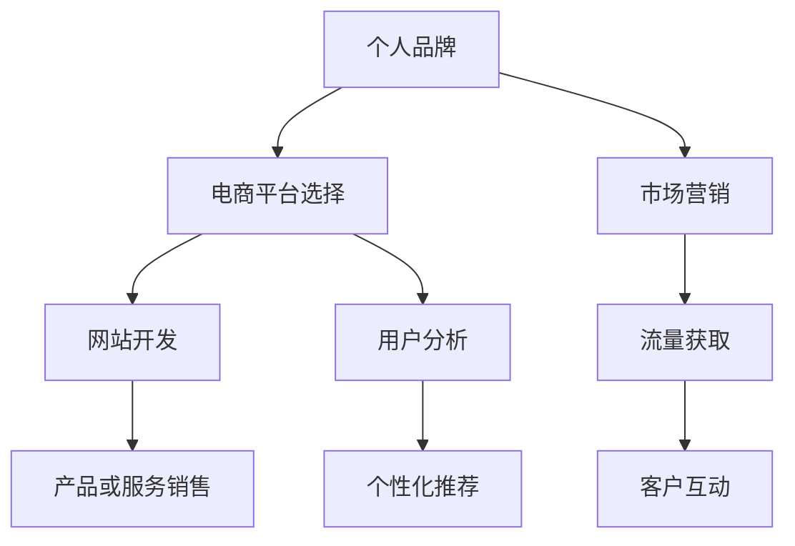

                 

# 建立个人品牌线上商城：变现你的影响力

## 1. 背景介绍

### 1.1 问题由来
在数字化时代，个人品牌成为越来越多专业人士的追求目标。通过建立个人品牌，可以扩大自己的影响力，提升市场价值，实现变现。随着电商平台的兴起，个人品牌也可以通过线上商城直接与消费者接触，销售自己的产品或服务。这不仅提供了一个新的商业机会，也是展示个人品牌价值和专业能力的绝佳方式。

### 1.2 问题核心关键点
建立个人品牌线上商城，涉及到网站开发、电商平台选择、市场营销、产品或服务销售等多个环节。关键在于如何系统化地规划和执行，以及如何有效利用互联网工具和资源，实现品牌推广和商业变现。

### 1.3 问题研究意义
个人品牌线上商城的成功运营，不仅能带来经济效益，还能提升个人在行业内的知名度和影响力。它有助于建立长久的客户关系，提升客户忠诚度，同时也能在社交媒体上增加曝光度，吸引更多关注和互动。

## 2. 核心概念与联系

### 2.1 核心概念概述

- **个人品牌**：指的是个人在行业或社会中建立的声誉和形象，包括专业知识、专业能力、个人风格等。

- **线上商城**：指通过互联网平台，利用电商技术实现产品或服务销售的商业模式。

- **平台选择**：根据个人品牌的特点和目标市场，选择合适的电商平台。

- **网站开发**：构建个人品牌专属的线上商店，实现用户交互和交易功能。

- **市场营销**：通过互联网工具和渠道，推广个人品牌和线上商城，吸引流量和用户。

- **产品或服务销售**：在平台上销售个人品牌下的产品或服务，提供高质量的客户体验。

### 2.2 核心概念原理和架构的 Mermaid 流程图



该流程图展示了个人品牌线上商城建立的主要环节，从品牌定位、平台选择、网站开发、产品销售到市场营销，每个环节都是相互关联和支持的。

## 3. 核心算法原理 & 具体操作步骤

### 3.1 算法原理概述

建立个人品牌线上商城的核心算法原理主要涉及以下几个方面：

- **平台选择算法**：通过分析目标市场、竞争对手、用户需求等因素，选择最合适的电商平台。
- **网站开发算法**：构建能够满足用户需求、易用、响应快速的网站，确保用户体验。
- **市场营销算法**：通过多渠道推广策略，最大化流量获取和用户转化。
- **产品或服务销售算法**：实现高效的订单处理、物流配送、客户服务等，提升销售效率和客户满意度。

### 3.2 算法步骤详解

#### 3.2.1 平台选择
1. **市场需求分析**：调研目标市场的用户需求、竞争对手情况、电商平台的流行度等，确定适合的电商平台类型。
2. **平台特性匹配**：分析不同平台的特点，如交易手续费、流量获取能力、用户评价系统、支付方式等，选择合适的平台。
3. **平台试用与评估**：在选定的平台上进行短期测试，评估其在推广效率、交易成本、用户反馈等方面的表现。

#### 3.2.2 网站开发
1. **用户需求分析**：了解目标用户的需求，设计合理的网站结构和功能。
2. **网站设计**：使用界面设计工具，创建符合用户审美的网站外观。
3. **网站功能实现**：开发产品展示、购物车、支付、订单管理等关键功能，确保网站功能完善。
4. **网站测试与优化**：进行网站性能测试，优化加载速度和用户体验。

#### 3.2.3 市场营销
1. **目标用户定位**：通过数据分析确定目标用户的特征，如年龄、性别、地理位置等。
2. **推广策略设计**：选择适合的推广渠道，如社交媒体、搜索引擎优化(SEO)、内容营销、邮件营销等。
3. **流量获取与转化**：通过定向广告、关键词优化、内容创作等方式，吸引流量并转化为销售。

#### 3.2.4 产品或服务销售
1. **产品管理**：维护产品的信息更新、库存管理、价格策略等。
2. **订单处理**：实现高效订单处理、配送管理、售后服务等。
3. **客户关系管理**：通过CRM系统，管理客户信息、反馈、互动等，提升客户忠诚度。

### 3.3 算法优缺点

#### 3.3.1 优点
1. **广泛性**：电商平台的广泛覆盖和使用，使得个人品牌可以在全球范围内推广。
2. **低门槛**：在线平台的开发成本相对较低，适合个人品牌初期阶段的应用。
3. **数据驱动**：借助电商平台的数据分析工具，可以更精准地了解用户需求和行为，优化推广策略。
4. **多渠道整合**：通过整合社交媒体、内容营销等渠道，增强品牌曝光度。

#### 3.3.2 缺点
1. **竞争激烈**：电商市场的竞争异常激烈，个人品牌需要具备较强的竞争力才能脱颖而出。
2. **依赖平台**：对电商平台的服务和规则依赖较大，平台的变化可能影响运营效果。
3. **用户维护难度大**：如何保持用户黏性，提高用户满意度，是运营中的重要挑战。
4. **隐私风险**：电商交易涉及大量个人数据，需要严格保护用户隐私。

### 3.4 算法应用领域

个人品牌线上商城的应用领域广泛，不仅限于个人品牌的产品或服务销售，还包括：

- **专业知识分享**：通过电商平台的图书、课程等形式，分享专业知识。
- **咨询与辅导**：提供专业咨询服务，如法律、财务、教育等领域的在线辅导。
- **个性化产品设计**：根据客户需求定制化产品，提供个性化服务。
- **社交互动**：通过电商平台的社交功能，建立更紧密的客户互动关系。

## 4. 数学模型和公式 & 详细讲解 & 举例说明

### 4.1 数学模型构建

个人品牌线上商城的数学模型主要涉及流量获取、用户转化、销售额预测等方面。以下是一个简化版的流量获取模型：

$$
流量获取量 = f(平台选择, 用户需求, 推广策略, 用户反馈)
$$

其中：
- 平台选择：平台类型、流量获取能力、推广成本等。
- 用户需求：目标用户群体的规模、购买力、兴趣等。
- 推广策略：广告投入、内容营销、社交媒体推广等。
- 用户反馈：用户评价、互动、复购率等。

### 4.2 公式推导过程

以流量获取为例，假设用户对产品的需求函数为 $D(x)$，平台的流量获取能力为 $C(p)$，推广策略的效果为 $P(s)$，用户反馈的影响为 $F(f)$，则流量获取量 $F$ 的计算公式可以表示为：

$$
F = D(x) \cdot C(p) \cdot P(s) \cdot F(f)
$$

其中：
- $x$ 为目标用户需求。
- $p$ 为推广投入。
- $s$ 为推广策略。
- $f$ 为用户反馈。

### 4.3 案例分析与讲解

以在线教育平台为例，假设某在线教育平台希望通过电商方式推广其编程课程。该平台分析了目标用户为科技爱好者，推广策略为在社交媒体上投放精准广告，用户反馈为课程好评率高。通过以下公式计算流量获取量：

$$
F = D(x) \cdot C(p) \cdot P(s) \cdot F(f)
$$

- $D(x)$：科技爱好者规模，假设为1000万人。
- $C(p)$：精准广告的流量获取能力，假设为每天10000用户。
- $P(s)$：社交媒体广告的效果，假设为点击转化率为10%。
- $F(f)$：课程好评率，假设为95%。

计算得 $F = 1000 \times 10000 \times 0.1 \times 0.95 = 950,000$。

## 5. 项目实践：代码实例和详细解释说明

### 5.1 开发环境搭建

建立个人品牌线上商城的前端和后端开发，需要搭建一个完整的开发环境。以下是具体的搭建步骤：

1. **选择开发工具**：建议使用VS Code、PyCharm等集成开发环境。
2. **安装依赖库**：安装React、Vue、Flask、Django等开发框架的依赖库。
3. **设置数据库**：选择MySQL、PostgreSQL等关系型数据库，并配置好连接池等。
4. **环境部署**：部署到服务器或云平台，如AWS、阿里云等。

### 5.2 源代码详细实现

以下是一个基于Flask框架的个人品牌线上商城的示例代码：

```python
from flask import Flask, request, jsonify
from flask_sqlalchemy import SQLAlchemy
from flask_marshmallow import Marshmallow

app = Flask(__name__)
app.config['SQLALCHEMY_DATABASE_URI'] = 'sqlite:////tmp/test.db'
db = SQLAlchemy(app)
ma = Marshmallow(app)

class Product(db.Model):
    id = db.Column(db.Integer, primary_key=True)
    name = db.Column(db.String(100), nullable=False)
    price = db.Column(db.Float, nullable=False)
    description = db.Column(db.Text, nullable=False)

class ProductSchema(ma.Schema):
    class Meta:
        fields = ('id', 'name', 'price', 'description')

product_schema = ProductSchema()
products_schema = ProductSchema(many=True)

@app.route('/products', methods=['GET'])
def get_products():
    products = Product.query.all()
    result = products_schema.dump(products)
    return jsonify(result)

@app.route('/products/<int:id>', methods=['GET'])
def get_product(id):
    product = Product.query.get(id)
    return jsonify(product_schema.dump(product))

@app.route('/products', methods=['POST'])
def add_product():
    data = request.get_json()
    new_product = Product(name=data['name'], price=data['price'], description=data['description'])
    db.session.add(new_product)
    db.session.commit()
    return jsonify(product_schema.dump(new_product))

if __name__ == '__main__':
    app.run(debug=True)
```

### 5.3 代码解读与分析

**1. 数据库配置**：
- `app.config['SQLALCHEMY_DATABASE_URI']`：配置SQLite数据库连接信息。
- `db = SQLAlchemy(app)`：初始化SQLAlchemy对象，用于操作数据库。

**2. 模型定义**：
- `Product`类定义了产品模型，包括ID、名称、价格和描述。
- `ProductSchema`类用于序列化产品数据，以便于API输出。

**3. RESTful API**：
- `@app.route('/products', methods=['GET'])`：定义获取所有产品的API。
- `@app.route('/products/<int:id>', methods=['GET'])`：定义获取指定ID产品的API。
- `@app.route('/products', methods=['POST'])`：定义添加新产品的API。

### 5.4 运行结果展示

运行上述代码，启动Flask应用，访问`http://localhost:5000/products`，可以看到所有产品的列表。使用POST方法添加新产品，例如：

```json
{
    "name": "Python编程入门",
    "price": 99.99,
    "description": "适合编程初学者，涵盖Python基础语法、数据结构、常用库等内容。"
}
```

在API中调用添加新产品的接口，即可新增一个产品到数据库中。

## 6. 实际应用场景

### 6.1 在线教育平台

个人品牌通过在线教育平台，提供各类课程和培训，既能直接获得收益，又能提升在行业内的影响力。例如，某知名软件工程师通过电商平台销售其开发的Python编程课程，同时利用社交媒体进行推广，获得大量用户关注。

### 6.2 设计品牌

设计师通过个人品牌线上商城销售自己的设计作品，如印刷品、手工艺品等，不仅能够带来可观的收益，还能提升设计品牌的知名度和美誉度。例如，某设计师通过电商平台销售其独特设计风格的服装，吸引了大量时尚爱好者，提升了品牌价值。

### 6.3 咨询服务

专业人士提供各类咨询服务，如法律、财务、心理等，通过个人品牌线上商城提供定制化服务。例如，某律师通过电商平台提供法律咨询服务，利用其在社交媒体上的专业形象，吸引更多客户。

### 6.4 未来应用展望

未来，个人品牌线上商城将更加注重社交媒体、内容营销、个性化推荐等多元化渠道的整合。通过大数据分析和AI技术，提供更加精准的用户推荐和个性化服务，提升用户体验和品牌价值。

## 7. 工具和资源推荐

### 7.1 学习资源推荐

- **在线课程**：
  - **Coursera**：提供各类编程、数据分析、人工智能等在线课程。
  - **Udemy**：涵盖软件开发、设计、营销等多个领域的课程。
- **技术博客**：
  - **Medium**：包含大量技术博客和文章，涵盖编程、设计、创业等主题。
  - **Towards Data Science**：专注于数据科学和机器学习领域的专业博客。

### 7.2 开发工具推荐

- **前端框架**：
  - **React**：构建高性能Web应用的首选框架，支持组件化开发。
  - **Vue**：易于上手且功能强大的前端框架，适合快速开发。
- **后端框架**：
  - **Flask**：轻量级Web框架，适合开发小型Web应用。
  - **Django**：功能丰富的Web框架，适合开发大型Web应用。
- **数据库**：
  - **MySQL**：广泛使用的关系型数据库，性能稳定。
  - **PostgreSQL**：功能强大且支持SQL扩展，适合数据量大的应用。

### 7.3 相关论文推荐

- **流量获取优化**：
  - **Ad Click Prediction Based on Deep Feature Interaction**：提出基于深度学习特征交互的点击率预测方法。
  - **Social Media Advertising: What Works**：通过实验分析不同社交媒体广告策略的效果。

## 8. 总结：未来发展趋势与挑战

### 8.1 研究成果总结

本文详细介绍了个人品牌线上商城的建立流程，包括平台选择、网站开发、市场营销和产品销售等多个环节。通过算法原理和操作步骤的讲解，帮助读者系统化地理解个人品牌电商的建立过程。

### 8.2 未来发展趋势

未来，个人品牌线上商城将呈现以下发展趋势：

1. **技术融合**：结合AI、大数据、区块链等技术，提升电商平台的智能化和安全性。
2. **多渠道整合**：社交媒体、内容营销、直播带货等多渠道的整合，提升品牌曝光度和用户互动。
3. **用户体验优化**：通过个性化推荐、虚拟试穿、AR/VR体验等技术，提升用户购物体验。
4. **社交电商**：通过社区互动、用户评价等机制，提升用户黏性和忠诚度。
5. **全球化布局**：利用跨境电商和全球物流网络，拓展国际市场，提升品牌影响力。

### 8.3 面临的挑战

个人品牌线上商城在发展过程中，仍面临诸多挑战：

1. **竞争激烈**：电商市场竞争异常激烈，如何突出个人品牌优势，保持持续竞争力。
2. **用户获取和维护**：如何通过多渠道推广，吸引更多用户，并保持用户黏性。
3. **平台依赖**：电商平台的服务和规则变化，可能影响个人品牌电商的运营。
4. **隐私保护**：电商交易涉及大量个人数据，需要严格保护用户隐私。
5. **技术门槛**：电商平台的搭建和维护需要较高的技术门槛，需要专业团队支持。

### 8.4 研究展望

未来，个人品牌线上商城的研究方向将包括：

1. **技术创新**：结合AI、大数据、区块链等新技术，提升电商平台的智能化和安全性。
2. **用户行为分析**：通过数据分析，精准了解用户需求和行为，优化推广策略。
3. **多渠道整合**：社交媒体、内容营销、直播带货等多渠道的整合，提升品牌曝光度和用户互动。
4. **个性化推荐**：结合用户行为数据和AI技术，提供更加精准的个性化推荐服务。
5. **全球化布局**：利用跨境电商和全球物流网络，拓展国际市场，提升品牌影响力。

## 9. 附录：常见问题与解答

**Q1：如何选择合适的电商平台？**

A: 根据个人品牌的特点和目标市场，选择合适的电商平台。考虑平台的流量获取能力、交易手续费、推广支持、用户评价系统、支付方式等因素，选择最适合的平台。

**Q2：如何提升网站的用户体验？**

A: 优化网站加载速度，增加页面响应时间。设计简洁易用的界面，减少用户操作复杂度。提供丰富的产品信息，增加用户停留时间。

**Q3：如何进行多渠道推广？**

A: 利用社交媒体、内容营销、搜索引擎优化、邮件营销等渠道，结合广告投放策略，精准推广。使用数据分析工具，评估推广效果，优化策略。

**Q4：如何管理用户反馈？**

A: 建立用户反馈系统，及时收集用户意见和建议。定期分析用户反馈，优化产品和服务。通过CRM系统，管理用户信息，提升客户满意度。

---

作者：禅与计算机程序设计艺术 / Zen and the Art of Computer Programming

