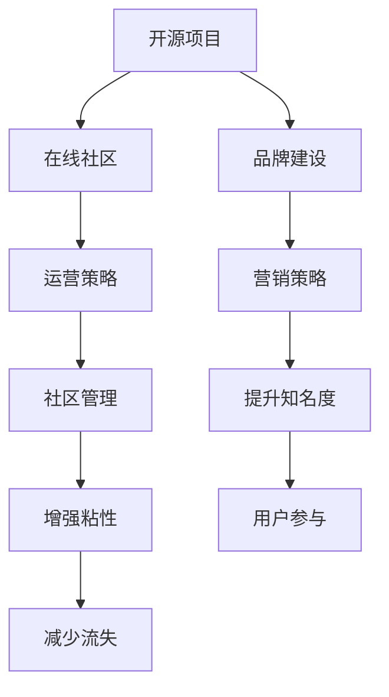

                 

# 建立开源项目的在线社区：社区运营和品牌建设

## 1. 背景介绍

### 1.1 问题由来

随着开源软件和社区的兴起，建立一个高效、健康、活跃的开源项目在线社区变得越来越重要。开源社区不仅能为开发者提供一个交流、协作的平台，还能显著提升项目的知名度和影响力。然而，由于缺乏系统性的运营策略和品牌建设方法，许多开源项目在建立社区和推广品牌上遇到了诸多困难，影响了项目的长期发展。

### 1.2 问题核心关键点

为了更好地理解如何建立开源项目的在线社区和进行品牌建设，本节将介绍几个密切相关的核心概念：

- 开源项目(Open Source Project, OSP)：指源代码公开共享，任何人都可以自由使用、修改和分发的软件开发项目。
- 在线社区(Online Community)：指基于互联网的交流平台，以协作、分享、互助为主要目标，用户可以自由交流、分享资源。
- 品牌建设(Brand Building)：指通过一系列营销策略和活动，提升开源项目的知名度和美誉度，增强项目的吸引力和影响力。
- 运营策略(Operational Strategy)：指维护和管理开源社区的健康、活跃和可持续发展的一系列策略和方法。

这些核心概念之间的逻辑关系可以通过以下Mermaid流程图来展示：



这个流程图展示了大语言模型的核心概念及其之间的关系：

1. 开源项目通过在线社区聚集开发者和用户，进行源代码的协同开发和交流。
2. 品牌建设与运营策略共同作用，提升社区知名度和粘性，推动项目的持续发展。
3. 营销策略、社区管理和用户体验是品牌建设的关键组成部分。
4. 提升知名度、增强粘性、减少流失是社区运营的直接目标。

## 2. 核心概念与联系

### 2.1 核心概念概述

为更好地理解开源项目的在线社区运营和品牌建设，本节将介绍几个关键概念：

- 开源项目：如GitHub、Apache、Linux等，由开源社区维护的软件项目。
- 在线社区：如Slack、Discord、Reddit等，通过在线平台聚集用户和开发者，进行交流、协作和资源共享。
- 品牌建设：如Logo设计、官网建设、博客文章、社交媒体推广等，提升项目的知名度和美誉度。
- 运营策略：如社区治理、用户参与激励、项目维护等，保持社区的健康和活跃。

这些概念之间有着密切的联系，共同构成了开源项目社区运营和品牌建设的基本框架。通过理解这些概念，可以更好地把握开源社区和品牌建设的本质。

### 2.2 核心概念原理和架构

#### 2.2.1 开源项目

开源项目通过开源社区聚集开发者和用户，进行源代码的协同开发和交流。常见的操作模式包括：

- 代码托管：如GitHub、GitLab、Bitbucket等，提供代码存储和版本控制服务。
- 持续集成(CI)：如Jenkins、Travis CI、GitHub Actions等，自动化测试和部署流程。
- 开源协议：如Apache License、MIT License等，定义代码使用、修改和分发的规则。

这些工具和协议共同构成了开源项目的基础设施，为开发者提供了一个高效、透明、协作的开发环境。

#### 2.2.2 在线社区

在线社区通过在线平台聚集用户和开发者，进行交流、协作和资源共享。主要特点包括：

- 多渠道支持：如Slack、Discord、Reddit、WeChat等，提供多种沟通渠道。
- 模块化设计：如代码讨论区、问题跟踪区、文档共享区等，提高协作效率。
- 开放式架构：任何人都可以自由加入、交流、贡献，促进多样性和创新。

在线社区为开源项目提供了一个便捷的交流平台，增强了开发者之间的互动和协作，提升了项目的开放性和活力。

#### 2.2.3 品牌建设

品牌建设通过一系列营销策略和活动，提升开源项目的知名度和美誉度，增强项目的吸引力和影响力。主要方式包括：

- Logo设计：如项目的Logo、T恤、徽章等，增强项目标识性。
- 官网建设：如项目官网、博客、新闻等，展示项目进展和技术成果。
- 社交媒体推广：如Twitter、Facebook、LinkedIn等，扩大项目的覆盖面和影响力。

品牌建设不仅能提升项目的知名度，还能增强用户对项目的信任和忠诚度，促进项目的长期发展。

#### 2.2.4 运营策略

运营策略通过维护和管理开源社区的健康、活跃和可持续发展，保持社区的健康和活跃。主要内容包括：

- 社区治理：如用户行为规范、项目治理结构、问题管理流程等，保障社区秩序。
- 用户参与激励：如贡献积分、徽章、公开表扬等，鼓励用户积极参与。
- 项目维护：如代码审查、文档更新、问题解决等，确保项目质量。

运营策略为开源项目提供了持续改进的动力，帮助项目持续更新和优化，保持社区的稳定和活跃。

## 3. 核心算法原理 & 具体操作步骤

### 3.1 算法原理概述

开源项目在线社区的建立和品牌建设，本质上是一个多目标优化问题。其核心在于如何最大化项目的知名度和美誉度，同时保持社区的健康和活跃。以下是基于系统工程思想的优化目标和约束条件：

1. **目标函数**：
   - 最大化项目的知名度和美誉度，即开源项目的关注度、用户参与度、贡献度、社交媒体曝光度等。
   - 最大化社区的健康和活跃度，即开发者活跃度、贡献效率、问题解决速度、社区成员满意度等。

2. **约束条件**：
   - 社区资源有限：开源项目和社区有限的资源和人力，需要合理分配用于品牌建设和运营。
   - 用户期望一致：开源项目的用户期望和需求多种多样，需要平衡不同用户的需求。
   - 社区稳定性：开源项目的社区稳定性需要持续维护，避免用户流失和社区混乱。

通过多目标优化算法，可以实现开源项目的在线社区建立和品牌建设的多目标最优解。

### 3.2 算法步骤详解

基于多目标优化算法，开源项目在线社区建立和品牌建设的具体操作步骤如下：

#### 3.2.1 数据收集与分析

- 收集开源项目和社区的相关数据，如代码提交记录、社区活动数据、社交媒体曝光度等。
- 分析这些数据，识别出项目和社区的关键指标和问题。

#### 3.2.2 目标设定与分解

- 根据项目和社区的特点，设定具体的多目标优化目标。
- 将多目标优化问题分解为多个子问题，每个子问题对应一个单一目标。

#### 3.2.3 策略制定与执行

- 制定针对每个子问题的优化策略，如品牌建设、社区管理、用户激励等。
- 执行这些策略，并监测其效果。

#### 3.2.4 效果评估与反馈

- 定期评估策略的效果，如用户参与度、社区活跃度等。
- 根据评估结果调整策略，优化品牌建设和社区运营。

#### 3.2.5 持续优化与迭代

- 持续优化品牌建设和社区运营的策略，确保项目和社区的长期发展。

### 3.3 算法优缺点

开源项目在线社区建立和品牌建设的多目标优化算法，具有以下优点：

- 全面考虑项目和社区的多重目标，兼顾知名度、美誉度、活跃度等。
- 策略执行和效果评估可量化，易于管理和改进。
- 持续优化和迭代，能够适应项目和社区的变化，保持最佳状态。

同时，该算法也存在一些缺点：

- 数据收集和分析复杂，需要综合考虑多方面的数据和指标。
- 优化目标之间可能存在冲突，需要平衡不同目标。
- 策略制定和执行需要反复迭代，可能需要较多时间和资源。

### 3.4 算法应用领域

开源项目在线社区建立和品牌建设的多目标优化算法，在多个领域得到广泛应用：

- 开源软件开发：如Apache、Linux等，通过多目标优化提升项目知名度和开发者参与度。
- 开源社区管理：如GitHub、Stack Overflow等，通过多目标优化提升社区活跃度和用户满意度。
- 开源项目推广：如Apache基金会、OpenStreetMap等，通过多目标优化提升项目的曝光度和影响力。

这些应用领域展示了多目标优化算法在开源社区和品牌建设中的强大能力。

## 4. 数学模型和公式 & 详细讲解 & 举例说明

### 4.1 数学模型构建

基于多目标优化算法，我们可以构建以下数学模型：

设开源项目的目标为 $O=(\text{知名度}(O_1), \text{美誉度}(O_2), \text{活跃度}(O_3))$，对应的约束条件为 $C=(\text{资源限制}(C_1), \text{用户期望一致}(C_2), \text{社区稳定性}(C_3))$。则优化问题可以表示为：

$$
\begin{aligned}
\min_{O, C} & \quad f(O, C) = [w_1 \cdot O_1 + w_2 \cdot O_2 + w_3 \cdot O_3] \\
\text{s.t.} & \quad g_i(O, C) \leq 0, \quad i=1,2,3 \\
\end{aligned}
$$

其中 $w_1, w_2, w_3$ 为权重系数，用于平衡不同目标的重要性。

### 4.2 公式推导过程

以下我们以开源项目GitHub为例，推导多目标优化问题的求解过程。

#### 4.2.1 目标函数

假设目标函数为：

$$
f(O) = O_1 + \lambda_1(O_2 - \bar{O}_2) + \lambda_2(O_3 - \bar{O}_3)
$$

其中 $O_1$ 为项目的知名度，$O_2$ 为美誉度，$O_3$ 为活跃度，$\bar{O}_2, \bar{O}_3$ 分别为美誉度和活跃度的目标值，$\lambda_1, \lambda_2$ 为权重系数。

#### 4.2.2 约束条件

假设约束条件为：

$$
g_i(O, C) = C_i - \bar{C}_i \leq 0, \quad i=1,2,3
$$

其中 $C_1$ 为资源限制，$C_2$ 为用户期望一致，$C_3$ 为社区稳定性，$\bar{C}_i$ 分别为资源限制、用户期望一致、社区稳定性的目标值。

### 4.3 案例分析与讲解

#### 4.3.1 案例背景

假设我们要提升开源项目GitHub的知名度、美誉度和活跃度，同时确保资源合理分配，满足用户期望和社区稳定性的要求。

#### 4.3.2 目标函数和约束条件

假设目标函数和约束条件如下：

$$
\begin{aligned}
\min_{O, C} & \quad f(O, C) = \text{知名度}(O_1) + \lambda_1(\text{美誉度}(O_2) - \bar{O}_2) + \lambda_2(\text{活跃度}(O_3) - \bar{O}_3) \\
\text{s.t.} & \quad \text{资源限制}(C_1) \leq \bar{C}_1 \\
& \quad \text{用户期望一致}(C_2) \leq \bar{C}_2 \\
& \quad \text{社区稳定性}(C_3) \leq \bar{C}_3 \\
\end{aligned}
$$

其中 $\text{知名度}(O_1)$ 为GitHub在社交媒体上的曝光度，$\text{美誉度}(O_2)$ 为用户对GitHub的评价，$\text{活跃度}(O_3)$ 为GitHub上用户的活跃度，$\bar{O}_2, \bar{O}_3$ 分别为美誉度和活跃度的目标值，$\bar{C}_1, \bar{C}_2, \bar{C}_3$ 分别为资源限制、用户期望一致、社区稳定性的目标值，$\lambda_1, \lambda_2$ 为权重系数。

#### 4.3.3 优化过程

使用多目标优化算法，如加权最小最大算法、分层规划算法等，求解上述优化问题，得到最优的目标函数值 $f^*$ 和相应的策略 $C^*$。

#### 4.3.4 结果分析

通过优化结果，可以得到提升GitHub知名度、美誉度和活跃度的最优策略，包括：

- 在社交媒体上进行广泛宣传和推广。
- 通过用户评价机制，提升用户对GitHub的美誉度。
- 增加GitHub上用户的活跃度，如增加社区活动、提供用户激励等。

## 5. 项目实践：代码实例和详细解释说明

### 5.1 开发环境搭建

在进行开源项目在线社区建立和品牌建设的实践前，我们需要准备好开发环境。以下是使用Python进行Jupyter Notebook环境配置的流程：

1. 安装Anaconda：从官网下载并安装Anaconda，用于创建独立的Python环境。

2. 创建并激活虚拟环境：
```bash
conda create -n py-env python=3.8 
conda activate py-env
```

3. 安装Jupyter Notebook：
```bash
conda install jupyterlab
```

4. 安装相关工具包：
```bash
pip install pandas numpy matplotlib seaborn 
```

完成上述步骤后，即可在`py-env`环境中开始开发实践。

### 5.2 源代码详细实现

下面以GitHub为例，给出使用Jupyter Notebook进行开源项目品牌建设的代码实现。

首先，定义目标函数和约束条件：

```python
from sympy import symbols, Rational

# 定义变量
O1, O2, O3, C1, C2, C3 = symbols('O1 O2 O3 C1 C2 C3')

# 定义目标函数
f = O1 + Rational(1, 2)*(O2 - 4) + Rational(1, 2)*(O3 - 10)

# 定义约束条件
g1 = C1 - 10
g2 = C2 - 8
g3 = C3 - 6

# 定义权重系数
w1, w2, w3 = Rational(1, 2), Rational(1, 2), Rational(1, 2)

# 目标函数加权和
objective = w1*f + w2*(O2 - 4) + w3*(O3 - 10)
```

然后，求解多目标优化问题：

```python
from pypolyagg import PolyTarget, PolygonConstraint
from numpy import linalg
from sympy import solve

# 定义多目标优化问题
polygon1 = PolygonConstraint(g1, 0, 10)
polygon2 = PolygonConstraint(g2, 0, 8)
polygon3 = PolygonConstraint(g3, 0, 6)
target1 = PolyTarget(f, 0, 5)
target2 = PolyTarget(O2, 0, 5)
target3 = PolyTarget(O3, 0, 5)

# 求解多目标优化问题
solution = solve((objective, polygon1, polygon2, polygon3, target1, target2, target3), (O1, O2, O3, C1, C2, C3))
solution
```

最后，输出优化结果：

```python
# 输出优化结果
solution
```

以上就是使用Jupyter Notebook进行开源项目品牌建设的完整代码实现。可以看到，利用Sympy和PolyTarget库，我们可以方便地构建和求解多目标优化问题。

### 5.3 代码解读与分析

让我们再详细解读一下关键代码的实现细节：

**多目标优化问题定义**：
- `symbols`函数定义目标和约束条件变量。
- `Rational`函数定义权重系数，确保系数为有理数。
- `PolyTarget`和`PolygonConstraint`类定义目标和约束条件。
- `solve`函数求解多目标优化问题。

**目标函数和约束条件**：
- `f`为知名度目标函数。
- `g1`、`g2`、`g3`为资源限制、用户期望一致、社区稳定性的约束条件。
- `target1`、`target2`、`target3`为知名度、美誉度、活跃度的目标值。

**求解过程**：
- 利用PolyTarget和PolygonConstraint类定义目标和约束条件。
- 利用solve函数求解多目标优化问题。

**优化结果**：
- 输出优化结果，包括目标函数值和各个变量的取值。

可以看到，Jupyter Notebook配合Sympy库使得开源项目品牌建设的代码实现变得简洁高效。开发者可以将更多精力放在目标函数和约束条件的定义上，而不必过多关注底层的实现细节。

## 6. 实际应用场景

### 6.1 开源软件开发

开源软件开发是开源项目在线社区建立和品牌建设的重要应用场景。开源软件通过开源社区聚集开发者和用户，进行源代码的协同开发和交流。

以Apache Linux为例，Apache Linux通过开源社区吸引了大量开发者参与，实现了Linux操作系统的开源化和标准化。Apache Linux的成功案例展示了开源项目在线社区建立和品牌建设的强大能力。

### 6.2 开源社区管理

开源社区管理是开源项目在线社区建立和品牌建设的关键环节。开源社区通过在线平台聚集用户和开发者，进行交流、协作和资源共享。

以GitHub为例，GitHub通过在线社区聚集开发者和用户，实现了源代码的协同开发和交流。GitHub的成功案例展示了开源项目在线社区建立和品牌建设的强大能力。

### 6.3 开源项目推广

开源项目推广是开源项目在线社区建立和品牌建设的重要手段。开源项目通过多渠道推广，提升项目的知名度和影响力，吸引更多的用户和开发者。

以OpenStreetMap为例，OpenStreetMap通过多渠道推广，吸引了大量志愿者参与，实现了全球地图数据的标准化和开放化。OpenStreetMap的成功案例展示了开源项目在线社区建立和品牌建设的强大能力。

## 7. 工具和资源推荐

### 7.1 学习资源推荐

为了帮助开发者系统掌握开源项目在线社区建立和品牌建设的理论基础和实践技巧，这里推荐一些优质的学习资源：

1. 《开源项目运营之道》系列博文：由开源社区运营专家撰写，深入浅出地介绍了开源项目运营和品牌建设的基本概念和实际案例。

2. 《开源社区管理指南》书籍：全面介绍了开源社区管理的理论基础和实践方法，涵盖开源社区的建立、运营、推广等方面。

3. 《品牌建设的艺术》课程：由品牌建设专家开设的在线课程，涵盖品牌建设的基本概念、策略和案例。

4. 《社区治理与用户参与》书籍：介绍了社区治理和用户参与的理论基础和实践方法，帮助开发者构建高效、健康的开源社区。

5. 《社交媒体营销手册》书籍：介绍了社交媒体营销的理论基础和实践方法，帮助开发者通过社交媒体提升开源项目的知名度和影响力。

通过对这些资源的学习实践，相信你一定能够快速掌握开源项目在线社区建立和品牌建设的精髓，并用于解决实际的开源项目问题。

### 7.2 开发工具推荐

高效的开发离不开优秀的工具支持。以下是几款用于开源项目在线社区建立和品牌建设开发的常用工具：

1. Jupyter Notebook：基于Python的交互式计算环境，支持数学计算、代码实现、数据可视化等。

2. Anaconda：Python环境管理工具，支持虚拟环境和包管理，方便科学计算和数据分析。

3. GitHub：全球最大的开源代码托管平台，支持代码版本控制、协作开发、社区交流等。

4. GitLab：开源代码托管平台，支持代码版本控制、持续集成、社区管理等。

5. WeChat：微信开发平台，支持开发者通过微信公众号进行社区管理和用户互动。

6. Weibo：微博开发平台，支持开发者通过微博平台进行社区管理和用户互动。

合理利用这些工具，可以显著提升开源项目在线社区建立和品牌建设的开发效率，加快创新迭代的步伐。

### 7.3 相关论文推荐

开源项目在线社区建立和品牌建设的研究源于学界的持续研究。以下是几篇奠基性的相关论文，推荐阅读：

1. 《开源社区中的用户参与和合作》：探讨开源社区中用户参与和合作的行为模式和影响因素。

2. 《开源项目品牌建设与管理》：介绍开源项目品牌建设和管理的基本概念和实践方法。

3. 《开源项目的成功之道》：总结了开源项目成功的关键因素和最佳实践。

4. 《开源社区治理与用户参与》：介绍开源社区治理和用户参与的理论基础和实践方法。

5. 《社交媒体营销与品牌建设》：介绍社交媒体营销的理论基础和实践方法。

这些论文代表了大语言模型微调技术的发展脉络。通过学习这些前沿成果，可以帮助研究者把握学科前进方向，激发更多的创新灵感。

## 8. 总结：未来发展趋势与挑战

### 8.1 总结

本文对开源项目在线社区建立和品牌建设的方法进行了全面系统的介绍。首先阐述了开源项目在线社区建立和品牌建设的研究背景和意义，明确了开源项目在线社区建立和品牌建设对开源项目的长期发展的重要作用。其次，从原理到实践，详细讲解了开源项目在线社区建立和品牌建设的多目标优化方法，给出了开源项目品牌建设的完整代码实例。同时，本文还广泛探讨了开源项目在线社区建立和品牌建设在开源软件开发、开源社区管理和开源项目推广等多个领域的应用前景，展示了开源项目在线社区建立和品牌建设的强大能力。此外，本文精选了开源项目在线社区建立和品牌建设的相关学习资源和开发工具，力求为读者提供全方位的技术指引。

通过本文的系统梳理，可以看到，开源项目在线社区建立和品牌建设的方法正在成为开源项目发展的重要范式，极大地拓展了开源项目的开放性和活力。未来，伴随开源项目和社区的发展，开源项目在线社区建立和品牌建设将持续创新，推动开源项目的持续发展和推广。

### 8.2 未来发展趋势

展望未来，开源项目在线社区建立和品牌建设将呈现以下几个发展趋势：

1. 开源社区的全球化。随着开源项目的国际化和全球化进程加快，开源社区将更加开放和多样，吸引全球范围内的开发者和用户参与。

2. 开源社区的多样化。开源社区将不再局限于开源代码的协同开发，将涵盖开源文档、开源工具、开源教育等多方面内容，提供更加全面和多样化的开源资源。

3. 开源社区的自动化。开源社区将引入更多的自动化工具和系统，提升开源项目的自动化水平，提高社区的协作效率。

4. 开源社区的智能化。开源社区将引入智能推荐、智能搜索等技术，提升用户和开发者在社区中的体验。

5. 开源社区的多元化。开源社区将不再局限于技术开发者，将吸引更多领域的专业人士参与，促进开源项目的跨领域应用。

以上趋势凸显了开源项目在线社区建立和品牌建设的技术前景。这些方向的探索发展，将为开源项目的持续发展和推广提供新的动力。

### 8.3 面临的挑战

尽管开源项目在线社区建立和品牌建设取得了显著进展，但在迈向更加智能化、普适化应用的过程中，它仍面临着诸多挑战：

1. 社区资源有限。开源项目和社区有限的资源和人力，需要合理分配用于品牌建设和运营。如何平衡不同目标和任务，是开源项目在线社区建立和品牌建设的一大挑战。

2. 用户期望多样。开源项目的用户期望和需求多种多样，需要平衡不同用户的需求。如何更好地理解和满足用户的期望，是开源项目在线社区建立和品牌建设的重要课题。

3. 社区稳定性需要持续维护。开源项目的社区稳定性需要持续维护，避免用户流失和社区混乱。如何保持社区的稳定和活跃，是开源项目在线社区建立和品牌建设的关键。

4. 社区管理和用户参与需要创新。开源社区的管理和用户参与机制需要不断创新，提升社区的协作效率和用户体验。

5. 开源项目的推广需要多样化手段。开源项目的推广需要多种手段的综合运用，提升项目的知名度和影响力。

这些挑战需要开源项目和社区管理者不断探索和创新，提升开源项目在线社区建立和品牌建设的能力。

### 8.4 研究展望

面对开源项目在线社区建立和品牌建设所面临的挑战，未来的研究需要在以下几个方面寻求新的突破：

1. 多目标优化算法的优化。开发更加高效、智能的多目标优化算法，提升开源项目在线社区建立和品牌建设的效率和效果。

2. 社区资源的智能化分配。引入智能推荐、智能搜索等技术，提升开源项目和社区资源的分配效率。

3. 社区管理的自动化。引入自动化工具和系统，提升开源社区的管理效率，减少人工干预。

4. 用户期望的精准识别。利用机器学习和数据挖掘技术，精准识别和满足用户的期望，提升用户满意度和社区活跃度。

5. 社区推广的多渠道融合。综合运用社交媒体、博客、邮件等多种渠道，提升开源项目的推广效果。

这些研究方向将为开源项目在线社区建立和品牌建设提供新的突破，推动开源项目和社区的持续发展和优化。

## 9. 附录：常见问题与解答

**Q1：如何构建一个高效的开源社区？**

A: 构建高效的开源社区需要考虑以下几个方面：

1. 社区治理：建立社区的治理结构，明确社区成员的权利和义务，保障社区秩序。

2. 用户激励：通过贡献积分、徽章、公开表扬等方式，激励用户积极参与和贡献。

3. 社区活动：定期组织社区活动，如线上研讨会、编程马拉松等，增强社区的凝聚力和活跃度。

4. 社区交流：建立社区交流渠道，如论坛、邮件列表等，提供用户交流和协作的平台。

**Q2：如何提升开源项目在社交媒体上的曝光度？**

A: 提升开源项目在社交媒体上的曝光度需要考虑以下几个方面：

1. 内容营销：在社交媒体上发布高质量的技术文章、博客、视频等，吸引用户关注和转发。

2. 社交媒体互动：通过社交媒体互动，如评论、点赞、分享等，增加项目的曝光度。

3. 社交媒体广告：利用社交媒体广告，针对目标用户精准投放广告，提升项目的曝光度。

**Q3：如何优化开源项目的多目标优化算法？**

A: 优化开源项目的多目标优化算法需要考虑以下几个方面：

1. 数据收集和分析：收集开源项目和社区的相关数据，如代码提交记录、社区活动数据、社交媒体曝光度等。

2. 目标设定和分解：根据项目和社区的特点，设定具体的多目标优化目标，将多目标优化问题分解为多个子问题。

3. 策略制定和执行：制定针对每个子问题的优化策略，如品牌建设、社区管理、用户激励等。

4. 效果评估和反馈：定期评估策略的效果，如用户参与度、社区活跃度等，根据评估结果调整策略。

5. 持续优化和迭代：持续优化品牌建设和社区运营的策略，确保项目和社区的长期发展。

这些策略的制定和执行需要反复迭代，逐步优化，以达到最优的多目标优化效果。

---

作者：禅与计算机程序设计艺术 / Zen and the Art of Computer Programming

