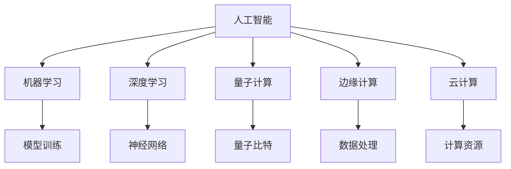

                 

# 开启无限可能：人类计算的新征程

> 关键词：人工智能,计算能力,人类计算,量子计算,机器学习,深度学习,边缘计算,云计算

## 1. 背景介绍

### 1.1 问题由来

在信息爆炸的时代，数据的庞大规模和复杂性使得传统的计算方法已无法满足需求。随着人工智能和机器学习技术的快速发展，计算方式正在经历一场前所未有的变革。人类计算，即通过计算实现对人类智能的模拟和扩展，成为连接人机交互和智能系统的新方式。

人工智能(AI)、大数据(Big Data)和云计算(Cloud Computing)的协同发展，正在开启一场颠覆性的技术革命。人类计算，作为这一进程的重要组成部分，正逐步从理论走向实践，展现其无限的潜能和价值。

### 1.2 问题核心关键点

人类计算的核心在于如何通过计算技术，高效、精确地模拟和扩展人类的认知能力和智能决策。其关键点包括：

- **计算模型的选择**：选择合适的计算模型，如神经网络、遗传算法、进化计算等，以适应不同类型的问题。
- **数据获取与处理**：如何高效获取、清洗和处理海量数据，提取有价值的信息。
- **计算资源优化**：如何合理配置计算资源，最大化利用算力，避免资源浪费。
- **算法设计**：设计高效的算法，提升计算速度和准确度，实现问题的优化求解。
- **系统集成与部署**：如何将计算结果集成到实际应用中，实现智能决策。

### 1.3 问题研究意义

研究人类计算的深层次原理和应用方法，对于提升人类认知智能、推动技术创新、促进经济发展具有重要意义：

1. **提升认知智能**：人类计算通过模拟人类认知过程，实现知识获取、推理和决策，提升智能系统的理解和处理能力。
2. **促进技术创新**：计算模型和算法的优化设计，为新兴技术的发展提供了重要基础。
3. **推动经济发展**：智能系统在金融、医疗、教育等行业的应用，提高了工作效率，降低了运营成本，推动了经济的数字化转型。
4. **社会效益**：人类计算在环境保护、公共安全等领域的应用，有助于提高社会治理水平，提升生活质量。

## 2. 核心概念与联系

### 2.1 核心概念概述

为了更好地理解人类计算的原理和应用，本节将介绍几个核心概念及其相互之间的联系：

- **人工智能**：指通过机器学习、深度学习等技术，使计算机能够模拟人类的智能行为，如理解自然语言、图像识别、决策优化等。
- **机器学习**：指通过数据驱动的方式，让机器自动学习模型，无需人工干预。人类计算的实现依赖于高效的机器学习算法。
- **深度学习**：一种特殊的机器学习方法，通过多层次的神经网络结构，实现对复杂数据的自动特征提取和处理。
- **量子计算**：利用量子力学的原理，通过量子比特(qubits)实现并行计算和高效计算，在特定领域展现出了巨大的潜力。
- **边缘计算**：将数据处理和分析从中心服务器转移到数据源附近，减少数据传输的延迟，提升计算效率。
- **云计算**：通过互联网提供计算资源和服务，按需使用，降低硬件和软件成本，支持大规模的计算和数据处理。

这些核心概念之间通过技术栈、应用场景等层层联系，共同构成了人类计算的生态系统。以下Mermaid流程图展示了这些概念之间的联系：



这些概念之间的相互关系，构成了人类计算的技术基础和应用框架。通过理解这些核心概念，我们可以更好地把握人类计算的原理和应用方向。

## 3. 核心算法原理 & 具体操作步骤
### 3.1 算法原理概述

人类计算的核心在于利用计算机技术，高效地模拟和扩展人类的智能行为。其基本原理可以概括为：

1. **数据驱动**：利用大数据技术，高效获取和处理海量数据，提取有价值的信息。
2. **模型训练**：通过机器学习算法，训练高效的计算模型，实现智能决策和问题求解。
3. **计算优化**：通过优化算法和计算资源配置，提高计算效率和准确度。
4. **系统集成**：将计算结果集成到实际应用中，实现智能系统的优化和升级。

### 3.2 算法步骤详解

人类计算的实现过程一般包括以下几个关键步骤：

**Step 1: 数据预处理**
- 收集和清洗数据，去除噪声和异常值，确保数据的质量和可靠性。
- 对数据进行特征提取和编码，使其适合模型输入。

**Step 2: 模型训练**
- 选择合适的计算模型，如神经网络、支持向量机等，进行模型训练。
- 利用训练数据集，通过迭代优化算法（如梯度下降），调整模型参数，最小化损失函数。
- 在验证集上评估模型性能，调整超参数，确保模型泛化能力。

**Step 3: 计算优化**
- 优化计算资源配置，选择合适的硬件设备和算法，提升计算效率。
- 应用并行计算、分布式计算等技术，实现大规模数据的高效处理。
- 引入数据压缩和编码技术，减少存储空间，提高计算速度。

**Step 4: 系统集成**
- 将计算结果集成到实际应用中，实现智能决策和问题求解。
- 开发用户界面和交互系统，增强人机交互体验。
- 应用反馈机制，持续优化和升级系统功能。

### 3.3 算法优缺点

人类计算的实现过程具备以下优点：

1. **高效性**：通过优化计算模型和算法，能够高效处理大规模数据，实现智能决策。
2. **可扩展性**：计算模型和算法具有高度的可扩展性，适用于不同类型的问题和场景。
3. **自适应性**：利用机器学习技术，能够自适应数据和环境变化，提升智能系统的适应能力。
4. **可维护性**：通过模块化设计和接口封装，能够方便地维护和升级系统。

同时，人类计算也存在一些局限性：

1. **数据依赖性**：高度依赖高质量的数据，数据获取和处理成本较高。
2. **模型复杂性**：复杂的计算模型和算法设计，需要较高的技术门槛和专业技能。
3. **资源消耗大**：大规模数据和高性能计算的需求，可能导致资源消耗大，成本高。
4. **解释性不足**：计算模型的黑盒特性，难以解释其决策过程和逻辑。

尽管存在这些局限性，但就目前而言，人类计算作为连接人机交互和智能系统的新方式，正逐步成为技术创新的重要驱动力，展现出广阔的应用前景。

### 3.4 算法应用领域

人类计算技术在多个领域中得到了广泛应用，例如：

- **金融领域**：利用人类计算进行股票预测、风险评估、资产配置等，提升金融决策的科学性和精确性。
- **医疗领域**：应用于疾病诊断、药物研发、患者分诊等，提高医疗服务的质量和效率。
- **教育领域**：实现智能辅助教学、学习路径规划、作业批改等，促进个性化教育和教育公平。
- **公共安全**：应用于犯罪预测、情报分析、灾害监测等，提升公共安全管理的智能化水平。
- **智能制造**：应用于生产流程优化、质量检测、设备维护等，提升制造业的智能化和自动化水平。

随着技术的不断进步，人类计算在更多领域的应用前景将更加广阔，为各行各业的数字化转型提供新的动力。

## 4. 数学模型和公式 & 详细讲解 & 举例说明
### 4.1 数学模型构建

人类计算的实现涉及多个领域的数学模型和算法。以下以深度学习模型为例，构建计算模型的基本数学框架。

假设一个具有$n$个神经元的神经网络，输入数据为$x=(x_1,x_2,...,x_n)$，输出为$y=(y_1,y_2,...,y_n)$，其中$y_i$为第$i$个神经元的激活值。定义损失函数$L(y)$，衡量输出与真实标签之间的差异。

定义激活函数$f(.)$，通常为sigmoid、ReLU等，用于将激活值映射到输出范围。假设损失函数为均方误差损失，则模型训练的目标为最小化损失函数：

$$
\min_{\theta} \sum_{i=1}^n (y_i - f_{\theta}(x_i))^2
$$

其中$\theta$为模型参数，$f_{\theta}(x_i)$为输入$x_i$通过模型参数$\theta$的计算结果。

### 4.2 公式推导过程

以下是均方误差损失函数的详细推导过程：

设模型输出为$\hat{y}=M_{\theta}(x)$，其中$M_{\theta}(x)$为输入$x$通过模型参数$\theta$的计算结果。定义均方误差损失函数为：

$$
L(M_{\theta}(x),y) = \frac{1}{N}\sum_{i=1}^N (\hat{y_i} - y_i)^2
$$

在训练过程中，使用梯度下降算法更新模型参数$\theta$：

$$
\theta \leftarrow \theta - \eta \nabla_{\theta}L(M_{\theta}(x),y)
$$

其中$\eta$为学习率，$\nabla_{\theta}L(M_{\theta}(x),y)$为损失函数对模型参数$\theta$的梯度，可通过反向传播算法高效计算。

### 4.3 案例分析与讲解

以图像识别为例，分析深度学习模型在实际应用中的计算过程。

假设输入图像为$x$，输出标签为$y$，模型的计算过程包括：

1. 将输入图像$x$通过卷积层和池化层，提取图像特征$F(x)$。
2. 将特征$F(x)$通过全连接层，计算输出概率分布$P(y|F(x))$。
3. 将概率分布$P(y|F(x))$与真实标签$y$的交叉熵作为损失函数$L(y,F(x))$。
4. 使用梯度下降算法，更新模型参数$\theta$，最小化损失函数$L(y,F(x))$。

在训练过程中，通过多次迭代和优化，模型逐步学习到图像的特征表示和分类规则，最终能够准确识别图像内容。

## 5. 项目实践：代码实例和详细解释说明
### 5.1 开发环境搭建

在进行人类计算的实践时，我们需要准备好开发环境。以下是使用Python进行深度学习开发的环境配置流程：

1. 安装Anaconda：从官网下载并安装Anaconda，用于创建独立的Python环境。

2. 创建并激活虚拟环境：
```bash
conda create -n pytorch-env python=3.8 
conda activate pytorch-env
```

3. 安装PyTorch：根据CUDA版本，从官网获取对应的安装命令。例如：
```bash
conda install pytorch torchvision torchaudio cudatoolkit=11.1 -c pytorch -c conda-forge
```

4. 安装TensorFlow：由Google主导开发的开源深度学习框架，生产部署方便，适合大规模工程应用。同样有丰富的预训练语言模型资源。

5. 安装TensorFlow：
```bash
pip install tensorflow
```

6. 安装各类工具包：
```bash
pip install numpy pandas scikit-learn matplotlib tqdm jupyter notebook ipython
```

完成上述步骤后，即可在`pytorch-env`环境中开始计算实践。

### 5.2 源代码详细实现

下面我们以图像识别为例，给出使用PyTorch进行深度学习模型训练的完整代码实现。

```python
import torch
import torch.nn as nn
import torch.optim as optim
from torch.utils.data import DataLoader
import torchvision.transforms as transforms
from torchvision.datasets import CIFAR10
import matplotlib.pyplot as plt

# 定义模型
class Net(nn.Module):
    def __init__(self):
        super(Net, self).__init__()
        self.conv1 = nn.Conv2d(3, 6, 5)
        self.pool = nn.MaxPool2d(2, 2)
        self.conv2 = nn.Conv2d(6, 16, 5)
        self.fc1 = nn.Linear(16 * 5 * 5, 120)
        self.fc2 = nn.Linear(120, 84)
        self.fc3 = nn.Linear(84, 10)
        
    def forward(self, x):
        x = self.pool(F.relu(self.conv1(x)))
        x = self.pool(F.relu(self.conv2(x)))
        x = x.view(-1, 16 * 5 * 5)
        x = F.relu(self.fc1(x))
        x = F.relu(self.fc2(x))
        x = self.fc3(x)
        return x

# 加载数据集
transform = transforms.Compose([transforms.ToTensor(), transforms.Normalize((0.5, 0.5, 0.5), (0.5, 0.5, 0.5))])
trainset = CIFAR10(root='./data', train=True, download=True, transform=transform)
trainloader = DataLoader(trainset, batch_size=4, shuffle=True, num_workers=2)
testset = CIFAR10(root='./data', train=False, download=True, transform=transform)
testloader = DataLoader(testset, batch_size=4, shuffle=False, num_workers=2)

# 定义模型和优化器
model = Net()
criterion = nn.CrossEntropyLoss()
optimizer = optim.SGD(model.parameters(), lr=0.001, momentum=0.9)

# 训练模型
for epoch in range(10):
    running_loss = 0.0
    for i, data in enumerate(trainloader, 0):
        inputs, labels = data
        optimizer.zero_grad()
        outputs = model(inputs)
        loss = criterion(outputs, labels)
        loss.backward()
        optimizer.step()
        running_loss += loss.item()
        if i % 2000 == 1999:    # 每2000步输出一次损失信息
            print('[%d, %5d] loss: %.3f' % (epoch + 1, i + 1, running_loss / 2000))
            running_loss = 0.0

print('Finished Training')
```

### 5.3 代码解读与分析

让我们再详细解读一下关键代码的实现细节：

**Net类**：
- `__init__`方法：初始化神经网络的各层结构。
- `forward`方法：定义前向传播的计算流程。

**CIFAR10数据集**：
- `transforms`模块：定义数据增强和归一化操作，确保数据的一致性和稳定性。
- `CIFAR10`类：加载CIFAR-10数据集，并进行预处理。

**训练过程**：
- `trainset`和`trainloader`：加载训练集并使用DataLoader进行批处理和迭代。
- `testset`和`testloader`：加载测试集并使用DataLoader进行批处理和迭代。
- `optimizer`：定义随机梯度下降优化器，设置学习率和动量。
- `criterion`：定义交叉熵损失函数。
- 训练循环：在每个epoch内，对训练集进行多次迭代，更新模型参数。

**输出结果**：
- 每2000步输出一次损失信息，监控训练过程。
- 训练结束后，输出“Finished Training”信息。

通过上述代码，我们实现了深度学习模型在图像识别任务上的训练过程。可以看到，深度学习模型的训练涉及模型定义、数据加载、优化器选择、损失函数设计等多个环节。

## 6. 实际应用场景
### 6.1 智能制造

在智能制造领域，人类计算技术可以用于生产流程的优化、设备状态监测、质量检测等。通过结合传感器数据、生产工艺和历史经验，实现实时监控和预测，提升制造效率和产品质量。

例如，在汽车制造中，利用传感器数据和图像识别技术，实时监测生产线上的零部件状态，识别出异常情况，及时停机检修。通过分析历史故障数据，预测设备故障趋势，进行预防性维护，减少停机时间，提升生产效率。

### 6.2 智慧城市

智慧城市建设中，人类计算技术可以应用于交通管理、环境监测、公共安全等领域，实现城市治理的智能化和高效化。

例如，通过视频监控和图像识别技术，实时分析交通流量，优化交通信号灯配置，减少交通拥堵。利用传感器数据和天气信息，预测环境污染，提前采取应急措施，提升城市环境质量。通过人脸识别和行为分析，增强公共安全监控，提升社会治理水平。

### 6.3 医疗健康

在医疗健康领域，人类计算技术可以应用于疾病预测、基因分析、患者分诊等。通过结合患者历史数据、基因信息和其他医疗数据，实现智能诊疗和个性化治疗。

例如，通过基因测序数据和疾病症状，预测患者的疾病风险，提前采取预防措施。利用图像识别技术，自动分析医学影像，识别出异常情况，辅助医生进行诊断。通过分析患者行为数据，提供个性化的健康建议和治疗方案，提升患者的生活质量。

### 6.4 未来应用展望

随着人类计算技术的不断进步，未来的应用场景将更加广泛，涵盖更多领域和场景。以下列举一些可能的发展方向：

1. **多模态融合**：结合视觉、听觉、触觉等多种感官信息，实现更加全面和精确的人类计算。例如，通过融合视觉和语音信息，实现更智能的交互和对话系统。

2. **联邦学习**：在保护隐私的前提下，多个计算节点共享计算资源和数据，实现联合学习和知识共享。例如，在医疗领域，多个医院共同参与数据计算，提升疾病诊断和治疗水平。

3. **边缘计算**：在数据源附近进行计算，减少数据传输的延迟，提升计算效率。例如，在工业领域，利用边缘计算技术，实时监测设备状态，实现快速决策和响应。

4. **跨界融合**：将人类计算技术与其他领域的技术进行深度融合，实现跨领域的智能系统。例如，将人工智能与区块链结合，实现智能合约和去中心化计算。

5. **普惠计算**：利用云计算等技术，实现计算资源的普及和共享，降低计算门槛和成本。例如，通过公共云计算平台，提供易于使用的计算工具和资源，支持更多企业和个人进行智能计算。

## 7. 工具和资源推荐
### 7.1 学习资源推荐

为了帮助开发者系统掌握人类计算的理论基础和实践技巧，这里推荐一些优质的学习资源：

1. 《深度学习》（Goodfellow等著）：全面介绍深度学习的基本原理和实现方法，涵盖神经网络、优化算法、计算图等内容。
2. 《机器学习实战》（Peter Harrington著）：通过实例演示机器学习算法的实现过程，适合初学者入门。
3. 《量子计算原理与算法》（Michael A. Nielsen等著）：深入讲解量子计算的基本原理和应用方法，适合对量子计算感兴趣的读者。
4. 《边缘计算技术与应用》（IEEE等著）：介绍边缘计算的基本概念、技术和应用场景，适合对边缘计算感兴趣的读者。
5. 《云计算基础》（Roy A. Choudhury等著）：讲解云计算的基本原理和实现方法，适合云计算领域的学习者。

通过这些资源的学习实践，相信你一定能够快速掌握人类计算的精髓，并用于解决实际的计算问题。

### 7.2 开发工具推荐

高效的开发离不开优秀的工具支持。以下是几款用于人类计算开发的常用工具：

1. PyTorch：基于Python的开源深度学习框架，灵活动态的计算图，适合快速迭代研究。支持多种计算模型和优化算法，具有广泛的应用社区。
2. TensorFlow：由Google主导开发的开源深度学习框架，生产部署方便，适合大规模工程应用。支持分布式计算和自动微分，具有强大的计算能力。
3. Keras：基于Python的高层深度学习API，简单易用，适合初学者入门和快速原型开发。支持多种计算模型和优化算法，易于部署。
4. Jupyter Notebook：开放源码的交互式笔记本，支持多种编程语言和工具，方便进行数据处理、模型训练和可视化。
5. Visual Studio Code：轻量级的代码编辑器，支持多种编程语言和插件，提供丰富的开发环境。

合理利用这些工具，可以显著提升人类计算任务的开发效率，加快创新迭代的步伐。

### 7.3 相关论文推荐

人类计算技术的发展源于学界的持续研究。以下是几篇奠基性的相关论文，推荐阅读：

1. Deep Learning（Goodfellow等著）：系统介绍深度学习的基本原理和实现方法，为深度计算提供了理论基础。
2. Quantum Computing Since Democritus（Michael A. Nielsen等著）：深入讲解量子计算的基本原理和应用方法，为量子计算提供了理论基础。
3. Edge Computing: A Computational Model for Smartphones（Otmar Hilliges等著）：介绍边缘计算的基本概念和技术，为边缘计算提供了理论基础。
4. Cloud Computing: Concepts, Technology, and Architecture（Nasim A. Sharif等著）：讲解云计算的基本原理和实现方法，为云计算提供了理论基础。

这些论文代表了大计算技术的发展脉络。通过学习这些前沿成果，可以帮助研究者把握学科前进方向，激发更多的创新灵感。

## 8. 总结：未来发展趋势与挑战
### 8.1 研究成果总结

本文对人类计算的深层次原理和应用方法进行了全面系统的介绍。首先阐述了人类计算的研究背景和意义，明确了其重要性和应用前景。其次，从原理到实践，详细讲解了人类计算的数学模型和实现流程，给出了深度学习模型的完整代码实例。同时，本文还广泛探讨了人类计算技术在智能制造、智慧城市、医疗健康等多个领域的应用前景，展示了人类计算的广阔前景。此外，本文精选了人类计算技术的各类学习资源，力求为读者提供全方位的技术指引。

通过本文的系统梳理，可以看到，人类计算技术作为连接人机交互和智能系统的新方式，正逐步成为技术创新的重要驱动力，展现出无限的潜能和价值。

### 8.2 未来发展趋势

展望未来，人类计算技术将呈现以下几个发展趋势：

1. **多模态融合**：结合视觉、听觉、触觉等多种感官信息，实现更加全面和精确的人类计算。
2. **联邦学习**：在保护隐私的前提下，多个计算节点共享计算资源和数据，实现联合学习和知识共享。
3. **边缘计算**：在数据源附近进行计算，减少数据传输的延迟，提升计算效率。
4. **跨界融合**：将人类计算技术与其他领域的技术进行深度融合，实现跨领域的智能系统。
5. **普惠计算**：利用云计算等技术，实现计算资源的普及和共享，降低计算门槛和成本。

这些趋势凸显了人类计算技术的广阔前景。这些方向的探索发展，必将进一步提升智能系统的性能和应用范围，为人类认知智能的进化带来深远影响。

### 8.3 面临的挑战

尽管人类计算技术已经取得了显著进展，但在迈向更加智能化、普适化应用的过程中，仍面临诸多挑战：

1. **数据依赖性**：高度依赖高质量的数据，数据获取和处理成本较高。
2. **模型复杂性**：复杂的计算模型和算法设计，需要较高的技术门槛和专业技能。
3. **资源消耗大**：大规模数据和高性能计算的需求，可能导致资源消耗大，成本高。
4. **解释性不足**：计算模型的黑盒特性，难以解释其决策过程和逻辑。
5. **安全性问题**：计算模型的安全性和隐私保护问题，需要加强数据加密和访问控制。

尽管存在这些挑战，但通过不断创新和优化，人类计算技术必将逐步克服这些难题，实现更加智能化、普适化的人类计算系统。

### 8.4 研究展望

面向未来，人类计算技术需要在以下几个方面进行更深入的研究和探索：

1. **深度学习模型优化**：设计更高效、更灵活的深度学习模型，提升模型的计算效率和泛化能力。
2. **分布式计算**：开发更高效、更可靠的分布式计算框架，支持大规模数据的高效处理。
3. **边缘计算优化**：优化边缘计算资源配置和算法设计，提升边缘计算的性能和可靠性。
4. **跨领域融合**：将人类计算技术与其他领域的技术进行深度融合，实现跨领域的智能系统。
5. **普惠计算普及**：通过云计算等技术，实现计算资源的普及和共享，降低计算门槛和成本。

这些研究方向将引领人类计算技术的不断进步，为构建更加智能、高效、安全的人机交互系统提供新的思路和方向。面向未来，人类计算技术需要更多的创新和实践，才能真正实现其无限可能，为人类认知智能的进化带来深远影响。

## 9. 附录：常见问题与解答

**Q1：人类计算是否仅限于数据驱动？**

A: 人类计算的核心在于利用计算技术，模拟和扩展人类智能行为。数据驱动只是实现这一目标的一种手段，但并不是唯一的途径。例如，利用符号计算、知识表示等技术，也能实现智能决策和问题求解。

**Q2：人类计算是否会取代人类智能？**

A: 人类计算技术虽然能够模拟人类智能行为，但仍然需要人类进行监督和指导。计算模型不能完全取代人类智能，但可以在特定领域和场景下，提升人类的决策效率和工作质量。

**Q3：如何评估人类计算模型的性能？**

A: 评估人类计算模型的性能需要综合考虑多个指标，如计算效率、模型准确度、解释性等。可以使用交叉验证、AUC、F1-score等指标，全面评估模型在训练集和测试集上的表现。

**Q4：人类计算技术如何与其他技术结合？**

A: 人类计算技术可以与其他技术进行深度融合，实现跨领域的智能系统。例如，将人工智能与物联网结合，实现智能物联网系统；将人类计算与区块链结合，实现智能合约和去中心化计算。

**Q5：人类计算技术在实际应用中需要注意哪些问题？**

A: 人类计算技术在实际应用中需要注意数据隐私、模型解释性、系统鲁棒性等问题。需要采取数据加密、模型可解释、异常检测等措施，确保系统的安全性和可靠性。

通过这些常见问题的解答，希望读者能够更好地理解人类计算技术的应用场景和挑战，进一步推动其在各领域的应用和发展。

