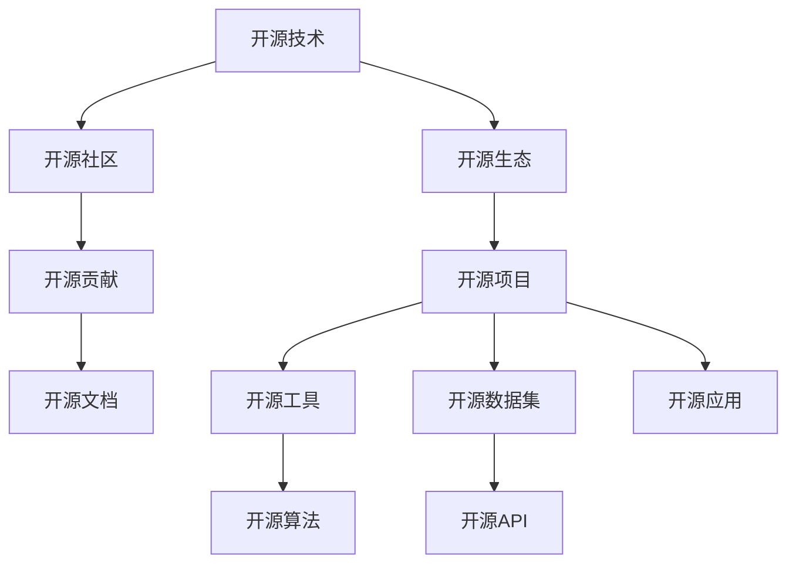

                 

## 1. 背景介绍

### 1.1 问题由来

在过去的几十年里，人工智能(AI)技术经历了突飞猛进的发展。从早期基于规则的专家系统到基于统计的机器学习，再到当前以深度学习为主的神经网络，AI领域取得了诸多重要的突破。开源技术的崛起，特别是软件和算法的开源化，为这些进步提供了强大的动力。

AI技术的进步离不开大规模数据的处理和分析，以及高效的算法实现。开源技术以其低成本、高灵活性和广泛可及性的特点，极大地促进了AI研究的普及和应用。

### 1.2 问题核心关键点

开源技术在推动AI进步中的作用主要体现在以下几个方面：

- **数据集和工具的开源共享**：开源数据集和算法库使得更多的研究者能够访问和使用高质量的数据，加速AI模型的训练和测试。
- **协作和社区效应**：开源平台促进了研究者之间的交流和合作，加快了研究成果的传播和应用。
- **快速迭代和创新**：开源生态使得算法和模型的快速迭代成为可能，推动了AI技术的快速进步。
- **降低研发成本**：开源技术的免费使用减少了企业研发和部署AI系统的成本。

## 2. 核心概念与联系

### 2.1 核心概念概述

为了更好地理解开源技术在AI进步中的作用，我们需要首先介绍几个核心概念：

- **开源技术(Open Source Technology)**：指软件、算法、数据等技术资源以公开的源代码和许可证形式发布，允许任何人使用、修改和共享。
- **开源社区(Open Source Community)**：由志愿者组成的软件和算法开发社区，他们共同维护和更新开源项目，推动技术进步。
- **开源生态(Open Source Ecosystem)**：包括开源工具、数据集、API、文档等资源和支持的开源社区共同构成的系统。
- **开源贡献(Open Source Contribution)**：开发者向开源项目提交代码、文档、测试等内容，推动项目的发展和改进。
- **开源项目(Open Source Project)**：由开源社区开发和维护的软件、算法等资源，供公众使用和改进。

这些概念之间的逻辑关系可以通过以下Mermaid流程图来展示：



这个流程图展示了我认为开源技术、开源社区、开源生态、开源项目、开源贡献之间的逻辑关系：

1. 开源技术是开源社区和开源生态的基础。
2. 开源社区维护和更新开源项目，提供持续的技术支持和改进。
3. 开源项目包括开源工具、数据集、算法等，供开源社区使用和改进。
4. 开源贡献是开源项目持续发展的动力，也是开源社区壮大和活跃的关键。
5. 开源工具、数据集、算法等为开源社区提供了丰富的资源和支持。
6. 开源应用是将开源技术落地应用的关键。

## 3. 核心算法原理 & 具体操作步骤
### 3.1 算法原理概述

开源技术在推动AI进步中的作用，很大程度上体现在开源算法和框架的广泛应用上。这些算法和框架通常基于学术研究和工程实践，经过开源社区的打磨和优化，在学术界和工业界都得到了广泛的应用。

例如，深度学习框架TensorFlow、PyTorch和Keras，以及机器学习框架Scikit-learn、MLlib，都是基于开源技术的代表作。这些框架提供了丰富的API和工具，使得开发者能够快速构建和训练AI模型，极大提高了科研和工程效率。

### 3.2 算法步骤详解

以TensorFlow为例，以下是使用TensorFlow进行深度学习模型的具体步骤：

**Step 1: 准备数据和环境**

1. 安装TensorFlow和相关依赖包：
```bash
pip install tensorflow
```

2. 导入必要的Python库：
```python
import tensorflow as tf
import numpy as np
```

**Step 2: 准备数据**

1. 加载和预处理数据集：
```python
(x_train, y_train), (x_test, y_test) = tf.keras.datasets.mnist.load_data()
x_train, x_test = x_train / 255.0, x_test / 255.0
```

**Step 3: 定义模型**

1. 创建并编译模型：
```python
model = tf.keras.models.Sequential([
    tf.keras.layers.Flatten(input_shape=(28, 28)),
    tf.keras.layers.Dense(128, activation='relu'),
    tf.keras.layers.Dropout(0.2),
    tf.keras.layers.Dense(10, activation='softmax')
])
model.compile(optimizer='adam', loss='sparse_categorical_crossentropy', metrics=['accuracy'])
```

**Step 4: 训练模型**

1. 训练模型：
```python
model.fit(x_train, y_train, epochs=5, validation_data=(x_test, y_test))
```

**Step 5: 评估和部署**

1. 评估模型：
```python
model.evaluate(x_test, y_test)
```

2. 保存模型：
```python
model.save('mnist_model.h5')
```

3. 加载和使用模型：
```python
new_model = tf.keras.models.load_model('mnist_model.h5')
```

**Step 6: 应用模型**

1. 预测新数据：
```python
new_data = np.array([[0.1, 0.2, 0.3, ..., 0.9]])
predictions = new_model.predict(new_data)
```

### 3.3 算法优缺点

使用开源深度学习框架进行AI模型开发，具有以下优点：

- **高效开发**：开源框架提供了丰富的API和工具，能够快速构建和训练复杂模型。
- **社区支持**：开源社区提供了大量的文档和示例代码，便于开发者学习和调试。
- **可移植性**：开源框架通常支持多种平台和设备，便于模型的跨平台部署。
- **资源丰富**：开源社区提供了大量的预训练模型和数据集，便于模型迁移学习。

同时，开源技术也存在一些缺点：

- **性能差异**：开源框架的性能表现可能与商业框架存在差异，特别是在大规模分布式训练方面。
- **安全性问题**：开源框架可能存在安全漏洞，需要开发者自行防范和修复。
- **依赖冲突**：开源框架的依赖管理可能较为复杂，容易引发依赖冲突。

## 4. 数学模型和公式 & 详细讲解 & 举例说明

### 4.1 数学模型构建

在深度学习中，数学模型通常基于神经网络架构。以下以神经网络为例，介绍基本的数学模型构建过程。

假设我们有输入向量 $x$ 和输出向量 $y$，神经网络模型 $f_\theta(x)$ 可以表示为：

$$
f_\theta(x) = \sum_{i=1}^{n} w_i x_i + b
$$

其中 $w_i$ 为权重，$b$ 为偏置。

对于训练集 $\{(x_1, y_1), (x_2, y_2), ..., (x_m, y_m)\}$，我们的目标是最小化损失函数 $L(f_\theta)$：

$$
L(f_\theta) = \frac{1}{m} \sum_{i=1}^{m} \ell(y_i, f_\theta(x_i))
$$

其中 $\ell$ 为损失函数，如均方误差、交叉熵等。

### 4.2 公式推导过程

以均方误差损失函数为例，其推导过程如下：

假设训练集大小为 $m$，输入向量为 $x_i$，期望输出为 $y_i$，实际输出为 $f_\theta(x_i)$，则均方误差损失函数为：

$$
L(f_\theta) = \frac{1}{m} \sum_{i=1}^{m} (y_i - f_\theta(x_i))^2
$$

对该损失函数求导，得到：

$$
\frac{\partial L(f_\theta)}{\partial w_i} = \frac{2}{m} \sum_{i=1}^{m} (y_i - f_\theta(x_i)) x_i
$$

通过反向传播算法，将梯度传递回模型，更新权重 $w_i$：

$$
w_i \leftarrow w_i - \eta \frac{\partial L(f_\theta)}{\partial w_i}
$$

其中 $\eta$ 为学习率。

### 4.3 案例分析与讲解

以神经网络在图像分类中的应用为例，以下是一个简单的神经网络模型：

```python
from tensorflow.keras import layers, models

model = models.Sequential()
model.add(layers.Dense(128, activation='relu', input_shape=(784,)))
model.add(layers.Dropout(0.2))
model.add(layers.Dense(10, activation='softmax'))

model.compile(optimizer='adam', loss='categorical_crossentropy', metrics=['accuracy'])
```

该模型由两个全连接层和一个输出层组成，使用ReLU激活函数和Dropout正则化。在训练过程中，我们通过反向传播算法不断更新权重，最小化损失函数：

```python
model.fit(train_images, train_labels, epochs=5, validation_data=(test_images, test_labels))
```

通过这种方式，我们可以高效地训练神经网络模型，进行图像分类等任务。

## 5. 项目实践：代码实例和详细解释说明
### 5.1 开发环境搭建

在进行开源AI项目实践前，我们需要准备好开发环境。以下是使用Python进行TensorFlow开发的安装和配置流程：

1. 安装Anaconda：从官网下载并安装Anaconda，用于创建独立的Python环境。

2. 创建并激活虚拟环境：
```bash
conda create -n tf-env python=3.8 
conda activate tf-env
```

3. 安装TensorFlow：根据CUDA版本，从官网获取对应的安装命令。例如：
```bash
conda install tensorflow tensorflow-gpu -c conda-forge
```

4. 安装必要的Python库：
```bash
pip install numpy matplotlib scikit-learn
```

完成上述步骤后，即可在`tf-env`环境中开始TensorFlow项目开发。

### 5.2 源代码详细实现

以下是使用TensorFlow进行图像分类任务的完整代码实现：

```python
from tensorflow.keras.datasets import mnist
from tensorflow.keras import layers, models
import matplotlib.pyplot as plt

# 加载数据集
(x_train, y_train), (x_test, y_test) = mnist.load_data()

# 数据预处理
x_train = x_train.reshape(-1, 28*28)
x_test = x_test.reshape(-1, 28*28)
x_train = x_train / 255.0
x_test = x_test / 255.0

# 构建模型
model = models.Sequential()
model.add(layers.Dense(128, activation='relu', input_shape=(784,)))
model.add(layers.Dropout(0.2))
model.add(layers.Dense(10, activation='softmax'))

# 编译模型
model.compile(optimizer='adam', loss='categorical_crossentropy', metrics=['accuracy'])

# 训练模型
model.fit(x_train, y_train, epochs=5, validation_data=(x_test, y_test))

# 评估模型
model.evaluate(x_test, y_test)

# 可视化
plt.imshow(x_train[0].reshape(28, 28), cmap='gray')
plt.show()
```

### 5.3 代码解读与分析

让我们再详细解读一下关键代码的实现细节：

**数据集加载和预处理**：
- `mnist.load_data()`：加载MNIST手写数字数据集。
- `x_train.reshape(-1, 28*28)`：将二维图像数据展平为一维向量。
- `x_train / 255.0`：将像素值归一化到[0,1]之间。

**模型构建和编译**：
- `model.add(layers.Dense(128, activation='relu', input_shape=(784,)))`：添加第一个全连接层，使用ReLU激活函数。
- `model.add(layers.Dropout(0.2))`：添加Dropout正则化，避免过拟合。
- `model.add(layers.Dense(10, activation='softmax'))`：添加输出层，使用softmax激活函数进行多分类。
- `model.compile(...)`：编译模型，指定优化器、损失函数和评估指标。

**模型训练和评估**：
- `model.fit(...)`：训练模型，指定训练集和验证集。
- `model.evaluate(...)`：评估模型，输出模型在测试集上的准确率。

**可视化**：
- `plt.imshow(...)`：使用Matplotlib可视化输入图像。

可以看到，TensorFlow提供了一系列的API和工具，使得构建和训练深度学习模型变得非常直观和高效。开发者可以利用这些API，快速实现复杂的神经网络模型。

## 6. 实际应用场景

### 6.1 智能推荐系统

智能推荐系统是AI在电商、内容平台等领域的重要应用之一。推荐系统通常需要处理大规模数据，进行复杂的多特征融合和模型训练。

开源技术在智能推荐系统中发挥了重要作用：

1. **数据处理**：使用开源数据处理工具，如Pandas、NumPy等，快速清洗和预处理数据。
2. **特征工程**：利用开源特征工程库，如scikit-learn、XGBoost等，进行特征选择和降维。
3. **模型训练**：使用TensorFlow、PyTorch等开源深度学习框架，训练推荐模型。
4. **在线预测**：使用TensorFlow Serving、Dask等开源服务框架，进行实时推荐预测。

例如，电商平台的推荐系统可以基于用户行为数据，使用神经网络模型进行特征嵌入和推荐排序，利用TensorFlow Serving进行实时推荐，为每个用户推荐个性化商品。

### 6.2 自然语言处理(NLP)

自然语言处理(NLP)是AI的另一重要应用领域。NLP涉及文本分析、情感分析、机器翻译等多个子任务，对数据和模型的处理要求较高。

开源技术在NLP中的应用非常广泛：

1. **数据预处理**：使用开源自然语言处理库，如NLTK、spaCy等，进行文本清洗和分词。
2. **特征提取**：利用开源特征提取工具，如Word2Vec、GloVe等，进行词嵌入和特征提取。
3. **模型训练**：使用开源深度学习框架，如TensorFlow、PyTorch等，训练NLP模型。
4. **模型部署**：使用TensorFlow Serving、Flask等开源服务框架，进行模型部署和接口调用。

例如，机器翻译系统可以使用Transformer模型，基于开源框架进行训练和部署，为多语言用户提供实时翻译服务。

### 6.3 智能医疗

智能医疗是AI在医疗领域的重要应用，涉及疾病诊断、医学影像分析、个性化治疗等多个子任务。

开源技术在智能医疗中的应用同样非常重要：

1. **数据获取**：使用开源医疗数据集，如MIMIC、ICU等，进行数据预处理和清洗。
2. **模型训练**：使用开源深度学习框架，如TensorFlow、PyTorch等，训练医疗模型。
3. **模型部署**：使用TensorFlow Serving、Kubernetes等开源服务框架，进行模型部署和实时应用。
4. **数据共享**：使用开源数据共享平台，如Google Colab、Kaggle等，共享医疗数据和研究成果。

例如，智能医疗系统可以使用深度学习模型进行疾病预测和影像分析，利用TensorFlow Serving进行实时预测和诊断，为医生提供辅助决策支持。

### 6.4 未来应用展望

随着AI技术的不断进步，开源技术在推动AI应用方面将发挥更加重要的作用。未来，开源AI技术的应用将更加广泛，具体展望如下：

1. **多模态融合**：开源技术将更好地支持多模态数据的融合，如图像、文本、语音等，构建更加全面、综合的AI系统。
2. **跨领域应用**：开源技术将拓展到更多领域，如金融、制造、交通等，推动各行各业智能化转型。
3. **实时应用**：开源技术将支持更高效的实时应用，如自动驾驶、智能家居等，提高用户体验和系统性能。
4. **边缘计算**：开源技术将支持边缘计算，实现数据本地化处理，降低带宽和延迟，提高系统效率。
5. **隐私保护**：开源技术将加强隐私保护，使用差分隐私等技术，保护用户数据安全。

## 7. 工具和资源推荐
### 7.1 学习资源推荐

为了帮助开发者系统掌握开源技术在AI中的应用，这里推荐一些优质的学习资源：

1. **深度学习与TensorFlow**系列博文：由TensorFlow官方博客提供，详细介绍了深度学习的基本概念和TensorFlow的使用。
2. **机器学习基础与实践**课程：由Coursera提供，由斯坦福大学Andrew Ng教授讲授，涵盖了机器学习的基本理论和实践。
3. **PyTorch官方文档**：PyTorch官方文档提供了丰富的API和教程，便于开发者学习和调试。
4. **TensorFlow教程**：TensorFlow官网提供了大量教程和示例代码，涵盖从基础到高级的多种应用场景。
5. **Kaggle竞赛**：Kaggle平台提供了大量的数据集和竞赛任务，鼓励开发者参与实战练习。

通过对这些资源的学习实践，相信你一定能够快速掌握开源技术在AI中的应用，并用于解决实际的AI问题。

### 7.2 开发工具推荐

高效的开发离不开优秀的工具支持。以下是几款用于AI开发常用的开源工具：

1. **TensorFlow**：Google开源的深度学习框架，支持多种编程语言和硬件平台，是当前最流行的AI开发工具。
2. **PyTorch**：Facebook开源的深度学习框架，灵活高效，广泛应用于学术研究和工业应用。
3. **Keras**：Google开源的高级神经网络API，易于使用，适合快速原型开发。
4. **scikit-learn**：Python开源的机器学习库，提供了多种经典机器学习算法和工具。
5. **NLTK**：Python开源的自然语言处理库，提供了丰富的文本处理功能。
6. **spaCy**：Python开源的自然语言处理库，提供了高效的分词、命名实体识别等功能。
7. **TensorBoard**：TensorFlow配套的可视化工具，可用于监控模型训练过程和结果。
8. **Weights & Biases**：模型训练实验跟踪工具，可以记录和可视化模型训练过程中的各项指标。

合理利用这些工具，可以显著提升AI开发和研究的效率，加快创新迭代的步伐。

### 7.3 相关论文推荐

开源技术在推动AI进步方面的研究不断取得突破，以下是几篇奠基性的相关论文，推荐阅读：

1. **Distributed TensorFlow**：Google的论文，介绍了分布式TensorFlow框架的设计和实现。
2. **TensorFlow Serving**：Google的论文，介绍了TensorFlow Serving服务框架的设计和实现。
3. **OpenAI Gym**：OpenAI的论文，介绍了Gym框架的设计和实现，支持分布式训练和强化学习研究。
4. **NLTK**：NLTK库的论文，介绍了NLTK库的设计和实现，提供了丰富的自然语言处理功能。
5. **Scikit-learn**：scikit-learn库的论文，介绍了Scikit-learn库的设计和实现，提供了多种机器学习算法和工具。

这些论文代表了大规模AI应用中的技术前沿，通过学习这些前沿成果，可以帮助研究者把握学科前进方向，激发更多的创新灵感。

## 8. 总结：未来发展趋势与挑战
### 8.1 总结

本文对开源技术在推动AI进步中的作用进行了全面系统的介绍。首先阐述了开源技术在数据集和工具共享、社区协作、快速迭代等方面的核心价值，明确了开源技术在AI发展中的重要性。其次，从原理到实践，详细讲解了开源算法和框架的应用过程，给出了开源AI项目开发的完整代码实例。同时，本文还广泛探讨了开源技术在智能推荐、自然语言处理、智能医疗等多个领域的应用前景，展示了开源技术的多样性和广泛性。最后，本文精选了开源技术的学习资源和工具推荐，力求为读者提供全方位的技术指引。

通过本文的系统梳理，可以看到，开源技术在推动AI进步中的作用不可忽视。开源技术的低成本、高灵活性和广泛可及性，极大地促进了AI研究的普及和应用，使得更多企业和研究者能够快速构建和部署高效的AI系统。未来，随着开源技术的不断演进和完善，相信AI技术将迎来更广泛的应用，为人类社会带来更深远的影响。

### 8.2 未来发展趋势

展望未来，开源技术在推动AI进步中的作用将呈现以下几个发展趋势：

1. **社区和生态系统不断壮大**：开源社区和生态系统将不断壮大，提供更丰富、更高效的技术资源，推动AI研究的广泛应用。
2. **跨领域融合更加深入**：开源技术将拓展到更多领域，如金融、制造、交通等，推动各行各业智能化转型。
3. **实时应用更加普及**：开源技术将支持更高效的实时应用，如自动驾驶、智能家居等，提高用户体验和系统性能。
4. **边缘计算得到广泛应用**：开源技术将支持边缘计算，实现数据本地化处理，降低带宽和延迟，提高系统效率。
5. **隐私保护和安全得到加强**：开源技术将加强隐私保护，使用差分隐私等技术，保护用户数据安全。
6. **模型和工具不断优化**：开源社区将不断优化和改进开源工具和算法，提高模型的性能和可解释性。

以上趋势凸显了开源技术在AI发展中的重要性。这些方向的探索发展，必将进一步提升AI技术的进步和应用范围，为人类社会的智能化转型带来深远影响。

### 8.3 面临的挑战

尽管开源技术在推动AI进步中发挥了重要作用，但在迈向更加智能化、普适化应用的过程中，它仍面临诸多挑战：

1. **开源项目的维护**：开源项目通常由志愿者维护，容易出现维护不及时、更新不一致等问题。
2. **社区的协作效率**：开源社区的协作效率往往受到多种因素的影响，如沟通成本、时间差等。
3. **性能瓶颈**：开源框架的性能表现可能与商业框架存在差异，特别是在大规模分布式训练方面。
4. **安全性问题**：开源框架可能存在安全漏洞，需要开发者自行防范和修复。
5. **依赖冲突**：开源框架的依赖管理可能较为复杂，容易引发依赖冲突。

这些挑战需要通过社区协作、技术改进和开发者参与等方式，不断加以克服，才能推动开源技术在AI进步中发挥更大的作用。

### 8.4 研究展望

面对开源技术在AI发展中面临的挑战，未来的研究需要在以下几个方面寻求新的突破：

1. **社区治理**：建立更加高效、透明的开源社区治理机制，确保开源项目的持续发展和更新。
2. **跨领域应用**：拓展开源技术在更多领域的应用，推动AI技术的广泛普及和应用。
3. **实时应用支持**：开发更高效的实时应用支持，如自动驾驶、智能家居等，提升用户体验和系统性能。
4. **隐私保护和安全**：使用差分隐私等技术，加强开源技术在隐私保护和安全性方面的能力。
5. **模型优化**：优化开源工具和算法的性能，提高模型的性能和可解释性。

这些研究方向将进一步推动开源技术在AI进步中的作用，为人类社会带来更广泛、更深刻的变革。

## 9. 附录：常见问题与解答

**Q1：开源技术在AI应用中的优势有哪些？**

A: 开源技术在AI应用中的优势主要体现在以下几个方面：

- **低成本**：开源技术免费使用，显著降低了企业研发和部署AI系统的成本。
- **高灵活性**：开源工具和框架易于定制和优化，支持多种应用场景。
- **社区支持**：开源社区提供了丰富的文档、教程和示例，便于开发者学习和调试。
- **开源社区的协同效应**：开源社区促进了研究者之间的交流和合作，加快了科技成果的传播和应用。
- **多样性和选择**：开源技术提供了多种选择，开发者可以根据需求选择最合适的工具和框架。

**Q2：如何处理开源项目中的依赖冲突？**

A: 处理开源项目中的依赖冲突，可以通过以下几种方式：

- **明确依赖关系**：在项目中明确列出所有依赖包及其版本，减少冲突的概率。
- **使用虚拟环境**：使用虚拟环境（如Anaconda）隔离项目环境，避免不同项目之间的依赖冲突。
- **使用依赖管理工具**：使用依赖管理工具（如pip、Maven），自动解决依赖冲突。
- **版本兼容性**：使用兼容不同版本的工具和框架，避免使用过时的库。

**Q3：开源技术在AI应用中需要注意哪些安全性问题？**

A: 开源技术在AI应用中需要注意以下安全性问题：

- **数据隐私保护**：使用差分隐私等技术，保护用户数据安全。
- **模型鲁棒性**：使用对抗训练等技术，提高模型鲁棒性和抗干扰能力。
- **安全漏洞修复**：及时更新开源工具和框架，修复已知的安全漏洞。
- **访问控制**：使用访问控制技术，限制对敏感数据和模型的访问权限。

**Q4：如何利用开源技术进行高效的数据预处理？**

A: 利用开源技术进行高效的数据预处理，可以通过以下几种方式：

- **使用开源数据处理工具**：如Pandas、NumPy等，快速清洗和预处理数据。
- **利用开源特征工程库**：如scikit-learn、XGBoost等，进行特征选择和降维。
- **自动化数据处理**：使用AutoML工具（如H2O.ai、Hyperopt），自动进行数据处理和特征工程。

**Q5：如何选择合适的开源框架进行AI开发？**

A: 选择合适的开源框架进行AI开发，可以从以下几个方面考虑：

- **项目需求**：根据项目需求选择合适的框架，如深度学习任务可以使用TensorFlow或PyTorch，机器学习任务可以使用scikit-learn等。
- **社区支持和文档**：选择社区活跃、文档丰富的开源框架，便于开发者学习和调试。
- **性能表现**：选择性能表现良好的开源框架，确保模型训练和推理的高效性。
- **工具链和生态系统**：选择工具链丰富、生态系统完善的开源框架，便于后期扩展和维护。

通过合理选择和应用开源技术，可以显著提升AI开发的效率和质量，推动AI技术的不断进步。

---

作者：禅与计算机程序设计艺术 / Zen and the Art of Computer Programming

