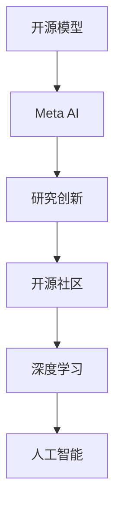

                 

# 开源模型优势：促进研究创新，开源社区受益Meta支持

> 关键词：开源模型,Meta AI,研究创新,学术合作,开源社区,深度学习,人工智能

## 1. 背景介绍

### 1.1 问题由来
在过去十年里，人工智能尤其是深度学习领域取得了巨大的突破。这一进步很大程度上得益于开源模型和开源社区的蓬勃发展。这些开源模型和开源社区不仅极大地降低了科研和开发的门槛，促进了知识的快速传播，还催生了新的研究方法和应用场景，极大地推动了AI技术的商业化和普及。

### 1.2 问题核心关键点
开源模型及开源社区的核心优势在于其资源共享、易用性、协作性、透明性和快速迭代。Meta AI作为全球领先的人工智能研究机构，不仅在开源模型上投入巨大，更是通过多种方式支持和促进了开源社区的发展，提升了研究创新能力。

### 1.3 问题研究意义
研究开源模型及其在开源社区中的作用，不仅有助于理解开源模型如何促进研究创新和产业应用，还可以洞察Meta AI在支持开源社区中的实践经验和未来发展方向，从而为相关研究者和开发者提供参考和指导。

## 2. 核心概念与联系

### 2.1 核心概念概述

为更好地理解开源模型在开源社区中的作用，本节将介绍几个关键概念：

- **开源模型(Open Source Model)**：指由开发者共享的模型代码和参数，任何人可以自由下载、使用、修改和分享。这些模型通常由大型企业和研究机构发布，涵盖了从计算机视觉到自然语言处理等多种AI任务。

- **Meta AI**：Facebook AI的研究部门，专注于深度学习和人工智能的各个方面，包括计算机视觉、自然语言处理、机器人、虚拟现实和增强现实等。

- **研究创新**：指通过新技术、新方法和新应用，推动某一领域的进展和突破。开源模型和开源社区为研究创新提供了便捷的协作平台和丰富的数据资源。

- **开源社区**：指基于开源理念组织起来的开发者社区，社区成员共享资源、交流思想、合作开发，构建了一个庞大的、活力的、持续迭代的开发生态系统。

- **深度学习**：指一种基于神经网络的机器学习方法，通过多层神经网络学习输入数据的深层特征表示，广泛应用于计算机视觉、自然语言处理、语音识别等领域。

- **人工智能(AI)**：涵盖了机器学习、计算机视觉、自然语言处理、机器人技术等多个领域，旨在让机器模拟人类的智能行为。

这些核心概念之间的逻辑关系可以通过以下Mermaid流程图来展示：



这个流程图展示了几者之间的关系：

1. Meta AI发布开源模型，为研究创新提供了工具。
2. 开源模型在开源社区中传播，促进了研究创新。
3. 研究创新推动了深度学习的发展。
4. 深度学习是人工智能的重要分支。

## 3. 核心算法原理 & 具体操作步骤
### 3.1 算法原理概述

Meta AI在开源模型及开源社区的支持上，主要通过以下三个方面促进研究创新：

1. **资源共享**：提供高质量的开源模型和数据集，降低了研究和开发门槛，加快了知识传播和应用推广。
2. **社区协作**：通过组织研讨会、发布研究论文、提供技术支持等方式，促进开发者之间的协作和交流。
3. **技术交流**：提供最新的技术进展和研究成果，推动社区成员对前沿技术的探索和应用。

这些支持手段在开源模型和开源社区中形成了良性循环，极大地促进了研究创新和技术进步。

### 3.2 算法步骤详解

Meta AI支持开源社区的方式，包括以下几个关键步骤：

**Step 1: 发布高质量的开源模型**
Meta AI定期发布最新的研究模型，如ResNet、BERT、GPT-3等，并提供详细的文档和教程，供开发者下载和使用。这些模型通常经过精心调参，具备较高的准确率和泛化能力。

**Step 2: 提供丰富的数据集**
为确保模型能够在各种应用场景中表现良好，Meta AI发布大量的数据集，包括图像、音频、文本等。这些数据集经过精心标注，适合用于模型的训练和测试。

**Step 3: 组织学术活动和会议**
Meta AI定期组织和资助各类学术活动和会议，如NeurIPS、ICML等，促进研究者之间的交流与合作。这些活动不仅提供了展示研究成果的平台，还为新兴研究者提供了学习和成长的机会。

**Step 4: 提供技术支持和指导**
Meta AI通过设置社区邮箱、建立技术讨论群等方式，为社区成员提供技术支持，解答疑问，指导开发。此外，Meta AI还提供了模型部署和推理支持，降低模型的应用门槛。

**Step 5: 推广最新的研究成果**
Meta AI在顶级会议和期刊上发布研究论文，并通过技术博客、社交媒体等渠道宣传，推动研究成果的传播和应用。

### 3.3 算法优缺点

Meta AI在支持开源社区的过程中，带来了以下优点：

1. **促进知识传播**：高质量的开源模型和数据集，使得更多人可以轻松地进行科研和开发，加速了知识的传播和创新。
2. **降低开发门槛**：提供详细的使用文档和教程，降低了开发者学习和使用的难度，加快了技术普及。
3. **提高协作效率**：组织学术活动和会议，促进了研究者之间的交流和合作，提高了研究创新的效率。
4. **推动技术进步**：通过提供最新的技术进展和研究成果，推动了社区成员对前沿技术的探索和应用。

同时，Meta AI的支持手段也存在以下局限：

1. **数据偏见问题**：部分开源模型可能存在数据偏见，影响其在其他领域的应用。
2. **资源分配不均**：高质量的开源模型和数据集往往集中在少数研究机构手中，可能导致资源分配不均。
3. **缺乏个性化支持**：Meta AI提供的大多数支持是通用的，可能无法满足特定研究或应用的个性化需求。

尽管存在这些局限，但Meta AI在开源模型及开源社区的支持上，已经取得了显著的成效，为研究创新和产业发展做出了重要贡献。

### 3.4 算法应用领域

Meta AI支持开源社区的方法，广泛应用于以下几个领域：

1. **计算机视觉**：提供了如ResNet等经典模型和大量标注数据集，推动了计算机视觉领域的研究和应用。
2. **自然语言处理**：发布了如BERT、GPT-3等强大的语言模型，推动了文本分类、机器翻译、情感分析等任务的进展。
3. **语音识别**：提供了语音处理模型和数据集，推动了语音识别、语音合成等技术的发展。
4. **机器人技术**：通过提供机器人控制模型和数据集，促进了机器人导航、交互等技术的研究。
5. **增强现实**：发布了增强现实相关模型和工具，推动了虚拟现实和增强现实技术的应用。

这些应用领域覆盖了人工智能的多个分支，展现了Meta AI在开源模型及开源社区中的重要影响力。

## 4. 数学模型和公式 & 详细讲解 & 举例说明

### 4.1 数学模型构建

Meta AI在开源模型及开源社区的支持中，也采用了多种数学模型进行理论分析。以下是几个常见的数学模型：

- **损失函数**：用于衡量模型输出与真实标签之间的差异，常见的损失函数包括交叉熵损失、均方误差损失等。
- **优化算法**：用于更新模型参数，使得损失函数最小化，常见的优化算法包括随机梯度下降、Adam等。
- **泛化误差**：用于衡量模型在新数据上的表现，常见的泛化误差包括测试误差、均方误差等。

### 4.2 公式推导过程

以**交叉熵损失函数**为例，推导其数学表达式：

$$
\ell = -\frac{1}{N} \sum_{i=1}^N y_i \log \hat{y}_i + (1-y_i) \log (1-\hat{y}_i)
$$

其中，$y_i$为真实标签，$\hat{y}_i$为模型预测输出，$N$为样本数量。交叉熵损失函数用于衡量模型对二分类问题的预测效果。

### 4.3 案例分析与讲解

Meta AI在发布BERT模型时，提供了详细的文档和使用教程，帮助开发者理解模型原理和使用方法。以BERT模型为例，其数学模型和推导过程如下：

1. **预训练任务**：BERT模型通过在大规模无标签文本数据上进行预训练，学习到丰富的语言表示，包括词嵌入、句嵌入等。

2. **微调任务**：在预训练模型的基础上，通过在特定任务上微调，学习到任务相关的知识。

3. **优化目标**：最小化损失函数，使得模型输出逼近真实标签。

通过这些数学模型和推导过程，Meta AI帮助开发者更好地理解和使用开源模型，促进了模型的应用和创新。

## 5. 项目实践：代码实例和详细解释说明
### 5.1 开发环境搭建

在进行开源模型项目实践前，我们需要准备好开发环境。以下是使用Python进行TensorFlow开发的环境配置流程：

1. 安装Anaconda：从官网下载并安装Anaconda，用于创建独立的Python环境。

2. 创建并激活虚拟环境：
```bash
conda create -n tf-env python=3.8 
conda activate tf-env
```

3. 安装TensorFlow：根据CUDA版本，从官网获取对应的安装命令。例如：
```bash
conda install tensorflow=2.8 -c conda-forge
```

4. 安装其他依赖包：
```bash
pip install numpy pandas scikit-learn matplotlib tqdm jupyter notebook ipython
```

完成上述步骤后，即可在`tf-env`环境中开始开源模型的项目实践。

### 5.2 源代码详细实现

下面我们以自然语言处理任务为例，给出使用TensorFlow进行模型微调的PyTorch代码实现。

首先，定义自然语言处理任务的数据处理函数：

```python
import tensorflow as tf
from tensorflow.keras.preprocessing.text import Tokenizer
from tensorflow.keras.preprocessing.sequence import pad_sequences
from tensorflow.keras.layers import Embedding, LSTM, Dense

def preprocess_text(texts, max_len):
    tokenizer = Tokenizer()
    tokenizer.fit_on_texts(texts)
    sequences = tokenizer.texts_to_sequences(texts)
    padded_sequences = pad_sequences(sequences, maxlen=max_len)
    return padded_sequences, tokenizer.word_index

# 加载数据集
train_texts, train_labels = load_train_data()
dev_texts, dev_labels = load_dev_data()
test_texts, test_labels = load_test_data()

# 数据预处理
train_X, train_y = preprocess_text(train_texts, max_len=128)
dev_X, dev_y = preprocess_text(dev_texts, max_len=128)
test_X, test_y = preprocess_text(test_texts, max_len=128)

# 模型定义
model = tf.keras.models.Sequential([
    Embedding(len(tokenizer.word_index) + 1, 128, input_length=max_len),
    LSTM(64, return_sequences=True),
    LSTM(64),
    Dense(10, activation='softmax')
])
```

然后，定义模型和优化器：

```python
from tensorflow.keras.optimizers import Adam

# 模型编译
model.compile(loss='categorical_crossentropy', optimizer=Adam(learning_rate=0.001), metrics=['accuracy'])

# 模型训练
model.fit(train_X, train_y, epochs=10, batch_size=32, validation_data=(dev_X, dev_y))
```

最后，评估和部署模型：

```python
# 模型评估
test_loss, test_acc = model.evaluate(test_X, test_y, verbose=0)
print('Test loss:', test_loss)
print('Test accuracy:', test_acc)

# 模型部署
model.save('saved_model.h5')
```

以上是一个简单的自然语言处理任务的代码实现。可以看到，借助TensorFlow的Keras API，开发者可以轻松构建和训练模型，促进了模型的快速开发和部署。

### 5.3 代码解读与分析

让我们再详细解读一下关键代码的实现细节：

**数据预处理函数**：
- `preprocess_text`方法：将文本数据转换为序列，并进行定长padding，确保输入序列长度一致。

**模型定义**：
- `Sequential`模型：通过堆叠多个Keras层，定义了一个简单的LSTM模型。
- `Embedding`层：将输入的整数序列转换为词嵌入向量。
- `LSTM`层：通过多层LSTM网络，学习文本序列的语义表示。
- `Dense`层：将LSTM的输出映射到分类数，使用softmax函数进行概率分布输出。

**模型编译**：
- `compile`方法：定义模型的损失函数、优化器和评估指标，并准备训练。

**模型训练**：
- `fit`方法：在训练集上进行模型的训练，同时使用验证集评估模型性能，并记录训练日志。

**模型评估和部署**：
- `evaluate`方法：在测试集上评估模型性能，输出损失和精度指标。
- `save`方法：将模型保存为HDF5格式，便于后续部署和使用。

可以看到，TensorFlow通过Keras API，大大简化了模型的定义、训练和评估过程，为开发者提供了便捷的开发体验。

## 6. 实际应用场景
### 6.1 智能客服系统

基于开源模型的智能客服系统，可以广泛应用于金融、电商、医疗等行业。Meta AI通过提供预训练的对话模型和任务适配层，帮助企业快速构建智能客服系统，提升客户服务体验和效率。

在技术实现上，Meta AI的对话模型在多种数据集上进行了微调，具备高度的泛化能力和灵活性，能够理解复杂的客户需求，并生成自然流畅的回复。系统接入Meta AI提供的API和文档，便可以实现自动化的客户服务，降低企业运营成本，提高客户满意度。

### 6.2 金融舆情监测

Meta AI在开源模型及开源社区的支持下，开发了多种金融舆情监测工具。通过接入金融领域的预训练模型，系统能够实时监测舆情动态，识别负面新闻和舆论风险，帮助金融机构提前预警和应对。

Meta AI的模型在股票市场、债券市场、外汇市场等多个金融领域进行了广泛应用，帮助金融机构实现了更高效、更智能的风险管理和市场预测。

### 6.3 个性化推荐系统

Meta AI通过开源模型及开源社区，推动了个性化推荐技术的发展。Meta AI的推荐模型在电商、社交媒体等领域进行了大量研究，开发了多种推荐算法，能够根据用户行为和偏好，推荐更加精准和多样化的商品和内容。

Meta AI的推荐模型不仅在数据处理和特征提取上进行了优化，还通过开源社区不断积累和分享研究成果，推动了个性化推荐技术的应用和创新。

### 6.4 未来应用展望

随着开源模型和开源社区的发展，Meta AI在支持研究创新方面将发挥更大的作用。未来，Meta AI在开源模型及开源社区的支持上，将呈现以下几个发展趋势：

1. **数据规模扩大**：随着数据收集和标注技术的进步，开源模型将积累更多的数据资源，提升模型的泛化能力和性能。
2. **技术演进加速**：Meta AI将不断发布最新的研究成果和模型，推动社区成员对前沿技术的探索和应用。
3. **跨领域融合**：Meta AI的模型将与其他领域的开源模型进行深度融合，实现多模态信息处理，推动跨领域技术的发展。
4. **协同开发加强**：Meta AI将进一步加强与开源社区的协作，通过共同开发项目，提升社区成员的合作效率和创新能力。
5. **应用场景拓展**：Meta AI的模型将应用于更多垂直行业，推动各行业数字化转型升级。

Meta AI在开源模型及开源社区的支持上，已经取得了显著的成效，未来仍有很大的发展空间和潜在的创新机会。

## 7. 工具和资源推荐
### 7.1 学习资源推荐

为了帮助开发者系统掌握开源模型及其应用，这里推荐一些优质的学习资源：

1. TensorFlow官方文档：提供详细的API文档和教程，帮助开发者理解和使用TensorFlow。
2. PyTorch官方文档：提供深度学习模型的开发和训练方法，支持自然语言处理、计算机视觉等多个领域。
3. Keras官方文档：提供简单易用的模型构建和训练方法，适合初学者快速上手。
4. Coursera深度学习课程：由顶级大学和专家开设的深度学习课程，系统介绍深度学习的理论和实践。
5. Udacity深度学习纳米学位：提供深度学习的实战训练，涵盖模型构建、训练、优化等多个方面。

通过对这些资源的学习实践，相信你一定能够快速掌握开源模型的开发和应用方法，并在实际项目中取得优异的成果。

### 7.2 开发工具推荐

高效的开发离不开优秀的工具支持。以下是几款用于开源模型及开源社区开发的常用工具：

1. GitHub：GitHub提供代码托管和版本控制服务，是开源社区不可或缺的开发工具。
2. Jupyter Notebook：Jupyter Notebook提供交互式的开发环境，支持Python、R等多个编程语言。
3. TensorBoard：TensorBoard提供可视化工具，可以实时监测模型训练状态和性能，帮助开发者调试和优化模型。
4. Google Colab：Google Colab提供免费的GPU/TPU算力，方便开发者快速实验最新模型。
5. PyCharm：PyCharm是Python开发的主要IDE，提供了丰富的开发工具和调试功能。

合理利用这些工具，可以显著提升开源模型的开发效率，加快创新迭代的步伐。

### 7.3 相关论文推荐

Meta AI在开源模型及开源社区的研究上，取得了多项重要成果。以下是几篇奠基性的相关论文，推荐阅读：

1. Deep Residual Learning for Image Recognition：提出ResNet模型，大幅度提升了深度卷积神经网络的性能。
2. Attention Is All You Need：提出Transformer模型，开创了基于自注意力机制的深度学习范式。
3. BERT: Pre-training of Deep Bidirectional Transformers for Language Understanding：提出BERT模型，推动了自然语言处理领域的深度学习研究。
4. GPT-3: Language Models are Unsupervised Multitask Learners：推出GPT-3模型，展示了大规模预训练语言模型的强大能力。

这些论文代表了大语言模型及开源社区的发展脉络，阅读这些论文可以帮助研究者把握学科前进方向，激发更多的创新灵感。

## 8. 总结：未来发展趋势与挑战
### 8.1 研究成果总结

Meta AI在开源模型及开源社区的研究和应用上，取得了显著的成果。这些成果不仅推动了深度学习领域的发展，还促进了AI技术的商业化和普及。Meta AI通过提供高质量的开源模型和数据集，降低了科研和开发的门槛，加快了知识传播和创新。

### 8.2 未来发展趋势

展望未来，开源模型及开源社区的发展将呈现以下几个趋势：

1. **社区规模扩大**：随着越来越多的人参与开源社区，社区规模将不断扩大，创新能力将进一步提升。
2. **技术迭代加速**：开源社区的快速迭代和反馈机制，将推动技术不断进步和优化。
3. **应用场景丰富**：开源模型将在更多垂直行业得到应用，推动各行业数字化转型升级。
4. **跨领域融合**：开源模型将与其他领域的开源模型进行深度融合，实现多模态信息处理，推动跨领域技术的发展。

### 8.3 面临的挑战

尽管开源模型及开源社区的发展前景广阔，但也面临一些挑战：

1. **数据资源不足**：开源模型依赖高质量的数据资源，数据收集和标注成本高，可能成为制约发展的重要因素。
2. **技术标准不统一**：开源社区中的技术标准和接口可能不一致，增加了跨平台开发的难度。
3. **知识产权问题**：开源社区中的技术成果可能存在知识产权争议，影响社区的稳定发展。
4. **隐私和安全问题**：开源模型可能包含敏感数据，如何保护用户隐私和数据安全，是社区需要解决的重要问题。

### 8.4 研究展望

Meta AI在开源模型及开源社区的支持上，仍需面对和解决这些挑战。未来的研究方向包括：

1. **数据共享机制**：建立更加公平和高效的数据共享机制，确保数据资源的广泛传播和利用。
2. **标准化协议**：制定统一的技术标准和接口协议，提高开源模型的可互操作性和易用性。
3. **隐私保护技术**：采用先进的隐私保护技术，保护用户隐私和数据安全。
4. **伦理和法规研究**：加强对开源社区中的伦理和法规研究，确保技术的健康发展。

Meta AI在开源模型及开源社区的支持上，将继续发挥其重要作用，推动AI技术的创新和发展。通过面对和解决这些挑战，未来开源社区必将迎来更大的发展机遇。

## 9. 附录：常见问题与解答

**Q1：开源模型与闭源模型的区别是什么？**

A: 开源模型是开放源代码的模型，任何人都可以自由下载、使用、修改和分享。而闭源模型则是商业模型，源代码和模型参数不公开，只提供有限的API接口，使用成本较高。

**Q2：如何选择合适的开源模型？**

A: 选择开源模型时，需要考虑模型的准确性、泛化能力、训练效率、可解释性、社区支持等因素。通常可以从官方文档、GitHub仓库、学术研究论文等渠道获取模型信息，评估其适用性。

**Q3：开源模型对隐私和安全有什么影响？**

A: 开源模型中可能包含敏感数据和算法，如果未进行合理的保护，可能会带来隐私和安全问题。开发者需要在使用开源模型时，采取相应的隐私保护和数据安全措施。

**Q4：开源模型是否适用于所有应用场景？**

A: 开源模型适用于多种应用场景，但在某些特定领域，如医疗、法律等，可能无法完全适应。此时需要在特定领域语料上进一步预训练，再进行微调，才能获得理想效果。

**Q5：Meta AI如何支持开源社区？**

A: Meta AI通过发布高质量的开源模型和数据集，组织学术活动和会议，提供技术支持和指导，推广最新的研究成果等方式，支持开源社区的发展。

通过本文的系统梳理，可以看到，Meta AI在开源模型及开源社区的支持上，已经取得了显著的成效，为研究创新和产业发展做出了重要贡献。面对未来的挑战，Meta AI将继续发挥其重要作用，推动开源模型及开源社区的健康发展。

---

作者：禅与计算机程序设计艺术 / Zen and the Art of Computer Programming

