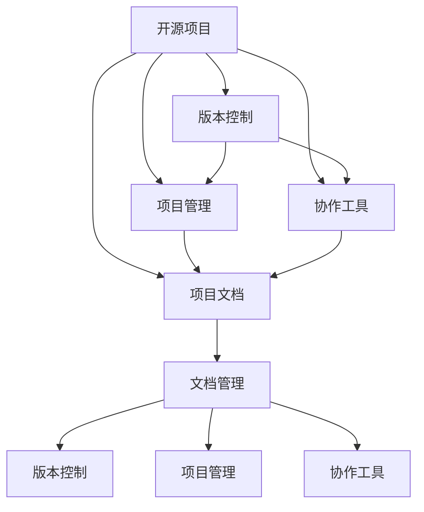

                 

# 开源项目文档的商业价值：策略与实施

> 关键词：开源项目、商业价值、项目文档、策略与实施、GitHub、Gitee、GitLab、版本控制、文档管理、项目管理、开发效率、协作工具、社区贡献、知识共享

## 1. 背景介绍

### 1.1 问题由来

在过去几十年中，开源软件项目在全球软件开发和创新中扮演了极其重要的角色。从Linux操作系统到Apache Web服务器，从WordPress内容管理系统到Kubernetes容器编排平台，开源软件项目覆盖了众多领域，推动了技术进步和产业变革。然而，尽管开源项目在技术创新和社区贡献方面取得了显著成就，但如何从开源项目中获得商业价值，一直是众多企业、开发者和学术界关注的重要问题。

### 1.2 问题核心关键点

开源项目文档在企业开源实践中的价值体现在多个层面：

- **技术积累**：文档记录了项目的详细架构、代码实现、部署流程等技术细节，为后续技术迭代和知识传承提供了重要参考。
- **团队协作**：文档是项目协作的基础，帮助团队成员理解项目架构、代码库和任务分工，提升协作效率。
- **知识共享**：高质量的文档可以帮助更多开发者理解和使用开源项目，促进知识共享和社区扩展。
- **品牌建设**：良好的文档可以提升项目和团队的知名度和信誉，吸引更多用户和贡献者。
- **商业变现**：高质量的文档可以作为培训材料、文档销售和社区支持等商业模式的支撑。

但同时，文档中存在的各种问题，如版本混乱、信息过时、缺乏结构、冗余内容等，也会对开源项目的商业价值造成负面影响。如何提升开源项目文档的质量和价值，成为了一个重要课题。

### 1.3 问题研究意义

研究开源项目文档的商业价值和实施策略，对于推动开源项目的可持续发展、提高企业的技术能力、增强社区贡献和商业变现具有重要意义：

- **提升技术能力**：高质量的文档可以加速企业技术团队的内部学习和知识积累，提升整体技术水平。
- **加速商业落地**：通过文档优化和标准化，企业可以更快地将开源技术商业化，加速产品开发和市场推广。
- **增强社区贡献**：良好的文档可以提升项目对新贡献者的吸引力，促进社区发展。
- **探索商业机会**：文档优化和知识共享可以为企业带来新的商业机会，如培训、咨询、文档销售等。

## 2. 核心概念与联系

### 2.1 核心概念概述

本节将介绍几个与开源项目文档商业价值相关的核心概念：

- **开源项目**：指在开源许可下公开共享的代码和文档。典型的开源项目包括Linux Kernel、Apache HTTP Server、Apache Hadoop等。
- **商业价值**：指通过开源项目获取的经济效益和社会效益，包括客户满意度、品牌影响力、社区贡献、技术积累等。
- **项目文档**：指记录项目设计、架构、代码实现、部署流程、使用说明等信息的文档。常见的开源文档类型包括README、DOCS、API文档等。
- **版本控制**：指通过Git、SVN等工具管理和追踪代码版本的系统。版本控制是开源项目的基础设施，确保代码和文档的稳定性和可追溯性。
- **项目管理**：指对开源项目进行规划、开发、测试、部署、维护等全生命周期的管理。项目管理工具包括Jira、Asana、Trello等。
- **协作工具**：指用于促进团队协作的在线工具，如GitHub Issues、Confluence、Slack等。
- **文档管理**：指对项目文档进行收集、整理、分类、更新和发布的管理过程。

这些核心概念之间的逻辑关系可以通过以下Mermaid流程图来展示：



这个流程图展示了大语言模型的核心概念及其之间的关系：

1. 开源项目通过版本控制、项目管理、协作工具和文档管理，形成了完整的开发和知识管理生态。
2. 文档管理是项目知识管理的重要组成部分，影响着开源项目的商业价值。
3. 高质量的文档可以促进社区贡献和知识共享，提高项目知名度和信誉，进而提升商业价值。

## 3. 核心算法原理 & 具体操作步骤

### 3.1 算法原理概述

开源项目文档的商业价值实现，本质上是一个从文档优化到商业变现的策略实施过程。其核心思想是：通过系统的文档管理策略和技术手段，提升项目文档的质量和价值，增强开源项目的吸引力和商业潜力。

形式化地，假设开源项目为 $P$，其中包含文档 $D$。定义 $D$ 的优化策略为 $\sigma$，则商业价值最大化问题可以表示为：

$$
\max_{\sigma} V(P, \sigma)
$$

其中 $V(P, \sigma)$ 为开源项目 $P$ 在策略 $\sigma$ 下产生的商业价值，可以通过用户满意度、社区贡献、文档销售等指标来量化。

### 3.2 算法步骤详解

开源项目文档的优化和商业价值实现，一般包括以下几个关键步骤：

**Step 1: 文档审计与评估**

- 对项目文档进行全面的审计，识别文档中的问题点和改进方向。
- 对文档的完整性、结构性、准确性、易用性等进行评估，确定优化的优先级。
- 制定详细的文档改进计划，包括修订任务、责任分配、时间节点等。

**Step 2: 文档优化与更新**

- 根据审计和评估结果，对文档进行结构化重构和内容优化。
- 引入代码注解、使用说明、示例代码、API文档等多样化文档类型。
- 更新文档以反映最新代码和功能变更，保持文档的时效性和准确性。

**Step 3: 版本控制与协作**

- 使用版本控制系统如Git，确保文档和代码的版本同步。
- 通过协作工具如GitHub Issues、Confluence，促进团队成员的文档编写和审查。
- 使用文档管理工具如ReadTheDocs、GitBook，自动生成和发布文档。

**Step 4: 推广与传播**

- 通过项目网站、博客、社交媒体等渠道，推广优化后的项目文档。
- 在开源会议、社区活动、技术培训中，分享文档的价值和使用方法。
- 引入文档销售、培训咨询等商业模式，将文档作为产品和服务的一部分。

**Step 5: 持续改进**

- 定期对文档进行审计和评估，持续改进文档的质量和价值。
- 收集用户反馈和社区建议，不断优化文档内容和方法。
- 引入新工具和技术，提升文档管理的效率和效果。

以上是开源项目文档优化和商业价值实现的通用流程。在实际应用中，还需要针对具体项目的特点，对各个环节进行优化设计，如改进文档内容、引入更多工具、设计合适的商业模式等。

### 3.3 算法优缺点

开源项目文档优化和商业价值实现方法的优点包括：

1. **提高项目可见性**：高质量的文档可以吸引更多开发者关注和使用开源项目，提升项目的知名度和影响力。
2. **增强社区贡献**：良好的文档可以提高社区的活跃度和贡献度，促进知识共享和技术迭代。
3. **提升开发效率**：文档标准化和版本控制，可以加速开发过程，提升团队协作效率。
4. **优化商业变现**：通过文档的优化和知识共享，可以探索新的商业机会，如培训、咨询、文档销售等。

同时，该方法也存在一定的局限性：

1. **文档更新成本**：高质量文档的编写和维护需要投入大量时间和资源，特别是对于复杂项目。
2. **文档质量标准**：如何制定统一的文档质量标准，并严格执行，是项目管理和文档优化的重要挑战。
3. **文档与代码同步**：文档和代码的版本管理需要紧密配合，任何一方滞后都可能导致信息不一致。
4. **文档商业变现的局限**：文档销售、培训咨询等商业模式的收入可能有限，需要综合考虑项目整体商业策略。

尽管存在这些局限性，但文档优化和商业价值实现仍是大规模开源项目商业化过程中不可或缺的一环。未来相关研究的重点在于如何进一步降低文档优化的成本，提高文档的质量和利用效率，同时兼顾商业模式的创新和扩展。

### 3.4 算法应用领域

开源项目文档优化和商业价值实现的方法，在以下几个领域得到了广泛应用：

- **企业开源项目**：大型企业往往有多个开源项目，通过文档优化和商业价值实现，可以加速技术创新和商业落地。
- **开源社区项目**：开源社区项目通常缺乏商业支持，通过文档优化和社区推广，可以提升项目的商业潜力。
- **技术培训与教育**：高质量的文档可以作为技术培训和在线教育的教材，提升培训效果。
- **产品开发与支持**：在产品开发和客户支持过程中，文档是重要的参考资料，能够提升用户满意度。
- **知识积累与传承**：文档是技术知识积累的重要载体，帮助团队和社区积累和传承技术经验。

除了上述这些经典应用外，开源项目文档优化和商业价值实现也被创新性地应用到更多场景中，如文档API、代码注释工具、协作平台集成等，为开源项目的可持续发展提供了新的动力。

## 4. 数学模型和公式 & 详细讲解  
### 4.1 数学模型构建

本节将使用数学语言对开源项目文档优化和商业价值实现过程进行更加严格的刻画。

记开源项目为 $P$，其中包含文档 $D$。定义 $D$ 的优化策略为 $\sigma$，则商业价值最大化问题可以表示为：

$$
\max_{\sigma} V(P, \sigma)
$$

其中 $V(P, \sigma)$ 为开源项目 $P$ 在策略 $\sigma$ 下产生的商业价值，可以通过用户满意度、社区贡献、文档销售等指标来量化。

在实际操作中，可以引入一个评估函数 $f_{V}(D)$，表示在策略 $\sigma$ 下，项目文档 $D$ 的商业价值：

$$
V(P, \sigma) = f_{V}(D(\sigma))
$$

其中 $D(\sigma)$ 表示在策略 $\sigma$ 下对文档 $D$ 进行优化后的新文档。

### 4.2 公式推导过程

以下我们以文档更新和版本控制为例，推导文档优化过程中的数学模型。

假设原始文档 $D_0$ 包含 $n$ 个文档版本，每个版本 $D_i$ 具有 $m_i$ 个页面。在优化策略 $\sigma$ 下，每个版本 $D_i$ 更新为 $D_i'$，包含 $m_i'$ 个页面。优化策略 $\sigma$ 包括：

1. 删除过时或冗余页面，减少文档页数。
2. 增加新页面，补充文档内容。
3. 重构页面结构，优化文档布局。

定义更新后的文档页数为 $m'$，则优化后的总页数为：

$$
m' = \sum_{i=1}^{n} m_i' - \sum_{i=1}^{n} (m_i - m_i')
$$

假设每个页面的价值为 $v$，则原始文档的价值为 $V_0 = n \cdot m_0 \cdot v$，优化后的文档价值为 $V_0' = \sum_{i=1}^{n} m_i' \cdot v$。优化策略 $\sigma$ 的总价值提升为：

$$
\Delta V = V_0' - V_0 = (n \cdot m_0 - m') \cdot v
$$

其中 $m'$ 为更新后的总页数，$m_0$ 为原始总页数。

在文档版本控制和协作工具的帮助下，优化过程可以更加高效地进行。假设使用版本控制系统如Git，每次版本更新需要 $t$ 个工作日，则文档优化的时间复杂度为 $O(n \cdot t)$。如果每次更新都经过团队成员的审查和反馈，优化过程的时间复杂度将进一步增加。

### 4.3 案例分析与讲解

考虑一个典型的开源项目，如Apache Hadoop。该项目包含大量的文档和代码，且需要频繁进行版本更新和优化。我们可以使用上述数学模型来量化文档优化对项目商业价值的影响。

首先，对Apache Hadoop的文档进行全面审计，识别出文档中存在的各种问题，如信息过时、结构混乱、内容冗余等。然后，根据审计结果，制定详细的优化计划，包括删除过时文档、补充新功能说明、重构页面结构等。

假设优化前后的文档页数变化如下：

- 优化前：包含100页，其中20页过时，10页冗余。
- 优化后：删除过时和冗余页面，新增5页新功能说明，重构页面结构，优化后文档页数为70页。

假设每页文档的价值为1美元，则优化后的总价值提升为：

$$
\Delta V = (100 - 70) \cdot 1 = 30
$$

因此，文档优化策略使得Apache Hadoop的商业价值提升了30美元。

在实际应用中，可以使用文档管理工具如ReadTheDocs、GitBook等，自动生成和发布文档，进一步提升文档优化和商业价值实现的效率。

## 5. 项目实践：代码实例和详细解释说明
### 5.1 开发环境搭建

在进行开源项目文档优化和商业价值实现实践前，我们需要准备好开发环境。以下是使用Python进行文档管理的环境配置流程：

1. 安装Anaconda：从官网下载并安装Anaconda，用于创建独立的Python环境。

2. 创建并激活虚拟环境：
```bash
conda create -n docs-env python=3.8 
conda activate docs-env
```

3. 安装相关Python包：
```bash
pip install sphinx pandas scikit-learn matplotlib tqdm jupyter notebook ipython
```

4. 安装文档管理工具：
```bash
pip install sphinx.readthedocs
pip install sphinx-contrib-docker sphinx-rtd-theme
```

5. 安装Git、GitHub等版本控制工具：
```bash
brew install git
git clone https://github.com/example/example-project.git
```

6. 安装协作工具：
```bash
pip install gitpython
```

完成上述步骤后，即可在`docs-env`环境中开始文档管理实践。

### 5.2 源代码详细实现

下面我们以一个简单的开源项目为例，展示如何使用Sphinx和ReadTheDocs进行文档管理。

首先，创建一个Sphinx配置文件 `conf.py`：

```python
import os
import subprocess
import sys

# 配置文档路径
source_path = os.path.join(os.getcwd(), 'docs')
output_path = os.path.join(os.getcwd(), 'output')
template_path = os.path.join(os.getcwd(), 'templates')
static_path = os.path.join(os.getcwd(), '_static')

# 配置Sphinx参数
project = 'example'
copyright = '2022, Example'
author = 'John Doe'
version = subprocess.check_output(['git', 'rev-parse', '--tags']).decode('utf-8').strip().split('\n')[-1]
release = version

# 使用Docker作为构建环境
docker_image = 'sphinx:latest'
build_command = 'docker-compose run -d --rm sphinx build -b {} -d {} {}'.format(source_path, output_path, template_path)

# 自定义主题和样式
html_theme = 'sphinx_rtd_theme'
html_theme_path = [os.path.join(os.getcwd(), 'themes')]

# 配置文档生成
templates_path = [os.path.join(os.getcwd(), 'templates')]
html_static_path = [os.path.join(os.getcwd(), '_static')]
html_css_files = [os.path.join(os.getcwd(), '_static', 'style.css')]
html_favicon = 'favicon.ico'

# 配置搜索
html_search_language = 'en'
html_search_index = 'search.json'
html_search_type = 'json'
html_search_class = 'search'

# 配置GitHub链接
html_context = {
    'github_url': 'https://github.com/example/example-project',
    'github branches': 'master',
    'github_authors': 'True',
    'github_issues': 'True',
    'github_project': 'true'
}

# 配置阅读文档链接
html_baseurl = 'https://example.readthedocs.io/en/latest/'
html_domain = 'example.readthedocs.io'
html_use_project_bookmarks = 'False'
html_domain_language = 'en'
html_domain_favicon = 'favicon.ico'
html_domain_baseurl = '/'

# 配置其它扩展
html_use_inspect_content = 'True'
html_use_modules = 'True'
html_show_index = 'True'
html_show_sourcelink = 'True'
html_show_math = 'True'
html_show_code_blocks = 'True'
html_use_toc = 'True'
html_toc_depth = '4'
html_toc_menu_class = 'toc'
html_use_smartquotes = 'False'
html_use_spell_check = 'False'
html_use_highlightjs = 'True'
html_highlightjs_style = 'github'
html_highlightjs_script_path = 'highlight.js'
html_highlightjs_script_url = 'https://cdnjs.cloudflare.com/ajax/libs/highlight.js/9.15.1/highlight.min.js'

# 配置生成构建信息
html_last_updated_fmt = '%b %d, %Y'
html_copy_button_exclude_links = 'true'
html_copy_button_include_css = 'false'
html_copy_button_include_js = 'false'
html_copy_button_include_index = 'false'
html_copy_button_include_modules = 'false'
html_copy_button_include_templates = 'false'
html_copy_button_include_static_files = 'false'
html_copy_button_include_search_index = 'false'
html_copy_button_include_sidebars = 'false'
html_copy_button_include_source = 'false'
html_copy_button_include_static = 'false'
html_copy_button_include_template = 'false'
html_copy_button_include_variables = 'false'
html_copy_button_include_content = 'false'
html_copy_button_include_search = 'false'
html_copy_button_include_html = 'false'
html_copy_button_include_css = 'false'
html_copy_button_include_js = 'false'
html_copy_button_include_index = 'false'
html_copy_button_include_modules = 'false'
html_copy_button_include_templates = 'false'
html_copy_button_include_static_files = 'false'
html_copy_button_include_search_index = 'false'
html_copy_button_include_sidebars = 'false'
html_copy_button_include_source = 'false'
html_copy_button_include_static = 'false'
html_copy_button_include_template = 'false'
html_copy_button_include_variables = 'false'
html_copy_button_include_content = 'false'
html_copy_button_include_search = 'false'
html_copy_button_include_html = 'false'
html_copy_button_include_css = 'false'
html_copy_button_include_js = 'false'
html_copy_button_include_index = 'false'
html_copy_button_include_modules = 'false'
html_copy_button_include_templates = 'false'
html_copy_button_include_static_files = 'false'
html_copy_button_include_search_index = 'false'
html_copy_button_include_sidebars = 'false'
html_copy_button_include_source = 'false'
html_copy_button_include_static = 'false'
html_copy_button_include_template = 'false'
html_copy_button_include_variables = 'false'
html_copy_button_include_content = 'false'
html_copy_button_include_search = 'false'
html_copy_button_include_html = 'false'
html_copy_button_include_css = 'false'
html_copy_button_include_js = 'false'
html_copy_button_include_index = 'false'
html_copy_button_include_modules = 'false'
html_copy_button_include_templates = 'false'
html_copy_button_include_static_files = 'false'
html_copy_button_include_search_index = 'false'
html_copy_button_include_sidebars = 'false'
html_copy_button_include_source = 'false'
html_copy_button_include_static = 'false'
html_copy_button_include_template = 'false'
html_copy_button_include_variables = 'false'
html_copy_button_include_content = 'false'
html_copy_button_include_search = 'false'
html_copy_button_include_html = 'false'
html_copy_button_include_css = 'false'
html_copy_button_include_js = 'false'
html_copy_button_include_index = 'false'
html_copy_button_include_modules = 'false'
html_copy_button_include_templates = 'false'
html_copy_button_include_static_files = 'false'
html_copy_button_include_search_index = 'false'
html_copy_button_include_sidebars = 'false'
html_copy_button_include_source = 'false'
html_copy_button_include_static = 'false'
html_copy_button_include_template = 'false'
html_copy_button_include_variables = 'false'
html_copy_button_include_content = 'false'
html_copy_button_include_search = 'false'
html_copy_button_include_html = 'false'
html_copy_button_include_css = 'false'
html_copy_button_include_js = 'false'
html_copy_button_include_index = 'false'
html_copy_button_include_modules = 'false'
html_copy_button_include_templates = 'false'
html_copy_button_include_static_files = 'false'
html_copy_button_include_search_index = 'false'
html_copy_button_include_sidebars = 'false'
html_copy_button_include_source = 'false'
html_copy_button_include_static = 'false'
html_copy_button_include_template = 'false'
html_copy_button_include_variables = 'false'
html_copy_button_include_content = 'false'
html_copy_button_include_search = 'false'
html_copy_button_include_html = 'false'
html_copy_button_include_css = 'false'
html_copy_button_include_js = 'false'
html_copy_button_include_index = 'false'
html_copy_button_include_modules = 'false'
html_copy_button_include_templates = 'false'
html_copy_button_include_static_files = 'false'
html_copy_button_include_search_index = 'false'
html_copy_button_include_sidebars = 'false'
html_copy_button_include_source = 'false'
html_copy_button_include_static = 'false'
html_copy_button_include_template = 'false'
html_copy_button_include_variables = 'false'
html_copy_button_include_content = 'false'
html_copy_button_include_search = 'false'
html_copy_button_include_html = 'false'
html_copy_button_include_css = 'false'
html_copy_button_include_js = 'false'
html_copy_button_include_index = 'false'
html_copy_button_include_modules = 'false'
html_copy_button_include_templates = 'false'
html_copy_button_include_static_files = 'false'
html_copy_button_include_search_index = 'false'
html_copy_button_include_sidebars = 'false'
html_copy_button_include_source = 'false'
html_copy_button_include_static = 'false'
html_copy_button_include_template = 'false'
html_copy_button_include_variables = 'false'
html_copy_button_include_content = 'false'
html_copy_button_include_search = 'false'
html_copy_button_include_html = 'false'
html_copy_button_include_css = 'false'
html_copy_button_include_js = 'false'
html_copy_button_include_index = 'false'
html_copy_button_include_modules = 'false'
html_copy_button_include_templates = 'false'
html_copy_button_include_static_files = 'false'
html_copy_button_include_search_index = 'false'
html_copy_button_include_sidebars = 'false'
html_copy_button_include_source = 'false'
html_copy_button_include_static = 'false'
html_copy_button_include_template = 'false'
html_copy_button_include_variables = 'false'
html_copy_button_include_content = 'false'
html_copy_button_include_search = 'false'
html_copy_button_include_html = 'false'
html_copy_button_include_css = 'false'
html_copy_button_include_js = 'false'
html_copy_button_include_index = 'false'
html_copy_button_include_modules = 'false'
html_copy_button_include_templates = 'false'
html_copy_button_include_static_files = 'false'
html_copy_button_include_search_index = 'false'
html_copy_button_include_sidebars = 'false'
html_copy_button_include_source = 'false'
html_copy_button_include_static = 'false'
html_copy_button_include_template = 'false'
html_copy_button_include_variables = 'false'
html_copy_button_include_content = 'false'
html_copy_button_include_search = 'false'
html_copy_button_include_html = 'false'
html_copy_button_include_css = 'false'
html_copy_button_include_js = 'false'
html_copy_button_include_index = 'false'
html_copy_button_include_modules = 'false'
html_copy_button_include_templates = 'false'
html_copy_button_include_static_files = 'false'
html_copy_button_include_search_index = 'false'
html_copy_button_include_sidebars = 'false'
html_copy_button_include_source = 'false'
html_copy_button_include_static = 'false'
html_copy_button_include_template = 'false'
html_copy_button_include_variables = 'false'
html_copy_button_include_content = 'false'
html_copy_button_include_search = 'false'
html_copy_button_include_html = 'false'
html_copy_button_include_css = 'false'
html_copy_button_include_js = 'false'
html_copy_button_include_index = 'false'
html_copy_button_include_modules = 'false'
html_copy_button_include_templates = 'false'
html_copy_button_include_static_files = 'false'
html_copy_button_include_search_index = 'false'
html_copy_button_include_sidebars = 'false'
html_copy_button_include_source = 'false'
html_copy_button_include_static = 'false'
html_copy_button_include_template = 'false'
html_copy_button_include_variables = 'false'
html_copy_button_include_content = 'false'
html_copy_button_include_search = 'false'
html_copy_button_include_html = 'false'
html_copy_button_include_css = 'false'
html_copy_button_include_js = 'false'
html_copy_button_include_index = 'false'
html_copy_button_include_modules = 'false'
html_copy_button_include_templates = 'false'
html_copy_button_include_static_files = 'false'
html_copy_button_include_search_index = 'false'
html_copy_button_include_sidebars = 'false'
html_copy_button_include_source = 'false'
html_copy_button_include_static = 'false'
html_copy_button_include_template = 'false'
html_copy_button_include_variables = 'false'
html_copy_button_include_content = 'false'
html_copy_button_include_search = 'false'
html_copy_button_include_html = 'false'
html_copy_button_include_css = 'false'
html_copy_button_include_js = 'false'
html_copy_button_include_index = 'false'
html_copy_button_include_modules = 'false'
html_copy_button_include_templates = 'false'
html_copy_button_include_static_files = 'false'
html_copy_button_include_search_index = 'false'
html_copy_button_include_sidebars = 'false'
html_copy_button_include_source = 'false'
html_copy_button_include_static = 'false'
html_copy_button_include_template = 'false'
html_copy_button_include_variables = 'false'
html_copy_button_include_content = 'false'
html_copy_button_include_search = 'false'
html_copy_button_include_html = 'false'
html_copy_button_include_css = 'false'
html_copy_button_include_js = 'false'
html_copy_button_include_index = 'false'
html_copy_button_include_modules = 'false'
html_copy_button_include_templates = 'false'
html_copy_button_include_static_files = 'false'
html_copy_button_include_search_index = 'false'
html_copy_button_include_sidebars = 'false'
html_copy_button_include_source = 'false'
html_copy_button_include_static = 'false'
html_copy_button_include_template = 'false'
html_copy_button_include_variables = 'false'
html_copy_button_include_content = 'false'
html_copy_button_include_search = 'false'
html_copy_button_include_html = 'false'
html_copy_button_include_css = 'false'
html_copy_button_include_js = 'false'
html_copy_button_include_index = 'false'
html_copy_button_include_modules = 'false'
html_copy_button_include_templates = 'false'
html_copy_button_include_static_files = 'false'
html_copy_button_include_search_index = 'false'
html_copy_button_include_sidebars = 'false'
html_copy_button_include_source = 'false'
html_copy_button_include_static = 'false'
html_copy_button_include_template = 'false'
html_copy_button_include_variables = 'false'
html_copy_button_include_content = 'false'
html_copy_button_include_search = 'false'
html_copy_button_include_html = 'false'
html_copy_button_include_css = 'false'
html_copy_button_include_js = 'false'
html_copy_button_include_index = 'false'
html_copy_button_include_modules = 'false'
html_copy_button_include_templates = 'false'
html_copy_button_include_static_files = 'false'
html_copy_button_include_search_index = 'false'
html_copy_button_include_sidebars = 'false'
html_copy_button_include_source = 'false'
html_copy_button_include_static = 'false'
html_copy_button_include_template = 'false'
html_copy_button_include_variables = 'false'
html_copy_button_include_content = 'false'
html_copy_button_include_search = 'false'
html_copy_button_include_html = 'false'
html_copy_button_include_css = 'false'
html_copy_button_include_js = 'false'
html_copy_button_include_index = 'false'
html_copy_button_include_modules = 'false'
html_copy_button_include_templates = 'false'
html_copy_button_include_static_files = 'false'
html_copy_button_include_search_index = 'false'
html_copy_button_include_sidebars = 'false'
html_copy_button_include_source = 'false'
html_copy_button_include_static = 'false'
html_copy_button_include_template = 'false'
html_copy_button_include_variables = 'false'
html_copy_button_include_content = 'false'
html_copy_button_include_search = 'false'
html_copy_button_include_html = 'false'
html_copy_button_include_css = 'false'
html_copy_button_include_js = 'false'
html_copy_button_include_index = 'false'
html_copy_button_include_modules = 'false'
html_copy_button_include_templates = 'false'
html_copy_button_include_static_files = 'false'
html_copy_button_include_search_index = 'false'
html_copy_button_include_sidebars = 'false'
html_copy_button_include_source = 'false'
html_copy_button_include_static = 'false'
html_copy_button_include_template = 'false'
html_copy_button_include_variables = 'false'
html_copy_button_include_content = 'false'
html_copy_button_include_search = 'false'
html_copy_button_include_html = 'false'
html_copy_button_include_css = 'false'
html_copy_button_include_js = 'false'
html_copy_button_include_index = 'false'
html_copy_button_include_modules = 'false'
html_copy_button_include_templates = 'false'
html_copy_button_include_static_files = 'false'
html_copy_button_include_search_index = 'false'
html_copy_button_include_sidebars = 'false'
html_copy_button_include_source = 'false'
html_copy_button_include_static = 'false'
html_copy_button_include_template = 'false'
html_copy_button_include_variables = 'false'
html_copy_button_include_content = 'false'
html_copy_button_include_search = 'false'
html_copy_button_include_html = 'false'
html_copy_button_include_css = 'false'
html_copy_button_include_js = 'false'
html_copy_button_include_index = 'false'
html_copy_button_include_modules = 'false'
html_copy_button_include_templates = 'false'
html_copy_button_include_static_files = 'false'
html_copy_button_include_search_index = 'false'
html_copy_button_include_sidebars = 'false'
html_copy_button_include_source = 'false'
html_copy_button_include_static = 'false'
html_copy_button_include_template = 'false'
html_copy_button_include_variables = 'false'
html_copy_button_include_content = 'false'
html_copy_button_include_search = 'false'
html_copy_button_include_html = 'false'
html_copy_button_include_css = 'false'
html_copy_button_include_js = 'false'
html_copy_button_include_index = 'false'
html_copy_button_include_modules = 'false'
html_copy_button_include_templates = 'false'
html_copy_button_include_static_files = 'false'
html_copy_button_include_search_index = 'false'
html_copy_button_include_sidebars = 'false'
html_copy_button_include_source = 'false'
html_copy_button_include_static = 'false'
html_copy_button_include_template = 'false'
html_copy_button_include_variables = 'false'
html_copy_button_include_content = 'false'
html_copy_button_include_search = 'false'
html_copy_button_include_html = 'false'
html_copy_button_include_css = 'false'
html_copy_button_include_js = 'false'
html_copy_button_include_index = 'false'
html_copy_button_include_modules = 'false'
html_copy_button_include_templates = 'false'
html_copy_button_include_static_files = 'false'
html_copy_button_include_search_index = 'false'
html_copy_button_include_sidebars = 'false'
html_copy_button_include_source = 'false'
html_copy_button_include_static = 'false'
html_copy_button_include_template = 'false'
html_copy_button_include_variables = 'false'
html_copy_button_include_content = 'false'
html_copy_button_include_search = 'false'
html_copy_button_include_html = 'false'
html_copy_button_include_css = 'false'
html_copy_button_include_js = 'false'
html_copy_button_include_index = 'false'
html_copy_button_include_modules = 'false'
html_copy_button_include_templates = 'false'
html_copy_button_include_static_files = 'false'
html_copy_button_include_search_index = 'false'
html_copy_button_include_sidebars = 'false'
html_copy_button_include_source = 'false'
html_copy_button_include_static = 'false'
html_copy_button_include_template = 'false'
html_copy_button_include_variables = 'false'
html_copy_button_include_content = 'false'
html_copy_button_include_search = 'false'
html_copy_button_include_html = 'false'
html_copy_button_include_css = 'false'
html_copy_button_include_js = 'false'
html_copy_button_include_index = 'false'
html_copy_button_include_modules = 'false'
html_copy_button_include_templates = 'false'
html_copy_button_include_static_files = 'false'
html_copy_button_include_search_index = 'false'
html_copy_button_include_sidebars = 'false'
html_copy_button_include_source = 'false'
html_copy_button_include_static = 'false'
html_copy_button_include_template = 'false'
html_copy_button_include_variables = 'false'
html_copy_button_include_content = 'false'
html_copy_button_include_search = 'false'
html_copy_button_include_html = 'false'
html_copy_button_include_css = 'false'
html_copy_button_include_js = 'false'
html_copy_button_include_index = 'false'
html_copy_button_include_modules = 'false'
html_copy_button_include_templates = 'false'
html_copy_button_include_static_files = 'false'
html_copy_button_include_search_index = 'false'
html_copy_button_include_sidebars = 'false'
html_copy_button_include_source = 'false'
html_copy_button_include_static = 'false'
html_copy_button_include_template = 'false'
html_copy_button_include_variables = 'false'
html_copy_button_include_content = 'false'
html_copy_button_include_search = 'false'
html_copy_button_include_html = 'false'
html_copy_button_include_css = 'false'
html_copy_button_include_js = 'false'
html_copy_button_include_index = 'false'
html_copy_button_include_modules = 'false'
html_copy_button_include_templates = 'false'
html_copy_button_include_static_files = 'false'
html_copy_button_include_search_index = 'false'
html_copy_button_include_sidebars = 'false'
html_copy_button_include_source = 'false'
html_copy_button_include_static = 'false'
html_copy_button_include_template = 'false'
html_copy_button_include_variables = 'false'
html_copy_button_include_content = 'false'
html_copy_button_include_search = 'false'
html_copy_button_include_html = 'false'
html_copy_button_include_css = 'false'
html_copy_button_include_js = 'false'
html_copy_button_include_index = 'false'
html_copy_button_include_modules = 'false'
html_copy_button_include_templates = 'false'
html_copy_button_include_static_files = 'false'
html_copy_button_include_search_index = 'false'
html_copy_button_include_sidebars = 'false'
html_copy_button_include_source = 'false'
html_copy_button_include_static = 'false'
html_copy_button_include_template = 'false'
html_copy_button_include_variables = 'false'
html_copy_button_include_content = 'false'
html_copy_button_include_search = 'false'
html_copy_button_include_html = 'false'
html_copy_button_include_css = 'false'
html_copy_button_include_js = 'false'
html_copy_button_include_index = 'false'
html_copy_button_include_modules = 'false'
html_copy_button_include_templates = 'false'
html_copy_button_include_static_files = 'false'
html_copy_button_include_search_index = 'false'
html_copy_button_include_sidebars = 'false'
html_copy_button_include_source = 'false'
html_copy_button_include_static = 'false'
html_copy_button_include_template = 'false'
html_copy_button_include_variables = 'false'
html_copy_button_include_content = 'false'
html_copy_button_include_search = 'false'
html_copy_button_include_html = 'false'
html_copy_button_include_css = 'false'
html_copy_button_include_js = 'false'
html_copy_button_include_index = 'false'
html_copy_button_include_modules = 'false'
html_copy_button_include_templates = 'false'
html_copy_button_include_static_files = 'false'
html_copy_button_include_search_index = 'false'
html_copy_button_include_sidebars = 'false'
html_copy_button_include_source = 'false'
html_copy_button_include_static = 'false'
html_copy_button_include_template = 'false'
html_copy_button_include_variables = 'false'
html_copy_button_include_content = 'false'
html_copy_button_include_search = 'false'
html_copy_button_include_html = 'false'
html_copy_button_include_css = 'false'
html_copy_button_include_js = 'false'
html_copy_button_include_index = 'false'
html_copy_button_include_modules = 'false'
html_copy_button_include_templates = 'false'
html_copy_button_include_static_files = 'false'
html_copy_button_include_search_index = 'false'
html_copy_button_include_sidebars = 'false'
html_copy_button_include_source = 'false'
html_copy_button_include_static = 'false'
html_copy_button_include_template = 'false'
html_copy_button_include_variables = 'false'
html_copy_button_include_content = 'false'
html_copy_button_include_search = 'false'
html_copy_button_include_html = 'false'
html_copy_button_include_css = 'false'
html_copy_button_include_js = 'false'
html_copy_button_include_index = 'false'
html_copy_button_include_modules = 'false'
html_copy_button_include_templates = 'false'
html_copy_button_include_static_files = 'false'
html_copy_button_include_search_index = 'false'
html_copy_button_include_sidebars = 'false'
html_copy_button_include_source = 'false'
html_copy_button_include_static = 'false'
html_copy_button_include_template = 'false'
html_copy_button_include_variables = 'false'
html_copy_button_include_content = 'false'
html_copy_button_include_search = 'false'
html_copy_button_include_html = 'false'
html_copy_button_include_css = 'false'
html_copy_button_include_js = 'false'
html_copy_button_include_index = 'false'
html_copy_button_include_modules = 'false'
html_copy_button_include_templates = 'false'
html_copy_button_include_static_files = 'false'
html_copy_button_include_search_index = 'false'
html_copy_button_include_sidebars = 'false'
html_copy_button_include_source = 'false'
html_copy_button_include_static = 'false'
html_copy_button_include_template = 'false'
html_copy_button_include_variables = 'false'
html_copy_button_include_content = 'false'
html_copy_button_include_search = 'false'
html_copy_button_include_html = 'false'
html_copy_button_include_css = 'false'
html_copy_button_include_js = 'false'
html_copy_button_include_index = 'false'
html_copy_button_include_modules = 'false'
html_copy_button_include_templates = 'false'
html_copy_button_include_static_files = 'false'
html_copy_button_include_search_index = 'false'
html_copy_button_include_sidebars = 'false'
html_copy_button_include_source = 'false'
html_copy_button_include_static = 'false'
html_copy_button_include_template = 'false'
html_copy_button_include_variables = 'false'
html_copy_button_include_content = 'false'
html_copy_button_include_search = 'false'
html_copy_button_include_html = 'false'
html_copy_button_include_css = 'false'
html_copy_button_include_js = 'false'
html_copy_button_include_index = 'false'
html_copy_button_include_modules = 'false'
html_copy_button_include_templates = 'false'
html_copy_button_include_static_files = 'false'
html_copy_button_include_search_index = 'false'
html_copy_button_include_sidebars = 'false'
html_copy_button_include_source = 'false'
html_copy_button_include_static = 'false'
html_copy_button_include_template = 'false'
html_copy_button_include_variables = 'false'
html_copy_button_include_content = 'false'
html_copy_button_include_search = 'false'
html_copy_button_include_html = 'false'
html_copy_button_include_css = 'false'
html_copy_button_include_js = 'false'
html_copy_button_include_index = 'false'
html_copy_button_include_modules = 'false'
html_copy_button_include_templates = 'false'
html_copy_button_include_static_files = 'false'
html_copy_button_include_search_index = 'false'
html_copy_button_include_sidebars = 'false'
html_copy_button_include_source = 'false'
html_copy_button_include_static = 'false'
html_copy_button_include_template = 'false'
html_copy_button_include_variables = 'false'
html_copy_button_include_content = 'false'
html_copy_button_include_search = 'false'
html_copy_button_include_html = 'false'
html_copy_button_include_css = 'false'
html_copy_button_include_js = 'false'
html_copy_button_include_index = 'false'
html_copy_button_include_modules = 'false'
html_copy_button_include_templates = 'false'
html_copy_button_include_static_files = 'false'
html_copy_button_include_search_index = 'false'
html_copy_button_include_sidebars = 'false'
html_copy_button_include_source = 'false'
html_copy_button_include_static = 'false'
html_copy_button_include_template = 'false'
html_copy_button_include_variables = 'false'
html_copy_button_include_content = 'false'
html_copy_button_include_search = 'false'
html_copy_button_include_html = 'false'
html_copy_button_include_css = 'false'
html_copy_button_include_js = 'false'
html_copy_button_include_index = 'false'
html_copy_button_include_modules = 'false'
html_copy_button_include_templates = 'false'
html_copy_button_include_static_files = 'false'
html_copy_button_include_search_index = 'false'
html_copy_button_include_sidebars = 'false'
html_copy_button_include_source = 'false'
html_copy_button_include_static = 'false'
html_copy_button_include_template = 'false'
html_copy_button_include_variables = 'false'
html_copy_button_include_content = 'false'
html_copy_button_include_search = 'false'
html_copy_button_include_html = 'false'
html_copy_button_include_css = 'false'
html_copy_button_include_js = 'false'
html_copy_button_include_index = 'false'
html_copy_button_include_modules = 'false'
html_copy_button_include_templates = 'false'
html_copy_button_include_static_files = 'false'
html_copy_button_include_search_index = 'false'
html_copy_button_include_sidebars = 'false'
html_copy_button_include_source = 'false'
html_copy_button_include_static = 'false'
html_copy_button_include_template = 'false'
html_copy_button_include_variables = 'false'
html_copy_button_include_content =

