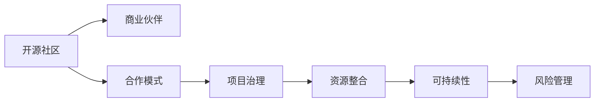

                 

# 开源项目的商业伙伴计划：结构和管理

> 关键词：开源社区,商业伙伴,合作模式,项目治理,资源整合

## 1. 背景介绍

### 1.1 问题由来

随着开源项目在软件开发和创新中扮演越来越重要的角色，许多公司和组织开始寻求与开源项目建立商业伙伴关系，以利用其创新能力和市场影响力。然而，这种伙伴关系并非一帆风顺。如何在开源社区和商业公司之间建立起高效、透明、可持续的合作关系，成为项目组织者和参与者共同面临的挑战。

### 1.2 问题核心关键点

在探讨开源项目的商业伙伴计划时，我们需要关注以下几个核心问题：

- **伙伴关系的性质**：是官方合作、战略联盟还是松散协作？
- **治理结构的建立**：谁来制定决策？如何保证各方利益？
- **资源整合的途径**：如何有效整合商业资源与开源贡献？
- **可持续性**：如何确保伙伴关系的长期价值？
- **风险管理**：如何处理潜在的利益冲突与不确定性？

## 2. 核心概念与联系

### 2.1 核心概念概述

为更好地理解开源项目商业伙伴计划的结构和管理，我们首先需要介绍几个关键概念：

- **开源社区**：由开发者、贡献者和使用者组成的生态系统，建立在共享代码、文档和知识的理念上。
- **商业伙伴**：寻求利用开源项目带来的创新和技术，并与之合作的公司或组织。
- **合作模式**：开源项目与商业伙伴之间建立的正式或非正式的合作关系。
- **项目治理**：管理开源项目的策略、决策过程和资源分配，确保项目的健康和可持续性。
- **资源整合**：将开源社区的创新成果与商业伙伴的技术、市场和资金资源相结合，实现共赢。

这些概念之间有着紧密的联系。合作模式的选择直接影响到项目治理结构的设计，而资源整合的途径则涉及具体的执行策略和团队协作。治理结构的有效性决定了商业伙伴计划的成功与否，而资源整合则直接关系到项目的市场竞争力和可持续性。

### 2.2 核心概念原理和架构的 Mermaid 流程图(Mermaid 流程节点中不要有括号、逗号等特殊字符)

## 3. 核心算法原理 & 具体操作步骤

### 3.1 算法原理概述

开源项目的商业伙伴计划，本质上是一种特殊的合作模式，旨在通过整合开源社区和商业伙伴的资源与知识，推动项目的持续发展和市场应用。其核心算法原理可概括为：

1. **需求匹配**：识别开源项目和商业伙伴的共同需求和目标，建立合作基础。
2. **资源互补**：分析双方的优势资源，制定资源整合方案。
3. **利益对齐**：通过合同、协议等形式，明确合作各方的权利和义务，建立信任机制。
4. **项目治理**：建立决策、执行和监督机制，确保合作顺利进行。
5. **风险管理**：制定风险识别、评估和应对策略，保障合作顺利进行。

### 3.2 算法步骤详解

开源项目商业伙伴计划的详细步骤可如下所述：

**Step 1: 需求分析**

- 对开源项目和商业伙伴的需求进行详细分析，确定共同目标和预期成果。
- 识别双方的核心资源和能力，评估潜在的合作价值。

**Step 2: 模式选择**

- 根据双方的需求、资源和文化特点，选择合适的合作模式。
- 制定合作框架和计划，明确合作的范围和深度。

**Step 3: 资源整合**

- 分析双方的优势资源，制定资源整合策略。
- 建立资源共享机制，如代码库、文档、测试资源等。

**Step 4: 利益对齐**

- 通过合同、协议等法律文件，明确合作各方的权利和义务。
- 设立合理的收益分配和激励机制，保障合作双方利益。

**Step 5: 项目治理**

- 建立决策、执行和监督机制，确保项目顺利进行。
- 设立项目管理委员会或核心团队，负责项目的日常管理和决策。

**Step 6: 风险管理**

- 识别合作过程中可能面临的风险和挑战。
- 制定风险应对策略，如设立应急预案、风险评估和预警机制。

### 3.3 算法优缺点

开源项目商业伙伴计划的优点包括：

- **资源互补**：开源社区和商业伙伴各自的优势资源可以得到有效整合，提升项目的市场竞争力。
- **创新驱动**：开源社区的创新能力与商业伙伴的资源结合，能够加速项目的创新和应用。
- **市场拓展**：商业伙伴的资金和市场资源可以加速开源项目的市场推广和商业化。

然而，这一合作模式也存在以下缺点：

- **利益冲突**：商业伙伴和开源社区的目标可能存在冲突，需要进行细致的利益对齐和风险管理。
- **决策复杂**：涉及多方利益，决策过程复杂，需要高效的治理结构来确保项目顺利进行。
- **可持续性挑战**：需要长期维护和更新，确保合作的持续性和稳定性。

### 3.4 算法应用领域

开源项目的商业伙伴计划广泛应用于软件开发、云服务、人工智能、物联网等多个领域。以下是几个典型的应用案例：

- **云计算**：开源项目如Kubernetes和OpenStack与AWS、Google Cloud等云服务商建立合作关系，推动云服务的开放和创新。
- **大数据**：Apache Hadoop与Cloudera、IBM等公司合作，提供更完整的大数据解决方案。
- **人工智能**：TensorFlow与Google、Intel、NVIDIA等企业合作，加速AI技术的商业化应用。
- **区块链**：Ethereum与多种区块链应用开发公司和组织合作，推动区块链技术的广泛应用。

## 4. 数学模型和公式 & 详细讲解 & 举例说明

### 4.1 数学模型构建

在开源项目的商业伙伴计划中，我们可以构建一个简单的数学模型来表示合作的动态过程。设开源社区为A，商业伙伴为B，资源共享为C，利益对齐为D，项目治理为E，风险管理为F，合作成功率为R。则有以下关系：

$$ R = f(C, D, E, F) $$

其中，$f$表示非线性函数，考虑多个因素的综合影响。

### 4.2 公式推导过程

根据以上模型，我们可以推导出影响合作成功率的关键因素：

- **资源共享效率**：$C$ 直接影响合作项目的资源利用率和创新能力。
- **利益对齐合理性**：$D$ 决定了合作各方的信任度和持久性。
- **项目治理透明性**：$E$ 决定了合作过程的决策效率和执行效果。
- **风险管理有效性**：$F$ 决定了合作过程的稳定性和可持续发展能力。

### 4.3 案例分析与讲解

以TensorFlow与Google的合作为例，展示合作的成功关键因素：

- **需求匹配**：Google需要先进的AI技术，而TensorFlow提供了一个强大的开源平台。
- **资源互补**：Google提供了大量的研发资源和市场推广支持，TensorFlow在社区贡献和算法创新方面表现突出。
- **利益对齐**：通过Google Cloud平台对TensorFlow的深度集成，双方实现了资源和市场的有效互补。
- **项目治理**：Google设立了TensorFlow Board，负责项目的重要决策和资源分配。
- **风险管理**：设立了应急预案和风险评估机制，确保合作过程中的风险可控。

## 5. 项目实践：代码实例和详细解释说明

### 5.1 开发环境搭建

在实践开源项目的商业伙伴计划时，我们需要建立相应的开发环境。以下是搭建环境的详细步骤：

1. **选择开发工具**：
   - 选择如JIRA、Confluence等项目管理工具，用于需求分析和项目管理。
   - 选择如GitLab、GitHub等版本控制工具，确保代码的协作和追踪。

2. **建立合作团队**：
   - 组建由开源社区代表和商业伙伴成员组成的项目管理团队。
   - 设立核心开发团队和关键岗位，确保项目的高效执行。

3. **设置沟通机制**：
   - 建立定期的沟通会议和文档共享机制，确保信息的透明和流畅。
   - 设立在线协作平台（如Slack、Microsoft Teams），促进即时沟通和协作。

### 5.2 源代码详细实现

以Apache Hadoop与Cloudera的合作为例，展示合作中的关键代码实现：

**Step 1: 需求分析**

- 使用JIRA记录双方的需求和目标。
- 设立合作评估会议，明确双方的需求和资源。

**Step 2: 模式选择**

- 选择混合云模式，Hadoop提供开源技术和创新能力，Cloudera提供商业云服务和支持。
- 制定合作框架，明确各方的权利和义务。

**Step 3: 资源整合**

- 使用GitLab管理代码库，确保资源的共享和协作。
- 设立文档共享机制，确保知识的一致和更新。

**Step 4: 利益对齐**

- 使用法律合同明确双方的合作条款和收益分配。
- 设立激励机制，如奖励计划，激励各方积极贡献。

**Step 5: 项目治理**

- 设立Apache Hadoop Board和Cloudera Board，负责项目的决策和执行。
- 制定项目管理流程和规则，确保合作的透明和高效。

**Step 6: 风险管理**

- 识别潜在风险，设立应急预案和风险评估机制。
- 定期进行风险评估和调整，确保合作的稳定。

### 5.3 代码解读与分析

**JIRA和GitLab的使用**：
- JIRA用于需求管理和问题追踪，确保双方需求和目标的一致。
- GitLab提供代码库管理、协作和版本控制功能，确保代码的共享和协作。

**法律合同和激励机制**：
- 通过法律合同明确合作的条款和责任，确保各方的权益。
- 设立奖励计划，激励各方积极贡献，促进合作的持续发展。

**项目管理委员会和风险评估**：
- 设立项目管理委员会，负责项目的重要决策和资源分配，确保合作的顺利进行。
- 定期进行风险评估和调整，确保合作的稳定性和可持续发展。

### 5.4 运行结果展示

通过以上步骤，Apache Hadoop与Cloudera的合作顺利进行，双方在技术、市场和资源上实现了深度整合，推动了Hadoop技术的广泛应用和商业化。

## 6. 实际应用场景

### 6.1 智能制造

在智能制造领域，开源项目如Kepware与Mindsphere的合作，推动了工业物联网(IoT)技术的发展。Kepware提供了开源的工业数据交换标准，而Mindsphere则提供了强大的云平台和应用支持。双方通过合作，共同推动工业物联网的普及和应用。

### 6.2 公共服务

在公共服务领域，开源项目如OpenStack与政府机构的合作，推动了云计算和数据中心的建设。OpenStack提供了先进的开源云平台，政府机构则提供了资金和政策支持。双方通过合作，推动了公共云服务的普及和应用。

### 6.3 教育培训

在教育培训领域，开源项目如Khan Academy与商业教育平台的合作，推动了在线教育的普及和发展。Khan Academy提供了优质的教育资源和平台，商业教育平台则提供了资金和市场支持。双方通过合作，推动了在线教育的普及和应用。

### 6.4 未来应用展望

未来，开源项目的商业伙伴计划将在更多领域得到应用，为各行业的数字化转型和创新提供新的动力。以下是几个可能的应用方向：

- **智慧城市**：开源项目如OpenGrid与智慧城市平台合作，推动智慧城市的建设和应用。
- **环保科技**：开源项目如Open Source Environmental Data与环保组织合作，推动环保科技的创新和应用。
- **健康医疗**：开源项目如OpenEHR与医疗机构合作，推动医疗数据的共享和应用。

## 7. 工具和资源推荐

### 7.1 学习资源推荐

为了帮助开发者系统掌握开源项目的商业伙伴计划的理论基础和实践技巧，以下是一些优质的学习资源：

1. **《开源项目管理：理论与实践》**：详细介绍了开源项目的合作模式、治理结构和管理策略，适合深入学习。
2. **《开源社区的商业伙伴计划》**：分析了多个成功案例，探讨了开源项目商业伙伴计划的具体实施步骤和挑战。
3. **《开源合作的艺术》**：探讨了开源社区和商业伙伴之间的有效合作策略，适合实践参考。

### 7.2 开发工具推荐

高效的工具支持对于开源项目的商业伙伴计划至关重要。以下是几款推荐的开发工具：

1. **JIRA**：项目管理工具，帮助需求分析、任务追踪和项目进度管理。
2. **Confluence**：文档协作工具，支持团队知识共享和文档管理。
3. **GitLab**：版本控制和协作工具，确保代码共享和版本控制。
4. **Slack**：即时通讯工具，支持团队沟通和协作。
5. **Microsoft Teams**：集成了聊天、会议、文件共享等多种功能，方便团队协作。

### 7.3 相关论文推荐

开源项目的商业伙伴计划是一个前沿的研究领域，以下是几篇奠基性的相关论文，推荐阅读：

1. **《开源社区与商业伙伴的合作模式研究》**：探讨了开源社区和商业伙伴之间的合作模式，分析了不同的合作策略及其效果。
2. **《项目治理与开源社区的可持续发展》**：分析了项目治理对开源社区可持续性的影响，提出了有效的治理策略。
3. **《资源整合与开源项目的商业化》**：探讨了资源整合对开源项目商业化的作用，提出了资源整合的最佳实践。

## 8. 总结：未来发展趋势与挑战

### 8.1 研究成果总结

开源项目的商业伙伴计划在多个成功案例中展示了其巨大的潜力和价值。通过需求分析、模式选择、资源整合、利益对齐、项目治理和风险管理等关键步骤，开源社区和商业伙伴能够有效整合资源和知识，推动项目的持续发展和市场应用。

### 8.2 未来发展趋势

展望未来，开源项目的商业伙伴计划将呈现以下几个发展趋势：

1. **生态系统建设**：开源社区和商业伙伴将共同构建生态系统，形成更紧密的合作关系。
2. **技术融合**：开源技术将与商业技术深度融合，推动技术的创新和应用。
3. **市场拓展**：商业伙伴的市场资源将加速开源技术的市场推广和应用。
4. **国际合作**：全球化的商业伙伴计划将推动开源技术在全球范围内的普及和应用。

### 8.3 面临的挑战

尽管开源项目的商业伙伴计划取得了诸多成功，但在实践中仍面临诸多挑战：

1. **利益冲突**：开源社区和商业伙伴的目标可能存在冲突，需要进行细致的利益对齐和风险管理。
2. **合作复杂性**：涉及多方利益，决策过程复杂，需要高效的治理结构来确保项目顺利进行。
3. **可持续发展**：需要长期维护和更新，确保合作的持续性和稳定性。

### 8.4 研究展望

未来的研究需要在以下几个方面寻求新的突破：

1. **合作模型优化**：进一步优化合作模型，提高合作的灵活性和适应性。
2. **利益对齐机制**：建立更有效的利益对齐机制，确保合作的长期性和稳定性。
3. **风险管理策略**：制定更全面的风险管理策略，确保合作的可持续性和稳定性。
4. **技术融合创新**：推动开源技术与商业技术的深度融合，实现技术的创新和应用。

这些研究方向的探索，将推动开源项目的商业伙伴计划迈向更高的台阶，为各行业的数字化转型和创新提供新的动力。

## 9. 附录：常见问题与解答

**Q1：如何选择合适的主管团队？**

A: 选择合适的主管团队是确保合作顺利进行的关键。建议选择具有丰富项目管理经验和跨领域协作能力的成员。此外，确保团队中有足够的开源社区代表和商业伙伴成员，以保障各方的利益和需求。

**Q2：如何处理潜在的利益冲突？**

A: 处理利益冲突的关键在于建立透明的沟通机制和利益对齐机制。设立专门的利益对齐委员会，定期进行利益评估和调整，确保各方利益得到平衡。

**Q3：如何保证合作的可持续性？**

A: 合作的可持续性需要定期进行评估和优化。设立合作评估机制，根据项目进展和需求变化，及时调整合作策略和资源分配。同时，设立激励机制，保障各方的积极性和持续投入。

**Q4：如何管理合作过程中的风险？**

A: 风险管理需要制定全面的应急预案和风险评估机制。定期进行风险评估和风险管理培训，确保团队对潜在风险有清晰的认识和应对策略。

**Q5：如何保障合作的透明性？**

A: 透明的沟通和信息共享是合作成功的重要保障。设立定期的沟通会议和文档共享机制，确保信息的透明和流畅。使用项目管理工具如JIRA、Confluence，确保任务和文档的追踪和共享。

---

作者：禅与计算机程序设计艺术 / Zen and the Art of Computer Programming

