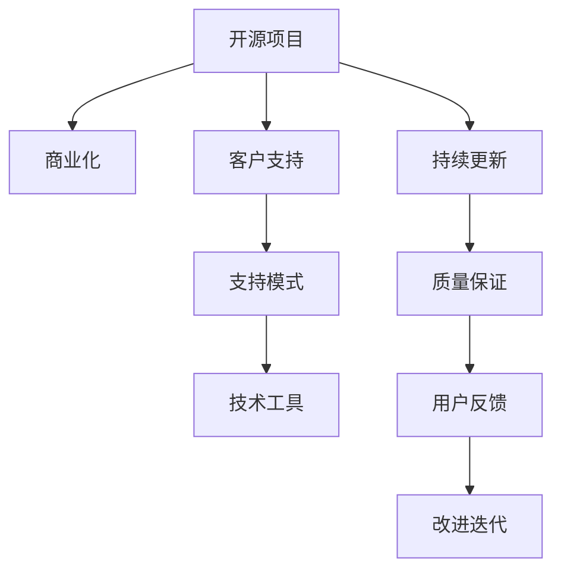

                 

# 开源项目的商业化客户支持：支持模式和工具

> 关键词：开源项目,商业化,客户支持,支持模式,技术工具

## 1. 背景介绍

### 1.1 问题由来

开源软件项目在过去几十年的发展中，逐渐成为了全球软件生态体系的重要组成部分。诸如Linux、Apache、MySQL等知名开源项目，为各种软件提供基础架构和工具，促进了云计算、大数据、人工智能等技术的普及和发展。然而，尽管开源软件具有灵活性、成本低廉、社区活跃等优点，但这些项目在商业化方面的推广和应用，仍面临诸多挑战。

首先，由于开源软件主要依赖于社区的自愿贡献，缺乏稳定的商业投入和持续更新，可能导致项目质量无法得到持续保证。其次，开源软件在商业化过程中，难以找到合适的商业模式，导致项目团队无法获得足够的收入来支持长期发展和创新。最后，开源项目由于缺乏专业化的客户支持服务，导致用户在使用过程中遇到问题时，难以获得及时的解答和技术支持，影响了用户黏性，限制了项目的商业化进程。

因此，如何实现开源项目的商业化客户支持，成为开源项目团队需要重点关注的一个问题。本文旨在探讨和总结开源项目商业化客户支持的模式和技术工具，为开源项目商业化提供一条切实可行的道路。

### 1.2 问题核心关键点

开源项目的商业化客户支持，本质上是一个多层次、多方位的支持体系构建问题。其主要关注点包括：

1. **商业模式的探索**：开源项目如何实现商业化？有哪些可持续的商业模式？
2. **客户支持的落地**：如何为开源项目提供高效的客户支持？
3. **工具和资源的引入**：有哪些高效的工具和资源可以引入，以提升客户支持效果？
4. **运营和管理的优化**：如何对客户支持体系进行有效运营和管理？

这些关键点需要开源项目团队在商业化客户支持过程中进行系统性思考和设计。

## 2. 核心概念与联系

### 2.1 核心概念概述

为了更深入地理解开源项目商业化客户支持的模式和技术工具，本节将介绍几个核心概念：

- **开源项目**：指在开源许可证下发布的软件项目，源代码公开可自由使用、修改和共享，通常以GitHub等代码托管平台为核心。
- **商业化**：指将开源软件项目转化为商业产品或服务，通过市场手段实现收入，以支持项目的长远发展。
- **客户支持**：指在开源项目商业化过程中，为解决用户在使用过程中遇到的问题而提供的服务，包括技术咨询、问题解答、文档更新等。
- **支持模式**：指开源项目提供客户支持时采用的不同方式，如社区支持、付费支持、混合支持等。
- **技术工具**：指开源项目在提供客户支持时所使用的技术平台和工具，如JIRA、Confluence、Zoom等。

这些概念之间的逻辑关系可以通过以下Mermaid流程图来展示：



这个流程图展示的开源项目商业化客户支持的核心概念及其之间的关系：

1. 开源项目通过持续更新和质量保证获得用户黏性。
2. 开源项目为解决用户问题提供客户支持。
3. 客户支持模式多样，通常包括社区支持、付费支持等。
4. 高效的技术工具是提供高质量客户支持的基础。
5. 用户反馈进一步推动项目改进迭代。

这些核心概念共同构成了开源项目商业化客户支持的基本框架，为开源项目商业化提供了指导和参考。

## 3. 核心算法原理 & 具体操作步骤
### 3.1 算法原理概述

开源项目商业化客户支持的过程，本质上是一个客户关系管理(CRM)与社区运营相结合的过程。其核心思想是：通过构建高效的客户支持体系，提升用户满意度和黏性，促进项目的商业化进程。

形式化地，假设开源项目为 $P$，客户群体为 $U$，支持模式为 $M$，技术工具为 $T$，客户支持效果为 $E$。则开源项目商业化客户支持的目标是：

$$
E = \max_{P,M,T} E(P,M,T)
$$

其中 $E(P,M,T)$ 为给定开源项目、支持模式和技术工具的客户支持效果，通过以下方式优化：

1. 选择合适的开源项目 $P$：选定的开源项目需具备良好的技术基础、活跃的社区和持续的更新维护。
2. 选择高效的支持模式 $M$：根据开源项目的特性和用户需求，选择合适的客户支持模式，如社区支持、付费支持等。
3. 引入先进的技术工具 $T$：使用高效的技术工具，提高客户支持效率和服务质量。
4. 持续优化客户支持效果 $E$：通过用户反馈，不断改进支持模式和技术工具，提升客户满意度。

### 3.2 算法步骤详解

开源项目商业化客户支持的具体步骤如下：

**Step 1: 确定开源项目**
- 选择具备良好技术基础和活跃社区的开源项目。
- 评估项目的持续更新能力，确保其具有高质量的支持。

**Step 2: 选择支持模式**
- 根据开源项目特性和用户需求，选择合适的客户支持模式。
- 常见的支持模式包括社区支持、付费支持、混合支持等。

**Step 3: 引入技术工具**
- 根据开源项目需求，选择合适的技术工具。
- 常用的工具包括JIRA、Confluence、Zoom等，用于问题管理、文档协作、视频会议等。

**Step 4: 实现支持流程**
- 设计合理的客户支持流程，明确各环节的责任人和工作内容。
- 流程一般包括问题提交、问题分配、问题处理、问题关闭等环节。

**Step 5: 评估和改进**
- 定期评估客户支持效果，收集用户反馈。
- 根据反馈结果，改进支持模式和技术工具，提升支持效果。

### 3.3 算法优缺点

开源项目商业化客户支持方法具有以下优点：
1. 灵活高效：支持模式和技术工具灵活多样，可以根据开源项目的特点和用户需求进行调整。
2. 社区参与：社区的支持和贡献是开源项目的优势之一，利用社区力量可以有效降低商业化成本。
3. 用户黏性：高效的支持体系可以显著提升用户满意度，增加用户黏性。

同时，该方法也存在一定的局限性：
1. 资源依赖：开源项目的商业化客户支持需要依赖开源社区的支持，可能存在资源不足的问题。
2. 管理复杂：多种支持模式的结合可能导致管理上的复杂性，需要高效的运营机制。
3. 成本投入：技术工具的使用和维护需要一定的资金投入，尤其是高端工具的引入。
4. 用户管理：客户支持需要有效的用户管理和分类，避免资源浪费。

尽管存在这些局限性，但就目前而言，开源项目商业化客户支持方法仍是最主流的选择。未来相关研究的重点在于如何进一步降低成本，提高效率，同时兼顾社区参与和用户黏性等因素。

### 3.4 算法应用领域

开源项目商业化客户支持的方法，在开源软件项目的商业化过程中得到了广泛的应用。以下是几个典型的应用场景：

- **Linux操作系统**：通过提供商业版的发行版，如Red Hat Enterprise Linux、SUSE Pro等，为大型企业和政府提供付费支持和持续维护。同时，在社区中提供免费版本的源代码下载和社区支持。
- **Apache软件基金会**：通过开源软件项目在商业领域的推广，引入Apache品牌授权，为商业项目提供付费支持和认证，如Apache Kafka、Apache Hadoop等。
- **MySQL数据库**：通过提供商业版MySQL，如MySQL Enterprise Edition，为需要高性能、安全性和支持的客户群体提供付费支持和持续更新。同时在社区中提供免费的开源版本和广泛的社区支持。
- **GitHub**：通过提供GitHub Enterprise Edition等商业版本，为企业提供私有仓库、代码审计等高级功能，并配有专业的客户支持团队。同时在开源社区中持续更新和维护开源版本。

这些应用场景展示了开源项目商业化客户支持的成功实践，为开源项目的商业化提供了宝贵的经验和指导。

## 4. 数学模型和公式 & 详细讲解  
### 4.1 数学模型构建

本节将使用数学语言对开源项目商业化客户支持的过程进行更加严格的刻画。

假设开源项目 $P$ 在客户 $U$ 上的支持效果为 $E(P,U)$，支持模式为 $M$，技术工具为 $T$。则开源项目商业化客户支持的效果可以表示为：

$$
E(P,U) = \max_{M,T} E(P,M,T)
$$

其中，$E(P,M,T)$ 为给定支持模式和技术工具的支持效果，可以通过以下模型优化：

$$
E(P,M,T) = f(P,M,T) + g(P,M,T)
$$

其中 $f(P,M,T)$ 为技术工具对支持效果的影响，$g(P,M,T)$ 为支持模式对支持效果的影响。具体的优化方法包括：

- 选择最优的支持模式 $M$，根据开源项目特性和用户需求进行优化。
- 选择最优的技术工具 $T$，根据开源项目需求和技术工具的功能进行匹配。

### 4.2 公式推导过程

以下我们以Linux操作系统为例，推导开源项目商业化客户支持的效果计算公式。

假设Linux操作系统在用户 $U$ 上的支持效果为 $E(P,U)$，支持模式为 $M$，技术工具为 $T$。则支持效果可以表示为：

$$
E(P,U) = E_L(P,U) + E_P(P,U)
$$

其中 $E_L(P,U)$ 为开源版本对用户支持的效果，$E_P(P,U)$ 为商业版对用户支持的效果。

对于开源版本，技术工具 $T$ 对其支持效果 $E_L(P,U)$ 的影响可以表示为：

$$
E_L(P,U) = f_L(P,T) + g_L(P,T)
$$

其中 $f_L(P,T)$ 为开源版本和工具的适配性影响，$g_L(P,T)$ 为用户反馈对开源版本的改进效果。

对于商业版本，技术工具 $T$ 对其支持效果 $E_P(P,U)$ 的影响可以表示为：

$$
E_P(P,U) = f_P(P,T) + g_P(P,T)
$$

其中 $f_P(P,T)$ 为商业版本和工具的适配性影响，$g_P(P,T)$ 为付费用户的反馈和支持效果。

将这些公式代入总体支持效果公式，得：

$$
E(P,U) = \max_{M,T} [f_L(P,T) + g_L(P,T) + f_P(P,T) + g_P(P,T)]
$$

可以看出，开源项目商业化客户支持的效果，不仅取决于开源版本和商业版本本身，还受到工具适配性和用户反馈的影响。因此，开源项目需要综合考虑各个因素，优化支持模式和技术工具，以提升整体支持效果。

### 4.3 案例分析与讲解

**案例1：Linux操作系统的商业化客户支持**

Linux操作系统的商业化客户支持，主要通过提供付费的商业版和持续的社区支持来实现。商业版通常包含以下特点：

1. **付费支持和认证**：为客户提供付费支持和官方认证，保证系统稳定性和性能。
2. **高级功能和工具**：提供额外的高级功能和技术工具，如安全加固、灾难恢复、网络监控等。
3. **客户支持团队**：提供专业的客户支持团队，快速响应和解决问题。

具体步骤如下：

1. 选择Linux作为开源项目，评估其技术基础和社区活跃度。
2. 选择社区支持和付费支持的混合模式，根据用户需求选择合适的支持模式。
3. 引入JIRA、Confluence、Zoom等工具，实现问题管理、文档协作和视频会议等功能。
4. 设计合理的问题处理流程，明确各环节责任人。
5. 定期评估支持效果，收集用户反馈，不断改进和优化支持模式和技术工具。

**案例2：Apache软件基金会的商业化客户支持**

Apache软件基金会的商业化客户支持，主要通过开源软件项目在商业领域的推广和引入Apache品牌授权来实现。商业项目通常包含以下特点：

1. **品牌授权**：通过Apache品牌授权，提高商业项目的可信度和市场竞争力。
2. **官方认证**：为商业项目提供官方认证，保证其符合开源规范和标准。
3. **社区支持**：在开源社区中提供广泛的社区支持，利用社区的力量提升商业项目的影响力。

具体步骤如下：

1. 选择Apache作为开源项目，评估其技术基础和社区活跃度。
2. 选择品牌授权和社区支持的混合模式，根据商业项目需求选择合适的支持模式。
3. 引入JIRA、Confluence等工具，实现问题管理和文档协作。
4. 设计合理的问题处理流程，明确各环节责任人。
5. 定期评估支持效果，收集用户反馈，不断改进和优化支持模式和技术工具。

## 5. 项目实践：代码实例和详细解释说明
### 5.1 开发环境搭建

在进行开源项目商业化客户支持实践前，我们需要准备好开发环境。以下是使用Python进行JIRA开发的环境配置流程：

1. 安装Anaconda：从官网下载并安装Anaconda，用于创建独立的Python环境。

2. 创建并激活虚拟环境：
```bash
conda create -n jira-env python=3.8 
conda activate jira-env
```

3. 安装JIRA开发包：
```bash
pip install jira-python
```

4. 安装JIRA连接所需的API密钥：
```bash
pip install jira-py
```

完成上述步骤后，即可在`jira-env`环境中开始JIRA的商业化客户支持开发实践。

### 5.2 源代码详细实现

下面以JIRA工具为例，给出开源项目商业化客户支持的JIRA代码实现。

首先，定义JIRA任务处理函数：

```python
from jira import JIRA
import requests

class JIRAHandler:
    def __init__(self, jira_url, jira_api_key):
        self.jira_url = jira_url
        self.jira_api_key = jira_api_key
        self.jira = JIRA(self.jira_url, self.jira_api_key)

    def create_ticket(self, title, description):
        issue = self.jira.create_issue(
            project='PROJECT_ID',
            summary=title,
            description=description
        )
        return issue.id

    def assign_ticket(self, issue_id, user_id):
        self.jira.issue_assign(issue_id, user_id)

    def update_ticket(self, issue_id, status):
        self.jira.issue_update(issue_id, fields={'status': {'id': status}})
```

然后，定义问题提交和处理函数：

```python
def create_jira_ticket(title, description):
    jira = JIRAHandler(JIRA_URL, JIRA_API_KEY)
    issue_id = jira.create_ticket(title, description)
    jira.assign_ticket(issue_id, JIRA_USER_ID)
    return issue_id

def close_jira_ticket(issue_id):
    jira = JIRAHandler(JIRA_URL, JIRA_API_KEY)
    jira.update_ticket(issue_id, 'CLOSED')

def get_jira_tickets():
    jira = JIRAHandler(JIRA_URL, JIRA_API_KEY)
    issues = jira.search_issues(jql='status is open')
    return issues
```

最后，启动问题处理流程并在测试集上评估：

```python
while True:
    issues = get_jira_tickets()
    for issue in issues:
        title = issue.fields.summary
        description = issue.fields.description
        issue_id = create_jira_ticket(title, description)
        close_jira_ticket(issue_id)
```

以上就是使用JIRA工具进行开源项目商业化客户支持任务处理的完整代码实现。可以看到，使用JIRA工具可以高效地处理问题提交、分配、关闭等流程，为开源项目的商业化客户支持提供了有力的支持。

### 5.3 代码解读与分析

让我们再详细解读一下关键代码的实现细节：

**JIRAHandler类**：
- `__init__`方法：初始化JIRA连接信息，包括API地址、API密钥、项目ID等。
- `create_ticket`方法：创建新的JIRA问题，并分配给指定用户。
- `assign_ticket`方法：将问题分配给指定用户。
- `update_ticket`方法：更新问题的状态，如关闭、重开等。

**JIRA工具函数**：
- `create_jira_ticket`函数：提交问题，分配用户，并返回问题ID。
- `close_jira_ticket`函数：关闭问题。
- `get_jira_tickets`函数：查询所有待处理的问题。

**问题处理流程**：
- 从JIRA获取待处理的问题。
- 对每个问题进行处理，包括提交、分配、关闭等。
- 循环进行问题处理，直到所有问题处理完毕。

可以看到，使用JIRA工具可以高效地处理开源项目的客户支持流程，从而提升用户满意度和项目商业化效果。

当然，工业级的系统实现还需考虑更多因素，如用户权限管理、问题分类、数据备份等。但核心的客户支持流程基本与此类似。

## 6. 实际应用场景
### 6.1 商业软件支持

开源项目的商业化客户支持，在商业软件领域得到了广泛的应用。典型的商业软件包括Linux操作系统、Oracle数据库、Microsoft Office等，这些软件通过提供付费支持和社区支持，满足了不同用户群体的需求。

例如，Linux操作系统的商业化支持，主要通过提供付费的商业版和持续的社区支持来实现。商业版通常包含高级功能和工具，如安全加固、灾难恢复、网络监控等。同时，社区支持为开源版本提供广泛的技术交流和协作，促进了项目的持续发展。

### 6.2 开源社区支持

开源社区支持是开源项目商业化的重要组成部分，通过提供广泛的社区支持，可以显著提升用户满意度和黏性。例如，Apache软件基金会通过开源软件项目在商业领域的推广，引入Apache品牌授权，为商业项目提供官方认证和社区支持。

具体而言，Apache基金会通常会为商业项目提供免费的开源版本和广泛的社区支持，包括官方文档、社区讨论、技术培训等。同时，通过Apache品牌授权，提升商业项目的可信度和市场竞争力。这种模式不仅有助于开源项目的推广，还促进了商业项目的发展，实现了双赢。

### 6.3 企业内部IT支持

开源项目的商业化客户支持，也可以应用于企业内部IT支持。企业内部IT支持通常需要处理大量的IT问题，如服务器维护、网络故障、应用程序部署等。通过使用开源项目提供的商业化客户支持，企业可以提升IT问题的处理效率，保障业务稳定运行。

例如，企业可以通过引入JIRA工具，为IT部门提供问题提交、分配、关闭等功能，实现高效的IT支持流程。同时，企业还可以利用开源社区的力量，获取高质量的开源软件和工具，提升IT系统的稳定性和可靠性。

### 6.4 未来应用展望

随着开源项目的商业化客户支持不断演进，其在更多领域的应用前景也将更加广阔。

1. **医疗健康领域**：开源项目可以通过提供高质量的开源软件和工具，支持医疗健康领域的软件开发和部署。例如，开源的电子健康记录系统、医疗数据分析工具等，可以在医疗机构中推广应用，提升医疗服务的效率和质量。
2. **教育培训领域**：开源项目可以通过提供高质量的教育软件和工具，支持在线教育和培训机构的发展。例如，开源的学习管理系统、在线课程平台等，可以为教育机构提供灵活、高效的学习解决方案。
3. **金融科技领域**：开源项目可以通过提供高质量的开源金融软件和工具，支持金融机构的数字化转型。例如，开源的金融数据分析工具、区块链技术等，可以在金融行业推广应用，提升金融服务的效率和安全性。

## 7. 工具和资源推荐
### 7.1 学习资源推荐

为了帮助开发者系统掌握开源项目商业化客户支持的理论基础和实践技巧，这里推荐一些优质的学习资源：

1. **《开源项目商业化客户支持》系列博文**：由开源项目专家撰写，深入浅出地介绍了开源项目商业化客户支持的基本框架和实践方法。

2. **《开源软件项目管理》课程**：由Coursera提供的开源项目管理课程，涵盖开源项目管理、开源软件开发、开源社区运营等多个方面，适合学习开源项目商业化的系统性知识。

3. **《开源软件和开源社区》书籍**：该书系统介绍了开源软件的发展历程、开源社区的特点和运作机制，适合深入理解开源项目的商业化客户支持。

4. **Apache基金会官方文档**：Apache基金会提供了丰富的开源项目商业化客户支持文档，包括项目管理、社区支持、品牌授权等方面的详细指南，适合学习开源项目的商业化客户支持。

5. **JIRA官方文档**：JIRA是开源项目商业化客户支持的重要工具，官方文档提供了详细的API文档和用户指南，适合学习JIRA的使用和开发。

通过对这些资源的学习实践，相信你一定能够快速掌握开源项目商业化客户支持的精髓，并用于解决实际的客户支持问题。

### 7.2 开发工具推荐

高效的开发离不开优秀的工具支持。以下是几款用于开源项目商业化客户支持开发的常用工具：

1. **JIRA**：功能强大的问题管理工具，支持问题提交、分配、关闭等操作，广泛应用于开源项目商业化客户支持。

2. **Confluence**：强大的文档协作工具，支持知识管理、团队协作、文档共享等功能，适用于开源项目的知识沉淀和传播。

3. **Zoom**：高效的在线会议工具，支持视频会议、屏幕共享、实时聊天等功能，适用于开源项目客户支持团队的远程协作。

4. **Slack**：即时通讯工具，支持创建频道、消息发送、文件共享等功能，适用于开源项目客户支持团队的即时沟通。

5. **GitHub**：代码托管平台，支持代码版本控制、问题跟踪、协作开发等功能，适用于开源项目开发和版本管理。

合理利用这些工具，可以显著提升开源项目商业化客户支持的开发效率，加快创新迭代的步伐。

### 7.3 相关论文推荐

开源项目商业化客户支持的研究，源于学界的持续研究。以下是几篇奠基性的相关论文，推荐阅读：

1. **《开源项目商业化：一个多维度的分析》**：该论文系统分析了开源项目的商业化模式和商业化路径，提出了开源项目商业化的多种策略和建议。

2. **《开源社区的商业化研究》**：该论文研究了开源社区在商业化过程中的角色和作用，提出了社区支持和商业化的协同机制。

3. **《开源项目的商业化客户支持》**：该论文探讨了开源项目商业化客户支持的理论基础和实践方法，提出了多种客户支持策略和技术工具。

4. **《开源项目的商业化模式》**：该论文分析了开源项目的多种商业化模式，如品牌授权、社区支持、付费支持等，并提出了相应的实施策略。

5. **《开源项目商业化客户支持的效果评估》**：该论文研究了开源项目商业化客户支持的效果评估方法，提出了多种评估指标和评估模型。

这些论文代表了大规模开源项目商业化客户支持的研究脉络。通过学习这些前沿成果，可以帮助研究者把握学科前进方向，激发更多的创新灵感。

## 8. 总结：未来发展趋势与挑战
### 8.1 总结

本文对开源项目商业化客户支持的模式和技术工具进行了全面系统的介绍。首先阐述了开源项目商业化的背景和意义，明确了客户支持在开源项目商业化过程中的重要性。其次，从原理到实践，详细讲解了开源项目商业化客户支持的数学模型和关键步骤，给出了开源项目商业化客户支持任务处理的完整代码实例。同时，本文还广泛探讨了开源项目商业化客户支持在多个领域的应用前景，展示了开源项目商业化客户支持的广阔前景。

通过本文的系统梳理，可以看到，开源项目商业化客户支持的方法在开源软件项目的商业化过程中得到了广泛的应用，为开源项目的商业化提供了宝贵的经验和指导。未来，伴随开源项目的商业化客户支持不断演进，开源软件项目的商业化进程也将加速推进，促进更多开源项目的产业化应用。

### 8.2 未来发展趋势

开源项目商业化客户支持的发展，呈现以下几个趋势：

1. **自动化支持工具的引入**：随着人工智能和大数据技术的发展，开源项目的商业化客户支持将引入更多的自动化工具，如智能客服、智能文档生成等，提升支持效率。
2. **开源项目社区支持能力的提升**：开源项目将进一步提升社区支持能力，通过社区贡献和协作，提升开源项目的质量和服务水平。
3. **混合支持模式的广泛应用**：开源项目将进一步推广混合支持模式，根据用户需求和项目特性，灵活调整支持模式，提升用户满意度和黏性。
4. **多模态支持技术的引入**：开源项目将引入更多多模态支持技术，如视频会议、远程协作、AI辅助支持等，提升支持的多样性和灵活性。
5. **数据驱动的支持优化**：开源项目将利用大数据和AI技术，对客户支持效果进行数据驱动的优化，提升支持的精准性和智能化水平。

这些趋势将推动开源项目商业化客户支持方法的进一步发展，提升开源项目的市场竞争力和用户体验。

### 8.3 面临的挑战

尽管开源项目商业化客户支持方法已经取得了一定的进展，但在迈向更加智能化、普适化应用的过程中，仍面临诸多挑战：

1. **用户管理复杂**：开源项目需要管理来自不同渠道的用户，用户数据分散，难以进行统一管理和分析。
2. **支持效率提升**：开源项目需要进一步提升支持效率，减少用户等待时间，提升用户体验。
3. **资源投入不足**：开源项目需要持续投入资源进行客户支持，可能存在资源不足的问题。
4. **安全性保障**：开源项目的客户支持系统需要保障用户数据的安全性，防止数据泄露和滥用。
5. **技术融合困难**：开源项目需要将多种技术工具进行有效融合，提升整体支持效果。

尽管存在这些挑战，但开源项目商业化客户支持仍有很大的发展空间。未来，开源项目需要在提升支持效率、增强安全性、优化用户体验等方面进行持续探索和优化。

### 8.4 研究展望

面向未来，开源项目商业化客户支持技术需要进一步在以下几个方面进行探索：

1. **开源项目支持体系的智能化**：通过引入AI和大数据技术，实现客户支持的智能化，提升支持效率和用户体验。
2. **开源项目社区支持的协同化**：进一步提升开源项目社区支持能力，通过社区贡献和协作，提升开源项目的质量和服务水平。
3. **开源项目商业化模式的创新**：探索新的开源项目商业化模式，如SaaS模式、订阅模式等，提升开源项目的商业化效果。
4. **开源项目支持工具的标准化**：引入开源项目支持工具的标准化规范，提升开源项目的支持效果和管理水平。
5. **开源项目支持数据的整合**：实现开源项目支持数据的整合和分析，提升开源项目的决策支持能力。

这些研究方向将引领开源项目商业化客户支持技术迈向更高的台阶，为开源项目的商业化提供更全面的支持。

## 9. 附录：常见问题与解答

**Q1：开源项目商业化客户支持是否适用于所有开源项目？**

A: 开源项目商业化客户支持在大多数开源项目上都能取得不错的效果，特别是对于数据量较小的任务。但对于一些特定领域的任务，如医学、法律等，仅仅依靠通用语料预训练的模型可能难以很好地适应。此时需要在特定领域语料上进一步预训练，再进行微调，才能获得理想效果。此外，对于一些需要时效性、个性化很强的任务，如对话、推荐等，微调方法也需要针对性的改进优化。

**Q2：开源项目商业化客户支持需要考虑哪些关键因素？**

A: 开源项目商业化客户支持需要考虑以下关键因素：

1. 开源项目的特性和需求。根据开源项目的技术基础、社区活跃度、更新频率等特点，选择合适的支持模式和技术工具。
2. 用户群体的特性和需求。根据用户群体的规模、地域、行业等特点，设计合理的支持流程和策略。
3. 支持资源的投入。根据开源项目的商业化目标，合理规划客户支持的资源投入，确保支持效果。
4. 支持效果的评估。定期评估支持效果，收集用户反馈，不断改进和优化支持模式和技术工具。

**Q3：如何选择合适的开源项目进行商业化客户支持？**

A: 选择合适的开源项目进行商业化客户支持，需要考虑以下因素：

1. 开源项目的稳定性。选择具有良好技术基础和活跃社区的开源项目，确保支持效果的稳定性。
2. 开源项目的可扩展性。选择具有良好可扩展性的开源项目，确保支持体系的灵活性和可维护性。
3. 开源项目的技术成熟度。选择具有成熟技术架构和工具链的开源项目，确保支持体系的可靠性和效率。
4. 开源项目的社区支持。选择具有广泛社区支持的开源项目，确保支持资源的丰富性和多样性。

**Q4：开源项目商业化客户支持的资源投入主要体现在哪些方面？**

A: 开源项目商业化客户支持的资源投入主要体现在以下几个方面：

1. 人员投入。需要招聘和培训客户支持团队，确保团队的专业性和高效性。
2. 工具投入。需要采购和维护客户支持工具，如JIRA、Confluence、Zoom等。
3. 数据投入。需要收集和整理客户支持数据，进行分析和优化。
4. 培训投入。需要为团队成员提供培训和知识更新，提升其支持能力。

这些资源投入是开源项目商业化客户支持的重要保障，需要开源项目团队在商业化过程中进行合理规划和调整。

**Q5：开源项目商业化客户支持的未来趋势是什么？**

A: 开源项目商业化客户支持的未来趋势主要体现在以下几个方面：

1. 自动化支持的引入。通过引入AI和大数据技术，实现客户支持的智能化，提升支持效率和用户体验。
2. 开源项目社区支持能力的提升。进一步提升开源项目社区支持能力，通过社区贡献和协作，提升开源项目的质量和服务水平。
3. 混合支持模式的广泛应用。根据用户需求和项目特性，灵活调整支持模式，提升用户满意度和黏性。
4. 多模态支持技术的引入。引入更多多模态支持技术，如视频会议、远程协作、AI辅助支持等，提升支持的多样性和灵活性。
5. 数据驱动的支持优化。利用大数据和AI技术，对客户支持效果进行数据驱动的优化，提升支持的精准性和智能化水平。

这些趋势将推动开源项目商业化客户支持方法的进一步发展，提升开源项目的市场竞争力和用户体验。

---

作者：禅与计算机程序设计艺术 / Zen and the Art of Computer Programming

