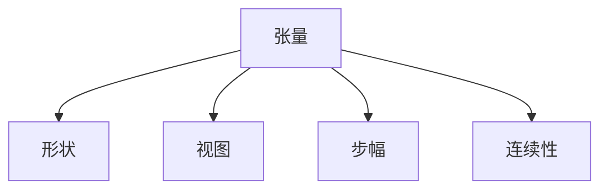

                 

# 张量操作精讲：形状、视图、步幅和连续性

## 1. 背景介绍

张量操作是现代深度学习和科学计算的核心基础。无论是TensorFlow、PyTorch、NumPy，还是深度学习算法、机器学习模型，都高度依赖于对多维数组（即张量）的操作。因此，掌握张量操作的原理、方法和技巧，对于从事深度学习和科学计算的工程师来说至关重要。

在深度学习框架中，张量通常被用来表示数据集、模型参数、中间结果等。它们的维度可以是任意的，从而能够表示不同类型的数据。例如，图像通常表示为三维张量（高度、宽度、颜色通道），而文本则通过嵌入后表示为一维张量。

然而，这些高维数据并非总是容易处理，因此理解张量操作的本质原理，灵活使用视图、步幅等关键概念，是提升深度学习建模效率和性能的必要条件。

## 2. 核心概念与联系

为了更好地理解张量操作，本节将介绍几个核心概念：

- **张量**（Tensor）：一个多维数组，可以是数值、布尔值、甚至是字符串。深度学习中常见的张量包括权重、偏置、输入数据等。
- **形状**（Shape）：指张量的维度和每个维度的大小。例如，一个形状为(3,4,5)的张量，表示一个三维数组，其三个维度大小分别为3、4、5。
- **视图**（View）：指通过操作张量的形状或步幅，获得新的张量，这两个张量共享相同的内存区域。
- **步幅**（Stride）：指张量中元素间的间隔，影响张量的计算速度和内存占用。
- **连续性**（Continuity）：指张量是否在内存中是连续存储的，连续存储的张量计算速度更快。

这些核心概念之间的逻辑关系可以通过以下Mermaid流程图来展示：



## 3. 核心算法原理 & 具体操作步骤
### 3.1 算法原理概述

张量操作的核心原理是使用高效的内存管理和数据传输方式，使得复杂的数据计算和变换过程可以在较短的时间内完成。这主要依赖于以下三个关键概念：

1. **视图**（View）：允许开发者在不改变原始张量的内存位置和数据的情况下，通过改变其形状或步幅，创建新的张量。视图操作可以显著减少内存使用和计算开销。

2. **步幅**（Stride）：描述了张量元素在内存中的分布，不同步幅的张量可以在计算中灵活组合，从而提高计算效率。

3. **连续性**（Continuity）：通过确保数据在内存中是连续存储的，可以进一步提升计算速度和内存利用效率。

### 3.2 算法步骤详解

张量操作的具体步骤可以分为以下几个关键环节：

1. **张量创建与初始化**：
   - 使用框架提供的函数（如`torch.zeros`、`numpy.zeros`）创建一个指定形状和数据类型的张量。

2. **形状变换**：
   - 通过改变张量的形状，创建新的视图。例如，使用`reshape`函数或`view`函数改变张量形状，但注意视图与原始张量共享内存。

3. **步幅设置**：
   - 通过设置张量的步幅，影响元素的内存位置。步幅通常用于加速计算和降低内存占用。

4. **连续性检查**：
   - 使用`is_contiguous`函数检查张量的连续性，以便进一步优化计算和内存使用。

### 3.3 算法优缺点

张量操作的优点包括：
1. **高效内存管理**：视图操作和步幅设置使得内存使用更加高效，减少了内存分配和复制的开销。
2. **计算加速**：通过优化步幅和连续性，可以显著提高计算速度和性能。
3. **灵活性**：支持复杂的多维数据处理，适应不同深度学习模型的需求。

然而，张量操作也存在一些缺点：
1. **易出错**：视图和步幅设置不当可能导致意外的内存访问错误。
2. **复杂性**：对于复杂的多维数组操作，需要深入理解张量操作的原理，才能正确使用视图和步幅。
3. **依赖框架**：不同的深度学习框架（如TensorFlow、PyTorch）提供的张量操作接口有所不同，需要适应不同的开发环境。

### 3.4 算法应用领域

张量操作广泛应用于深度学习、计算机视觉、自然语言处理等领域。例如：

- **卷积神经网络（CNN）**：在图像处理任务中，卷积层通常使用张量操作实现卷积计算，通过改变步幅和连续性，优化计算效率。

- **循环神经网络（RNN）**：在序列建模任务中，循环层通过张量操作实现状态传递和计算，步幅和连续性设置直接影响计算速度。

- **自然语言处理（NLP）**：在文本处理任务中，嵌入操作和矩阵乘法通常使用张量操作，通过视图和步幅设置，实现高效的计算。

## 4. 数学模型和公式 & 详细讲解 & 举例说明

### 4.1 数学模型构建

张量操作主要涉及多维数组的计算和变换，因此可以使用数学模型进行详细阐述。设$T$为一个形状为$(H, W, C)$的三维张量，其中$H$表示高度，$W$表示宽度，$C$表示颜色通道数。

### 4.2 公式推导过程

对于一个形状为$(H, W, C)$的张量$T$，如果我们要计算其在高度方向上滑动步幅为$S_H$，宽度方向上滑动步幅为$S_W$的卷积结果，可以使用以下公式：

$$
C_{i,j,k} = \sum_{h=0}^{H-1} \sum_{w=0}^{W-1} T_{h, w, k} * W(h, w, i, j)
$$

其中$W$表示卷积核，$i$和$j$表示卷积结果中的高度和宽度索引，$k$表示颜色通道索引。

### 4.3 案例分析与讲解

假设有一个形状为$(3, 3, 3)$的三维张量$T$和一个卷积核$W$，其形状为$(3, 3, 1)$，步幅为$S_H=S_W=1$，计算结果如下：

$$
C_{0,0,0} = \sum_{h=0}^{2} \sum_{w=0}^{2} T_{h, w, 0} * W(h, w, 0, 0) = T_{0, 0, 0} * W_{0, 0, 0, 0} + T_{0, 0, 1} * W_{0, 0, 1, 0} + T_{0, 0, 2} * W_{0, 0, 2, 0}
$$

$$
C_{0,0,1} = \sum_{h=0}^{2} \sum_{w=0}^{2} T_{h, w, 1} * W(h, w, 0, 1) = T_{0, 0, 1} * W_{0, 0, 0, 1} + T_{0, 0, 2} * W_{0, 0, 1, 1} + T_{1, 0, 0} * W_{1, 0, 0, 1} + T_{1, 0, 1} * W_{1, 0, 1, 1} + T_{1, 0, 2} * W_{1, 0, 2, 1}
$$

通过这种逐元素计算的方式，可以有效地实现卷积操作，同时保持计算的连续性，从而提高性能。

## 5. 项目实践：代码实例和详细解释说明

### 5.1 开发环境搭建

在进行张量操作实践前，我们需要准备好开发环境。以下是使用Python进行TensorFlow开发的环境配置流程：

1. 安装Anaconda：从官网下载并安装Anaconda，用于创建独立的Python环境。

2. 创建并激活虚拟环境：
```bash
conda create -n tf-env python=3.8 
conda activate tf-env
```

3. 安装TensorFlow：根据CUDA版本，从官网获取对应的安装命令。例如：
```bash
conda install tensorflow tensorflow-gpu=cuda11.1 -c conda-forge
```

4. 安装各类工具包：
```bash
pip install numpy matplotlib scikit-learn
```

完成上述步骤后，即可在`tf-env`环境中开始张量操作实践。

### 5.2 源代码详细实现

这里我们以TensorFlow为例，给出张量操作的完整代码实现。

首先，定义一个形状为$(3, 3, 3)$的三维张量$T$和一个形状为$(3, 3, 1)$的卷积核$W$。

```python
import tensorflow as tf

T = tf.constant([[[1, 2, 3], [4, 5, 6], [7, 8, 9]],
                 [[10, 11, 12], [13, 14, 15], [16, 17, 18]],
                 [[19, 20, 21], [22, 23, 24], [25, 26, 27]]], dtype=tf.float32)

W = tf.constant([[[[1, 2], [3, 4]]],
                 [[[5, 6], [7, 8]]],
                 [[[9, 10], [11, 12]]]], dtype=tf.float32)
```

然后，计算$T$和$W$的卷积结果。

```python
# 定义步幅和填充
S = [1, 1, 1]
P = [0, 0, 0]

# 计算卷积结果
C = tf.nn.conv2d(T, W, strides=S, padding=P)
```

最后，检查卷积结果的连续性并输出。

```python
# 检查连续性
print(C.is_contiguous())

# 输出卷积结果
print(tf.Session().run(C))
```

以上就是使用TensorFlow进行张量卷积计算的完整代码实现。可以看到，TensorFlow提供了一组简洁易用的API函数，方便开发者实现复杂的张量操作。

### 5.3 代码解读与分析

让我们再详细解读一下关键代码的实现细节：

**定义张量和卷积核**：
- 使用`tf.constant`函数创建张量$T$和$W$，并指定数据类型为浮点数。

**计算卷积结果**：
- 使用`tf.nn.conv2d`函数计算$T$和$W$的卷积结果，其中`strides`参数指定步幅，`padding`参数指定填充方式。

**检查连续性**：
- 使用`is_contiguous`函数检查卷积结果$C$的连续性，确保其数据在内存中是连续存储的。

**输出卷积结果**：
- 使用`tf.Session().run`函数执行计算，并输出卷积结果$C$。

可以看到，TensorFlow提供的张量操作API非常灵活，可以通过简单的调用函数实现复杂的张量计算。

## 6. 实际应用场景

张量操作在实际应用中具有广泛的应用场景，以下是几个典型的案例：

### 6.1 深度学习模型的构建

在深度学习模型的构建中，张量操作是必不可少的。无论是卷积神经网络（CNN）、循环神经网络（RNN），还是自编码器（AE）、生成对抗网络（GAN）等模型，都需要使用张量操作进行数据处理和模型训练。

例如，在图像分类任务中，卷积层和池化层通常使用张量操作实现特征提取。通过改变步幅和填充方式，可以实现不同大小的卷积核，提取不同尺度下的特征。

### 6.2 科学计算和数据分析

张量操作同样适用于科学计算和数据分析领域。例如，在金融建模中，可以使用张量操作实现矩阵乘法、线性代数运算等复杂计算。通过优化步幅和连续性，可以显著提升计算效率和内存利用率。

### 6.3 视频处理和计算机视觉

在视频处理和计算机视觉领域，张量操作可以用于帧间操作、光流计算等任务。通过改变步幅和连续性，可以实现高效的帧间差分和光流计算，从而实现视频分析和增强。

### 6.4 未来应用展望

随着深度学习技术的发展，张量操作将在更多领域得到应用，为科学研究、工业生产、社会治理等带来新的突破。例如：

- **自动驾驶**：在自动驾驶领域，张量操作可以用于图像识别、物体检测等任务，通过优化步幅和连续性，提升算法的实时性和准确性。

- **医疗影像分析**：在医疗影像分析中，张量操作可以用于图像分割、病变检测等任务，通过改变形状和步幅，提高计算效率和图像处理速度。

- **自然语言生成**：在自然语言生成任务中，张量操作可以用于语言模型、生成对抗网络等模型，通过优化步幅和连续性，提升生成文本的质量和速度。

## 7. 工具和资源推荐

### 7.1 学习资源推荐

为了帮助开发者系统掌握张量操作的理论基础和实践技巧，这里推荐一些优质的学习资源：

1. **《深度学习》（Goodfellow et al., 2016）**：深度学习领域的经典教材，详细介绍了深度学习的基础理论和算法，包括张量操作的原理和应用。

2. **《TensorFlow官方文档》**：TensorFlow的官方文档，提供了详细的API函数和代码示例，是学习张量操作的重要参考。

3. **《TensorFlow实战》（Lars Ienachsen et al., 2018）**：TensorFlow实战指南，结合实际项目案例，帮助开发者掌握TensorFlow的使用技巧。

4. **《NumPy官方文档》**：NumPy的官方文档，提供了丰富的数学函数和张量操作API，是进行科学计算和数据分析的基础。

5. **《Python深度学习》（Francois Chollet, 2018）**：深度学习框架Keras的作者所著，介绍了Keras的张量操作API和实践案例。

通过对这些资源的学习实践，相信你一定能够快速掌握张量操作的精髓，并用于解决实际的深度学习问题。

### 7.2 开发工具推荐

高效的开发离不开优秀的工具支持。以下是几款用于张量操作开发的常用工具：

1. **TensorFlow**：由Google主导开发的深度学习框架，支持GPU计算，提供了丰富的张量操作API。

2. **PyTorch**：由Facebook开发的深度学习框架，支持动态计算图，提供了灵活的张量操作API。

3. **NumPy**：Python的科学计算库，提供了高效的数组和矩阵计算函数，适用于科学计算和数据分析。

4. **JAX**：Google开发的自动微分和编译工具，支持动态计算图，提供了高性能的张量操作API。

5. **MXNet**：由Amazon开发的深度学习框架，支持多种语言和平台，提供了丰富的张量操作API。

合理利用这些工具，可以显著提升张量操作的开发效率，加快创新迭代的步伐。

### 7.3 相关论文推荐

张量操作的发展得益于深度学习和科学计算领域的不断进步。以下是几篇奠基性的相关论文，推荐阅读：

1. **TensorFlow: Large-Scale Machine Learning on Heterogeneous Distributed Systems**（Martín Abadi et al., 2016）：介绍了TensorFlow框架的设计思想和张量操作原理。

2. **Caffe: Convolutional Architecture for Fast Feature Batching**（Jian Sun et al., 2014）：介绍了卷积神经网络的设计原理和张量操作的实现方法。

3. **Deformable ConvNets**（Kaiming He et al., 2017）：提出了一种新型的卷积操作，通过改变步幅和填充方式，提高计算效率和模型性能。

4. **Quantized Convolutional Neural Networks for Mobile, Embedded, and Edge Devices**（Stella Xie et al., 2018）：介绍了量化卷积神经网络的实现方法，通过优化步幅和连续性，提升模型的推理速度和内存利用率。

这些论文代表了大规模张量操作的发展脉络。通过学习这些前沿成果，可以帮助研究者把握学科前进方向，激发更多的创新灵感。

## 8. 总结：未来发展趋势与挑战

### 8.1 总结

本文对张量操作的原理、方法和技巧进行了全面系统的介绍。首先阐述了张量操作在深度学习和科学计算中的重要性，明确了其与形状、视图、步幅和连续性等核心概念之间的逻辑关系。其次，从原理到实践，详细讲解了张量操作的数学模型和公式推导，提供了张量操作的完整代码实例。同时，本文还广泛探讨了张量操作在深度学习、科学计算、计算机视觉等领域的广泛应用。

通过本文的系统梳理，可以看到，张量操作在大规模数据处理和高效计算中的应用价值，以及其对深度学习框架和科学计算工具的重要意义。掌握张量操作的精髓，能够帮助开发者高效实现复杂的多维数组操作，提升深度学习建模和科学计算的效率和性能。

### 8.2 未来发展趋势

展望未来，张量操作将呈现以下几个发展趋势：

1. **多维数据处理能力增强**：随着深度学习技术的不断发展，张量操作将支持更复杂的多维数据类型，如张量数组、稀疏张量等，提供更加灵活的数据处理能力。

2. **分布式计算优化**：随着计算能力的提升，张量操作将进一步优化分布式计算能力，支持跨多台机器的并行计算，提高计算效率和扩展性。

3. **硬件优化**：随着新型硬件（如GPU、TPU等）的普及，张量操作将进一步优化硬件支持，提供更加高效的计算和内存管理方式。

4. **模型压缩和量化**：通过张量操作进行模型压缩和量化，可以显著降低模型的计算和存储成本，提升模型的实时性和性能。

5. **自动微分和编译优化**：通过自动微分和编译优化，可以进一步提升张量操作的性能，支持高效的深度学习模型训练和推理。

这些趋势将使得张量操作在深度学习、科学计算和人工智能领域发挥更大的作用，进一步推动技术进步和应用发展。

### 8.3 面临的挑战

尽管张量操作已经取得了瞩目成就，但在迈向更加智能化、普适化应用的过程中，它仍面临诸多挑战：

1. **易出错**：视图和步幅设置不当可能导致意外的内存访问错误，特别是在多维数组操作中。

2. **复杂性**：对于复杂的多维数组操作，需要深入理解张量操作的原理，才能正确使用视图和步幅。

3. **依赖框架**：不同的深度学习框架提供的张量操作接口有所不同，需要适应不同的开发环境。

4. **内存管理**：在处理大规模数据时，内存管理变得复杂，可能导致内存泄漏和访问错误。

5. **计算效率**：在处理密集型计算任务时，张量操作的计算效率仍需进一步提升。

6. **硬件支持**：新型硬件的优化需要时间和投入，硬件支持的完善还需要不断努力。

正视张量操作面临的这些挑战，积极应对并寻求突破，将是大规模张量操作技术迈向成熟的必由之路。相信随着学界和产业界的共同努力，这些挑战终将一一被克服，张量操作必将在构建人机协同的智能时代中扮演越来越重要的角色。

### 8.4 研究展望

面对张量操作面临的种种挑战，未来的研究需要在以下几个方面寻求新的突破：

1. **优化多维数组操作**：开发更加高效的多维数组操作API，支持更复杂的数据类型和计算方式。

2. **改进硬件支持**：进一步优化对新型硬件的支持，提高计算和内存管理效率。

3. **自动优化算法**：开发自动优化算法，动态调整步幅和连续性，提升计算性能。

4. **跨框架通用性**：开发跨深度学习框架通用的张量操作API，减少框架切换的成本。

5. **安全性和可解释性**：研究张量操作的安全性和可解释性，确保数据和模型处理的安全可靠。

这些研究方向将进一步推动张量操作的进步，为构建高效、稳定、安全的深度学习系统和科学计算工具铺平道路。面向未来，张量操作的研究和应用前景广阔，值得深入探索和挖掘。

## 9. 附录：常见问题与解答

**Q1：什么是张量操作？**

A: 张量操作是指对多维数组进行的操作，包括创建、初始化、变换、计算等。这些操作是深度学习模型和科学计算的基础。

**Q2：如何使用张量操作实现卷积计算？**

A: 使用深度学习框架提供的卷积函数（如TensorFlow的`tf.nn.conv2d`），可以方便地实现卷积计算。通过设置步幅和填充方式，可以优化计算效率和内存使用。

**Q3：如何判断张量的连续性？**

A: 使用深度学习框架提供的`is_contiguous`函数，可以判断张量的连续性。连续性表示张量在内存中是连续存储的，可以提高计算效率。

**Q4：张量操作中的步幅和填充有什么区别？**

A: 步幅表示张量元素之间的间隔，影响张量在计算中的位置。填充表示张量在计算中是否需要填充额外元素，以确保输出形状一致。

**Q5：张量操作在深度学习中有什么作用？**

A: 张量操作是深度学习模型的基础，用于数据处理、模型构建和计算优化。通过优化张量操作，可以提升深度学习模型的性能和效率，加速模型训练和推理。

总之，张量操作是大规模数据处理和高效计算的重要工具，掌握其原理和技巧，对于从事深度学习和科学计算的工程师来说至关重要。通过不断学习和实践，相信你一定能够熟练掌握张量操作的精髓，并将其应用于各类实际项目中。

