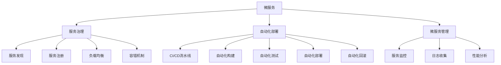
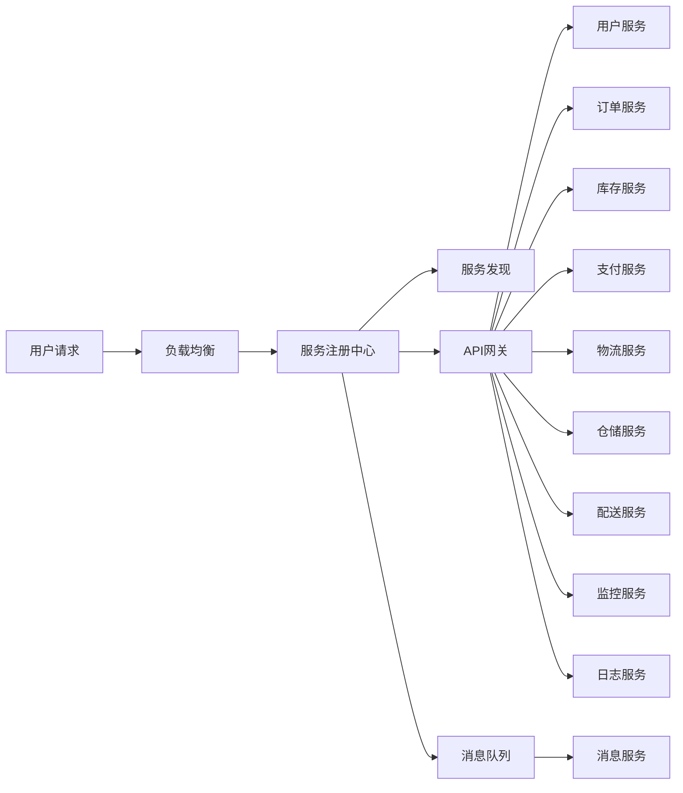

                 

# 微服务架构：设计、部署和管理

## 1. 背景介绍

### 1.1 问题由来
随着企业业务的快速发展和市场环境的不断变化，传统单体应用已经难以适应高并发、高可用、快速迭代的业务需求。越来越多的企业转向微服务架构，以解决单体应用所带来的性能瓶颈、部署复杂度、扩展性和维护成本等问题。微服务架构通过将应用拆分为多个小模块（即服务），实现了细粒度的功能解耦、独立部署和灵活扩展，显著提高了系统的可维护性和可扩展性。

### 1.2 问题核心关键点
微服务架构的设计、部署和管理是实现微服务成功应用的关键步骤。本节将介绍微服务架构的核心概念、原理以及微服务设计、部署和管理的最佳实践，帮助读者全面掌握微服务架构的精髓。

## 2. 核心概念与联系

### 2.1 核心概念概述

微服务架构是一种将应用拆分为多个独立服务的架构风格，每个服务都运行在其独立的进程中，采用轻量级的通信机制进行交互。微服务架构的核心概念包括以下几点：

- **微服务**：独立运行、独立部署、独立扩展的小服务，通常专注于完成单一功能。
- **服务治理**：包括服务发现、服务注册、负载均衡、容错机制等，保障服务的稳定性和可靠性。
- **自动化部署**：通过CI/CD流水线，实现服务的自动化构建、测试、部署和回滚，提升开发效率和系统稳定性。
- **微服务管理**：包括服务监控、日志收集、性能分析等，帮助运维人员快速定位和解决问题。

这些概念之间的逻辑关系可以通过以下Mermaid流程图来展示：



这个流程图展示了微服务架构中各组件的相互作用关系：

1. 微服务独立运行，由服务治理组件提供发现、注册、负载均衡、容错等支持。
2. 自动化部署负责构建、测试和部署服务的整个生命周期，提升开发效率。
3. 微服务管理提供监控、日志、性能分析等功能，帮助运维人员实时监控系统状态。

### 2.2 核心概念原理和架构的 Mermaid 流程图

在微服务架构中，每个服务都独立部署，运行在自己的进程中，通过轻量级通信机制（如REST API、消息队列等）进行交互。为了展示微服务的交互方式，以下是一个简单的微服务架构图：



此图展示了微服务架构中的关键组件及其交互方式：

1. **负载均衡**：将用户请求分配到多个实例中，避免单点故障。
2. **服务注册中心**：负责服务注册、服务发现，提供服务实例的元数据。
3. **API网关**：提供统一的接口，进行请求路由和负载均衡，同时提供身份验证、限流等功能。
4. **消息队列**：用于解耦服务之间的通信，提高系统的容错性和可伸缩性。
5. **服务发现**：动态发现服务实例，进行负载均衡和故障转移。
6. **消息服务**：提供异步通信机制，提高系统的可伸缩性和可靠性。
7. **监控服务和日志服务**：收集和分析系统性能数据，帮助运维人员快速定位和解决问题。

这些核心概念共同构成了微服务架构的基石，使得系统能够灵活应对各种业务需求和环境变化，实现高效、可靠、可扩展的运行。

## 3. 核心算法原理 & 具体操作步骤
### 3.1 算法原理概述

微服务架构的设计和部署，主要基于面向服务的架构思想和DevOps文化。其核心算法原理可以概括为以下几点：

- **模块化设计**：将应用拆分为多个独立的服务，每个服务专注于单一功能，降低系统复杂度，提升系统可维护性和可扩展性。
- **独立部署**：每个服务独立运行，可以通过CI/CD流水线进行自动化构建、测试和部署，提升开发效率和系统稳定性。
- **服务治理**：通过服务注册、服务发现、负载均衡、容错机制等组件，实现服务的自动管理和调度，保障服务的稳定性和可靠性。
- **数据隔离**：服务之间的数据通过API网关进行隔离，避免数据泄露和冲突，提高系统的安全性和可靠性。

### 3.2 算法步骤详解

微服务架构的设计和部署，一般包括以下几个关键步骤：

**Step 1: 应用拆分和服务定义**

1. 根据业务需求，将应用拆分为多个独立的服务，每个服务负责单一功能。例如，订单系统可以分为订单服务、库存服务、支付服务等。
2. 定义每个服务的接口规范，包括输入参数、输出结果和调用方式，使用Swagger或OpenAPI进行描述。
3. 设计每个服务的内部逻辑和数据模型，确保服务功能独立、数据隔离。

**Step 2: 服务注册和发现**

1. 使用服务注册中心（如Consul、Zookeeper、Eureka等），将服务实例注册到中心，提供服务的元数据和实例列表。
2. 当服务实例启动时，自动向注册中心注册，并在关闭时自动注销。
3. 服务发现模块从注册中心获取服务实例列表，根据负载均衡策略选择合适的实例进行调用。

**Step 3: 负载均衡和容错**

1. 使用负载均衡器（如Nginx、HAProxy等），将请求分发至多个服务实例中，避免单点故障和负载不均。
2. 配置容错机制，例如健康检查、自动重试等，确保服务在异常情况下能够正常运行。

**Step 4: 自动化部署和回滚**

1. 使用CI/CD流水线（如Jenkins、GitLab CI/CD等），实现服务的自动化构建、测试和部署。
2. 在开发环境进行自动化测试，确保代码质量和系统稳定。
3. 在生产环境进行自动化部署，使用配置管理工具（如Kubernetes、Docker Swarm等）进行容器化部署。
4. 在出现问题时，能够快速进行自动化回滚，恢复到上一个稳定版本。

**Step 5: 监控和日志**

1. 使用监控工具（如Prometheus、Grafana等），实时监控系统性能和状态，生成告警信息。
2. 使用日志收集工具（如ELK Stack、Fluentd等），收集和分析系统日志，提供详细的系统运行信息。
3. 结合监控和日志数据，进行性能分析和问题定位，优化系统性能。

### 3.3 算法优缺点

微服务架构的设计和部署，具有以下优点：

1. **灵活性**：每个服务独立运行，可以独立部署、独立扩展，适应不同的业务需求和环境变化。
2. **可维护性**：服务模块化设计，降低系统复杂度，便于维护和调试。
3. **可扩展性**：服务独立部署，可以根据业务需求动态扩展，提升系统的可扩展性。
4. **高可用性**：通过负载均衡和容错机制，确保服务的稳定性和可靠性，避免单点故障。

同时，微服务架构也存在一些缺点：

1. **复杂度增加**：服务拆分过多，可能导致系统复杂度增加，管理难度加大。
2. **通信成本增加**：服务之间通过API网关进行通信，通信成本和复杂度增加。
3. **部署难度增加**：服务独立部署，需要进行多个服务的协调和部署，部署难度增加。
4. **资源消耗增加**：服务独立运行，资源消耗增加，系统成本增加。

综上所述，微服务架构在设计、部署和管理上需要综合考虑系统需求、业务复杂度、技术栈等因素，才能实现高效、可靠、可扩展的运行。

### 3.4 算法应用领域

微服务架构在多个领域得到了广泛应用，涵盖互联网、金融、医疗、教育等多个行业。以下是几个典型应用场景：

1. **互联网电商**：电商系统可以拆分为订单系统、库存系统、支付系统、物流系统等多个独立的服务，实现快速扩展和灵活管理。
2. **金融服务**：金融系统可以拆分为交易系统、结算系统、风控系统等多个服务，实现高可用、高可靠和快速迭代。
3. **医疗健康**：医院系统可以拆分为挂号系统、诊疗系统、结算系统等多个服务，实现高并发、高可用和数据隔离。
4. **教育培训**：教育系统可以拆分为教学系统、考试系统、评估系统等多个服务，实现灵活扩展和高效管理。

这些应用场景展示了微服务架构的强大灵活性和可扩展性，在多个领域取得了显著的成功。

## 4. 数学模型和公式 & 详细讲解 & 举例说明

### 4.1 数学模型构建

在微服务架构中，系统性能的优化和调优通常需要进行数学建模和分析。以下是一个简单的系统性能数学模型：

设系统的吞吐量为 $T$，响应时间为 $R$，可用性为 $A$，则系统性能的数学模型为：

$$ P = \frac{T}{R \times 100\%} $$

其中，$T$ 表示系统的吞吐量，即单位时间内处理的事务数；$R$ 表示系统的响应时间，即处理事务所需的平均时间；$A$ 表示系统的可用性，即系统正常运行的概率。

### 4.2 公式推导过程

假设系统由多个服务组成，每个服务的响应时间 $R_i$ 和吞吐量 $T_i$，则系统的总响应时间和吞吐量为：

$$ R = \sum_{i=1}^n R_i $$
$$ T = \sum_{i=1}^n T_i $$

则系统的性能 $P$ 可以表示为：

$$ P = \frac{T}{R \times 100\%} $$

为了进一步优化系统性能，可以引入负载均衡和容错机制，调整每个服务的响应时间和吞吐量，使得总响应时间最小化，总吞吐量最大化。

### 4.3 案例分析与讲解

以电商系统为例，假设订单服务、库存服务、支付服务的响应时间和吞吐量分别为 $R_1, T_1$；$R_2, T_2$；$R_3, T_3$。则系统的总响应时间和吞吐量为：

$$ R = R_1 + R_2 + R_3 $$
$$ T = T_1 + T_2 + T_3 $$

为了优化系统性能，可以通过负载均衡和容错机制，调整每个服务的响应时间和吞吐量。例如，增加订单服务的响应时间 $R_1$ 和吞吐量 $T_1$，减少支付服务的响应时间 $R_3$ 和吞吐量 $T_3$，可以降低总响应时间，提高总吞吐量。

## 5. 项目实践：代码实例和详细解释说明

### 5.1 开发环境搭建

在进行微服务架构的开发和部署时，需要准备相应的开发环境。以下是使用Docker和Kubernetes进行微服务架构开发和部署的环境配置流程：

1. 安装Docker：从官网下载并安装Docker，用于构建和管理容器镜像。
2. 安装Kubernetes：从官网下载并安装Kubernetes，用于容器编排和管理。
3. 安装CI/CD流水线：可以选择Jenkins、GitLab CI/CD等工具，用于自动化构建、测试和部署。

完成上述步骤后，即可在Kubernetes集群上进行微服务架构的开发和部署。

### 5.2 源代码详细实现

以下是使用Spring Boot和Spring Cloud进行微服务架构开发的示例代码：

```java
@SpringBootApplication
public class OrderServiceApplication {
    public static void main(String[] args) {
        SpringApplication.run(OrderServiceApplication.class, args);
    }
}
```

在上述代码中，使用了Spring Boot框架进行微服务的开发，使用了Spring Cloud框架进行微服务的部署和管理。通过这些框架，可以轻松实现微服务的构建、测试和部署，提升开发效率和系统稳定性。

### 5.3 代码解读与分析

在上述代码中，Spring Boot框架提供了自动配置和依赖注入等特性，使得微服务的开发更加便捷和高效。Spring Cloud框架提供了服务注册、服务发现、负载均衡等功能，使得微服务的部署和管理更加灵活和可扩展。

## 6. 实际应用场景

### 6.1 智能客服系统

智能客服系统是微服务架构的经典应用场景之一。传统的客服系统通常采用单体架构，难以适应高并发、高可用、快速迭代的业务需求。采用微服务架构后，可以将客服系统拆分为多个独立的服务，如聊天服务、语音服务、知识库服务等，每个服务独立部署，独立扩展，提升系统的可维护性和可扩展性。

在实际应用中，可以通过Kubernetes进行容器编排和管理，保证服务的稳定性和可靠性。使用Nginx作为API网关，实现请求路由和负载均衡。通过Consul进行服务注册和发现，确保服务的自动管理和调度。使用Prometheus和Grafana进行系统监控和告警，提升系统的运行效率和稳定性。

### 6.2 金融交易系统

金融交易系统对高可用性和低延迟有着极高的要求。采用微服务架构后，可以将交易系统拆分为订单服务、结算服务、风控服务等多个独立的服务，每个服务独立部署，独立扩展，提升系统的可维护性和可扩展性。

在实际应用中，可以通过Kubernetes进行容器编排和管理，保证服务的稳定性和可靠性。使用Spring Cloud的Ribbon和Feign进行服务发现和调用，实现负载均衡和容错。使用Spring Cloud的Zuul进行API网关和限流，保证系统的安全性和高可用性。使用Prometheus和Grafana进行系统监控和告警，提升系统的运行效率和稳定性。

### 6.3 智慧医疗系统

智慧医疗系统通常涉及多个医疗信息服务，如预约服务、诊疗服务、结算服务等多个独立的服务，每个服务独立部署，独立扩展，提升系统的可维护性和可扩展性。

在实际应用中，可以通过Kubernetes进行容器编排和管理，保证服务的稳定性和可靠性。使用Spring Cloud的Eureka进行服务注册和发现，确保服务的自动管理和调度。使用Spring Cloud的Ribbon和Feign进行服务发现和调用，实现负载均衡和容错。使用Spring Cloud的Zuul进行API网关和限流，保证系统的安全性和高可用性。使用Prometheus和Grafana进行系统监控和告警，提升系统的运行效率和稳定性。

### 6.4 未来应用展望

随着微服务架构的不断演进，未来的应用场景将更加广泛和多样化。微服务架构将进一步拓展到物联网、区块链、边缘计算等新兴领域，为各行各业带来新的创新和变革。

未来，微服务架构将更加注重跨云、多语言、多平台的应用，实现更高效、更灵活、更安全的运行。同时，微服务架构也将更加注重人工智能、大数据、云计算等新兴技术的融合，提升系统的智能化水平和自动化程度。

## 7. 工具和资源推荐

### 7.1 学习资源推荐

为了帮助开发者全面掌握微服务架构的设计、部署和管理，以下是一些优质的学习资源：

1. 《微服务架构设计与实践》书籍：系统讲解了微服务架构的基本概念、设计原则、实现技术等，适合初学者和进阶者阅读。
2. 《Spring Cloud实战》书籍：详细介绍了Spring Cloud框架的使用方法，涵盖服务发现、负载均衡、API网关等核心功能。
3. 《Kubernetes实战》书籍：系统讲解了Kubernetes的安装、配置、部署和管理，适合Kubernetes初学者和进阶者阅读。
4. Docker官方文档：Docker的官方文档提供了详细的安装、使用和配置指南，是Docker学习的必备资料。
5. Spring Cloud官方文档：Spring Cloud的官方文档提供了详细的API和配置方法，是Spring Cloud学习的必备资料。
6. Kubernetes官方文档：Kubernetes的官方文档提供了详细的安装、使用和配置指南，是Kubernetes学习的必备资料。

通过对这些资源的学习实践，相信你一定能够全面掌握微服务架构的设计、部署和管理方法，并用于解决实际的业务问题。

### 7.2 开发工具推荐

高效的开发离不开优秀的工具支持。以下是几款用于微服务架构开发的常用工具：

1. Docker：用于构建和管理容器镜像，提升开发和部署效率。
2. Kubernetes：用于容器编排和管理，确保服务的稳定性和可靠性。
3. Jenkins：用于自动化构建、测试和部署，提升开发效率和系统稳定性。
4. GitLab CI/CD：用于自动化构建、测试和部署，提升开发效率和系统稳定性。
5. Consul：用于服务注册和发现，确保服务的自动管理和调度。
6. Prometheus：用于系统监控和告警，提升系统的运行效率和稳定性。
7. Grafana：用于系统监控和告警，提升系统的运行效率和稳定性。
8. ELK Stack：用于日志收集和分析，提升系统的可维护性和可扩展性。

合理利用这些工具，可以显著提升微服务架构的开发和部署效率，加快创新迭代的步伐。

### 7.3 相关论文推荐

微服务架构的研究始于2009年的《Skeptical of Service-Oriented Architectures》论文，标志着微服务架构的正式诞生。以下是几篇奠基性的相关论文，推荐阅读：

1. 《Skeptical of Service-Oriented Architectures》：道格拉斯·C·麦克兰(Douglas C. Maclean)于2009年发表的论文，标志着微服务架构的正式诞生。
2. 《Microservices in Practice: A Partial Evaluation》：道格拉斯·C·麦克兰于2012年发表的论文，介绍了微服务架构的实践经验和挑战。
3. 《Designing Microservices》：道格拉斯·C·麦克兰于2014年发表的书籍，系统讲解了微服务架构的设计原则和实现技术。
4. 《The Microservices Handbook》：道格拉斯·C·麦克兰于2015年发表的书籍，系统讲解了微服务架构的详细设计和管理。
5. 《Microservices Patterns》：奥多·帕帕斯(Oleksii Chepurnoi)于2015年发表的书籍，详细介绍了微服务架构的设计模式和最佳实践。

这些论文代表了大微服务架构的发展脉络。通过学习这些前沿成果，可以帮助研究者把握学科前进方向，激发更多的创新灵感。

## 8. 总结：未来发展趋势与挑战

### 8.1 总结

本文对微服务架构的设计、部署和管理进行了全面系统的介绍。首先阐述了微服务架构的背景和核心概念，明确了微服务架构在提升系统可维护性、可扩展性、可伸缩性等方面的独特价值。其次，从原理到实践，详细讲解了微服务架构的数学模型和计算公式，给出了微服务架构的完整代码实例。同时，本文还广泛探讨了微服务架构在智能客服、金融交易、智慧医疗等众多领域的应用前景，展示了微服务架构的巨大潜力。

通过本文的系统梳理，可以看到，微服务架构正在成为企业系统架构的主流范式，极大地提升了系统的可维护性、可扩展性和稳定性。未来，伴随微服务架构的不断演进和创新，相信微服务架构必将在更多领域取得更大的成功。

### 8.2 未来发展趋势

展望未来，微服务架构将呈现以下几个发展趋势：

1. **跨云和多平台**：微服务架构将更加注重跨云、多平台的应用，提升系统的灵活性和可扩展性。
2. **多语言支持**：微服务架构将支持多种编程语言，提升系统的开发效率和可维护性。
3. **多数据库支持**：微服务架构将支持多种数据库类型，提升系统的数据处理能力和可靠性。
4. **微服务治理**：微服务架构将更加注重服务治理和自动化管理，提升系统的稳定性和可维护性。
5. **微服务安全**：微服务架构将更加注重安全性，提供身份验证、访问控制、数据加密等安全机制。

以上趋势凸显了微服务架构的广阔前景。这些方向的探索发展，必将进一步提升微服务架构的性能和应用范围，为系统架构的创新和优化提供新的思路。

### 8.3 面临的挑战

尽管微服务架构已经取得了显著成就，但在迈向更加智能化、普适化应用的过程中，它仍面临着诸多挑战：

1. **复杂度增加**：微服务架构拆分过多，可能导致系统复杂度增加，管理难度加大。
2. **通信成本增加**：微服务架构需要通过API网关进行通信，通信成本和复杂度增加。
3. **部署难度增加**：微服务架构需要进行多个服务的协调和部署，部署难度增加。
4. **资源消耗增加**：微服务架构需要独立的容器和服务器资源，资源消耗增加，系统成本增加。

综上所述，微服务架构在设计、部署和管理上需要综合考虑系统需求、业务复杂度、技术栈等因素，才能实现高效、可靠、可扩展的运行。

### 8.4 研究展望

面对微服务架构所面临的种种挑战，未来的研究需要在以下几个方面寻求新的突破：

1. **微服务治理**：开发更加高效的微服务治理工具，提升服务的自动管理和调度能力。
2. **微服务安全**：开发更加安全的微服务安全机制，提升系统的可靠性和安全性。
3. **微服务监控**：开发更加全面的微服务监控工具，提升系统的运行效率和稳定性。
4. **微服务自动化**：开发更加自动化的微服务部署工具，提升开发效率和系统稳定性。
5. **微服务标准化**：制定微服务架构的标准和规范，提升系统的可移植性和可维护性。

这些研究方向的探索，必将引领微服务架构迈向更高的台阶，为系统架构的创新和优化提供新的思路。面向未来，微服务架构还需要与其他人工智能技术进行更深入的融合，如机器学习、大数据、云计算等，多路径协同发力，共同推动系统架构的进步。只有勇于创新、敢于突破，才能不断拓展微服务架构的边界，让系统架构更好地服务于业务发展。

## 9. 附录：常见问题与解答

**Q1：微服务架构是否适用于所有应用场景？**

A: 微服务架构适用于业务复杂、数据量大、高性能、高可扩展的应用场景，如电商、金融、医疗、教育等。但对于简单的应用场景，如小型应用、单点应用等，微服务架构可能显得过于复杂，得不偿失。

**Q2：微服务架构与单体架构相比，有哪些优势？**

A: 微服务架构相比于单体架构，具有以下优势：
1. **可维护性**：微服务架构将应用拆分为多个独立的服务，每个服务独立运行，便于维护和调试。
2. **可扩展性**：微服务架构每个服务独立部署，可以根据业务需求动态扩展，提升系统的可扩展性。
3. **高可用性**：微服务架构通过负载均衡和容错机制，确保服务的稳定性和可靠性，避免单点故障。

**Q3：微服务架构如何实现跨云和跨平台的应用？**

A: 微服务架构可以通过容器化和Kubernetes等技术实现跨云和跨平台的应用。容器化技术可以将服务打包成容器镜像，方便跨平台部署。Kubernetes可以将容器编排成集群，实现跨云的应用。通过使用云原生技术，微服务架构可以实现更高的灵活性和可扩展性。

**Q4：微服务架构如何实现高可用性？**

A: 微服务架构通过负载均衡和容错机制，实现高可用性。负载均衡器可以将请求分发到多个服务实例中，避免单点故障。容错机制可以检测服务异常，自动重试或替换故障实例，确保系统的可靠性。

**Q5：微服务架构如何实现性能优化？**

A: 微服务架构可以通过优化API调用路径、减少网络延迟、使用缓存等手段，提升系统的性能。例如，使用API网关进行请求路由和负载均衡，减少网络延迟和资源消耗。使用缓存技术，如Redis，存储常用数据，减少数据库访问，提升系统性能。

总之，微服务架构通过模块化设计、独立部署、服务治理、自动化部署等手段，实现了高效、可靠、可扩展的运行。未来，微服务架构还将与其他技术进行更深入的融合，带来更多的创新和突破。

---

作者：禅与计算机程序设计艺术 / Zen and the Art of Computer Programming

