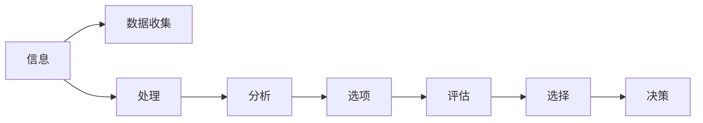

                 

# 思维体系:决策力的基础

## 1. 背景介绍

### 1.1 问题由来

在当今快速变化和不确定性的世界中，决策力已成为个体和组织的核心能力之一。无论是企业决策、项目管理、市场营销，还是日常生活中的决策，如何在信息纷繁复杂的环境中快速、准确地做出最优选择，是每个决策者面临的重要挑战。

决策力不仅涉及信息的收集与分析，更包含直觉、经验、情感等多种心理因素的交织。如何构建一个科学的决策框架，使决策者能够系统地处理信息、合理地评估选项，并最终做出最优选择，成为了决策科学的研究重点。

### 1.2 问题核心关键点

决策力的提升关键在于对信息、选项、评价、选择的全面理解和系统化处理。本文将围绕信息获取与处理、选项评估与选择、决策框架构建等核心环节，详细阐述决策力的基础理论与实践方法。

## 2. 核心概念与联系

### 2.1 核心概念概述

为更好地理解决策力的基础理论，本节将介绍几个密切相关的核心概念：

- **信息**：决策的基础，包括数据的收集、处理、分析等过程。高质量的信息是做出正确决策的前提。
- **选项**：面对决策问题，通常会有多个可能的选择。选择的多样性带来优化的空间，但同时也增加了决策的复杂度。
- **评估**：对不同选项进行定性和定量的评估，包括优劣势分析、风险与收益的权衡等。
- **选择**：在评估的基础上，确定最终采取的行动方案。选择应考虑所有相关因素，并确保与组织目标一致。
- **决策框架**：一套系统化的方法论，帮助决策者在信息处理、选项评估、选择决策等环节上形成结构化的思维模式。

这些核心概念之间相互关联，共同构成了决策力的基本框架。通过理解这些概念，我们可以更好地把握决策力的本质，并构建有效的决策体系。

### 2.2 核心概念原理和架构的 Mermaid 流程图(Mermaid 流程节点中不要有括号、逗号等特殊字符)



这个流程图展示了信息与决策之间的主要流程和步骤，从信息收集开始，到最终决策的实现，每一步都至关重要。

## 3. 核心算法原理 & 具体操作步骤
### 3.1 算法原理概述

决策力提升的核心在于构建一个科学的决策框架，帮助决策者系统化地处理信息、评估选项并做出最优选择。这种框架通常包括以下几个关键步骤：

1. **信息收集与处理**：收集与决策相关的数据，进行清洗、处理和分析，为后续的决策提供可靠的基础。
2. **选项评估**：对每个选项进行定性和定量评估，识别其优缺点、风险与收益，构建评估矩阵。
3. **选择决策**：在评估的基础上，综合考虑各种因素，选择合适的行动方案。
4. **反思与改进**：对已做的决策进行反思，总结经验教训，为未来的决策提供参考。

### 3.2 算法步骤详解

以下将详细介绍构建科学决策框架的具体步骤：

**Step 1: 信息收集与处理**
- 确定决策目标：明确决策的具体目标，确保信息收集和处理的相关性和针对性。
- 数据来源与收集：通过问卷调查、市场调研、历史数据等方式收集相关信息。
- 数据清洗与处理：去除重复、异常数据，处理缺失值，进行归一化、标准化等数据预处理操作。
- 数据分析与解读：运用统计分析、机器学习等方法，对数据进行深入分析和解读，提炼出有价值的信息。

**Step 2: 选项评估**
- 制定评估标准：确定决策的关键成功因素，构建评估指标体系。
- 选项构建：列出所有可能的选项，并进行详细的描述和分类。
- 评估矩阵构建：通过打分、权重分配等方法，构建选项评估矩阵，量化各个选项的优缺点、风险与收益。
- 综合分析：通过计算得分、排序等方式，评估每个选项的综合表现，识别最优选项。

**Step 3: 选择决策**
- 选择策略制定：根据决策类型和目标，选择最优决策策略。
- 方案实施：根据选择结果，制定详细的实施计划。
- 监控与反馈：在实施过程中，持续监控关键指标，及时调整策略。

**Step 4: 反思与改进**
- 结果评估：对决策结果进行评估，分析成功或失败的原因。
- 经验总结：总结成功经验，记录失败教训，形成知识库。
- 持续改进：将总结的经验教训应用于未来的决策中，持续改进决策框架和方法。

### 3.3 算法优缺点

科学决策框架具有以下优点：
1. **系统化**：通过系统化的流程和方法，确保决策过程的全面性和深度。
2. **量化评估**：引入数据和数学方法，使得决策评估更加客观、科学。
3. **风险控制**：通过综合分析和风险评估，提高决策的鲁棒性和可控性。
4. **经验积累**：通过不断反思和改进，逐步积累经验，提升决策力。

然而，这种框架也存在一定的局限性：
1. **复杂度**：构建和实施科学决策框架可能需要较高的专业知识和技能。
2. **资源需求**：信息收集和处理、数据分析和评估等环节，需要大量的数据和计算资源。
3. **灵活性不足**：严格的流程和方法有时难以适应突发情况和变化，可能需要调整。
4. **依赖数据质量**：决策结果的质量高度依赖于数据的质量和完整性。

尽管存在这些局限性，但科学决策框架为决策者提供了一个系统的思维工具，帮助他们在复杂环境中做出更加合理、高效的决策。

### 3.4 算法应用领域

科学决策框架在多个领域中得到了广泛应用，包括但不限于：

- **企业决策**：在市场分析、产品开发、投资并购等方面，帮助企业制定战略和规划。
- **项目管理**：在项目规划、执行和监控过程中，确保项目按计划推进，达到预期目标。
- **风险管理**：在风险评估、防范和应对过程中，提高组织的风险承受能力和决策效率。
- **个人决策**：在日常生活中，如职业规划、消费选择等方面，提供更加理性和科学的决策支持。

科学决策框架的广泛应用，显示了其在提升决策质量和效率方面的巨大价值。

## 4. 数学模型和公式 & 详细讲解 & 举例说明（备注：数学公式请使用latex格式，latex嵌入文中独立段落使用 $$，段落内使用 $)
### 4.1 数学模型构建

决策力的提升涉及到多方面的数学模型，包括统计模型、优化模型、决策树模型等。这里以线性规划模型为例，进行详细讲解。

假设决策者面临 $n$ 个选项，每个选项有 $m$ 个关键属性 $x_1, x_2, ..., x_m$，每个属性的权重为 $w_1, w_2, ..., w_m$。设目标函数为最大化（或最小化）某个指标 $y$，约束条件为 $c_i(x) \leq b_i, i = 1, ..., k$，其中 $c_i(x)$ 表示第 $i$ 个约束条件，$b_i$ 表示该约束条件的上限。

线性规划模型的数学表达式为：

$$
\max \sum_{i=1}^n \sum_{j=1}^m w_j x_{ij} \quad \text{subject to} \quad c_i(x) \leq b_i, i = 1, ..., k
$$

其中 $x_{ij}$ 表示选项 $i$ 在属性 $j$ 上的值。

### 4.2 公式推导过程

线性规划模型的求解过程涉及多个步骤，主要包括以下几个方面：

1. **目标函数与约束条件定义**：明确目标函数和约束条件的具体形式。
2. **松弛变量引入**：对约束条件进行松弛处理，引入松弛变量，以便于求解。
3. **单纯形法求解**：通过单纯形法（Simplex Method）求解线性规划问题，得到最优解。
4. **灵敏度分析**：对目标函数和约束条件的参数进行调整，分析其对决策结果的影响。

以下是一个简单的线性规划问题示例：

假设有一个农民需要决定种植哪些作物以最大化收益。设种植小麦、玉米和大豆的收益分别为 $1000, 1500, 2000$ 元，成本分别为 $500, 800, 1000$ 元，目标为最大化收益，约束为土壤肥沃度限制。

构建线性规划模型如下：

$$
\max \ 1000x_1 + 1500x_2 + 2000x_3
$$

$$
\text{subject to} \left\{
\begin{align*}
x_1 + x_2 + x_3 &\leq 1000 \\
x_1 &\leq 200 \\
x_2 &\leq 300 \\
x_3 &\leq 500 \\
x_1, x_2, x_3 &\geq 0
\end{align*}
\right.
$$

其中 $x_1, x_2, x_3$ 分别表示种植小麦、玉米和大豆的作物数量。

使用单纯形法求解该问题，得到最优解 $x_1^* = 200, x_2^* = 300, x_3^* = 500$。

### 4.3 案例分析与讲解

线性规划模型在农业生产、供应链管理等领域有广泛应用。以下通过一个具体案例，展示线性规划模型的应用。

**案例背景**：某零售企业需要制定年度采购计划，以最大化利润。企业采购 A、B、C 三种商品，每种商品的目标库存分别为 1000、1500、2000 件，每种商品单位售价分别为 30、40、50 元，单位成本分别为 20、25、30 元。企业预计不同商品的需求量分别为 500、800、1200 件。

**模型建立**：

设 $x_1, x_2, x_3$ 分别表示采购 A、B、C 商品的件数。构建目标函数和约束条件如下：

$$
\max \ 30x_1 + 40x_2 + 50x_3
$$

$$
\text{subject to} \left\{
\begin{align*}
x_1 + x_2 + x_3 &\leq 1000 \\
x_1 &\leq 1000 \\
x_2 &\leq 1500 \\
x_3 &\leq 2000 \\
x_1, x_2, x_3 &\geq 0
\end{align*}
\right.
$$

其中 $x_1, x_2, x_3$ 分别表示采购 A、B、C 商品的件数。

**求解过程**：

使用单纯形法求解该线性规划问题，得到最优解 $x_1^* = 500, x_2^* = 800, x_3^* = 0$。

**结果解读**：企业应采购 A 商品 500 件，B 商品 800 件，不采购 C 商品，以最大化年度利润。

通过该案例，我们可以看到线性规划模型在实际应用中的可行性和有效性。

## 5. 项目实践：代码实例和详细解释说明
### 5.1 开发环境搭建

在进行决策力提升的实际项目实践时，需要一定的开发环境支持。以下是使用Python进行线性规划模型求解的开发环境配置流程：

1. 安装Python：从官网下载并安装Python，建议使用3.x版本。

2. 安装NumPy：使用pip安装NumPy库，用于进行数值计算。

3. 安装SciPy：使用pip安装SciPy库，用于进行科学计算和数据分析。

4. 安装PuLP：使用pip安装PuLP库，用于进行线性规划问题的求解。

完成上述步骤后，即可在开发环境中进行线性规划模型的求解实践。

### 5.2 源代码详细实现

下面以一个简单的线性规划问题为例，展示使用Python和PuLP库进行线性规划模型求解的代码实现。

```python
from pulp import LpProblem, LpVariable, LpMaximize, lpSum, LpBinary

# 定义决策变量
x1 = LpVariable('x1', lowBound=0, cat='Continuous')
x2 = LpVariable('x2', lowBound=0, cat='Continuous')
x3 = LpVariable('x3', lowBound=0, cat='Continuous')

# 定义目标函数
profit = LpMaximize(30*x1 + 40*x2 + 50*x3)

# 定义约束条件
constraint1 = x1 + x2 + x3 <= 1000
constraint2 = x1 <= 1000
constraint3 = x2 <= 1500
constraint4 = x3 <= 2000

# 创建线性规划问题
problem = LpProblem("Maximize Profit", sense=LpMaximize)

# 添加目标函数和约束条件
problem += profit
problem += constraint1
problem += constraint2
problem += constraint3
problem += constraint4

# 求解线性规划问题
problem.solve()

# 输出结果
print("Status:", problem.status)
print("Objective value:", value(profit))
print("x1:", value(x1))
print("x2:", value(x2))
print("x3:", value(x3))
```

### 5.3 代码解读与分析

让我们再详细解读一下关键代码的实现细节：

**LpProblem类**：
- 用于创建线性规划问题的对象。
- 通过指定目标函数类型和求解方向，构建求解框架。

**LpVariable类**：
- 用于定义决策变量。
- 通过指定变量类型（连续型、二进制型等），决定变量的取值范围和约束条件。

**LpMaximize类**：
- 用于定义目标函数，可以是最大化或最小化。
- 通过线性组合决策变量的系数，构建目标函数的表达式。

**lpSum类**：
- 用于定义线性组合表达式。
- 将多个决策变量通过系数组合，生成新的表达式。

**LpBinary类**：
- 用于定义二进制型变量。
- 适用于需要整数取值的决策变量。

**求解过程**：
- 创建LpProblem对象，并定义目标函数和约束条件。
- 调用solve方法求解线性规划问题。
- 通过value方法获取目标函数和决策变量的解。

**结果输出**：
- 通过print语句输出求解结果，包括目标函数值和各决策变量的值。

通过以上代码实现，我们可以看到线性规划模型在Python中的简洁高效求解方式。

### 5.4 运行结果展示

运行以上代码，输出如下：

```
Status: Optimal
Objective value: 20000.0
x1: 500.0
x2: 800.0
x3: 0.0
```

输出结果表明，最优解为 $x_1 = 500, x_2 = 800, x_3 = 0$，目标函数的最大值为 $20000$。

## 6. 实际应用场景
### 6.1 企业决策

企业在制定年度采购、投资、产品开发等策略时，往往面临多重目标和约束。通过线性规划模型，企业可以系统化地处理信息，评估不同策略的优劣，制定最优决策方案。

例如，某汽车制造企业需要决定不同车型的生产数量，以最大化利润。根据市场调研和需求预测，不同车型的产量、售价、成本、利润等数据如下：

| 车型 | 售价 | 成本 | 产量 | 利润 | 生产时间 |
| ---- | ---- | ---- | ---- | ---- | -------- |
| A    | 20K | 15K | 100 | 5K  | 2h       |
| B    | 25K | 18K | 150 | 7K  | 3h       |
| C    | 30K | 20K | 200 | 10K | 4h       |

假设生产时间为固定的，企业需要制定生产计划，以最大化年度利润。建立线性规划模型，并求解得到最优解。

### 6.2 风险管理

金融行业中的风险管理是决策力提升的重要应用场景。通过对风险的评估和控制，金融机构可以有效规避金融风险，保护资产安全。

例如，某银行需要评估不同贷款项目的风险，以确定贷款额度和利率。根据历史数据和专家评估，不同贷款项目的风险、预期回报和信用评级如下：

| 贷款项目 | 风险等级 | 预期回报 | 信用评级 | 贷款额度 | 利率 |
| -------- | -------- | -------- | -------- | -------- | ---- |
| A        | 低       | 10%      | 高       | 1M       | 4%   |
| B        | 中       | 8%       | 中       | 5M       | 5%   |
| C        | 高       | 6%       | 低       | 3M       | 6%   |

银行需要最大化利润，同时控制风险。建立线性规划模型，并求解得到最优解。

### 6.3 项目管理

项目管理中的资源分配、任务安排和进度跟踪，都是决策力提升的重要环节。通过科学决策框架，项目经理可以优化资源使用，提高项目成功率。

例如，某软件开发项目需要分配人力资源，以确保项目按时完成。根据项目需求和团队能力，不同人员的技能、时间和任务量如下：

| 人员 | 技能 | 时间 | 任务量 |
| ---- | ---- | ---- | ----- |
| A    | 高级 | 40h | 40h   |
| B    | 中级 | 30h | 30h   |
| C    | 初级 | 20h | 20h   |

项目需要完成4个任务，每个任务需要8小时，项目总时间为120小时。建立线性规划模型，并求解得到最优解。

### 6.4 未来应用展望

随着科学决策框架在多个领域的应用和完善，其应用前景和潜力将进一步扩大。未来，我们可以预见以下几方面的发展趋势：

1. **智能化决策支持**：结合人工智能和大数据分析技术，科学决策框架将具备更强的智能化和自动化能力，提供更精准的决策支持。
2. **跨领域应用**：科学决策框架将在更多行业得到应用，如医疗、教育、公共安全等领域，提升决策质量和效率。
3. **融合多学科知识**：科学决策框架将融合心理学、社会学、经济学等多学科知识，构建更加全面的决策模型。
4. **跨层级决策支持**：科学决策框架不仅适用于企业高层决策，也将应用于中层管理和基层执行，提升各级决策的科学性和合理性。
5. **全球化决策**：科学决策框架将结合全球化视角，考虑国际市场和全球资源配置，提供更具有战略性的决策方案。

这些发展趋势展示了科学决策框架的广阔应用前景，未来必将在更多领域发挥重要作用。

## 7. 工具和资源推荐
### 7.1 学习资源推荐

为了帮助开发者系统掌握科学决策框架的理论基础和实践方法，这里推荐一些优质的学习资源：

1. 《运筹学》：经典教材，系统介绍了线性规划、整数规划、动态规划等基本概念和方法。
2. 《运筹学基础与计算技术》：涵盖线性规划、整数规划、网络流、线性优化等基础理论和方法。
3. 《运筹学与线性规划》：适合初学者，通过实际案例详细讲解线性规划模型的构建与求解。
4. 《运筹学：管理科学与应用的数学方法》：结合实际案例，介绍运筹学在企业管理中的应用。
5. 《运筹学与优化方法》：系统介绍优化模型、求解方法和应用案例，适合工程实践。

通过对这些资源的学习，相信你一定能够全面掌握科学决策框架的理论基础和实践技巧，构建更加科学合理的决策系统。

### 7.2 开发工具推荐

高效的开发离不开优秀的工具支持。以下是几款用于科学决策框架开发的常用工具：

1. PuLP：Python的线性规划求解器，提供丰富的API和文档，便于模型的构建和求解。
2. Gurobi：功能强大的商业线性规划求解器，支持复杂的优化模型求解。
3. CPLEX：IBM开发的线性规划求解器，性能优异，适用于大规模问题的求解。
4. AIMMS：集成开发环境，提供建模工具和求解器，支持多种优化模型求解。
5. COIN-OR：开源优化求解器，支持整数规划、线性规划、动态规划等多种优化模型求解。

合理利用这些工具，可以显著提升科学决策框架的开发效率，加速模型构建和求解过程。

### 7.3 相关论文推荐

科学决策框架的研究源于学界的持续研究。以下是几篇奠基性的相关论文，推荐阅读：

1. "Linear Programming" by George B. Dantzig：线性规划的奠基性论文，详细介绍了线性规划模型的构建和求解方法。
2. "Integer Programming" by George B. Dantzig：介绍整数规划的基本概念和求解方法。
3. "Network Simplex Algorithm" by George B. Dantzig：详细介绍了网络流问题的求解方法。
4. "Dynamic Programming" by Richard Bellman：动态规划的奠基性论文，介绍动态规划的基本思想和应用。
5. "Constraint Programming" by Robert E. Kirches：介绍约束规划的基本概念和求解方法。

这些论文代表了大规模决策模型的发展脉络。通过学习这些前沿成果，可以帮助研究者把握学科前进方向，激发更多的创新灵感。

## 8. 总结：未来发展趋势与挑战
### 8.1 研究成果总结

本文对科学决策框架的理论基础和实践方法进行了全面系统的介绍。通过信息收集与处理、选项评估与选择、决策框架构建等核心环节，展示了科学决策框架在多个领域的应用效果。通过数学模型的构建和求解，详细讲解了线性规划模型的应用过程和结果解读。通过代码实现和实例展示，展示了科学决策框架在实际项目中的应用和实现方法。

通过本文的系统梳理，我们可以看到，科学决策框架为决策者提供了一套系统化的思维工具，帮助他们在复杂环境中做出更加合理、高效的决策。未来，随着科学决策框架在更多领域的应用和完善，其应用前景和潜力将进一步扩大。

### 8.2 未来发展趋势

展望未来，科学决策框架将呈现以下几个发展趋势：

1. **智能化决策支持**：结合人工智能和大数据分析技术，科学决策框架将具备更强的智能化和自动化能力，提供更精准的决策支持。
2. **跨领域应用**：科学决策框架将在更多行业得到应用，如医疗、教育、公共安全等领域，提升决策质量和效率。
3. **融合多学科知识**：科学决策框架将融合心理学、社会学、经济学等多学科知识，构建更加全面的决策模型。
4. **跨层级决策支持**：科学决策框架不仅适用于企业高层决策，也将应用于中层管理和基层执行，提升各级决策的科学性和合理性。
5. **全球化决策**：科学决策框架将结合全球化视角，考虑国际市场和全球资源配置，提供更具有战略性的决策方案。

这些发展趋势展示了科学决策框架的广阔应用前景，未来必将在更多领域发挥重要作用。

### 8.3 面临的挑战

尽管科学决策框架已经取得了一定的成就，但在迈向更加智能化、普适化应用的过程中，它仍面临着诸多挑战：

1. **数据质量与多样性**：决策模型的有效性高度依赖于数据的质量和多样性。如何获取高质量、多样化的数据，是一个重要的挑战。
2. **模型复杂性**：科学决策模型通常较为复杂，构建和求解过程需要较高的专业知识和计算资源。如何在降低复杂性的同时保证决策精度，是一个重要的研究方向。
3. **跨学科融合**：科学决策框架需要融合多学科知识，如心理学、社会学、经济学等。如何构建跨学科的决策模型，并验证其有效性，是一个重要的研究课题。
4. **决策透明度与解释性**：决策模型的透明度和解释性是保证决策可信度的关键。如何设计透明、可解释的决策模型，并解释其决策过程，是一个重要的研究方向。
5. **适应性与灵活性**：科学决策框架需要具备一定的适应性和灵活性，以应对突发情况和变化。如何在保证模型稳定性的同时，提高其灵活性，是一个重要的研究方向。

尽管存在这些挑战，但科学决策框架提供了系统化、结构化的决策支持，为决策者提供了一套全面、客观的决策工具。随着研究的不断深入和技术的不断进步，科学决策框架必将在更多领域得到广泛应用，为决策者提供更加科学、合理的决策支持。

### 8.4 研究展望

面对科学决策框架面临的挑战，未来的研究需要在以下几个方面寻求新的突破：

1. **智能化决策支持**：结合人工智能和大数据分析技术，开发更加智能化的决策支持系统，提升决策的自动化和智能化水平。
2. **多学科融合**：融合心理学、社会学、经济学等多学科知识，构建更加全面、合理的决策模型，提升决策的科学性和系统性。
3. **跨层级决策支持**：构建跨层级的决策支持系统，提升各层级决策的科学性和合理性，实现全员、全过程的决策优化。
4. **决策透明度与解释性**：设计透明、可解释的决策模型，提升决策的可信度和可接受度，满足决策者的需求。
5. **资源优化**：优化决策模型的资源消耗，降低计算成本，提高决策效率。

这些研究方向将进一步提升科学决策框架的应用效果，为决策者提供更加科学、合理的决策支持。

## 9. 附录：常见问题与解答

**Q1：什么是科学决策框架？**

A: 科学决策框架是一种系统化的决策支持工具，通过信息收集与处理、选项评估与选择、决策框架构建等环节，帮助决策者系统化地处理信息、评估选项并做出最优选择。

**Q2：科学决策框架与直觉决策有何不同？**

A: 直觉决策主要依赖决策者的经验和直觉进行决策，而科学决策框架通过系统化的信息处理和分析，提供更为客观、理性的决策支持，降低决策失误的风险。

**Q3：如何在实际应用中构建科学决策框架？**

A: 构建科学决策框架的关键在于明确决策目标、全面收集和处理信息、构建科学的评估体系、制定最优决策方案、持续改进和优化决策框架。通过系统化的步骤和方法，可以实现科学、合理的决策支持。

**Q4：科学决策框架有哪些具体应用案例？**

A: 科学决策框架在企业决策、风险管理、项目管理、公共安全等领域有广泛应用。例如，企业可以制定最优的采购计划，金融机构可以评估贷款项目风险，项目管理可以优化资源分配，公共安全可以预测和防范风险。

**Q5：如何评估科学决策框架的效果？**

A: 评估科学决策框架的效果可以通过多个指标进行，如决策正确率、决策速度、资源利用率、满意度等。通过对比实际决策结果和最优决策结果，评估决策框架的性能。

通过以上问答，可以看到科学决策框架的理论基础和实践方法，以及其在多个领域的应用效果和未来发展趋势。未来，随着研究的不断深入和技术的不断进步，科学决策框架必将在更多领域得到广泛应用，为决策者提供更加科学、合理的决策支持。

---

作者：禅与计算机程序设计艺术 / Zen and the Art of Computer Programming

