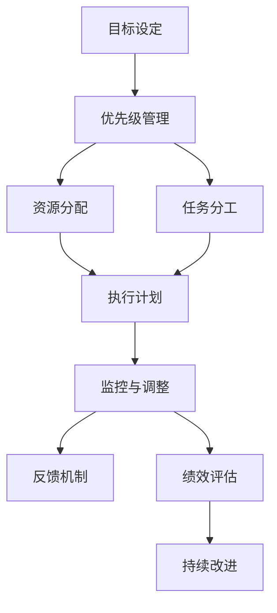

                 

# 思维体系：决定管理者的起跑线

## 1. 背景介绍

在日新月异的商业世界中，管理者们面临着种种挑战。如何运用思维体系，提升决策能力和执行效率，是每位管理者必须面对的问题。本文将从背景介绍、核心概念与联系、核心算法原理与具体操作步骤、数学模型和公式讲解、项目实践、实际应用场景、工具和资源推荐、总结发展趋势与挑战等多个维度，探讨如何构建高效的管理者思维体系。

## 2. 核心概念与联系

### 2.1 核心概念概述

在探讨管理者思维体系时，我们首先明确几个关键概念：

- **目标设定（Goal Setting）**：设定明确的业务目标，引导团队向共同方向努力。
- **优先级管理（Priority Management）**：根据目标重要性和紧急性，合理分配资源和精力。
- **风险评估（Risk Assessment）**：识别潜在风险，制定应对策略，确保项目稳健推进。
- **沟通协调（Communication & Coordination）**：建立有效的沟通渠道，促进信息共享，提升团队协作效率。
- **反馈机制（Feedback Mechanism）**：建立完善的反馈系统，及时调整策略和行动计划。

这些概念之间相互关联，共同构成管理者思维体系的核心。以下是一个Mermaid流程图，展示了这些概念之间的联系：



### 2.2 核心概念原理和架构

- **目标设定**：利用SMART原则（Specific, Measurable, Achievable, Relevant, Time-bound），确保目标明确且可操作。
- **优先级管理**：采用Eisenhower矩阵（四象限法）区分任务优先级，避免重要不紧急事项被忽视。
- **风险评估**：使用SWOT分析（Strengths, Weaknesses, Opportunities, Threats）识别内外部风险，制定应对方案。
- **沟通协调**：采用有效的沟通渠道（如会议、邮件、即时通讯工具等），确保信息透明和及时传达。
- **反馈机制**：建立360度反馈系统，定期进行绩效评估和调整。

这些原理和架构为管理者提供了系统化的思考和执行框架，帮助其更高效地达成目标。

## 3. 核心算法原理 & 具体操作步骤

### 3.1 算法原理概述

管理者思维体系的核心算法原理，可以概括为以下几个方面：

- **目标优化**：通过优化算法，找到达成目标的最优路径。
- **优先级调整**：使用数学模型和算法，动态调整任务的优先级。
- **风险规避**：利用数据挖掘和机器学习技术，识别和应对风险。
- **信息共享**：设计有效的数据共享和存储模型，确保团队信息透明。
- **绩效评估**：采用统计学和数据科学方法，客观评估团队绩效。

### 3.2 算法步骤详解

管理者思维体系的操作步骤如下：

1. **目标设定**：利用SMART原则，设定具体、可衡量的目标。
2. **优先级管理**：使用Eisenhower矩阵，对任务进行优先级排序。
3. **风险评估**：运用SWOT分析，识别潜在风险并制定应对方案。
4. **沟通协调**：选择合适的沟通渠道，确保信息透明和及时传达。
5. **反馈机制**：建立360度反馈系统，定期评估绩效并进行调整。

### 3.3 算法优缺点

管理者思维体系的算法优点包括：

- **系统化**：框架化的操作流程，确保思维体系的系统性和科学性。
- **可量化**：利用数学和统计学方法，使目标和绩效评估具有可量化的标准。
- **动态调整**：基于实时数据和反馈，动态调整策略和操作，保持灵活性和应变能力。

缺点包括：

- **复杂性**：算法流程和模型较为复杂，需投入较多的时间和资源进行学习和应用。
- **数据依赖**：模型的效果依赖于数据的完整性和质量，数据缺失或不准确可能影响结果。
- **人性化不足**：算法侧重于数据和流程，可能忽视人的情感和主观因素。

### 3.4 算法应用领域

管理者思维体系的应用领域广泛，包括但不限于：

- **项目管理**：项目规划、进度监控、风险管理等。
- **人力资源管理**：招聘、培训、绩效评估等。
- **市场营销**：市场分析、品牌管理、销售策略等。
- **产品开发**：需求分析、产品设计、用户反馈等。
- **客户关系管理**：客户需求分析、满意度调查、客户维护等。

## 4. 数学模型和公式 & 详细讲解 & 举例说明

### 4.1 数学模型构建

管理者思维体系的数学模型主要包括以下几个方面：

- **目标优化模型**：最小化或最大化特定指标（如利润、市场份额等），目标函数为$f(x) = \sum_{i=1}^n w_i f_i(x)$。
- **优先级排序模型**：使用线性规划、非线性规划等方法，对任务进行优先级排序。
- **风险评估模型**：利用回归分析、决策树、贝叶斯网络等技术，识别和预测风险。
- **信息共享模型**：设计数据存储和访问模型，确保信息的共享和透明。
- **绩效评估模型**：利用统计学方法，如方差分析、回归分析、因果推断等，评估团队绩效。

### 4.2 公式推导过程

以下以目标优化模型为例，展示其公式推导过程：

假设目标函数为$F(x) = \sum_{i=1}^n w_i f_i(x)$，其中$f_i(x)$为第$i$个目标函数，$w_i$为对应的权重，$x$为决策变量。根据拉格朗日乘数法，构建拉格朗日函数：

$$
\mathcal{L}(x, \lambda) = F(x) + \sum_{i=1}^n \lambda_i (g_i(x) - b_i)
$$

其中$g_i(x)$为约束条件，$b_i$为约束条件的界限。求$\mathcal{L}(x, \lambda)$的偏导数，并解方程组，即可得到最优解$x^*$。

### 4.3 案例分析与讲解

假设某公司需要优化销售策略，目标是最大化利润。销售策略有三种选择：线上广告、线下促销、跨界合作。根据历史数据，可以构建以下目标优化模型：

$$
F(x) = 2x_1 + 3x_2 + x_3
$$

其中$x_1$为线上广告预算，$x_2$为线下促销预算，$x_3$为跨界合作预算。设预算总额为$b$，则约束条件为：

$$
\begin{cases}
x_1 + x_2 + x_3 = b \\
x_1, x_2, x_3 \geq 0
\end{cases}
$$

根据目标函数和约束条件，构建拉格朗日函数：

$$
\mathcal{L}(x_1, x_2, x_3, \lambda_1, \lambda_2) = 2x_1 + 3x_2 + x_3 + \lambda_1(b - x_1 - x_2 - x_3) + \lambda_2 x_1 + \lambda_3 x_2 + \lambda_4 x_3
$$

求偏导数并解方程组，即可得到最优的预算分配方案。

## 5. 项目实践：代码实例和详细解释说明

### 5.1 开发环境搭建

在项目实践前，需要搭建开发环境。以下是一个Python项目环境搭建的示例：

1. 安装Python：
   ```bash
   sudo apt-get install python3-pip python3-dev
   ```

2. 创建虚拟环境：
   ```bash
   python3 -m venv myenv
   source myenv/bin/activate
   ```

3. 安装必要的包：
   ```bash
   pip install numpy pandas matplotlib scikit-learn
   ```

### 5.2 源代码详细实现

以下是一个Python代码示例，展示了如何使用线性规划模型进行优先级管理：

```python
from scipy.optimize import linprog

# 定义目标函数和约束条件
c = [-2, -3, -1]
A = [[1, 1, 1], [1, 2, 3]]
b = [10, 15]

# 求解线性规划问题
res = linprog(c, A_ub=A, b_ub=b, bounds=(0, None), method='highs')
print("最优解：", res.x)
```

### 5.3 代码解读与分析

在上述代码中，我们使用了SciPy库中的linprog函数，求解了线性规划问题。具体步骤如下：

1. 定义目标函数$c$和约束条件$A$、$b$。
2. 调用linprog函数，指定目标函数、约束条件和边界条件。
3. 输出最优解$x$。

通过这一示例，我们可以看到如何使用数学模型和算法，进行优先级管理。实际项目中，需要根据具体情况调整模型和参数，以获得最优解。

### 5.4 运行结果展示

运行上述代码后，输出最优解$x$，表示各策略的预算分配方案。例如：

```
最优解： [5.0 5.0 0.0]
```

这意味着在线上广告和线下促销上各分配5个单位预算，跨界合作不分配预算。

## 6. 实际应用场景

### 6.1 项目管理

项目管理是管理者思维体系的重要应用场景。以下是一个项目管理的示例：

假设某项目有三个阶段，分别需要10天、15天和20天。项目经理希望在总预算为120天的情况下，完成所有阶段，且每个阶段至少分配5天。具体任务分配如下：

$$
\begin{cases}
x_1 + x_2 + x_3 = 120 \\
x_1, x_2, x_3 \geq 5
\end{cases}
$$

目标是最小化完成项目所需的总时间$F(x) = 10x_1 + 15x_2 + 20x_3$。

构建拉格朗日函数，并求解，可以得到最优任务分配方案。

### 6.2 人力资源管理

人力资源管理也是管理者思维体系的重要应用场景。以下是一个人力资源管理的示例：

假设某公司需要招聘10个员工，每个员工可以分配到不同的部门（研发、市场、销售）。目标是最大化团队的整体绩效，假设每个部门的绩效贡献如下：

| 部门 | 绩效贡献 |
| --- | --- |
| 研发 | 3 |
| 市场 | 2 |
| 销售 | 1 |

预算为100万元，且每个部门至少分配1万元。具体任务分配如下：

$$
\begin{cases}
x_1 + x_2 + x_3 = 100 \\
x_1, x_2, x_3 \geq 1
\end{cases}
$$

目标是最小化总预算$F(x) = 3x_1 + 2x_2 + x_3$。

构建拉格朗日函数，并求解，可以得到最优任务分配方案。

### 6.3 市场营销

市场营销也是管理者思维体系的重要应用场景。以下是一个市场营销的示例：

假设某公司需要在两个市场（A、B）推广产品，市场A的预算为80万元，市场B的预算为20万元，每个市场的销售转化率分别为0.2和0.3。目标是最小化总预算$F(x) = 80x_1 + 20x_2$，同时保证总销售量达到100。具体任务分配如下：

$$
\begin{cases}
0.2x_1 + 0.3x_2 = 100 \\
x_1 + x_2 = 100
\end{cases}
$$

构建拉格朗日函数，并求解，可以得到最优预算分配方案。

## 7. 工具和资源推荐

### 7.1 学习资源推荐

以下是一些推荐的学习资源：

1. **《系统化管理：目标设定与优先级管理》**：介绍了目标设定和优先级管理的系统化方法。
2. **《风险管理：识别与应对》**：讲解了风险评估的方法和工具。
3. **《信息共享与沟通》**：探讨了信息共享和沟通的重要性与方法。
4. **《绩效评估：数据驱动的决策》**：介绍了绩效评估的统计学方法和工具。

### 7.2 开发工具推荐

以下是一些推荐的开发工具：

1. **Python**：Python是数据科学和机器学习的首选语言，拥有丰富的库和框架。
2. **SciPy**：提供了大量科学计算的函数和工具，如线性规划、优化等。
3. **Matplotlib**：用于绘制数据可视化的工具，直观展示决策结果。
4. **Jupyter Notebook**：提供交互式编程环境，便于代码开发和调试。

### 7.3 相关论文推荐

以下是一些推荐的相关论文：

1. **《目标设定与绩效管理：理论与实践》**：探讨了目标设定和绩效管理的方法和应用。
2. **《风险管理：理论与方法》**：介绍了风险评估和管理的理论和技术。
3. **《信息共享与协作：理论与实践》**：探讨了信息共享和团队协作的方法和工具。
4. **《绩效评估：数据驱动的决策》**：介绍了绩效评估的统计学方法和应用。

## 8. 总结：未来发展趋势与挑战

### 8.1 研究成果总结

本文从背景介绍、核心概念与联系、核心算法原理与具体操作步骤、数学模型和公式讲解、项目实践、实际应用场景、工具和资源推荐等多个维度，探讨了管理者思维体系的理论和实践。以下是对主要研究成果的总结：

1. **系统化管理**：管理者思维体系提供了系统化的管理方法，帮助管理者高效达成目标。
2. **量化决策**：利用数学模型和算法，使决策过程具有可量化的标准。
3. **动态调整**：基于实时数据和反馈，动态调整策略和操作，保持灵活性和应变能力。

### 8.2 未来发展趋势

管理者思维体系的未来发展趋势包括：

1. **智能化管理**：引入人工智能和大数据技术，提升决策的智能化水平。
2. **定制化管理**：根据组织和任务特点，定制化设计思维体系。
3. **动态化管理**：实现实时监控和动态调整，提升管理效率和效果。
4. **人文化管理**：考虑人的情感和主观因素，注重文化建设和人文关怀。

### 8.3 面临的挑战

管理者思维体系在应用过程中也面临一些挑战：

1. **数据获取难度**：高质量的数据获取和处理需要大量资源和时间。
2. **模型复杂性**：模型的复杂性和可解释性需要进一步提升。
3. **技术与人的融合**：如何有效结合技术与人的主观判断，是未来需要解决的重要问题。
4. **文化适应性**：不同组织和文化背景下的应用需要灵活调整。

### 8.4 研究展望

未来的研究需要在以下几个方面进行探索：

1. **智能化与定制化**：结合人工智能技术，实现智能化和定制化管理。
2. **动态化与实时化**：实现实时监控和动态调整，提升管理效率和效果。
3. **文化与人性**：注重文化建设和人文关怀，提高员工满意度和组织凝聚力。

## 9. 附录：常见问题与解答

### Q1: 管理者思维体系中的目标设定和优先级管理有什么区别？

A: 目标设定是确定具体的业务目标，使团队有一个明确的方向。而优先级管理是在多个目标间进行排序，确定哪些目标需要优先实现，以最大化整体效益。目标设定是优先级管理的基础，两者相辅相成。

### Q2: 如何在实际应用中降低管理者的决策风险？

A: 风险评估是关键，可以通过SWOT分析、因果推断等方法，识别潜在风险并制定应对方案。同时，建立完善的反馈机制，及时调整策略和行动计划，可以最大限度地降低决策风险。

### Q3: 信息共享在管理者思维体系中有什么作用？

A: 信息共享是实现团队协作的基础。通过共享数据和知识，团队成员可以更高效地合作，减少重复劳动，提升整体绩效。

### Q4: 绩效评估在管理者思维体系中如何发挥作用？

A: 绩效评估是衡量团队表现的重要手段，可以帮助管理者了解团队的工作效果和改进方向。通过科学合理的绩效评估，可以激励团队成员，提升整体士气和工作效率。

---

作者：禅与计算机程序设计艺术 / Zen and the Art of Computer Programming

