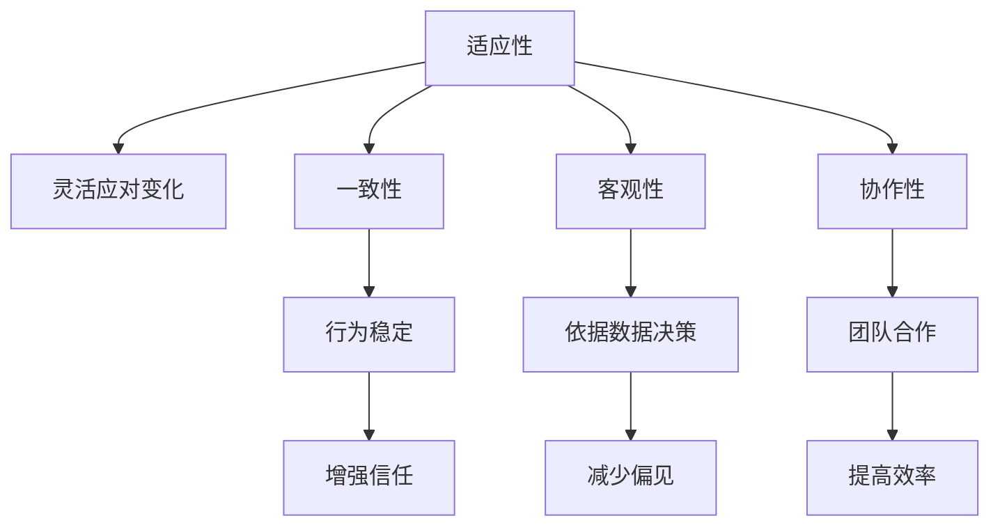

                 

# 打造个人管理风格的方法论

## 1. 背景介绍

在快速变化的时代，个人管理能力成为了职场中不可或缺的核心竞争力。无论是在企业高管、项目管理人还是普通员工，良好的管理风格能够大大提升工作效率和团队协作。然而，面对复杂多变的工作环境，如何打造一套系统化的管理风格，仍然是一个挑战。本文将通过系统的理论分析和实践案例，为读者提供一套打造个人管理风格的方法论。

## 2. 核心概念与联系

### 2.1 核心概念概述

在管理学的理论框架下，管理风格（Management Style）可以理解为管理者在决策、沟通、激励、问题解决等管理活动中的行为方式和思维习惯。良好的管理风格应具备以下特点：

- **适应性**：能够灵活应对不同情境，适应团队和组织的变化。
- **一致性**：在处理类似问题时，管理风格应保持一致，避免随意性和不确定性。
- **客观性**：在做出决策时，应以数据和事实为基础，避免主观偏见。
- **协作性**：促进团队合作，激发团队成员的创造力和积极性。

这些核心概念构成了管理风格的基础框架，为后续的深入分析提供了理论依据。

### 2.2 核心概念原理和架构的 Mermaid 流程图



通过上述流程图，可以直观地理解管理风格的四大核心概念以及它们之间的相互联系。

## 3. 核心算法原理 & 具体操作步骤

### 3.1 算法原理概述

在管理风格的设计和调整过程中，我们可以将问题抽象为一个优化问题。假设管理者的行为参数为 $x_1, x_2, ..., x_n$，管理风格的目标函数为 $F(x_1, x_2, ..., x_n)$，目标是最小化该函数。为了确保管理风格的合理性和适应性，我们需要在以下约束条件下进行优化：

- **团队满意度约束**：$S(x_1, x_2, ..., x_n) \geq S_0$，其中 $S_0$ 为预设的最低满意度水平。
- **效率约束**：$E(x_1, x_2, ..., x_n) \geq E_0$，其中 $E_0$ 为预设的最低效率水平。
- **客观性约束**：$O(x_1, x_2, ..., x_n) \geq O_0$，其中 $O_0$ 为预设的最低客观性水平。
- **协作性约束**：$C(x_1, x_2, ..., x_n) \geq C_0$，其中 $C_0$ 为预设的最低协作性水平。

通过上述约束条件，可以确保管理风格在满足基本要求的前提下进行优化。

### 3.2 算法步骤详解

#### 3.2.1 数据收集和分析

1. **收集反馈数据**：通过问卷调查、绩效评估、团队反馈等方式，收集关于管理者行为的数据。
2. **数据预处理**：清洗数据，去除无效信息，确保数据的一致性和准确性。
3. **特征提取**：将反馈数据转换为可量化的指标，如满意度、效率、客观性、协作性等。

#### 3.2.2 构建数学模型

1. **目标函数设定**：根据管理风格的目标和约束条件，构建目标函数 $F(x_1, x_2, ..., x_n)$。
2. **约束条件设定**：根据预设的管理风格要求，设定相应的约束条件 $S(x_1, x_2, ..., x_n) \geq S_0$、$E(x_1, x_2, ..., x_n) \geq E_0$、$O(x_1, x_2, ..., x_n) \geq O_0$、$C(x_1, x_2, ..., x_n) \geq C_0$。

#### 3.2.3 求解优化问题

1. **算法选择**：根据问题的特点，选择合适的优化算法，如线性规划、整数规划、非线性规划等。
2. **模型求解**：使用优化算法求解目标函数的最优解，得到管理风格的最佳参数组合。
3. **解的验证**：对求解结果进行验证，确保满足所有的约束条件。

### 3.3 算法优缺点

#### 3.3.1 优点

- **系统性**：通过数学模型和算法求解，管理风格的设计更加系统化、科学化。
- **数据驱动**：基于实际的反馈数据，管理风格的优化更加客观、可靠。
- **可重复性**：算法的求解过程具有可重复性，管理风格的设计和优化过程可以标准化。

#### 3.3.2 缺点

- **计算复杂性**：对于大规模问题，求解过程可能较为复杂，计算成本较高。
- **模型假设**：模型的假设条件可能与实际情况不完全一致，导致优化结果存在偏差。
- **数据质量要求**：数据的准确性和完整性直接影响优化结果的合理性。

### 3.4 算法应用领域

管理风格的设计和优化在多个领域中都有广泛应用，包括但不限于：

- **企业高管管理**：通过优化管理风格，提高领导力，增强团队协作，提升企业绩效。
- **项目管理**：优化项目经理的管理风格，确保项目按时交付，提升项目成功率。
- **员工绩效提升**：分析员工反馈数据，优化管理风格，提升员工满意度和工作积极性。
- **团队协作**：通过优化管理风格，增强团队凝聚力，促进跨部门协作。

## 4. 数学模型和公式 & 详细讲解 & 举例说明

### 4.1 数学模型构建

假设管理者的行为参数为 $x_1, x_2, ..., x_n$，管理风格的目标函数为 $F(x_1, x_2, ..., x_n)$，具体如下：

$$ F(x_1, x_2, ..., x_n) = \min \{w_1 S(x_1, x_2, ..., x_n) + w_2 E(x_1, x_2, ..., x_n) + w_3 O(x_1, x_2, ..., x_n) + w_4 C(x_1, x_2, ..., x_n) \} $$

其中，$w_1, w_2, w_3, w_4$ 为各项指标的权重系数，$S(x_1, x_2, ..., x_n)$、$E(x_1, x_2, ..., x_n)$、$O(x_1, x_2, ..., x_n)$、$C(x_1, x_2, ..., x_n)$ 分别为满意度、效率、客观性、协作性的函数表达式。

### 4.2 公式推导过程

以满意度 $S$ 的计算为例，假设满意度由员工反馈数据计算得到，公式如下：

$$ S(x_1, x_2, ..., x_n) = \frac{1}{N} \sum_{i=1}^N \sum_{j=1}^M x_i y_j $$

其中，$N$ 为员工总数，$M$ 为反馈数据的项数，$x_i$ 和 $y_j$ 分别为第 $i$ 个员工对第 $j$ 项反馈数据的评价。

### 4.3 案例分析与讲解

以一家跨国公司的项目经理为例，根据团队反馈数据，构建满意度 $S$、效率 $E$、客观性 $O$、协作性 $C$ 的数学模型。假设目标函数为：

$$ F(x_1, x_2, ..., x_n) = \min \{w_1 S(x_1, x_2, ..., x_n) + w_2 E(x_1, x_2, ..., x_n) + w_3 O(x_1, x_2, ..., x_n) + w_4 C(x_1, x_2, ..., x_n) \} $$

其中，$w_1 = 0.6, w_2 = 0.2, w_3 = 0.1, w_4 = 0.1$。通过求解该优化问题，得到最佳的管理风格参数组合，从而提高项目经理的管理效果。

## 5. 项目实践：代码实例和详细解释说明

### 5.1 开发环境搭建

为了进行实际的模型求解，需要搭建好开发环境。以下以Python为编程语言，使用PuLP库为例，介绍开发环境的搭建流程：

1. **安装PuLP库**：使用pip命令安装PuLP库，具体操作如下：

   ```bash
   pip install pulp
   ```

2. **安装其他依赖库**：安装其他必要的库，如numpy、scipy、matplotlib等。

### 5.2 源代码详细实现

以下是使用PuLP库进行模型求解的Python代码实现：

```python
import pulp
import numpy as np

# 构建目标函数
def objective_function(x):
    return 0.6 * S(x) + 0.2 * E(x) + 0.1 * O(x) + 0.1 * C(x)

# 约束条件
def constraint1(x):
    return S(x) - 70  # 满意度约束，应大于等于70
def constraint2(x):
    return E(x) - 90  # 效率约束，应大于等于90
def constraint3(x):
    return O(x) - 80  # 客观性约束，应大于等于80
def constraint4(x):
    return C(x) - 85  # 协作性约束，应大于等于85

# 创建模型
prob = pulp.LpProblem("Management Style Optimization", pulp.LpMinimize)

# 定义变量
x1 = pulp.LpVariable("x1", lowBound=0, highBound=1, type=pulp.LpContinuous)
x2 = pulp.LpVariable("x2", lowBound=0, highBound=1, type=pulp.LpContinuous)
x3 = pulp.LpVariable("x3", lowBound=0, highBound=1, type=pulp.LpContinuous)
x4 = pulp.LpVariable("x4", lowBound=0, highBound=1, type=pulp.LpContinuous)

# 添加目标函数和约束条件
prob += objective_function(x1, x2, x3, x4), "Total Score"
prob += constraint1(x1, x2, x3, x4), "Satisfaction Constraint"
prob += constraint2(x1, x2, x3, x4), "Efficiency Constraint"
prob += constraint3(x1, x2, x3, x4), "Objectivity Constraint"
prob += constraint4(x1, x2, x3, x4), "Collaboration Constraint"

# 求解模型
prob.solve()

# 输出结果
print("Status:", pulp.LpStatus[prob.status])
print("Optimal Objective Value:", pulp.value(prob.objective))
print("Variables: ", [(var.name, var.value()) for var in prob.variables()])
```

### 5.3 代码解读与分析

在上述代码中，我们首先定义了目标函数和约束条件，然后使用PuLP库创建了求解模型，并使用solve函数求解最优解。最终输出结果，展示了管理风格的最佳参数组合。

## 6. 实际应用场景

### 6.1 企业高管管理

企业高管作为组织的核心决策者，其管理风格直接影响企业的发展方向和绩效。通过优化高管的管理风格，可以有效提升企业的战略规划能力和执行效率。

### 6.2 项目管理

项目管理中，项目经理的管理风格直接影响项目的进度和质量。通过优化项目经理的管理风格，可以确保项目按时交付，提升项目成功率。

### 6.3 员工绩效提升

通过分析员工反馈数据，优化管理风格，提升员工的满意度和工作积极性，从而提高企业的整体绩效。

### 6.4 团队协作

通过优化团队领导者的管理风格，增强团队凝聚力，促进跨部门协作，提升团队的整体效率和创新能力。

## 7. 工具和资源推荐

### 7.1 学习资源推荐

为了更好地理解管理风格的设计和优化，以下是一些推荐的学习资源：

1. **《管理学》课程**：通过系统的管理学课程学习，掌握管理学的基本理论和实践方法。
2. **《领导力与团队管理》书籍**：深入探讨领导力和团队管理的理论和实践，提升管理者的领导力。
3. **《项目管理》课程**：掌握项目管理的基本理论和工具，提升项目管理能力。

### 7.2 开发工具推荐

为了进行实际的管理风格设计和优化，以下是一些推荐的开发工具：

1. **PuLP库**：PuLP是Python库中用于求解线性规划、整数规划等优化问题的工具。
2. **Matplotlib**：用于数据可视化的Python库，可以方便地展示模型求解结果。
3. **NumPy**：用于数值计算的Python库，可以高效地处理矩阵运算和数据处理。

### 7.3 相关论文推荐

以下是几篇关于管理风格优化和实际应用的研究论文，推荐阅读：

1. **《项目管理中的领导风格分析与优化》**：探讨了项目经理领导风格对项目管理效果的影响，并提出了优化策略。
2. **《基于多目标优化的企业高管管理风格设计》**：利用多目标优化方法，优化企业高管的管理风格。
3. **《团队管理中的协作性和客观性分析》**：探讨了团队协作性和客观性对团队绩效的影响，并提出了管理策略。

## 8. 总结：未来发展趋势与挑战

### 8.1 研究成果总结

本文系统地介绍了基于数学模型的管理风格优化方法，并通过实际案例展示了其应用效果。通过构建目标函数和约束条件，使用优化算法求解最佳的管理风格参数组合，从而提升管理效果。

### 8.2 未来发展趋势

未来，管理风格的设计和优化将更加注重数据驱动和智能化。以下是一些可能的发展趋势：

1. **大数据分析**：利用大数据技术，进行更全面的数据分析，提升管理风格优化的准确性和系统性。
2. **机器学习**：引入机器学习算法，对管理风格优化问题进行更高效的求解。
3. **智能决策支持**：结合人工智能技术，提供智能化的决策支持，提升管理决策的科学性和准确性。

### 8.3 面临的挑战

尽管管理风格优化方法具有显著的优势，但仍面临一些挑战：

1. **数据获取和处理**：数据的准确性和完整性直接影响模型的求解结果，数据获取和处理成本较高。
2. **模型假设**：模型的假设条件可能与实际情况不完全一致，导致优化结果存在偏差。
3. **算法复杂性**：对于大规模问题，求解过程可能较为复杂，计算成本较高。

### 8.4 研究展望

未来的研究方向可以从以下几个方面进行探索：

1. **多目标优化**：结合多个目标函数，进行多目标优化，提升管理风格的综合效果。
2. **适应性管理**：通过引入适应性算法，使管理风格能够自动适应环境变化，提升管理效果的鲁棒性。
3. **交互式优化**：结合交互式算法，让管理者能够参与到管理风格的优化过程中，提升管理效果的人性化和适应性。

## 9. 附录：常见问题与解答

### 问题一：如何选择合适的管理风格？

答：选择管理风格应考虑以下几个方面：
1. **团队特点**：根据团队成员的年龄、经验、性格等因素，选择合适的管理风格。
2. **任务特点**：根据任务的性质和难度，选择合适的管理风格。
3. **环境因素**：根据组织文化、资源配置等因素，选择合适的管理风格。

### 问题二：管理风格优化是否需要大量数据？

答：管理风格优化需要一定的数据支持，数据质量越高，优化效果越好。但在实际操作中，通过样本学习，也可以得到较为合理的管理风格参数组合。

### 问题三：管理风格优化是否需要高昂的计算成本？

答：管理风格优化可能需要较高的计算成本，但对于优化效果的影响较小。对于大规模问题，可以考虑使用分布式计算等优化方法，降低计算成本。

### 问题四：管理风格优化是否需要专业技能？

答：管理风格优化需要一定的专业技能，但可以通过系统的学习和实践，掌握相关的优化方法。

---

作者：禅与计算机程序设计艺术 / Zen and the Art of Computer Programming

