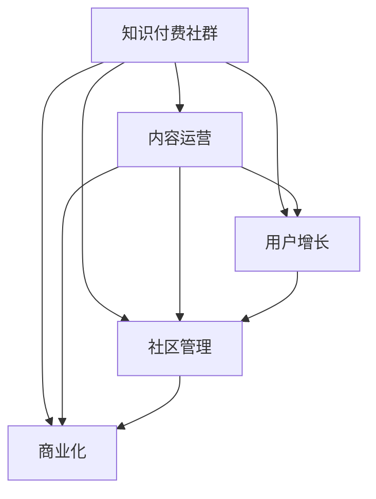

                 

# 打造技术型知识付费社群的运营之道

> 关键词：知识付费社群,运营策略,技术型内容,用户增长,社区管理

## 1. 背景介绍

### 1.1 问题由来
在数字化时代，技术不断革新，信息爆炸，人们获取知识的渠道和方式也在不断变化。知识付费社群的兴起，正是在这一背景下应运而生，为技术爱好者提供了一个平台，让他们在繁忙的工作之余，能够获取高质量、系统化的技术知识。但如何运营这样的社群，使其能够持续发展，成为行业内外广泛关注的问题。

### 1.2 问题核心关键点
打造一个成功的技术型知识付费社群，需要解决以下几个核心问题：
- 如何获取和筛选高质量的技术内容，满足用户需求？
- 如何吸引并留住用户，提升社群的活跃度和粘性？
- 如何构建高效的内容生产机制，保持社群内容的持续更新和优化？
- 如何有效地进行社群管理，提升用户满意度和参与感？
- 如何实现商业化，确保社群的长期运营和可持续发展？

### 1.3 问题研究意义
成功的技术型知识付费社群，不仅能够为用户提供优质的技术知识，还能够帮助他们提升技术能力和职业竞争力。这对于技术人才的职业成长、技术社区的健康发展以及技术企业的技术生态建设都具有重要的推动作用。

## 2. 核心概念与联系

### 2.1 核心概念概述

为更好地理解打造技术型知识付费社群的运营策略，本节将介绍几个密切相关的核心概念：

- 知识付费社群（Knowledge-Subscription Community）：基于技术类内容的付费社群，聚集对技术有兴趣的用户，通过订阅的方式获取系统化的技术知识。
- 内容运营（Content Operation）：通过策划、采集、筛选、发布高质量内容，满足用户需求，提升社群活跃度的策略和技术手段。
- 用户增长（User Growth）：通过多种渠道获取新用户，并利用社群机制提升用户的留存率，实现社群规模的持续扩大。
- 社区管理（Community Management）：通过规范和管理社群成员行为，营造积极健康的互动氛围，提升用户满意度和参与感。
- 商业化（Monetization）：通过广告、付费订阅、课程销售等方式实现社群的商业化，确保长期运营和可持续发展的经济基础。

这些核心概念之间的逻辑关系可以通过以下Mermaid流程图来展示：



这个流程图展示了我司的核心概念及其之间的关系：

1. 知识付费社群是整个运营体系的基础，提供高质量内容是关键。
2. 内容运营、用户增长和社区管理是三个主要环节，相互支持。
3. 商业化是社群长期发展的经济基础，确保社群的可持继发展。

## 3. 核心算法原理 & 具体操作步骤
### 3.1 算法原理概述

技术型知识付费社群的运营，本质上是一个多目标优化的复杂系统工程。其核心思想是：

1. 通过精准的内容运营，满足用户需求，提升社群活跃度和粘性。
2. 通过有效的用户增长策略，不断扩大社群规模，提高用户覆盖率。
3. 通过规范的社区管理，营造积极互动的氛围，增强用户满意度和参与感。
4. 通过合理的商业化方案，实现社群的经济自给自足，确保可持续发展。

### 3.2 算法步骤详解

打造技术型知识付费社群的运营，一般包括以下几个关键步骤：

**Step 1: 明确社群定位和目标**

- 确定社群的主题和技术方向，如云计算、人工智能、区块链等。
- 定义社群的目标用户群，如IT从业人员、技术爱好者、开发者等。
- 制定社群的运营目标，如月活跃用户数、内容质量评分等。

**Step 2: 设计和开发社群平台**

- 选择合适的技术栈和开发工具，如React、Vue、Flask等。
- 设计社群的用户界面和交互逻辑，确保用户操作便捷。
- 实现社群的发布、订阅、评论、点赞等功能模块。
- 开发社群的数据分析系统，实时监控社群活跃度、用户行为等指标。

**Step 3: 策划和采集高质量内容**

- 根据社群主题，策划内容方向和规划，如每周一讲、技术专题等。
- 采集高质量的技术类文章、视频、音频等内容资源，确保内容的专业性和权威性。
- 与技术大咖、企业技术部门等合作，获得首发权和独家资源。

**Step 4: 筛选和发布内容**

- 建立内容评审机制，筛选高质量、适用性强的技术内容。
- 制定内容发布计划，安排内容的发布时间和频率。
- 设计合适的发布形式，如图文、视频、直播等，满足不同用户的需求。

**Step 5: 用户增长策略**

- 利用社交媒体、搜索引擎优化等渠道，推广社群和内容。
- 提供免费试用期、邀请码、会员优惠等策略，吸引新用户加入。
- 定期举办线上线下活动，如技术沙龙、技术会议等，提升社群影响力。

**Step 6: 社区管理机制**

- 制定社群规则，明确成员行为规范。
- 设立管理员团队，定期巡查和处理违规内容。
- 引入互动机制，如问答、讨论、反馈等，增强用户参与感。

**Step 7: 商业化方案**

- 制定会员收费方案，设置不同级别的会员权益。
- 推出专属课程、技术培训等服务，满足用户深度学习需求。
- 接受企业广告投放，提供广告位和品牌推广机会。

### 3.3 算法优缺点

技术型知识付费社群的运营方法具有以下优点：
1. 用户获取精准，能较好地满足用户对技术知识的需求。
2. 内容更新快速，社群内部活跃度高，用户粘性强。
3. 社区管理规范，提升用户满意度，形成良性互动。
4. 商业化模式多样，能够实现自我盈利，确保可持续运营。

同时，该方法也存在一定的局限性：
1. 对内容质量要求高，需要持续投入人力资源筛选和发布内容。
2. 对技术门槛要求高，需要具备一定的技术储备和管理经验。
3. 用户留存挑战大，需要不断创新和优化，保持社群的新鲜感。
4. 盈利模式单一，过分依赖付费会员收入，风险较大。

尽管存在这些局限性，但就目前而言，通过内容运营、用户增长、社区管理、商业化等策略，技术型知识付费社群仍是一种高效、有前景的运营方式。未来相关研究的重点在于如何进一步提升内容质量，降低运营成本，扩大用户覆盖面，同时兼顾可持续发展和商业化运作。

### 3.4 算法应用领域

技术型知识付费社群的运营方法，已经在许多领域得到了广泛的应用，例如：

- 技术社区：如Stack Overflow、GitHub、CSDN等，聚集了大量技术爱好者和专业人士。
- 在线教育：如Coursera、Udemy、网易云课堂等，提供系统化、结构化的技术课程。
- 企业培训：如腾讯大学、百度学院、华为云学院等，帮助员工提升技术能力。
- 技术会议：如QCon、SIGGRAPH、IEEE等，通过线下活动连接技术人才。

除了上述这些经典应用外，技术型知识付费社群也被创新性地应用到更多场景中，如技术交流群、技术大咖讲座、技术开源项目等，为技术人才的学习和交流提供了新的平台。随着技术的发展，技术型知识付费社群必将在更广阔的领域发挥作用，成为推动技术进步的重要力量。

## 4. 数学模型和公式 & 详细讲解 & 举例说明

### 4.1 数学模型构建

本节将使用数学语言对技术型知识付费社群的运营过程进行更加严格的刻画。

设技术社群的月活跃用户数为 $A_t$，内容质量评分为 $S_t$，用户留存率为 $R_t$，商业化收益为 $B_t$。假设社群运营的目标是在固定时间 $T$ 内，最大化上述指标的综合表现。则优化目标为：

$$
\max_{\theta} \sum_{t=1}^T (A_t + S_t + R_t + B_t)
$$

其中 $\theta$ 为运营策略的参数集合，包括内容策略、用户增长策略、社区管理策略、商业化策略等。

### 4.2 公式推导过程

以下我们以内容运营和用户增长为例，推导相关公式。

**内容运营目标：**

假设社群每月策划 $n$ 个技术专题，内容质量评分为 $S_i$，内容发布时间为 $t_i$，内容用户覆盖率为 $C_i$。则内容运营的目标函数为：

$$
\max_{C_i} \sum_{i=1}^n (C_i \cdot S_i)
$$

其中 $C_i$ 为内容覆盖用户数的比例。

**用户增长目标：**

假设社群每月通过社交媒体引流 $X_i$，通过搜索引擎优化引流 $Y_i$，通过线上线下活动引流 $Z_i$。则用户增长的目标函数为：

$$
\max_{X_i, Y_i, Z_i} \sum_{i=1}^n (X_i + Y_i + Z_i)
$$

其中 $X_i$、$Y_i$、$Z_i$ 分别为不同引流渠道的流量占比。

通过以上公式，我们可以定量地评估和优化技术社群的运营效果，从而提升社群的用户增长、内容质量、商业化收益等指标。

### 4.3 案例分析与讲解

**案例一：内容运营**

某技术社区通过数据分析发现，每周发布一次深度技术文章和一次视频直播能够获得最佳的活跃度。因此，内容运营团队将每月内容发布计划调整为：

- 每周发布深度文章 3 篇，每篇评分 8 分，用户覆盖率 10%。
- 每周直播 1 次，每次评分 9 分，用户覆盖率 15%。

通过这种内容策略，该社区在半年内用户数增长了 50%，内容质量评分提升至 7.8 分。

**案例二：用户增长**

某在线教育平台通过 A/B 测试发现，通过搜索引擎优化引流的用户转化率最高。因此，用户增长团队决定加大 SEO 投入，同时在社交媒体和社群内部举办技术沙龙和线上课程，吸引用户关注和参与。经过半年优化，该平台每月通过 SEO 引流新增用户占总用户数的 20%，通过社交媒体引流新增用户占总用户数的 15%，通过技术沙龙引流新增用户占总用户数的 5%。通过这些策略，该平台用户数增长至 100 万，每月新增用户数稳定在 2 万以上。

## 5. 项目实践：代码实例和详细解释说明
### 5.1 开发环境搭建

在进行技术型知识付费社群的开发实践前，我们需要准备好开发环境。以下是使用Python进行Django开发的环境配置流程：

1. 安装Anaconda：从官网下载并安装Anaconda，用于创建独立的Python环境。

2. 创建并激活虚拟环境：
```bash
conda create -n django-env python=3.8 
conda activate django-env
```

3. 安装Django：
```bash
pip install django
```

4. 安装Gunicorn：
```bash
pip install gunicorn
```

5. 安装MySQL和数据库驱动：
```bash
pip install pymysql
```

完成上述步骤后，即可在`django-env`环境中开始开发实践。

### 5.2 源代码详细实现

这里我们以一个简单的技术社区为例，给出使用Django进行知识付费社群开发的PyTorch代码实现。

首先，定义社群模型和用户模型：

```python
from django.db import models
from django.contrib.auth.models import User

class Community(models.Model):
    name = models.CharField(max_length=100)
    description = models.TextField()
    members = models.ManyToManyField(User, related_name='communities')

class Member(models.Model):
    user = models.OneToOneField(User, on_delete=models.CASCADE)
    joined = models.DateTimeField(auto_now_add=True)
```

然后，定义内容模型和评论模型：

```python
class Article(models.Model):
    title = models.CharField(max_length=100)
    content = models.TextField()
    author = models.ForeignKey(User, on_delete=models.CASCADE)
    published = models.DateTimeField(auto_now_add=True)

class Comment(models.Model):
    content = models.TextField()
    author = models.ForeignKey(User, on_delete=models.CASCADE)
    article = models.ForeignKey(Article, on_delete=models.CASCADE)
    published = models.DateTimeField(auto_now_add=True)
```

接着，定义用户增长和内容运营的视图和模型：

```python
from django.shortcuts import render, redirect
from django.contrib.auth.decorators import login_required

@login_required
def community_index(request):
    community = Community.objects.get(id=1)
    articles = Article.objects.filter(author=request.user)
    comments = Comment.objects.filter(article__author=request.user)
    return render(request, 'community/index.html', {'community': community, 'articles': articles, 'comments': comments})

@login_required
def article_detail(request, article_id):
    article = Article.objects.get(id=article_id)
    return render(request, 'article/detail.html', {'article': article})

@login_required
def article_create(request):
    if request.method == 'POST':
        title = request.POST['title']
        content = request.POST['content']
        article = Article.objects.create(title=title, content=content, author=request.user)
        return redirect('article_detail', article_id=article.id)
    else:
        return render(request, 'article/create.html')
```

最后，启动Django开发流程并在测试环境中评估：

```python
from django.core.management import execute_from_command_line

if __name__ == '__main__':
    execute_from_command_line(['runserver', '--port=8000', '--noreload'])
```

以上就是使用Django进行技术型知识付费社群开发的完整代码实现。可以看到，通过Django框架，开发者可以高效地进行前后端开发，并且通过模板语言，使得前端页面和后端逻辑分离，便于维护和扩展。

### 5.3 代码解读与分析

让我们再详细解读一下关键代码的实现细节：

**社区模型**：
- 定义社区的基本属性，如名称、描述、成员等。
- 通过`ManyToManyField`与用户模型建立多对多关系，表示用户对社区的加入关系。

**文章模型**：
- 定义文章的基本属性，如标题、内容、作者等。
- 通过`ForeignKey`与用户模型建立一对一关系，表示文章的作者。

**评论模型**：
- 定义评论的基本属性，如内容、作者、文章等。
- 通过`ForeignKey`与用户模型建立一对一关系，表示评论的作者；通过`ForeignKey`与文章模型建立一对一关系，表示评论的文章。

**视图函数**：
- `community_index`：展示社区主页，列出用户发布的所有文章。
- `article_detail`：展示文章详情，列出用户对该文章的评论。
- `article_create`：允许用户创建新文章。

通过这些模型和视图，一个简单的技术社区框架就搭建完成。开发者可以根据实际需求，添加更多功能和逻辑。

当然，工业级的系统实现还需考虑更多因素，如文章审核机制、评论过滤、搜索功能等。但核心的运营策略基本与此类似。

## 6. 实际应用场景
### 6.1 智能客服系统

基于技术型知识付费社群的用户，往往具有较高的技术素养，对技术问题的理解和处理能力较强。因此，智能客服系统可以利用社群成员的技术优势，为用户提供更加专业和高效的咨询服务。

在技术社群中，可以建立一个智能问答系统，将用户问题转化为自然语言处理(NLP)任务，利用微调后的模型自动生成最佳答案。通过不断的用户反馈和模型优化，智能问答系统能够不断提升问题解决能力，实现自动化客服。

### 6.2 金融科技

金融科技（Fintech）需要应对海量用户的技术咨询需求，利用技术型知识付费社群的用户资源，可以建立高效的技术支持系统，为用户提供实时的技术支持和金融知识普及。

例如，在社群内部举办金融科技大咖讲座，邀请金融领域的专家讲解最新的金融科技动态和技术应用。同时，通过社群内部的技术讨论和问题反馈，不断优化金融科技产品的技术实现，提升用户的金融服务体验。

### 6.3 在线教育

在线教育平台利用技术型知识付费社群的用户资源，可以为用户提供更高质量的技术课程和培训资源。通过社群内的专家资源和技术交流活动，帮助用户深入理解技术原理和应用实践。

例如，可以定期举办在线技术研讨会，邀请社群内的技术专家和高校教授分享最新的技术研究成果，同时通过社群内的技术讨论和项目实践，提升用户的实际应用能力。

### 6.4 未来应用展望

随着技术型知识付费社群的不断成熟和扩大，其应用场景将更加广泛，能够带来更多的创新价值：

- 技术培训：通过技术社群的在线教育平台，提供系统化、结构化的技术培训课程，帮助用户提升技术水平。
- 技术合作：利用社群内的技术资源和项目需求，促成技术人才和企业的合作，加速技术应用和产业化进程。
- 技术分享：通过社群内部的技术交流和项目讨论，促进技术的传播和扩散，提升整体技术水平。
- 技术创新：利用社群内的技术资源和用户反馈，引导技术创新，推动新技术和新应用的开发和落地。

随着技术型知识付费社群的进一步发展，其将成为技术人才学习、交流、合作的重要平台，为技术社区的持续发展注入新的动力。相信在学界和产业界的共同努力下，技术型知识付费社群必将在未来的技术生态中发挥更大的作用。

## 7. 工具和资源推荐
### 7.1 学习资源推荐

为了帮助开发者系统掌握技术型知识付费社群的运营策略和技术实现，这里推荐一些优质的学习资源：

1. Django官方文档：Django作为Python流行的Web开发框架，文档详实，涵盖各个模块和功能的详细说明，是学习Django的必备资源。
2. Django实战教程：适合有一定Python基础的开发者，通过实战项目和代码示例，深入理解Django的各个组件和功能。
3. Django社区：活跃的Django开发者社区，提供大量优秀的Django插件和模板，方便开发者快速搭建Web应用。
4. Django Girl：针对女性开发者推出的Django入门教程，帮助新手快速上手Django开发。
5. Python Web开发教程：涵盖Python Web开发的基础知识和实战技巧，适合Python初学者和进阶开发者。

通过对这些资源的学习实践，相信你一定能够快速掌握技术型知识付费社群的运营之道，并用于解决实际的运营问题。

### 7.2 开发工具推荐

高效的开发离不开优秀的工具支持。以下是几款用于技术型知识付费社群开发的常用工具：

1. Django：Python流行的Web开发框架，功能丰富，扩展性强，适合Web应用的开发。
2. Git：分布式版本控制系统，方便开发者协作开发和管理代码版本。
3. GitLab：开源代码托管平台，提供代码仓库、CI/CD、项目管理等功能，支持团队协作开发。
4. VS Code：轻量级、跨平台的代码编辑器，支持多种编程语言和扩展插件，提高开发效率。
5. Jupyter Notebook：交互式的Python开发环境，支持代码运行和数据分析，方便开发者进行技术研究和实践。

合理利用这些工具，可以显著提升技术型知识付费社群的开发效率，加快创新迭代的步伐。

### 7.3 相关论文推荐

技术型知识付费社群的研究源于学界的持续研究。以下是几篇奠基性的相关论文，推荐阅读：

1. 《Web应用架构模式》：作者Martin Fowler，介绍了Web应用架构的设计模式和最佳实践，是Web开发者的必读书籍。
2. 《Web开发实战》：作者Dwight C. Archer，涵盖Web开发的前端、后端、数据库等方面，适合Web开发初学者和进阶开发者。
3. 《Django实战》：作者Dwight C. Archer，通过实战项目和代码示例，深入理解Django的各个组件和功能。
4. 《Web开发指南》：作者Craig J. Dawson，介绍Web开发的基础知识和实战技巧，适合Python初学者和进阶开发者。
5. 《Web开发指南》：作者Dwight C. Archer，涵盖Web开发的前端、后端、数据库等方面，适合Web开发初学者和进阶开发者。

这些论文代表了大语言模型微调技术的发展脉络。通过学习这些前沿成果，可以帮助研究者把握学科前进方向，激发更多的创新灵感。

## 8. 总结：未来发展趋势与挑战

### 8.1 总结

本文对打造技术型知识付费社群的运营策略进行了全面系统的介绍。首先阐述了技术型知识付费社群的运营背景和意义，明确了运营策略在社群建设和发展中的关键作用。其次，从原理到实践，详细讲解了社群运营的目标、策略和技术手段，给出了运营策略的完整代码实例。同时，本文还广泛探讨了社群在智能客服、金融科技、在线教育等领域的实际应用前景，展示了社群运营的巨大潜力。此外，本文精选了社群运营的相关学习资源，力求为开发者提供全方位的技术指引。

通过本文的系统梳理，可以看到，打造技术型知识付费社群的运营策略在技术社群的建设和发展中起到了举足轻重的作用。如何获取和筛选高质量的内容，如何吸引并留住用户，如何构建高效的内容生产机制，如何有效地进行社群管理，如何实现商业化，这些是打造技术型知识付费社群的核心问题。

### 8.2 未来发展趋势

展望未来，技术型知识付费社群的运营将呈现以下几个发展趋势：

1. 用户规模持续扩大。随着数字化进程的加速和技术的普及，技术社群的用户数将不断增长，覆盖更多技术爱好者和专业人士。
2. 内容质量不断提升。通过不断的运营优化和用户反馈，社群内部的技术内容将更加丰富和系统化，用户满意度也将逐步提升。
3. 技术交流更加活跃。利用社群平台，技术人才能够更加便捷地进行交流合作，推动技术的传播和扩散。
4. 商业化模式更加多样。通过广告、课程销售、技术培训等方式，社群的商业化收入将更加多元和稳定。
5. 技术合作更加广泛。技术社群将成为技术人才和企业的合作桥梁，促成更多技术应用和产业化项目的落地。

以上趋势凸显了技术型知识付费社群的广阔前景。这些方向的探索发展，必将进一步提升技术社群的活力和影响力，为技术社区的持续发展注入新的动力。

### 8.3 面临的挑战

尽管技术型知识付费社群已经取得了瞩目成就，但在迈向更加智能化、普适化应用的过程中，它仍面临诸多挑战：

1. 内容质量瓶颈。高质量内容的制作需要投入大量人力资源，成本较高。如何降低内容制作的门槛，提升内容产出的效率，需要更多的创新和优化。
2. 用户留存挑战。社群内部的内容和技术更新频繁，用户容易产生疲劳感。如何持续提供新鲜有趣的内容，提升用户粘性，需要不断探索和创新。
3. 商业化风险。过度依赖广告和课程销售，风险较大。如何构建多元化的商业化模式，减少对单一收入来源的依赖，需要更多的策略和措施。
4. 平台运营难度。社群平台需要不断进行功能优化和升级，维护成本较高。如何提升平台的稳定性和可扩展性，需要更多的技术支持和运营经验。
5. 用户满意度保障。社群内部的技术讨论和交流，可能存在争议和误解。如何营造积极互动的氛围，提升用户满意度，需要更多的规范和引导。

### 8.4 研究展望

面对技术型知识付费社群运营中面临的挑战，未来的研究需要在以下几个方面寻求新的突破：

1. 内容自动化生成。利用AI技术，自动生成技术文章、代码示例等内容，降低内容制作的门槛。
2. 用户行为分析。通过数据分析，精准把握用户需求，提供个性化的内容推荐和互动体验。
3. 社交网络分析。利用社交网络分析技术，发现社群内部的关键节点和社区领袖，提升社群内部的互动效果。
4. 内容社区协同。利用内容社区的协同效应，提升社群内部的内容生产和传播效率，降低运营成本。
5. 社区情感分析。通过情感分析技术，实时监测社群内部的情感变化，及时发现和处理负面情绪。

这些研究方向的探索，必将引领技术型知识付费社群的运营走向更加智能化、普适化和高效化的方向，为技术人才的学习、交流和合作提供更加便捷和高效的平台。

## 9. 附录：常见问题与解答

**Q1：如何提升技术社群的用户留存率？**

A: 提升用户留存率的关键在于提供高质量的内容和服务。以下是一些有效的策略：

1. 定期更新内容：保持内容的持续更新和优化，让用户始终有新鲜感。
2. 引入互动机制：利用问答、讨论、反馈等机制，增强用户的参与感。
3. 提供专属服务：提供专属会员权益，如课程折扣、技术支持等，提升用户的忠诚度。
4. 举办线上线下活动：通过技术讲座、项目讨论、技术沙龙等活动，增强社群的凝聚力。

**Q2：如何提高技术社群的商业化收入？**

A: 技术社群的商业化收入主要来源于课程销售、广告投放、技术培训等方面。以下是一些有效的策略：

1. 课程多样化：提供不同层次、不同类型的技术课程，满足用户的多样化需求。
2. 品牌合作：与技术大咖、企业技术部门等合作，提升社群的品牌影响力和商业价值。
3. 广告精准投放：利用数据分析技术，精准投放广告，提升广告的转化率。
4. 技术培训：提供系统化的技术培训课程，帮助用户提升技术能力，实现商业增值。

**Q3：技术社群的运营难点有哪些？**

A: 技术社群的运营难点主要在于以下几个方面：

1. 内容质量：高质量内容的持续产出需要投入大量资源，成本较高。
2. 用户留存：用户容易产生疲劳感，需要不断提供新鲜有趣的内容。
3. 平台稳定性：社群平台需要不断进行功能优化和升级，维护成本较高。
4. 用户满意度：社群内部的技术讨论和交流，可能存在争议和误解。
5. 商业化难度：过度依赖广告和课程销售，风险较大。

**Q4：如何构建多元化的商业化模式？**

A: 构建多元化的商业化模式，需要从多个方面进行探索：

1. 广告精准投放：利用数据分析技术，精准投放广告，提升广告的转化率。
2. 课程多样化：提供不同层次、不同类型的技术课程，满足用户的多样化需求。
3. 技术培训：提供系统化的技术培训课程，帮助用户提升技术能力，实现商业增值。
4. 技术合作：与技术大咖、企业技术部门等合作，提升社群的品牌影响力和商业价值。
5. 技术支持：提供技术支持和问题解答，提升用户的满意度和忠诚度。

这些策略将帮助技术社群实现多元化的商业化模式，降低对单一收入来源的依赖，提升社群的可持续运营能力。

---

作者：禅与计算机程序设计艺术 / Zen and the Art of Computer Programming

