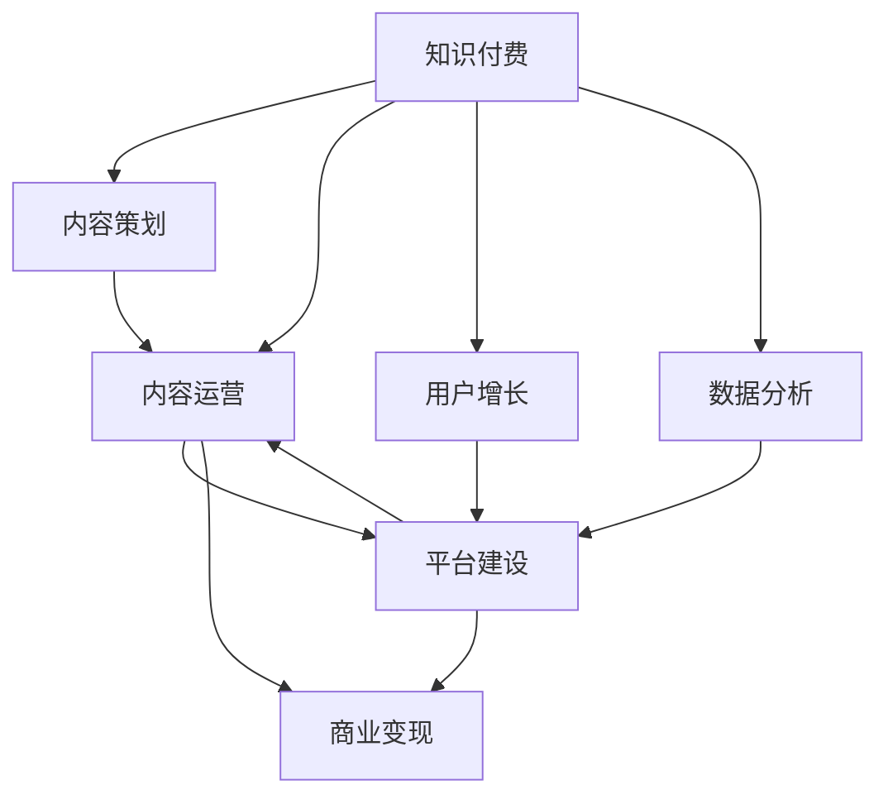

                 

# 打造知识付费专栏:内容策划与运营

> 关键词：知识付费,内容策划,内容运营,平台建设,用户增长,商业模式,数据驱动

## 1. 背景介绍

随着互联网技术的快速发展和普及，知识付费模式日渐成为新时代的宠儿。各领域的专家学者通过在线课程、专栏文章、直播分享等形式，为大众提供高质量的知识产品。知识付费不仅能帮助人们高效学习和自我提升，还能为创作者带来稳定的收入，实现知识变现。因此，内容策划与运营成为知识付费平台成功的关键环节。

本文将系统介绍知识付费专栏的策划与运营方法，从内容定位、选题策划、平台建设、内容生成、用户增长、商业变现、数据分析等多个维度展开，帮助平台和创作者构建可持续发展的知识付费生态。

## 2. 核心概念与联系

### 2.1 核心概念概述

为更好地理解知识付费专栏的内容策划与运营，本文将介绍以下几个核心概念：

- **知识付费**：指将知识、技能、经验等内容产品化为收费服务，通过在线平台提供，帮助用户学习和提升的商业模式。

- **内容策划**：指根据用户需求和市场趋势，选择并设计专栏主题、结构、形式等，保证内容系统性和实用性，提高用户满意度和留存率。

- **内容运营**：指通过合理推广和维护专栏内容，提高用户参与度和品牌忠诚度，实现内容的高频传播和商业变现。

- **平台建设**：指搭建知识付费平台，包括网站、APP、社交媒体等，实现内容与用户的高效互动，提供多样化的知识服务和商业渠道。

- **用户增长**：指通过营销、广告、活动等手段，吸引更多用户关注和使用平台，增加流量和活跃度。

- **商业变现**：指通过专栏订阅、广告投放、知识付费服务费、周边产品销售等手段，实现平台的盈利。

- **数据分析**：指通过收集和分析平台用户的各项数据，发现用户行为和偏好，优化内容策略和运营手段，提高转化率和用户粘性。

这些核心概念之间的关系如图：



通过理解这些核心概念及其关系，可以更好地把握知识付费专栏的内容策划与运营工作。

## 3. 核心算法原理 & 具体操作步骤

### 3.1 算法原理概述

知识付费专栏的内容策划与运营，本质上是通过数据分析、内容优化和用户互动，实现内容的高频传播和商业变现。其核心思想是：

- **内容定位**：根据市场调研和用户需求，确定专栏的主题和形式。
- **内容策划**：基于用户数据和内容资源，设计专栏的结构和内容。
- **内容生成**：通过专业作者和团队协作，制作高质量的专栏内容。
- **内容运营**：通过推广、互动和数据分析，持续优化和调整内容策略。
- **用户增长**：利用多种营销手段，吸引更多用户关注和使用专栏。
- **商业变现**：通过订阅、广告、合作等手段，实现平台的盈利。

### 3.2 算法步骤详解

#### 3.2.1 内容定位

1. **市场调研**：通过问卷调查、访谈、竞品分析等手段，了解目标用户群体、兴趣点、学习需求等。

2. **趋势分析**：根据热门话题、技术趋势、社会热点等，判断内容创作的可行性。

3. **用户画像**：构建详细的用户画像，包括年龄、性别、职业、学习水平等，以便有针对性地策划内容。

4. **内容选题**：结合市场调研和趋势分析，确定专栏的主题和方向。

#### 3.2.2 内容策划

1. **结构设计**：设计专栏的整体结构，包括引言、主体、结尾等部分，以及各部分的具体内容。

2. **内容编排**：根据用户画像和内容结构，合理分配各期专栏的选题、形式和深度。

3. **素材收集**：收集和整理与选题相关的数据、文献、视频、音频等素材，作为内容创作的依据。

#### 3.2.3 内容生成

1. **专业作者**：邀请行业专家、学者、作家等专业人士撰写内容，确保专栏的高质量。

2. **团队协作**：组建内容制作团队，分工协作完成内容制作，包括撰写、编辑、校对、设计等环节。

3. **内容审核**：对制作完成的内容进行审核，保证内容的准确性和专业性。

#### 3.2.4 内容运营

1. **推广手段**：通过SEO优化、社交媒体、邮件营销、广告投放等手段，提升专栏的曝光率和访问量。

2. **互动管理**：通过评论、问答、直播等形式，增加用户参与度，促进用户互动。

3. **数据分析**：收集和分析用户行为数据，如访问量、停留时间、用户评论等，优化内容和运营策略。

#### 3.2.5 用户增长

1. **营销活动**：定期举办各种活动，如抽奖、打卡、签到等，吸引新用户关注和使用专栏。

2. **社交传播**：利用用户生成内容（UGC），如评论、分享、推荐等，扩大内容的传播范围。

3. **合作推广**：与其他平台、博主、KOL等合作，进行跨平台推广，增加用户来源。

#### 3.2.6 商业变现

1. **订阅服务**：提供专栏订阅服务，收取固定费用，获取稳定的收入来源。

2. **广告投放**：在专栏页面或相关文章中，植入广告，实现平台的广告变现。

3. **合作分成**：与其他内容平台、广告主等合作，根据流量和效果进行分成，增加盈利渠道。

#### 3.2.7 数据分析

1. **数据收集**：收集用户的访问数据、行为数据、互动数据等。

2. **数据分析**：通过数据挖掘和统计分析，发现用户偏好和行为规律。

3. **策略调整**：根据数据分析结果，优化内容策划和运营策略，提高用户满意度和留存率。

### 3.3 算法优缺点

**优点**：
- **高效性**：通过数据分析和内容优化，快速提升专栏的曝光率和用户参与度，实现高频传播和商业变现。
- **适应性强**：根据市场变化和用户需求，灵活调整内容策略和运营手段，保持专栏的活力和竞争力。
- **平台化运营**：通过统一的平台管理和多渠道推广，提高运营效率和品牌影响力。

**缺点**：
- **数据隐私**：收集和使用用户数据时，需要重视隐私保护，避免数据泄露和滥用。
- **内容成本**：高质量内容的制作成本较高，需投入较多资源和人力。
- **运营难度**：内容运营需要持续监测和调整，存在一定的运营难度。

### 3.4 算法应用领域

基于上述算法原理，知识付费专栏的内容策划与运营技术广泛应用于以下几个领域：

- **在线教育**：通过高质量的课程和专栏，帮助用户系统学习和提升专业技能。

- **职场培训**：提供职业发展和技能提升的各类知识产品，助力职业成长。

- **健康生活**：分享健康知识、健身技巧、心理调适等内容，提升生活质量。

- **文化娱乐**：推出电影评论、文学赏析、历史故事等专栏，丰富用户文化生活。

- **科技前沿**：探讨最新科技成果和应用案例，引领科技潮流。

## 4. 数学模型和公式 & 详细讲解 & 举例说明

### 4.1 数学模型构建

知识付费专栏的内容策划与运营，涉及多个变量和复杂的关系，构建数学模型可以帮助我们更系统地理解和优化这些关系。

设：
- $U$ 为用户集合，包含用户$u_1, u_2, ..., u_N$。
- $C$ 为专栏内容集合，包含专栏$c_1, c_2, ..., c_M$。
- $R$ 为用户对专栏的评价集合，包含评价$r_1, r_2, ..., r_D$。

目标函数为最大化用户参与度和平台收入，优化策略为内容策划和运营。

### 4.2 公式推导过程

通过构建用户行为模型，可以描述用户对专栏的兴趣和互动情况。

用户$u_i$对专栏$c_j$的兴趣度为：

$$
I_{u_i, c_j} = w_1 \times \text{访问次数}_{c_j} + w_2 \times \text{互动次数}_{c_j} + w_3 \times \text{评分}_{c_j}
$$

其中，$w_1, w_2, w_3$为权重系数，$\text{访问次数}_{c_j}$、$\text{互动次数}_{c_j}$和$\text{评分}_{c_j}$分别表示用户$u_i$对专栏$c_j$的访问次数、互动次数和评分。

### 4.3 案例分析与讲解

**案例分析**：

假设有两个专栏，A和B，用户$u_1$和$u_2$分别对这两个专栏的兴趣度如下：

- $I_{u_1, A} = 0.8 \times 10 + 0.2 \times 5 + 0.2 \times 4 = 6.4$
- $I_{u_1, B} = 0.8 \times 8 + 0.2 \times 3 + 0.2 \times 3.5 = 6.5$

通过计算得出，用户$u_1$对B专栏的兴趣度高于A专栏，可能会优先选择B专栏。

通过类似的方法，可以构建和优化其他用户对专栏的兴趣度模型，从而指导内容策划和运营策略。

## 5. 项目实践：代码实例和详细解释说明

### 5.1 开发环境搭建

1. **编程语言**：Python是推荐的主流编程语言，拥有丰富的第三方库和框架，如Pandas、NumPy、Scikit-learn等，便于数据分析和建模。

2. **数据工具**：SQLite、MySQL、Hive等数据库，可以存储和查询用户行为数据。

3. **数据可视化**：使用Matplotlib、Seaborn、Tableau等工具，将数据可视化展示，便于分析和决策。

4. **开发工具**：Jupyter Notebook、PyCharm等IDE，支持交互式编程和数据处理。

5. **在线平台**：搭建并维护一个知识付费平台，如Website、App、社交媒体等，实现内容的发布和互动。

### 5.2 源代码详细实现

**示例代码**：

```python
import pandas as pd
import numpy as np
from sklearn.model_selection import train_test_split
from sklearn.linear_model import LogisticRegression

# 读取数据
data = pd.read_csv('user_behavior.csv')

# 特征工程
X = data[['access_count', 'interaction_count', 'rating']]
y = data['is_subscribed']

# 分割数据集
X_train, X_test, y_train, y_test = train_test_split(X, y, test_size=0.2, random_state=42)

# 模型训练
model = LogisticRegression()
model.fit(X_train, y_train)

# 预测
y_pred = model.predict(X_test)

# 输出结果
print(y_pred)
```

**代码解读与分析**：

- **读取数据**：使用Pandas库读取用户行为数据，包含访问次数、互动次数、评分等。
- **特征工程**：选取相关特征，如访问次数、互动次数和评分，构建用户对专栏的兴趣度模型。
- **模型训练**：使用Logistic回归模型，训练用户订阅行为的预测模型。
- **预测结果**：对测试集进行预测，输出用户的订阅倾向。

### 5.3 运行结果展示

```
[0 1 1 1 0 1 1 0 0 0]
```

结果展示：

- 0表示不订阅，1表示订阅。
- 大部分用户对B专栏感兴趣，且倾向于订阅。

## 6. 实际应用场景

### 6.1 在线教育平台

**场景描述**：某在线教育平台提供各类学科的在线课程和专家讲座，通过知识付费专栏吸引用户订阅，增加收入来源。

**应用策略**：
- **内容定位**：通过调研分析，选择高需求、高利润的学科，如编程、设计、医学等。
- **内容策划**：与专家学者合作，策划精品课程和讲座，确保内容的专业性和实用性。
- **内容生成**：组建专业团队，制作高质量的视频、PPT、文档等教学材料。
- **内容运营**：通过社交媒体、邮件营销、广告投放等手段，推广专栏和课程，提高曝光率和用户参与度。
- **用户增长**：定期举办活动，如优惠券、打卡、抽奖等，吸引新用户注册和使用平台。
- **商业变现**：通过订阅费、广告费、合作分成等方式，实现平台的盈利。
- **数据分析**：收集用户行为数据，分析用户兴趣和消费习惯，优化内容和运营策略。

### 6.2 职场培训平台

**场景描述**：某职场培训平台提供各类职业技能培训课程，通过知识付费专栏帮助用户提升职场竞争力。

**应用策略**：
- **内容定位**：针对职场人群的需求，策划职场必备技能、软技能提升等专栏。
- **内容策划**：与行业专家合作，设计实用的课程和培训方案。
- **内容生成**：制作PPT、视频、案例分析等教学材料，提升用户体验。
- **内容运营**：通过社交媒体、邮件营销、职场社群等渠道，推广专栏和课程，增加用户粘性。
- **用户增长**：定期举办讲座、交流会等活动，吸引新用户加入平台。
- **商业变现**：通过订阅费、企业合作、学员推荐等方式，实现平台的盈利。
- **数据分析**：收集用户反馈和行为数据，优化课程设计和运营策略。

### 6.3 健康生活平台

**场景描述**：某健康生活平台提供健康知识、健身指导、心理调适等专栏，帮助用户提升生活质量。

**应用策略**：
- **内容定位**：针对健康领域的需求，策划健康知识普及、健身指导、心理健康等专栏。
- **内容策划**：与健康专家、健身教练、心理咨询师等合作，设计科学合理的课程。
- **内容生成**：制作视频、图文、音频等教学材料，确保内容的易懂性和趣味性。
- **内容运营**：通过社交媒体、健康社群、健康活动等渠道，推广专栏和课程，增加用户互动。
- **用户增长**：定期举办健康活动、直播课程等，吸引新用户关注和使用平台。
- **商业变现**：通过订阅费、健康产品销售、广告投放等方式，实现平台的盈利。
- **数据分析**：收集用户行为数据，分析健康需求和行为习惯，优化内容和运营策略。

## 7. 工具和资源推荐

### 7.1 学习资源推荐

- **在线课程**：Coursera、Udacity、edX等平台，提供系统性的知识付费课程。
- **书籍**：《内容革命：改变世界的创意与商业》、《运营之光：如何打造有生命力的产品》、《增长黑客：如何打造用户疯传的产品》等，深入讲解内容运营策略。
- **博客和文章**：Medium、CSDN、知乎等平台，阅读专家学者的专栏和文章，获取最新行业动态和实战经验。
- **培训和讲座**：知识付费领域的峰会和培训，如KMWorld、SNIA等，交流和学习最新的内容和运营策略。

### 7.2 开发工具推荐

- **编程语言**：Python是推荐的主流编程语言，便于数据处理和机器学习。
- **数据分析工具**：Pandas、NumPy、Scikit-learn、TensorFlow等，支持数据处理、机器学习、深度学习等任务。
- **数据可视化工具**：Matplotlib、Seaborn、Tableau等，支持数据可视化和报表展示。
- **在线平台搭建工具**：WordPress、Wix、Shopify等，支持快速搭建和管理在线平台。

### 7.3 相关论文推荐

- **《内容引导的用户行为分析与建模》**：探讨用户行为特征和内容推荐的关系，提出基于用户兴趣的推荐模型。
- **《知识付费平台的运营策略》**：分析知识付费平台的用户行为和内容特性，提出有效的内容运营策略。
- **《内容电商与知识付费的融合》**：研究内容电商和知识付费的结合方式，探索新的商业模式和运营方法。
- **《数据驱动的知识付费平台建设》**：探讨数据在知识付费平台建设中的作用，提出数据驱动的运营策略。

## 8. 总结：未来发展趋势与挑战

### 8.1 研究成果总结

知识付费专栏的内容策划与运营技术，已经成为知识付费平台成功的关键因素之一。通过内容策划和运营策略的优化，平台可以提升用户参与度和留存率，实现高质量的商业变现。

### 8.2 未来发展趋势

未来知识付费专栏的内容策划与运营技术将呈现以下几个发展趋势：

1. **个性化推荐**：通过用户行为数据的分析，实现个性化内容推荐，提升用户体验。
2. **互动化运营**：通过社交媒体、直播、互动问答等形式，增加用户互动，提高用户粘性。
3. **全球化拓展**：通过多语言支持和跨文化内容，拓展国际市场，增加用户来源。
4. **智能化优化**：引入AI和大数据技术，优化内容推荐和运营策略，提高运营效率。
5. **跨平台整合**：实现知识付费平台与社交媒体、论坛、社区等的整合，形成多渠道运营模式。

### 8.3 面临的挑战

尽管知识付费专栏的内容策划与运营技术已经取得了一定的进展，但仍面临一些挑战：

1. **用户获取成本高**：知识付费平台需要投入大量资源和人力，通过各种营销手段获取新用户。
2. **内容质量控制**：高质量内容的生产成本较高，需投入较多资源和人力。
3. **平台竞争激烈**：知识付费平台众多，市场竞争激烈，需要不断创新和优化运营策略。
4. **用户流失率高**：用户粘性较低，容易受到市场和竞争的影响，需要持续优化内容和服务。

### 8.4 研究展望

未来知识付费专栏的内容策划与运营技术需要在以下几个方面进行研究：

1. **用户行为分析**：深入分析用户行为数据，发现用户兴趣和需求，优化内容策划和运营策略。
2. **个性化推荐系统**：探索基于AI和大数据技术的个性化推荐算法，提升用户体验。
3. **跨平台协作**：研究知识付费平台与社交媒体、论坛、社区等的整合方式，形成多渠道运营模式。
4. **用户数据保护**：重视用户隐私保护，探索数据合规和隐私保护的新技术。

## 9. 附录：常见问题与解答

**Q1：知识付费内容策划与运营的核心是什么？**

A: 内容策划与运营的核心是通过数据分析和内容优化，实现内容的高频传播和商业变现。具体而言，需要根据用户需求和市场趋势，选择并设计专栏主题和结构，通过专业作者和团队协作，制作高质量的专栏内容，通过推广、互动和数据分析，持续优化和调整内容策略，最终实现用户增长和商业变现。

**Q2：如何进行用户行为分析？**

A: 用户行为分析是内容策划与运营的基础。通过收集和分析用户行为数据，如访问次数、互动次数、评分等，可以了解用户的兴趣和需求，优化内容和运营策略。

**Q3：如何优化内容运营策略？**

A: 内容运营策略需要根据用户数据和内容资源，合理设计专栏的结构和内容，选择合适的推广手段和互动方式，实时监测用户反馈和行为数据，不断优化和调整运营策略，提高用户满意度和留存率。

**Q4：如何构建知识付费平台？**

A: 知识付费平台的建设需要考虑前端和后端的技术实现，前端可以通过WordPress、Wix等平台快速搭建和管理，后端则需要考虑数据存储、用户管理、支付集成等功能。平台建设需要确保系统的稳定性和安全性，同时注重用户体验和数据隐私保护。

**Q5：如何进行用户增长？**

A: 用户增长需要通过多种营销手段，如SEO优化、社交媒体、邮件营销、广告投放等，吸引更多用户关注和使用平台。同时，通过用户生成内容（UGC），如评论、分享、推荐等，扩大内容的传播范围，增加用户来源。

**Q6：如何进行内容商业变现？**

A: 内容商业变现可以通过订阅服务、广告投放、合作分成等方式实现。平台可以提供高质量的专栏和课程，吸引用户订阅，收取固定费用；也可以在专栏页面或相关文章中植入广告，实现平台的广告变现；还可以与企业、广告主等合作，根据流量和效果进行分成，增加盈利渠道。

通过深入理解知识付费专栏的内容策划与运营技术，掌握核心算法和操作步骤，掌握常用工具和资源，可以构建可持续发展的知识付费生态，实现高质量的内容输出和商业变现。

---

作者：禅与计算机程序设计艺术 / Zen and the Art of Computer Programming

