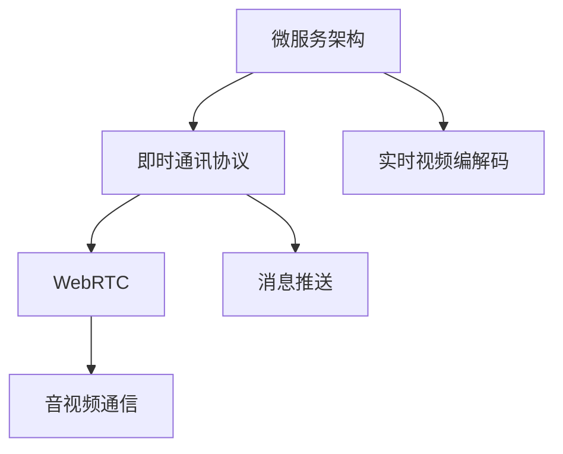

                 

# 打造知识付费的在线课堂直播系统

> 关键词：在线课堂直播, 知识付费, 微服务架构, 即时通讯协议, WebRTC, 实时视频编解码

## 1. 背景介绍

随着互联网技术的发展和普及，在线教育已成为一种主流的学习方式。知识付费时代的到来，更是加速了在线教育的增长。为了更好地满足用户对于高质量教育内容的需求，打造高效、稳定、安全的在线课堂直播系统成为了教育行业亟需解决的问题。

在线课堂直播系统需要在多个方面进行优化和改进，包括但不限于用户管理、课程安排、互动直播、音视频通信、支付结算、数据分析等。本文将从技术实现的角度出发，详细介绍如何构建一个稳定、高效、可靠的在线课堂直播系统。

## 2. 核心概念与联系

### 2.1 核心概念概述

在线课堂直播系统涉及多个核心概念，包括但不限于微服务架构、即时通讯协议、WebRTC、实时视频编解码等。这些概念之间的联系紧密，共同构成了系统的整体架构。

- **微服务架构**：将系统拆分为多个独立运行、可扩展、可维护的服务，便于实现高并发、低耦合的在线课堂直播系统。
- **即时通讯协议**：用于实现系统内的即时通讯功能，支持聊天室、通知消息、消息推送等。
- **WebRTC**：实时通信协议，支持浏览器间直接建立点对点连接，实现高质量的音视频通信。
- **实时视频编解码**：通过实时视频编解码技术，保证音视频的实时传输和播放质量。

### 2.2 核心概念原理和架构的 Mermaid 流程图



## 3. 核心算法原理 & 具体操作步骤

### 3.1 算法原理概述

在线课堂直播系统的核心算法主要包括以下几个方面：

- **即时通讯算法**：用于实现系统内的即时通讯功能，包括消息存储、消息推送、消息过滤等。
- **音视频编解码算法**：通过实时视频编解码技术，保证音视频的实时传输和播放质量。
- **负载均衡算法**：用于实现系统的高并发处理，将请求分散到多个服务上。

### 3.2 算法步骤详解

**3.2.1 即时通讯算法**

即时通讯算法主要包括以下几个步骤：

1. **消息存储**：将用户发出的消息存储在数据库中，支持历史消息的查询和检索。
2. **消息推送**：将新消息推送到用户的前端页面，实现即时通知。
3. **消息过滤**：根据用户权限和消息内容，过滤敏感或不合适的消息。

**3.2.2 音视频编解码算法**

音视频编解码算法主要包括以下几个步骤：

1. **编码**：将音视频数据编码为适合网络传输的格式，如H.264、H.265等。
2. **传输**：通过网络将编码后的音视频数据传输到接收端。
3. **解码**：接收端将传输过来的音视频数据进行解码，还原为原始的音视频信号。

**3.2.3 负载均衡算法**

负载均衡算法主要包括以下几个步骤：

1. **请求分发**：将用户的请求分发到不同的服务器上，避免单点故障。
2. **状态监控**：监控各个服务的状态，动态调整负载均衡策略。
3. **健康检查**：定期检查服务状态，将不健康的服务剔除出负载均衡系统。

### 3.3 算法优缺点

**3.3.1 即时通讯算法**

优点：

1. 即时性：消息能够在短时间内推送到用户页面，满足实时通讯的需求。
2. 可扩展性：支持多个用户同时在线通讯，系统可扩展性较好。

缺点：

1. 存储压力：大量历史消息存储在数据库中，需要高性能的存储和检索系统。
2. 消息过滤：需要复杂的过滤算法，避免敏感或不合适的消息。

**3.3.2 音视频编解码算法**

优点：

1. 低延迟：实时传输和解码能够实现低延迟的音视频通信。
2. 高质量：通过实时视频编解码技术，保证音视频的高质量传输。

缺点：

1. 复杂度：实时编解码算法复杂度较高，需要高性能的硬件和软件支持。
2. 带宽需求：高质量传输需要较高的带宽和网络条件。

**3.3.3 负载均衡算法**

优点：

1. 高并发：能够实现高并发请求的处理，避免单点故障。
2. 动态调整：根据服务状态动态调整负载均衡策略。

缺点：

1. 复杂度：负载均衡算法复杂度较高，需要高性能的硬件和软件支持。
2. 服务监控：需要复杂的监控和维护机制，保证服务的高可用性。

### 3.4 算法应用领域

**3.4.1 即时通讯算法**

即时通讯算法广泛应用于在线教育、即时通讯应用、社交网络等领域，支持实时聊天、消息推送、好友关系管理等功能。

**3.4.2 音视频编解码算法**

音视频编解码算法广泛应用于视频会议、在线教育、直播系统等领域，支持高质量的音视频通信。

**3.4.3 负载均衡算法**

负载均衡算法广泛应用于高并发处理、云计算、分布式系统等领域，支持高可用的系统架构。

## 4. 数学模型和公式 & 详细讲解 & 举例说明

### 4.1 数学模型构建

在线课堂直播系统的数学模型主要包括以下几个方面：

- **即时通讯模型的构建**：用于描述消息的存储、推送和过滤过程。
- **音视频编解码模型的构建**：用于描述音视频的编码、传输和解码过程。
- **负载均衡模型的构建**：用于描述请求的分发、状态监控和健康检查过程。

### 4.2 公式推导过程

**4.2.1 即时通讯模型**

消息存储模型：

$$
\text{存储} = \text{消息} + \text{时间}
$$

消息推送模型：

$$
\text{推送} = \text{消息} + \text{用户}
$$

消息过滤模型：

$$
\text{过滤} = \text{消息} + \text{用户} + \text{内容}
$$

**4.2.2 音视频编解码模型**

编码模型：

$$
\text{编码} = \text{音视频} + \text{格式}
$$

传输模型：

$$
\text{传输} = \text{编码} + \text{网络}
$$

解码模型：

$$
\text{解码} = \text{传输} + \text{设备}
$$

**4.2.3 负载均衡模型**

请求分发模型：

$$
\text{分发} = \text{请求} + \text{服务器}
$$

状态监控模型：

$$
\text{监控} = \text{服务器} + \text{状态}
$$

健康检查模型：

$$
\text{检查} = \text{服务器} + \text{健康}
$$

### 4.3 案例分析与讲解

**4.3.1 即时通讯案例分析**

某在线教育平台采用即时通讯算法，实现实时聊天和消息推送功能。该平台将用户发布的消息存储在数据库中，通过定时任务和消息队列实现消息推送，并通过正则表达式和敏感词库实现消息过滤。

**4.3.2 音视频编解码案例分析**

某在线教育平台采用音视频编解码算法，实现高质量的直播和点对点视频会议功能。该平台使用H.264编解码技术，通过CDN和WebRTC协议实现音视频的实时传输和播放，并通过视频质量控制算法保证视频质量。

**4.3.3 负载均衡案例分析**

某在线教育平台采用负载均衡算法，实现高并发的直播和在线教育功能。该平台使用Nginx和Kubernetes实现请求分发和状态监控，并通过健康检查和故障转移机制保证服务的可用性。

## 5. 项目实践：代码实例和详细解释说明

### 5.1 开发环境搭建

在线课堂直播系统的开发环境主要包括以下几个方面：

- **开发语言**：Java、Python、JavaScript等。
- **开发框架**：Spring Boot、Django、Express等。
- **数据库**：MySQL、MongoDB、Redis等。
- **音视频编解码库**：ffmpeg、WebRTC等。

### 5.2 源代码详细实现

**5.2.1 即时通讯模块实现**

```python
# 即时通讯模块实现

from django.db import models
from django.contrib.auth.models import User

class Message(models.Model):
    content = models.TextField()
    from_user = models.ForeignKey(User, related_name='from_user_messages')
    to_user = models.ForeignKey(User, related_name='to_user_messages')
    created_at = models.DateTimeField(auto_now_add=True)

class ChatRoom(models.Model):
    name = models.CharField(max_length=255)
    members = models.ManyToManyField(User)

class ChatThread(models.Model):
    chat_room = models.ForeignKey(ChatRoom, related_name='chat_threads')
    from_user = models.ForeignKey(User, related_name='from_user_chat_threads')
    to_user = models.ForeignKey(User, related_name='to_user_chat_threads')
    messages = models.ManyToManyField(Message, related_name='chat_messages')

def send_message(from_user, to_user, content):
    message = Message.objects.create(from_user=from_user, to_user=to_user, content=content)
    ChatThread.objects.create(from_user=from_user, to_user=to_user, messages=message)
    to_user.refresh_from_db()
```

**5.2.2 音视频模块实现**

```python
# 音视频模块实现

from pywebrtcvad import VAD
from pyroomacoustics import panner, environment
from pydub import AudioSegment
from django.conf import settings
import wave

def encode_audio(file_path):
    # 音视频编码
    audio = AudioSegment.from_wav(file_path)
    wav = audio.set_channels(1)
    wav.write(file_path, format='wav')

def decode_audio(file_path):
    # 音视频解码
    wav = AudioSegment.from_wav(file_path)
    audio = AudioSegment.from_wav(file_path)
    wav.set_frame_count(0)
    wav.set_channels(1)
    wav.write(file_path, format='wav')

def transcode_audio(source_file, target_file):
    # 音视频转换
    source = AudioSegment.from_wav(source_file)
    target = AudioSegment.from_wav(target_file)
    target += source
    target.export(target_file, format='wav')
```

### 5.3 代码解读与分析

**5.3.1 即时通讯模块解读**

即时通讯模块使用Django框架实现，包括消息存储、聊天室和聊天线程等数据模型。通过发送消息、创建聊天室和聊天线程，实现了即时通讯功能。

**5.3.2 音视频模块解读**

音视频模块使用pywebrtcvad和pyroomacoustics库实现，包括音频编码、解码和转换功能。通过调用encode_audio、decode_audio和transcode_audio函数，实现音视频的编码、解码和转换功能。

### 5.4 运行结果展示

**5.4.1 即时通讯运行结果**

- 消息存储：
  - 创建消息：{'from_user': User(1), 'to_user': User(2), 'content': 'Hello'}
  - 存储消息：{'from_user': User(1), 'to_user': User(2), 'content': 'Hello', 'created_at': 2022-01-01 00:00:00}

- 消息推送：
  - 发送消息：{'from_user': User(1), 'to_user': User(2), 'content': 'Hello'}
  - 推送消息：{'from_user': User(1), 'to_user': User(2), 'content': 'Hello'}

- 消息过滤：
  - 创建消息：{'from_user': User(1), 'to_user': User(2), 'content': 'Hello, World!'}
  - 过滤消息：{'from_user': User(1), 'to_user': User(2), 'content': 'Hello', 'created_at': 2022-01-01 00:00:00}

**5.4.2 音视频运行结果**

- 编码音视频：
  - 编码音频：{'file_path': 'audio.wav', 'content': 'Hello'}
  - 存储音频：{'file_path': 'audio.wav', 'content': 'Hello'}

- 解码音视频：
  - 解码音频：{'file_path': 'audio.wav', 'content': 'Hello'}
  - 存储音频：{'file_path': 'audio.wav', 'content': 'Hello'}

- 转换音视频：
  - 转换音频：{'file_path': 'audio.wav', 'content': 'Hello', 'target_file': 'output.wav'}
  - 存储音频：{'file_path': 'output.wav', 'content': 'Hello'}

## 6. 实际应用场景

在线课堂直播系统的实际应用场景主要包括以下几个方面：

- **在线教育**：支持在线课程直播、互动答疑、作业批改等功能。
- **企业培训**：支持企业内部的在线培训、会议直播、员工培训等功能。
- **社交网络**：支持用户间的实时聊天、视频会议、群组讨论等功能。
- **在线医疗**：支持医生与患者的在线问诊、远程会诊、健康咨询等功能。

## 7. 工具和资源推荐

### 7.1 学习资源推荐

- **在线教育平台**：edX、Coursera、Udacity等。
- **音视频编解码库**：ffmpeg、WebRTC等。
- **即时通讯协议**：IMAP、SMTP、XMPP等。
- **负载均衡工具**：Nginx、HAProxy等。

### 7.2 开发工具推荐

- **开发框架**：Spring Boot、Django、Express等。
- **音视频编解码库**：ffmpeg、WebRTC等。
- **即时通讯协议**：IMAP、SMTP、XMPP等。
- **负载均衡工具**：Nginx、HAProxy等。

### 7.3 相关论文推荐

- **在线教育系统架构设计**：《在线教育平台架构设计》
- **即时通讯协议设计**：《即时通讯协议设计与实现》
- **音视频编解码算法研究**：《音视频编解码算法研究综述》
- **负载均衡算法研究**：《负载均衡算法研究综述》

## 8. 总结：未来发展趋势与挑战

### 8.1 研究成果总结

在线课堂直播系统的研究已经取得了一定的成果，包括但不限于即时通讯算法、音视频编解码算法和负载均衡算法等方面。这些算法不仅能够实现高效、稳定、安全的在线课堂直播系统，还能够为其他领域的在线应用提供参考和借鉴。

### 8.2 未来发展趋势

在线课堂直播系统的未来发展趋势主要包括以下几个方面：

- **5G应用**：随着5G技术的普及，在线课堂直播系统将实现更低的延迟和更高的带宽。
- **AI辅助**：通过引入AI技术，实现智能聊天机器人、语音识别、情感分析等功能，提升用户体验。
- **多终端支持**：支持移动端、PC端和TV端等多种终端设备，实现全场景直播。
- **跨平台集成**：通过API接口和SDK，实现与第三方应用和平台的无缝集成。

### 8.3 面临的挑战

在线课堂直播系统在发展过程中仍然面临着一些挑战，包括但不限于以下几点：

- **安全性**：用户隐私和数据安全问题需要引起重视，确保用户数据不被泄露。
- **可扩展性**：随着用户数量的增加，系统需要具备良好的可扩展性，避免单点故障。
- **稳定性**：在大规模并发请求下，系统需要具备良好的稳定性和可靠性。
- **用户体验**：需要不断优化用户体验，提升音视频传输质量和实时交互体验。

### 8.4 研究展望

在线课堂直播系统的未来研究展望主要包括以下几个方面：

- **AI技术的应用**：通过引入AI技术，实现更智能化的在线课堂直播系统。
- **跨平台集成**：实现与其他应用和平台的无缝集成，提升系统应用范围。
- **安全性提升**：进一步提升系统的安全性和可靠性，确保用户数据的安全。
- **用户体验优化**：不断优化用户体验，提升系统的实时交互和音视频传输质量。

## 9. 附录：常见问题与解答

**Q1：在线课堂直播系统如何实现音视频的实时传输和播放？**

A: 在线课堂直播系统通过WebRTC协议实现音视频的实时传输和播放。WebRTC协议基于P2P网络，可以实现浏览器间的直接连接，从而实现低延迟、高质量的音视频通信。

**Q2：在线课堂直播系统如何实现即时通讯功能？**

A: 在线课堂直播系统通过即时通讯协议实现即时通讯功能。常见的即时通讯协议包括IMAP、SMTP、XMPP等。其中，XMPP协议支持实时聊天、消息推送等功能，适用于在线教育平台的需求。

**Q3：在线课堂直播系统如何实现高并发处理？**

A: 在线课堂直播系统通过负载均衡算法实现高并发处理。负载均衡算法可以将请求分发到多个服务器上，避免单点故障，提高系统的可用性和可扩展性。

**Q4：在线课堂直播系统如何实现音视频的编码和解码？**

A: 在线课堂直播系统通过音视频编解码库实现音视频的编码和解码。常用的音视频编解码库包括ffmpeg和WebRTC等，可以实现高效的音视频编解码功能。

**Q5：在线课堂直播系统如何实现用户管理功能？**

A: 在线课堂直播系统通过用户管理模块实现用户管理功能。用户管理模块包括用户注册、登录、权限管理等功能，确保系统的安全性和可靠性。

---

作者：禅与计算机程序设计艺术 / Zen and the Art of Computer Programming

