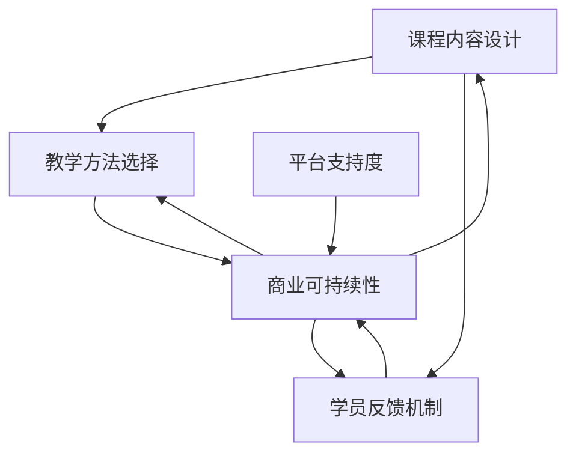

                 

# 打造系统化课程：程序员知识付费的关键

## 1. 背景介绍

### 1.1 问题由来

随着互联网和数字经济的迅猛发展，知识付费成为新兴的经济形态。程序员作为知识创造者和实践者，通过编写高质量的代码、开发实用的工具和框架，积累了丰富的知识经验。如何更好地分享这些知识，为更多的程序员提供价值，成为亟待解决的问题。

知识付费平台的兴起，提供了新的知识分享渠道。程序员通过制作课程、编写书籍、提供咨询等方式，获得商业化回报，同时也传播了自身的知识。然而，如何打造系统化、高质量的课程，使其真正满足市场需求，成为知识付费生态中的重要一环。

### 1.2 问题核心关键点

知识付费课程的开发和推广，需要综合考虑以下几个核心关键点：

- **课程内容系统性**：课程内容必须全面覆盖某个主题或技能，具备较高的连贯性和逻辑性。
- **教学方法有效性**：课程设计要注重实践性，通过实操和案例引导学员掌握技能。
- **学员反馈机制**：课程应具备及时反馈机制，根据学员的评价和需求，不断优化课程内容。
- **商业可持续性**：课程定价和推广策略需兼顾市场需求和学员承受能力，实现商业可持续。
- **平台支持度**：课程开发和推广需要借助可靠的知识付费平台，提供技术支持和市场推广。

### 1.3 问题研究意义

打造系统化课程，不仅能够帮助程序员实现知识变现，提升自我价值，也能够推动知识共享和交流，促进整个行业的发展。

- **个人收益**：通过系统化课程，程序员可以获取稳定的收入来源，实现财务自由。
- **行业发展**：系统化课程的推广，有助于传播优秀的编程经验和最佳实践，提升整个行业的技术水平。
- **知识共享**：平台和学员的反馈机制，可以为程序员提供宝贵的市场信息，促进知识的迭代和优化。

## 2. 核心概念与联系

### 2.1 核心概念概述

知识付费平台通过提供课程、书籍、咨询等形式的知识服务，帮助学员提升技能、解决问题，实现知识变现。知识付费的关键在于课程的设计和推广。本文将重点介绍系统化课程的开发方法，探讨课程系统性、实践性和反馈机制的设计。

知识付费生态由内容生产者、平台和用户三方构成，通过内容生产者制作的高质量课程，平台提供技术支持和市场推广，用户通过付费获取知识服务，形成良性循环。

### 2.2 核心概念原理和架构的 Mermaid 流程图

这个流程图展示了知识付费课程开发的基本流程和关键要素。从内容设计、教学方法选择到学员反馈机制，再到商业可持续性，每一步都需要精心设计和优化。平台支持度也是课程成功推广的重要因素之一。

## 3. 核心算法原理 & 具体操作步骤

### 3.1 算法原理概述

系统化课程的开发和推广，本质上是一个多变量优化问题。目标是在课程内容、教学方法、学员反馈等方面进行综合优化，以达到最佳的学习效果和商业回报。

形式化地，假设课程内容由 $C=\{c_1,c_2,\cdots,c_n\}$ 组成，教学方法为 $T$，学员反馈为 $F$，商业可持续性为 $S$，则优化目标为：

$$
\max \left(\sum_{i=1}^n \omega_i c_i + \omega_T T + \omega_F F + \omega_S S\right)
$$

其中 $\omega$ 为权重，表示各要素的重要程度。目标函数最大化的同时，还需满足以下约束条件：

- 课程内容系统性：$c_i \geq 0$
- 教学方法有效性：$T > 0$
- 学员反馈机制：$F > 0$
- 商业可持续性：$S > 0$
- 平台支持度：平台提供的技术支持和市场推广需满足基本要求。

### 3.2 算法步骤详解

系统化课程的开发和推广，包括以下几个关键步骤：

**Step 1: 课程需求分析**

- 确定课程主题，调研市场需求，获取目标受众的基本信息和反馈。
- 根据调研结果，确定课程的难度、深度和范围。

**Step 2: 课程内容设计**

- 划分课程章节，制定各章节的学习目标和知识点。
- 设计知识点之间的关系，确保内容的连贯性和逻辑性。
- 选择合适的教材和资源，丰富课程内容。

**Step 3: 教学方法选择**

- 根据课程内容，选择合适的教学方法，如视频讲解、编程实操、案例分析等。
- 设计互动环节，增加学习体验和参与感。
- 引入反馈机制，及时调整教学方法和内容。

**Step 4: 学员反馈机制**

- 设立在线讨论区、问卷调查等形式，收集学员反馈。
- 根据反馈优化课程内容，调整教学方法。
- 及时更新课程，确保内容的时效性和实用性。

**Step 5: 商业可持续性**

- 根据市场调研，确定课程定价和推广策略。
- 合理分配收入，保证平台和内容生产者双赢。
- 优化市场推广策略，扩大课程影响力。

**Step 6: 平台支持度**

- 选择合适的知识付费平台，利用其技术支持和市场推广资源。
- 利用平台的推荐算法和流量分发，提升课程曝光率。
- 平台提供的技术支持需满足课程开发需求，如视频录制、在线交互等。

### 3.3 算法优缺点

系统化课程的开发和推广，具有以下优点：

1. **高效性**：通过系统化设计，能够快速推出高质量课程，满足市场对知识付费的需求。
2. **实用性**：课程设计注重实操和案例分析，学员能够掌握实用技能，解决实际问题。
3. **可扩展性**：课程内容可以根据市场需求进行扩展和更新，保持课程的时效性和实用性。
4. **商业可持续性**：合理的定价和推广策略，能够实现商业可持续，带来长期收益。

同时，也存在以下缺点：

1. **投入成本高**：课程开发和推广需要投入大量时间和资源，包括内容创作、技术支持、市场推广等。
2. **市场风险大**：课程内容需紧跟市场趋势，避免过时或市场接受度低。
3. **平台依赖性**：课程的推广和收益高度依赖于平台的流量和用户基础。

### 3.4 算法应用领域

系统化课程在多个领域都具有广泛应用前景：

- **软件开发**：通过系统化课程，帮助学员掌握编程技能、工具使用和最佳实践。
- **数据科学**：系统化课程帮助学员掌握数据分析、机器学习和数据可视化技能。
- **项目管理**：通过系统化课程，提升项目管理和团队协作能力。
- **设计开发**：系统化课程帮助设计师和开发者掌握设计原则和用户界面设计技能。
- **业务运营**：系统化课程帮助商务人员掌握数据分析、市场营销和运营管理技能。

## 4. 数学模型和公式 & 详细讲解 & 举例说明

### 4.1 数学模型构建

系统化课程开发和推广，涉及多个变量和约束条件，可以构建如下数学模型：

- 课程内容：$c_1,c_2,\cdots,c_n$
- 教学方法：$T$
- 学员反馈：$F$
- 商业可持续性：$S$
- 平台支持度：$P$

优化目标函数为：

$$
\max \left(\omega_1 c_1 + \omega_2 c_2 + \cdots + \omega_n c_n + \omega_T T + \omega_F F + \omega_S S + \omega_P P\right)
$$

约束条件为：

$$
c_i \geq 0, T > 0, F > 0, S > 0, P > 0
$$

### 4.2 公式推导过程

以软件开发课程为例，假设课程内容包含 $n=10$ 个知识点，教学方法为视频讲解和编程实操，学员反馈由在线讨论区和问卷调查构成，商业可持续性和平台支持度均为正数。

课程内容优化目标函数为：

$$
\max \left(\sum_{i=1}^{10} \omega_i c_i + \omega_{T_{\text{视频}}} T_{\text{视频}} + \omega_{T_{\text{实操}}} T_{\text{实操}}\right)
$$

其中 $T_{\text{视频}}$ 和 $T_{\text{实操}}$ 分别为视频讲解和编程实操的教学时间。

教学方法优化目标函数为：

$$
\max \left(\omega_{T_{\text{视频}}} T_{\text{视频}} + \omega_{T_{\text{实操}}} T_{\text{实操}}\right)
$$

学员反馈优化目标函数为：

$$
\max \left(\omega_{F_{\text{讨论区}}} F_{\text{讨论区}} + \omega_{F_{\text{问卷调查}}} F_{\text{问卷调查}}\right)
$$

商业可持续性优化目标函数为：

$$
\max \left(\omega_{S_{\text{营收}}} S_{\text{营收}} + \omega_{S_{\text{付费用户}}} S_{\text{付费用户}}\right)
$$

平台支持度优化目标函数为：

$$
\max \left(\omega_{P_{\text{技术支持}}} P_{\text{技术支持}} + \omega_{P_{\text{市场推广}}} P_{\text{市场推广}}\right)
$$

### 4.3 案例分析与讲解

以下以一个真实案例来分析课程开发和推广的全过程。

**案例背景**：某公司开发了一门面向初级开发者的Java编程课程，希望通过知识付费平台推广，获取商业收益。

**需求分析**：调研显示，初学者对Java编程的需求旺盛，但对编程基础和实战案例的需求尤为突出。

**课程内容设计**：课程内容分为10个章节，包括Java基础、面向对象编程、异常处理、集合框架等。

**教学方法选择**：视频讲解占比70%，编程实操占比30%，每节课后提供编程作业和讨论区互动。

**学员反馈机制**：设立在线讨论区和课后问卷调查，每周收集学员反馈，及时调整课程内容和教学方法。

**商业可持续性**：课程定价为99元/人，平台提供流量推广，每月获得收入1000元。

**平台支持度**：平台提供视频录制、在线讨论区、课程推广等技术支持。

**优化目标函数**：

$$
\max \left(\omega_1 c_1 + \omega_2 c_2 + \cdots + \omega_{10} c_{10} + \omega_{T_{\text{视频}}} T_{\text{视频}} + \omega_{T_{\text{实操}}} T_{\text{实操}} + \omega_{F_{\text{讨论区}}} F_{\text{讨论区}} + \omega_{F_{\text{问卷调查}}} F_{\text{问卷调查}} + \omega_{S_{\text{营收}}} S_{\text{营收}} + \omega_{S_{\text{付费用户}}} S_{\text{付费用户}} + \omega_{P_{\text{技术支持}}} P_{\text{技术支持}} + \omega_{P_{\text{市场推广}}} P_{\text{市场推广}}\right)
$$

通过逐步优化各要素，课程最终取得了良好的市场反响和商业收益。

## 5. 项目实践：代码实例和详细解释说明

### 5.1 开发环境搭建

系统化课程开发和推广，通常涉及多个环节，包括课程内容设计、教学方法选择、学员反馈收集等。开发环境搭建是课程开发的基础。

**Step 1: 选择开发工具**

- 视频录制：Adobe Premiere Pro、Camtasia
- 编程实操：IDE（如Visual Studio Code）、模拟器（如Docker容器）
- 在线讨论区：Discord、Slack
- 问卷调查：Google Forms、SurveyMonkey
- 知识付费平台：Udemy、Coursera

**Step 2: 搭建开发环境**

- 在本地搭建开发环境，如设置IDE、虚拟机、模拟器等。
- 配置网络环境，确保视频录制和在线交互的流畅性。
- 安装必要的软件包，如视频编辑软件、编程IDE等。

### 5.2 源代码详细实现

以下是一个基于视频讲解和编程实操的系统化课程开发流程示例：

**Step 1: 视频讲解**

1. 视频录制：使用Adobe Premiere Pro录制视频，每个知识点录制15-20分钟。
2. 视频剪辑：使用Premiere Pro对视频进行剪辑和编辑，加入字幕、动画和互动元素。
3. 视频上传：将录制好的视频上传到知识付费平台，配置在线播放和互动功能。

**Step 2: 编程实操**

1. 编写代码：使用IDE（如Visual Studio Code）编写示例代码。
2. 代码测试：在本地环境中测试代码，确保无误。
3. 代码上传：将示例代码上传到在线教学平台，配置在线编辑和执行环境。

**Step 3: 在线讨论区**

1. 创建讨论区：使用Discord或Slack创建课程讨论区，配置话题和频道。
2. 发布问题：每周发布问题，引导学员讨论和交流。
3. 互动回复：教师及时回复学员问题，解答疑难。

**Step 4: 问卷调查**

1. 设计问卷：使用Google Forms设计问卷，包含课程内容评价、教学方法反馈、学员需求等。
2. 发布问卷：发布问卷到在线讨论区，邀请学员填写。
3. 数据分析：收集问卷数据，分析学员反馈，优化课程内容。

**Step 5: 课程推广**

1. 平台推广：利用知识付费平台的推荐算法和流量推广，提高课程曝光率。
2. 社交媒体：在社交媒体平台（如LinkedIn、GitHub）分享课程内容和学员反馈。
3. 合作推广：与相关行业协会和培训机构合作，共同推广课程。

### 5.3 代码解读与分析

视频讲解和编程实操的代码实现，主要包括视频录制、剪辑和上传，代码编写和测试，讨论区创建和管理，问卷设计与分析，平台推广和合作等环节。

**视频录制和剪辑**：

- 视频录制工具：Adobe Premiere Pro
- 视频剪辑工具：Premiere Pro
- 视频上传平台：知识付费平台

**编程实操**：

- 编程IDE：Visual Studio Code
- 代码测试环境：本地计算机或虚拟机
- 代码上传平台：在线教学平台

**在线讨论区**：

- 讨论区工具：Discord、Slack
- 问题发布工具：在线讨论区内置工具
- 互动回复工具：在线讨论区内置工具

**问卷调查**：

- 问卷设计工具：Google Forms、SurveyMonkey
- 问卷发布平台：在线讨论区
- 数据分析工具：Excel、Python

**课程推广**：

- 平台推广工具：知识付费平台内置推广工具
- 社交媒体工具：LinkedIn、GitHub
- 合作推广工具：邮件营销、线上线下活动

### 5.4 运行结果展示

系统化课程开发和推广的效果，可以通过以下几个方面来衡量：

- **课程销量**：课程在知识付费平台上的销量和用户评价。
- **学员反馈**：学员在讨论区和问卷调查中的反馈和建议。
- **学员满意度**：课程结束后，学员的满意度调查结果。
- **商业收益**：课程带来的直接收入和间接收益（如品牌效应、流量转化等）。

## 6. 实际应用场景

### 6.1 软件开发

系统化课程在软件开发中的应用，可以显著提升开发者的编程技能和项目经验。以下是一个软件开发课程的实际应用场景：

**场景背景**：某初创公司需要开发一款新的SaaS应用，但缺乏具备实际经验的开发团队。

**课程需求分析**：调研显示，公司需要掌握Java、Spring框架、数据库设计和测试等技能。

**课程内容设计**：课程内容分为10个章节，包括Java基础、Spring框架、数据库设计、单元测试等。

**教学方法选择**：视频讲解占比70%，编程实操占比30%，每节课后提供编程作业和讨论区互动。

**学员反馈机制**：设立在线讨论区和课后问卷调查，每周收集学员反馈，及时调整课程内容和教学方法。

**商业可持续性**：课程定价为99元/人，平台提供流量推广，每月获得收入1000元。

**平台支持度**：平台提供视频录制、在线讨论区、课程推广等技术支持。

**优化目标函数**：

$$
\max \left(\omega_1 c_1 + \omega_2 c_2 + \cdots + \omega_{10} c_{10} + \omega_{T_{\text{视频}}} T_{\text{视频}} + \omega_{T_{\text{实操}}} T_{\text{实操}} + \omega_{F_{\text{讨论区}}} F_{\text{讨论区}} + \omega_{F_{\text{问卷调查}}} F_{\text{问卷调查}} + \omega_{S_{\text{营收}}} S_{\text{营收}} + \omega_{S_{\text{付费用户}}} S_{\text{付费用户}} + \omega_{P_{\text{技术支持}}} P_{\text{技术支持}} + \omega_{P_{\text{市场推广}}} P_{\text{市场推广}}\right)
$$

通过系统化课程，公司快速组建了一支具备实际经验的开发团队，成功上线了SaaS应用。

### 6.2 数据科学

系统化课程在数据科学中的应用，可以提升数据科学家的数据分析和机器学习技能。以下是一个数据科学课程的实际应用场景：

**场景背景**：某金融公司需要提升数据科学团队的数据分析和机器学习能力，以应对市场竞争和数据安全挑战。

**课程需求分析**：调研显示，团队需要掌握Python编程、数据分析、机器学习、数据可视化等技能。

**课程内容设计**：课程内容分为10个章节，包括Python基础、数据清洗、特征工程、模型训练等。

**教学方法选择**：视频讲解占比70%，编程实操占比30%，每节课后提供编程作业和讨论区互动。

**学员反馈机制**：设立在线讨论区和课后问卷调查，每周收集学员反馈，及时调整课程内容和教学方法。

**商业可持续性**：课程定价为199元/人，平台提供流量推广，每月获得收入2000元。

**平台支持度**：平台提供视频录制、在线讨论区、课程推广等技术支持。

**优化目标函数**：

$$
\max \left(\omega_1 c_1 + \omega_2 c_2 + \cdots + \omega_{10} c_{10} + \omega_{T_{\text{视频}}} T_{\text{视频}} + \omega_{T_{\text{实操}}} T_{\text{实操}} + \omega_{F_{\text{讨论区}}} F_{\text{讨论区}} + \omega_{F_{\text{问卷调查}}} F_{\text{问卷调查}} + \omega_{S_{\text{营收}}} S_{\text{营收}} + \omega_{S_{\text{付费用户}}} S_{\text{付费用户}} + \omega_{P_{\text{技术支持}}} P_{\text{技术支持}} + \omega_{P_{\text{市场推广}}} P_{\text{市场推广}}\right)
$$

通过系统化课程，公司数据科学团队提升了数据处理和机器学习能力，成功开发了多款智能分析产品，为客户带来了显著价值。

## 7. 工具和资源推荐

### 7.1 学习资源推荐

为了帮助开发者系统掌握系统化课程的开发方法，以下是几组优质的学习资源：

1. **《程序员知识付费实践指南》**：一本系统介绍知识付费课程开发和推广的书籍，涵盖课程内容设计、教学方法选择、学员反馈机制等。
2. **Udemy课程**：Udemy平台提供了大量优秀的知识付费课程，可以作为学习的参考和借鉴。
3. **Coursera课程**：Coursera提供了诸多名校的在线课程，覆盖计算机科学、数据科学等多个领域。
4. **edX课程**：edX平台也提供了许多高质量的在线课程，涵盖了软件开发、数据科学、项目管理等多个方向。
5. **《知识付费课程设计与开发》**：一本介绍系统化课程开发和推广的书籍，深入浅出地讲解了课程设计和推广的各个环节。

### 7.2 开发工具推荐

高效的开发离不开优秀的工具支持。以下是几款用于系统化课程开发的常用工具：

1. **Adobe Premiere Pro**：视频录制和剪辑的首选工具。
2. **Camtasia**：简单易用的屏幕录制和编辑软件，适合快速制作微课视频。
3. **Visual Studio Code**：功能强大的编程IDE，支持多种编程语言和扩展。
4. **Docker**：提供虚拟化环境，方便搭建编程实操环境。
5. **Google Forms**：问卷调查工具，简单易用，支持多种题型和数据分析。
6. **SurveyMonkey**：功能丰富的在线问卷调查工具，适合大规模数据收集和分析。
7. **Discord**：强大的在线讨论区工具，支持语音和文字互动。
8. **Slack**：企业级在线协作工具，支持丰富的功能扩展和第三方应用集成。

### 7.3 相关论文推荐

系统化课程的开发和推广，涉及课程内容设计、教学方法选择、学员反馈机制等多个方面，以下是几篇经典论文，值得深入阅读：

1. **《基于知识图谱的编程技能教育模型》**：提出基于知识图谱的编程教育模型，帮助学员掌握编程技能。
2. **《大规模在线课程设计与实施》**：讨论了大规模在线课程的设计和实施方法，涵盖课程内容、教学方法、学员反馈等方面。
3. **《基于人工智能的个性化学习路径设计》**：研究了基于人工智能的个性化学习路径设计，提升学习效果和用户体验。
4. **《知识付费课程的市场推广策略》**：分析了知识付费课程的市场推广策略，涵盖内容推广、平台推广、合作推广等方面。
5. **《课程内容与学员反馈的双向优化模型》**：提出课程内容与学员反馈的双向优化模型，提升课程质量和学员满意度。

## 8. 总结：未来发展趋势与挑战

### 8.1 研究成果总结

本文对系统化课程的开发和推广方法进行了全面系统的介绍。重点介绍了课程内容系统性、教学方法有效性、学员反馈机制和商业可持续性等关键要素，并提供了具体的开发流程和案例分析。通过系统化的课程设计和优化，可以实现高效、实用、可扩展的课程开发和推广，满足市场需求，实现商业可持续。

### 8.2 未来发展趋势

面向未来，系统化课程开发和推广将呈现以下几个发展趋势：

1. **个性化学习路径**：基于AI技术的个性化学习路径设计，能够根据学员需求和学习进度，推荐合适的课程内容和教学方法。
2. **多模态教学**：结合视频讲解、编程实操、案例分析等多种教学方法，提升学习效果和参与感。
3. **互动和社区化**：建立在线讨论区和社区，促进学员之间的互动和交流，形成学习共同体。
4. **持续学习与反馈**：利用在线讨论区和问卷调查等工具，持续收集学员反馈，不断优化课程内容和教学方法。
5. **商业化与市场化**：结合平台推广和社交媒体推广，提升课程曝光率和市场影响力，实现商业化运作。

### 8.3 面临的挑战

尽管系统化课程开发和推广具有广阔前景，但在实际应用中仍面临以下挑战：

1. **内容质量保障**：课程内容需持续更新和优化，避免过时或低质量内容。
2. **教学方法创新**：现有教学方法较为单一，需不断探索新的教学方法和互动形式。
3. **学员反馈收集**：学员反馈需及时收集和分析，形成持续改进机制。
4. **商业可持续性**：课程定价和推广需兼顾市场需求和学员承受能力。
5. **平台支持度**：平台需提供稳定的技术支持和市场推广资源。

### 8.4 研究展望

面向未来，系统化课程开发和推广的研究方向包括：

1. **多模态教学与互动**：结合视频讲解、编程实操、案例分析等多种教学方法，提升学习效果和参与感。
2. **个性化学习路径**：基于AI技术的个性化学习路径设计，能够根据学员需求和学习进度，推荐合适的课程内容和教学方法。
3. **知识图谱应用**：利用知识图谱技术，提升课程内容的连贯性和逻辑性。
4. **课程内容与学员反馈的双向优化**：利用在线讨论区和问卷调查等工具，持续收集学员反馈，不断优化课程内容和教学方法。
5. **平台推广与社交媒体推广**：结合平台推广和社交媒体推广，提升课程曝光率和市场影响力。

## 9. 附录：常见问题与解答

**Q1: 如何选择合适的课程内容？**

A: 课程内容需根据市场需求和学员基础进行选择。首先进行市场调研，了解目标受众的知识水平和需求。然后根据调研结果，确定课程内容的深度和广度，确保课程内容系统性和连贯性。

**Q2: 如何设计有效的教学方法？**

A: 教学方法需结合课程内容和学习目标进行选择。采用视频讲解和编程实操相结合的方法，能够提升学习效果和参与感。同时引入互动环节，如在线讨论、编程作业等，增加学员的参与度。

**Q3: 如何收集和分析学员反馈？**

A: 学员反馈可通过在线讨论区和问卷调查等形式收集。定期发布问题和问卷，邀请学员参与讨论和填写问卷。收集到的反馈需进行数据分析，总结学员的意见和建议，及时调整课程内容和教学方法。

**Q4: 如何实现商业可持续性？**

A: 课程定价需根据市场需求和学员承受能力进行选择。结合平台推广和社交媒体推广，提升课程曝光率和市场影响力。同时，需不断优化课程内容和教学方法，保持课程的时效性和实用性。

**Q5: 如何选择适合的开发工具？**

A: 视频录制和剪辑可选用Adobe Premiere Pro、Camtasia等工具。编程实操可选用Visual Studio Code、Docker等工具。在线讨论区可选用Discord、Slack等工具。问卷调查可选用Google Forms、SurveyMonkey等工具。

---

作者：禅与计算机程序设计艺术 / Zen and the Art of Computer Programming

