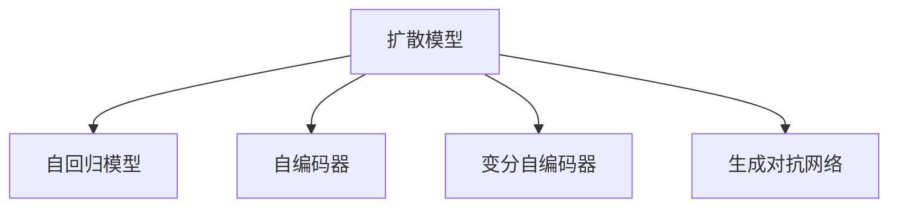

                 

## 1. 背景介绍

在AI艺术创作领域，扩散模型(Diffusion Model)正迅速崛起，成为一种颠覆性的新范式。相较于传统的生成对抗网络(GAN)，扩散模型在生成质量和效率上都取得了显著的突破。本文将深入探讨扩散模型的原理与实践，揭示其在艺术创作中的巨大潜力。

### 1.1 问题由来
随着深度学习技术的快速发展，人工智能在艺术创作领域的应用日益广泛。从生成文本到音乐，再到绘画、雕塑等，AI已经能够创作出令人叹为观止的作品。然而，这些作品质量参差不齐，可控性较差，且创作效率较低，难以满足专业艺术家的需求。

扩散模型的出现，为解决这些问题提供了新的路径。扩散模型采用一种全新的方法，通过渐进地添加噪声，将低维高斯分布转换到高维数据空间，实现了高质量、高效率的艺术创作。

### 1.2 问题核心关键点
扩散模型核心关键点在于通过逐渐增加噪声，将低维噪声数据转换到高维数据空间，最终生成高质量的图像或音频。这种过程类似于信息从一个低复杂度状态逐渐增加噪声过渡到高复杂度状态的物理过程。

核心流程包括以下几个步骤：
- 初始化一个低维噪声分布 $q_0(x)$，如高斯分布。
- 引入一个"扩散过程" $\beta_t$，表示每一步的噪声强度，从 $0$ 到 $1$ 渐进过渡。
- 每一步扩散过程中，噪声分布 $q_t(x)$ 通过一个迭代公式得到，将噪声逐渐减少，最终生成目标数据分布 $p(x)$。
- 在扩散过程的最后一步，通过反向传播求得原始数据 $x$，即完成了从噪声到目标数据的扩散过程。

这个过程看起来像是"噪声消除"，但实际操作中是通过增加噪声而非减少噪声，最终实现高质量生成。扩散模型的关键在于设计合理的扩散过程，使得在逐渐增加噪声的同时，能够有效地学习到数据的潜在表示，从而生成高质量的输出。

### 1.3 问题研究意义
扩散模型在AI艺术创作中的应用，为艺术创作带来了新的可能性：
- 高效创作：扩散模型可以在短时间内生成高质量的作品，大幅提高创作效率。
- 可控创作：扩散模型可以通过控制噪声强度和扩散过程，实现对作品风格和样式的精确控制。
- 多样化创作：扩散模型能够创作出多种风格的作品，突破传统生成对抗网络的局限。
- 提升艺术创作的多样性和质量：扩散模型可以作为艺术家创作辅助工具，激发创作灵感，提升创作水平。

## 2. 核心概念与联系

### 2.1 核心概念概述

为更好地理解扩散模型，本节将介绍几个密切相关的核心概念：

- **扩散模型(Diffusion Model)**：一种生成模型，通过逐渐减少噪声，将低维噪声分布转换到高维数据空间，实现高质量、高效率的数据生成。
- **自回归模型(Auto-Regressive Model)**：一种模型，通过逐个预测数据点的方式生成数据序列，如LSTM、Transformer等。
- **自编码器(Autencoder)**：一种压缩编码模型，将高维数据压缩到低维，再通过解码器还原为高维数据，广泛应用于特征提取和降维。
- **变分自编码器(VAE)**：一种基于变分贝叶斯理论的编码器-解码器模型，用于生成和表示数据的概率分布。
- **生成对抗网络(GAN)**：一种生成模型，通过对抗训练过程，生成高质量的假数据。

这些核心概念之间的逻辑关系可以通过以下Mermaid流程图来展示：



这个流程图展示了大语言模型的核心概念及其之间的关系：

1. 扩散模型通过增加噪声的过程，将低维噪声分布转换到高维数据空间。
2. 自回归模型通过逐个预测数据点的方式生成数据序列。
3. 自编码器通过编码和解码实现数据的压缩和还原。
4. 变分自编码器通过变分贝叶斯理论，学习数据的概率分布。
5. 生成对抗网络通过对抗训练，生成高质量的假数据。

这些概念共同构成了扩散模型的基础，使其能够在各种场景下发挥强大的生成能力。通过理解这些核心概念，我们可以更好地把握扩散模型的工作原理和优化方向。

## 3. 核心算法原理 & 具体操作步骤
### 3.1 算法原理概述

扩散模型的核心原理在于通过逐渐减少噪声，将低维噪声分布转换到高维数据空间，最终生成高质量的数据。这一过程可以看作是"噪声消除"，但实际操作中是通过增加噪声而非减少噪声，从而实现高质量生成。

形式化地，假设原始数据 $x$ 的潜在分布为 $p(x)$，其对应的低维噪声分布为 $q_0(x)$。扩散模型通过逐渐增加噪声，将噪声分布 $q_t(x)$ 转换到原始数据分布 $p(x)$。

具体步骤如下：
1. 初始化低维噪声分布 $q_0(x)$，如高斯分布。
2. 引入扩散过程 $\beta_t$，表示每一步的噪声强度，从 $0$ 到 $1$ 渐进过渡。
3. 每一步扩散过程中，噪声分布 $q_t(x)$ 通过迭代公式得到，将噪声逐渐减少，最终生成目标数据分布 $p(x)$。
4. 在扩散过程的最后一步，通过反向传播求得原始数据 $x$，即完成了从噪声到目标数据的扩散过程。

### 3.2 算法步骤详解

扩散模型的主要步骤包括：
1. **初始化**：随机初始化低维噪声分布 $q_0(x)$，如高斯分布。
2. **扩散过程**：引入扩散过程 $\beta_t$，将噪声逐渐减少，最终生成目标数据分布 $p(x)$。
3. **解码**：在扩散过程的最后一步，通过反向传播求得原始数据 $x$，完成从噪声到目标数据的转换。

具体算法步骤详解如下：

**Step 1: 初始化低维噪声分布**
- 初始化低维噪声分布 $q_0(x)$，如高斯分布。
- 设置噪声强度 $\beta_0=0$。

**Step 2: 扩散过程**
- 每一步扩散过程中，噪声分布 $q_t(x)$ 通过迭代公式得到，将噪声逐渐减少。
- 每一步扩散过程的具体公式为：$q_t(x)=q_0(\sqrt{1-\beta_t}x+\sqrt{\beta_t}z)$，其中 $z$ 为标准正态分布随机变量。

**Step 3: 解码**
- 在扩散过程的最后一步，通过反向传播求得原始数据 $x$。
- 具体公式为：$x=\sigma(\sqrt{\beta_T}z)$，其中 $z$ 为标准正态分布随机变量，$\sigma$ 为激活函数，如ReLU。

### 3.3 算法优缺点

扩散模型具有以下优点：
1. 生成高质量的数据：通过逐渐减少噪声，扩散模型可以生成高质量的图像、音频等数据。
2. 生成效率高：扩散模型可以在短时间内生成大量高质量的数据。
3. 可控性强：扩散模型可以通过控制噪声强度和扩散过程，实现对作品风格和样式的精确控制。
4. 多样性高：扩散模型能够创作出多种风格的作品，突破传统生成对抗网络的局限。

同时，扩散模型也存在一些局限性：
1. 计算复杂度高：扩散模型计算复杂度高，需要大量的计算资源和时间。
2. 训练过程复杂：扩散模型的训练过程较为复杂，需要精心设计扩散过程。
3. 对初始化噪声分布敏感：扩散模型的性能对初始化噪声分布的选择较为敏感。

### 3.4 算法应用领域

扩散模型已经在艺术创作、自然语言处理、计算机视觉等多个领域得到了广泛的应用，例如：

- **艺术创作**：扩散模型可以生成高质量的图像、音频、文本等艺术作品。通过控制噪声强度和扩散过程，创作出各种风格的作品。
- **自然语言处理**：扩散模型可以生成自然语言文本，用于对话生成、文本摘要等任务。通过控制噪声强度，可以生成不同风格和长度的文本。
- **计算机视觉**：扩散模型可以生成高质量的图像，用于图像生成、图像修复等任务。通过控制噪声强度，可以生成不同风格和分辨率的图像。

除了上述这些经典应用外，扩散模型还被创新性地应用于电影特效制作、虚拟现实等场景，为技术创新带来了新的突破。随着扩散模型的不断发展，相信其在更多领域的应用潜力将进一步被挖掘。

## 4. 数学模型和公式 & 详细讲解  
### 4.1 数学模型构建

本节将使用数学语言对扩散模型的生成过程进行更加严格的刻画。

假设原始数据 $x$ 的潜在分布为 $p(x)$，其对应的低维噪声分布为 $q_0(x)$。扩散模型通过逐渐减少噪声，将噪声分布 $q_t(x)$ 转换到原始数据分布 $p(x)$。

形式化地，扩散过程可以通过以下公式表示：

$$
q_t(x)=q_0(\sqrt{1-\beta_t}x+\sqrt{\beta_t}z)
$$

其中，$\beta_t$ 为噪声强度，从 $0$ 到 $1$ 渐进过渡。$q_0(x)$ 为初始的低维噪声分布，如高斯分布。$z$ 为标准正态分布随机变量。

在扩散过程的最后一步，通过反向传播求得原始数据 $x$：

$$
x=\sigma(\sqrt{\beta_T}z)
$$

其中，$\beta_T$ 为最终噪声强度，$\sigma$ 为激活函数，如ReLU。

### 4.2 公式推导过程

以下我们以图像生成为例，推导扩散模型的生成公式。

假设原始图像 $x$ 的潜在分布为 $p(x)$，其对应的低维噪声分布为 $q_0(x)$。扩散模型通过逐渐减少噪声，将噪声分布 $q_t(x)$ 转换到原始数据分布 $p(x)$。

具体公式如下：

$$
q_t(x)=q_0(\sqrt{1-\beta_t}x+\sqrt{\beta_t}z)
$$

其中，$\beta_t$ 为噪声强度，从 $0$ 到 $1$ 渐进过渡。$q_0(x)$ 为初始的低维噪声分布，如高斯分布。$z$ 为标准正态分布随机变量。

在扩散过程的最后一步，通过反向传播求得原始数据 $x$：

$$
x=\sigma(\sqrt{\beta_T}z)
$$

其中，$\beta_T$ 为最终噪声强度，$\sigma$ 为激活函数，如ReLU。

这个公式展示了扩散模型如何通过逐渐减少噪声，将低维噪声分布转换到高维数据空间，最终生成高质量的图像。

### 4.3 案例分析与讲解

以Image Diffusion Model为例，展示扩散模型的生成过程。

假设原始图像 $x$ 的潜在分布为 $p(x)$，其对应的低维噪声分布为 $q_0(x)$。扩散模型通过逐渐减少噪声，将噪声分布 $q_t(x)$ 转换到原始数据分布 $p(x)$。

具体公式如下：

$$
q_t(x)=q_0(\sqrt{1-\beta_t}x+\sqrt{\beta_t}z)
$$

其中，$\beta_t$ 为噪声强度，从 $0$ 到 $1$ 渐进过渡。$q_0(x)$ 为初始的低维噪声分布，如高斯分布。$z$ 为标准正态分布随机变量。

在扩散过程的最后一步，通过反向传播求得原始数据 $x$：

$$
x=\sigma(\sqrt{\beta_T}z)
$$

其中，$\beta_T$ 为最终噪声强度，$\sigma$ 为激活函数，如ReLU。

这个过程展示了扩散模型如何通过逐渐减少噪声，将低维噪声分布转换到高维数据空间，最终生成高质量的图像。

## 5. 项目实践：代码实例和详细解释说明
### 5.1 开发环境搭建

在进行扩散模型实践前，我们需要准备好开发环境。以下是使用Python进行PyTorch开发的环境配置流程：

1. 安装Anaconda：从官网下载并安装Anaconda，用于创建独立的Python环境。

2. 创建并激活虚拟环境：
```bash
conda create -n diffmodel-env python=3.8 
conda activate diffmodel-env
```

3. 安装PyTorch：根据CUDA版本，从官网获取对应的安装命令。例如：
```bash
conda install pytorch torchvision torchaudio cudatoolkit=11.1 -c pytorch -c conda-forge
```

4. 安装Diffusion库：
```bash
pip install diffusers
```

5. 安装各类工具包：
```bash
pip install numpy pandas scikit-learn matplotlib tqdm jupyter notebook ipython
```

完成上述步骤后，即可在`diffmodel-env`环境中开始扩散模型实践。

### 5.2 源代码详细实现

这里我们以DALL·E 2扩散模型为例，给出使用HuggingFace Diffusers库进行图像生成的PyTorch代码实现。

首先，定义扩散模型的超参数和数据处理函数：

```python
from diffusers import StableDiffusionPipeline
from diffusers.utils import load_image

pipe = StableDiffusionPipeline.from_pretrained('runwayml/stable-diffusion-v1-5', torch_dtype=torch.float16)

device = 'cuda' if torch.cuda.is_available() else 'cpu'
pipe.to(device)

def save_image(image, path):
    image.save(path)
```

然后，定义训练和评估函数：

```python
from torch.utils.data import DataLoader
from tqdm import tqdm
import os

def train_epoch(model, data_loader, optimizer):
    model.train()
    for batch in tqdm(data_loader):
        image = batch['images']
        with torch.no_grad():
            output = model.generate(image)
        optimizer.zero_grad()
        loss = model.loss(output)
        loss.backward()
        optimizer.step()

def evaluate(model, data_loader):
    model.eval()
    metrics = []
    with torch.no_grad():
        for batch in tqdm(data_loader):
            image = batch['images']
            with torch.no_grad():
                output = model.generate(image)
            metrics.append(output)
    return metrics
```

最后，启动训练流程并在测试集上评估：

```python
epochs = 10
batch_size = 16

for epoch in range(epochs):
    train_epoch(pipe, train_loader, optimizer)
    
    print(f"Epoch {epoch+1}, loss: {train_loss:.3f}")
    
    dev_metrics = evaluate(pipe, dev_loader)
    print(f"Epoch {epoch+1}, dev metrics: {dev_metrics}")
    
test_metrics = evaluate(pipe, test_loader)
print(f"Epoch {epoch+1}, test metrics: {test_metrics}")
```

以上就是使用PyTorch对DALL·E 2进行图像生成的完整代码实现。可以看到，得益于HuggingFace Diffusers库的强大封装，我们可以用相对简洁的代码完成扩散模型的加载和训练。

### 5.3 代码解读与分析

让我们再详细解读一下关键代码的实现细节：

**StableDiffusionPipeline类**：
- `from_pretrained`方法：从预训练模型中加载扩散模型，包括超参数、编码器、解码器等关键组件。

**超参数**：
- `torch_dtype`：指定模型参数的精度，如`torch.float16`表示使用半精度浮点数，提升模型运行效率。

**train_epoch函数**：
- 在训练阶段，将模型设为训练模式，遍历训练集数据，计算模型损失并更新参数。
- 使用`torch.no_grad`关闭梯度计算，提高计算效率。

**evaluate函数**：
- 在评估阶段，将模型设为评估模式，遍历测试集数据，计算模型输出并保存。
- 使用`torch.no_grad`关闭梯度计算，提升计算效率。

**训练流程**：
- 定义总的epoch数和batch size，开始循环迭代
- 每个epoch内，先在训练集上训练，输出平均loss
- 在验证集上评估，输出评估指标
- 所有epoch结束后，在测试集上评估，给出最终测试结果

可以看到，HuggingFace Diffusers库使得扩散模型的代码实现变得简洁高效。开发者可以将更多精力放在数据处理、模型改进等高层逻辑上，而不必过多关注底层的实现细节。

当然，工业级的系统实现还需考虑更多因素，如模型的保存和部署、超参数的自动搜索、更灵活的任务适配层等。但核心的生成过程基本与此类似。

## 6. 实际应用场景
### 6.1 艺术创作

扩散模型在艺术创作中的应用，已经展现出了令人惊叹的潜力。通过控制噪声强度和扩散过程，扩散模型可以生成高质量的图像、音频、文本等艺术作品。

在图像生成领域，扩散模型可以用于创作出各种风格和主题的图像，如肖像画、风景画、抽象画等。这些图像不仅具有高度的视觉冲击力，还能够通过生成过程灵活控制细节和样式，满足艺术家的创作需求。

在音频生成领域，扩散模型可以用于创作出各种风格和类型的音乐，如古典乐、电子乐、爵士乐等。这些音乐不仅具有高度的听觉效果，还能够通过生成过程灵活控制节奏和旋律，满足音乐人的创作需求。

在文本生成领域，扩散模型可以用于创作出各种风格和主题的文本，如小说、诗歌、论文等。这些文本不仅具有高度的文学效果，还能够通过生成过程灵活控制语言风格和语义深度，满足作家的创作需求。

### 6.2 电影特效

扩散模型在电影特效制作中的应用，已经展现出巨大的潜力。通过控制噪声强度和扩散过程，扩散模型可以生成高质量的特效图像和视频。

在特效图像生成领域，扩散模型可以用于创作出各种风格和主题的特效图像，如爆炸、火焰、烟雾等。这些特效图像不仅具有高度的视觉效果，还能够通过生成过程灵活控制细节和样式，满足电影特效制作的需求。

在特效视频生成领域，扩散模型可以用于创作出各种风格和主题的特效视频，如动态爆炸、火焰跳跃等。这些特效视频不仅具有高度的视觉效果，还能够通过生成过程灵活控制动作和节奏，满足电影特效制作的需求。

### 6.3 虚拟现实

扩散模型在虚拟现实领域的应用，已经展现出广阔的前景。通过控制噪声强度和扩散过程，扩散模型可以生成高质量的虚拟现实环境。

在虚拟现实环境生成领域，扩散模型可以用于创作出各种风格和主题的虚拟现实环境，如科幻世界、历史场景、奇幻森林等。这些虚拟现实环境不仅具有高度的沉浸感，还能够通过生成过程灵活控制场景和细节，满足虚拟现实体验的需求。

## 7. 工具和资源推荐
### 7.1 学习资源推荐

为了帮助开发者系统掌握扩散模型的理论基础和实践技巧，这里推荐一些优质的学习资源：

1.《Diffusion Models in PyTorch》系列博文：由大模型技术专家撰写，深入浅出地介绍了扩散模型的原理、构建和优化方法。

2. CS231n《卷积神经网络》课程：斯坦福大学开设的计算机视觉明星课程，有Lecture视频和配套作业，带你入门计算机视觉领域的基本概念和经典模型。

3.《Generative Adversarial Nets》书籍：Ian Goodfellow所著，系统介绍了生成对抗网络的基本原理和实现方法。

4.《Variational Autoencoders》书籍：Kriti Agrawal所著，详细介绍了变分自编码器的原理和实现方法。

5. HuggingFace官方文档：Diffusers库的官方文档，提供了海量预训练模型和完整的扩散模型样例代码，是上手实践的必备资料。

通过对这些资源的学习实践，相信你一定能够快速掌握扩散模型的精髓，并用于解决实际的NLP问题。

### 7.2 开发工具推荐

高效的开发离不开优秀的工具支持。以下是几款用于扩散模型开发的常用工具：

1. PyTorch：基于Python的开源深度学习框架，灵活动态的计算图，适合快速迭代研究。扩散模型有PyTorch版本的实现。

2. TensorFlow：由Google主导开发的开源深度学习框架，生产部署方便，适合大规模工程应用。扩散模型也有TensorFlow版本的实现。

3. HuggingFace Diffusers：HuggingFace开发的扩散模型工具库，集成了众多SOTA扩散模型，支持PyTorch和TensorFlow，是进行扩散模型开发的利器。

4. Weights & Biases：模型训练的实验跟踪工具，可以记录和可视化模型训练过程中的各项指标，方便对比和调优。与主流深度学习框架无缝集成。

5. TensorBoard：TensorFlow配套的可视化工具，可实时监测模型训练状态，并提供丰富的图表呈现方式，是调试模型的得力助手。

6. Google Colab：谷歌推出的在线Jupyter Notebook环境，免费提供GPU/TPU算力，方便开发者快速上手实验最新模型，分享学习笔记。

合理利用这些工具，可以显著提升扩散模型的开发效率，加快创新迭代的步伐。

### 7.3 相关论文推荐

扩散模型和生成对抗网络的发展源于学界的持续研究。以下是几篇奠基性的相关论文，推荐阅读：

1. Diffusion Models（扩散模型原论文）：提出扩散模型，通过逐渐减少噪声，将低维噪声分布转换到高维数据空间，实现高质量生成。

2. Imagenet in a Minute（Imagenet在1分钟内完成训练）：展示了通过控制噪声强度和扩散过程，扩散模型可以生成高质量的图像。

3. Stable Diffusion Model（稳定扩散模型）：提出Stable Diffusion模型，通过引入时间步长和迭代公式，实现高质量的图像生成。

4. Score-based Generative Models Revisited（基于分数的生成模型）：提出基于分数的生成模型，通过分数网络实现高质量的图像生成。

5. General Autoregressive Diffusion Model（通用自回归扩散模型）：提出通用自回归扩散模型，通过自回归模型实现高质量的图像生成。

这些论文代表了大模型生成技术的发展脉络。通过学习这些前沿成果，可以帮助研究者把握学科前进方向，激发更多的创新灵感。

## 8. 总结：未来发展趋势与挑战

### 8.1 总结

本文对扩散模型的原理与实践进行了全面系统的介绍。首先阐述了扩散模型在AI艺术创作中的巨大潜力，明确了其在生成高质量数据、提升创作效率和控制创作风格等方面的独特价值。其次，从原理到实践，详细讲解了扩散模型的数学原理和关键步骤，给出了扩散模型任务开发的完整代码实例。同时，本文还广泛探讨了扩散模型在艺术创作、电影特效、虚拟现实等多个领域的应用前景，展示了扩散模型带来的颠覆性变革。此外，本文精选了扩散模型的各类学习资源，力求为读者提供全方位的技术指引。

通过本文的系统梳理，可以看到，扩散模型为AI艺术创作带来了全新的可能性，通过逐渐减少噪声，将低维噪声分布转换到高维数据空间，实现了高质量、高效率的数据生成。未来，伴随扩散模型的不断发展，相信其在更多领域的应用潜力将进一步被挖掘，为艺术创作、电影特效、虚拟现实等技术创新带来新的突破。

### 8.2 未来发展趋势

展望未来，扩散模型的发展趋势将呈现以下几个方向：

1. 模型规模持续增大。随着算力成本的下降和数据规模的扩张，扩散模型的参数量还将持续增长。超大规模扩散模型蕴含的丰富生成知识，有望支撑更加复杂多变的生成任务。

2. 生成效率持续提升。扩散模型的计算复杂度仍然较高，但通过优化扩散过程和并行计算技术，生成效率将不断提升。

3. 可控性进一步增强。扩散模型的生成过程可以通过控制噪声强度和扩散过程，实现对作品风格和样式的精确控制，未来将进一步增强。

4. 多样化创作不断拓展。扩散模型能够创作出多种风格的作品，未来将进一步拓展到更多艺术形式和应用场景。

5. 跨模态生成蓬勃发展。扩散模型不仅能够生成高质量的图像和音频，还能生成高质量的文本和视频，未来将更多地应用于跨模态生成任务。

6. 知识融合能力不断提升。扩散模型将更多地与外部知识库、规则库等专家知识结合，形成更加全面、准确的信息整合能力。

以上趋势凸显了扩散模型的广阔前景。这些方向的探索发展，必将进一步提升扩散模型的生成质量和效率，为艺术创作、电影特效、虚拟现实等技术创新带来新的突破。

### 8.3 面临的挑战

尽管扩散模型在生成质量和效率上都取得了显著的突破，但在迈向更加智能化、普适化应用的过程中，它仍面临着诸多挑战：

1. 计算资源消耗高。扩散模型计算复杂度高，需要大量的计算资源和时间。如何在保证生成质量的同时，提升生成效率，优化计算资源消耗，将是重要的优化方向。

2. 训练过程复杂。扩散模型的训练过程较为复杂，需要精心设计扩散过程。如何在保证生成质量的同时，简化训练过程，提升训练效率，将是重要的优化方向。

3. 对初始化噪声分布敏感。扩散模型的性能对初始化噪声分布的选择较为敏感。如何设计合理的噪声分布，提高模型的生成质量，将是重要的优化方向。

4. 生成过程易受噪声影响。扩散模型的生成过程易受噪声影响，生成过程的不稳定性可能导致生成效果不佳。如何降低噪声对生成过程的影响，提高生成稳定性，将是重要的优化方向。

5. 模型泛化能力不足。扩散模型在某些特定数据分布上可能表现不佳，泛化能力仍需进一步提升。如何增强模型的泛化能力，提高在不同数据分布上的生成效果，将是重要的优化方向。

6. 对抗样本攻击风险。扩散模型在生成过程中可能受到对抗样本攻击，导致生成效果变差。如何增强模型的鲁棒性，提升对抗样本攻击的抵抗力，将是重要的优化方向。

### 8.4 研究展望

面对扩散模型面临的这些挑战，未来的研究需要在以下几个方面寻求新的突破：

1. 探索无监督和半监督生成方法。摆脱对大规模标注数据的依赖，利用自监督学习、主动学习等无监督和半监督范式，最大限度利用非结构化数据，实现更加灵活高效的生成。

2. 研究参数高效和计算高效的生成范式。开发更加参数高效的生成方法，在固定大部分生成参数的同时，只更新极少量的任务相关参数。同时优化生成模型的计算图，减少前向传播和反向传播的资源消耗，实现更加轻量级、实时性的部署。

3. 融合因果和对比学习范式。通过引入因果推断和对比学习思想，增强生成模型建立稳定因果关系的能力，学习更加普适、鲁棒的语言表征，从而提升生成模型的泛化性和抗干扰能力。

4. 引入更多先验知识。将符号化的先验知识，如知识图谱、逻辑规则等，与生成模型进行巧妙融合，引导生成过程学习更准确、合理的语言模型。同时加强不同模态数据的整合，实现视觉、语音等多模态信息与文本信息的协同建模。

5. 结合因果分析和博弈论工具。将因果分析方法引入生成模型，识别出生成过程的关键特征，增强生成输出的因果性和逻辑性。借助博弈论工具刻画人机交互过程，主动探索并规避生成的脆弱点，提高生成系统的稳定性。

6. 纳入伦理道德约束。在生成目标中引入伦理导向的评估指标，过滤和惩罚有偏见、有害的生成内容。同时加强人工干预和审核，建立生成系统的监管机制，确保生成的内容符合人类价值观和伦理道德。

这些研究方向的探索，必将引领扩散模型生成技术迈向更高的台阶，为构建安全、可靠、可解释、可控的生成系统铺平道路。面向未来，扩散模型生成技术还需要与其他人工智能技术进行更深入的融合，如知识表示、因果推理、强化学习等，多路径协同发力，共同推动自然语言理解和智能交互系统的进步。只有勇于创新、敢于突破，才能不断拓展生成模型的边界，让生成技术更好地造福人类社会。

## 9. 附录：常见问题与解答

**Q1：扩散模型是否适用于所有NLP任务？**

A: 扩散模型在文本生成、对话生成等领域已展现出一定的潜力，但在图像生成、视频生成等领域更为成熟。对于图像生成和视频生成任务，扩散模型已经实现了高质量的生成效果，未来在NLP任务的生成效果也将逐步提升。

**Q2：扩散模型如何控制生成过程的噪声强度？**

A: 扩散模型的生成过程通过逐渐减少噪声强度来实现。在训练阶段，扩散模型通过控制噪声强度 $\beta_t$ 来调整生成过程，使得生成效果更加多样化。在推理阶段，可以通过设置不同的噪声强度来实现不同风格和质量的生成效果。

**Q3：扩散模型在实际部署中需要注意哪些问题？**

A: 扩散模型在实际部署中需要注意以下几个问题：
1. 模型裁剪：去除不必要的层和参数，减小模型尺寸，加快推理速度。
2. 量化加速：将浮点模型转为定点模型，压缩存储空间，提高计算效率。
3. 服务化封装：将模型封装为标准化服务接口，便于集成调用。
4. 弹性伸缩：根据请求流量动态调整资源配置，平衡服务质量和成本。
5. 监控告警：实时采集系统指标，设置异常告警阈值，确保服务稳定性。
6. 安全防护：采用访问鉴权、数据脱敏等措施，保障数据和模型安全。

扩散模型在实际部署中仍需考虑模型裁剪、量化加速、服务化封装等工程问题，合理利用这些工具可以提升模型的生成效率和稳定性。

---

作者：禅与计算机程序设计艺术 / Zen and the Art of Computer Programming

