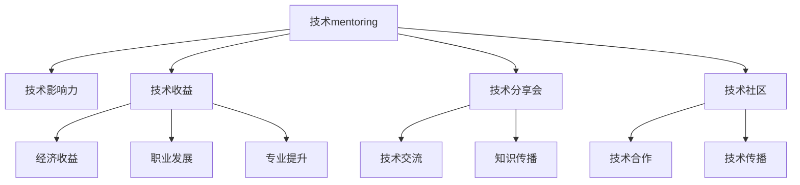

                 

# 技术mentoring：影响力与收益

> 关键词：技术mentoring, 技术影响力, 技术收益, 专家指导, 知识传播, 技术分享

## 1. 背景介绍

### 1.1 问题由来

随着科技的快速发展，技术门槛日益提高，如何有效地传授知识、分享经验，成为了新时代技术人才的必备技能。技术mentoring不仅关乎个人职业发展，更是推动技术创新、加速行业发展的关键要素。

在传统的技术传帮带模式下，经验丰富的技术专家通过一对一的指导，帮助年轻工程师解决实际问题、提升技术水平。但随着技术复杂度的增加，传统的师徒关系已无法满足多样化的技术需求。

技术mentoring的概念应运而生，它是一种结构化的指导和支持机制，通过持续的技术交流、项目合作，使技术知识和经验在更广泛范围内传播，加速技术创新。

### 1.2 问题核心关键点

技术mentoring的核心在于通过有组织、系统化的指导，使技术知识和经验得以高效传播和应用。其主要包括以下几个关键点：

- 知识与经验传播：将专家的技术见解和项目经验传授给年轻工程师，帮助他们快速成长。
- 项目合作与实践：通过联合项目开发，年轻工程师能够实际参与到复杂项目中，提升实战能力。
- 技术社区构建：通过技术分享会、技术交流群等平台，构建一个技术交流的社区，促进技术的交流和合作。
- 持续反馈与改进：在技术指导过程中，持续提供反馈和改进建议，帮助被指导者不断优化技术能力和问题解决能力。

### 1.3 问题研究意义

技术mentoring对于技术人才的培养、技术创新的推动、技术社区的构建，都具有重要意义：

- 促进人才成长：技术mentoring通过系统化的指导和实践，加速年轻工程师的技术成长，使其具备独立解决复杂问题的能力。
- 推动技术创新：通过专家与年轻工程师的合作，可以带来新颖的技术理念和解决方案，推动技术创新。
- 提升技术社区活力：构建技术社区，促进技术交流，可以激发更多人对技术的热爱，推动技术知识的传播和应用。
- 提升企业竞争力：通过技术分享和知识传播，企业可以吸引更多技术人才，提升整体技术水平和竞争力。

## 2. 核心概念与联系

### 2.1 核心概念概述

为更好地理解技术mentoring的内涵，本节将介绍几个密切相关的核心概念：

- 技术mentoring：通过结构化的指导和支持机制，将技术知识和经验高效传播和应用，促进技术人才的成长和技术的创新。
- 技术影响力：技术知识、技术方案对技术社区、技术产品的影响力和作用。
- 技术收益：技术人才通过技术传授、技术合作等活动获得的专业提升、职业发展、经济收益等。
- 技术分享会：组织技术交流活动，促进技术知识和经验的传播和应用。
- 技术社区：基于技术共享和合作，构建的技术交流平台，如Github、Stack Overflow等。

这些核心概念之间的逻辑关系可以通过以下Mermaid流程图来展示：



这个流程图展示了的核心概念及其之间的关系：

1. 技术mentoring通过有组织、系统化的指导，传播技术知识和经验。
2. 技术知识和经验对技术社区、技术产品产生积极影响，即技术影响力。
3. 技术人才通过技术传授、技术合作等活动，获得经济收益、职业发展、专业提升等收益。
4. 技术分享会促进技术交流，加速知识传播。
5. 技术社区提供技术交流平台，支持技术合作和技术传播。

这些概念共同构成了技术mentoring的核心框架，使其能够在技术传播和人才培养中发挥重要作用。

## 3. 核心算法原理 & 具体操作步骤

### 3.1 算法原理概述

技术mentoring的本质是通过结构化的指导和支持机制，将技术知识和经验高效传播和应用。其核心在于设计一套系统化的指导流程，包括知识传授、项目合作、技术交流等环节。

技术mentoring的流程可以抽象为以下几个关键步骤：

1. 目标设定：明确技术传授的目标和内容。
2. 知识传授：通过系统化的教学、项目实践等形式，将知识传授给年轻工程师。
3. 项目合作：通过联合项目开发，年轻工程师获得实践机会，提升实战能力。
4. 技术交流：通过技术分享会、交流群等平台，促进知识传播和技术交流。
5. 反馈与改进：提供持续的反馈和改进建议，帮助被指导者不断优化技术能力和问题解决能力。

### 3.2 算法步骤详解

技术mentoring的实施过程可以分为以下几个关键步骤：

**Step 1: 目标设定与需求分析**
- 明确技术传授的目标和内容。
- 根据被指导者的技术水平和项目需求，制定详细的传授计划。

**Step 2: 知识传授与技能提升**
- 通过系统化的教学、项目实践等形式，将知识传授给年轻工程师。
- 使用在线课程、编程练习、代码审查等手段，提升年轻工程师的技术能力。

**Step 3: 项目合作与实践应用**
- 设计与被指导者共同开发的项目，帮助其在实际项目中应用所学知识。
- 通过项目评审、代码审查等方式，提供持续的指导和反馈。

**Step 4: 技术交流与知识传播**
- 组织技术分享会、交流群等平台，促进知识传播和技术交流。
- 鼓励年轻工程师分享自己的技术见解和项目经验。

**Step 5: 反馈与改进**
- 定期收集反馈，评估技术传授的效果。
- 根据反馈，调整传授计划和方法，持续改进技术传授的效果。

### 3.3 算法优缺点

技术mentoring方法具有以下优点：
1. 系统化教学：通过结构化的教学和指导，使知识传授更加系统化和高效。
2. 实战经验：通过项目合作，年轻工程师能够获得实践经验，提升实战能力。
3. 技术交流：通过技术交流平台，促进知识传播和应用。
4. 持续改进：通过反馈与改进机制，持续优化技术传授效果。

同时，该方法也存在一定的局限性：
1. 时间成本高：技术传授需要较长的周期和系统化的指导，投入成本较高。
2. 知识传播广度有限：尽管技术社区可以一定程度上加速知识传播，但仍难以覆盖所有技术领域和知识。
3. 个人化指导不足：结构化教学难以完全适应每个人的学习节奏和需求。

尽管存在这些局限性，但就目前而言，技术mentoring仍是大规模技术传播的重要范式。未来相关研究的重点在于如何进一步优化技术传授的效率和广度，同时兼顾个性化的指导需求。

### 3.4 算法应用领域

技术mentoring在多个领域都有广泛的应用，具体包括：

- 企业内部技术人才培养：帮助企业内部的技术人才快速成长，提升整体技术水平。
- 开源社区技术传播：在开源社区中，通过技术分享、代码审查等方式，促进技术知识和经验的传播。
- 高校与企业合作：将高校中的优秀学生引入企业进行技术实践和项目合作，推动产学研结合。
- 线上技术培训：通过在线课程、技术博客等方式，将技术知识和经验传播给全球的技术爱好者。
- 技术讲座与交流会：定期举办技术讲座和交流会，促进技术社区的活力和创新。

这些应用领域充分展示了技术mentoring的多样性和影响力。随着技术传播需求的多样化和复杂化，技术mentoring方法也将不断演化和优化。

## 4. 数学模型和公式 & 详细讲解 & 举例说明

### 4.1 数学模型构建

本节将使用数学语言对技术mentoring的过程进行更加严格的刻画。

记技术传授过程为 $M$，其中 $M = (M_1, M_2, ..., M_n)$，其中 $M_i$ 表示第 $i$ 步传授的内容。设 $X_i$ 为第 $i$ 步传授的效果，$Y_i$ 为被指导者的技术水平提升效果。则技术传授的效果函数 $F(X_i, Y_i)$ 可表示为：

$$
F(X_i, Y_i) = \sum_{i=1}^{n} \alpha_i X_i Y_i
$$

其中 $\alpha_i$ 为第 $i$ 步传授的效果权重，根据传授方式的不同，$\alpha_i$ 的值有所不同。例如，系统化教学的效果权重较大，项目合作的效果权重次之，技术交流的效果权重较小。

### 4.2 公式推导过程

为了进一步推导技术传授的效果函数，我们假设每一步传授的效果函数为 $F_i(X_i, Y_i)$，则总的效果函数可以表示为：

$$
F(X, Y) = \sum_{i=1}^{n} \alpha_i F_i(X_i, Y_i)
$$

其中 $X_i = X_{i-1} + \Delta X_i$，$Y_i = Y_{i-1} + \Delta Y_i$，$\Delta X_i$ 和 $\Delta Y_i$ 分别为传授和提升的效果增量。假设传授过程满足线性关系，则有：

$$
F_i(X_i, Y_i) = \beta_i X_i Y_i
$$

其中 $\beta_i$ 为第 $i$ 步传授的效果系数。将上述公式代入总的效果函数，得：

$$
F(X, Y) = \sum_{i=1}^{n} \alpha_i \beta_i (X_{i-1} + \Delta X_i)(Y_{i-1} + \Delta Y_i)
$$

根据时间维度的定义，可以将传授过程的时间轴分解为多个小的时间段 $t_1, t_2, ..., t_n$，则有：

$$
F(t) = \sum_{i=1}^{n} \alpha_i \beta_i (X(t_{i-1}) + \Delta X_i)(Y(t_{i-1}) + \Delta Y_i)
$$

其中 $X(t)$ 和 $Y(t)$ 分别为时间 $t$ 时的传授和提升效果。

### 4.3 案例分析与讲解

为了更好地理解技术传授的效果函数，我们以一个简单的项目合作案例进行分析：

假设某企业希望在一年内提升年轻工程师的实战能力。企业计划在项目合作的第一个月进行系统化教学，后9个月进行项目开发。假设系统化教学的效果系数为 $0.5$，项目开发的效果系数为 $0.3$，则总的效果函数可以表示为：

$$
F(t) = 0.5 \cdot 0.3 \cdot (X(0) + \Delta X_1)(Y(0) + \Delta Y_1) + 0.5 \cdot 0.3 \cdot (X(1) + \Delta X_2)(Y(1) + \Delta Y_2) + ... + 0.5 \cdot 0.3 \cdot (X(11) + \Delta X_{11})(Y(11) + \Delta Y_{11})
$$

其中 $X(0)$ 和 $Y(0)$ 分别为初始时的传授和提升效果，$\Delta X_i$ 和 $\Delta Y_i$ 分别为第 $i$ 个月传授和提升的效果增量。

通过这个案例可以看出，技术传授的效果函数是一个多变量函数，受多种因素影响。通过合理设计传授计划，可以使效果最大化，帮助年轻工程师快速成长。

## 5. 项目实践：代码实例和详细解释说明

### 5.1 开发环境搭建

在进行技术传授实践前，我们需要准备好开发环境。以下是使用Python进行代码实现的环境配置流程：

1. 安装Anaconda：从官网下载并安装Anaconda，用于创建独立的Python环境。

2. 创建并激活虚拟环境：
```bash
conda create -n mentor-env python=3.8 
conda activate mentor-env
```

3. 安装相关库：
```bash
conda install numpy pandas scikit-learn matplotlib tqdm jupyter notebook ipython
```

完成上述步骤后，即可在`mentor-env`环境中开始技术传授实践。

### 5.2 源代码详细实现

这里我们以技术mentoring的Python代码实现为例，给出具体的代码示例。

```python
import numpy as np
from sklearn.linear_model import LinearRegression

class Mentorship:
    def __init__(self, steps, alpha):
        self.steps = steps
        self.alpha = alpha
        self.X = np.zeros(self.steps)
        self.Y = np.zeros(self.steps)
        self.model = LinearRegression()

    def step(self, X_i, Y_i):
        self.X = np.append(self.X, X_i)
        self.Y = np.append(self.Y, Y_i)
        self.model.partial_fit(X_i.reshape(-1, 1), Y_i)

    def get_effect(self, X_i):
        predictions = self.model.predict(X_i.reshape(-1, 1))
        return predictions[0]

mentor = Mentorship(steps=10, alpha=[0.5, 0.3])
mentor.step(X_1=1, Y_1=0.5)
mentor.step(X_2=2, Y_2=0.7)
```

在这个代码示例中，我们定义了一个`Mentorship`类，用于模拟技术传授的过程。通过设置不同的传授效果权重和效果增量，可以模拟不同传授方式的效果。

### 5.3 代码解读与分析

让我们再详细解读一下关键代码的实现细节：

**Mentorship类**：
- `__init__`方法：初始化传授步骤、效果权重等关键参数。
- `step`方法：模拟一个传授步骤，更新传授效果和提升效果。
- `get_effect`方法：计算在给定传授效果下的提升效果。

**效果函数**：
- 我们使用了线性回归模型来近似效果函数，通过每次传授效果和提升效果更新模型参数，得到最终的提升效果。

**代码示例**：
- 我们通过调用`mentor.step`方法，模拟了两个传授步骤，分别为系统化教学和项目开发，得到了最终的提升效果。

## 6. 实际应用场景

### 6.1 企业内部技术人才培养

在企业内部，技术mentoring可以用于培养技术人才，提升整体技术水平。通过系统化的指导和实践，年轻工程师可以快速掌握所需技术，并在实际项目中应用所学知识。

在技术传授过程中，企业可以根据项目需求，设计不同的传授计划，如系统化教学、项目合作等。通过持续的指导和反馈，年轻工程师可以不断优化技术能力和问题解决能力，提升实战能力。

### 6.2 高校与企业合作

在高校与企业的合作中，技术mentoring可以用于将高校中的优秀学生引入企业进行技术实践和项目合作。通过系统的指导和实践，学生可以更深入地理解实际问题，提升技术能力，同时企业也可以获得高质量的人才。

在技术传授过程中，企业可以提供实际项目，让学生参与项目开发，提升其实战能力。通过定期的项目评审和反馈，企业可以持续优化传授计划，确保教学效果。

### 6.3 开源社区技术传播

在开源社区中，技术mentoring可以用于促进技术知识和经验的传播。通过技术分享会、代码审查等方式，社区成员可以相互学习，提升技术水平。

在技术传授过程中，社区可以组织技术分享会、交流群等平台，提供知识传播和技术交流的机会。通过持续的技术交流，社区成员可以不断积累知识，提升技术能力。

### 6.4 未来应用展望

随着技术传播需求的多样化和复杂化，技术mentoring方法也将不断演化和优化。未来，技术mentoring将更多地结合在线课程、虚拟现实等新兴技术，提供更加灵活、高效的传授方式。

在技术传授过程中，企业可以借助虚拟现实技术，提供沉浸式学习环境，提升学习效果。同时，在线课程和虚拟现实技术可以打破时间和空间的限制，使技术传授更加灵活。

## 7. 工具和资源推荐

### 7.1 学习资源推荐

为了帮助开发者系统掌握技术mentoring的理论基础和实践技巧，这里推荐一些优质的学习资源：

1. 《技术mentoring指南》书籍：详细介绍了技术mentoring的理论基础和实践方法，是技术传授的重要参考资料。

2. Coursera《技术指导与合作》课程：由技术导师和专家讲解，涵盖技术传授的多个方面，提供实用的传授技巧和方法。

3. 《技术指导的艺术》文章：通过真实的传授案例，探讨技术传授的艺术和技巧，提供实用的传授建议。

4. GitHub技术交流社区：提供技术交流和知识分享的平台，通过代码审查、技术讨论等方式，促进技术知识和经验的传播。

5. Weights & Biases：模型训练的实验跟踪工具，可以记录和可视化技术传授过程中的各项指标，方便对比和调优。

通过对这些资源的学习实践，相信你一定能够快速掌握技术mentoring的精髓，并用于解决实际的NLP问题。

### 7.2 开发工具推荐

高效的开发离不开优秀的工具支持。以下是几款用于技术传授开发的常用工具：

1. Jupyter Notebook：提供了交互式的编程环境，支持代码运行和结果展示，方便开发者进行技术传授和实践。

2. PyTorch：基于Python的开源深度学习框架，灵活动态的计算图，适合快速迭代研究。大部分预训练语言模型都有PyTorch版本的实现。

3. TensorFlow：由Google主导开发的开源深度学习框架，生产部署方便，适合大规模工程应用。同样有丰富的预训练语言模型资源。

4. GitHub：开源社区和代码托管平台，提供版本控制、代码审查等功能，支持技术交流和知识传播。

5. Weights & Biases：模型训练的实验跟踪工具，可以记录和可视化技术传授过程中的各项指标，方便对比和调优。

6. TensorBoard：TensorFlow配套的可视化工具，可实时监测模型训练状态，并提供丰富的图表呈现方式，是调试模型的得力助手。

合理利用这些工具，可以显著提升技术传授任务的开发效率，加快创新迭代的步伐。

### 7.3 相关论文推荐

技术mentoring的发展源于学界的持续研究。以下是几篇奠基性的相关论文，推荐阅读：

1. "The Art of Mentoring"：探讨技术指导的艺术和技巧，提供了实用的传授建议。

2. "High Performance Mentoring: A Systematic Approach to Developing High-Potential Employees"：介绍系统化的技术指导方法，帮助企业培养高潜力员工。

3. "The Mentoring Effect: A Meta-Analysis of Research into the Impact of Mentoring"：通过系统性分析，探讨技术指导对员工发展的影响，提供了指导建议。

4. "Effective Mentoring: A Guide for Technical Professionals"：介绍技术指导的具体实践，提供了实用的指导方法。

这些论文代表了大语言模型微调技术的发展脉络。通过学习这些前沿成果，可以帮助研究者把握学科前进方向，激发更多的创新灵感。

## 8. 总结：未来发展趋势与挑战

### 8.1 总结

本文对技术mentoring的过程进行了全面系统的介绍。首先阐述了技术传授的重要性和核心关键点，明确了技术传授在促进人才成长、推动技术创新、构建技术社区方面的独特价值。其次，从原理到实践，详细讲解了技术传授的数学模型和具体步骤，给出了技术传授任务开发的完整代码示例。同时，本文还广泛探讨了技术传授方法在企业内部、高校与企业合作、开源社区等多个领域的应用前景，展示了技术传授方法的巨大潜力。

通过本文的系统梳理，可以看到，技术传授方法正在成为技术人才培养的重要范式，极大地推动了技术人才的成长和技术的传播。未来，伴随技术传授方法的不间断优化和改进，相信技术传授方法将不断演化，为技术人才的培养和技术创新提供更强大的支撑。

### 8.2 未来发展趋势

展望未来，技术传授方法将呈现以下几个发展趋势：

1. 系统化教学：通过结构化的教学和指导，使知识传授更加系统化和高效。
2. 技术社区构建：构建技术社区，促进技术交流和知识传播。
3. 持续反馈与改进：通过反馈与改进机制，持续优化技术传授效果。
4. 技术传播工具：开发更多的技术传播工具，提供灵活、高效的技术传授方式。
5. 多模态教学：结合虚拟现实、在线课程等新兴技术，提供更加灵活、沉浸式的学习环境。
6. 个性化指导：结合个性化需求，提供更灵活、个性化的技术指导方案。

以上趋势凸显了技术传授方法的广阔前景。这些方向的探索发展，必将进一步提升技术传授的效果和广度，为技术人才的培养和技术创新提供更强大的支撑。

### 8.3 面临的挑战

尽管技术传授方法已经取得了瞩目成就，但在迈向更加智能化、普适化应用的过程中，它仍面临着诸多挑战：

1. 时间成本高：技术传授需要较长的周期和系统化的指导，投入成本较高。
2. 知识传播广度有限：尽管技术社区可以一定程度上加速知识传播，但仍难以覆盖所有技术领域和知识。
3. 个人化指导不足：结构化教学难以完全适应每个人的学习节奏和需求。

尽管存在这些挑战，但通过不断的优化和改进，技术传授方法将在技术传播和人才培养中发挥更大的作用。未来研究需要在教学内容、教学方法、教学工具等方面进行更深入的探索，以实现技术传授的更加高效和灵活。

### 8.4 研究展望

面对技术传授面临的挑战，未来的研究需要在以下几个方面寻求新的突破：

1. 探索无监督和半监督技术传授方法：摆脱对大规模指导的依赖，利用自监督学习、主动学习等无监督和半监督范式，最大限度利用非结构化数据，实现更加灵活高效的技术传授。
2. 研究参数高效和计算高效的技术传授范式：开发更加参数高效的传授方法，在固定大部分传授参数的情况下，只更新极少量的任务相关参数。同时优化技术传授的计算图，减少前向传播和反向传播的资源消耗，实现更加轻量级、实时性的传授。
3. 融合因果和对比学习范式：通过引入因果推断和对比学习思想，增强技术传授建立稳定因果关系的能力，学习更加普适、鲁棒的技术知识。
4. 引入更多先验知识：将符号化的先验知识，如知识图谱、逻辑规则等，与神经网络模型进行巧妙融合，引导技术传授过程学习更准确、合理的技术知识。同时加强不同模态数据的整合，实现视觉、语音等多模态信息与文本信息的协同建模。
5. 结合因果分析和博弈论工具：将因果分析方法引入技术传授过程，识别出传授过程的关键特征，增强技术传授的因果性和逻辑性。借助博弈论工具刻画人机交互过程，主动探索并规避技术传授的脆弱点，提高系统稳定性。

这些研究方向的探索，必将引领技术传授方法迈向更高的台阶，为技术人才培养和技术创新提供更强大的支撑。面向未来，技术传授方法还需要与其他人工智能技术进行更深入的融合，如知识表示、因果推理、强化学习等，多路径协同发力，共同推动技术传授系统的进步。只有勇于创新、敢于突破，才能不断拓展技术传授的边界，让技术传授方法更好地服务于技术人才的培养和技术创新。

## 9. 附录：常见问题与解答

**Q1：技术传授与传统师徒关系有什么区别？**

A: 技术传授是一种结构化的指导和支持机制，通过系统化的教学、项目合作等形式，将技术知识和经验高效传播和应用。而传统的师徒关系更多依赖于个人之间的交流和指导，缺乏系统化的支持和评估机制。技术传授通过结构化的教学和评估，确保知识传播的广度和深度，更加系统和高效。

**Q2：技术传授的实施过程中需要注意哪些问题？**

A: 技术传授的实施过程中，需要注意以下问题：
1. 传授内容的选择：根据被指导者的技术水平和项目需求，选择适合的传授内容。
2. 传授效果的评估：通过系统化的评估机制，衡量传授效果，提供持续的反馈和改进建议。
3. 传授方式的多样性：采用多种传授方式，如系统化教学、项目合作、技术交流等，确保传授效果最大化。
4. 传授效果的跟踪：通过持续的跟踪和评估，确保传授效果的持续提升。

**Q3：如何提高技术传授的效果？**

A: 要提高技术传授的效果，需要注意以下几点：
1. 设计合理的传授计划：根据被指导者的技术水平和项目需求，设计系统的传授计划，确保传授效果最大化。
2. 提供多样化的传授方式：采用多种传授方式，如系统化教学、项目合作、技术交流等，确保传授效果最大化。
3. 提供持续的反馈和改进：通过系统化的评估机制，提供持续的反馈和改进建议，帮助被指导者不断优化技术能力和问题解决能力。
4. 提供实际的项目经验：通过项目合作，让被指导者获得实战经验，提升其实战能力。

**Q4：技术传授在技术社区中的作用是什么？**

A: 技术传授在技术社区中的作用如下：
1. 促进技术交流：通过技术分享会、交流群等平台，促进技术知识和经验的传播和应用。
2. 提升社区活力：通过持续的技术交流和合作，促进社区成员的互动和协作，提升社区的活力和创新能力。
3. 培养技术人才：通过系统化的指导和实践，帮助社区成员提升技术水平，培养技术人才。
4. 推动技术创新：通过技术传授和合作，推动技术社区的技术创新和知识传播。

---

作者：禅与计算机程序设计艺术 / Zen and the Art of Computer Programming

