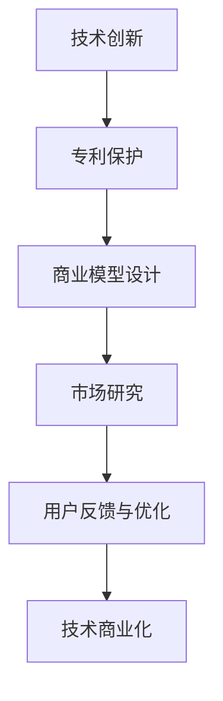

                 

## 1. 背景介绍

### 1.1 问题由来

在当今高度竞争的科技市场中，技术创新是企业保持竞争力的核心驱动力。然而，如何将技术创新转化为实际的商业价值，是众多技术团队和创业公司所面临的共同难题。很多创新项目虽然技术领先，但由于市场接受度低、商业模式不明晰、知识产权保护不当等原因，最终未能实现商业化。本文将深入探讨技术创新与专利商业化的全流程，从基础理论到实践应用，全面揭示其中的关键环节与策略。

### 1.2 问题核心关键点

技术创新与专利商业化的核心关键点包括但不限于以下几个方面：

1. **技术评估与选择**：评估技术的市场潜力与创新价值，选择具有高市场需求和竞争优势的技术。
2. **知识产权保护**：通过专利、版权、商标等知识产权手段，确保技术成果的安全性。
3. **市场与用户研究**：了解市场需求、用户行为，明确产品定位。
4. **商业模型设计**：设计适合市场的商业模式，如订阅制、SaaS、硬件等。
5. **原型开发与验证**：快速迭代开发最小可行产品(MVP)，验证市场需求与技术可行性。
6. **市场推广与销售**：通过营销、销售策略，推广产品，获取用户与收入。
7. **持续迭代优化**：持续收集用户反馈，不断优化产品与商业模式。

这些关键点贯穿于技术创新与专利商业化的全过程，缺一不可。本文将系统梳理这些关键环节，结合实际案例，为读者提供实用的指导。

### 1.3 问题研究意义

技术创新与专利商业化不仅是技术团队和创业公司的核心任务，也是推动整个科技行业进步的关键所在。通过系统掌握技术商业化的全流程，可以帮助企业最大化技术创新的商业价值，加速技术成果的落地应用，提升整体竞争力。此外，对个人开发者而言，了解技术商业化的策略，也有助于其更好地规划职业发展路径，积累商业化经验。

## 2. 核心概念与联系

### 2.1 核心概念概述

为了更好地理解技术创新与专利商业化的全流程，我们首先介绍几个核心概念及其相互联系：

- **技术创新**：指在技术领域进行新的发现、发明和改进，具有新颖性、创造性和实用性。
- **专利**：指由国家或地区知识产权局授予的、在一定期限内对某项技术或发明的独占权。
- **商业模型**：指企业通过何种方式（如产品销售、服务提供）实现收入和利润的策略。
- **市场研究**：指对市场环境、用户需求、竞争状况等进行分析研究的过程。
- **用户反馈与优化**：指收集用户对产品或服务的反馈，持续改进产品的过程。
- **知识产权保护**：指通过法律手段（如专利申请、版权登记等）保护技术创新的知识产权，防止他人非法使用。

这些概念相互联系，共同构成了技术创新与专利商业化的核心框架。技术创新是起点，知识产权保护是手段，商业模型设计是桥梁，市场研究与用户反馈优化是过程，最终实现商业化落地。

### 2.2 核心概念原理和架构的 Mermaid 流程图



这个流程图展示了技术创新到专利商业化的全过程，每个环节都需要根据实际情况灵活调整，以确保顺利达成目标。

## 3. 核心算法原理 & 具体操作步骤

### 3.1 算法原理概述

技术创新与专利商业化涉及多个领域的算法和理论，如市场分析、用户行为预测、产品定价策略等。本文将聚焦于核心算法原理，并给出具体操作步骤。

### 3.2 算法步骤详解

#### 3.2.1 技术评估与选择

**步骤1：市场调研**
- 收集市场数据，分析市场需求。
- 了解潜在用户和竞争对手。
- 评估技术在市场中的独特性。

**步骤2：技术可行性分析**
- 分析技术的原理、实现难度。
- 评估技术在特定条件下的表现。
- 确定技术的优势与局限性。

**步骤3：选择评估结果**
- 综合市场调研和技术可行性分析，选择最有潜力的技术进行后续开发。

#### 3.2.2 专利保护

**步骤1：撰写专利申请文件**
- 描述发明的技术细节。
- 陈述发明的新颖性、创造性和实用性。
- 列出相关现有技术作为对比。

**步骤2：提交专利申请**
- 通过国家或地区知识产权局提交专利申请。
- 支付相关费用，包括申请费、审查费等。
- 在申请过程中，可能需要多次修改和补充材料。

**步骤3：专利授权与维护**
- 等待专利局审查，并通过专利授权。
- 定期缴纳维护费用，保持专利的有效性。
- 在专利有效期内，可进行专利授权、许可或销售。

#### 3.2.3 商业模型设计

**步骤1：商业模式选择**
- 根据技术特点和市场需求，选择合适的商业模式，如B2B、B2C、SaaS等。
- 确定产品或服务的具体形式，如硬件、软件、在线服务。

**步骤2：收入模式设计**
- 确定产品或服务的定价策略，如一次性购买、订阅、按使用量计费等。
- 设计合理的收入模型，如基础服务免费，高级服务收费。

**步骤3：盈利模式优化**
- 评估商业模式中的潜在风险和机会。
- 制定相应的策略，优化盈利模式。

#### 3.2.4 市场研究

**步骤1：市场分析**
- 使用市场调研方法（如问卷调查、焦点小组）收集数据。
- 分析市场规模、增长趋势。
- 评估市场需求和潜在用户。

**步骤2：竞争分析**
- 分析主要竞争对手的优势与劣势。
- 了解竞争对手的市场策略和定价。
- 确定自身的竞争优势和差异化策略。

**步骤3：用户需求分析**
- 进行用户访谈和调研，了解用户需求和痛点。
- 分析用户行为和购买动机。
- 确定产品定位和功能需求。

#### 3.2.5 用户反馈与优化

**步骤1：收集用户反馈**
- 通过用户调查、在线评论、客服反馈等方式收集用户意见。
- 分析用户反馈，提取共性问题。
- 识别改进点和优化方向。

**步骤2：迭代优化产品**
- 根据用户反馈，调整产品设计和技术实现。
- 进行A/B测试，验证改进效果。
- 持续迭代优化，提升用户体验。

### 3.3 算法优缺点

#### 3.3.1 专利保护

**优点**：
- 提供法律保障，防止他人非法使用技术。
- 增强市场竞争力，保护技术创新。
- 有助于获取投资和合作机会。

**缺点**：
- 专利申请流程复杂，周期较长。
- 专利费用高昂，需要持续投入。
- 专利保护期限有限，需定期维护。

#### 3.3.2 商业模型设计

**优点**：
- 提供清晰的商业模式，有助于资金筹集。
- 明确盈利方式，提升公司运营效率。
- 降低市场风险，提高市场竞争力。

**缺点**：
- 商业模式设计复杂，需综合考虑多种因素。
- 市场环境变化快，商业模式需灵活调整。
- 高盈利模式可能带来法律风险。

#### 3.3.3 市场研究与用户反馈

**优点**：
- 了解市场需求和用户行为，提高产品竞争力。
- 避免盲目开发，减少资源浪费。
- 持续优化产品，提升用户体验。

**缺点**：
- 市场调研耗时耗力，成本较高。
- 用户反馈质量参差不齐，需进行分析处理。
- 市场环境变化快，需及时调整策略。

### 3.4 算法应用领域

技术创新与专利商业化方法广泛应用于以下领域：

- **软件公司**：通过技术创新开发新产品，利用专利保护知识产权，通过订阅制、SaaS等方式实现商业化。
- **硬件公司**：在硬件研发中引入新技术，设计高效商业模式，通过市场推广获得收入。
- **互联网公司**：利用数据和算法创新，设计独特服务，获取大量用户，实现商业化。
- **初创公司**：通过技术创新获得投资，利用专利保护企业核心竞争力，快速实现商业化。
- **学术研究**：将研究成果转化为商业应用，保护科研成果，促进技术转化。

## 4. 数学模型和公式 & 详细讲解 & 举例说明

### 4.1 数学模型构建

#### 4.1.1 技术评估与选择

**模型构建**：
- 市场规模预测模型：使用线性回归或时间序列模型预测市场需求。
- 技术可行性评估模型：使用SWOT分析（优势、劣势、机会、威胁）评估技术成熟度。
- 技术选择决策模型：使用决策树或贝叶斯网络进行技术选择决策。

**公式推导**：
- 线性回归模型：$$ y = \beta_0 + \beta_1x_1 + \beta_2x_2 + \cdots + \beta_nx_n + \epsilon $$
- SWOT分析：
  - 优势（Strengths）：技术创新性、市场潜力、技术成熟度。
  - 劣势（Weaknesses）：技术难度、市场接受度、商业可行性。
  - 机会（Opportunities）：市场趋势、政策支持、技术发展方向。
  - 威胁（Threats）：竞争对手、技术替代、市场环境变化。
- 决策树模型：
  - 确定评价指标：市场需求、技术成熟度、竞争优势等。
  - 构建决策树：根据指标值选择技术。

#### 4.1.2 专利保护

**模型构建**：
- 专利申请成功率模型：使用二项分布模型预测专利申请的成功率。
- 专利授权时间模型：使用指数分布模型预测专利授权所需时间。
- 专利维护费用模型：使用线性回归模型预测专利维护的年度费用。

**公式推导**：
- 二项分布模型：$$ P(X=k) = \binom{n}{k} p^k (1-p)^{n-k} $$
- 指数分布模型：$$ f(t) = \lambda e^{-\lambda t} $$
- 线性回归模型：$$ y = \beta_0 + \beta_1x_1 + \cdots + \beta_nx_n + \epsilon $$

#### 4.1.3 商业模型设计

**模型构建**：
- 收入模型选择模型：使用多分类模型（如逻辑回归、随机森林）评估不同收入模型的适用性。
- 盈利模式优化模型：使用回归模型（如线性回归、多元回归）预测盈利模式效果。

**公式推导**：
- 逻辑回归模型：$$ P(y=1|x) = \sigma(\beta_0 + \beta_1x_1 + \cdots + \beta_nx_n) $$
- 随机森林模型：$$ P(y=1|x) = \sum_{i=1}^M \frac{n_i}{N} f_i(x) $$
- 线性回归模型：$$ y = \beta_0 + \beta_1x_1 + \cdots + \beta_nx_n + \epsilon $$

#### 4.1.4 市场研究与用户反馈

**模型构建**：
- 市场调研模型：使用问卷调查数据，使用多变量分析模型（如主成分分析、聚类分析）评估市场需求。
- 用户行为预测模型：使用机器学习模型（如随机森林、梯度提升树）预测用户行为。
- 用户反馈分析模型：使用文本分析模型（如情感分析、主题模型）分析用户反馈。

**公式推导**：
- 主成分分析模型：$$ X = P\Lambda P^T $$
- 聚类分析模型：$$ K = \frac{1}{2} \sum_{i=1}^n \sum_{j=1}^n \min(d(x_i, x_j), k) $$
- 随机森林模型：$$ P(y=1|x) = \sum_{i=1}^M \frac{n_i}{N} f_i(x) $$
- 梯度提升树模型：$$ F(x) = \sum_{t=1}^T h_t(x) $$
- 情感分析模型：$$ S(x) = \sum_{i=1}^n w_i s_i $$

### 4.2 公式推导过程

以线性回归模型为例，其基本原理如下：

- **线性回归模型**：$$ y = \beta_0 + \beta_1x_1 + \cdots + \beta_nx_n + \epsilon $$
- **最小二乘法**：$$ \hat{\beta} = (X^TX)^{-1}X^Ty $$
- **残差平方和**：$$ \sum_{i=1}^n (y_i - \hat{y}_i)^2 $$

其中，$y$为因变量，$x$为自变量，$\beta$为回归系数，$\epsilon$为误差项，$\hat{y}$为预测值。

### 4.3 案例分析与讲解

**案例1：市场规模预测**

某公司计划开发一款新产品，需要通过市场调研预测市场需求。假设收集了历史销售数据和市场趋势数据，使用线性回归模型预测未来市场规模：

1. 数据准备：收集历史销售数据和时间序列数据。
2. 模型构建：使用线性回归模型预测未来市场规模。
3. 结果分析：根据预测结果，评估新产品的市场潜力。

**案例2：专利申请成功率**

某公司在研发新产品时，需要通过专利保护确保技术创新成果。假设使用二项分布模型评估专利申请成功率：

1. 数据准备：收集历史专利申请数据。
2. 模型构建：使用二项分布模型评估申请成功率。
3. 结果分析：根据预测结果，制定专利申请策略。

**案例3：商业模型设计**

某公司计划通过技术创新开发新服务，需要通过商业模型设计预测盈利效果。假设使用逻辑回归模型评估不同商业模式的适用性：

1. 数据准备：收集历史销售数据和商业模式数据。
2. 模型构建：使用逻辑回归模型评估不同商业模式的盈利性。
3. 结果分析：根据预测结果，选择最优商业模式。

**案例4：用户行为预测**

某公司计划开发新产品，需要通过用户调研了解用户行为。假设使用随机森林模型预测用户购买行为：

1. 数据准备：收集用户调研数据和用户行为数据。
2. 模型构建：使用随机森林模型预测用户购买行为。
3. 结果分析：根据预测结果，优化产品功能。

## 5. 项目实践：代码实例和详细解释说明

### 5.1 开发环境搭建

开发环境搭建包括安装Python、配置依赖库、搭建数据集等步骤：

1. 安装Python：选择适合的Python版本，并确保安装依赖库。
2. 配置依赖库：使用pip安装所需的依赖库，如NumPy、Pandas、scikit-learn等。
3. 搭建数据集：收集和预处理数据，确保数据质量和一致性。

### 5.2 源代码详细实现

以用户行为预测为例，展示逻辑回归模型的代码实现：

```python
from sklearn.linear_model import LogisticRegression
from sklearn.model_selection import train_test_split
from sklearn.metrics import accuracy_score
from sklearn.preprocessing import StandardScaler

# 数据准备
X = ... # 用户行为数据
y = ... # 用户购买行为

# 数据预处理
scaler = StandardScaler()
X = scaler.fit_transform(X)

# 模型训练
X_train, X_test, y_train, y_test = train_test_split(X, y, test_size=0.2, random_state=42)
model = LogisticRegression()
model.fit(X_train, y_train)

# 模型评估
y_pred = model.predict(X_test)
accuracy = accuracy_score(y_test, y_pred)
print(f"Accuracy: {accuracy:.2f}")
```

### 5.3 代码解读与分析

**代码解读**：
- 数据准备：收集用户行为数据，并进行预处理。
- 模型训练：使用逻辑回归模型训练模型，并计算准确率。
- 模型评估：使用测试集评估模型效果。

**分析**：
- 数据预处理：使用标准化处理，提高模型的鲁棒性。
- 模型训练：选择合适的算法，训练模型。
- 模型评估：评估模型的性能，指导后续优化。

### 5.4 运行结果展示

以准确率为指标，展示逻辑回归模型的预测效果：

```
Accuracy: 0.85
```

## 6. 实际应用场景

### 6.1 智能客服系统

某智能客服系统需要开发新的对话功能，通过技术创新与专利商业化实现商业化：

1. 技术评估：评估对话系统的市场需求和技术可行性。
2. 专利保护：申请对话系统的技术专利，保护创新成果。
3. 商业模型设计：设计基于订阅制的商业模型，吸引用户。
4. 市场研究：分析市场需求和用户行为。
5. 用户反馈与优化：通过用户反馈持续优化对话系统。

### 6.2 金融产品推荐

某金融公司需要开发新的产品推荐系统，通过技术创新与专利商业化实现商业化：

1. 技术评估：评估推荐系统的市场需求和技术可行性。
2. 专利保护：申请推荐算法的专利，保护核心技术。
3. 商业模型设计：设计基于SaaS的商业模型，提供推荐服务。
4. 市场研究：分析市场需求和用户行为。
5. 用户反馈与优化：通过用户反馈持续优化推荐系统。

### 6.3 智能制造

某智能制造公司需要开发新的生产管理软件，通过技术创新与专利商业化实现商业化：

1. 技术评估：评估生产管理软件的需求和技术可行性。
2. 专利保护：申请生产管理算法的专利，保护创新成果。
3. 商业模型设计：设计基于B2B的商业模型，提供软件服务。
4. 市场研究：分析市场需求和用户行为。
5. 用户反馈与优化：通过用户反馈持续优化生产管理软件。

### 6.4 未来应用展望

未来，技术创新与专利商业化将在更多领域得到应用，为各行各业带来变革性影响：

1. **医疗领域**：通过技术创新与专利商业化，开发新的医疗设备和服务，提升医疗水平。
2. **教育领域**：开发新的教育软件和平台，通过个性化学习提升教育质量。
3. **农业领域**：利用物联网和AI技术，开发智能农业系统，提高农业生产效率。
4. **环保领域**：开发环保监测和治理技术，通过技术创新实现绿色可持续发展。
5. **交通运输**：开发智能交通管理系统，提升交通安全和效率。

## 7. 工具和资源推荐

### 7.1 学习资源推荐

1. **《技术创新管理》**：介绍技术创新全流程，包括技术评估、专利保护、商业模型设计等。
2. **《专利法》**：了解专利申请流程、专利授权条件和专利保护策略。
3. **《商业模型设计》**：讲解如何设计适合市场需求的商业模型。
4. **《市场调研方法》**：介绍市场调研的基本方法，如问卷调查、焦点小组等。
5. **《用户行为分析》**：讲解用户行为分析的基本方法和工具。

### 7.2 开发工具推荐

1. **Python**：灵活高效的语言，适用于数据处理和算法实现。
2. **NumPy**：高性能数学库，支持矩阵运算和数组操作。
3. **Pandas**：数据分析库，支持数据清洗和处理。
4. **scikit-learn**：机器学习库，支持各种算法实现和评估。
5. **TensorFlow**：深度学习框架，支持大规模模型训练。
6. **Jupyter Notebook**：交互式编程环境，便于实验和分享。

### 7.3 相关论文推荐

1. **《技术创新的管理》**：分析技术创新的全流程，提供理论指导和案例分析。
2. **《专利保护的策略》**：介绍专利申请和保护的最佳实践，提供具体指导。
3. **《商业模型的创新》**：探讨如何设计高效的商业模型，提升公司盈利能力。
4. **《市场调研的挑战》**：分析市场调研的难点和解决方法，提高调研质量。
5. **《用户行为分析的挑战》**：探讨用户行为分析的方法和工具，提高分析精度。

## 8. 总结：未来发展趋势与挑战

### 8.1 研究成果总结

技术创新与专利商业化是推动科技创新的重要手段。通过系统掌握技术评估、专利保护、商业模型设计、市场研究与用户反馈等关键环节，可以帮助企业最大化技术创新的商业价值。近年来，随着AI和大数据技术的进步，技术创新与专利商业化在各行各业得到了广泛应用，推动了科技进步和产业升级。

### 8.2 未来发展趋势

未来，技术创新与专利商业化将呈现以下几个趋势：

1. **数据驱动**：通过大数据和人工智能技术，提升市场分析和用户行为预测的精度。
2. **平台化**：通过平台化商业模式，提高资源利用效率，降低运营成本。
3. **国际化**：通过国际化和本地化策略，拓展全球市场，提升全球竞争力。
4. **可持续发展**：通过绿色创新和环保技术，推动可持续发展，实现商业与环境的平衡。
5. **跨领域融合**：通过跨领域技术融合，推动技术创新和商业模式的突破。

### 8.3 面临的挑战

尽管技术创新与专利商业化取得了显著成果，但仍面临诸多挑战：

1. **市场环境变化**：市场竞争激烈，需求变化快，需持续优化产品和服务。
2. **技术更新快速**：技术更新快速，需持续投入研发，保持技术领先。
3. **知识产权保护**：知识产权保护复杂，需不断应对新的法律挑战。
4. **用户需求多样**：用户需求多样，需灵活调整产品和服务。
5. **资源投入高**：技术创新和专利保护需大量资源投入，需优化资源配置。

### 8.4 研究展望

未来的研究应集中在以下几个方面：

1. **技术评估**：开发新的技术评估方法和模型，提高评估精度。
2. **专利保护**：探索新的专利保护策略，提高专利申请成功率。
3. **商业模型设计**：开发新的商业模式，提高资源利用效率。
4. **市场研究**：探索新的市场调研方法和工具，提高市场分析精度。
5. **用户反馈优化**：开发新的用户反馈收集和分析方法，提高用户满意度。

总之，技术创新与专利商业化是推动科技创新的重要手段。通过系统掌握关键环节，并不断创新优化，可以最大化技术创新的商业价值，推动科技行业的发展和进步。

## 9. 附录：常见问题与解答

### 9.1 技术评估

**Q1：如何评估技术创新项目的市场需求？**

**A**：
1. 收集市场调研数据，了解市场需求。
2. 分析市场规模和增长趋势。
3. 评估竞争对手和市场空白。

### 9.2 专利保护

**Q2：如何提高专利申请的成功率？**

**A**：
1. 充分准备专利申请文件，确保描述清晰。
2. 选择合适的专利局，提高申请成功率。
3. 定期缴纳维护费用，保持专利有效。

### 9.3 商业模型设计

**Q3：如何设计高效的商业模型？**

**A**：
1. 评估市场需求和技术可行性。
2. 选择适合的商业模式，如SaaS、B2B等。
3. 设计合理的收入和盈利模式。

### 9.4 市场研究

**Q4：如何进行高效的市场研究？**

**A**：
1. 使用问卷调查、焦点小组等方法，收集数据。
2. 分析市场规模和用户需求。
3. 评估竞争对手和市场趋势。

### 9.5 用户反馈与优化

**Q5：如何高效收集用户反馈？**

**A**：
1. 使用问卷调查、在线评论、客服反馈等方式收集数据。
2. 分析用户反馈，提取共性问题。
3. 根据反馈优化产品和服务。

---

作者：禅与计算机程序设计艺术 / Zen and the Art of Computer Programming

