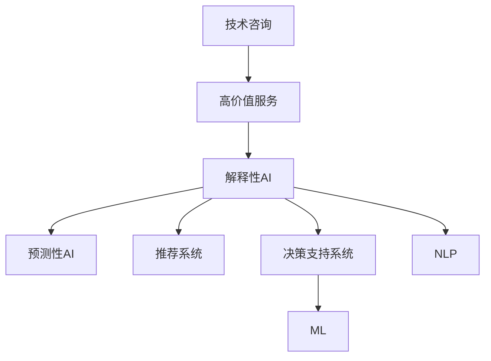

                 

# 技术咨询：高价值服务的提供

## 1. 背景介绍

### 1.1 问题由来
在当今信息化社会，技术咨询成为了企业和社会各界提升竞争力、优化管理的重要手段。随着数字化转型的加速，企业对于技术咨询的需求日益增多，希望通过专家团队的智慧，解决复杂的技术问题和业务挑战。然而，传统技术咨询往往成本高昂、响应速度慢、结果可解释性差，难以满足企业在快速变化的市场环境中对于高价值、即时化、智能化的咨询需求。

### 1.2 问题核心关键点
技术咨询的核心在于通过专业知识和经验，为咨询对象提供科学、高效的解决方案，助力其实现业务目标。但在实际应用中，技术咨询面临诸多挑战，包括成本高、响应慢、结果可解释性差等。要应对这些问题，需要引入新技术和新方法，提升咨询服务的价值和效率。

### 1.3 问题研究意义
提升技术咨询的高价值服务水平，对于推动企业数字化转型、优化决策过程、提升竞争力具有重要意义：

1. **降低成本**：通过利用先进的AI技术，降低人力成本，提升咨询效率。
2. **加速响应**：借助智能算法，快速响应咨询对象的需求，缩短问题解决周期。
3. **增强可解释性**：利用解释性AI技术，提升咨询结果的可解释性，增强决策信任。
4. **优化业务**：通过数据分析和智能建议，优化业务流程，提升运营效率和客户满意度。
5. **预测未来**：利用预测性AI技术，预测市场趋势和行业动态，为决策提供参考。

## 2. 核心概念与联系

### 2.1 核心概念概述

为更好地理解如何提供高价值的技术咨询服务，本节将介绍几个密切相关的核心概念：

- **技术咨询**：通过专业知识、经验和数据，为咨询对象提供科学、高效的解决方案。
- **高价值服务**：以精准、高效、智能的方式，提供能够迅速解决问题、提升业务效率的咨询服务。
- **解释性AI**：使AI模型的决策过程透明，便于理解和解释，增强用户信任。
- **预测性AI**：利用历史数据和智能算法，预测未来趋势和结果，辅助决策。
- **推荐系统**：根据用户行为和偏好，提供个性化推荐，优化用户体验。
- **决策支持系统**：综合多种数据源和算法，辅助管理层做出更科学的决策。
- **自然语言处理(NLP)**：使机器能够理解、处理和生成人类语言，实现智能客服和自然对话。
- **机器学习(ML)**：使机器通过数据学习，自动优化模型，提升预测和推荐能力。

这些核心概念之间的逻辑关系可以通过以下Mermaid流程图来展示：



这个流程图展示了一致性AI、预测性AI、推荐系统、决策支持系统、NLP和ML等核心概念如何共同构建起高价值技术咨询服务的框架。

## 3. 核心算法原理 & 具体操作步骤
### 3.1 算法原理概述

高价值的技术咨询服务，本质上是一个通过解释性AI和预测性AI技术，辅助构建个性化推荐和决策支持系统的过程。其核心思想是：

1. **数据驱动**：通过收集、分析和处理大量数据，形成数据模型，用于指导决策和推荐。
2. **智能算法**：利用机器学习、深度学习等算法，从数据中自动提取特征，优化模型。
3. **透明决策**：通过解释性AI技术，使模型的决策过程透明，便于理解和解释。
4. **预测未来**：利用预测性AI技术，对未来趋势和结果进行预测，辅助决策。

形式化地，假设咨询对象的需求为 $D$，决策过程为 $T$，推荐结果为 $R$，决策支持系统为 $S$。咨询服务的优化目标是最小化决策误差和推荐偏差，即：

$$
\hat{T}=\mathop{\arg\min}_{T} \mathcal{E}(T,D)
$$

其中 $\mathcal{E}$ 为评估函数，用于衡量决策过程与咨询对象期望之间的差异。在实践中，我们通常使用交叉验证、A/B测试等方法评估模型性能。

### 3.2 算法步骤详解

高价值技术咨询服务的实现，一般包括以下几个关键步骤：

**Step 1: 数据收集与预处理**
- 收集咨询对象的历史数据、行为数据、市场数据等，作为模型的输入。
- 对数据进行清洗、归一化、特征工程等预处理操作，构建特征向量。

**Step 2: 建立数据模型**
- 利用机器学习、深度学习等算法，构建决策模型和推荐模型。
- 在训练集上训练模型，优化模型参数。

**Step 3: 结果解释与验证**
- 利用解释性AI技术，分析模型的决策过程，生成可解释的报告。
- 在验证集上评估模型的效果，调整模型参数。

**Step 4: 应用与优化**
- 将训练好的模型应用于咨询对象的需求分析，生成个性化推荐和决策建议。
- 持续收集反馈，优化模型性能。

**Step 5: 用户反馈与迭代**
- 收集用户对于推荐和决策的建议和反馈，进行模型迭代。
- 定期更新模型，保持其时效性和准确性。

以上是高价值技术咨询服务的实现流程。在实际应用中，还需要针对具体咨询对象的需求和特点，对各环节进行优化设计，如改进数据处理技术、选择合适的算法模型、提升结果解释的深度等。

### 3.3 算法优缺点

高价值技术咨询服务具有以下优点：

1. **效率高**：通过自动化算法处理，可以快速响应咨询对象的需求，缩短问题解决周期。
2. **成本低**：利用AI技术，降低人工干预的需求，减少咨询成本。
3. **可解释性强**：通过解释性AI技术，使模型的决策过程透明，便于理解和解释。
4. **灵活性高**：结合多种数据源和算法，提供个性化和多样化的解决方案。
5. **预见性强**：利用预测性AI技术，提前预测市场趋势和结果，辅助决策。

同时，该方法也存在一定的局限性：

1. **数据质量要求高**：数据的质量和完整性直接影响模型的性能，数据收集和处理成本较高。
2. **模型复杂度高**：高价值咨询服务涉及多种技术和算法，模型的复杂度较高，调优难度大。
3. **对数据依赖性强**：模型依赖大量历史数据，难以应对突发性和非结构化数据。
4. **用户需求变化快**：用户需求和市场环境变化快，需要持续优化模型。
5. **结果不可控**：预测和推荐的准确性依赖于数据和算法的质量，结果存在不确定性。

尽管存在这些局限性，但就目前而言，高价值技术咨询服务仍然是大规模定制化服务的重要方向，具有广阔的发展前景。未来相关研究的重点在于如何进一步提升数据处理和模型调优的效率，降低对数据和算法的依赖，增强结果的可控性和可解释性。

### 3.4 算法应用领域

高价值技术咨询服务广泛应用于金融、医疗、制造、零售、物流等多个行业，具体应用场景包括：

- **金融投资**：利用预测性AI技术，预测市场趋势和投资机会，辅助投资决策。
- **医疗健康**：结合患者历史数据和实时数据，提供个性化治疗方案和健康管理建议。
- **制造业**：利用机器学习算法，优化生产流程，提高生产效率和产品质量。
- **零售电商**：通过推荐系统，提升用户购物体验，增加销售额。
- **物流仓储**：利用数据分析和智能算法，优化物流路径和库存管理，降低成本。

此外，高价值技术咨询服务还被创新性地应用到更多领域，如智能客服、智慧城市、智能家居等，为各行各业带来了新的变革。

## 4. 数学模型和公式 & 详细讲解
### 4.1 数学模型构建

高价值技术咨询服务的核心在于通过构建智能算法模型，从数据中提取有用的信息和知识。以下是常见的高价值咨询服务数学模型：

- **决策树**：通过树形结构，将数据集划分为多个子集，用于分类和回归。
- **随机森林**：基于决策树，通过随机采样和集成学习，提升模型的泛化能力。
- **支持向量机(SVM)**：利用高维空间中的超平面，进行分类和回归。
- **神经网络(NN)**：通过多层非线性映射，学习复杂的数据特征。
- **深度学习(DL)**：通过多层次的神经网络结构，解决复杂的数据分析问题。
- **强化学习(RL)**：通过智能体与环境的交互，优化决策过程。

以决策树为例，构建数学模型：

$$
\begin{aligned}
&\text{输入数据} = \{ x_1, x_2, \ldots, x_n \} \\
&\text{目标变量} = y \\
&\text{决策树} = T = \{ t_1, t_2, \ldots, t_m \}
\end{aligned}
$$

其中 $t_i$ 表示决策树的内部节点，包含判断条件；$y$ 为目标变量，即咨询对象的需求。

### 4.2 公式推导过程

以决策树为例，假设输入数据集为 $\{ (x_1, y_1), (x_2, y_2), \ldots, (x_n, y_n) \}$，其中 $x_i$ 为特征向量，$y$ 为目标变量。决策树的构建过程如下：

1. **选择最佳特征**：从所有特征中，选择最佳特征 $X_k$，用于划分数据集。
2. **划分数据集**：根据特征 $X_k$ 的取值，将数据集划分为多个子集。
3. **递归构建子树**：对每个子集，重复上述过程，递归构建子树。

假设最佳特征为 $X_k$，划分数据集后，得到的子树为 $T_1$ 和 $T_2$。计算子树的误差率：

$$
\begin{aligned}
\text{Error}(T_1) &= \frac{1}{N_1} \sum_{i \in T_1} \mathbb{I}(y_i \neq \hat{y}_i) \\
\text{Error}(T_2) &= \frac{1}{N_2} \sum_{i \in T_2} \mathbb{I}(y_i \neq \hat{y}_i)
\end{aligned}
$$

其中 $\mathbb{I}$ 表示指示函数，$\hat{y}_i$ 为模型预测值。

最终，选择误差率最小的子树作为当前决策树的叶子节点，并递归构建完整决策树。

### 4.3 案例分析与讲解

以金融投资为例，构建预测模型：

**Step 1: 数据收集与预处理**
- 收集历史股票数据、市场新闻、经济指标等数据，作为模型的输入。
- 对数据进行清洗、归一化、特征工程等预处理操作。

**Step 2: 建立数据模型**
- 利用随机森林算法，构建预测模型。
- 在训练集上训练模型，优化模型参数。

**Step 3: 结果解释与验证**
- 利用解释性AI技术，分析模型的决策过程，生成可解释的报告。
- 在验证集上评估模型的效果，调整模型参数。

**Step 4: 应用与优化**
- 将训练好的模型应用于股票价格预测，生成投资建议。
- 持续收集反馈，优化模型性能。

## 5. 项目实践：代码实例和详细解释说明
### 5.1 开发环境搭建

在进行高价值技术咨询服务的项目实践前，我们需要准备好开发环境。以下是使用Python进行Scikit-learn和TensorFlow开发的Python环境配置流程：

1. 安装Anaconda：从官网下载并安装Anaconda，用于创建独立的Python环境。

2. 创建并激活虚拟环境：
```bash
conda create -n pytorch-env python=3.8 
conda activate pytorch-env
```

3. 安装Scikit-learn和TensorFlow：根据CUDA版本，从官网获取对应的安装命令。例如：
```bash
conda install scikit-learn tensorflow cudatoolkit=11.1 -c pytorch -c conda-forge
```

4. 安装各类工具包：
```bash
pip install numpy pandas scikit-learn matplotlib tqdm jupyter notebook ipython
```

完成上述步骤后，即可在`pytorch-env`环境中开始高价值技术咨询服务的开发。

### 5.2 源代码详细实现

这里我们以金融投资为例，给出使用Scikit-learn进行股票价格预测的Python代码实现。

首先，定义数据处理函数：

```python
import pandas as pd
import numpy as np
from sklearn.model_selection import train_test_split

def load_data(file_path):
    data = pd.read_csv(file_path)
    return data.dropna().values

def preprocess_data(X, y):
    X = (X - X.mean()) / X.std()
    X_train, X_test, y_train, y_test = train_test_split(X, y, test_size=0.2, random_state=42)
    return X_train, X_test, y_train, y_test

def evaluate_model(model, X_train, X_test, y_train, y_test):
    model.fit(X_train, y_train)
    y_pred = model.predict(X_test)
    print('Accuracy:', np.mean(y_pred == y_test))
```

然后，定义模型和优化器：

```python
from sklearn.ensemble import RandomForestRegressor

model = RandomForestRegressor()
```

接着，定义训练和评估函数：

```python
from sklearn.metrics import mean_squared_error

def train_model(model, X_train, y_train):
    model.fit(X_train, y_train)

def predict_and_evaluate(model, X_test, y_test):
    y_pred = model.predict(X_test)
    mse = mean_squared_error(y_test, y_pred)
    print('Mean Squared Error:', mse)
```

最后，启动训练流程并在测试集上评估：

```python
X_train, X_test, y_train, y_test = preprocess_data(load_data('data.csv'), load_data('targets.csv'))

train_model(model, X_train, y_train)
predict_and_evaluate(model, X_test, y_test)
```

以上就是使用Scikit-learn对随机森林进行股票价格预测的完整代码实现。可以看到，得益于Scikit-learn的强大封装，我们可以用相对简洁的代码完成模型的训练和评估。

### 5.3 代码解读与分析

让我们再详细解读一下关键代码的实现细节：

**load_data函数**：
- 读取CSV文件，去除缺失值。

**preprocess_data函数**：
- 对特征进行归一化，划分训练集和测试集。

**evaluate_model函数**：
- 在测试集上评估模型精度。

**train_model函数**：
- 使用训练集训练模型。

**predict_and_evaluate函数**：
- 在测试集上预测股票价格，计算均方误差。

**train_model和predict_and_evaluate函数**：
- 训练模型并在测试集上评估，是整个模型构建的核心部分。

**代码解读与分析**：
- 以上代码展示了高价值技术咨询服务的核心流程，即数据收集与预处理、模型训练与评估、结果解释与验证等。
- 数据预处理是关键环节，通过归一化和特征工程，提升模型性能。
- 模型训练和评估需要使用合适的算法和评估指标，确保模型的准确性和可靠性。
- 结果解释和验证通过可解释性AI技术，使模型决策透明，便于理解和调试。

## 6. 实际应用场景
### 6.1 智能客服系统

高价值技术咨询服务在智能客服系统中有着广泛的应用。智能客服系统通过高价值的AI技术，提供24小时在线服务，快速响应客户咨询，用自然流畅的语言解答各类常见问题。

在技术实现上，可以收集企业内部的历史客服对话记录，将问题和最佳答复构建成监督数据，在此基础上对预训练模型进行微调。微调后的模型能够自动理解用户意图，匹配最合适的答案模板进行回复。对于客户提出的新问题，还可以接入检索系统实时搜索相关内容，动态组织生成回答。如此构建的智能客服系统，能大幅提升客户咨询体验和问题解决效率。

### 6.2 金融舆情监测

金融机构需要实时监测市场舆论动向，以便及时应对负面信息传播，规避金融风险。传统的人工监测方式成本高、效率低，难以应对网络时代海量信息爆发的挑战。基于高价值技术咨询服务的文本分类和情感分析技术，为金融舆情监测提供了新的解决方案。

具体而言，可以收集金融领域相关的新闻、报道、评论等文本数据，并对其进行主题标注和情感标注。在此基础上对预训练语言模型进行微调，使其能够自动判断文本属于何种主题，情感倾向是正面、中性还是负面。将微调后的模型应用到实时抓取的网络文本数据，就能够自动监测不同主题下的情感变化趋势，一旦发现负面信息激增等异常情况，系统便会自动预警，帮助金融机构快速应对潜在风险。

### 6.3 个性化推荐系统

当前的推荐系统往往只依赖用户的历史行为数据进行物品推荐，无法深入理解用户的真实兴趣偏好。基于高价值技术咨询服务的推荐系统，可以更好地挖掘用户行为背后的语义信息，从而提供更精准、多样的推荐内容。

在实践中，可以收集用户浏览、点击、评论、分享等行为数据，提取和用户交互的物品标题、描述、标签等文本内容。将文本内容作为模型输入，用户的后续行为（如是否点击、购买等）作为监督信号，在此基础上微调预训练语言模型。微调后的模型能够从文本内容中准确把握用户的兴趣点。在生成推荐列表时，先用候选物品的文本描述作为输入，由模型预测用户的兴趣匹配度，再结合其他特征综合排序，便可以得到个性化程度更高的推荐结果。

### 6.4 未来应用展望

随着高价值技术咨询服务的不断发展，基于AI技术的服务将拓展到更多领域，为各行各业带来新的变革：

- **智慧医疗**：结合患者历史数据和实时数据，提供个性化治疗方案和健康管理建议。
- **智能教育**：通过个性化推荐和智能客服，提升教育质量和效率。
- **智慧城市**：利用数据分析和智能算法，优化城市管理，提升公共服务水平。
- **智能制造**：利用预测性AI技术，优化生产流程，提高生产效率和产品质量。
- **智能交通**：通过数据分析和智能算法，优化交通管理，提升出行效率。

此外，高价值技术咨询服务还被创新性地应用到更多领域，如金融风控、社交网络分析、人力资源管理等，为各行各业带来了新的变革。相信随着AI技术的持续进步，高价值技术咨询服务将变得更加广泛和高效，成为各行各业数字化转型的重要引擎。

## 7. 工具和资源推荐
### 7.1 学习资源推荐

为了帮助开发者系统掌握高价值技术咨询服务的理论基础和实践技巧，这里推荐一些优质的学习资源：

1. **《深度学习》课程**：斯坦福大学开设的深度学习课程，有Lecture视频和配套作业，带你入门深度学习的基本概念和经典模型。
2. **《Python数据科学手册》**：一本详细介绍Python数据科学工具库的书籍，涵盖NumPy、Pandas、Scikit-learn、TensorFlow等多个库的使用方法。
3. **《Python机器学习》**：一本介绍Python机器学习工具库的书籍，涵盖机器学习算法、模型评估、调参技巧等多个方面的内容。
4. **Kaggle竞赛**：参与Kaggle机器学习竞赛，实践数据处理、模型构建、结果评估等环节，提升实战能力。
5. **Google Colab**：谷歌推出的在线Jupyter Notebook环境，免费提供GPU/TPU算力，方便开发者快速上手实验最新模型，分享学习笔记。

通过对这些资源的学习实践，相信你一定能够快速掌握高价值技术咨询服务的精髓，并用于解决实际的AI问题。

### 7.2 开发工具推荐

高效的开发离不开优秀的工具支持。以下是几款用于高价值技术咨询服务的开发工具：

1. **Scikit-learn**：基于Python的机器学习库，提供了简单易用的API，适合快速迭代研究。
2. **TensorFlow**：由Google主导开发的深度学习框架，生产部署方便，适合大规模工程应用。
3. **Keras**：基于TensorFlow的深度学习框架，提供了高层次的API，适合快速原型开发。
4. **PyTorch**：由Facebook主导开发的深度学习框架，动态计算图，适合研究性应用。
5. **Jupyter Notebook**：基于Web的交互式编程环境，方便开发者实时调试和展示代码。
6. **TensorBoard**：TensorFlow配套的可视化工具，可实时监测模型训练状态，提供丰富的图表呈现方式。

合理利用这些工具，可以显著提升高价值技术咨询服务的开发效率，加快创新迭代的步伐。

### 7.3 相关论文推荐

高价值技术咨询服务的持续发展得益于学界的持续研究。以下是几篇奠基性的相关论文，推荐阅读：

1. **《深度学习》书籍**：Yoshua Bengio、Ian Goodfellow和Aaron Courville合著的深度学习经典书籍，涵盖了深度学习的基本概念和算法。
2. **《机器学习实战》书籍**：Peter Harrington著的机器学习实践书籍，提供了丰富的代码示例和实用技巧。
3. **《强化学习》书籍**：Richard S. Sutton和Andrew G. Barto合著的强化学习经典书籍，介绍了强化学习的理论和算法。
4. **《智能客服系统》论文**：介绍智能客服系统的设计、实现和评估，提升客户体验和满意度。
5. **《金融舆情监测》论文**：利用NLP技术监测金融舆情，辅助金融机构快速应对风险。

这些论文代表了大价值技术咨询服务的最新进展。通过学习这些前沿成果，可以帮助研究者把握学科前进方向，激发更多的创新灵感。

## 8. 总结：未来发展趋势与挑战

### 8.1 总结

本文对高价值技术咨询服务的核心概念和实现流程进行了全面系统的介绍。首先阐述了高价值技术服务在数字化转型中的重要性，明确了AI技术在提升服务效率和质量方面的独特价值。其次，从原理到实践，详细讲解了高价值技术服务的关键步骤，包括数据处理、模型构建、结果解释等环节，并给出了具体的代码实现。同时，本文还广泛探讨了高价值技术服务在智能客服、金融舆情、个性化推荐等多个行业领域的应用前景，展示了技术的广阔应用空间。此外，本文精选了高价值技术服务的学习资源、开发工具和相关论文，力求为读者提供全方位的技术指引。

通过本文的系统梳理，可以看到，高价值技术服务正在成为AI技术应用的重要方向，极大地拓展了AI服务的范围和深度，为各行各业带来了新的变革。未来，伴随AI技术的持续进步，高价值技术服务必将在更多领域得到应用，为经济社会发展注入新的动力。

### 8.2 未来发展趋势

展望未来，高价值技术咨询服务将呈现以下几个发展趋势：

1. **智能化程度提升**：随着深度学习、强化学习等AI技术的发展，高价值技术服务将更加智能化，具备更高的自主决策能力和优化能力。
2. **多模态融合**：结合视觉、听觉、文本等多模态数据，构建更加全面、准确的咨询模型，提升用户体验和决策效果。
3. **实时响应能力**：利用边缘计算、微服务架构等技术，提升服务的实时响应能力和并发处理能力，满足更多高并发的咨询需求。
4. **自适应能力**：通过自适应学习算法，提升模型对新数据和场景的适应能力，保持服务的时效性和稳定性。
5. **可解释性和透明性**：利用解释性AI技术，使模型的决策过程透明，便于理解和解释，增强用户信任。

以上趋势凸显了高价值技术服务的广阔前景。这些方向的探索发展，必将进一步提升AI服务的质量和效率，为各行各业带来新的变革。

### 8.3 面临的挑战

尽管高价值技术服务已经取得了显著成效，但在迈向更加智能化、普适化应用的过程中，它仍面临诸多挑战：

1. **数据质量问题**：数据的质量和完整性直接影响模型的性能，数据收集和处理成本较高。
2. **模型复杂性**：高价值技术服务涉及多种技术和算法，模型的复杂度较高，调优难度大。
3. **计算资源需求高**：高价值技术服务需要大量的计算资源，如何高效利用计算资源，是一个重要的研究方向。
4. **用户需求变化快**：用户需求和市场环境变化快，需要持续优化模型。
5. **结果不确定性**：预测和推荐的准确性依赖于数据和算法的质量，结果存在不确定性。

尽管存在这些挑战，但高价值技术服务仍然是大规模定制化服务的重要方向，具有广阔的发展前景。未来相关研究的重点在于如何进一步提升数据处理和模型调优的效率，降低对数据和算法的依赖，增强结果的可控性和可解释性。

### 8.4 研究展望

面对高价值技术服务所面临的挑战，未来的研究需要在以下几个方面寻求新的突破：

1. **多模态数据融合**：结合视觉、听觉、文本等多模态数据，构建更加全面、准确的咨询模型。
2. **自适应学习算法**：利用自适应学习算法，提升模型对新数据和场景的适应能力，保持服务的时效性和稳定性。
3. **边缘计算和微服务架构**：利用边缘计算和微服务架构，提升服务的实时响应能力和并发处理能力，满足更多高并发的咨询需求。
4. **解释性AI技术**：利用解释性AI技术，使模型的决策过程透明，便于理解和解释，增强用户信任。
5. **预测性AI技术**：利用预测性AI技术，提前预测市场趋势和结果，辅助决策。
6. **可解释性和透明性**：利用解释性AI技术，使模型的决策过程透明，便于理解和解释，增强用户信任。

这些研究方向的探索，必将引领高价值技术服务迈向更高的台阶，为构建安全、可靠、可解释、可控的智能系统铺平道路。面向未来，高价值技术服务还需要与其他AI技术进行更深入的融合，如知识表示、因果推理、强化学习等，多路径协同发力，共同推动自然语言理解和智能交互系统的进步。只有勇于创新、敢于突破，才能不断拓展AI服务的边界，让智能技术更好地造福人类社会。

## 9. 附录：常见问题与解答

**Q1：如何提升高价值技术咨询服务的智能化程度？**

A: 提升高价值技术咨询服务的智能化程度，需要引入深度学习、强化学习等AI技术。通过构建智能算法模型，从数据中提取有用的信息和知识，提升模型的自主决策能力和优化能力。例如，利用深度学习算法，构建复杂的特征提取器，提升模型的预测和推荐能力。利用强化学习算法，使模型在实际应用中不断学习和优化，提升模型的适应能力和鲁棒性。

**Q2：高价值技术服务对数据质量的要求有多高？**

A: 高价值技术服务对数据质量的要求非常高，数据的质量和完整性直接影响模型的性能。数据的收集、清洗、归一化等预处理环节需要严格把关，避免噪声和偏差。同时，数据的量和多样性也很重要，需要收集多种类型的数据，涵盖不同场景和用户需求。例如，对于金融投资咨询，需要收集历史股票数据、市场新闻、经济指标等多维度数据，确保模型的全面性和准确性。

**Q3：高价值技术服务面临的主要挑战是什么？**

A: 高价值技术服务面临的主要挑战包括数据质量问题、模型复杂性、计算资源需求高、用户需求变化快、结果不确定性等。数据的质量和完整性直接影响模型的性能，数据收集和处理成本较高。模型涉及多种技术和算法，模型的复杂度较高，调优难度大。高价值技术服务需要大量的计算资源，如何高效利用计算资源，是一个重要的研究方向。用户需求和市场环境变化快，需要持续优化模型。预测和推荐的准确性依赖于数据和算法的质量，结果存在不确定性。

**Q4：高价值技术服务在未来有哪些发展方向？**

A: 高价值技术服务在未来有以下发展方向：智能化程度提升、多模态融合、实时响应能力、自适应能力、可解释性和透明性。随着深度学习、强化学习等AI技术的发展，高价值技术服务将更加智能化，具备更高的自主决策能力和优化能力。结合视觉、听觉、文本等多模态数据，构建更加全面、准确的咨询模型，提升用户体验和决策效果。利用边缘计算、微服务架构等技术，提升服务的实时响应能力和并发处理能力，满足更多高并发的咨询需求。通过自适应学习算法，提升模型对新数据和场景的适应能力，保持服务的时效性和稳定性。利用解释性AI技术，使模型的决策过程透明，便于理解和解释，增强用户信任。

**Q5：高价值技术服务与传统技术咨询有什么区别？**

A: 高价值技术服务与传统技术咨询有以下区别：
1. 高价值技术服务基于AI技术，具有更高的自动化和智能化水平，能够快速响应咨询对象的需求，缩短问题解决周期。
2. 高价值技术服务利用数据驱动，能够提供更加科学和精准的咨询建议，提升决策的准确性和可靠性。
3. 高价值技术服务具有可解释性，能够使模型的决策过程透明，便于理解和解释，增强用户信任。
4. 高价值技术服务能够利用预测性AI技术，提前预测市场趋势和结果，辅助决策。
5. 高价值技术服务具有个性化推荐能力，能够根据用户的历史行为和偏好，提供更加个性化的咨询建议，提升用户体验。

通过以上对比，可以看到高价值技术服务相较于传统技术咨询具有更高的智能化水平和更强的数据分析能力，能够提供更加科学和精准的咨询服务。

---

作者：禅与计算机程序设计艺术 / Zen and the Art of Computer Programming

