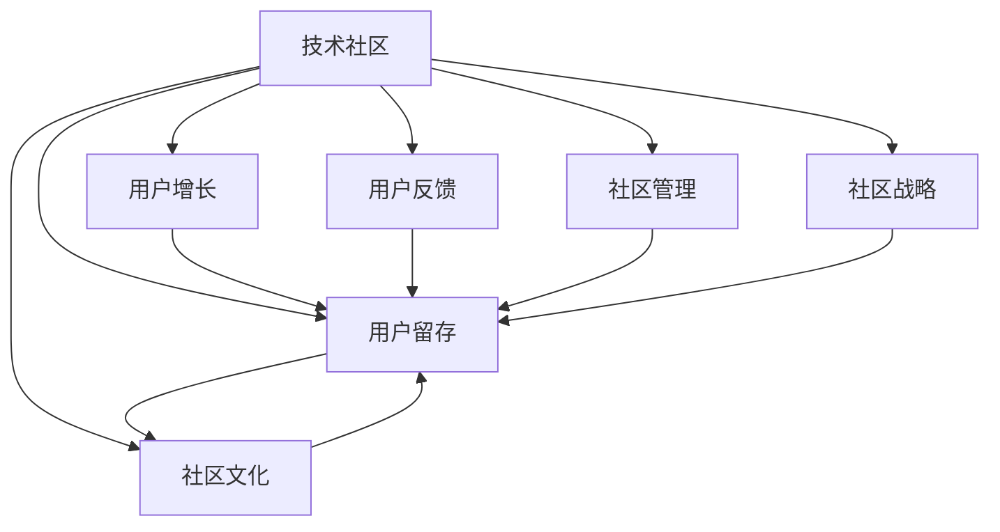

                 

# 技术社区建设：从0到10万用户

> 关键词：技术社区，用户增长，社区运营，用户留存，用户参与度，社区文化，用户反馈，社区管理，社区战略，社区资源，技术分享

## 1. 背景介绍

### 1.1 问题由来

在互联网快速发展的今天，技术社区已经成为了技术爱好者、开发者、企业家、工程师等专业人士交流互动的重要平台。一个优秀的技术社区不仅能吸引大量优秀人才，还能推动技术创新和行业进步。然而，建设一个成功的大规模技术社区并非易事，不仅需要卓越的产品和技术，还需要深入理解和掌握用户增长、运营、留存等方面的策略。本文将通过深度分析技术社区建设的核心问题和解决方案，帮助读者理解如何从零开始，一步步建立起一个活跃、高效、富有活力的技术社区。

### 1.2 问题核心关键点

- **用户增长**：技术社区从零起步，如何吸引并获取足够的初始用户。
- **用户留存**：如何让新用户长期参与社区，提升用户参与度和忠诚度。
- **社区文化**：如何塑造独特的社区文化和价值观，形成强烈的社区归属感。
- **用户反馈**：如何高效收集并处理用户反馈，改进社区产品和服务。
- **社区管理**：如何制定和实施社区规则，保持社区秩序和安全。
- **社区战略**：如何制定长期的社区发展战略，实现社区的可持续增长。

这些核心问题贯穿于技术社区建设的每一个阶段，解决好了这些问题，就能构建一个活跃、富有活力且具有持久生命力的技术社区。

### 1.3 问题研究意义

建设一个成功的技术社区，对于推动技术创新、促进产业升级、培养高水平人才具有重要意义：

- **创新加速**：优秀的技术社区聚集了大量优秀人才，提供了丰富多样的技术分享和交流机会，能加速技术创新和产业应用。
- **人才汇聚**：技术社区成为优秀人才的集散地，能够吸引全球顶级人才，为行业带来新的思想和创新。
- **知识传承**：社区成员间的知识共享和传承，提高了整个行业的知识水平和技术深度。
- **生态完善**：社区不仅能促进技术交流，还能推动相关产业链上下游的协同发展。

## 2. 核心概念与联系

### 2.1 核心概念概述

为更好地理解技术社区建设，本节将介绍几个核心概念：

- **技术社区**：由技术爱好者、开发者、专家、工程师等专业人士构成的在线交流互动平台。
- **用户增长**：指获取新用户的过程，包含用户获取、用户转化和用户留存。
- **用户留存**：指让已有用户长期参与社区的过程，包含用户活跃度提升和用户流失控制。
- **社区文化**：指社区成员共同认同的行为规范、价值观念和社群氛围。
- **用户反馈**：指收集社区用户的使用体验和意见建议，以便改进产品和服务。
- **社区管理**：指制定和实施社区规则，维护社区秩序和安全。
- **社区战略**：指长期的技术社区发展策略和路径规划。

这些核心概念之间的逻辑关系可以通过以下Mermaid流程图来展示：



这个流程图展示了一个技术社区的核心组成和不同功能之间的关系：

1. 技术社区提供基础平台，用于用户增长和用户留存。
2. 用户增长通过吸引新用户，提升社区活力。
3. 用户留存通过提升用户参与度和忠诚度，保证社区长期活跃。
4. 社区文化通过塑造独特的价值观和社群氛围，增强用户归属感。
5. 用户反馈用于改进产品和服务，提升用户满意度。
6. 社区管理通过制定规则和维护秩序，保证社区健康发展。
7. 社区战略指导社区的长期发展方向和策略。

这些概念共同构成了技术社区的建设和运营框架，帮助社区管理者在各个环节取得成功。

## 3. 核心算法原理 & 具体操作步骤

### 3.1 算法原理概述

技术社区的用户增长、留存、文化建设、反馈收集、管理维护和战略规划等过程，均可通过算法进行建模和优化。本文将从用户增长的角度，系统介绍如何利用算法原理构建一个成功的大型技术社区。

用户增长通常包括两个阶段：获取新用户和转化新用户。获取新用户可以通过SEO优化、社交媒体营销、广告投放等方式实现，而转化新用户则需要通过个性化的引导和推荐机制实现。此外，用户留存也涉及到算法推荐、社区活动策划、用户激励等多种算法和技术手段。

### 3.2 算法步骤详解

技术社区的用户增长和留存算法步骤主要包括以下几个关键步骤：

**Step 1: 确定社区定位和目标用户**

- 确定社区的核心主题和方向，吸引特定领域的用户。
- 定义社区的目标用户画像，明确用户需求和痛点。

**Step 2: 构建用户增长模型**

- 使用回归分析、决策树、神经网络等模型，预测社区用户的增长趋势。
- 使用A/B测试等方法，不断优化模型预测准确度。

**Step 3: 设计用户转化流程**

- 制定多阶段转化策略，逐步引导新用户进入社区。
- 优化用户界面和交互体验，提升新用户的转化率。

**Step 4: 实施个性化推荐**

- 使用协同过滤、内容推荐算法，为不同用户推荐有价值的内容。
- 根据用户行为数据，动态调整推荐策略，提升用户留存。

**Step 5: 策划社区活动**

- 使用事件驱动算法，根据用户兴趣和行为策划个性化的社区活动。
- 定期组织线上线下活动，提升用户参与度。

**Step 6: 制定激励机制**

- 设计积分、勋章、排行榜等激励手段，奖励积极参与的用户。
- 通过游戏化设计，提升用户粘性。

**Step 7: 收集用户反馈和改进**

- 使用自然语言处理、情感分析等技术，收集用户反馈和意见。
- 根据反馈结果，优化社区功能和用户体验。

**Step 8: 维护社区秩序**

- 使用机器学习算法，自动识别和处理违规行为。
- 定期更新社区规则，确保社区秩序和安全。

**Step 9: 制定长期战略**

- 分析社区发展的历史数据，制定长期战略规划。
- 通过数据分析，持续优化社区资源配置和运营策略。

通过以上步骤，可以系统地构建和优化技术社区的用户增长和留存策略。

### 3.3 算法优缺点

基于算法的技术社区用户增长和留存方法具有以下优点：

1. **自动化和数据驱动**：算法模型能够自动分析和处理大量用户数据，驱动社区增长和运营策略的优化。
2. **效率高**：相比人工操作，算法可以大幅提升社区管理的效率和精确度。
3. **持续优化**：算法模型能够持续学习和改进，保持社区的长期活力。

同时，该方法也存在一些缺点：

1. **模型复杂**：算法模型的设计和实现需要较高的技术门槛，需要专业知识。
2. **数据质量要求高**：算法的预测和推荐效果依赖于高质量的用户数据。
3. **过度依赖技术**：如果算法模型设计不合理，可能会导致社区策略失效。

尽管存在这些局限性，但基于算法的用户增长和留存策略，仍是大规模技术社区建设的重要基础。

### 3.4 算法应用领域

基于算法的技术社区用户增长和留存方法已经在多个领域得到了广泛应用，例如：

- **技术交流社区**：如Stack Overflow、GitHub等，通过算法推荐技术文章和代码，提高用户参与度和留存率。
- **开发者社区**：如Medium、Hacker News等，通过算法推荐高质量内容，吸引和留住开发者。
- **创业加速社区**：如AngelList、Y Combinator等，通过算法匹配潜在投资人和创业机会，促进社区繁荣。
- **技术学习社区**：如Coursera、Udemy等，通过算法推荐个性化课程，提高用户学习效果和满意度。

除了这些经典应用外，算法技术也在更多领域催生了新的应用场景，如企业内部技术社区、开源社区、教育技术社区等，为不同类型技术社区的建设提供了新的思路和方法。

## 4. 数学模型和公式 & 详细讲解 & 举例说明

### 4.1 数学模型构建

在技术社区的用户增长和留存过程中，我们可以通过数学模型来刻画和优化相关算法。以下是一个典型的用户增长和留存模型：

假设社区用户在时间 $t$ 的总数为 $U_t$，新用户数为 $N_t$，老用户数为 $L_t$。则有：

$$
U_t = N_t + L_t
$$

新用户的增长率为 $g$，老用户的留存率为 $r$，则有：

$$
N_{t+1} = gN_t
$$

$$
L_{t+1} = rL_t
$$

由此可以得到用户总数随时间的变化关系：

$$
U_{t+1} = gN_t + rL_t
$$

假设初始用户数为 $U_0$，则有：

$$
U_t = U_0 \cdot g^t \cdot r^t
$$

### 4.2 公式推导过程

根据以上模型，可以推导出一些关键的增长和留存指标：

- **用户增长率**：$g$
- **用户留存率**：$r$
- **增长因子**：$k = g \cdot r$
- **用户总数**：$U_t = U_0 \cdot k^t$

通过这些指标，可以分析社区用户增长的趋势和规律，从而制定有效的增长和留存策略。

### 4.3 案例分析与讲解

以Coursera平台为例，分析其用户增长的数学模型：

Coursera平台的用户增长模型可以近似表示为：

$$
U_t = U_0 \cdot g^t \cdot r^t
$$

其中，$U_0$ 表示平台的初始用户数，$g$ 表示每周新增用户数，$r$ 表示用户留存率。根据Coursera的公开数据，可以估计其每周新增用户数约为 $g = 1000$，用户留存率约为 $r = 0.7$。假设Coursera平台于2012年推出，初始用户数为 $U_0 = 10000$，则有：

$$
U_t = 10000 \cdot 1000^t \cdot 0.7^t
$$

通过这个模型，可以计算出Coursera平台在任意时间 $t$ 的用户总数。例如，2015年平台用户数约为：

$$
U_5 = 10000 \cdot 1000^5 \cdot 0.7^5 \approx 10^7
$$

即Coursera平台在2015年的用户数约为 $10^7$。

通过上述分析，可以看出数学模型在技术社区用户增长和留存中的应用价值。

## 5. 项目实践：代码实例和详细解释说明

### 5.1 开发环境搭建

在进行技术社区用户增长和留存的实践前，我们需要准备好开发环境。以下是使用Python进行Scikit-learn开发的Python环境配置流程：

1. 安装Anaconda：从官网下载并安装Anaconda，用于创建独立的Python环境。

2. 创建并激活虚拟环境：
```bash
conda create -n myenv python=3.8 
conda activate myenv
```

3. 安装Scikit-learn：
```bash
pip install scikit-learn
```

4. 安装各类工具包：
```bash
pip install numpy pandas matplotlib seaborn
```

完成上述步骤后，即可在`myenv`环境中开始用户增长和留存的实践。

### 5.2 源代码详细实现

这里我们以一个简单的用户增长和留存模型为例，给出使用Scikit-learn进行用户增长分析的Python代码实现。

首先，导入所需的库和数据：

```python
import pandas as pd
from sklearn.model_selection import train_test_split
from sklearn.linear_model import LinearRegression
import matplotlib.pyplot as plt

# 导入数据
data = pd.read_csv('community_growth.csv')
```

然后，定义用户增长模型：

```python
# 计算新用户增长率
g = data['new_users'].mean()

# 计算用户留存率
r = data['retention_rate'].mean()

# 构建用户增长模型
model = LinearRegression()

# 训练模型
X = data[['time']] 
y = data['total_users']
X_train, X_test, y_train, y_test = train_test_split(X, y, test_size=0.2, random_state=42)

# 训练模型
model.fit(X_train, y_train)

# 预测未来用户数
future_time = pd.DataFrame({'time': [1000, 2000, 3000, 4000, 5000]})
future_time['predicted_users'] = model.predict(future_time)
```

最后，可视化用户增长曲线：

```python
plt.plot(data['time'], data['total_users'], label='Actual users')
plt.plot(future_time['time'], future_time['predicted_users'], label='Predicted users')
plt.legend()
plt.show()
```

这就是一个简单的用户增长和留存模型的Python代码实现。可以看到，通过Scikit-learn库，我们可以方便地构建和训练用户增长模型，并使用其预测未来的用户增长趋势。

### 5.3 代码解读与分析

让我们再详细解读一下关键代码的实现细节：

**用户增长模型构建**：
- 首先计算新用户增长率 $g$ 和用户留存率 $r$，然后使用线性回归模型拟合用户增长曲线。
- 在数据预处理阶段，使用`train_test_split`函数将数据集分为训练集和测试集，以便评估模型的预测效果。

**用户增长模型训练**：
- 使用`fit`函数训练线性回归模型，得到用户增长的回归系数。
- 使用`predict`函数预测未来时间点的用户总数。

**用户增长曲线可视化**：
- 使用`plot`函数绘制实际用户增长曲线和预测用户增长曲线。
- 通过`legend`函数添加图例，使图表更清晰易懂。

通过以上步骤，我们构建了一个简单的用户增长和留存模型，并对其实现进行了详细的代码解读。

## 6. 实际应用场景

### 6.1 智能推荐系统

技术社区的用户增长和留存模型，在智能推荐系统中也有着广泛的应用。智能推荐系统能够根据用户的历史行为数据和兴趣偏好，向用户推荐有价值的内容，提高用户参与度和留存率。

例如，GitHub平台使用推荐算法，向用户推荐相关的开源项目和代码库，从而吸引更多开发者加入社区。Coursera平台根据用户的学习历史和偏好，推荐个性化的在线课程，提升用户的满意度和留存率。

### 6.2 社交网络平台

社交网络平台如LinkedIn、Facebook等，也通过用户增长和留存模型，优化用户推荐和内容展现，提升用户粘性。例如，LinkedIn平台使用用户增长模型，预测用户的活跃度和留存率，优化推荐算法，吸引更多专业人士加入社区。

### 6.3 电子商务平台

电子商务平台如Amazon、淘宝等，通过用户增长和留存模型，优化商品推荐和用户体验，提升用户购买率和留存率。例如，Amazon平台根据用户的浏览和购买历史，推荐个性化的商品，提升用户的购物体验和满意度。

### 6.4 未来应用展望

随着技术社区和智能推荐系统的不断发展，基于用户增长和留存模型的应用也将更加广泛。未来，用户增长和留存模型将进一步融合更多前沿技术，如深度学习、强化学习等，提升模型的预测和推荐效果。同时，模型也将更注重隐私保护和公平性，保障用户数据的安全和透明。

## 7. 工具和资源推荐

### 7.1 学习资源推荐

为了帮助开发者系统掌握技术社区用户增长和留存的理论基础和实践技巧，这里推荐一些优质的学习资源：

1. 《数据科学导论》系列博文：由大数据技术专家撰写，深入浅出地介绍了数据科学和机器学习的基础知识和实践技巧。

2. Coursera《机器学习》课程：由斯坦福大学Andrew Ng教授主讲，系统介绍机器学习的基本原理和算法。

3. 《推荐系统实战》书籍：介绍了推荐系统的基本原理和经典算法，结合实际案例，帮助读者理解推荐系统的工作原理和应用。

4. GitHub官方文档：GitHub平台提供了丰富的API和文档，开发者可以使用这些文档进行开发和测试。

5. LinkedIn官方文档：LinkedIn平台提供了详细的开发者文档和API接口，开发者可以通过这些文档进行开发和集成。

通过对这些资源的学习实践，相信你一定能够快速掌握技术社区用户增长和留存的精髓，并用于解决实际的社区问题。

### 7.2 开发工具推荐

高效的开发离不开优秀的工具支持。以下是几款用于技术社区用户增长和留存开发的常用工具：

1. Jupyter Notebook：Python开发的交互式计算环境，支持代码编写、数据可视化和实时计算，方便开发者快速迭代和调试代码。

2. Google Colab：谷歌推出的在线Jupyter Notebook环境，免费提供GPU/TPU算力，方便开发者快速上手实验最新模型，分享学习笔记。

3. Microsoft Azure：微软提供的云服务平台，支持多种编程语言和数据处理工具，方便开发者进行大数据分析和模型训练。

4. AWS云平台：亚马逊提供的云服务平台，支持多种云计算服务和数据处理工具，适合大规模分布式计算。

5. Docker：Docker容器化技术，可以方便地打包和部署应用，提升开发效率和系统稳定性。

合理利用这些工具，可以显著提升技术社区用户增长和留存任务的开发效率，加快创新迭代的步伐。

### 7.3 相关论文推荐

技术社区用户增长和留存技术的发展源于学界的持续研究。以下是几篇奠基性的相关论文，推荐阅读：

1. "The PageRank Algorithm"（PageRank算法）：Google搜索引擎的核心算法，通过计算网页的链接权重，提升搜索结果的相关性和质量。

2. "Collaborative Filtering for Implicit Feedback Datasets"（协同过滤算法）：推荐系统中常用的协同过滤算法，通过用户行为数据进行推荐。

3. "Deep Reinforcement Learning for Personalized Product Recommendation"（深度强化学习算法）：推荐系统中使用深度强化学习算法，优化推荐效果和用户体验。

4. "A New Face Recognition System"（人脸识别算法）：人脸识别技术在智能推荐系统中的应用，通过图像处理和机器学习，实现精准的用户身份识别和个性化推荐。

5. "Learning to Rank for Information Retrieval"（排序学习算法）：排序学习算法在信息检索中的应用，通过学习用户点击顺序和行为，提升检索系统的准确性和用户体验。

这些论文代表了大规模技术社区用户增长和留存技术的发展脉络。通过学习这些前沿成果，可以帮助研究者把握学科前进方向，激发更多的创新灵感。

## 8. 总结：未来发展趋势与挑战

### 8.1 总结

本文对技术社区用户增长和留存的建设过程进行了全面系统的介绍。首先阐述了技术社区建设的核心问题和解决方案，明确了用户增长、留存、文化建设、反馈收集、管理维护和战略规划在社区建设中的关键作用。其次，从原理到实践，详细讲解了用户增长和留存的数学模型和算法步骤，给出了用户增长分析的完整代码实例。同时，本文还广泛探讨了用户增长和留存在智能推荐系统、社交网络平台、电子商务平台等多个领域的应用前景，展示了其广阔的应用范围。此外，本文精选了用户增长和留存的各类学习资源，力求为读者提供全方位的技术指引。

通过本文的系统梳理，可以看到，技术社区用户增长和留存技术正在成为技术社区建设的重要基础，显著提升了社区的活力和用户满意度。未来，伴随技术社区和智能推荐系统的持续演进，这些技术必将进一步拓展其应用边界，推动技术社区的智能化、个性化和普适化发展。

### 8.2 未来发展趋势

展望未来，技术社区用户增长和留存技术将呈现以下几个发展趋势：

1. **多模态数据融合**：用户增长和留存模型将融合更多种类的数据，如文本、图像、视频、音频等多模态数据，提升模型的预测和推荐效果。

2. **深度学习和强化学习结合**：深度学习和强化学习技术的结合，将提升用户增长和留存模型的准确性和用户体验。

3. **个性化和实时化**：通过深度学习等技术，实现更加个性化和实时化的推荐和服务，提升用户参与度和留存率。

4. **隐私保护和公平性**：随着数据隐私和安全问题的日益突出，用户增长和留存模型将更加注重隐私保护和公平性，保障用户数据的安全和透明。

5. **联邦学习和差分隐私**：通过联邦学习和差分隐私等技术，保护用户隐私，同时提升模型的预测效果。

6. **跨平台协同推荐**：通过跨平台协同推荐，提升用户在不同平台之间的转换率和留存率，形成更广泛的社区生态。

以上趋势凸显了技术社区用户增长和留存技术的广阔前景。这些方向的探索发展，必将进一步提升技术社区的性能和应用范围，为技术社区的持续增长和用户满意度提升提供新的动力。

### 8.3 面临的挑战

尽管技术社区用户增长和留存技术已经取得了瞩目成就，但在迈向更加智能化、普适化应用的过程中，它仍面临着诸多挑战：

1. **数据隐私和安全**：用户增长和留存模型依赖大量用户数据，如何在数据收集和使用过程中保护用户隐私，是一个亟待解决的问题。

2. **模型复杂度**：用户增长和留存模型涉及多种数据源和算法，模型设计和实现复杂度较高，需要专业知识。

3. **计算资源**：大规模用户增长和留存模型的训练和推理需要大量计算资源，如何在有限的资源下实现高效计算是一个挑战。

4. **模型解释性**：用户增长和留存模型通常被视为“黑盒”，难以解释其内部工作机制和决策逻辑。

5. **跨平台协同**：不同平台之间的数据和算法差异较大，如何实现跨平台的协同推荐和数据共享是一个难题。

6. **数据不平衡**：社区用户行为数据分布不均，如何处理和优化数据不平衡问题，是一个重要的研究方向。

正视技术社区用户增长和留存面临的这些挑战，积极应对并寻求突破，将是大规模技术社区建设的重要方向。相信随着学界和产业界的共同努力，这些挑战终将一一被克服，技术社区用户增长和留存技术必将在构建智能化的社区中发挥越来越重要的作用。

### 8.4 研究展望

面对技术社区用户增长和留存面临的种种挑战，未来的研究需要在以下几个方面寻求新的突破：

1. **跨领域知识融合**：将符号化的先验知识与神经网络模型进行融合，引导用户增长和留存模型学习更准确、合理的用户行为模型。

2. **多任务学习**：同时学习多个任务，提升用户增长和留存模型的多任务处理能力，实现更加全面的用户分析。

3. **实时推荐系统**：通过实时数据处理和推荐算法，提升用户增长和留存模型的实时推荐能力，满足用户实时需求。

4. **用户行为序列建模**：通过序列建模技术，更好地捕捉用户行为的时序特征，提升模型预测的准确性和用户满意度。

5. **用户情感分析**：通过情感分析技术，了解用户情感变化，优化推荐算法，提升用户体验。

6. **社会化网络分析**：通过社会化网络分析技术，发现用户间的社交关系和影响力，提升推荐效果。

这些研究方向将帮助技术社区用户增长和留存技术不断优化和提升，为技术社区的智能化、个性化和普适化发展提供新的思路和方法。

## 9. 附录：常见问题与解答

**Q1：如何构建高效的用户增长和留存模型？**

A: 构建高效的用户增长和留存模型需要综合考虑用户数据、算法选择和模型优化。以下是一些关键步骤：

1. **数据采集**：收集用户行为数据，包括注册时间、浏览记录、购买历史、评价反馈等。
2. **数据预处理**：清洗和标准化数据，去除噪音和异常值，提取有用的特征。
3. **模型选择**：根据数据特点和业务需求，选择合适的算法，如线性回归、协同过滤、深度学习等。
4. **模型训练**：使用训练集对模型进行拟合，调整参数和超参数，优化模型性能。
5. **模型评估**：使用测试集对模型进行评估，计算预测误差和指标，如准确率、召回率、F1值等。
6. **模型部署**：将训练好的模型部署到实际应用中，进行实时预测和推荐。

通过以上步骤，可以构建高效的用户增长和留存模型，提升技术社区的用户参与度和留存率。

**Q2：用户增长和留存模型的预测效果如何评估？**

A: 用户增长和留存模型的预测效果可以通过多种指标进行评估，以下是一些常用的评估方法：

1. **准确率**：预测的用户增长和留存数据与实际数据的匹配程度。
2. **召回率**：预测到的用户增长和留存数据占实际数据的比例。
3. **F1值**：准确率和召回率的调和平均数，综合评估模型的预测效果。
4. **均方误差**：预测值与实际值之间的平均误差。
5. **R²值**：预测值与实际值的拟合程度，值越接近1表示模型拟合越好。
6. **用户满意度调查**：通过用户反馈和满意度调查，评估模型的实际效果。

通过这些指标，可以全面评估用户增长和留存模型的预测效果，并不断优化模型性能。

**Q3：如何提升技术社区的用户留存率？**

A: 提升技术社区的用户留存率需要从多个方面入手，以下是一些有效的方法：

1. **用户激励**：设计合理的激励机制，如积分、勋章、排行榜等，提升用户参与度和忠诚度。
2. **个性化推荐**：根据用户行为和兴趣，推荐有价值的内容，提高用户满意度和留存率。
3. **社区活动**：定期组织线上线下活动，增加用户互动和参与感。
4. **用户反馈**：及时收集用户反馈，优化社区功能和用户体验。
5. **知识分享**：鼓励用户分享知识和经验，形成良性互动和交流氛围。
6. **技术支持**：提供优质的技术支持和咨询服务，解决用户问题，增强社区信任。

通过以上方法，可以显著提升技术社区的用户留存率，形成长期活跃的社区生态。

**Q4：用户增长和留存模型在实际应用中需要注意哪些问题？**

A: 用户增长和留存模型在实际应用中需要注意以下问题：

1. **数据隐私**：保护用户隐私，遵守相关法律法规和数据保护标准。
2. **模型公平性**：确保模型不带有歧视性，对不同用户群体进行公平推荐。
3. **模型解释性**：提升模型的可解释性，让用户理解模型的决策过程和推荐依据。
4. **实时更新**：及时更新模型，适应数据分布的变化和用户的动态需求。
5. **跨平台协同**：实现跨平台协同推荐，提升用户在不同平台之间的转换率和留存率。
6. **资源优化**：优化计算资源，提升模型的训练和推理效率。

通过关注这些问题，可以更好地实现用户增长和留存模型在技术社区中的应用，提升用户满意度和社区生态。

**Q5：用户增长和留存模型的应用前景如何？**

A: 用户增长和留存模型在技术社区中的应用前景非常广阔，以下是一些主要方向：

1. **智能推荐系统**：如Coursera、GitHub等平台，通过用户增长和留存模型，实现个性化推荐，提升用户参与度和留存率。
2. **社交网络平台**：如LinkedIn、Facebook等，通过用户增长和留存模型，优化用户推荐和内容展现，提升用户粘性。
3. **电子商务平台**：如Amazon、淘宝等，通过用户增长和留存模型，优化商品推荐和用户体验，提升用户购买率和留存率。
4. **金融和保险**：如支付宝、平安等，通过用户增长和留存模型，实现个性化金融服务和保险推荐，提升用户满意度和留存率。
5. **医疗健康**：如丁香医生、健康之路等，通过用户增长和留存模型，实现个性化健康服务和医疗推荐，提升用户满意度和留存率。

通过这些应用，用户增长和留存模型将在多个行业领域发挥重要作用，推动技术社区的智能化、个性化和普适化发展。

---

作者：禅与计算机程序设计艺术 / Zen and the Art of Computer Programming

