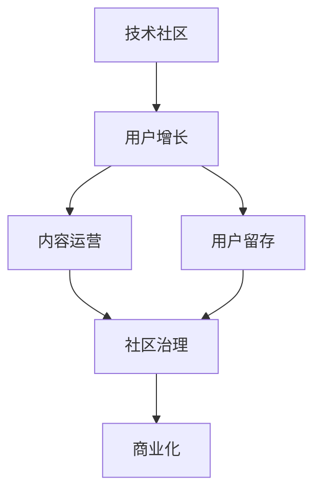

                 

# 技术社区运营：从0到10000用户

> 关键词：技术社区，用户增长，社区管理，社区运营，用户留存

## 1. 背景介绍

### 1.1 问题由来
在互联网快速发展的今天，技术社区成为了一个汇聚技术讨论、交流、分享的重要平台。然而，对于许多新创建的技术社区来说，如何吸引用户、扩大影响力、实现长期健康发展，是一个充满挑战的问题。本节将探讨技术社区运营的核心问题，帮助社区运营人员从0到10000用户，逐步构建一个活跃、有影响力的技术社区。

### 1.2 问题核心关键点
技术社区运营的核心在于用户增长和社区管理。具体来说，包括以下几个关键点：

1. **用户获取**：通过各种手段吸引新用户加入社区，提高用户注册量。
2. **用户留存**：采取有效策略提升用户活跃度和忠诚度，减少用户流失。
3. **内容运营**：确保社区内容质量，吸引高质量用户和贡献者。
4. **社区治理**：建立良好的社区规则和氛围，维护社区秩序。
5. **商业化**：探索社区的商业化路径，实现社区的可持续发展。

本节将详细介绍如何从用户增长、内容运营、社区治理和商业化等方面，实现技术社区从0到10000用户的运营。

## 2. 核心概念与联系

### 2.1 核心概念概述

为更好地理解技术社区运营的框架，本节将介绍几个核心概念及其相互关系：

1. **技术社区**：一个以技术讨论、分享、交流为主题的在线平台，旨在促进技术交流和知识传播。
2. **用户增长**：通过各种手段吸引新用户加入社区的过程。
3. **用户留存**：采取措施提高用户活跃度和忠诚度，减少用户流失。
4. **内容运营**：确保社区内容的质量和多样性，吸引高质量用户和贡献者。
5. **社区治理**：建立良好的社区规则和氛围，维护社区秩序。
6. **商业化**：通过商业活动实现社区的可持续发展。

这些概念之间的逻辑关系可以通过以下Mermaid流程图来展示：



这个流程图展示出技术社区运营的关键环节：

1. **用户增长**：吸引新用户加入社区。
2. **内容运营**：提升社区内容质量，吸引高质量用户和贡献者。
3. **社区治理**：维护社区秩序，提高用户留存率。
4. **商业化**：实现社区的可持续发展。

每个环节之间相互关联，共同构成了技术社区的运营框架。

## 3. 核心算法原理 & 具体操作步骤

### 3.1 算法原理概述

技术社区运营的核心算法原理在于用户增长的漏斗模型。该模型将用户增长分为以下几个阶段：

1. **获取**：吸引用户注册。
2. **激活**：引导新用户参与社区活动。
3. **留存**：通过持续互动提高用户活跃度和忠诚度。
4. **转化**：将活跃用户转化为贡献者。
5. **传播**：鼓励现有用户带动新用户加入。

每个阶段都有相应的策略和算法，目标是最大化用户获取和留存，最终实现社区的持续增长。

### 3.2 算法步骤详解

**Step 1: 用户获取策略**
- **SEO优化**：优化社区网站的搜索引擎排名，吸引自然流量。
- **社交媒体推广**：利用社交媒体平台进行广告投放，引导用户访问社区。
- **内容营销**：发布高质量技术文章、教程、案例等，吸引目标用户。
- **合作推广**：与其他技术社区或相关网站进行合作，互相引流。

**Step 2: 用户激活策略**
- **新手引导**：为新用户提供简单明了的使用指南和功能介绍。
- **奖励机制**：通过积分、徽章、优惠券等方式，激励新用户参与社区活动。
- **社区活动**：组织线上线下技术沙龙、竞赛、讲座等活动，提升用户粘性。

**Step 3: 用户留存策略**
- **个性化推荐**：根据用户兴趣推荐相关内容和活动，提高用户满意度。
- **社群互动**：建立用户群组，鼓励用户之间的交流和互助。
- **定期回访**：定期向用户发送社区新闻、活动预告，保持用户参与感。
- **反馈机制**：建立用户反馈渠道，及时解决问题，提升用户信任度。

**Step 4: 用户转化策略**
- **社区贡献奖励**：设置贡献积分、排行榜等方式，激励用户贡献内容和技术分享。
- **专家入驻**：邀请行业专家入驻社区，提升社区影响力。
- **社区资源整合**：整合社区资源，如文档库、代码库、工具包等，提供更多价值。

**Step 5: 用户传播策略**
- **口碑传播**：鼓励用户分享社区内容和体验，通过口碑效应吸引新用户。
- **付费会员**：提供付费会员服务，为高质量用户提供专属权益。
- **商业合作**：与企业、开发者工具厂商等合作，推广社区品牌。

### 3.3 算法优缺点

技术社区运营的算法优点包括：

1. **高效性**：通过系统化的运营策略，快速吸引和留存用户。
2. **可扩展性**：能够适应不同规模和技术社区的需求。
3. **可测量性**：通过数据分析，实时调整运营策略，提升效果。

但同时，也存在一些缺点：

1. **复杂性**：需要综合考虑多方面的因素，策略设计复杂。
2. **成本高**：用户获取和留存需要大量的资源投入，运营成本较高。
3. **难以预测**：用户行为难以完全预测，策略效果可能不如预期。

尽管如此，基于用户增长的漏斗模型，技术社区运营的算法仍然是一种有效的用户增长手段。

### 3.4 算法应用领域

技术社区运营的算法广泛应用于各种类型的技术社区，包括但不限于以下领域：

- **编程社区**：如Stack Overflow、GitHub等，主要聚焦于编程和软件开发。
- **数据科学社区**：如Kaggle、DataCamp等，主要聚焦于数据科学和机器学习。
- **网络安全社区**：如OWASP、Kali等，主要聚焦于网络安全技术。
- **人工智能社区**：如Kaggle、ArXiv等，主要聚焦于人工智能和深度学习。
- **区块链社区**：如Ethereum、BitcoinTalk等，主要聚焦于区块链技术和应用。

这些社区的成功运营，展示了用户增长漏斗模型的强大应用价值。

## 4. 数学模型和公式 & 详细讲解 & 举例说明

### 4.1 数学模型构建

技术社区用户增长的数学模型可以基于漏斗模型构建。假设社区的总用户数为 $U$，用户增长的各个阶段比例为 $P_1, P_2, P_3, P_4, P_5$。则用户增长模型可以表示为：

$$
U = P_1 + P_2 + P_3 + P_4 + P_5
$$

其中 $P_i$ 表示每个阶段的实际用户数占总用户数的比例。

### 4.2 公式推导过程

根据漏斗模型的定义，用户增长可以分解为以下步骤：

1. **获取**：获取用户数为 $G$，用户转化为活跃用户的比例为 $P_1$。
2. **激活**：活跃用户数为 $A$，激活用户转化为留存用户的比例为 $P_2$。
3. **留存**：留存用户数为 $R$，留存用户转化为贡献者的比例为 $P_3$。
4. **转化**：贡献用户数为 $C$，贡献用户转化为传播者的比例为 $P_4$。
5. **传播**：传播用户数为 $S$，传播用户转化为新用户的比例为 $P_5$。

通过以上步骤，可以得到用户增长模型：

$$
U = G \cdot P_1 + G \cdot P_1 \cdot P_2 + G \cdot P_1 \cdot P_2 \cdot P_3 + G \cdot P_1 \cdot P_2 \cdot P_3 \cdot P_4 + G \cdot P_1 \cdot P_2 \cdot P_3 \cdot P_4 \cdot P_5
$$

### 4.3 案例分析与讲解

以GitHub社区为例，展示用户增长模型的应用：

1. **获取**：GitHub通过SEO优化、社交媒体推广、内容营销等方式，获取大量新用户。
2. **激活**：通过新手引导、奖励机制和社区活动，激活新用户，提高用户活跃度。
3. **留存**：通过个性化推荐、社群互动和定期回访，提高用户留存率。
4. **转化**：通过贡献积分、专家入驻和社区资源整合，将活跃用户转化为贡献者。
5. **传播**：鼓励用户分享社区内容和体验，通过口碑效应吸引新用户。

GitHub通过上述策略，实现了从0到10000用户，再到超过5000万用户，成为全球最大的技术社区之一。

## 5. 项目实践：代码实例和详细解释说明

### 5.1 开发环境搭建

在进行社区运营实践前，我们需要准备好开发环境。以下是使用Python进行用户增长策略实现的开发环境配置流程：

1. 安装Python和Anaconda：从官网下载并安装Python和Anaconda，用于创建独立的Python环境。

2. 创建并激活虚拟环境：
```bash
conda create -n community-env python=3.8 
conda activate community-env
```

3. 安装所需的Python包：
```bash
pip install flask requests beautifulsoup4 django
```

4. 安装数据库：
```bash
pip install psycopg2-binary
```

5. 设置数据库配置：
```python
DATABASES = {
    'default': {
        'ENGINE': 'django.db.backends.postgresql',
        'NAME': 'community_db',
        'USER': 'community_user',
        'PASSWORD': 'community_password',
        'HOST': 'localhost',
        'PORT': '5432',
    }
}
```

6. 搭建Web服务器：
```python
from django.core.wsgi import get_wsgi_application
application = get_wsgi_application()
```

完成上述步骤后，即可在`community-env`环境中开始社区运营实践。

### 5.2 源代码详细实现

以下是一个基于Flask框架的用户增长策略实现示例代码：

```python
from flask import Flask, request, render_template
import requests

app = Flask(__name__)

@app.route('/')
def index():
    # 获取社交媒体推广数据
    social_media_data = requests.get('https://example.com/social_media_data').json()
    # 获取SEO优化数据
    seo_data = requests.get('https://example.com/seo_data').json()
    # 获取内容营销数据
    content_marketing_data = requests.get('https://example.com/content_marketing_data').json()
    
    # 计算获取用户数
    G = social_media_data['users'] + seo_data['users'] + content_marketing_data['users']
    
    # 计算各阶段用户数
    P_1 = 0.2  # 获取用户转化为活跃用户的比例
    P_2 = 0.3  # 活跃用户转化为留存用户的比例
    P_3 = 0.4  # 留存用户转化为贡献者的比例
    P_4 = 0.5  # 贡献用户转化为传播者的比例
    P_5 = 0.6  # 传播用户转化为新用户的比例
    
    # 计算总用户数
    U = G * P_1 + G * P_1 * P_2 + G * P_1 * P_2 * P_3 + G * P_1 * P_2 * P_3 * P_4 + G * P_1 * P_2 * P_3 * P_4 * P_5
    
    # 返回用户增长结果
    return render_template('index.html', users=U)

if __name__ == '__main__':
    app.run(debug=True)
```

在这个示例中，我们通过Flask框架搭建了一个简单的Web应用，用于展示用户增长的计算过程。具体实现步骤如下：

1. 定义Flask应用，实现路由处理。
2. 通过requests库获取社交媒体推广、SEO优化和内容营销的数据。
3. 计算获取用户数 $G$ 和各个阶段的比例 $P_1, P_2, P_3, P_4, P_5$。
4. 使用用户增长模型计算总用户数 $U$。
5. 将结果返回给前端页面展示。

### 5.3 代码解读与分析

让我们再详细解读一下关键代码的实现细节：

1. **Flask应用初始化**：
   ```python
   app = Flask(__name__)
   ```
   创建一个Flask应用对象，并将其命名为当前模块。

2. **路由处理**：
   ```python
   @app.route('/')
   def index():
       # 获取社交媒体推广数据
       social_media_data = requests.get('https://example.com/social_media_data').json()
       # 获取SEO优化数据
       seo_data = requests.get('https://example.com/seo_data').json()
       # 获取内容营销数据
       content_marketing_data = requests.get('https://example.com/content_marketing_data').json()
   
       # 计算获取用户数
       G = social_media_data['users'] + seo_data['users'] + content_marketing_data['users']
   
       # 计算各阶段用户数
       P_1 = 0.2  # 获取用户转化为活跃用户的比例
       P_2 = 0.3  # 活跃用户转化为留存用户的比例
       P_3 = 0.4  # 留存用户转化为贡献者的比例
       P_4 = 0.5  # 贡献用户转化为传播者的比例
       P_5 = 0.6  # 传播用户转化为新用户的比例
   
       # 计算总用户数
       U = G * P_1 + G * P_1 * P_2 + G * P_1 * P_2 * P_3 + G * P_1 * P_2 * P_3 * P_4 + G * P_1 * P_2 * P_3 * P_4 * P_5
   
       # 返回用户增长结果
       return render_template('index.html', users=U)
   ```
   在路由函数中，通过requests库获取社交媒体推广、SEO优化和内容营销的数据。计算获取用户数 $G$ 和各个阶段的比例 $P_1, P_2, P_3, P_4, P_5$。使用用户增长模型计算总用户数 $U$，并返回给前端页面展示。

3. **结果展示**：
   ```python
   return render_template('index.html', users=U)
   ```
   将计算出的用户数 $U$ 作为参数传递给前端页面，展示用户增长的结果。

### 5.4 运行结果展示

通过运行上述代码，可以在浏览器中访问Web应用，展示计算出的用户数 $U$。例如，在Google Chrome中打开浏览器，输入应用的URL地址，即可看到用户增长的结果。

## 6. 实际应用场景

### 6.1 智能客服系统

智能客服系统通过技术社区运营，能够提升客户服务质量和效率。社区可以建立客户反馈平台，收集用户需求和建议，优化服务流程。同时，社区内专家可以提供技术支持，帮助解决用户问题。

例如，某智能客服平台通过社区运营，吸引了大量技术爱好者加入，成为社区活跃用户。用户可以通过社区反馈平台提出问题，专家进行解答，社区管理员组织问题分类和优先级排序，优化客服资源配置。最终，智能客服系统能够快速响应客户需求，提升客户满意度。

### 6.2 金融舆情监测

技术社区运营在金融舆情监测中也有广泛应用。金融领域的专业人士和机构可以在社区中分享最新的市场动态和研究报告，进行交流和讨论。社区管理员可以收集和整理有价值的信息，帮助机构及时掌握市场舆情，制定应对策略。

例如，某金融舆情监测社区通过社区运营，吸引了大量金融专业人士加入。用户发布最新金融新闻和研究报告，专家进行深度分析和讨论。社区管理员整理和发布重要信息，帮助机构及时掌握市场动态，制定应对策略，避免信息不对称带来的风险。

### 6.3 个性化推荐系统

技术社区运营可以应用于个性化推荐系统，提高用户的个性化推荐效果。社区可以根据用户的兴趣和行为数据，推荐相关的文章、课程、工具等资源。

例如，某在线教育平台通过社区运营，吸引了大量学习者和教育工作者加入。用户可以在社区中发布学习需求和问题，教育工作者提供解答和资源推荐。平台通过分析用户行为数据，提供个性化的学习推荐，提升用户的参与度和满意度。

### 6.4 未来应用展望

随着技术社区运营的深入发展，未来将有更多应用场景出现，以下是几个可能的未来方向：

1. **跨领域协作**：技术社区可以跨越不同领域，促进技术交流和合作。例如，编程社区与数据科学社区可以合作，进行联合研究和技术开发。
2. **开放式创新**：技术社区可以开放创新资源，吸引全球开发者参与项目开发。例如，开源社区可以通过社区运营，吸引开发者贡献代码和功能。
3. **社区教育**：技术社区可以提供教育资源，进行在线培训和认证。例如，编程社区可以提供编程课程和技术认证，提升社区成员的技能水平。
4. **商业合作**：技术社区可以通过商业合作，实现社区的可持续发展。例如，社区可以与企业合作，提供技术咨询和解决方案。

## 7. 工具和资源推荐

### 7.1 学习资源推荐

为了帮助社区运营人员掌握用户增长的漏斗模型和社区运营技巧，这里推荐一些优质的学习资源：

1. **《用户增长之路》系列书籍**：详细讲解用户增长理论、实践和案例，帮助社区运营人员系统掌握用户增长方法。
2. **Google Analytics认证课程**：了解和掌握Google Analytics工具，提升数据分析能力，优化社区运营策略。
3. **《社区运营之道》线上课程**：系统讲解社区运营技巧和策略，帮助社区运营人员提升社区管理能力。
4. **社区运营博客**：例如Kendall Grange的《Community Operations》博客，分享社区运营的实战经验和技巧。

通过这些资源的学习实践，相信你一定能够系统掌握社区运营的理论和方法，将技术社区运营得更加成功。

### 7.2 开发工具推荐

高效的社区运营离不开优秀的工具支持。以下是几款用于社区运营的常用工具：

1. **Flask**：轻量级的Web框架，适合快速开发社区应用。
2. **Django**：全栈Web框架，适合复杂的社区应用开发。
3. **Facebook Graph API**：用于社交媒体推广和用户获取，获取大量用户数据。
4. **Mailchimp**：邮件营销平台，用于用户获取和留存。
5. **Slack**：企业级即时通讯工具，用于社区内部交流和协作。
6. **GitHub**：代码托管平台，用于版本控制和社区资源共享。

合理利用这些工具，可以显著提升社区运营的效率和效果。

### 7.3 相关论文推荐

社区运营的学术研究近年来逐渐增多，以下是几篇具有代表性的论文：

1. **《A Comparative Study of User Acquisition Strategies for Online Communities》**：比较了不同用户获取策略的效果，为社区运营提供参考。
2. **《Community Operations: A Case Study of a Tech Community》**：介绍了社区运营的实践经验和方法，帮助社区运营人员提升运营水平。
3. **《User Growth Modeling and Prediction in Online Communities》**：提出了用户增长模型和预测方法，为社区运营提供数据支持。
4. **《The Impact of Community Operations on User Retention》**：研究了社区运营对用户留存的影响，为社区管理提供理论基础。

这些论文代表了大社区运营研究的最新成果，通过学习这些前沿成果，可以帮助社区运营人员更好地理解社区运营的理论和方法。

## 8. 总结：未来发展趋势与挑战

### 8.1 总结

本文对技术社区运营的核心算法和操作步骤进行了全面系统的介绍。首先阐述了技术社区运营的核心问题，明确了用户增长和社区管理的关键点。其次，从原理到实践，详细讲解了用户增长的漏斗模型和社区运营的策略。最后，提供了社区运营的代码实现示例和实际应用场景，展示了技术社区运营的强大潜力。

通过本文的系统梳理，可以看到，技术社区运营方法在吸引用户、提升社区活跃度和留存率、实现社区可持续发展等方面具有重要价值。得益于用户增长的漏斗模型，社区运营人员能够系统化地分析和优化用户增长各阶段，最终实现社区从0到10000用户的运营目标。

### 8.2 未来发展趋势

展望未来，技术社区运营将呈现以下几个发展趋势：

1. **数据驱动**：通过大数据和机器学习技术，实时分析和优化用户增长各阶段，提升运营效果。
2. **多渠道整合**：整合多种用户获取渠道，如社交媒体、SEO、内容营销等，实现多渠道协同。
3. **个性化推荐**：利用推荐系统，提升社区内容的个性化推荐效果，吸引更多高质量用户。
4. **社区自治**：通过社区自治机制，提升用户参与感和满意度，增强社区粘性。
5. **商业化探索**：探索社区的商业化路径，实现社区的可持续发展。

以上趋势展示了技术社区运营的未来发展方向，社区运营人员需要不断学习和实践，紧跟技术发展趋势，才能在竞争激烈的市场中获得优势。

### 8.3 面临的挑战

尽管技术社区运营取得了不少成功案例，但在实现社区从0到10000用户的运营过程中，仍然面临诸多挑战：

1. **用户获取成本高**：用户获取需要大量的资源投入，获取成本较高。
2. **用户留存难度大**：用户留存需要持续投入，社区管理复杂。
3. **内容质量难以保证**：社区内容质量需要持续维护，投入大。
4. **社区治理复杂**：社区治理需要多方面协调，容易产生矛盾。
5. **商业化难度大**：社区商业化需要找到合适的商业模式，难度较大。

这些挑战需要社区运营人员不断探索和优化，才能实现社区的长期健康发展。

### 8.4 研究展望

未来，技术社区运营的研究需要在以下几个方面寻求新的突破：

1. **智能化运营**：利用大数据和机器学习技术，实现智能化社区运营，提升运营效率。
2. **跨领域融合**：将社区运营与其他技术结合，如知识图谱、区块链等，提升社区运营效果。
3. **国际化扩展**：实现社区的国际化扩展，吸引全球用户和开发者加入。
4. **可持续发展**：探索社区的可持续发展路径，实现长期健康发展。

这些研究方向的探索，将为技术社区运营带来新的突破，推动社区运营方法走向成熟。面向未来，社区运营需要从数据驱动、多渠道整合、个性化推荐等多个维度进行优化，才能实现社区的长期健康发展。

## 9. 附录：常见问题与解答

**Q1：如何衡量社区运营效果？**

A: 社区运营效果的衡量可以从以下几个指标入手：

1. **用户增长率**：衡量社区在一定时间内的用户数量增长情况。
2. **用户留存率**：衡量社区用户在一定时间内的活跃度和留存情况。
3. **内容质量**：衡量社区内容的用户互动和反馈情况，评估内容质量和用户满意度。
4. **用户参与度**：衡量社区用户在社区内的活跃程度和参与情况。
5. **商业化效果**：衡量社区的商业化收益和商业合作效果。

通过以上指标的衡量，可以全面了解社区运营效果，及时调整和优化运营策略。

**Q2：如何提高社区用户的活跃度？**

A: 提高社区用户活跃度可以从以下几个方面入手：

1. **定期活动**：定期组织线上线下活动，吸引用户参与。
2. **奖励机制**：设置积分、徽章、优惠券等奖励机制，激励用户参与。
3. **个性化推荐**：根据用户兴趣推荐相关内容和活动，提升用户满意度。
4. **社群互动**：建立用户群组，鼓励用户之间的交流和互助。
5. **定期回访**：定期向用户发送社区新闻、活动预告，保持用户参与感。

通过以上策略，可以有效提升社区用户的活跃度和留存率。

**Q3：社区运营需要哪些关键资源？**

A: 社区运营需要以下关键资源：

1. **技术资源**：社区开发和维护的技术团队，确保社区的稳定运行。
2. **内容资源**：高质量的技术文章、教程、案例等，提升社区内容质量。
3. **社区管理**：社区管理员团队，负责社区规则制定和用户管理。
4. **用户互动**：用户互动平台，如论坛、问答、讨论区等，促进用户交流。
5. **商业合作**：与企业、开发者工具厂商等合作，提升社区影响力。

这些资源是社区运营的重要支撑，需要社区运营人员合理配置和利用。

**Q4：社区运营的主要挑战有哪些？**

A: 社区运营的主要挑战包括：

1. **用户获取成本高**：获取用户需要大量资源投入，获取成本较高。
2. **用户留存难度大**：用户留存需要持续投入，社区管理复杂。
3. **内容质量难以保证**：社区内容质量需要持续维护，投入大。
4. **社区治理复杂**：社区治理需要多方面协调，容易产生矛盾。
5. **商业化难度大**：社区商业化需要找到合适的商业模式，难度较大。

这些挑战需要社区运营人员不断探索和优化，才能实现社区的长期健康发展。

**Q5：社区运营如何实现可持续发展？**

A: 社区运营的可持续发展可以从以下几个方面入手：

1. **内容变现**：通过内容变现，实现社区的商业化收益。
2. **用户付费**：提供付费会员服务，为高质量用户提供专属权益。
3. **商业合作**：与企业、开发者工具厂商等合作，提升社区影响力。
4. **社区自治**：通过社区自治机制，提升用户参与感和满意度，增强社区粘性。
5. **技术创新**：持续进行技术创新和优化，提升社区运营效果。

通过以上策略，可以实现社区的可持续发展，实现长期健康发展。

---

作者：禅与计算机程序设计艺术 / Zen and the Art of Computer Programming

