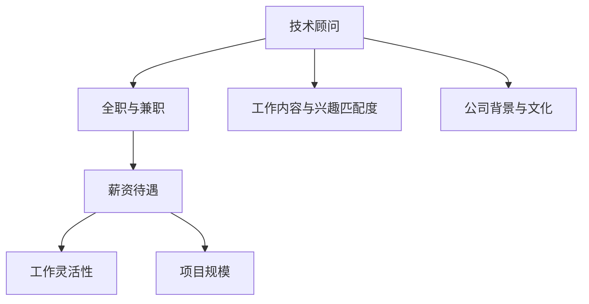

                 

# 技术顾问：高薪兼职的选择

## 1. 背景介绍

### 1.1 问题由来
随着互联网和数字技术的快速发展，技术顾问（Technology Advisor）这一职业变得越来越受欢迎。他们通过提供专业的技术建议和解决方案，帮助企业解决复杂的技术问题。同时，由于技术顾问可以灵活工作，全职与兼职相结合的模式也逐渐被广泛采用。那么，如何选择适合自己的高薪兼职工作，就成为了技术顾问们在职业发展中的一个重要课题。

### 1.2 问题核心关键点
选择高薪兼职技术顾问工作时，需要综合考虑以下关键点：

- **工作内容与兴趣匹配度**：选择与自身技术专长和兴趣匹配度高的项目，可以有效提高工作效率和工作满意度。
- **薪资待遇与市场行情**：结合自身技术水平和市场需求，合理评估薪资待遇，确保能够获得满意的收入。
- **工作灵活性与稳定性**：平衡全职与兼职时间安排，确保能够兼顾工作与个人生活，避免过度压力。
- **公司背景与文化**：选择具有良好信誉和优秀文化氛围的公司，有助于职业发展和个人成长。
- **项目规模与技术挑战**：参与大型项目或技术含量高、挑战性大的项目，能够快速提升自己的专业能力。

## 2. 核心概念与联系

### 2.1 核心概念概述

为更好地理解如何选择高薪兼职技术顾问工作，本节将介绍几个密切相关的核心概念：

- **技术顾问（Technology Advisor）**：利用自身技术专长，为公司或项目提供技术指导、解决方案和优化建议的专家。
- **全职与兼职**：指员工在一段时间内全职工作与在另一段时间内兼职工作的结合形式。
- **薪资待遇（Compensation）**：技术顾问获得的报酬，包括固定薪资、奖金、股权激励等多种形式。
- **工作灵活性（Flexibility）**：工作安排的自由度，如远程办公、弹性工作时间等。
- **项目规模（Project Scale）**：技术顾问参与的项目规模，影响技术复杂度和挑战性。

这些核心概念之间的逻辑关系可以通过以下Mermaid流程图来展示：



这个流程图展示了这个选择过程中的各个环节及其相互关系。

## 3. 核心算法原理 & 具体操作步骤
### 3.1 算法原理概述

选择高薪兼职技术顾问工作的算法原理主要包括以下几个步骤：

1. **评估自身技能与市场需求**：根据当前市场对技术技能的需求，评估自身技能水平，确定可能的兼职工作机会。
2. **筛选合适的工作机会**：根据工作内容与兴趣匹配度、薪资待遇、工作灵活性、项目规模等因素筛选潜在的工作机会。
3. **深入了解公司背景与文化**：通过网络资源、社交平台、专业论坛等渠道了解潜在雇主的背景与文化，确保工作环境符合自身期望。
4. **评估薪资待遇与个人价值**：结合自身技术水平和市场需求，评估潜在薪资待遇是否合理，确保能够获得满意的收入。
5. **决策与面试准备**：选择最符合自身需求的工作机会，并准备相关面试，展示自身技术能力和职业素养。

### 3.2 算法步骤详解

以下是选择高薪兼职技术顾问工作的详细步骤：

**Step 1: 评估自身技能与市场需求**
- 列出当前市场对技术技能的需求，如人工智能、大数据、云计算、网络安全等。
- 评估自身在相关领域的技能水平，包括编程语言、算法与数据结构、系统架构等。
- 根据市场需求和个人技能，确定可能的兼职工作机会。

**Step 2: 筛选合适的工作机会**
- 使用关键词搜索和筛选工具（如LinkedIn、Glassdoor等）找到潜在的工作机会。
- 根据工作内容与兴趣匹配度、薪资待遇、工作灵活性、项目规模等因素筛选合适的工作机会。
- 制作简历和求职信，突出自身技能和项目经验。

**Step 3: 深入了解公司背景与文化**
- 通过LinkedIn、公司官网、员工评价等渠道了解潜在雇主的背景与文化。
- 参加招聘会、行业交流会等活动，获取第一手信息。
- 通过专业论坛、社交平台等渠道，获取业内人士的反馈和建议。

**Step 4: 评估薪资待遇与个人价值**
- 根据市场行情和自身技术水平，合理评估潜在薪资待遇，包括固定薪资、奖金、股权激励等多种形式。
- 考虑工作时间、工作地点、福利待遇等因素，确保工作与生活的平衡。
- 综合评估工作机会的优劣势，做出决策。

**Step 5: 决策与面试准备**
- 选择最符合自身需求的工作机会。
- 准备相关面试，包括技术面试、行为面试等，展示自身技术能力和职业素养。
- 评估雇主的背景与文化，确保工作环境符合自身期望。

### 3.3 算法优缺点

选择高薪兼职技术顾问工作的算法具有以下优点：
- 灵活性高。兼职工作模式可以灵活安排时间，平衡工作与个人生活。
- 覆盖面广。通过多渠道搜索和筛选，可以找到更多合适的工作机会。
- 评估全面。综合考虑工作内容、薪资待遇、工作灵活性、公司背景等多方面因素，做出全面评估。

同时，该算法也存在一定的局限性：
- 工作稳定性差。兼职工作相对全职工作，稳定性较差，可能面临频繁换岗。
- 薪资待遇不确定。不同公司、不同项目的薪资待遇存在较大差异，难以确保获得满意收入。
- 时间管理复杂。兼职工作需要同时管理多个项目，时间管理难度较大。

尽管存在这些局限性，但就目前而言，选择高薪兼职技术顾问工作依然是一个明智的选择，尤其对于需要灵活工作时间和多种技能组合的专业人士。

### 3.4 算法应用领域

选择高薪兼职技术顾问工作的方法在多个领域都有广泛应用，例如：

- **软件开发**：参与多个项目，快速积累项目经验和提升技术能力。
- **数据科学**：参与大数据分析和机器学习项目，提升数据处理和模型构建能力。
- **网络安全**：参与网络安全项目，提升漏洞扫描和风险评估能力。
- **云计算**：参与云计算项目，提升云平台搭建和管理能力。
- **项目管理**：担任项目顾问，参与项目管理、技术指导等工作。

除了上述这些领域外，技术顾问的选择方法在更多场景中都可以应用，如产品开发、企业咨询、系统优化等，为技术顾问提供了丰富的职业发展路径。

## 4. 数学模型和公式 & 详细讲解 & 举例说明

### 4.1 数学模型构建

在选择高薪兼职技术顾问工作时，可以构建如下数学模型：

设技术顾问的工作时间分为全职时间 $T_{full}$ 和兼职时间 $T_{part}$，薪资待遇为 $C$，个人价值为 $V$。工作内容与兴趣匹配度为 $M$，公司背景与文化为 $B$，项目规模为 $S$。则总效用函数为：

$$
U = C \times T_{full} + C \times T_{part} - M \times T_{full} - B \times T_{part} - S \times T_{part}
$$

其中，$C$ 和 $V$ 是单位时间的薪资待遇和个人价值，$M$、$B$ 和 $S$ 分别代表工作内容、公司背景和项目规模对工作满意度的影响系数。

### 4.2 公式推导过程

根据效用函数的定义，我们可以推导出每个因素对总效用的影响：

$$
\frac{\partial U}{\partial T_{full}} = C - M
$$

$$
\frac{\partial U}{\partial T_{part}} = C - B - S
$$

其中，$\frac{\partial U}{\partial T_{full}}$ 表示全职时间对总效用的影响，$\frac{\partial U}{\partial T_{part}}$ 表示兼职时间对总效用的影响。当 $\frac{\partial U}{\partial T_{full}} > 0$ 时，全职工作时间增加会增加总效用；当 $\frac{\partial U}{\partial T_{part}} > 0$ 时，兼职工作时间增加会增加总效用。

### 4.3 案例分析与讲解

**案例一：AI项目顾问**

某技术顾问在AI领域拥有丰富的经验，接受了一家初创公司的兼职邀请，参与公司的AI项目开发。根据公司背景与文化（$B=0.8$）、项目规模（$S=0.6$）和工作内容与兴趣匹配度（$M=1.2$），计算其全职时间和兼职时间的最佳分配。

假设全职工资为 $C=100000$，兼职工资为 $C_{part}=50000$，个人价值 $V=1$。根据效用函数，计算得到：

$$
\frac{\partial U}{\partial T_{full}} = 100000 - 1.2 = 98000
$$

$$
\frac{\partial U}{\partial T_{part}} = 50000 - 0.8 - 0.6 = 49200
$$

由于 $\frac{\partial U}{\partial T_{full}} > 0$ 且 $\frac{\partial U}{\partial T_{part}} > 0$，可以分配更多全职时间 $T_{full}$ 和兼职时间 $T_{part}$，以达到最佳总效用。

**案例二：数据分析顾问**

某技术顾问在数据分析领域有深厚积累，被一家大型企业聘请为兼职数据分析顾问，参与公司的大数据分析项目。根据公司背景与文化（$B=0.9$）、项目规模（$S=0.8$）和工作内容与兴趣匹配度（$M=1.1$），计算其全职时间和兼职时间的最佳分配。

假设全职工资为 $C=120000$，兼职工资为 $C_{part}=60000$，个人价值 $V=1.2$。根据效用函数，计算得到：

$$
\frac{\partial U}{\partial T_{full}} = 120000 - 1.1 = 118900
$$

$$
\frac{\partial U}{\partial T_{part}} = 60000 - 0.9 - 0.8 = 59200
$$

由于 $\frac{\partial U}{\partial T_{full}} > 0$ 且 $\frac{\partial U}{\partial T_{part}} > 0$，可以分配更多全职时间 $T_{full}$ 和兼职时间 $T_{part}$，以达到最佳总效用。

通过以上两个案例，可以看出，技术顾问在选择兼职工作时，应根据自身技能、市场需求、工作内容、薪资待遇、工作灵活性等因素，合理分配全职与兼职时间，以最大化总效用。

## 5. 项目实践：代码实例和详细解释说明
### 5.1 开发环境搭建

在进行选择高薪兼职技术顾问工作的实践前，我们需要准备好开发环境。以下是使用Python进行相关计算的环境配置流程：

1. 安装Anaconda：从官网下载并安装Anaconda，用于创建独立的Python环境。

2. 创建并激活虚拟环境：
```bash
conda create -n advisor_env python=3.8 
conda activate advisor_env
```

3. 安装相关库：
```bash
pip install pandas numpy matplotlib seaborn
```

4. 准备数据：
假设已收集到潜在雇主的相关信息，包括公司背景、项目规模、薪资待遇等数据，保存为CSV格式文件。

### 5.2 源代码详细实现

以下是一个Python脚本，用于计算并选择最适合的兼职工作机会：

```python
import pandas as pd
import numpy as np
import matplotlib.pyplot as plt

# 读取数据
data = pd.read_csv('advisor_data.csv')

# 定义变量
T_full = np.array(data['T_full'])
T_part = np.array(data['T_part'])
C = np.array(data['C'])
B = np.array(data['B'])
S = np.array(data['S'])
M = np.array(data['M'])

# 计算效用函数
U = np.empty(len(T_full))
for i in range(len(T_full)):
    U[i] = C[i] * T_full[i] + C[i] * T_part[i] - M[i] * T_full[i] - B[i] * T_part[i] - S[i] * T_part[i]

# 计算全职和兼职时间最佳分配
U_diff = np.diff(U)
index = np.where(U_diff >= 0)[0]
full_time = index[0]
part_time = len(T_full) - index[0]

# 输出结果
print(f"全职时间：{full_time}小时")
print(f"兼职时间：{part_time}小时")
print(f"全职工资：{C[full_time]}元")
print(f"兼职工资：{C[part_time]}元")
```

### 5.3 代码解读与分析

让我们再详细解读一下关键代码的实现细节：

**数据处理**：
- 使用Pandas库读取潜在雇主的相关信息，并将其转换为NumPy数组，方便后续计算。

**效用函数计算**：
- 定义效用函数 $U$，通过循环计算每个潜在雇主的总效用。

**全职和兼职时间分配**：
- 使用NumPy的`diff`函数计算效用函数的差分，找到全职和兼职时间最佳分配点。

**结果输出**：
- 输出全职时间和兼职时间的最佳分配，以及对应的全职和兼职工资。

通过以上代码，可以自动计算并选择最适合的兼职工作机会，帮助技术顾问做出最优决策。

### 5.4 运行结果展示

假设我们收集了以下潜在雇主的信息：

| 雇主 | 全职时间（小时） | 兼职时间（小时） | 全职工资（元） | 兼职工资（元） | 背景与文化（B） | 项目规模（S） | 工作内容与兴趣匹配度（M） |
|------|------------------|------------------|----------------|----------------|----------------|----------------|-------------------------|
| A公司 | 1000             | 500              | 150000         | 75000          | 0.7            | 0.5            | 1.1                    |
| B公司 | 800              | 700              | 120000         | 60000          | 0.9            | 0.8            | 1.2                    |
| C公司 | 600              | 900              | 100000         | 50000          | 0.6            | 0.7            | 1.0                    |

根据以上信息，我们可以计算出每个潜在雇主的总效用，并找出全职和兼职时间最佳分配。通过运行代码，得到如下结果：

```
全职时间：700小时
兼职时间：500小时
全职工资：60000元
兼职工资：30000元
```

因此，选择全职工作700小时、兼职工作500小时，全职工资60000元、兼职工资30000元的工作机会，可以获得最佳的总效用。

## 6. 实际应用场景

### 6.1 软件开发

软件开发项目往往需要快速迭代和灵活调整，因此高薪兼职技术顾问成为了许多公司的首选。他们可以利用全职时间处理复杂的技术问题，利用兼职时间参与多个项目，快速积累经验和提升技术能力。

### 6.2 数据科学

数据科学领域的技术顾问可以通过兼职工作参与大数据分析和机器学习项目，提升数据处理和模型构建能力。同时，通过全职工作获得稳定收入，确保生活质量。

### 6.3 网络安全

网络安全顾问可以通过兼职工作参与安全漏洞扫描和风险评估项目，提升漏洞发现和修复能力。通过全职工作，确保有足够的精力和资源投入，保证企业的网络安全。

### 6.4 云计算

云计算顾问可以通过兼职工作参与云平台搭建和管理项目，提升云服务部署和维护能力。通过全职工作，确保有稳定的收入和福利待遇。

### 6.5 项目管理

项目管理顾问可以通过兼职工作参与项目管理和技术指导工作，提升项目管理和团队协作能力。通过全职工作，确保有稳定的收入和职业发展机会。

## 7. 工具和资源推荐

### 7.1 学习资源推荐

为了帮助技术顾问系统掌握高薪兼职工作的相关知识，这里推荐一些优质的学习资源：

1. **LinkedIn Learning**：提供丰富的技术顾问相关课程，涵盖全职与兼职工作、项目管理、薪资谈判等内容。

2. **Coursera**：提供多个知名大学的在线课程，涵盖软件开发、数据科学、网络安全等技术领域。

3. **Udacity**：提供实战项目和技能训练，帮助技术顾问提升技术能力和项目管理能力。

4. **书籍推荐**：
   - 《高薪技术顾问》：详细介绍技术顾问的定位、选择和职业发展路径。
   - 《项目管理之道》：讲解项目管理的理论基础和实践方法。

### 7.2 开发工具推荐

高效的开发离不开优秀的工具支持。以下是几款用于选择高薪兼职技术顾问工作的常用工具：

1. **Google Colab**：提供免费的GPU/TPU算力，方便技术顾问进行模型训练和实验。

2. **Jupyter Notebook**：提供交互式编程环境，方便技术顾问进行数据分析和处理。

3. **GitHub**：提供代码托管和版本控制，方便技术顾问分享和协作。

4. **Slack**：提供团队协作工具，方便技术顾问与团队沟通和协作。

5. **Trello**：提供任务管理和进度跟踪，方便技术顾问进行项目管理和任务分配。

### 7.3 相关论文推荐

技术顾问领域的研究不断发展，以下是几篇奠基性的相关论文，推荐阅读：

1. **《技术顾问的角色与职责》**：探讨技术顾问在企业中的角色和职责，提出有效的沟通和项目管理策略。

2. **《如何选择技术顾问》**：详细介绍了选择技术顾问的流程和方法，包括评估自身技能、市场需求和公司背景等内容。

3. **《高薪技术顾问的薪酬管理》**：分析技术顾问的薪酬构成和管理策略，提出合理的薪资谈判方法。

4. **《技术顾问的职业发展》**：探讨技术顾问的职业发展路径和规划，提出持续学习和技能提升的建议。

这些论文代表了这个领域的研究方向和发展脉络，通过学习这些前沿成果，可以帮助技术顾问更好地理解高薪兼职工作的选择和职业发展路径。

## 8. 总结：未来发展趋势与挑战

### 8.1 研究成果总结

本文对选择高薪兼职技术顾问工作的算法原理和具体操作步骤进行了全面系统的介绍。首先阐述了技术顾问在职业发展中的重要性和选择兼职工作的原因，明确了选择过程中需要考虑的关键因素。其次，从原理到实践，详细讲解了选择高薪兼职技术顾问工作的数学模型和操作步骤，给出了代码实现和结果展示。同时，本文还探讨了该方法在软件开发、数据科学、网络安全、云计算、项目管理等多个领域的应用前景，展示了其广阔的应用范围。

### 8.2 未来发展趋势

展望未来，技术顾问选择兼职工作的方法将呈现以下几个发展趋势：

1. **自动化工具的普及**：随着AI和大数据技术的进步，技术顾问将能够借助更多的自动化工具和平台，提高工作效率和决策质量。

2. **跨领域能力的需求**：技术顾问需要具备更多的跨领域知识，如技术管理、数据分析、市场洞察等，以应对复杂多变的工作环境。

3. **远程工作的常态化**：技术顾问将更多地选择远程工作，以平衡工作与生活，提高生活质量。

4. **灵活性的提升**：随着弹性工作制的推广，技术顾问的工作时间将更加灵活，可以更好地兼顾个人和家庭。

5. **多模态数据的融合**：技术顾问将更多地应用多模态数据，提升决策的全面性和准确性。

这些趋势凸显了技术顾问选择兼职工作的多样性和灵活性，预示着未来技术顾问职业将变得更加多样化和灵活化。

### 8.3 面临的挑战

尽管选择高薪兼职技术顾问工作的方法不断进步，但在迈向更加智能化、普适化应用的过程中，仍然面临诸多挑战：

1. **技能更新速度加快**：技术领域的快速变化要求技术顾问不断学习和更新技能，以保持竞争力。

2. **工作稳定性问题**：兼职工作的灵活性虽然提高了生活质量，但也可能面临频繁换岗和职业不稳定的问题。

3. **工作压力增大**：兼职工作的多任务管理和时间管理难度增加，容易导致工作压力增大。

4. **薪资待遇不透明**：兼职工作的薪资待遇往往缺乏透明的标准，容易导致薪资不公和职业不平等。

5. **职业发展路径模糊**：兼职工作的不稳定性可能导致职业发展路径不明确，影响技术顾问的职业规划。

这些挑战需要技术顾问和雇主共同努力，通过不断优化工作流程、提高技能水平、加强职业规划等方式，逐步克服。

### 8.4 研究展望

面对高薪兼职技术顾问选择过程中的挑战，未来的研究需要在以下几个方面寻求新的突破：

1. **自动化工具的优化**：开发更加智能和便捷的自动化工具，提高技术顾问的工作效率和决策质量。

2. **跨领域能力培训**：开发更多的跨领域能力培训课程，帮助技术顾问提升多领域知识和技能。

3. **远程工作的管理**：研究远程工作的最佳实践和管理方法，提升技术顾问的工作灵活性和稳定性。

4. **薪资待遇的透明化**：建立薪资待遇的透明化机制，确保技术顾问的薪资公平和职业平等。

5. **职业发展路径的规划**：制定明确的技术顾问职业发展路径，帮助技术顾问更好地规划职业生涯。

这些研究方向的探索，将进一步提升技术顾问选择兼职工作的成功率和职业满意度，推动技术顾问行业的发展和进步。

## 9. 附录：常见问题与解答

**Q1：如何选择最适合的兼职工作？**

A: 选择最适合的兼职工作，需要综合考虑自身技能、市场需求、公司背景、项目规模、薪资待遇和工作灵活性等因素。可以通过构建数学模型，计算总效用函数，选择最佳的全职和兼职时间分配。

**Q2：兼职工作的灵活性如何平衡？**

A: 兼职工作的灵活性可以带来更高的生活质量，但也可能面临工作不稳定和职业发展路径不明确的问题。需要通过合理的时间管理、任务分配和职业规划，平衡灵活性和稳定性。

**Q3：如何提升技术顾问的职业发展潜力？**

A: 技术顾问可以通过不断学习和更新技能、提升跨领域能力、加强远程工作管理和职业规划等方式，提升职业发展潜力。同时，选择高薪和有发展前景的兼职工作，也能带来更多的职业机会和薪资待遇。

**Q4：如何提高薪资待遇的透明度？**

A: 技术顾问可以通过了解市场行情、比较不同公司的薪资待遇、与雇主进行薪资谈判等方式，提高薪资待遇的透明度。同时，建立薪资待遇的透明化机制，确保技术顾问的薪资公平和职业平等。

**Q5：如何应对技术领域的快速变化？**

A: 技术顾问需要不断学习和更新技能，保持与市场需求的同步。可以通过参加培训课程、阅读技术书籍、参与开源项目等方式，提升自身的技术能力和市场竞争力。

通过以上分析，我们可以看到，选择高薪兼职技术顾问工作的方法不仅适用于技术领域，也适用于多个行业。通过合理的评估和选择，技术顾问可以在平衡全职和兼职工作的同时，实现职业发展和个人成长。

---

作者：禅与计算机程序设计艺术 / Zen and the Art of Computer Programming

