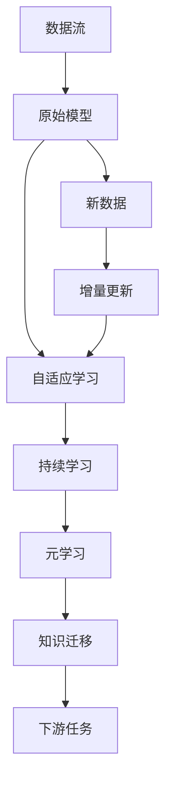

                 

# 持续学习：如何让AI模型不断进化

> 关键词：持续学习, 自适应学习, 增量学习, 增量更新, 元学习, 动态模型, 模型更新, 模型优化

## 1. 背景介绍

### 1.1 问题由来
在当今瞬息万变的数字世界中，人工智能(AI)模型面临着前所未有的数据和环境挑战。无论是金融市场的动态波动、医疗行业的技术进展，还是教育领域的最新研究成果，都需要AI模型能够实时地进行学习和适应。传统机器学习模型虽然可以很好地完成静态数据下的任务，但无法处理数据不断更新的动态环境，导致模型在实际应用中表现不佳。因此，如何在变化的环境中，让AI模型持续更新和优化，成为一个迫切需要解决的问题。

### 1.2 问题核心关键点
持续学习是指AI模型在应用过程中，能够不断地从新数据中学习，同时保持已有的知识和技能。其核心在于：
- 动态更新：模型能够根据新数据实时调整内部参数，更新知识。
- 适应性：模型能够自适应新数据分布，不因环境变化而失去原有能力。
- 泛化能力：模型能够在新场景下泛化应用，适应多样化的任务和数据。

目前，持续学习已经成为一个热门的研究方向，被广泛应用于金融、医疗、教育、推荐系统等多个领域。然而，实际应用中持续学习仍面临诸多挑战，如模型复杂度、数据多样性、计算资源等。如何构建高效、鲁棒的持续学习系统，成为了当前AI研究的一个重要课题。

### 1.3 问题研究意义
持续学习旨在使AI模型具备自我提升和适应新环境的能力，这对于提升模型的实时性、稳定性和智能水平具有重要意义：

1. **实时性**：持续学习模型能够在数据实时流入时，即时更新模型参数，快速响应新变化，减少等待时间。
2. **稳定性**：模型通过动态更新，避免了因环境变化带来的性能衰退，保持了系统稳定运行。
3. **智能性**：持续学习模型能够不断吸收新知识，提升在复杂、多变环境下的智能决策能力。
4. **成本节约**：减少了对全量数据再训练的需求，降低了计算和存储成本，提高了模型部署效率。
5. **用户体验**：通过实时反馈和适应，持续学习模型能够提供更加个性化、动态的服务，提升用户满意度。

## 2. 核心概念与联系

### 2.1 核心概念概述

为更好地理解持续学习的原理和实现，本节将介绍几个关键概念：

- **持续学习(Continual Learning)**：指AI模型在应用过程中，不断从新数据中学习，同时保持对已有知识的记忆和利用。
- **自适应学习(Adaptive Learning)**：指模型根据输入数据自适应调整内部参数，以更好地适应新数据分布。
- **增量学习(Incremental Learning)**：指模型在原有知识的基础上，通过逐步更新学习新知识，无需重新训练。
- **增量更新(Online Learning)**：指模型根据新数据不断更新内部参数，适用于实时流数据的环境。
- **元学习(Meta-Learning)**：指模型通过学习如何在不同任务上快速适应和迁移，提升学习效率。

这些核心概念之间有密切的联系，通过合理设计算法和模型架构，可以将它们组合起来，构建高效、灵活的持续学习系统。

### 2.2 核心概念原理和架构的 Mermaid 流程图



这个流程图展示了持续学习的核心流程：
1. 数据流：输入新数据。
2. 原始模型：原有预训练模型或部分微调的模型。
3. 新数据：当前环境中的新数据。
4. 增量更新：模型根据新数据实时更新参数。
5. 自适应学习：模型动态调整内部参数，以更好地适应新数据分布。
6. 持续学习：模型不断从新数据中学习，同时保持对已有知识的记忆。
7. 元学习：模型学习如何快速适应不同任务，提高学习效率。
8. 知识迁移：模型在不同任务之间迁移应用已有知识，提升泛化能力。

通过这些核心概念，我们可以构建一个灵活、高效的持续学习系统，使其能够在不断变化的环境中进行有效的学习和适应。

## 3. 核心算法原理 & 具体操作步骤
### 3.1 算法原理概述

持续学习算法的核心思想是通过不断地接收新数据，对模型参数进行增量更新，使其能够适应新的数据分布。其基本流程包括：
1. 选择合适的模型架构和损失函数。
2. 根据新数据，计算损失函数梯度。
3. 使用梯度下降等优化算法更新模型参数。
4. 在更新过程中，采用正则化、剪枝等方法，避免模型过拟合和灾难性遗忘。

在实际应用中，持续学习算法可以采用不同的策略进行增量更新，如在线学习、增量训练、增量微调等，具体选择取决于数据的特性和任务的复杂度。

### 3.2 算法步骤详解

以下是持续学习算法的一般步骤：

**Step 1: 数据准备**
- 准备持续学习所需的数据流，包括原始数据和增量数据。
- 根据任务类型，选择合适的数据集和标签。
- 对数据进行预处理，如归一化、特征提取等。

**Step 2: 模型初始化**
- 选择或构建一个合适的模型架构，如神经网络、支持向量机等。
- 根据任务需求，设置模型的超参数，如学习率、批量大小等。

**Step 3: 增量更新**
- 在每次接收到新的数据后，计算损失函数梯度。
- 使用优化算法更新模型参数。
- 定期对模型进行正则化和剪枝，防止过拟合和遗忘。

**Step 4: 模型评估**
- 定期在验证集或测试集上评估模型性能。
- 使用评价指标，如准确率、F1-score等，监控模型表现。
- 根据评估结果调整模型参数和训练策略。

**Step 5: 知识迁移**
- 将模型在不同任务间进行迁移，提升泛化能力。
- 使用元学习等技术，提高模型在新任务上的适应性。
- 引入迁移学习策略，如知识蒸馏、权重共享等，加速模型收敛。

### 3.3 算法优缺点

持续学习算法具有以下优点：
1. 实时性：能够实时处理新数据，快速响应环境变化。
2. 自适应：模型能够动态调整，适应新数据分布。
3. 泛化能力：模型在多样化的任务和数据中表现出较高的泛化能力。
4. 成本节约：减少了对全量数据再训练的需求，降低了计算和存储成本。

同时，该算法也存在一些局限性：
1. 计算开销：实时更新模型参数需要较高的计算资源，尤其是在大规模数据集上。
2. 模型退化：长时间未更新的数据可能会导致模型遗忘，影响性能。
3. 参数量限制：对于参数量巨大的模型，增量更新可能遇到内存和计算上的限制。
4. 数据多样性：不同来源的数据可能存在分布差异，影响模型一致性。
5. 迁移难度：模型在不同任务间的迁移可能存在困难，需要额外设计迁移策略。

尽管存在这些局限性，持续学习仍然是一个极具潜力的研究领域，尤其在实时性和自适应性要求较高的场景中，能够提供显著的优势。

### 3.4 算法应用领域

持续学习算法在多个领域具有广泛的应用前景，包括但不限于：

1. **金融风控**：金融机构需要实时监控市场风险，持续学习算法能够快速适应新数据，及时发现风险信号。
2. **医疗诊断**：医疗领域数据量大且变化快，持续学习算法能够动态更新模型，提升诊断准确性和时效性。
3. **智能推荐**：推荐系统需要根据用户行为实时调整推荐策略，持续学习算法能够不断优化，提升推荐效果。
4. **智能客服**：智能客服系统需要实时理解用户需求，持续学习算法能够动态调整模型，提供更好的用户体验。
5. **自动驾驶**：自动驾驶系统需要实时感知环境变化，持续学习算法能够不断优化模型，提升安全性。
6. **安全监控**：安全监控系统需要实时识别威胁，持续学习算法能够动态调整模型，提高防范能力。

以上领域只是持续学习应用的一小部分，随着算法和技术的不断发展，其应用场景将越来越广泛。

## 4. 数学模型和公式 & 详细讲解  
### 4.1 数学模型构建

假设我们有 $K$ 个任务，每个任务的数据分布为 $p_k(x)$，模型的参数为 $\theta$。持续学习的目标是在每次接收到新数据 $x_k$ 后，对模型参数 $\theta$ 进行更新，使其能够适应新任务 $k$。

定义损失函数 $\ell_k(\theta; x_k)$ 为模型在新数据 $x_k$ 上的损失。在增量学习过程中，模型的更新策略为：

$$
\theta_{k+1} = \theta_k - \eta \nabla_{\theta}\ell_k(\theta_k; x_k)
$$

其中 $\eta$ 为学习率，$\nabla_{\theta}\ell_k(\theta_k; x_k)$ 为损失函数对参数 $\theta_k$ 的梯度，通过反向传播计算得到。

### 4.2 公式推导过程

以下是增量学习算法中梯度更新的详细推导：

1. 假设当前数据 $x_k$ 来自新任务 $k$，模型在新数据上的损失为 $\ell_k(\theta_k; x_k)$。
2. 计算损失函数对模型参数 $\theta_k$ 的梯度：
   $$
   \nabla_{\theta_k} \ell_k(\theta_k; x_k) = \frac{\partial \ell_k(\theta_k; x_k)}{\partial \theta_k}
   $$
3. 根据梯度下降算法，更新模型参数：
   $$
   \theta_k \leftarrow \theta_k - \eta \nabla_{\theta_k} \ell_k(\theta_k; x_k)
   $$
4. 在新任务 $k+1$ 到来时，重复上述步骤，更新模型参数：
   $$
   \theta_{k+1} = \theta_k - \eta \nabla_{\theta_k} \ell_k(\theta_k; x_k)
   $$

这个公式展示了增量学习的基本流程，即在每次接收到新数据时，通过计算损失函数梯度，更新模型参数，实现增量更新。

### 4.3 案例分析与讲解

以推荐系统为例，展示持续学习算法在实际应用中的具体实现。

假设推荐系统需要实时推荐商品给用户，每个用户的历史行为数据和当前行为数据分别记为 $(x_i, y_i)$，模型参数为 $\theta$。在每次接收到新的用户行为数据后，模型更新如下：

1. 假设当前数据 $(x_i, y_i)$ 来自新用户 $i$，新用户的商品偏好预测为 $y_i = f_{\theta}(x_i)$。
2. 计算模型在新用户数据上的损失：
   $$
   \ell_i(\theta; x_i, y_i) = -(y_i \log f_{\theta}(x_i)) + (1-y_i) \log (1-f_{\theta}(x_i))
   $$
3. 计算损失函数对模型参数 $\theta$ 的梯度：
   $$
   \nabla_{\theta} \ell_i(\theta; x_i, y_i) = \frac{\partial \ell_i(\theta; x_i, y_i)}{\partial \theta}
   $$
4. 使用梯度下降算法更新模型参数：
   $$
   \theta \leftarrow \theta - \eta \nabla_{\theta} \ell_i(\theta; x_i, y_i)
   $$

在每次接收到新的用户行为数据后，模型都会根据新的数据更新参数，以更好地适应用户行为变化，提高推荐效果。

## 5. 项目实践：代码实例和详细解释说明
### 5.1 开发环境搭建

在进行持续学习实践前，我们需要准备好开发环境。以下是使用Python进行TensorFlow开发的环境配置流程：

1. 安装Anaconda：从官网下载并安装Anaconda，用于创建独立的Python环境。

2. 创建并激活虚拟环境：
```bash
conda create -n tensorflow-env python=3.8 
conda activate tensorflow-env
```

3. 安装TensorFlow：根据CUDA版本，从官网获取对应的安装命令。例如：
```bash
conda install tensorflow==2.6
```

4. 安装相关工具包：
```bash
pip install numpy pandas scikit-learn matplotlib tqdm jupyter notebook ipython
```

完成上述步骤后，即可在`tensorflow-env`环境中开始持续学习实践。

### 5.2 源代码详细实现

这里我们以金融风控系统为例，展示如何使用TensorFlow进行增量学习。

首先，定义金融风控数据集：

```python
import tensorflow as tf
from tensorflow.keras.preprocessing.image import ImageDataGenerator
from tensorflow.keras.models import Sequential
from tensorflow.keras.layers import Conv2D, MaxPooling2D, Flatten, Dense

# 准备训练和验证数据集
train_data = ImageDataGenerator(rescale=1./255)
train_generator = train_data.flow_from_directory(train_dir, target_size=(img_height, img_width), batch_size=batch_size)
val_data = ImageDataGenerator(rescale=1./255)
val_generator = val_data.flow_from_directory(val_dir, target_size=(img_height, img_width), batch_size=batch_size)
```

然后，定义持续学习模型：

```python
# 初始化模型
model = Sequential()
model.add(Conv2D(32, kernel_size=(3, 3), activation='relu', input_shape=(img_height, img_width, 3)))
model.add(MaxPooling2D(pool_size=(2, 2)))
model.add(Flatten())
model.add(Dense(64, activation='relu'))
model.add(Dense(1, activation='sigmoid'))

# 编译模型
model.compile(optimizer='adam', loss='binary_crossentropy', metrics=['accuracy'])

# 初始化参数
epoch = 0
steps_per_epoch = 100
loss = 0
acc = 0
```

接着，进行增量学习：

```python
# 定义增量学习函数
def incremental_learning(model, generator, num_epochs, batch_size):
    for i in range(num_epochs):
        steps = 0
        for batch in generator:
            # 计算损失和准确率
            loss_batch, acc_batch = model.train_on_batch(batch[0], batch[1])
            loss += loss_batch
            acc += acc_batch
            steps += 1
            # 每轮训练后输出损失和准确率
            if steps % steps_per_epoch == 0:
                print(f'Epoch {i+1}, Loss: {loss/steps}, Acc: {acc/steps}')
                loss = 0
                acc = 0
    return model
```

最后，启动持续学习流程：

```python
# 调用增量学习函数
model = incremental_learning(model, train_generator, epochs, batch_size)
```

以上就是使用TensorFlow进行金融风控系统增量学习的完整代码实现。可以看到，TensorFlow通过定义`ImageDataGenerator`和`flow_from_directory`方法，简化了数据预处理的过程，同时通过`train_on_batch`方法实现增量更新，非常直观和易于使用。

### 5.3 代码解读与分析

让我们再详细解读一下关键代码的实现细节：

**ImageDataGenerator类**：
- 定义数据预处理，包括图像缩放、归一化等操作。
- 生成批次化数据流，方便模型进行训练。

**Sequential模型**：
- 定义多层神经网络模型，包括卷积层、池化层、全连接层等。
- 使用`compile`方法指定优化器、损失函数和评估指标。

**incremental_learning函数**：
- 定义增量学习流程，对每个epoch接收到的批次数据进行前向传播和反向传播。
- 使用`train_on_batch`方法更新模型参数，同时记录损失和准确率。
- 每轮训练后输出损失和准确率，监控模型表现。

**持续学习流程**：
- 定义轮数和批次大小，开始循环迭代。
- 每个epoch内，对每个批次数据进行训练，输出损失和准确率。
- 持续接收新数据，不断更新模型参数，实现增量学习。

可以看到，TensorFlow提供的功能和工具使得持续学习实践变得简单易行，开发人员可以专注于算法设计和模型调优，而不必过多关注底层实现细节。

当然，工业级的系统实现还需考虑更多因素，如超参数调优、模型评估、日志记录等。但核心的增量学习流程基本与此类似。

## 6. 实际应用场景
### 6.1 智能推荐系统

智能推荐系统需要实时接收用户行为数据，动态调整推荐策略，持续学习算法能够很好地满足这一需求。通过增量更新模型参数，推荐系统能够快速适应用户行为变化，提升推荐效果。

例如，电商平台可以根据用户浏览、点击、购买等行为，实时更新推荐模型，动态调整商品推荐列表，提高用户满意度。这种实时化的推荐策略，使得电商平台的推荐系统能够更好地满足用户需求，提升销售转化率。

### 6.2 实时监控系统

实时监控系统需要实时感知环境变化，持续学习算法能够动态更新模型，及时响应新数据。

例如，安防系统可以通过摄像头实时捕捉到异常行为，并动态调整模型参数，提高异常检测准确性。智能家居系统可以根据用户的实时操作和环境变化，动态调整智能设备运行策略，提升用户体验。

### 6.3 金融风控系统

金融风控系统需要实时监控市场风险，持续学习算法能够动态更新模型，及时发现风险信号。

例如，银行可以实时分析客户的交易行为，动态调整信用评估模型，降低风险。保险公司可以根据客户的健康记录，动态更新保费计算模型，提升理赔效率。

### 6.4 医疗诊断系统

医疗诊断系统需要实时接收患者数据，动态调整诊断模型，持续学习算法能够很好地满足这一需求。

例如，医疗影像诊断系统可以根据新的病例数据，动态更新诊断模型，提高诊断准确性。智能健康监测系统可以根据用户的健康数据，动态调整健康管理策略，提升健康管理效果。

### 6.5 教育推荐系统

教育推荐系统需要根据学生的学习行为，动态调整推荐策略，持续学习算法能够很好地满足这一需求。

例如，在线教育平台可以根据学生的学习数据，动态调整学习内容推荐，提高学习效果。智能教育系统可以根据学生的学习进度和反馈，动态调整教学策略，提升教育质量。

## 7. 工具和资源推荐
### 7.1 学习资源推荐

为了帮助开发者系统掌握持续学习算法，这里推荐一些优质的学习资源：

1. Coursera《Machine Learning》课程：由斯坦福大学教授Andrew Ng开设的机器学习课程，深入浅出地介绍了持续学习的基本概念和算法。

2. TensorFlow官方文档：提供详细的TensorFlow API和示例代码，帮助开发者快速上手持续学习项目。

3. Google Colab：谷歌推出的在线Jupyter Notebook环境，免费提供GPU/TPU算力，方便开发者快速实验新模型。

4. Kaggle：全球最大的数据科学竞赛平台，提供丰富的数据集和模型竞赛，帮助开发者提升持续学习技能。

5. AI Challenger：国内领先的人工智能竞赛平台，涵盖多个人工智能竞赛领域，提供持续学习算法的实际应用场景。

通过这些资源的学习实践，相信你一定能够快速掌握持续学习算法，并用于解决实际的AI问题。

### 7.2 开发工具推荐

高效的开发离不开优秀的工具支持。以下是几款用于持续学习开发的常用工具：

1. TensorFlow：由Google主导开发的开源深度学习框架，支持增量学习、在线学习等功能，是进行持续学习任务开发的利器。

2. PyTorch：由Facebook主导开发的开源深度学习框架，灵活性高，支持增量更新和动态模型。

3. Weights & Biases：模型训练的实验跟踪工具，可以记录和可视化模型训练过程中的各项指标，方便对比和调优。

4. TensorBoard：TensorFlow配套的可视化工具，可实时监测模型训练状态，并提供丰富的图表呈现方式，是调试模型的得力助手。

5. Google Colab：谷歌推出的在线Jupyter Notebook环境，免费提供GPU/TPU算力，方便开发者快速实验新模型。

合理利用这些工具，可以显著提升持续学习任务的开发效率，加快创新迭代的步伐。

### 7.3 相关论文推荐

持续学习技术的发展源于学界的持续研究。以下是几篇奠基性的相关论文，推荐阅读：

1. Incremental Learning in Deep Neural Networks: An Overview and Survey：综述了增量学习的基本概念、方法和应用，是了解增量学习的重要文献。

2. Continual Learning with Priority Queue-based Memory for Deep Neural Networks：提出了一种基于优先队列的记忆增量学习算法，显著提高了模型在持续学习中的性能。

3. Online Passive-Aggressive Meta-Learning for Continual Adaptive Selection：提出了一种在线被动式元学习算法，能够自适应地选择最优任务，提升持续学习效率。

4. Fast Adaptive Incremental Learning for NLP Tasks：提出了一种快速增量学习算法，适用于自然语言处理任务，提高了模型在持续学习中的适应性和泛化能力。

5. Continual Learning through Incremental Hypothesis Adaptation：提出了一种增量假设适应算法，使得模型能够在动态环境中持续更新，保持高性能。

这些论文代表了大规模持续学习技术的发展脉络。通过学习这些前沿成果，可以帮助研究者把握学科前进方向，激发更多的创新灵感。

## 8. 总结：未来发展趋势与挑战

### 8.1 总结

本文对持续学习算法进行了全面系统的介绍。首先阐述了持续学习的背景和意义，明确了其在实时性和自适应性要求较高的场景中的独特价值。其次，从原理到实践，详细讲解了持续学习的基本流程和关键步骤，给出了持续学习任务开发的完整代码实例。同时，本文还广泛探讨了持续学习算法在多个领域的应用前景，展示了其在现实世界中的广泛应用。此外，本文精选了持续学习技术的各类学习资源，力求为读者提供全方位的技术指引。

通过本文的系统梳理，可以看到，持续学习算法已经在多个领域展现出了其强大的能力，推动了人工智能技术的不断进步。未来，随着技术的发展和应用场景的不断扩展，持续学习必将在更多领域中发挥重要作用，进一步提升人工智能系统的智能水平和实时性。

### 8.2 未来发展趋势

展望未来，持续学习技术将呈现以下几个发展趋势：

1. **实时性增强**：持续学习系统将更加注重实时性，能够在毫秒级别处理数据，快速响应环境变化。

2. **自适应性提升**：模型将具备更高的自适应能力，能够动态调整内部参数，适应多样化的数据分布。

3. **泛化能力提高**：模型将在跨任务、跨领域中表现出更强的泛化能力，提高在不同环境下的应用效果。

4. **增量更新优化**：增量更新算法将不断优化，提高模型更新的效率和精度，降低计算和存储成本。

5. **元学习深化**：元学习技术将更加成熟，能够帮助模型更好地适应新任务，提升学习效率。

6. **知识迁移增强**：知识迁移策略将更加灵活，提高模型在不同任务间的迁移效果，增强泛化能力。

7. **多模态融合**：持续学习系统将更加注重多模态数据的融合，提升在视觉、语音等不同模态中的适应能力。

以上趋势展示了持续学习技术的未来方向，这些方向的探索发展，必将进一步提升持续学习系统的智能水平和实时性，推动人工智能技术在更多领域中实现突破。

### 8.3 面临的挑战

尽管持续学习技术已经取得了一定的进展，但在实际应用中仍面临诸多挑战：

1. **计算开销**：持续学习需要实时更新模型参数，对计算资源提出了较高的要求，尤其是在大规模数据集上。

2. **模型退化**：长时间未更新的数据可能会导致模型遗忘，影响性能。

3. **数据多样性**：不同来源的数据可能存在分布差异，影响模型一致性。

4. **迁移难度**：模型在不同任务间的迁移可能存在困难，需要额外设计迁移策略。

5. **模型复杂度**：参数量巨大的模型，增量更新可能遇到内存和计算上的限制。

6. **过拟合问题**：增量学习模型容易过拟合新数据，导致泛化性能下降。

尽管存在这些挑战，持续学习技术的发展仍具有广阔前景。通过不断优化算法和设计，这些挑战有望逐步克服，推动持续学习技术的不断进步。

### 8.4 研究展望

面对持续学习所面临的诸多挑战，未来的研究需要在以下几个方面寻求新的突破：

1. **优化增量更新算法**：改进增量更新算法，提高模型更新的效率和精度，降低计算和存储成本。

2. **增强自适应能力**：提高模型的自适应能力，动态调整内部参数，适应新数据分布。

3. **提升泛化能力**：通过元学习和知识迁移，增强模型在不同任务间的泛化能力。

4. **融合多模态数据**：构建多模态持续学习系统，提升在视觉、语音等不同模态中的适应能力。

5. **引入神经网络结构**：结合神经网络结构和元学习技术，提高模型在动态环境中的性能和稳定性。

6. **优化参数高效方法**：开发参数高效持续学习算法，在固定大部分预训练参数的情况下，只更新极少量的任务相关参数。

7. **引入对抗训练**：通过对抗训练，提高模型的鲁棒性和泛化能力，防止过拟合和灾难性遗忘。

8. **引入增量模型**：设计增量模型，能够在实时环境中高效更新，避免全量训练的资源消耗。

这些研究方向的探索，必将引领持续学习技术迈向更高的台阶，为构建智能、灵活、高效的持续学习系统提供新的思路和方案。面向未来，持续学习技术还需要与其他人工智能技术进行更深入的融合，共同推动人工智能技术的发展。

## 9. 附录：常见问题与解答

**Q1：持续学习是否适用于所有场景？**

A: 持续学习适用于需要实时响应的场景，如推荐系统、实时监控系统、智能客服等。但对于一些静态、稳定且不需要实时更新的任务，如数据标注、静态文本分类等，持续学习可能并不是最佳选择。

**Q2：持续学习如何应对大规模数据集？**

A: 对于大规模数据集，可以使用分布式训练、GPU/TPU等高性能设备，以及增量更新算法，优化计算开销。同时，可以通过引入对抗训练、剪枝等策略，防止模型过拟合和遗忘。

**Q3：持续学习如何防止模型遗忘？**

A: 可以通过定期的模型迁移、知识蒸馏、增量训练等策略，防止模型遗忘旧知识。同时，可以设计增量更新算法，逐步更新模型参数，确保模型在不断更新中仍能保持原有知识。

**Q4：持续学习如何在不同任务间迁移知识？**

A: 可以通过元学习、知识蒸馏、权重共享等策略，提高模型在不同任务间的迁移效果。同时，可以设计适应性较强的模型架构，如深度神经网络，使得模型在不同任务间的迁移更加灵活。

**Q5：持续学习如何处理多模态数据？**

A: 可以设计多模态的增量学习算法，如将视觉数据和文本数据同时输入模型，动态更新模型参数。同时，可以引入多模态特征融合技术，提升模型在不同模态中的适应能力。

**Q6：持续学习如何优化计算开销？**

A: 可以使用分布式训练、GPU/TPU等高性能设备，以及增量更新算法，优化计算开销。同时，可以通过剪枝、神经网络结构优化等策略，降低模型的参数量和计算复杂度。

通过这些常见问题的解答，可以看到持续学习算法在实际应用中面临的挑战和解决方案，有助于开发者更好地理解和应用持续学习技术。

---

作者：禅与计算机程序设计艺术 / Zen and the Art of Computer Programming

