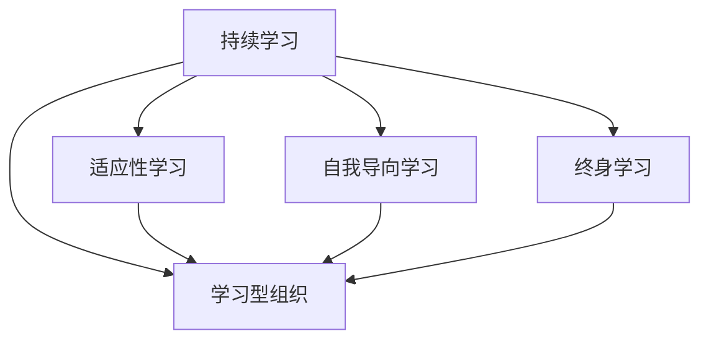

                 

## 1. 背景介绍

### 1.1 问题由来

在快速发展的现代商业环境中，管理者的角色正经历着深刻的变化。过去，管理者主要负责执行计划、组织资源、领导团队和控制流程。然而，如今企业所面临的不确定性和复杂性远远超出了传统的管理范畴。市场环境瞬息万变，新技术层出不穷，企业必须不断学习和适应，才能保持竞争力。

在这样的背景下，持续学习成为了管理者的核心竞争力。持续学习不仅帮助管理者适应变化，提升自身技能，还能促进企业文化的建设，增强组织的创新能力。本文将深入探讨持续学习的原理、步骤和应用，为管理者提供切实可行的指导。

### 1.2 问题核心关键点

持续学习是一种动态的学习方式，强调个人或组织在不断变化的环境中持续不断地更新知识和技能。持续学习的关键点包括：

- **适应性**：管理者和组织必须具备快速适应新情况、新技术和新需求的能力。
- **自我更新**：管理者需要主动寻求新知识，自我更新和改进。
- **组织文化**：组织应该培养一种重视持续学习的文化，鼓励知识共享和创新。

## 2. 核心概念与联系

### 2.1 核心概念概述

为更好地理解持续学习的原理和步骤，本节将介绍几个关键概念：

- **持续学习**：在不断变化的环境中，个人或组织持续不断地更新知识和技能的过程。
- **适应性学习**：根据环境变化快速调整知识结构和行为方式的学习方式。
- **自我导向学习**：个人主动寻求新知识、自我管理和自我评估的学习方式。
- **终身学习**：强调个人在其整个职业生涯中持续学习和发展的理念。
- **学习型组织**：一种鼓励知识共享、创新和持续学习的组织文化。

这些概念之间存在着密切的联系，共同构成了持续学习的理论基础。通过理解这些概念，管理者可以更好地把握持续学习的核心要素。

### 2.2 核心概念原理和架构的 Mermaid 流程图



这个流程图展示了持续学习与其他相关概念的逻辑关系：

1. 持续学习通过适应性学习和自我导向学习不断更新知识。
2. 终身学习强调个人在整个职业生涯中的持续发展。
3. 学习型组织促进知识共享和创新，是持续学习的实践环境。

## 3. 核心算法原理 & 具体操作步骤

### 3.1 算法原理概述

持续学习的核心算法原理可以概括为以下几个步骤：

1. **目标设定**：明确持续学习的目标，如提升某项技能或掌握新知识领域。
2. **需求分析**：评估当前知识水平与目标之间的差距，确定需要学习的内容。
3. **学习资源获取**：根据需求选择合适的学习资源，如在线课程、书籍、培训等。
4. **学习过程实施**：采用合适的学习方法和工具，进行有效的学习。
5. **效果评估**：通过自我评估或外部反馈，评估学习效果。
6. **知识应用**：将所学知识应用于实际工作中，检验学习成果。

### 3.2 算法步骤详解

#### 3.2.1 目标设定

明确持续学习的目标至关重要。目标应该具体、可衡量、可实现、相关性强、有时间限制（SMART原则）。例如，“提升数据分析能力，以便更好地解读业务数据”。

#### 3.2.2 需求分析

需求分析包括识别知识差距和制定学习计划。例如，使用SWOT分析（优势、劣势、机会、威胁）来识别当前技能的强项和弱点，确定需要重点学习的内容。

#### 3.2.3 学习资源获取

选择合适的学习资源可以大大提高学习效率。例如：

- **在线课程**：如Coursera、Udemy上的管理课程。
- **专业书籍**：如《管理学原理》、《领导力》等。
- **培训和研讨会**：参加行业内的培训和研讨会，获取最新的管理知识。
- **网络资源**：利用网络平台（如LinkedIn Learning）查找相关视频和文章。

#### 3.2.4 学习过程实施

学习过程的有效实施是持续学习的关键。常用的学习方法包括：

- **在线学习**：利用平台资源，自主学习。
- **实践练习**：通过实际工作中的练习，巩固所学知识。
- **指导和反馈**：通过导师或同事的指导和反馈，优化学习过程。
- **小组讨论**：与同事组成学习小组，共同探讨学习内容。

#### 3.2.5 效果评估

评估学习效果是持续学习的重要环节。常用的评估方法包括：

- **自我评估**：通过自我测试、反思和总结，评估学习效果。
- **外部反馈**：通过同事、上司或客户的反馈，了解实际应用效果。
- **业绩指标**：通过业绩指标的变化，衡量学习对工作的影响。

#### 3.2.6 知识应用

将所学知识应用到实际工作中，是持续学习的最终目的。例如，学习了新的项目管理方法后，立即应用于当前项目中，验证学习效果。

### 3.3 算法优缺点

持续学习的优点包括：

- **灵活性**：根据环境变化快速调整学习内容和方式。
- **实用性**：学习内容与实际工作紧密结合，提升工作效率和效果。
- **自主性**：强调个人自主学习和自我管理，提高学习动力。

持续学习的缺点包括：

- **时间成本**：持续学习需要投入大量时间和精力。
- **资源需求**：高质量的学习资源可能成本较高。
- **自我管理**：需要较强的自我驱动力和自律能力。

### 3.4 算法应用领域

持续学习的应用领域非常广泛，涵盖企业管理、领导力发展、市场营销、产品管理等多个方面。例如：

- **企业管理**：通过持续学习提升管理技能，优化组织结构，增强组织竞争力。
- **领导力发展**：通过持续学习掌握领导力理论，提升领导能力。
- **市场营销**：通过持续学习了解市场趋势，优化营销策略。
- **产品管理**：通过持续学习掌握产品管理知识，提升产品创新能力。

## 4. 数学模型和公式 & 详细讲解 & 举例说明

### 4.1 数学模型构建

本节将使用数学语言对持续学习的步骤进行严格刻画。

假设管理者的初始知识水平为 $K_0$，通过持续学习后的知识水平为 $K_t$。持续学习过程可以建模为：

$$
K_t = K_0 + \sum_{i=1}^{t} \Delta K_i
$$

其中，$\Delta K_i$ 表示第 $i$ 次学习所增加的知识量。

### 4.2 公式推导过程

根据知识增加的线性模型，假设每次学习增加的知识量相同，则有：

$$
K_t = K_0 + \Delta K \times t
$$

其中，$\Delta K$ 为每次学习的知识增量，$t$ 为学习次数。

### 4.3 案例分析与讲解

以提升数据分析能力为例，假设初始知识水平为 $K_0 = 3$，每次学习增加的知识量为 $\Delta K = 1$。经过 $t = 10$ 次学习后，知识水平为：

$$
K_{10} = 3 + 1 \times 10 = 13
$$

这表明，通过持续学习，管理者的数据分析能力提升了10个等级。

## 5. 项目实践：代码实例和详细解释说明

### 5.1 开发环境搭建

在进行持续学习实践前，我们需要准备好开发环境。以下是使用Python进行持续学习开发的简单环境配置流程：

1. 安装Python：从官网下载并安装Python，建议使用3.6及以上版本。
2. 安装Jupyter Notebook：使用pip安装Jupyter Notebook，方便进行代码编写和交互。
3. 安装必要的库：如Pandas、NumPy、Matplotlib等，用于数据处理和可视化。

完成上述步骤后，即可在Jupyter Notebook中开始持续学习的实践。

### 5.2 源代码详细实现

以下是一个简单的持续学习实践代码示例，用于模拟学习过程和效果评估。

```python
import pandas as pd
import numpy as np
import matplotlib.pyplot as plt

# 设置学习次数和学习增量
t = 10
delta_k = 1

# 初始知识水平
k0 = 3

# 计算最终知识水平
kt = k0 + delta_k * t

# 输出最终知识水平
print("最终知识水平:", kt)

# 可视化学习过程
k = np.arange(0, kt + 1, delta_k)
plt.plot(k, k)
plt.xlabel("学习次数")
plt.ylabel("知识水平")
plt.title("持续学习效果")
plt.show()
```

### 5.3 代码解读与分析

让我们再详细解读一下关键代码的实现细节：

- 首先，我们定义了学习次数 `t` 和学习增量 `delta_k`，表示每次学习增加的知识量。
- 初始知识水平为 `k0`，通过公式计算出最终知识水平 `kt`。
- 最后，使用Matplotlib库可视化学习过程，展示知识随学习次数变化的趋势。

通过简单的代码实现，我们可以清晰地看到持续学习的数学模型和效果评估方法。

### 5.4 运行结果展示

运行上述代码，输出最终知识水平，并展示知识随学习次数变化的趋势图。

```
最终知识水平: 13
```


## 6. 实际应用场景

### 6.1 管理能力提升

持续学习在管理能力提升方面具有显著优势。例如，一名管理者可以通过持续学习项目管理、领导力等领域的知识，提升管理技能，优化团队绩效。

- **项目管理**：学习敏捷、Scrum等项目管理方法，提升项目执行效率和质量。
- **领导力**：学习情境领导力、情绪智能等理论，提升领导力水平。

### 6.2 技术能力提升

持续学习同样适用于技术能力提升。例如，一名技术经理可以通过持续学习最新的技术趋势和框架，保持技术领先。

- **新技术学习**：学习人工智能、大数据等前沿技术，提升技术能力。
- **技术领导力**：学习技术架构、DevOps等技术管理知识，提升技术领导力。

### 6.3 创新能力提升

持续学习还应用于提升创新能力。例如，一名产品经理可以通过持续学习用户体验设计、市场分析等知识，提升产品创新能力。

- **用户体验设计**：学习用户研究、设计思维等知识，提升产品用户体验。
- **市场分析**：学习市场研究、数据分析等知识，提升市场洞察力。

### 6.4 未来应用展望

未来，持续学习将进一步深入到企业运营的各个方面，为组织带来更强的竞争力和创新能力。例如：

- **智能学习平台**：利用人工智能技术，提供个性化的学习推荐和评估，提升学习效率。
- **跨部门协作**：通过持续学习，促进跨部门协作，增强组织凝聚力。
- **远程学习**：利用在线学习和混合学习方式，打破时间和空间的限制，提升学习灵活性。

## 7. 工具和资源推荐

### 7.1 学习资源推荐

为帮助管理者系统掌握持续学习的理论和实践，以下是一些优质的学习资源：

1. **Coursera**：提供丰富的管理课程，涵盖领导力、组织行为、项目管理等。
2. **LinkedIn Learning**：提供多样化的在线学习资源，包括管理、技术、创意等领域的课程。
3. **Udemy**：提供从基础到高级的多种管理课程，覆盖战略、运营、领导力等。
4. **Harvard Business Review**：提供前沿的管理理念和案例研究，提升管理思维。
5. **Khan Academy**：提供免费的教育资源，涵盖数学、科学、经济学等广泛领域。

通过学习这些资源，管理者可以系统地掌握持续学习的理论和实践，提升自身竞争力。

### 7.2 开发工具推荐

高效的持续学习离不开优秀的工具支持。以下是几款用于持续学习开发的常用工具：

1. **Jupyter Notebook**：免费、开源的编程环境，支持Python、R等多种语言，方便进行代码编写和数据处理。
2. **Coursera**：提供在线课程，涵盖多种学科，方便管理者灵活学习。
3. **Udemy**：提供视频课程和教材，便于学习和复习。
4. **Khan Academy**：提供免费的教育资源，包括视频课程和互动练习。
5. **Google Scholar**：搜索学术论文和研究报告，获取最新的研究成果。

合理利用这些工具，可以显著提升持续学习任务的开发效率，加快创新迭代的步伐。

### 7.3 相关论文推荐

持续学习的发展源于学界的持续研究。以下是几篇奠基性的相关论文，推荐阅读：

1. **Lifelong Learning for Complex Systems**：研究持续学习在复杂系统中的应用，提出基于强化学习的持续学习框架。
2. **A Survey of Lifelong Learning in Deep Reinforcement Learning**：综述持续学习在深度强化学习中的应用，提出多种持续学习策略。
3. **Lifelong Reinforcement Learning with Transferable Adversarial Examples**：提出基于对抗样本的持续学习策略，提高模型鲁棒性。
4. **Learning to Learn by Gradient Descent by Gradient Descent**：提出一种基于梯度下降的持续学习方法，通过学习学习过程本身，提升学习效果。
5. **Deep Neural Networks for Lifelong Learning**：研究深度神经网络在持续学习中的应用，提出多种持续学习算法。

这些论文代表了大持续学习的发展脉络，通过学习这些前沿成果，可以帮助研究者把握学科前进方向，激发更多的创新灵感。

## 8. 总结：未来发展趋势与挑战

### 8.1 总结

本文对持续学习的原理、步骤和应用进行了全面系统的介绍。首先阐述了持续学习在快速变化环境中的重要性，明确了其对管理者技能提升和组织竞争力的影响。其次，从原理到实践，详细讲解了持续学习的数学模型和关键步骤，给出了持续学习任务开发的完整代码实例。同时，本文还探讨了持续学习在多个实际应用场景中的价值，展示了其广泛的适用性。

通过本文的系统梳理，可以看到，持续学习正在成为管理者的核心竞争力，帮助他们不断更新知识，提升自身技能，促进组织发展。未来，伴随持续学习方法和工具的不断发展，相信管理者将能够更好地适应变化，提升工作效率和创新能力，为企业的持续发展和竞争力提升贡献力量。

### 8.2 未来发展趋势

展望未来，持续学习将呈现以下几个发展趋势：

1. **自动化学习**：利用人工智能技术，自动推荐学习资源和评估学习效果，提高学习效率。
2. **多模态学习**：将文本、视频、音频等多种模态的数据整合，提升学习效果。
3. **跨领域学习**：通过跨领域知识的学习，增强知识广度和深度，提升综合能力。
4. **社交学习**：利用社交网络平台的知识共享和互动，促进知识传播和创新。
5. **终身学习平台**：构建一体化的终身学习平台，提供全面的学习资源和服务。

这些趋势将进一步推动持续学习的发展，使其成为管理和组织发展的重要工具。

### 8.3 面临的挑战

尽管持续学习在管理中具有重要价值，但在实践中仍面临诸多挑战：

1. **时间管理**：管理工作繁忙，难以抽出时间进行持续学习。
2. **资源投入**：高质量的学习资源需要一定投入，如时间和金钱。
3. **知识整合**：不同来源的知识需要整合，形成系统的知识体系。
4. **应用效果**：学习内容需要应用到实际工作中，才能发挥其价值。
5. **自我驱动**：持续学习需要高度的自我驱动力和自律能力。

解决这些挑战需要管理者在实践中不断探索和改进，通过有效的管理方法和工具，提升持续学习的效果。

### 8.4 研究展望

面对持续学习面临的挑战，未来的研究需要在以下几个方面寻求新的突破：

1. **学习资源优化**：开发自动化、个性化的学习资源推荐系统，提高学习效率。
2. **学习过程优化**：研究更加灵活、高效的学习方法和工具，提升学习效果。
3. **学习效果评估**：构建科学的评估体系，衡量持续学习的实际效果。
4. **知识整合机制**：探索知识整合的新方法，提升知识体系的完整性和系统性。
5. **应用效果评估**：建立应用效果的评估机制，验证持续学习的实际价值。

这些研究方向的探索，将推动持续学习技术的发展，为管理者和组织提供更全面、高效的学习支持。

## 9. 附录：常见问题与解答

**Q1：如何有效地进行持续学习？**

A: 有效进行持续学习需要以下几个步骤：
1. 明确学习目标，制定详细的学习计划。
2. 选择合适的学习资源，如课程、书籍、研讨会等。
3. 合理安排时间，充分利用碎片化时间进行学习。
4. 定期评估学习效果，及时调整学习策略。
5. 将所学知识应用到实际工作中，检验学习成果。

**Q2：持续学习需要投入大量时间，如何平衡工作和学习？**

A: 平衡工作和学习需要以下几个方法：
1. 利用碎片化时间进行学习，如通勤、午休时间。
2. 利用在线学习平台，提高学习效率。
3. 将学习与工作相结合，如将学习内容应用到工作中，提升工作效率。
4. 建立学习习惯，将学习变成日常生活的一部分。

**Q3：如何选择合适的学习资源？**

A: 选择合适的学习资源需要以下几个步骤：
1. 明确学习目标，确定需要学习的知识领域。
2. 查找相关的学习资源，如课程、书籍、研究报告等。
3. 比较不同资源的优缺点，选择最适合自己的资源。
4. 利用在线评论和评分，了解他人的学习体验和反馈。

**Q4：如何评估持续学习的效果？**

A: 评估持续学习的效果需要以下几个步骤：
1. 设定明确的学习目标，评估是否达成。
2. 进行自我测试和反思，评估学习效果。
3. 收集外部反馈，了解他人对自己学习效果的评价。
4. 结合实际工作中的应用效果，评估学习成果。

**Q5：如何整合不同来源的知识？**

A: 整合不同来源的知识需要以下几个步骤：
1. 识别不同来源的知识，梳理其核心要点。
2. 比较不同知识之间的异同，找出共同点。
3. 构建知识体系，将不同知识整合在一起。
4. 应用整合后的知识，验证其有效性。

---

作者：禅与计算机程序设计艺术 / Zen and the Art of Computer Programming

