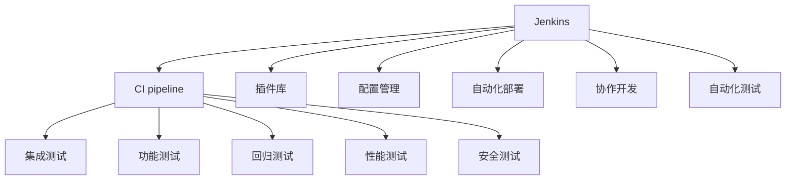

                 

# 持续集成工具：Jenkins 和 GitLab CI 的比较

> 关键词：持续集成, Jenkins, GitLab CI, DevOps, 自动化部署, 配置管理, 协作开发

## 1. 背景介绍

### 1.1 问题由来
随着软件开发的日益复杂和协作模式的不断演变，持续集成(Continuous Integration, CI)成为了软件开发中不可或缺的一部分。它通过自动化地构建、测试和部署软件代码，极大提高了开发效率和软件质量，帮助团队实现快速迭代和高效协作。

Jenkins和GitLab CI是目前市场上最为流行的两种持续集成工具。Jenkins，作为一款开源的持续集成服务器，有着悠久的历史和庞大的用户群体。而GitLab CI，则是作为GitLab项目的一部分，近年来迅速崛起，并在配置管理、协作开发等方面表现出卓越的优势。

本文将深入比较这两种工具的核心特性、优劣势以及应用场景，帮助开发者选择最适合自身需求的工具，以实现更加高效的软件开发和持续集成流程。

### 1.2 问题核心关键点
- **持续集成：** 通过自动化地构建、测试和部署代码，提升开发效率和软件质量。
- **Jenkins：** 开源的持续集成服务器，功能强大，灵活性高。
- **GitLab CI：** GitLab项目的一部分，专注于配置管理、协作开发，易于集成。
- **DevOps：** 一种文化和实践，倡导持续交付和持续集成，强调自动化和协作。

本文将重点探讨这两种工具在持续集成过程中的具体应用，帮助开发者掌握它们的优势和劣势，从而在实际开发中做出明智的决策。

## 2. 核心概念与联系

### 2.1 核心概念概述

为更好地理解Jenkins和GitLab CI，首先需要了解以下核心概念：

- **持续集成(Continuous Integration, CI)：** 一种软件开发实践，通过自动化地频繁集成和测试代码，提高软件交付速度和质量。
- **Jenkins：** 一款开源的持续集成服务器，提供丰富的插件和扩展性，适用于各种规模的项目。
- **GitLab CI：** GitLab项目的一部分，集成于GitLab代码管理平台，提供简便的配置管理和协作开发功能。
- **DevOps：** 一种以自动化、协作和持续交付为核心的软件开发文化，强调团队协同和高效协作。
- **自动化部署：** 通过自动化工具部署软件到生产环境，减少人为错误，提升部署效率。
- **配置管理：** 管理项目的环境配置和依赖关系，确保测试和部署环境的稳定一致。
- **协作开发：** 支持团队成员之间的代码合并、评论和反馈，提高协作效率和代码质量。

### 2.2 核心概念原理和架构的 Mermaid 流程图



上述流程图展示了Jenkins的核心功能架构，包括持续集成管道、插件库、配置管理、自动化部署、协作开发、自动化测试等关键模块。

对于GitLab CI，其架构同样基于持续集成管道，与Jenkins类似，但更注重配置管理、协作开发和集成功能的集成与统一。

## 3. 核心算法原理 & 具体操作步骤

### 3.1 算法原理概述

Jenkins和GitLab CI的原理主要基于持续集成管道和自动化工具链，通过自动化地执行构建、测试和部署步骤，减少人为干预，提升开发效率和软件质量。

具体来说，其流程包括以下几个步骤：

1. **代码提交**：开发者通过Git等版本控制工具将代码提交到仓库中。
2. **持续集成触发**：每当代码被提交到仓库时，持续集成服务器都会自动触发构建、测试和部署流程。
3. **构建**：构建工具如Maven、Gradle等编译代码，生成可执行的 artifact。
4. **测试**：自动化测试工具如JUnit、Selenium等执行单元测试、集成测试、功能测试等。
5. **部署**：部署工具如Jenkins、GitLab CI等将构建完成的 artifact 部署到生产环境。

### 3.2 算法步骤详解

#### Jenkins

1. **安装与配置**：在服务器上安装Jenkins，配置必要的插件和环境变量。
2. **定义任务**：创建构建、测试和部署任务，定义具体的构建脚本和测试脚本。
3. **配置触发器**：配置触发器的规则，如Git Hook、定时任务等。
4. **执行任务**：提交代码后，Jenkins会根据触发器的规则自动执行定义的任务。
5. **监控与报告**：监控任务的执行情况，生成报告和日志，帮助开发者诊断和优化问题。

#### GitLab CI

1. **创建项目**：在GitLab上创建项目，并启用CI配置。
2. **定义工作流程**：使用`.gitlab-ci.yml`文件定义持续集成工作流程，包括构建、测试和部署步骤。
3. **配置变量**：定义需要传递给工作流程的变量和参数。
4. **执行工作流程**：提交代码后，GitLab CI会根据`.gitlab-ci.yml`文件定义的工作流程自动执行。
5. **监控与报告**：通过GitLab的CI仪表板监控任务执行情况，生成报告和日志。

### 3.3 算法优缺点

#### Jenkins的优缺点

**优点**：

- 高度灵活：支持广泛的插件和扩展，满足各种复杂的需求。
- 社区支持：庞大的社区支持，丰富的插件和工具库，便于找到解决方案。
- 广泛适用：适用于各种规模和类型的项目。

**缺点**：

- 配置复杂：需要较多的手动配置和脚本编写，容易出错。
- 部署繁琐：手动部署和配置环境，增加了部署成本和复杂度。
- 学习曲线陡峭：初学者需要时间熟悉工具和插件的使用。

#### GitLab CI的优缺点

**优点**：

- 配置简便：通过`.gitlab-ci.yml`文件，配置和定义CI工作流程非常方便。
- 集成紧密：与GitLab项目紧密集成，支持代码审查、环境管理、CI仪表板等功能。
- 易于协作：支持多分支协作、代码合并和代码审查，提升协作效率。

**缺点**：

- 功能受限：相比于Jenkins，GitLab CI的功能相对有限，适用于中小型项目。
- 社区支持较少：虽然社区活跃，但与Jenkins相比，插件和工具库较为缺乏。
- 适用范围有限：更适合与GitLab结合使用，限制了在其他平台的应用。

### 3.4 算法应用领域

Jenkins和GitLab CI在实际应用中各有优势，适用于不同的场景和需求：

- **Jenkins**：适用于需要高度灵活和定制化配置的复杂项目，如大规模的企业级项目、跨平台的开发环境。
- **GitLab CI**：适用于与GitLab集成的项目，尤其是中小型项目和需要紧密协作的开发团队。

## 4. 数学模型和公式 & 详细讲解 & 举例说明

### 4.1 数学模型构建

持续集成流程可以抽象为一个数学模型，其中每个任务（构建、测试、部署等）都作为模型的步骤，每个步骤的执行和状态转移都可以用数学公式表示。

假设持续集成流程包含$n$个任务，每个任务的执行时间为$t_i$，任务$i$的执行状态为$s_i$，执行状态有$k$种（未执行、执行中、已执行），状态转移矩阵为$A$。则持续集成流程的数学模型可以表示为：

$$
\begin{bmatrix}
s_1 \\
s_2 \\
\vdots \\
s_n
\end{bmatrix}_A
= 
\begin{bmatrix}
1 & -1 & 0 \\
0 & 1 & -1 \\
\vdots & \vdots & \vdots \\
0 & 0 & 1
\end{bmatrix}
\begin{bmatrix}
s_1 \\
s_2 \\
\vdots \\
s_n
\end{bmatrix}
$$

其中，$A$矩阵中的元素$A_{ij}$表示任务$i$向任务$j$的状态转移概率。例如，$A_{11}=1$表示任务1是未执行状态，状态转移概率为1；$A_{12}=-1$表示任务1向任务2的状态转移概率为1，即任务1执行完毕。

### 4.2 公式推导过程

对于持续集成流程的数学模型，可以使用动态规划或蒙特卡洛模拟等方法进行推导和求解。以Jenkins为例，假设持续集成流程包含构建、测试和部署三个任务，每个任务执行时间为$t_1=10s$，$t_2=5s$，$t_3=10s$。则整个流程的执行时间$T$可以通过以下公式计算：

$$
T = t_1 + t_2 + t_3 = 25s
$$

对于每个任务，可以使用状态转移矩阵$A$来表示任务执行状态的变化。例如，构建任务执行完毕，测试任务才能开始执行，部署任务在测试通过后才能执行。则状态转移矩阵$A$可以表示为：

$$
A = \begin{bmatrix}
1 & -1 & 0 \\
0 & 1 & -1 \\
0 & 0 & 1
\end{bmatrix}
$$

这个矩阵的含义是：构建任务执行完毕（$s_1=1$），任务2才能执行；测试任务执行完毕（$s_2=1$），任务3才能执行。

### 4.3 案例分析与讲解

假设一个包含构建、测试和部署三个任务的项目，其执行时间分别为10s、5s和10s。我们希望在任务执行过程中最小化总执行时间，同时保证任务顺序正确。

使用状态转移矩阵$A$和任务执行时间$t$，我们可以计算出最小执行时间$T_{min}$和最优执行路径$s_{opt}$。例如，当构建任务执行完毕，立即进行测试，测试通过后进行部署，最小执行时间为$T_{min}=25s$。最优执行路径为$s_{opt}=[1, 2, 3]$，即构建、测试、部署。

通过数学模型和公式推导，我们可以清晰地理解持续集成流程的执行顺序和效率，为实际部署提供科学依据。

## 5. 项目实践：代码实例和详细解释说明

### 5.1 开发环境搭建

#### Jenkins

1. **安装Jenkins**：在服务器上安装Jenkins，可通过yum包管理工具进行安装，命令如下：

```bash
yum install Jenkins -y
```

2. **配置Jenkins**：通过Jenkins的Web界面配置基本设置，包括系统配置、用户管理、插件安装等。

#### GitLab CI

1. **创建项目**：在GitLab上创建项目，启用CI配置。
2. **定义工作流程**：在项目的`.gitlab-ci.yml`文件中定义持续集成工作流程，例如：

```yaml
stages:
  - build
  - test
  - deploy

build:
  stage: build
  script: 
    - echo "Building the artifact..."
    - mvn package

test:
  stage: test
  script:
    - echo "Running tests..."
    - mvn test

deploy:
  stage: deploy
  script:
    - echo "Deploying the artifact..."
    - mvn spring-boot:run
```

3. **配置变量**：在项目的`.gitlab-ci.yml`文件中定义需要传递给工作流程的变量和参数，例如：

```yaml
variables:
  JAVA_HOME: /usr/lib/jvm/java-8-openjdk
  MVN_OPTS: -Dmaven.ssh.user=your-username
```

### 5.2 源代码详细实现

#### Jenkins

1. **构建脚本**：创建一个Jenkinsfile文件，定义构建任务的步骤，例如：

```groovy
pipeline {
    agent any
    
    stages {
        stage('Build') {
            steps {
                echo "Building the artifact..."
                withMaven(maven: "mvn") {
                    sh 'mvn package'
                }
            }
        }
        stage('Test') {
            steps {
                echo "Running tests..."
                withMaven(maven: "mvn") {
                    sh 'mvn test'
                }
            }
        }
        stage('Deploy') {
            steps {
                echo "Deploying the artifact..."
                withMaven(maven: "mvn") {
                    sh 'mvn spring-boot:run'
                }
            }
        }
    }
}
```

2. **触发器配置**：配置触发器的规则，例如通过Git Hook触发构建，命令如下：

```groovy
pipeline {
    agent any
    
    stages {
        stage('Build') {
            steps {
                echo "Building the artifact..."
                withMaven(maven: "mvn") {
                    sh 'mvn package'
                }
            }
        }
        stage('Test') {
            steps {
                echo "Running tests..."
                withMaven(maven: "mvn") {
                    sh 'mvn test'
                }
            }
        }
        stage('Deploy') {
            steps {
                echo "Deploying the artifact..."
                withMaven(maven: "mvn") {
                    sh 'mvn spring-boot:run'
                }
            }
        }
    }
    post {
        always {
            echo 'Pipeline finished...'
        }
    }
}
```

#### GitLab CI

1. **定义工作流程**：在项目的`.gitlab-ci.yml`文件中定义持续集成工作流程，例如：

```yaml
stages:
  - build
  - test
  - deploy

build:
  stage: build
  script: 
    - echo "Building the artifact..."
    - mvn package

test:
  stage: test
  script:
    - echo "Running tests..."
    - mvn test

deploy:
  stage: deploy
  script:
    - echo "Deploying the artifact..."
    - mvn spring-boot:run
```

2. **配置变量**：在项目的`.gitlab-ci.yml`文件中定义需要传递给工作流程的变量和参数，例如：

```yaml
variables:
  JAVA_HOME: /usr/lib/jvm/java-8-openjdk
  MVN_OPTS: -Dmaven.ssh.user=your-username
```

### 5.3 代码解读与分析

#### Jenkins

1. **构建脚本**：通过Jenkinsfile文件定义构建任务的步骤，Jenkins会自动执行这些步骤，完成构建过程。
2. **触发器配置**：配置触发器的规则，通过Git Hook触发构建，每当有代码提交到仓库时，Jenkins就会自动执行构建任务。

#### GitLab CI

1. **定义工作流程**：通过`.gitlab-ci.yml`文件定义持续集成工作流程，每个步骤都按照顺序执行。
2. **配置变量**：定义需要传递给工作流程的变量和参数，用于测试和部署过程中。

### 5.4 运行结果展示

#### Jenkins

1. **构建结果**：构建脚本执行成功，生成`target`目录下的构建 artifact。
2. **测试结果**：测试脚本执行成功，输出测试报告和覆盖率统计。
3. **部署结果**：部署脚本执行成功，将 artifact 部署到生产环境。

#### GitLab CI

1. **构建结果**：构建脚本执行成功，生成`target`目录下的构建 artifact。
2. **测试结果**：测试脚本执行成功，输出测试报告和覆盖率统计。
3. **部署结果**：部署脚本执行成功，将 artifact 部署到生产环境。

## 6. 实际应用场景

### 6.1 智能测试环境

智能测试环境是软件开发过程中必不可少的环节，Jenkins和GitLab CI都可以实现持续集成，支持自动化测试和代码质量检查。

以Jenkins为例，可以配置多种测试工具，如JUnit、Selenium等，自动执行单元测试、集成测试、性能测试等，生成测试报告和覆盖率统计，帮助开发者快速定位和修复问题。

### 6.2 协作开发平台

协作开发平台是软件开发团队高效协作的重要工具，Jenkins和GitLab CI都可以与代码管理工具如GitLab、GitHub等紧密集成，支持代码审查、代码合并、代码评论等功能。

例如，GitLab CI可以自动执行代码审查任务，生成代码审查报告，帮助开发者提升代码质量。Jenkins则可以通过插件实现代码合并和代码评论，提升协作效率。

### 6.3 持续部署系统

持续部署系统是软件开发自动化中的一部分，Jenkins和GitLab CI都可以实现持续部署，支持自动化地将构建 artifact 部署到生产环境。

以Jenkins为例，可以通过插件配置持续部署流水线，自动执行构建、测试、部署等步骤，确保软件稳定可靠地发布到生产环境。GitLab CI则可以直接在GitLab上配置CI/CD流水线，将 artifact 自动部署到指定环境。

## 7. 工具和资源推荐

### 7.1 学习资源推荐

1. **Jenkins官方文档**：官方文档提供了详细的安装、配置和使用指南，是学习Jenkins的最佳资源。
2. **GitLab CI文档**：官方文档提供了CI/CD的工作流程、配置和实践指南，帮助开发者快速上手。
3. **DevOps在线课程**：如Udemy、Coursera等平台提供的DevOps在线课程，涵盖持续集成、自动化部署等主题。

### 7.2 开发工具推荐

1. **Jenkins**：功能强大、社区支持广泛，适用于各种规模和类型的项目。
2. **GitLab CI**：集成紧密、易于配置，适用于与GitLab集成的项目。
3. **Docker**：容器化技术，提供轻量级、可移植的应用部署方案，与Jenkins和GitLab CI无缝集成。

### 7.3 相关论文推荐

1. **《The Automated Configuration of DevOps Pipelines》**：探讨了DevOps持续集成和持续部署的自动化配置和管理方法。
2. **《Continuous Integration and Continuous Deployment: A Survey》**：对持续集成和持续部署技术的发展和应用进行了全面综述。
3. **《Pipeline as Code: The Revolution》**：介绍了Pipeline as Code的概念和实践，强调了CI/CD管道的代码化和自动化管理。

## 8. 总结：未来发展趋势与挑战

### 8.1 研究成果总结

本文对Jenkins和GitLab CI两种持续集成工具进行了全面的比较，总结了它们的核心特性、优劣势以及应用场景。通过比较，帮助开发者更好地理解这两种工具，并在实际开发中做出明智的决策。

### 8.2 未来发展趋势

1. **自动化程度提升**：未来持续集成工具将进一步提升自动化程度，减少人为干预，提高开发效率。
2. **持续交付成为主流**：持续交付将成为软件开发的主流模式，持续集成工具将与持续交付工具更加紧密集成。
3. **云化和容器化**：持续集成工具将更多地云化和容器化，提供更灵活、更高效的应用部署方案。
4. **集成更多功能**：持续集成工具将集成更多功能，如代码审查、环境管理、协作开发等，提升开发团队的协作效率。
5. **支持更多平台**：持续集成工具将支持更多平台和环境，实现跨平台、跨环境的持续集成和部署。

### 8.3 面临的挑战

1. **复杂性增加**：随着功能需求的增加，持续集成工具的配置和管理变得更加复杂，需要更多的技术积累和实践经验。
2. **性能瓶颈**：大规模项目的持续集成和部署可能面临性能瓶颈，需要优化工具的性能和资源利用效率。
3. **安全风险**：持续集成过程中涉及大量的代码提交和环境配置，可能面临安全风险，需要加强安全防护和监控。
4. **兼容性问题**：不同工具和平台之间的兼容性问题可能影响持续集成的稳定性，需要加强工具的兼容性和兼容性测试。
5. **成本问题**：持续集成工具的部署和维护需要一定的成本，需要合理规划和管理。

### 8.4 研究展望

1. **持续集成优化**：进一步优化持续集成工具的配置和管理，提升自动化程度和开发效率。
2. **持续交付探索**：探索持续交付的最佳实践，实现更加灵活和高效的自动化部署。
3. **跨平台集成**：实现跨平台、跨环境的持续集成和部署，提升工具的通用性和适应性。
4. **安全性提升**：加强持续集成过程中的安全防护，避免代码注入、环境泄露等安全风险。
5. **成本控制**：优化持续集成工具的部署和维护成本，实现更高效和经济的持续集成和部署。

## 9. 附录：常见问题与解答

**Q1：如何配置Jenkins触发器？**

A: Jenkins的触发器可以通过多种方式配置，如Git Hook、定时任务、Web Hook等。以Git Hook为例，可以在项目的仓库中配置一个`.git/hooks/post-commit`脚本，将Jenkins构建任务作为钩子，每当有代码提交时，Jenkins就会自动执行构建任务。

**Q2：如何在Jenkins中配置变量？**

A: 在Jenkins的`ConfigGlobal`中配置全局变量，或在每个构建任务中配置变量，在构建脚本中引用这些变量即可。

**Q3：GitLab CI的CI流水线如何设置分支策略？**

A: 在`.gitlab-ci.yml`文件中，通过`only:`和`except:`关键字设置分支策略，例如：

```yaml
only:
  - master
except:
  - feature/*

stages:
  - build
  - test
  - deploy
```

上述配置表示，只有`master`分支的代码提交才会触发构建、测试和部署任务，而`feature/*`分支的代码提交会被排除。

**Q4：GitLab CI的CI流水线如何设置变量？**

A: 在`.gitlab-ci.yml`文件中，通过`variables:`关键字定义需要传递给工作流程的变量和参数，例如：

```yaml
variables:
  JAVA_HOME: /usr/lib/jvm/java-8-openjdk
  MVN_OPTS: -Dmaven.ssh.user=your-username
```

上述配置表示，将`JAVA_HOME`和`MVN_OPTS`变量传递给CI流水线，用于测试和部署过程中。

**Q5：Jenkins和GitLab CI哪个更适合大型企业项目？**

A: Jenkins和GitLab CI都可以用于大型企业项目，但各有优势。Jenkins功能强大、灵活性高，适用于需要高度定制化配置的复杂项目。GitLab CI则集成紧密、易于配置，适用于与GitLab集成的项目。在大型企业项目中，可以选择两者结合使用，发挥各自的优势。

