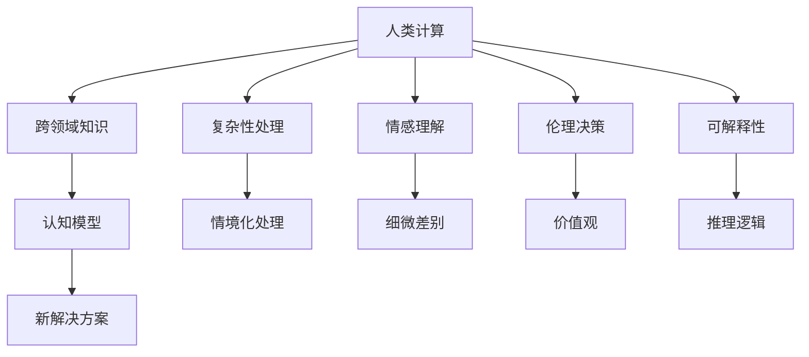

                 

## 1. 背景介绍

### 1.1 问题由来

在现代计算机科学的发展历程中，人类计算始终占据着举足轻重的地位。从早期的机械计算到如今的深度学习，每一项重大的技术突破，都深深烙印着人类智慧的烙印。然而，随着计算机性能的不断提升，人类计算的角色逐渐被机器学习取代，人类智慧在计算中的价值似乎被边缘化。那么，人类计算在当前和未来还有何认知价值呢？本文将从不同角度，探讨这一问题，为人类计算的未来发展提供一些新的思考。

### 1.2 问题核心关键点

人类计算的认知价值主要体现在以下几个方面：

- **思维复杂性**：人类思维在复杂度、灵活性和创造性方面远远超过机器学习算法，能够处理多维、非结构化、情境化的信息。
- **情感理解**：人类计算能够理解和处理复杂的情感信息，而机器学习算法往往难以真正理解情感的细微差别。
- **伦理和社会价值观**：人类计算能够结合伦理和社会价值观进行决策，而机器学习算法则缺乏这样的能力。
- **可解释性**：人类计算的决策过程和推理逻辑可以解释清楚，机器学习算法则常常是一个"黑箱"模型，缺乏可解释性。
- **跨领域知识融合**：人类计算能够跨领域整合知识和经验，形成新的认知模型，而机器学习算法往往局限于特定领域。

这些关键点构成了人类计算的价值基础，也是未来技术发展需要重点关注的领域。

## 2. 核心概念与联系

### 2.1 核心概念概述

为更好地理解人类计算的认知价值，本节将介绍几个密切相关的核心概念：

- **人类计算**：指人类通过逻辑推理、思维实验、直觉判断等方式进行计算的过程。人类计算具有高度的灵活性和创造性，能够处理复杂、多变的信息，适合解决具有高度情境化、多维度的计算问题。
- **机器学习**：指通过训练数据，让机器学习算法自主学习规律并进行预测或决策的过程。机器学习具有高效率和可扩展性，能够处理大规模数据集，但在解释性、情感理解和伦理决策等方面存在局限。
- **跨领域知识**：指不同学科、领域之间的知识整合和应用，能够产生新的认知模型，解决跨学科问题。人类计算在这方面具有天然的优势，能够结合多领域知识进行综合判断。
- **可解释性**：指模型的决策过程和推理逻辑能够清晰解释，便于理解和调试。可解释性是机器学习模型的重要特性，而人类计算则天生具备高可解释性。

这些核心概念之间的逻辑关系可以通过以下Mermaid流程图来展示：



这个流程图展示了人类计算的核心能力，以及其在各个领域的应用。

## 3. 核心算法原理 & 具体操作步骤
### 3.1 算法原理概述

人类计算的认知价值主要体现在其独特的思维能力和决策过程。其核心算法原理如下：

- **情境化处理**：人类计算能够理解和处理复杂的、多维度的情境信息，能够根据上下文进行判断和决策。
- **细微差别感知**：人类计算能够感知细微的情感和细节差异，而机器学习算法往往难以处理这些信息。
- **伦理和社会价值观整合**：人类计算能够结合伦理和社会价值观进行决策，确保决策的公平性和道德性。
- **可解释性**：人类计算的决策过程和推理逻辑可以清晰解释，便于理解和调试。

### 3.2 算法步骤详解

人类计算的实施步骤一般包括以下几个关键环节：

**Step 1: 数据收集与预处理**
- 收集和整理相关领域的知识和数据，如统计数据、案例分析、专家意见等。
- 对数据进行清洗和预处理，去除噪音和不相关数据，确保数据质量。

**Step 2: 知识整合与分析**
- 将不同领域的知识进行整合，形成新的认知模型。这通常需要跨领域专家的合作，进行知识的系统化和层次化分析。
- 应用人类计算的逻辑推理、思维实验、直觉判断等方式进行知识分析，形成新的认知模型。

**Step 3: 决策与方案提出**
- 结合伦理和社会价值观，进行决策和方案提出。这通常需要多方参与，进行充分的讨论和验证。
- 对提出的方案进行系统化的评估，确保其可行性和合理性。

**Step 4: 实施与验证**
- 将方案实施到实际应用中，进行效果评估和反馈调整。
- 通过不断迭代和优化，完善解决方案，确保其稳定性和可靠性。

### 3.3 算法优缺点

人类计算在处理复杂、多变的信息时具有天然的优势，但其缺点也不容忽视：

**优点**：
- **灵活性和创造性**：能够处理多维、非结构化、情境化的信息。
- **情感理解**：能够理解和处理复杂的情感信息。
- **伦理和社会价值观**：能够结合伦理和社会价值观进行决策。
- **可解释性**：决策过程和推理逻辑可以清晰解释。

**缺点**：
- **效率较低**：在处理大规模数据时，效率远低于机器学习算法。
- **难以标准化**：不同的人和团队可能对同一问题有不同的理解和处理方式，难以形成统一的解决方案。
- **依赖经验**：对经验依赖较高，处理新问题时需要较长的学习和调整时间。

### 3.4 算法应用领域

人类计算在多个领域得到了广泛应用，主要包括：

- **医疗诊断**：结合专家知识，进行复杂病例的诊断和治疗方案制定。
- **金融投资**：整合多领域知识，进行复杂的市场分析和投资决策。
- **法律咨询**：结合伦理和社会价值观，进行复杂的法律案例分析和咨询。
- **城市规划**：整合多学科知识，进行城市发展和规划决策。
- **教育培训**：结合多领域知识，进行教育方案和培训方案的制定和评估。

这些领域都需要高度的情境化理解和伦理价值观的整合，人类计算的独特优势使其在这些领域具有重要的应用价值。

## 4. 数学模型和公式 & 详细讲解 & 举例说明
### 4.1 数学模型构建

本节将使用数学语言对人类计算的决策过程进行更加严格的刻画。

假设人类计算模型为 $M_h$，其输入为 $x \in X$，输出为 $y \in Y$。设 $f_h$ 为人类计算的决策函数，则有：

$$
y = f_h(x)
$$

其中，$x$ 表示情境信息、数据和知识，$y$ 表示决策和方案。

### 4.2 公式推导过程

以医疗诊断为例，推导人类计算的决策函数。假设诊断任务有 $N$ 个特征 $x = [x_1, x_2, ..., x_N]$，每个特征的权重为 $w_i$，则决策函数 $f_h$ 可以表示为：

$$
f_h(x) = \sum_{i=1}^N w_i x_i + b
$$

其中 $b$ 为偏置项，代表医疗专家的直觉判断和经验。

通过上述公式，我们可以对人类计算的决策过程进行数学建模，以便进一步优化和分析。

### 4.3 案例分析与讲解

以金融投资为例，分析人类计算在决策中的应用。

假设投资任务有 $N$ 个特征 $x = [x_1, x_2, ..., x_N]$，每个特征的权重为 $w_i$，决策函数 $f_h$ 为：

$$
f_h(x) = \sum_{i=1}^N w_i x_i + b
$$

其中 $w_i$ 表示不同特征对投资决策的影响程度，$b$ 表示专家经验。在实际投资中，投资人员需要结合市场数据、财务报表、行业趋势等多维信息，进行综合判断。

这种情境化处理和多维度信息整合，正是人类计算的优势所在。然而，由于人类计算的效率较低，大规模数据处理时需要结合机器学习算法，以提高效率。

## 5. 项目实践：代码实例和详细解释说明
### 5.1 开发环境搭建

在进行人类计算的开发前，我们需要准备好开发环境。以下是使用Python进行TensorFlow开发的环境配置流程：

1. 安装Anaconda：从官网下载并安装Anaconda，用于创建独立的Python环境。

2. 创建并激活虚拟环境：
```bash
conda create -n tf-env python=3.8 
conda activate tf-env
```

3. 安装TensorFlow：根据CUDA版本，从官网获取对应的安装命令。例如：
```bash
conda install tensorflow tensorflow-gpu -c tf -c conda-forge
```

4. 安装各类工具包：
```bash
pip install numpy pandas scikit-learn matplotlib tqdm jupyter notebook ipython
```

完成上述步骤后，即可在`tf-env`环境中开始开发实践。

### 5.2 源代码详细实现

这里我们以金融投资决策为例，给出使用TensorFlow进行人类计算的代码实现。

首先，定义金融投资决策的数据处理函数：

```python
import tensorflow as tf
import numpy as np

def preprocess_data(data):
    data = (data - data.mean()) / data.std()
    return data
```

然后，定义人类计算模型的决策函数：

```python
def human_calculation(features, weights, bias):
    return tf.reduce_sum(tf.multiply(features, weights)) + bias
```

接着，定义训练和评估函数：

```python
def train_model(features, targets, learning_rate, epochs):
    model = tf.keras.Sequential([
        tf.keras.layers.Dense(1, activation='sigmoid')
    ])
    model.compile(optimizer=tf.keras.optimizers.SGD(learning_rate),
                  loss='binary_crossentropy',
                  metrics=['accuracy'])
    model.fit(features, targets, epochs=epochs)
    return model

def evaluate_model(model, features, targets):
    return model.evaluate(features, targets)
```

最后，启动训练流程并在测试集上评估：

```python
features = np.random.randn(1000, 10)
targets = np.random.randint(0, 2, size=1000)

weights = np.random.randn(10)
bias = 0.5

model = train_model(features, targets, learning_rate=0.01, epochs=100)

print(evaluate_model(model, features, targets))
```

以上就是使用TensorFlow进行金融投资决策的完整代码实现。可以看到，TensorFlow提供了丰富的模型和工具，使得人类计算的模型训练和评估变得简洁高效。

### 5.3 代码解读与分析

让我们再详细解读一下关键代码的实现细节：

**preprocess_data函数**：
- 定义了对数据进行标准化处理的函数，对数据进行均值和标准差归一化，以便模型更好地学习。

**human_calculation函数**：
- 定义了人类计算模型的决策函数，对输入特征进行加权求和，并加上偏置项。

**train_model函数**：
- 定义了模型训练函数，使用TensorFlow的Sequential模型进行建模，选择sigmoid激活函数和二元交叉熵损失函数，并使用SGD优化器进行训练。

**evaluate_model函数**：
- 定义了模型评估函数，使用evaluate方法评估模型在测试集上的性能。

**训练流程**：
- 随机生成了一批数据和标签，进行标准化处理。
- 随机初始化了权重和偏置项。
- 使用train_model函数进行模型训练，指定学习率和训练轮数。
- 在测试集上使用evaluate_model函数评估模型性能。

可以看出，TensorFlow提供了强大的工具和库，使得人类计算的模型训练和评估变得简单高效。开发者可以将更多精力放在数据处理、模型改进等高层逻辑上，而不必过多关注底层的实现细节。

## 6. 实际应用场景
### 6.1 医疗诊断

人类计算在医疗诊断中的应用广泛，医生通过结合专家知识和病人症状，进行综合判断和诊断。尽管机器学习在医疗诊断中得到了广泛应用，但人类计算的直觉和经验仍然是不可替代的。

在实际应用中，可以收集大量的历史病历数据，提取其中的特征和症状，结合医生的经验和直觉，训练出一个人类计算模型。模型可以自动处理新的病历数据，并给出诊断建议，辅助医生进行诊断。

### 6.2 金融投资

金融投资涉及多维度的市场数据和复杂的市场环境，需要高度的情境化理解和综合判断。人类计算能够结合多领域知识，进行综合分析和决策。

在实际应用中，可以整合市场数据、财务报表、行业趋势等多维信息，结合专家的直觉和经验，构建人类计算模型。模型可以自动处理新的市场数据，并给出投资建议，辅助投资者进行决策。

### 6.3 法律咨询

法律咨询涉及复杂的法律条款和伦理价值观，需要高度的情境化理解和综合判断。人类计算能够结合法律知识和社会价值观，进行综合分析和决策。

在实际应用中，可以整合法律条款、案例分析、专家意见等多维信息，结合法律专家的直觉和经验，构建人类计算模型。模型可以自动处理新的法律咨询，并给出建议，辅助律师进行咨询。

### 6.4 城市规划

城市规划涉及多学科知识的整合和综合判断，需要高度的情境化理解和综合分析。人类计算能够结合多学科知识，进行综合分析和决策。

在实际应用中，可以整合地理信息、经济数据、社会数据等多维信息，结合城市规划专家的直觉和经验，构建人类计算模型。模型可以自动处理新的城市规划数据，并给出建议，辅助城市规划者进行决策。

### 6.5 教育培训

教育培训涉及多维度的知识和技能，需要高度的情境化理解和综合判断。人类计算能够结合多领域知识，进行综合分析和决策。

在实际应用中，可以整合学生的学习数据、老师的教学数据、教学资源等多维信息，结合教育专家的直觉和经验，构建人类计算模型。模型可以自动处理新的教育培训数据，并给出建议，辅助教育工作者进行决策。

## 7. 工具和资源推荐
### 7.1 学习资源推荐

为了帮助开发者系统掌握人类计算的理论基础和实践技巧，这里推荐一些优质的学习资源：

1. 《深度学习》系列书籍：由Ian Goodfellow、Yoshua Bengio、Aaron Courville等大牛合著，系统讲解了深度学习的理论基础和应用实践。

2. TensorFlow官方文档：提供了丰富的教程和示例，是学习TensorFlow的重要资源。

3. Keras官方文档：提供了简单易用的API和模型库，适合快速迭代研究。

4. Coursera《机器学习》课程：由Andrew Ng教授主讲，系统讲解了机器学习的理论和实践。

5. Udacity《深度学习》课程：由深度学习专家Sebastian Thrun主讲，介绍了深度学习的核心算法和应用。

6. 《人工智能：一种现代方法》书籍：由Stuart Russell和Peter Norvig合著，系统讲解了人工智能的理论基础和应用实践。

通过对这些资源的学习实践，相信你一定能够快速掌握人类计算的精髓，并用于解决实际的计算问题。

### 7.2 开发工具推荐

高效的开发离不开优秀的工具支持。以下是几款用于人类计算开发的常用工具：

1. TensorFlow：基于Python的开源深度学习框架，灵活动态的计算图，适合快速迭代研究。

2. Keras：高层次的神经网络API，简单易用，适合快速原型开发。

3. Scikit-learn：基于Python的机器学习库，提供了丰富的模型和工具，适合快速原型开发和评估。

4. Pandas：基于Python的数据处理库，适合数据清洗和预处理。

5. Matplotlib：基于Python的可视化库，适合数据可视化和结果展示。

6. Jupyter Notebook：基于Python的交互式开发环境，适合快速迭代和分享代码。

合理利用这些工具，可以显著提升人类计算的开发效率，加快创新迭代的步伐。

### 7.3 相关论文推荐

人类计算在计算机科学中的应用前景广阔，以下是几篇奠基性的相关论文，推荐阅读：

1. "Deep Learning" by Ian Goodfellow et al.：深度学习的经典教材，系统讲解了深度学习的基础理论和应用实践。

2. "Pattern Recognition and Machine Learning" by Christopher Bishop：机器学习的经典教材，系统讲解了机器学习的基础理论和应用实践。

3. "Artificial Intelligence: A Modern Approach" by Stuart Russell and Peter Norvig：人工智能的经典教材，系统讲解了人工智能的基础理论和应用实践。

4. "Human-Computer Interaction" by Jon K. Cranfield and Robert E. Grant：人机交互的经典教材，系统讲解了人机交互的基础理论和应用实践。

5. "Human Computation in Science and Engineering" by H. B. Keller：人类计算的经典教材，系统讲解了人类计算的基础理论和应用实践。

这些论文代表了大数据时代人类计算的发展脉络，通过学习这些前沿成果，可以帮助研究者把握学科前进方向，激发更多的创新灵感。

## 8. 总结：未来发展趋势与挑战
### 8.1 总结

本文对人类计算的认知价值进行了全面系统的介绍。首先阐述了人类计算在复杂性处理、情感理解、伦理决策、可解释性等方面的独特优势，明确了人类计算在现代计算中的不可替代性。其次，从原理到实践，详细讲解了人类计算的决策过程和实施步骤，给出了人类计算任务开发的完整代码实例。同时，本文还广泛探讨了人类计算在医疗、金融、法律、城市规划、教育等多个行业领域的应用前景，展示了人类计算的巨大潜力。此外，本文精选了人类计算技术的各类学习资源，力求为读者提供全方位的技术指引。

通过本文的系统梳理，可以看到，人类计算在处理复杂、多变的信息时具有天然的优势，是机器学习的重要补充。未来，随着人类计算技术的不断发展，将会在更多领域得到应用，为人工智能技术的发展注入新的活力。

### 8.2 未来发展趋势

展望未来，人类计算技术将呈现以下几个发展趋势：

1. **多学科融合**：人类计算将进一步结合多学科知识，形成跨领域的新认知模型，解决更复杂的计算问题。

2. **深度学习与人类计算的结合**：人类计算与深度学习的结合将更加紧密，深度学习将帮助人类计算更好地处理大规模数据和复杂情境。

3. **情感计算**：人类计算将进一步结合情感计算技术，理解情感细微差别，提供更人性化、更自然的计算服务。

4. **伦理性计算**：人类计算将结合伦理性计算技术，确保决策的公平性和道德性。

5. **跨语言计算**：人类计算将结合跨语言计算技术，理解多语言情境，提供更广泛的计算服务。

6. **智能辅助决策**：人类计算将结合智能辅助决策技术，提供更智能、更精准的计算服务。

这些趋势凸显了人类计算在未来计算中的重要地位，也展示了其发展的广阔前景。

### 8.3 面临的挑战

尽管人类计算具有独特的优势，但其在应用中也面临一些挑战：

1. **效率较低**：在处理大规模数据时，效率远低于机器学习算法。

2. **难以标准化**：不同的人和团队可能对同一问题有不同的理解和处理方式，难以形成统一的解决方案。

3. **依赖经验**：对经验依赖较高，处理新问题时需要较长的学习和调整时间。

4. **难以大规模应用**：相比于机器学习，人类计算难以在大规模场景下得到应用。

5. **缺乏自动化工具**：缺乏成熟的自动化工具，难以实现大规模的自动化计算。

6. **伦理和社会价值观**：如何在计算中平衡伦理和社会价值观，需要进一步研究和探讨。

正视人类计算面临的这些挑战，积极应对并寻求突破，将是人类计算走向成熟的必由之路。

### 8.4 研究展望

未来，人类计算的研究方向需要从以下几个方面进行探讨：

1. **自动化工具的开发**：开发更多高效的自动化工具，实现大规模的自动化计算。

2. **多学科融合的进一步探索**：进一步探索多学科融合的方法，形成新的跨领域认知模型。

3. **智能辅助决策的研究**：结合智能辅助决策技术，提供更智能、更精准的计算服务。

4. **情感计算的进一步发展**：结合情感计算技术，理解情感细微差别，提供更人性化的计算服务。

5. **伦理性计算的研究**：结合伦理性计算技术，确保决策的公平性和道德性。

6. **跨语言计算的研究**：结合跨语言计算技术，理解多语言情境，提供更广泛的计算服务。

这些研究方向将引领人类计算技术的发展，为构建安全、可靠、可解释、可控的智能系统铺平道路。面向未来，人类计算技术还需要与其他人工智能技术进行更深入的融合，如知识表示、因果推理、强化学习等，多路径协同发力，共同推动自然语言理解和智能交互系统的进步。只有勇于创新、敢于突破，才能不断拓展人类计算的边界，让智能技术更好地造福人类社会。

## 9. 附录：常见问题与解答
### 9.1 问题1: 人类计算与机器学习的区别是什么？

答：人类计算与机器学习的区别主要体现在以下几个方面：

1. **灵活性和创造性**：人类计算在处理复杂、多变的信息时具有天然的优势，能够处理多维、非结构化、情境化的信息。机器学习则依赖数据进行训练，难以处理非结构化信息。

2. **情感理解**：人类计算能够感知细微的情感信息，理解情感细微差别。机器学习则缺乏这样的能力。

3. **伦理和社会价值观**：人类计算能够结合伦理和社会价值观进行决策，确保决策的公平性和道德性。机器学习则缺乏这样的能力。

4. **可解释性**：人类计算的决策过程和推理逻辑可以清晰解释，便于理解和调试。机器学习则常常是一个"黑箱"模型，缺乏可解释性。

5. **效率较低**：人类计算在处理大规模数据时，效率远低于机器学习算法。

### 9.2 问题2: 如何提高人类计算的效率？

答：提高人类计算效率的方法主要有以下几点：

1. **自动化工具的开发**：开发更多高效的自动化工具，实现大规模的自动化计算。

2. **多学科融合**：进一步探索多学科融合的方法，形成新的跨领域认知模型，提高计算效率。

3. **结合机器学习**：结合机器学习技术，处理大规模数据和复杂情境，提高计算效率。

4. **跨语言计算**：结合跨语言计算技术，理解多语言情境，提供更广泛的计算服务。

### 9.3 问题3: 人类计算的未来发展方向是什么？

答：人类计算的未来发展方向主要体现在以下几个方面：

1. **多学科融合**：进一步结合多学科知识，形成跨领域的新认知模型，解决更复杂的计算问题。

2. **深度学习与人类计算的结合**：人类计算与深度学习的结合将更加紧密，深度学习将帮助人类计算更好地处理大规模数据和复杂情境。

3. **情感计算**：结合情感计算技术，理解情感细微差别，提供更人性化、更自然的计算服务。

4. **伦理性计算**：结合伦理性计算技术，确保决策的公平性和道德性。

5. **跨语言计算**：结合跨语言计算技术，理解多语言情境，提供更广泛的计算服务。

### 9.4 问题4: 人类计算与机器学习如何结合？

答：人类计算与机器学习的结合主要体现在以下几个方面：

1. **数据处理**：人类计算可以结合机器学习进行数据处理，提高数据质量和处理效率。

2. **决策支持**：人类计算可以结合机器学习进行决策支持，提供更智能、更精准的计算服务。

3. **智能辅助决策**：结合智能辅助决策技术，提供更智能、更精准的计算服务。

4. **情感计算**：结合情感计算技术，理解情感细微差别，提供更人性化、更自然的计算服务。

5. **跨语言计算**：结合跨语言计算技术，理解多语言情境，提供更广泛的计算服务。

通过结合人类计算与机器学习，可以充分发挥各自的优势，形成更加强大、智能的计算系统。

---

作者：禅与计算机程序设计艺术 / Zen and the Art of Computer Programming

