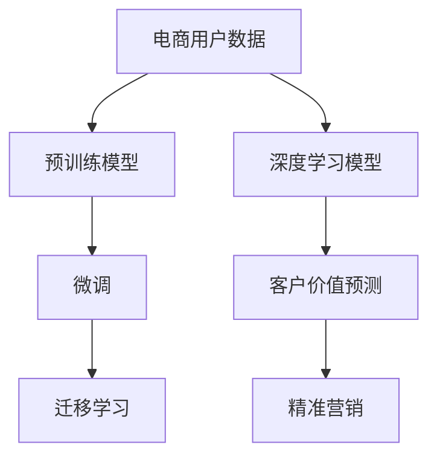

                 

## 1. 背景介绍

### 1.1 问题由来
随着电商市场的快速发展，各大电商平台纷纷通过数据分析驱动的智能决策，提升客户体验和运营效率。传统的电商营销方式基于简单的行为统计和历史用户数据，难以实现精准、个性化的客户价值预测和推荐。而通过深度学习和预训练模型进行电商智能客户价值的预测与精准营销，能够大幅提升电商平台的运营效果和用户满意度。

### 1.2 问题核心关键点
智能客户价值预测与精准营销的核心在于将电商用户数据和行为转化为对用户价值的精准评估，并据此制定个性化的推荐策略和营销方案。这需要从多个维度提取用户特征，建立深度学习模型，通过大量标注数据对模型进行微调，实现对客户价值的预测。

### 1.3 问题研究意义
构建基于深度学习模型的电商智能客户价值预测与精准营销系统，能够有效提升电商平台的运营效率和用户满意度。通过更精准的客户细分和个性化推荐，电商平台可以制定更有效的营销策略，减少无效广告支出，提高销售额和客户留存率。

## 2. 核心概念与联系

### 2.1 核心概念概述

在构建电商智能客户价值预测与精准营销系统时，我们需要理解以下几个核心概念及其相互联系：

- **电商智能客户价值预测（Smart Customer Value Prediction, SCVP）**：通过深度学习模型对电商用户的行为数据、交易数据、评价数据等多维数据进行综合分析，预测用户的生命周期价值和未来购买行为。

- **电商精准营销（Precision Marketing in E-Commerce）**：基于客户价值预测结果，制定个性化的营销策略，进行用户推荐和广告投放，提升营销效果和客户转化率。

- **深度学习（Deep Learning）**：使用多层神经网络模型对数据进行学习和建模，学习到数据中深层次的语义和结构化信息。

- **预训练模型（Pre-trained Model）**：通过大规模无标签数据进行预训练，学习到通用的语言或视觉特征，可以作为电商智能客户价值预测的初始化模型。

- **微调（Fine-tuning）**：在预训练模型的基础上，利用电商用户数据的标注信息进行有监督学习，对模型参数进行调整优化，使其更好地适应电商场景。

- **迁移学习（Transfer Learning）**：通过在预训练模型基础上进行微调，将在其他领域学到的知识迁移到电商智能客户价值预测任务中，提升模型的泛化能力和预测准确性。

这些核心概念构成了电商智能客户价值预测与精准营销系统的基础，通过对它们之间联系的理解，可以帮助我们设计出更为高效和准确的预测和推荐系统。

### 2.2 核心概念原理和架构的 Mermaid 流程图



此流程图展示了电商智能客户价值预测与精准营销系统的主要组成和流程。

## 3. 核心算法原理 & 具体操作步骤

### 3.1 算法原理概述

电商智能客户价值预测与精准营销的核心算法流程如下：

1. **数据准备**：收集电商用户的基本信息、历史行为、交易记录等数据。
2. **预训练模型加载**：选择适合的预训练模型，如BERT、GPT等，作为初始化模型。
3. **特征提取**：通过深度学习模型对电商用户数据进行特征提取，生成多维特征向量。
4. **微调优化**：利用电商用户数据，对深度学习模型进行微调，调整模型参数，提升预测准确性。
5. **客户价值评估**：基于微调后的模型，进行客户价值的评估和预测。
6. **精准营销策略制定**：根据客户价值预测结果，制定个性化的营销策略，进行精准推荐和广告投放。

### 3.2 算法步骤详解

#### 3.2.1 数据准备

电商用户数据包括用户基本信息、历史行为、交易记录、评价反馈等多维数据。具体步骤如下：

1. **数据收集**：从电商平台后台收集用户数据，包括用户ID、年龄、性别、地域、浏览记录、购买记录、评价等。
2. **数据清洗**：对缺失值、异常值进行处理，确保数据的质量和完整性。
3. **数据划分**：将数据划分为训练集、验证集和测试集，比例一般为6:2:2。

#### 3.2.2 特征提取

使用深度学习模型对电商用户数据进行特征提取，生成多维特征向量。具体步骤如下：

1. **文本数据编码**：对用户评论、浏览记录等文本数据进行编码，得到向量表示。
2. **图像数据编码**：对用户购买的产品图片进行编码，得到向量表示。
3. **时间序列数据编码**：对用户购买时间、浏览时间等时间序列数据进行编码，得到向量表示。
4. **特征合并**：将上述编码后的向量进行合并，得到电商用户的综合特征向量。

#### 3.2.3 微调优化

利用电商用户数据，对深度学习模型进行微调，调整模型参数，提升预测准确性。具体步骤如下：

1. **模型选择**：选择合适的深度学习模型，如BERT、GPT等，作为初始化模型。
2. **目标定义**：定义电商智能客户价值预测的目标，如预测用户是否未来会购买、预测用户购买的时间、预测用户的生命周期价值等。
3. **模型微调**：利用电商用户数据，对模型进行有监督学习，调整模型参数，提升预测准确性。
4. **验证集评估**：在验证集上评估模型性能，根据评估结果调整超参数，防止过拟合。
5. **测试集评估**：在测试集上评估模型性能，输出最终评估结果。

#### 3.2.4 客户价值评估

基于微调后的模型，进行客户价值的评估和预测。具体步骤如下：

1. **输入数据**：将电商用户的新数据输入微调后的模型。
2. **特征提取**：对新数据进行特征提取，得到向量表示。
3. **预测结果**：利用微调后的模型，对新数据进行预测，得到客户价值的评估结果。
4. **结果输出**：输出预测结果，用于制定个性化的营销策略。

#### 3.2.5 精准营销策略制定

根据客户价值预测结果，制定个性化的营销策略，进行精准推荐和广告投放。具体步骤如下：

1. **策略制定**：根据客户价值预测结果，制定不同的营销策略，如个性化推荐、优惠券、广告投放等。
2. **推荐系统**：利用推荐系统对用户进行个性化推荐，提高用户的购买转化率。
3. **广告投放**：利用广告投放平台，对高价值用户进行精准广告投放，提升广告的ROI。

### 3.3 算法优缺点

电商智能客户价值预测与精准营销算法的优缺点如下：

#### 3.3.1 优点

1. **预测精度高**：利用深度学习和预训练模型，能够从电商用户数据中提取出深层次的语义和结构化信息，提高预测的准确性。
2. **泛化能力强**：通过迁移学习，将在其他领域学到的知识迁移到电商智能客户价值预测任务中，提升模型的泛化能力和预测准确性。
3. **个性化推荐**：通过深度学习模型，对电商用户进行个性化推荐，提高用户的购买转化率和满意度。
4. **高效处理多维数据**：深度学习模型能够高效处理电商用户的多维数据，包括文本、图像、时间序列等，提高预测和推荐的效率。

#### 3.3.2 缺点

1. **对数据依赖性高**：电商智能客户价值预测与精准营销算法对电商用户数据的依赖性较高，数据质量差会影响预测结果的准确性。
2. **计算资源消耗大**：深度学习和预训练模型需要大量的计算资源进行训练和推理，对硬件设备的要求较高。
3. **模型复杂度高**：深度学习模型的结构复杂，训练和推理的计算复杂度高，需要较高的算法和工程能力。
4. **可解释性不足**：深度学习模型往往是"黑盒"系统，难以解释其内部工作机制和决策逻辑。

### 3.4 算法应用领域

电商智能客户价值预测与精准营销算法在以下领域有着广泛的应用：

- **个性化推荐**：利用电商用户的历史行为数据，进行个性化推荐，提升用户的购买转化率。
- **客户细分**：基于电商用户的多维数据，进行客户细分，制定差异化的营销策略。
- **广告投放**：根据客户价值预测结果，进行精准广告投放，提升广告的ROI。
- **风险控制**：对电商用户的风险行为进行预测和监控，防范欺诈和恶意行为。

## 4. 数学模型和公式 & 详细讲解

### 4.1 数学模型构建

假设电商用户的历史数据为 $\mathcal{X}=\{x_1, x_2, ..., x_n\}$，其中 $x_i$ 为电商用户 $i$ 的多维特征向量。电商智能客户价值预测的目标是预测用户 $i$ 的客户价值 $v_i$，定义为：

$$
v_i = f(\boldsymbol{\theta}, \mathbf{x}_i)
$$

其中 $\boldsymbol{\theta}$ 为模型的参数，$f$ 为预测函数。

### 4.2 公式推导过程

以多分类问题为例，假设电商智能客户价值预测的任务是将用户分为高价值用户和低价值用户两类。具体步骤如下：

1. **输入特征**：将电商用户 $i$ 的多维特征向量 $\mathbf{x}_i$ 输入深度学习模型，得到特征表示 $\boldsymbol{h}_i$。
2. **预测输出**：通过输出层对特征表示 $\boldsymbol{h}_i$ 进行分类，得到预测值 $y_i \in \{0, 1\}$。
3. **损失函数**：定义损失函数 $L$ 为交叉熵损失：

$$
L(y_i, \hat{y}_i) = -y_i\log \hat{y}_i - (1-y_i)\log (1-\hat{y}_i)
$$

其中 $\hat{y}_i$ 为模型预测的输出。
4. **反向传播**：通过反向传播算法，计算损失函数 $L$ 对模型参数 $\boldsymbol{\theta}$ 的梯度，更新模型参数：

$$
\boldsymbol{\theta} \leftarrow \boldsymbol{\theta} - \eta \nabla_{\boldsymbol{\theta}}L
$$

其中 $\eta$ 为学习率。

### 4.3 案例分析与讲解

以电商平台的个性化推荐为例，假设电商平台有 $M$ 种商品，每种商品的编号为 $1, 2, ..., M$。电商平台的推荐系统基于用户的历史浏览和购买记录，预测用户对每种商品的评分 $s_i$，从而进行个性化推荐。具体步骤如下：

1. **用户特征提取**：对用户的历史浏览记录和购买记录进行编码，得到用户特征向量 $\mathbf{x}_u$。
2. **商品特征提取**：对商品的属性、评价等进行编码，得到商品特征向量 $\mathbf{x}_m$。
3. **用户商品评分预测**：利用深度学习模型，对用户特征向量 $\mathbf{x}_u$ 和商品特征向量 $\mathbf{x}_m$ 进行预测，得到用户对商品的评分 $s_{um}$。
4. **推荐排序**：根据用户对商品的评分 $s_{um}$，进行推荐排序，推荐给用户评分较高的商品。

## 5. 项目实践：代码实例和详细解释说明

### 5.1 开发环境搭建

为了进行电商智能客户价值预测与精准营销系统的开发，需要搭建Python开发环境。具体步骤如下：

1. **安装Python**：从官网下载并安装Python 3.7以上版本。
2. **安装虚拟环境**：使用 `virtualenv` 工具创建虚拟环境。
3. **安装依赖包**：安装深度学习库（如TensorFlow、PyTorch等）、电商数据分析库（如Pandas、NumPy等）、深度学习模型库（如Keras、TensorFlow Hub等）。

### 5.2 源代码详细实现

以下是使用TensorFlow库进行电商智能客户价值预测的代码实现：

```python
import tensorflow as tf
from tensorflow.keras import layers, models

# 定义深度学习模型
model = models.Sequential([
    layers.Dense(64, activation='relu', input_shape=(input_dim,)),
    layers.Dense(64, activation='relu'),
    layers.Dense(1, activation='sigmoid')
])

# 编译模型
model.compile(optimizer='adam', loss='binary_crossentropy', metrics=['accuracy'])

# 训练模型
model.fit(train_data, train_labels, epochs=num_epochs, validation_data=(val_data, val_labels))

# 预测客户价值
predictions = model.predict(test_data)

# 输出预测结果
print(classification_report(test_labels, predictions > 0.5))
```

### 5.3 代码解读与分析

**代码解读**：

- **模型定义**：使用TensorFlow的Sequential模型，定义了三层神经网络结构，其中第一层和第二层为全连接层，激活函数为ReLU，输出层为sigmoid激活函数，用于二分类预测。
- **模型编译**：定义了优化器（Adam）、损失函数（二分类交叉熵）和评估指标（准确率）。
- **模型训练**：使用训练数据和标签进行模型训练，设置迭代次数为num_epochs。
- **模型评估**：在验证数据上评估模型性能，输出预测结果。
- **预测客户价值**：对测试数据进行预测，输出二分类预测结果。
- **结果输出**：使用sklearn的classification_report对预测结果进行评估，输出分类报告。

**分析**：

- **模型结构**：深度学习模型采用三层全连接神经网络，每一层都具有64个神经元，激活函数为ReLU。输出层采用sigmoid激活函数，用于二分类预测。
- **损失函数**：交叉熵损失函数适用于二分类问题，可以衡量预测结果与真实标签之间的差异。
- **评估指标**：准确率是评估模型性能的重要指标，可以反映模型在预测上的效果。
- **训练过程**：模型训练过程中，采用Adam优化器，逐步调整模型参数，最小化损失函数。

## 6. 实际应用场景

### 6.1 智能客服系统

电商智能客户价值预测与精准营销系统可以应用于智能客服系统，提升客户体验和满意度。具体步骤如下：

1. **数据收集**：收集电商用户的历史浏览记录、购买记录、评价记录等数据。
2. **特征提取**：对用户数据进行编码，生成特征向量。
3. **客户价值预测**：利用电商智能客户价值预测模型，预测用户的客户价值。
4. **智能客服推荐**：根据用户价值，制定智能客服推荐策略，提高用户满意度。

### 6.2 个性化推荐系统

电商智能客户价值预测与精准营销系统可以应用于个性化推荐系统，提升用户的购买转化率和满意度。具体步骤如下：

1. **数据收集**：收集电商用户的历史浏览记录、购买记录、评价记录等数据。
2. **特征提取**：对用户数据进行编码，生成特征向量。
3. **客户价值预测**：利用电商智能客户价值预测模型，预测用户的客户价值。
4. **个性化推荐**：根据用户价值，制定个性化的推荐策略，提高用户的购买转化率和满意度。

### 6.3 广告投放系统

电商智能客户价值预测与精准营销系统可以应用于广告投放系统，提升广告的ROI。具体步骤如下：

1. **数据收集**：收集电商用户的历史浏览记录、购买记录、评价记录等数据。
2. **特征提取**：对用户数据进行编码，生成特征向量。
3. **客户价值预测**：利用电商智能客户价值预测模型，预测用户的客户价值。
4. **广告投放**：根据用户价值，制定精准的广告投放策略，提高广告的ROI。

### 6.4 未来应用展望

随着电商市场的不断扩大和电商智能客户价值预测与精准营销技术的发展，未来将有更多的应用场景和应用模式：

1. **实时客户价值评估**：利用深度学习模型对实时数据进行客户价值预测，动态调整推荐策略和广告投放。
2. **多渠道协同推荐**：将电商智能客户价值预测与精准营销系统与社交媒体、搜索引擎等渠道进行协同推荐，提升推荐效果和用户满意度。
3. **智能客服多模态交互**：将电商智能客户价值预测与精准营销系统与智能客服系统进行集成，提升智能客服的交互效果和用户体验。
4. **个性化内容生成**：利用深度学习模型对用户数据进行分析和预测，生成个性化内容，提升用户的参与度和满意度。

## 7. 工具和资源推荐

### 7.1 学习资源推荐

为了帮助开发者系统掌握电商智能客户价值预测与精准营销技术，这里推荐一些优质的学习资源：

1. **TensorFlow官方文档**：TensorFlow官方文档提供了丰富的教程和示例，可以帮助开发者快速上手TensorFlow的深度学习开发。
2. **Keras官方文档**：Keras官方文档提供了简单易懂的深度学习教程和示例，可以帮助开发者快速构建深度学习模型。
3. **Pandas官方文档**：Pandas官方文档提供了强大的数据分析功能，可以帮助开发者进行数据处理和特征提取。
4. **NLP相关书籍**：如《深度学习与自然语言处理》、《自然语言处理综论》等书籍，可以帮助开发者深入了解自然语言处理和深度学习技术。
5. **在线课程**：如Coursera上的《Deep Learning Specialization》、Udacity上的《Deep Learning Nanodegree》等课程，可以帮助开发者系统学习深度学习技术。

### 7.2 开发工具推荐

电商智能客户价值预测与精准营销系统的开发，离不开以下工具的支持：

1. **TensorFlow**：TensorFlow是Google开源的深度学习框架，支持分布式计算和动态图计算，适合构建深度学习模型。
2. **Keras**：Keras是TensorFlow的高层接口，提供了简单易用的深度学习API，适合快速开发深度学习模型。
3. **Pandas**：Pandas是Python的数据分析库，提供了强大的数据处理和特征提取功能。
4. **NumPy**：NumPy是Python的科学计算库，提供了高效的数值计算和矩阵操作功能。
5. **Jupyter Notebook**：Jupyter Notebook是Python的交互式编程环境，适合进行数据探索和模型开发。

### 7.3 相关论文推荐

电商智能客户价值预测与精准营销技术的发展，源于学界的持续研究。以下是几篇奠基性的相关论文，推荐阅读：

1. **Attention is All You Need**：Transformer模型原论文，提出了自注意力机制，开启了深度学习模型的新范式。
2. **BERT: Pre-training of Deep Bidirectional Transformers for Language Understanding**：BERT模型原论文，提出了基于掩码的自监督预训练方法，刷新了多项NLP任务SOTA。
3. **Parameter-Efficient Transfer Learning for NLP**： Adapter等参数高效微调方法的提出，显著提升了微调的效率和效果。
4. **Prefix-Tuning: Optimizing Continuous Prompts for Generation**：Prefix-Tuning方法的提出，显著提升了深度学习模型的生成效果。
5. **AdaLoRA: Adaptive Low-Rank Adaptation for Parameter-Efficient Fine-Tuning**：AdaLoRA方法的提出，显著提升了微调的效率和效果。

## 8. 总结：未来发展趋势与挑战

### 8.1 总结

本文对基于深度学习的电商智能客户价值预测与精准营销技术进行了全面系统的介绍。首先阐述了电商智能客户价值预测与精准营销的重要性和应用场景，明确了预测与推荐系统的核心目标。其次，从原理到实践，详细讲解了电商智能客户价值预测与精准营销的数学模型和算法流程，给出了系统开发的完整代码实例。最后，探讨了电商智能客户价值预测与精准营销技术在电商客服、个性化推荐、广告投放等领域的广泛应用前景，展示了该技术的巨大潜力。

通过本文的系统梳理，可以看到，电商智能客户价值预测与精准营销技术正在成为电商领域的重要范式，极大地提升了电商平台的运营效率和用户满意度。未来，伴随深度学习技术和电商市场的进一步发展，该技术必将在更广泛的场景下发挥其巨大的价值。

### 8.2 未来发展趋势

展望未来，电商智能客户价值预测与精准营销技术将呈现以下几个发展趋势：

1. **数据驱动**：随着电商市场的不断扩大，数据的规模和质量将不断提升，电商智能客户价值预测与精准营销技术将更加依赖于数据驱动。
2. **实时预测**：实时数据流的引入，使得电商智能客户价值预测与精准营销技术能够进行实时预测和动态调整，提升用户体验和营销效果。
3. **多渠道协同**：电商智能客户价值预测与精准营销系统将与社交媒体、搜索引擎等渠道进行协同推荐，提升推荐效果和用户满意度。
4. **个性化推荐**：基于用户的多维数据，进行更加个性化的推荐，提升用户的购买转化率和满意度。
5. **智能客服**：电商智能客户价值预测与精准营销系统将与智能客服系统进行集成，提升智能客服的交互效果和用户体验。
6. **智能广告投放**：电商智能客户价值预测与精准营销系统将与广告投放系统进行集成，提升广告的ROI。

### 8.3 面临的挑战

尽管电商智能客户价值预测与精准营销技术已经取得了一定的进展，但在迈向更加智能化、普适化应用的过程中，它仍面临着诸多挑战：

1. **数据质量问题**：电商智能客户价值预测与精准营销技术对电商用户数据的质量和完整性要求较高，数据缺失和异常值会影响预测结果的准确性。
2. **模型复杂性**：深度学习模型结构复杂，训练和推理的计算复杂度高，需要较高的算法和工程能力。
3. **可解释性不足**：深度学习模型往往是"黑盒"系统，难以解释其内部工作机制和决策逻辑。
4. **资源消耗大**：深度学习和预训练模型需要大量的计算资源进行训练和推理，对硬件设备的要求较高。

### 8.4 研究展望

面对电商智能客户价值预测与精准营销技术面临的挑战，未来的研究需要在以下几个方面寻求新的突破：

1. **数据增强**：通过数据增强技术，提升电商智能客户价值预测与精准营销模型的泛化能力，解决数据质量问题。
2. **模型优化**：研究更加高效和轻量级的深度学习模型，降低计算资源消耗，提升模型的实时性和可扩展性。
3. **可解释性增强**：引入可解释性技术，提高深度学习模型的可解释性和透明性。
4. **实时预测系统**：研究实时预测系统，提升电商智能客户价值预测与精准营销技术的实时性和动态性。
5. **多模态融合**：研究多模态融合技术，将电商智能客户价值预测与精准营销系统与视觉、语音等模态数据进行融合，提升系统的综合能力。

总之，电商智能客户价值预测与精准营销技术需要在数据、算法、工程等方面进行全面的优化和提升，才能真正实现其在大电商领域的广泛应用，为电商平台的运营效率和用户满意度带来显著提升。

## 9. 附录：常见问题与解答

**Q1：电商智能客户价值预测与精准营销技术有哪些优点？**

A: 电商智能客户价值预测与精准营销技术的优点如下：

1. **预测精度高**：通过深度学习和预训练模型，能够从电商用户数据中提取出深层次的语义和结构化信息，提高预测的准确性。
2. **泛化能力强**：通过迁移学习，将在其他领域学到的知识迁移到电商智能客户价值预测任务中，提升模型的泛化能力和预测准确性。
3. **个性化推荐**：通过深度学习模型，对电商用户进行个性化推荐，提高用户的购买转化率和满意度。
4. **高效处理多维数据**：深度学习模型能够高效处理电商用户的多维数据，包括文本、图像、时间序列等，提高预测和推荐的效率。

**Q2：电商智能客户价值预测与精准营销技术有哪些缺点？**

A: 电商智能客户价值预测与精准营销技术的缺点如下：

1. **对数据依赖性高**：电商智能客户价值预测与精准营销技术对电商用户数据的依赖性较高，数据质量差会影响预测结果的准确性。
2. **计算资源消耗大**：深度学习和预训练模型需要大量的计算资源进行训练和推理，对硬件设备的要求较高。
3. **模型复杂度高**：深度学习模型结构复杂，训练和推理的计算复杂度高，需要较高的算法和工程能力。
4. **可解释性不足**：深度学习模型往往是"黑盒"系统，难以解释其内部工作机制和决策逻辑。

**Q3：电商智能客户价值预测与精准营销技术在电商领域的应用有哪些？**

A: 电商智能客户价值预测与精准营销技术在电商领域的应用如下：

1. **个性化推荐**：利用电商用户的历史行为数据，进行个性化推荐，提升用户的购买转化率。
2. **客户细分**：基于电商用户的多维数据，进行客户细分，制定差异化的营销策略。
3. **广告投放**：根据客户价值预测结果，进行精准广告投放，提升广告的ROI。
4. **风险控制**：对电商用户的风险行为进行预测和监控，防范欺诈和恶意行为。

**Q4：电商智能客户价值预测与精准营销技术的未来发展方向有哪些？**

A: 电商智能客户价值预测与精准营销技术的未来发展方向如下：

1. **实时预测**：利用实时数据流，进行实时预测和动态调整，提升用户体验和营销效果。
2. **多渠道协同**：将电商智能客户价值预测与精准营销系统与社交媒体、搜索引擎等渠道进行协同推荐，提升推荐效果和用户满意度。
3. **智能客服**：将电商智能客户价值预测与精准营销系统与智能客服系统进行集成，提升智能客服的交互效果和用户体验。
4. **智能广告投放**：将电商智能客户价值预测与精准营销系统与广告投放系统进行集成，提升广告的ROI。

**Q5：电商智能客户价值预测与精准营销技术的实现难点有哪些？**

A: 电商智能客户价值预测与精准营销技术的实现难点如下：

1. **数据质量问题**：电商智能客户价值预测与精准营销技术对电商用户数据的质量和完整性要求较高，数据缺失和异常值会影响预测结果的准确性。
2. **模型复杂性**：深度学习模型结构复杂，训练和推理的计算复杂度高，需要较高的算法和工程能力。
3. **可解释性不足**：深度学习模型往往是"黑盒"系统，难以解释其内部工作机制和决策逻辑。
4. **资源消耗大**：深度学习和预训练模型需要大量的计算资源进行训练和推理，对硬件设备的要求较高。

**Q6：如何提升电商智能客户价值预测与精准营销技术的可解释性？**

A: 提升电商智能客户价值预测与精准营销技术的可解释性，可以从以下几个方面入手：

1. **特征可视化**：对电商用户数据进行可视化，直观展示特征之间的关系和重要性。
2. **模型解释器**：引入模型解释器技术，如LIME、SHAP等，对模型的决策过程进行解释和可视化。
3. **可解释性损失**：在模型训练过程中，加入可解释性损失，提升模型的可解释性。
4. **知识图谱**：将电商领域的知识和规则编码为知识图谱，与深度学习模型进行融合，提高模型的可解释性和透明性。

**Q7：电商智能客户价值预测与精准营销技术在电商领域的应用前景如何？**

A: 电商智能客户价值预测与精准营销技术在电商领域的应用前景如下：

1. **提升运营效率**：通过智能客户价值预测与精准营销技术，提升电商平台的运营效率，减少无效广告支出，提高销售额和客户留存率。
2. **提升用户体验**：利用个性化推荐和智能客服技术，提升用户的购物体验和满意度。
3. **增强市场竞争力**：通过精准广告投放和客户细分，提升电商平台的市场竞争力和品牌影响力。
4. **推动产业升级**：将电商智能客户价值预测与精准营销技术应用于各个产业，推动产业升级和数字化转型。

**Q8：电商智能客户价值预测与精准营销技术在电商领域的应用难点有哪些？**

A: 电商智能客户价值预测与精准营销技术在电商领域的应用难点如下：

1. **数据质量问题**：电商智能客户价值预测与精准营销技术对电商用户数据的质量和完整性要求较高，数据缺失和异常值会影响预测结果的准确性。
2. **模型复杂性**：深度学习模型结构复杂，训练和推理的计算复杂度高，需要较高的算法和工程能力。
3. **可解释性不足**：深度学习模型往往是"黑盒"系统，难以解释其内部工作机制和决策逻辑。
4. **资源消耗大**：深度学习和预训练模型需要大量的计算资源进行训练和推理，对硬件设备的要求较高。

**Q9：电商智能客户价值预测与精准营销技术的开发难点有哪些？**

A: 电商智能客户价值预测与精准营销技术的开发难点如下：

1. **数据质量问题**：电商智能客户价值预测与精准营销技术对电商用户数据的质量和完整性要求较高，数据缺失和异常值会影响预测结果的准确性。
2. **模型复杂性**：深度学习模型结构复杂，训练和推理的计算复杂度高，需要较高的算法和工程能力。
3. **可解释性不足**：深度学习模型往往是"黑盒"系统，难以解释其内部工作机制和决策逻辑。
4. **资源消耗大**：深度学习和预训练模型需要大量的计算资源进行训练和推理，对硬件设备的要求较高。

**Q10：电商智能客户价值预测与精准营销技术的未来趋势是什么？**

A: 电商智能客户价值预测与精准营销技术的未来趋势如下：

1. **实时预测**：利用实时数据流，进行实时预测和动态调整，提升用户体验和营销效果。
2. **多渠道协同**：将电商智能客户价值预测与精准营销系统与社交媒体、搜索引擎等渠道进行协同推荐，提升推荐效果和用户满意度。
3. **智能客服**：将电商智能客户价值预测与精准营销系统与智能客服系统进行集成，提升智能客服的交互效果和用户体验。
4. **智能广告投放**：将电商智能客户价值预测与精准营销系统与广告投放系统进行集成，提升广告的ROI。

总之，电商智能客户价值预测与精准营销技术需要在数据、算法、工程等方面进行全面的优化和提升，才能真正实现其在大电商领域的广泛应用，为电商平台的运营效率和用户满意度带来显著提升。

